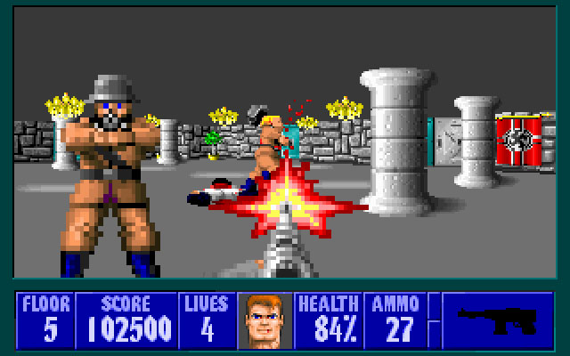
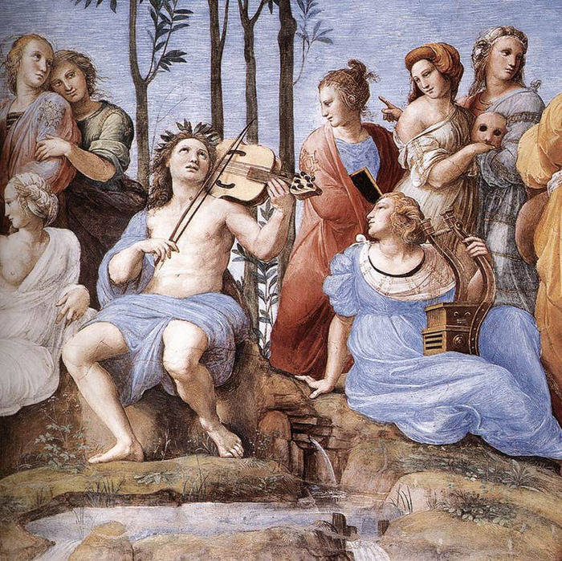
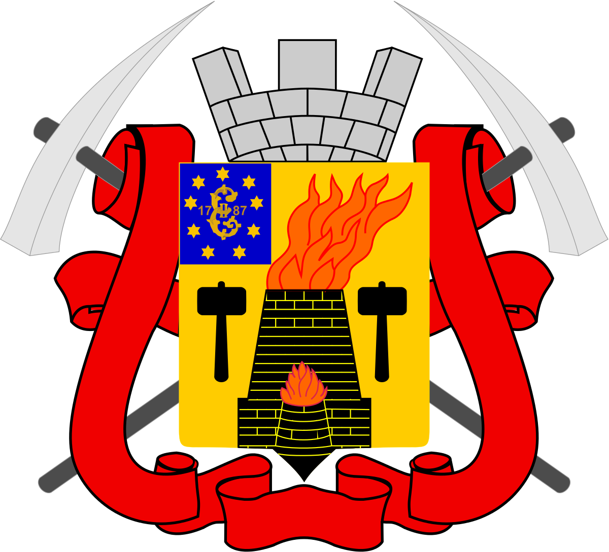
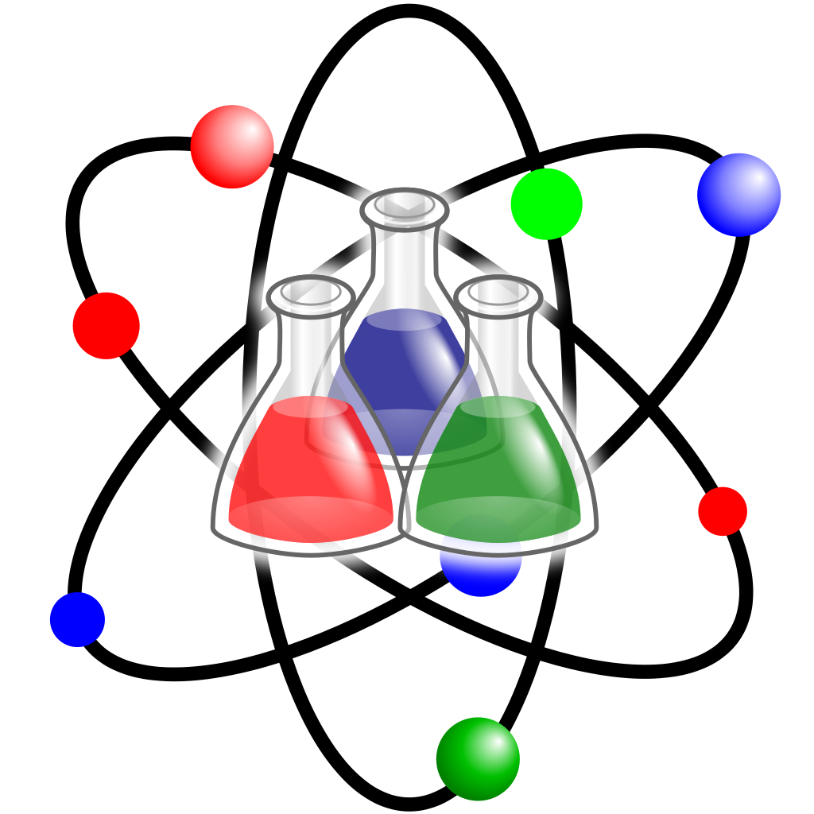
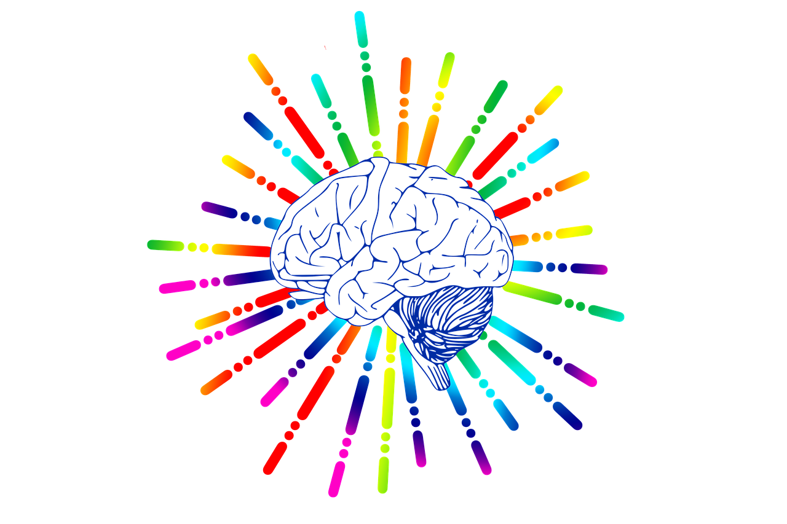

# MyWiki

*   [_templates](_templates/index.md)
*   [Игры](Игры/index.md)
    *   
    *   Что наша жизнь - игра…
*   [Искусство](Искусство/index.md)
    *   
    *   Статьи об искусстве и творчестве
*   [История](История/index.md)
    *   
    *   В детстве у меня была таблица для сравнения разных исторических событий - какие из них произошли раньше, а какие позже. К тому же этот проект поможет мне пополнить отсутствие знаний по истории.
*   [Культура](Культура/index.md)
*   [Луганск](Луганск/index.md)
    *   
    *   Луганск - моя родина и я, черт возьми, люблю этот город
*   [Менеджмент](Менеджмент/index.md)
    *   
*   [Миры](Миры/index.md)
    *   Эти миры, созданные исключительно фантазией их авторов, получились настолько красивыми и интересными, что многим бы хотелось, чтобы они существовали в реальности. К сожалению, экскурсия по ним возможна только виртуальная.
*   [Наука](Наука/index.md)
    *   
    *   Материалы по точным наукам
*   [Паранаучное](Паранаучное/index.md)
    *   
    *   Всякие ненаучные, псевдонаучные и паранаучные исследования
*   [Природа](Природа/index.md)
    *   
    *   Этот проект является отражением моих увлечений биологией. Все, что касается растений, животных и всего живого на земле отправится в этот проект
*   [Психология](Психология/index.md)
    *   
*   [Работа](Работа/index.md)
    *   
*   [Техника](Техника/index.md)
    *   
*   [Цитаты](Цитаты/index.md)
    *   
    *   Цитаты и афоризмы
*   [Экономика](Экономика/index.md)
    *   
*   [Юмор](Юмор/index.md)
    *   
    *   Разные приколы
*   [Языки](Языки/index.md)
    *   
    *   Полезно иногда знать иностранные языки