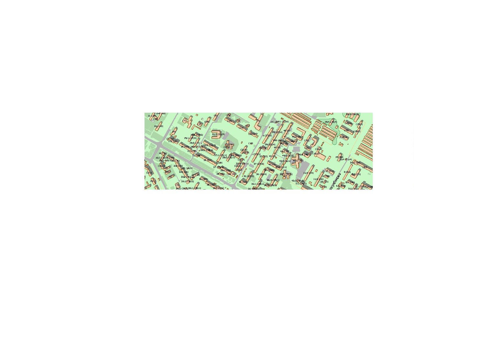
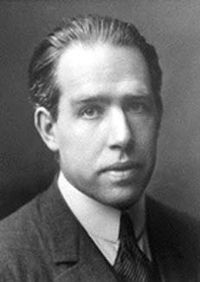
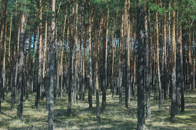
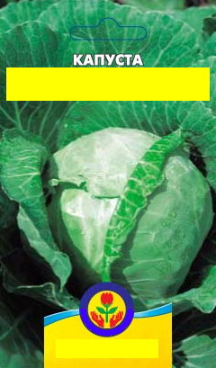
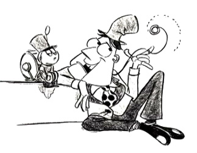
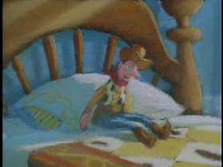
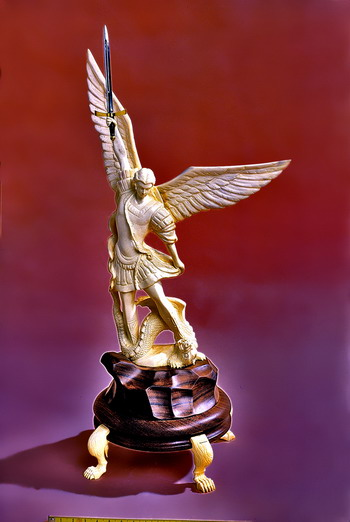
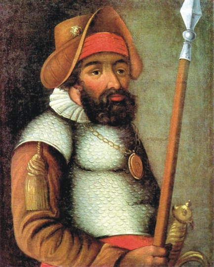
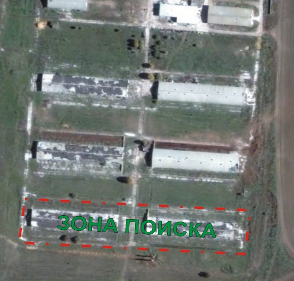
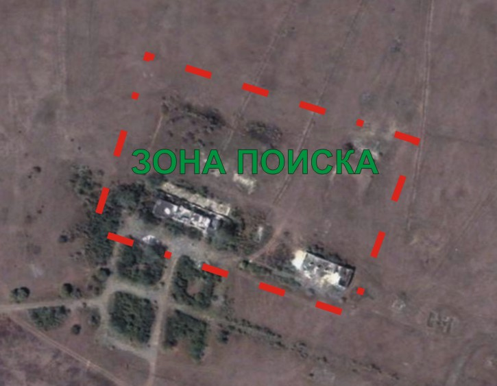

# Идеи

## 1

Итак, приступим ....
Для опоздавших напомню, что тема нашей сегодняшней игры География

Давайте проверим как вы выполнили домашнее задание и назовём город который был загадан в анонсе игры:

### Подсказка №1 для всех (20 м.)

слово разбито на 3 части:

1. Флаг без первой и последней буквы В котором расположены Д И
2. Буква О в которой число 100
3. Кубок с указаниями, что и этого слова вычесть

### Подсказка №2 для всех (1 ч.)

в ЛА ДИ, в О СТО , К

### Коды

Владивосток

## 2

### Подсказка №1 для всех (20 м.)

Подобная черта обычно означает "на", "над" или "под"

### Подсказка №2 для всех (40 м.)

К
над
А

### Коды

Канада

## 3

### Подсказка №1 для всех (20 м.)

Карту со стрелками обычно называют планом.

### Коды

Непал

## 4

### Подсказка №1 для всех (20 м.)

Гора - Монте

### Коды

Монтевидео

## 5

### Подсказка №1 для всех (20 м.)

Компьютерная сеть - lan (лан)

### Коды

Милан

## 6

### Подсказка №1 для всех (20 м.)

Три пилотки

### Коды

Триполи

## 7

### Подсказка №1 для всех (20 м.)

Кружок в букве А - это шар

### Коды

Варшава

## 8

### Подсказка №1 для всех (20 м.)

На рисунке СВИН :) (ХРУ-ХРУ)

### Коды

Виннипег

## 9

### Подсказка №1 для всех (20 м.)

На переднем плане ЭТИ гуси, нас они не интересуют.

### Коды

Тегусигальпа

## 10

### Подсказка №1 для всех (20 м.)

Какая же это луна ... а где же кратеры ?

### Коды

Марсель

## 11

### Подсказка №1 для всех (20 м.)

2*2*2 = 8

### Коды

Куба

## 12

### Подсказка №1 для всех (20 м.)

# 13 = Enter

### Коды

Мальта

## 13

### Подсказка №1 для всех (20 м.)

Каждый символ - буква, попробуйте дорисовать все символы до одного, общего для всех.

### Коды

Египет

## 14

### Подсказка №1 для всех (20 м.)

Мужик сидит возле здоровенного гарпуна - кто он ?

### Коды

Кито

## 15

### Подсказка №1 для всех (20 м.)

Б и Я где ?

### Коды

Замбия

## 16

### Коды

Ростов

## 17

### Подсказка №1 для всех (20 м.)

Половина чего ?

### Коды

Полтава

## 18

### Подсказка №1 для всех (20 м.)

Ctrl-A

### Коды

Надым

## 19

### Подсказка №1 для всех (20 м.)

Я зашел как-то на ENcounter и уровень родился сам собой ...

(для тех кто перебирает - это где-то в Европе)

### Подсказка №2 для всех (40 м.)

Так получилось, что в тот момент залогинены были только ГР и я ...

(для тех кто не устал перебирать - это Европейская страна)

### Коды

Венгрия

## 20

Ну вот и закончился наш урок Географии, всем спасибо за внимание!

Теперь я сажусь за парту, а вы берёте в руки журнал и ствите оценки :)

Для перехода на следующий уровень вспомните как по-немецки будет "Мыться-Мыться" :)

### Подсказка №1 для всех (20 м.)

А много вы знаете городов состоящих из 2х одинаковых слов?

### Коды

Баден-баден

## 21

А теперь два обещаных бонусных уровня из будущей игры про Современный Интернет.

Современный Интернет уже сложно представить без блогов которые заменили домашние странички и гостевые книги , без приложений на Web 2.0 платформе лидером в продвижении которой стал Google, без проектов Wikipedia, Digg, Flickr, News 2.0 где контент формируют сами пользователи.

И конечно же без нового сленга, который уже порядком всем поднадоел, но прочно засел в подсознании Интернетозависимых граждан.

Этому слэнгу мы и посвятим эти два бонусных уровня, которые войдут в нашу будущую игру ... (шутка)

И слэнг этот, оказывается, появился задолго до изобретения компьютера.

Вопрос:  Что человек, когда он занят только сном и едой,  по версии В.Шекспира ?

Ответ: на языке оригинала со знаком препинания

### Подсказка №1 для всех (20 м.)

Вопрос этот прозвучал в Гамлет-е.

### Подсказка №2 для всех (40 м.)

<http://soft.rosinstrument.com/cgi-bin/st/Literature/english/1600-1699/shakespeare-hamlet-25.txt-ps100-pn7?pt=a+beast>

### Коды

a beast, no more

## 22

Современная рекламация на неработающий DVD-RW привод.

Формат ответа: [2 слова на русском, знак препинания, 1 слово русскими буквами]

p.s. А еще эту фразу с удовольствием произнесут те, кому это игра не понравилась ;)

### Подсказка №1 для всех (20 м.)

Неработающий DVD-RW привод может, например, не записывать(жечь) диски.

А остальные слова в Интеренет слэнге часто формируются встаффкой новых букав и/или изменением окнончаний, йасна ?

### Коды

не жжот, сцуко

## 1

Здравствуйте.

Это маленький таймаут, чтобы слегка опаздывающие могли подтянуться.

В подсказке через 4 минуты будет код для прохождения.

Впрочем, вы можете попробовать его подобрать.

Всем удачной игры.

Небольшая подсказка. Большинство поиска на этой игре хорошо осуществляется в Google, но на некоторых уровнях Яндекс намного эффективнее.

### Подсказка №1 для всех (1 м.)

В коде всего 4 цифры.

### Коды

1961

## 2

Ну "Поехали!" же, вот и год-код - 1961.

Задание на этом и почти всех следующих уровнях появится в первой подсказке через 30 секунд.

### Подсказка №1 для всех (30 с.)

Формат ответа: 4 полных имени через пробел.

### Подсказка №2 для всех (7 м.)

Первые двое - Леонов и Николаев.

### Подсказка №3 для всех (17 м.)

Певица с "Фабрики Звезд"

### Подсказка №4 для всех (25 м.)

Назвать нужно имена советских космонавтов - однофамильцев изображенных людей.

### Подсказка №5 для всех (30 м.)

3 - Игрок Спартака. Обратите еще внимание, что у него за повязка.

### Подсказка №6 для всех (40 м.)

Леонов, Николаев, Титов, Гагарин

### Коды

Алексей Андриан Герман Юрий

## 3

На фотографиях были однофамильцы советских космонавтов - Леонов, Николаев, Титов и Гагарина.

### Подсказка №1 для всех (30 с.)

В СССР с особой щепитильностью относились к именам и названиям. Потому, что наши бренды были лицом державы и должны были вызывать у потребителя гордость и увереность.

Вспомните названия наших предприятий военно-промышленного комплекса: Звезда, Взлёт, Центр, Арсенал. А как назывались обыкновенные фабрики: Заря Коммунизма, Большевик, Красный Октябрь, Победа. Но нас, обыкновенных граждан, больше удивляли не пафосные названия предприятий, а название выпускаемой ими продукции.

А что объединило в СССР их:

?

Формат ответа: существительное в именительном падеже

### Подсказка №2 для всех (8 м.)

Останкино. Шахтёр. Доктор.

### Подсказка №3 для всех (20 м.)

Останкинская, Шахтёрская ... но лучше конечно Докторская

## Бонус №1 для всех

Задание А кто догадался о чём речь - введите еще одно популярное название.

Приз: +2 минуты

### Ответы

любительская

## 4

Тут все просто - колбаса Останкинская, Шахтерская, Докторская. И Любительская.

### Подсказка №1 для всех (30 с.)

В этом задании есть замены. Просто некоторые слова мы заменили другими, без особого смысла, но с сохранением структуры предложений.

Результат вычисления равен X зеленых попугаев. Вообще-то те попугаи давно уже вымерли, но у них есть прямые потомки, о них и поговорим.

Несложно найти, сколько попугаев в удаве

Всем известно, какое круглое число мартышек в удаве

Нам неизвестно, водятся ли где-нибудь зеленые удавы, но в Бразилии в 2002 году точно завелись зеленые мартышки

Не так уж сложно найти, что X зеленых попугаев = Y зеленых бразильских мартышек

Чему равен Y?

Формат ответа: число Y, по правилам округленное до целых

### Подсказка №2 для всех (8 м.)

Если вы еще не догадались: цвета соответствуют купюрам СССР.

### Подсказка №3 для всех (17 м.)

Не забудьте о правилах работы с "физическими величинами".

### Подсказка №4 для всех (25 м.)

Более мелкие купюры имели раскраску с узором, а более крупные - однородную.

Что за страну мы заменили Бразилией, ищите в Яндекс.

### Подсказка №5 для всех (40 м.)

Удавы - доллары, мартышки - центы.

страна

### Подсказка №6 для всех (45 м.)

При умножении рубля на рубль получается Квадратный рубль, так что зеленый = квадратный

### Подсказка №7 для всех (50 м.)

Если еще не разобрались с банкнотами: <http://goldtaler.narod.ru/bank_papers/bank_papers_USSR_1961.html>

Если нашли X, теперь несложно найти правильный ответ, задав правильный вопрос.

### Подсказка №8 для всех (1 ч.)

X = 1523

Калькулятор Google вам в помощь

### Подсказка №9 для всех (1 ч. 15 м.)

ищется вот так

## Бонус №1 для всех

Задание Проверка числа X

Подсказа X = 1523

Ответы 1523

### Коды

29631
29380

## 5

Применяя арифметические операции к номиналам советских банкнот, можно было получить 1523 квадратных рубля.

В Австралии в 2002 году появились квадратные (в буквальном смысле) центы.

Калькулятор Google чудесно переводит квадратные российские рубли в квадратные австралийские центы.

### Подсказка №1 для всех (30 с.)

В Америке может быть таким, таким, таким или, например, таким.

А в СССР было таким.

Что же и каким?

Формат ответа: "золотое кольцо".

### Подсказка №2 для всех (12 м.)

2 океана (конкретных), горы (просто горы)...

### Подсказка №3 для всех (25 м.)

Тихоокеанское, Центральное...

### Коды

декретное время

## 6

В США время бывает Тихоокеанским, Центральным, Горным, Атлантическим.

А в СССР было декретным.

### Подсказка №1 для всех (30 с.)

Плакаты советского времени вообще отдельная история...

На 4 плакатах времён Второй Мировой войны мы закрыли некоторые буквы:

В ответе укажите буквы, закрытые красным.

Формат ответа: только закрытые группы букв в порядке следования плакатов через пробел.

### Подсказка №2 для всех (10 м.)

1. Внизу "Слава сталинском соколам"

### Подсказка №3 для всех (20 м.)

4. Серым закрыт перевод двух немецких слов выше.

### Подсказка №4 для всех (30 м.)

3. Серым скрыто БЕДИ

### Подсказка №5 для всех (40 м.)

1. "... - оружие героев"

### Коды

таран засуху гостин на запад

## 7

Советские плакаты: Таран - оружие героев, И засуху победим, Наш краснофлотский гостинец (а не то, что вы подумали), На Запад! (а написан на указателе немецкий призыв На Восток).

### Подсказка №1 для всех (30 с.)

Что такое y?

Формат ответа: 2 слова.

### Подсказка №2 для всех (20 м.)

x = 287

x и y - не просто числа, за ними кое-что стоит

### Подсказка №3 для всех (40 м.)

Конечно на 3 делится! Еще как!

За 2.87 купить бутылку водки...

### Подсказка №4 для всех (50 м.)

И на 13 копеек плавленый сырок

### Коды

сырок "Дружба"

## 8

Если решить систему (написать программу или исходя из соображений делимости), получается x = 287, y = 13. 2.87 - бутылка водки, а на 13 копеек плавленый сырок. Конечно же делится на 3!

Поиграем с вами в не совсем советскую игру «Угадай мелодию».

Суть как и в телепередаче – мы вам кратенько пересказываем смысл известной песни советских времен, а вы называете то, что спросили – где исполнителя, где название, где еще что.

В каждом бонусе по 1 песне. Открывая бонус, вы получите слово (иногда с предлогом) в начальной форме. Расставленные в правильном порядке и согласованные, эти слова образуют "перевертыш" еще одной советской песни.

Перевертыш - это когда почти все слова заменяются на противоположные по смыслу.

В ответе нужно указать литературное произведение 1970-х годов, в котором приведен один из вариантов этой последней песни.

Формат ответа: название без кавычек.

### Подсказка №1 для всех (15 м.)

1. Не ходи к нему...
2. 10 месяц - ...

### Подсказка №2 для всех (30 м.)

3. Принцип - "И последние станут первыми"
4. Титаник вот подтвердит

### Подсказка №3 для всех (45 м.)

5. В другую сторонУ она пошла.
6. В начале... то есть С чего...

### Подсказка №4 для всех (1 ч.)

В лесу свистели транспортёры, студенты плыли в первый гёрл

### Подсказка №5 для всех (1 ч. 15 м.)

На поле танки грохотали...

## Бонус №1 для всех

Молодой человек отговаривает свою бывшую девушку от свидания с другим, мотивируя это тем, что другой имеет серьезную аномалию строения внутренних орагнов.

Назовите группу.

### Подсказка

Свистеть

### Ответы

божья коровка

## Бонус №2 для всех

Непрекращающаяся битва сопровождается психовегетативными явлениями. К чему-то упоминается возраст десятого ("восьмого").

Назовите три первых слова.

### Подсказка

Гёрл

### Ответы

неба утреннего стяг

## Бонус №3 для всех

Создание нового порядка на останках старого повлечет воплощение проиллюстрированного в начале 20 главы одного из Евангелий принципа.

Название песни.

### Подсказка

В первый

### Ответы

интернационал

## Бонус №4 для всех

Песня о пользе теоретического знакомства с потенциальной опасностью, несомой плавсресдствам свободно плавающим куском льда.

Назовите фамилию автора слов.

### Подсказка

Студент

### Ответы

козлова

## Бонус №5 для всех

Их пути разошлись. Она, судя по всему, отправилась на восток.

Фамилию автора музыки.

### Подсказка

Транспортёр

### Ответы

покрасс

## Бонус №6 для всех

Вначале было не слово, а изображение, группа сверстников, вокальный номер, и т.д., и т.п.

Фильм, для которого была написана песня.

### Подсказка

Плыть

### Ответы

щит и меч

## Бонус №7 для всех

Песня-прощание с тем, кто возвращается в свой нереальный ареал обитания.

В каком году написана песня и кто автор слов (фамилия)?

### Подсказка

В лесу

### Ответы

1980 добронравов

### Коды

На войне как на войне

### 9

Были загаданы песни

"Гранитный кумушек в груди"
"И вновь продолжается бой"
"Интернационал" ("Кто был последним - станет первым")
"Айсберг"
"Дан приказ ему на Запад, ей в другую сторонУ"
"Олимпийская" ("До свиданья, наш ласковый Миша, возвращайся в свой сказочный лес")

Перевертыш - В лесу свистели транспортёры, студенты плыли в первый гёрл - На поле танки грохотали, солдаты шли в последний бой.

### Подсказка №1 для всех (1 м.)

Про первого написана песня. Правда, я не слышал, чтоб ее кто-нибудь пел.

Второй был тем же, чем была Питерская река.

Третья - почти фрактальна.

Четвертую стандартизировали в научной работе в 19 веке.

Назовите их все (каждый пункт - одним словом).

### Подсказка №2 для всех (20 м.)

Он там в песне убил кого-то.

NEVA была

Она фрактальна, так как содержит себя в себе.

Тут и подсказывать нечего

### Подсказка №3 для всех (40 м.)

Купец из Песни Лермонтова

Лезвие советское

Игрушка расписная

Напиток

### Коды

Калашников спутник матрешка водка - для всех

## 10

В задании были загаданы 4 советских "бренда" - Калашников (как купец), Спутник (как лезвие), матрешка (сама в себе) и водка (Менделеев защитил докторскую).

### Подсказка №1 для всех (30 с.)

Мы загадали 5 городов:

Небольшой курорт в Болгарии
Город в Кировоградской области Украины
Город в Татарстане
Районный центр в Ярославской области России
Город в Красноярском крае, входящий в первую десятку по числу жителей

Назовите эти города в таком порядке.

### Подсказка №2 для всех (10 м.)

Да, города совсем не случайны, как и их порядок.

### Подсказка №3 для всех (23 м.)

Например, первый - Варна.

### Подсказка №4 для всех (35 м.)

Есть среди них и Набережные Челны.

У всех этих городов есть общее в истории.

### Подсказка №5 для всех (45 м.)

Все эти города когда-то носили названия по фамилиям генсеков СССР от Сталина и далее

### Коды

Варна Светловодск Набережные Челны Рыбинск Шарыпово

## Уровень №11

5 городов носили в свое время названия Сталин, Хрущев, Брежнев, Андропов, Черненко.

### Подсказка №1 для всех (30 с.)

Шутники сообщают о неком химическом веществе, состоящем из 3 атомов углерода и 1 атома фосфора.

Они же говорят и о периоде его полураспада, слегка греша против физики.

Выразите упомянутый ими период в днях, не греша против истории.

Форма ответа: число, по правилам округленное до целых.

### Подсказка №2 для всех (5 м.)

Ну вещество-то CCCP

### Подсказка №3 для всех (10 м.)

Ошибка с точки зрения физики в том, что они просто делят время жизни на 2

### Подсказка №4 для всех (20 м.)

Находите точные даты создания и распада СССР, считаете, сколько между ними прошло дней и делите пополам.

### Подсказка №5 для всех (35 м.)

<http://ru.wikipedia.org/wiki/%D0%A1%D0%A1%D0%A1%D0%A0>

<http://12.rg.by>

### Коды

12599

## "Тайник №1"

Всем привет! Как вчера отдохнули? ;)

Прежде всего, спасибо, что согласились принять участие в первой игре поискового формата, мы надеемся что вам понравиться такой формат игр и мы будет проводить их регулярно. Что бы не было проблем с корректностью прохождения уровней, пожалуйста перечитайте несколько последних сообщений от организаторов в гостевой.

### ТАЙНИК №1, ЗАДАНИЕ

Где молодые воины сторожат великого коня, или он сам томится там в неволе.

Отыщите нереальные дома, в воздушном остроге.

Среди домов увидите кресты, вам нужен лишь один из лебединых.

### Подсказка №1 для всех (3 ч.)

Великий конь - не танк и не животное, лебедя никогда не увидят австралийцы, искать выше уровня земли.

### Коды

enkosha

### Комментарий к уровню "Тайник №1"

Молодые воины - суворовцы, суворовское училище.

Сторожат - созвучно с ул. Сторожёвской.

Великий конь - Троянский конь (созвучно с троицким предместьем).

Или он - Илион, второе название города Троя (созвучно с троицким предместьем).

Томиться в неволе - на карте троицкого предместья отчетливо видны очертания здание ввиде коня, которое по периметру со всех сторон окружено домами.

Нереальные дома - карта предместья.

Воздушный острог - прозрачный стеклянный ящик с картой.

Лебедь - созвездие, по-другому известное как Северный крест, соответственно на карте надо было найти самый северный крест.

Тайник находится в одной из полых балок 2-х этажной постройки белого цвета, с множеством сарайчиков.

## "Тайник №2"

### ТАЙНИК №2, ЗАДАНИЕ

По извилистой дорожке,
Ходят рыбы, красят ножки,
А ленивый крокодил,
В повороте наследил.

### Подсказка №1 для всех (3 ч.)

Ван нужна самая длинная извилистая дорожка в городе.

### Коды

en4527em

### Комментарий к уровню "Тайник №2"

Извилистая дорожка (самая длинная в городе исходя из подсказки) - река Свислочь. По чему еще, как не по речке, могут передвигаться рыбы.

След в повороте - это остров в форме следа расположенный в одном из поворотов Свислочи.

А слова красят(красный) и ленивый - созвучно с улицами Красноармейская и Ленина, где и расположен этот поворот и остров.

На остров можно попасть вброд, плавать не обязательно. На острове расположены метки и деревянные указатели ведущие к месту хранения тайника. Тайник расположен в земле на глубине 10-15 см.

## "Тайник №3"

### ТАЙНИК №3. ЗАДАНИЕ

Эту карту оставил нам старый пират, попробуйте отыскать это место в Минске.

### Подсказка №1 для всех (3 ч.)

Времена прошли и старая карта пирата значительно преобразилась, на месте конюшни теперь стоит СТО и автомойка, каменная дорожка превратилась в 4-х полосное шоссе, а лачуги на окраине в большие 12-и этажные дома. Церковь с прудом осталась, и к ней даже стали достраивать пристройку. Не ошибся старый пират, всё верно указал на карте, только вот алень уже убежал, да и грибы кто-то собрал (наверное автор игры :). Не только карту оставил нам пират, еще и пометки на месте, те что со стрелками - указывывают точно направление, а просто "EN" - рядом с тайником. Да кстати, пират что-то говорил о западной половине города.

### Коды

enobraz

### Комментарий к уровню "Тайник №3"

Церковь - ул. Горецкого 64/А там же расположено и озерцо и мостик через ручеёк и кучи песка на которых был спрятан тайник. Направления к тайнику показывало несколько меток, а сам он был расположен под наполовину присыпанным землёй бетонном столбе с пометкой EN.

Карта к этому уровню была нарисована в редакторе сценариев к игре Heroes of Might & Magic IV , можно использовать и редактор от III-й части игры. Таким образом вы можете самостоятельно рисовать красивые карты к уровням.

## "Начало миссии"

Задание этого уровня выйдет во второй подсказке через 30 секунд

* Кипиш, пацаны, курица нарисовалась!!!
* Кто?
* Помнишь того, который с нами четыре дня назад на мойке рядом стоял?
* Ага.
* По-моему, он и есть!
* Так он же не в теме совсем был!!!
* Тебе, студент, поменьше клювом клацать надо было# Любитель по..здеть!!!
* А че я?## Ты тож не тихо общал!
* Ладно, че теперь базарить, надо дело делать…
* Да уж, нарвались на композитора…Че с ним мутить будем?
* Ниче, кинем пацанам тему, без нас накажут…
* Ладно, а как валить то теперь?
* Кум сказал, сегодня делать надо и не иначе. Завтра нас возьмут при любом раскладе, а сегодня еще вариант есть.
* Ладно. Делаем как решили?
* Ага. Вечером, перед разводом.
* Надо Жопе сказать, пусть готовится.

### Подсказка №1 для всех (30 с.)

А теперь задание:

Совершен побег. Он готовился на 01.03. 2008, но был совершен 29.02.2008. Есть подозрение, что среди персонала у беглецов был свой человек. Ваша команда была сформирована и выбрана для того, чтобы найти их. Вам необходимо пойти по их следу, понять логику и мышление этих людей. Попробовать опередить.

Будьте предельно осторожны! Не приближайтесь к объекту, из которого был совершен побег ближе, чем на 10 метров!

Формат ответа: 41en[кодполя]

### Подсказка №2 для всех (11 м.)

Инициалы старика покажут район расположения нужного вам места. Старый дорожный указатель покажет точное направление движения пешим ходом.

### Подсказка №3 для всех (31 м.)

Ранее, подобный побег уже был совершен в 1992 году со стороны Промзоны, из слесарного цеха. Был сделан подкоп и несколько человек вырвались на свободу.

В этот раз беглецы проделали подкоп из сварочного цеха и вышли недалеко от места приема металлолома.

### Подсказка №4 для всех (50 м.)

### Подсказка №5 для всех (1 ч.)

Колония строгого режима. Северо-восточная сторона. Подкоп.

### Подсказка №6 для всех (1 ч. 5 м.)

Колония находится между ТЭЦ 2 и рынком «Шанхай»

### Подсказка №7 для всех (1 ч. 20 м.)

перевернутая машина в раскопанных местах

### Подсказка №8 для всех (2 ч.)

41enнакортахтахтах20

## Бонус №1 для всех

Странное имя- Жопа... А может это не имя? Тогда как это понимать?

### Подсказка

Браво, начало положено ;)

### Ответы

жду освобождения по амнистии

## Бонус №2 для всех

Двери по фене

### Ответы

тормоза

## Бонус №3 для всех

Десерт на зоне, состоящий из сухарей, маргарина, пряников, а если есть карамельки, то ваще##

### Ответы

толкан

## Бонус №4 для всех

Костюм

### Ответы

лепень

## Бонус №5 для всех

Решки- что это?

### Ответы

решетки

## Бонус №6 для всех

Кровать

### Подсказка

авторы не спали уже 3 дня

## Ответы

Шконка

## Бонус №7 для всех

Ящик для посуды

### Ответы

телевизор
баркас

## Бонус №8 для всех

Ложка

### Подсказка

поесть бы тоже не мешало

### Ответы

весло

## Бонус №9 для всех

Барак усиленного режима

### Подсказка

Сюда помещают за нарушения дисциплины

### Ответы

бур

## Бонус №10 для всех

Курица и ... одно и то же по фене

### Ответы

стукач

## Бонус №11 для всех

Композитор. Чем он заслужил такое название? Он ведь простой сдавала!

Формат ответа: 2 слова. Например: деньги ворует

### Подсказка

Оперописцы, блин!

### Ответы

оперу пишет

## Бонус №12 для всех

Блатные, теперь работающие на ментов. Так называемые ...

### Ответы

шерстяные

## Бонус №13 для всех

Передачка

### Ответы

кабан
колобок
гусь

## Бонус №14 для всех

Откуда есть пошло слово "фраер". Что оно первоначально значило?

### Ответы

жених

"Бонус №15 для всех

Проход между корпусами тюрьмы

### Ответы

муравейник
тигрятник

### Коды

41enнакортахтахтах15
41enнакортахтахтах20

### Комментарий к уровню "Начало миссии"

На уровне соблюдать тишину и осторожность

## "Маскарад"

Один из беглецов имел серьезные связи на воле. В день, на который планировался побег, некто должен был ожидать их, чтобы дать новую одежду и помочь скрыться от правоохранительных органов. После совершения побега беглецы возможно так и не вышли на связь с ним, поэтому есть шанс выдать себя за них и найти этого человека.

Человек - инкогнито с ними лично не знаком, он находится на месте по чьему-то указанию. Согласно показаниям осведомителя он на автомобиле.

Прослушайте это

Вам необходимо выделить трех человек:

1. Первый изображает сумасшедшего (слюни изо рта, все время мычит, изредка выкрикивает- «Ты чё так базаришь!?»)
1. Второй изображает блатного, любимая фраза- «Дайте ходу параходу!»
1. Третий изображает студента, все время смотрит в землю и теребит рукав.
1. Все трое в фуфайках. С собой необходимо иметь батон с напильником или полотном ножовки по металлу внутри (возможен любой другой инструмент для работы по металлу).

Формат ввода: кодполя1кодполя2

### Подсказка №1 для всех (20 м.)

машина возле «Шанхая»

### Подсказка №2 для всех (35 м.)

серебристый RAV4, агент- парень

### Подсказка №3 для всех (45 м.)

z252ROM

### Подсказка №4 для всех (2 ч.)

41ENмалява841ENпидорка

## Бонус №8 для всех

Проверка кода поля 1

### Подсказка

41ENмалява8

### Ответы

41ENмалява8

## Бонус №9 для всех

Бонус поля

### Подсказка

хоть хавку оставили, и то ладно!

### Ответы

жили-были22

## Бонус №10 для всех

На нашей игре мы намерены не дать штабу катать вату :)

А вы знаете, для чего ее катают?

Формат ввода: одно слово на "русском" языке

Пример: войлок для: валенок, валенки

### Ответы

прикуривание

## Бонус №11 для всех

Что нужно для того, чтобы одну спичку зажечь 6-8 раз?

Формат ответа: название предмета

например: кружка

### Подсказка

Да...Хочешь жить- умей вертеться!

### Ответы

лезвие

### Коды

41enмалява8пидорка
41enмалява841enпидорка

## "Опрос свидетелей"

В чистой одежде беглецам легче укрыться в каком-нибудь людном месте. Наш агент их вычислил. Он ждет за самым большим знаком самого «большого» здания. Кодовая фраза: «Я агент Национальной безопасности номер N85319zpc17. Я прибыл для поиска беглецов».

### Для штаба

А вот тот самый замасленный сверток (в описании игры), который студент должен был открыть, оказавшись на воле. Эта информация вам понадобится позже. Возможно, она укажет путь.

Архив «Сверток»
Пароль для архива пропускдляштаба

Формат ответа: 41ENкодполя

### Подсказка №1 для всех (35 м.)

MEGA-ASTANA столики на 3-м этаже

### Подсказка №2 для всех (50 м.)

Агент – девушка. Далее следовать инструкциям.

### Подсказка №3 для всех (1 ч. 10 м.)

Обратите внимание на коробку с туалетной бумагой. Подсказок больше не будет.

## Бонус №1 для всех

Используйте сверток. Из названия каждой картинки вам нужно взять по первому слогу. Порядок указан в названии картинок

### Коды

41ENповязали77 - для всех

## "Допрос задержанного"

Запись допроса

Формат ответа: 41en[кодполя1]

### Подсказка №1 для всех (30 м.)

-Помню стоял я на мостовой, вокруг вся местная молодежь собралась… Майские дни только начались, а настроение уже было летнее. (Кашляет). Новые жильцы разбивали цветочные клумбы возле своих новостроек. Мечты, мечты…
-А о чем вы мечтали?
* В наше время каждый мечтал стать космонавтом. Даже лежа в березовой роще, в те весенние майские деньки, со своей возлюбленной находили минутку, чтобы помечтать о далеких планетах, выполнить грандиозные планы Центрального Комитета КПСС. А черноволосая красавица, лежащая рядом, смотрела в мои глаза и не подозревала, что будет на 30-летие космонавтики. Светлое время.
* Неужели все болели этой марсовой лихорадкой? Планеты, ракеты…
-Так в наше время у молодежи перспективы были! Строили светлое будущее!
А сейчас…-Думаете только как-бы на южный пляж попасть, да позагорать#
* А вы что, никогда не отдыхали?!
-Отдыхали однажды. 36 мне было…

### Подсказка №2 для всех (50 м.)

А, еще дед говорил, что скоро названия улиц поменяют! Как в воду глядел!

### Подсказка №3 для всех (1 ч. 10 м.)

Чубары, ул. Южная 36

### Подсказка №4 для всех (2 ч.)

41enбурбарак

## Бонус №1 для всех

Бонус поля

### Подсказка

Да, 30 лет Космонавтики- это сила!

### Ответы

сюрприз1993

### Коды

41enбурбарак - для всех

## "Меткий выстрел"

Пора вспомнить о том самом свертке, который вы получили от студента на 3-м уровне.

Формат ответа: 41ENкодполя1кодполя2кодполя3

На уровне много полевых бонусов. Ведите себя очень тихо и не привлекайте внимания. Некоторые места на уровне сопряжены с риском для жизни.

Ведите себя очень тихо.

### Штаб

Блатной любил фальшивые деньги. Вам нужно найти, чего именно не хватает на банкноте.

Пароль архива фальшивомонетчики

Задания бат, египетский, 5000, 500, 200, 100 и 50 будут доступны и на следующем уровне.

### Подсказка №1 для всех (15 м.)

Он стоял, его сместили
Дух мятежный страсть взбешен….
Ввысь стремится он, тоскуя,
Пред глазами встал вдруг он…
Он его увидел - чудо! Наконец мечта сбылась!
В дом ко мне пришло здоровье
Радость, счастье, все срослось!
Как жить дальше- план известен!
Все проблемы позади!
Полечу к другим на крышу!
Там я должен все найти!

К чему этот стих??? Возможно, это ключ к нахождению преступников, ведь они ищут деньги старика. На месте ищите указатели.

### Подсказка №2 для всех (30 м.)

Он стоял, «вчера» сместили
Дух мятежный страсть взбешен….
Ввысь стремится он, тоскуя,
Пред глазами встал вдруг он…
Он его увидел - чудо! Наконец мечта сбылась!
В дом ко мне пришло здоровье
Радость, счастье, все срослось!
Как жить дальше- план известен!
Все проблемы позади!
Полечу к другим на крышу!
Там я должен все найти!

### Подсказка №3 для всех (50 м.)

Пр. Республики (бывшая улица Пушкина), Дом Здоровья. Вверх.

### Подсказка №4 для всех (3 ч.)

41Enколяска141ENмедвежатник41ENжелезноенебо

## Бонус №1 для всех

Проверка кода поля 1

### Подсказка

41ENколяска1

### Ответы

41ENколяска1

## Бонус №2 для всех

Проверка кода поля 2

### Подсказка

41ENмедвежатник

### Ответы

41ENмедвежатник

## Бонус №3 для всех

Проверка кода поля 3

### Подсказка

41ENжелезноенебо

### Ответы

41ENжелезноенебо

## Бонус №4 для всех

Бонус №0

### Подсказка

хорошее зрение ;)

Так держать!

### Ответы

Мелко

## Бонус №5 для всех

Бонус №1

### Ответы

Ворыавторитеты

## Бонус №6 для всех

Бонусное время: 10 минут

### Задание

Бонус №2

### Подсказка

Там тепло...Там мама!

### Ответы

Ташкент

## Бонус №7 для всех

Бонус №3

### Ответы

Урки-укурки

## Бонус №8 для всех

Бонус №4

### Подсказка

Паркур- рулез!

### Ответы

Труба

## Бонус №9 для всех

Бонус №5

### Подсказка

Воняииит##

## Ответы

Рожакирпичом

### Бонус №10 для всех

Бонус №6

### Подсказка

горох от ментов

### Ответы

холодныйветер

## Бонус №11 для всех

Штабной. Найдите недостающий элемент (верно для всех последующих)

Из архива фальшивые деньги

1 пробел.jpg

### Ответы

1

## Бонус №12 для всех

Штабное 2

1 жепег

### Ответы

серп

## Бонус №13 для всех

Штабной

2

### Ответы

звезда

## Бонус №14 для всех

Штабное

3

### Ответы

год

## Бонус №15 для всех

Штаб
5

### Ответы

подпись

## Бонус №16 для всех

54

### Ответы

глаз

## Бонус №17 для всех

10

### Ответы

ссср

## Бонус №18 для всех

101

### Ответы

кресты

## Бонус №19 для всех

50

### Ответы

сосны

## Бонус №20 для всех

100

### Ответы

Ленин

## Бонус №21 для всех

200

### Ответы

люди

## Бонус №22 для всех

500

### Ответы

флаг

## Бонус №23 для всех

5000

### Ответы

звезда

## Бонус №24 для всех

Египетский

### Ответы

of

## Бонус №25 для всех

Бат

### Ответы

очки

### Коды

41ENколяска141ENмедвежатник41ENжелезноенебо - для всех

## Уровень №6 "Док"

Из отчета патруля №18351:

«Патрулируя свою территорию, мы услышали ориентировки на двоих беглецов по рации. Заметив двух подозрительных граждан, подходящих под описание, наш патруль номер 18351 попытался задержать их для установления личностей. Но эти двое, оказав физическое сопротивление, попытались скрыться. Сержант Кулечкин, руководствуясь положением о проведении задержания подозреваемых, открыл огонь из табельного оружия. Несмотря на ранение в область голени одного из подозреваемых, им удалось скрыться.»

Из отчета патруля №19947:

Выехав по месту нахождения подозреваемых, мы обследовали указанный район. Начав осмотр местности, обнаружили обильные следы крови в двух местах: возле СТО, возле Sulpak`a . Направление, в котором скрылись подозреваемые не известно.

После ухода от патруля, братья были измождены бегом, а младший к тому же потерял много крови. Боль и усталость, как ни странно, очистили его сознание. Он начал бормотать все свои мысли вслух и только родной брат мог понять, о чем шла речь.

«Старый доктор, он, крэк, кровь, много крови, лечить, кайф, надо, там терем-терем, идти надо, гори синим пламенем…»

Формат ответа: 41en[кодполя1]

Для штаба легкое задание:

A3GJ67TWB34...

Формат ответа: семь символов

### Подсказка №1 для всех (10 м.)

Старый доктор не стал заводить их к себе в квартиру, а для их же безопасности отвел в подвал.

### Подсказка №2 для всех (30 м.)

«Как забавно стоят дома», подумал псих, «похожи на 9….А мы в 3 над 1»

### Подсказка для штаба

A3GJ67TWB34......3

### Подсказка №3 для всех (45 м.)

5-й микрорайон, 3\1, подвал

### Подсказка для штаба

цифра буква буква буква буква цифра цифра

### Подсказка №4 для всех (1 ч. 30 м.)

41ENберлога

## Бонус №1 для всех

50

### Ответы

сосны

## Бонус №2 для всех

100

### Ответы

Ленин

## Бонус №3 для всех

200

### Ответы

люди

## Бонус №4 для всех

500

### Ответы

флаг

## Бонус №5 для всех

5000

### Ответы

звезда

## Бонус №6 для всех

Египетский

### Ответы

of

## Бонус №7 для всех

Бат

### Ответы

очки

## Бонус №8 для всех

Бонус 1

### Подсказка

Как ты это нашел????

### Ответы

нычка

## Бонус №9 для всех

Бонус штаба

### Подсказка

Молодец, возьми с полки пирожок! Там два? Возьми посередине!

### Ответы

5NQUX23

## Бонус №10 для всех

Бонус поля 2

### Ответы

заначка

### Коды

41ENберлога

## Уровень №7 "Аммуниция"

Старый доктор дал дельный совет, где найти ствол и раздобыть колеса, чтобы впредь подобное не повторялось.

### Подсказка №1 для всех (25 м.)

«Да тут рукой подать». Под тобой шум колес и мелькающие огни автомобилей. Высоко. Тепло. С одной стороны пчелы, с другой прямо мегапроект.

### Подсказка №2 для всех (40 м.)

Проспект Аблайхана, теплотрасса.

### Подсказка №3 для всех (1 ч. 30 м.)

41ENволына5

## Бонус №1 для всех

Бонус 1

### Подсказка

патроны

### Ответы

маслины30

## Бонус №2 для всех

Бонус 2

### Ответы

банчить

### Коды

41ENволына5

## Уровень №8 "Потеря"

"Взяв ствол, вы будете в самом левом предсердце событий. С учетом загруженности трафика, в нужном месте вы окажитесь через секунд 5,66- 3,4. Это с учетом роста в 178 сантиметров. Вам надо налево. Там вас встретят два в одном."

 

Формат ответа: кодполя

### Подсказка №1 для всех (10 м.)

Охранник спустил собак, увидев людей, которые пытались вскрыть автомобиль на его стоянке. Старший брат сумел спастись от собак, младшего же загрызли.

### Подсказка №2 для всех (25 м.)

Максимально налево и максимально далеко.

В районе 100 метров от автостоянки.

### Подсказка №3 для всех (35 м.)

Ищите щель между "двумя в одном"

### Подсказка №4 для всех (1 ч.)

Рыскулбекова 19\3 (мкр. Аль-Фараби). В проходе между домами вверх.

### Подсказка №5 для всех (2 ч.)

41ENсобаки-суки

## Бонус №1 для всех

Бонус над кодом поля. Залезть сложно, так что решайте, нужен ли он вам.

Он дает 30 минут

### Подсказка

Вор-домушник!;)

### Ответы

загрызли...1

### Коды

41ENсобакисуки - для всех

## Уровень №9 "Прячусь!!!"

Пока собаки были заняты младшим братом, у него был выбор - последовать за ним или убежать. Он убежал.

Недвижимое имущество (временами уже просто земля), которое старик приобрел за несколько дней до суда, встретило его с распростертыми объятьями.

Формат ответа: Код поля

Внимание! Двигайтесь тихо!

### Подсказка №1 для всех (15 м.)

Гаражный кооператив "Степняк". Ищите указатели.

### Подсказка №2 для всех (30 м.)

Гаражный кооператив "Степной 2" 2064

### Подсказка №3 для всех (1 ч.)

41ENруины67

## Бонус №1 для всех

Бонус

### Подсказка

Глазастик!

### Ответы

мусор

## Бонус №2 для всех

Бонус для штаба.

Первая цифра меньше последней на 3

При делении последней на первую получится пятая.

Второя и третья стоят по порядку

Четвертая и пятая также стоят по порядку.

Все цифры в сумме дают 27

первая и вторая в сумме равны 10

вторая цифра покажет количество цифр

Среди этих цифр есть 0.

Формат ответа: 7 цифр

### Подсказка

Считать умеете!

### Ответы

3781206

### Коды

41ENруины67 - для всех

## Уровень №10 "Захват"

Оказавшись в гараже старика в одиночестве, он стал судорожно метаться от безысходности. Бросив взгляд на кучу хлама, увидел… Среди всего прочего был большой холщевый мешок, под завязку набитый новенькими стодолларовыми купюрами образца 1998 года.

----

Спустя некоторое время, наблюдая через стекло за танцем этих машин, Блатной осознал всю ироничность ситуации. Сможет ли он начать новую жизнь после смерти единственного человека, который был ему дорог? Что за чушь? Конечно сможет!

### Подсказка №1 для всех (30 м.)

Самые крупные представители бывают до 30 метров в высоту. С этого места за ними очень удобно наблюдать.

### Подсказка №2 для всех (50 м.)

Аэропорт. 5 этаж. Ждем

### Коды

41ENCOUNTER14 - для всех

## Уровень №1 "Гісторыя Міколы Мінскага, беларуса"

Копия БРИФИНГА

----

В Минске ёсць мноства вуліц і завулкаў, названия которых адрозніваюцца, причем адразу, ужо з першай буквы. Когда я захотел проверить, ці ўсе дамы на этой улице падпісаны аднолькава, мне пришлось идти по ней пешшу, потому что наскрозь праз всю вуліцу я проехать на машыне не мог. Што яшчэ цікава, улица пачынается и заканчивается на одной и той жа вуліцы.

Я, кстати, и зараз там. Если меня найдете, атрымаеце падаруначак.

----

Фотозадание: Сапраўдны беларус, які мае альбо трымае што-небудзь, што адрознівае яго ад прадстаўнікоў іншых нацый.

----

А мы с вами послушаем несколько историй от различных героев.

«Когда быстро мчишься по земле, продолжать это делать, когда стремительно мчишься по воздуху, продолжай, когда капают слёзы, добавь к ним всхлипывания и «ыыыыыы», - предлагает нам первая героиня. - Раз уж в твоем сердце поселилось сильное чувство, лелей его, поскольку ты не боишься пробовать много десятков раз и столько же раз расстраиваться.

Ты терпеть не можешь подземный транспорт, как всегда, ловишь частника, в общем-то, ничего необычного в этом нет. На твоем теле, а точнее на маленькой его части, очень много пирсинга, а в сумочке помада, румяна и пудра перемешаны так, что сходу не разберешься».

Героиня жалуется, что в то время, как с помощью радиоволн, а также типографским способом происходит передача ее изображения, она желала бы скрыться, но не имеет возможности. Также она сообщает, что наряду с ее изображением показывают различные короткометражные коммерческие фильмы, которые, впрочем, умалчивают о важном и непременном.

Наш второй герой рассказывает историю про свою любимую девушку. Назовем ее, скажем, «Эльвира». Он говорит, что Эльвира поселилась где-то в болотах или в лесах, и что она - волшебница. Она учится математике у птиц. Она встречает нашего героя на окраине своего места жительства.

Влюбленный автор несколько раз повторяет имя любимой, он слышит его в сладкоголосом пении небесных тварей. «Эльвира!» - зовет ее он, и предлагает быть с ним всегда вместе, сравнивая ее с устным народным творчеством, необычайным событием, видом искусства.

Позвонила нашему последнему герою его подружка и поинтересовалась, слышал ли он новости об их соседке, которую мы с вами условно будем называть «Пелагея». Наш друг выглянул в окно и не поверил своим глазам. В шикарном автомобиле сидел водитель Пелагеи и, видимо, ждал свою хозяйку.

«Не имею представления, - жалуется наш герой, - куда она едет и вообще зачем! Наверняка, конечно, у нее на это какие-то важные причины, но я не желаю их знать. Мы почти четверть века жили рядом. И все это время я ждал подходящего момента, чтобы признаться ей в любви и, может, удостоиться еще одного ее взгляда. А сейчас? Черт побери, я теперь должен привыкать к жизни без Пелагеи».

Практически все значимые слова в этих историях заменены синонимическими конструкциями. Ваша задача – определить названия историй и их героев.

----

Форма ответа:

поле: ключ от агента
штаб: имена героев без кавычек на языке оригинала, названия историй без кавычек, по очереди, без пробелов. (например, Василий Теркин Я согласен на медаль Уральские пельмени Песня про зайцев)

### Подсказка №1 для всех (10 м.)

Поле: Назва вуліцы па-беларуску і па-руску пачынаецца з розных літар. Улица разрывается на 2 часткі. Агент в автомобиле на аварийке.
Штаб: Эти истории – популярные песни. Причем не все из них на русском языке. Почти все слова в их текстах заменены синонимическими конструкциями.

### Подсказка №2 для всех (20 м.)

Поле: Улица Краснослободская.

### Штаб

Плавно передвигаясь на радиоволнах, и по блестящим периодическим изданиям, героиня бы скрылась, но невозможно. В железном ящике короткометражные коммерческие фильмы один за одним, однако про очень важное они молчат.

Эльвира, Эльвира, Эльвира – так поют животные в воздухе. Не покидай меня, Эльвира, словно притча, словно диво, словно музыкальная композиция.

А эта песня на английском языке.

### Подсказка №3 для всех (30 м.)

Поле: Вам обязательно нужно приехать к агенту, ключа от этого уровня в последней подсказке не будет.
Штаб: Исполнитель первой песни – девушка, именем которой названа вторая песня. А третья песня это имя (ну почти его) содержит в своем названии.

### Коды

65enkraina Алеся О самом главном Песняры Алеся Smokie Living Next Door to Alice

## Уровень №2 "История DDRa и Леи Гилар"

Слушаем диск.

* DDR, смотри! Отличное место, где мы сделаем уровень.
* И что тут?
* Вот, глянь. Это Шипяны.
* Потешно... Нас, конечно же, интересует двухэтажный дом, за забором.
* Ага.
* Но там кто-то живет, смотри. Шторы на окне.
* Но, видишь, забор «хоженый». Мы осторожненько. Заберемся поглубже, и нас никто не заметит.
* Хорошо. Один ключ в уфе, и два так.
* Кстати, пока мы едем, давай как-нибудь развлекаться!
* Ну-ну.
* Нееееет :) Давай сочинять хайку.
* Я умею только матерные.
* Отлично!
* Готично, блин!
* Давай сочинять хайку, чтобы в них было хотя бы два матерных слова. Только настоящие хайку, чтобы 5-7-5.
Ну, придумывай, а я обязательно проверю. Давай хотя бы одно, а лучше больше.

(UV)

----

Форма ответа: в алфавитном порядке!

----

Фотозадание - DDR и Лея Гилар, которые заняты некой активной деятельностью и переживают при этом связанные с этой деятельностью эмоции.

----

A, B и C живут в одном подъезде. У них, как это водится, есть друзья.
У А – D, у B – E, у C – F.
А у D, E и F есть сосед G, он живет с ними в одном доме, а с E и F еще и в одном подъезде. Конечно, у них есть еще соседи, но G самый крутой – у него больше всех друзей. Однако всех его друзей не могут назвать ни Вики, ни Яндекс, поэтому предлагать делать это вам не будем.

Форма ответа: A B C через пробел.

----

Форма ответа:
Поле: ключи через пробел
Штаб: A B C через пробел

### Подсказка №1 для всех (5 м.)

Поле: (1) На диске – раллийка, по которой нужно ехать.

### Подсказка №2 для всех (20 м.)

Поле: (1) Едем по М1.

### Подсказка №3 для всех (50 м.)

Поле: (1) На дорожном знаке у въезда в деревню Алесино. В константах оставляем два знака после запятой.
Поле: (2) Все ключи в подвалах.

Штаб:

А:

B:

C:

-

+

### Подсказка №4 для всех (1 ч. 15 м.)

Поле: (1) 1466662
Поле: (2) На потолке UV; в “погребе”, отдельном от здания; на деревянной поверхности.

Штаб:

A:

B:

-

,

C:

### Коды

65endown 65enpifagor 65envufe 65enzasten Бор Павлово Балахна

## Уровень №3 "История Ивана Павлова, знаменитого ученого"

Мало кто знает, что у Ивана Павлова, знаменитого ученого, было раздвоение личности. Иногда он был самим собой, а иногда мнил себя вот таким:  

Теперь вашему вниманию предлагается история Ивана Павлова, рассказанная им самим.

* Раньше я проживал в поселке, названном в честь меня красивого, и ездил на автобусе с одноименной остановки. Однако впоследствии мой дом подвергся возгоранию. Тем не менее, некоторые мои научные записи сохранились, и я не теряю надежды их отыскать. Я спрятал их в двух надежных местах. Есть там и черновики других моих исследований. Две диссертации и три черновика.

----

Иван Павлов очень любил читать разнообразную литературу. Самым любимым его произведением являлось «Трое в лодке, не считая собаки». И неудивительно, что Иван Павлов питал трепетные чувства не только к собакам, но и к лодкам. В одном из своих исследований он пишет следующее:

Эмпирическим путем было установлено, что в данном озере проживает водяной, и что данный субъект невероятно дурно воспитан. Всех проходящих мимо испытуемых он подзывает к себе, нецензурно выражаясь и коверкая нормы русского языка: «Сюдой, ***». Вероятно, сообразно сему факту, местное население данный водоем так и называет.

Также установлено, что водяной оскверняет имущество, принадлежащее одному из экопредприятий, расположенных вблизи озера. Этот вандал пишет непристойные надписи на плавсредствах, принадлежащим трудящейся общественности предприятия.

----

Фотозадание: Иван Павлов, бородатый старик в лодке с собакой.

----

Обращаюсь к вам с просьбой о помощи. Я познакомился по Интернету с 20-летней красивой брюнеткой. Она о себе написала вот что:

Много людей восхищаются со мной, многие испуганы от меня, многие не понимают меня. Но это - все экстремальные меры тех же сущностей. Я должна быть такой, что вы будете хотеть видеть меня. Я пишу, но я пишу всегда за исключением того,

И добавила:

что есть фактически. Написала о краткости, но такой насыщенной жизни. Это интересно к вам?

Во мне долго крутил черный волос и огромные голубые глаза. Я всегда пробую посмотреть таким образом, что это было удобно мне, и приятно окружая. Доброжелательнее я не присутствовал любая женщина на белом легко. Если вы не доверяете, загляните в мою красную комнату…

Я жду чуда…

А я потерял ссылку и забыл, как ее зовут и откуда она. Помогите, а?

----

Форма ответа:

Поле: ключи через пробел
Штаб: имя, город через пробел

### Подсказка №1 для всех (10 м.)

Поле: (1)Зеленый Бор
Поле: (2) Озеро Судобле

### Подсказка №2 для всех (25 м.)

Поле: (1) Два ключа и три подсказки для другого экипажа в сгоревшем доме в 10 метрах от остановки «Зеленый бор».
Поле: (2) Ключ в лодке, что расположена неподалеку от дороги, ведущей к НПП Эко-Сапропель.
Штаб: Да! Забыл сказать, брюнетка писала о себе по-английски, а я переводил электронным переводчиком.

### Подсказка №3 для всех (45 м.)

Поле: (1) Выше, смотрите выше.
Поле: (2) Это самая правая из группы лодок, что находится в 50-100 метрах от указанной дороги.
Штаб: Many people admire with me, many are afraid of me, many do not understand me. But it is all extreme measures of the same essences. I shall be such what you will want to see me. I write, but I write always only that is actually. Wrote about short, but such sated life. It is interesting to you?
At me long twisted black hair and huge blue eyes. I always try to look so that it was convenient me and pleasantly surrounding. More kindly I was not present any woman on white light. If you do not trust, look in my red room...
I wait for a miracle...

### Подсказка №4 для всех (1 ч.)

Поле: (1) На деревянной поверхности на крыше дома моего. На железной поверхности под потолком.
Поле: (2) Ключ на корме.

### Подсказка №5 для всех (1 ч. 15 м.)

Поле: (2) Ключ продублирован на столбе, на котором написано «НПП Эко-Сапропель».

### Коды

65ensekas 65en42 65enparipa fffffffff Жодино

## Уровень №4 "История младшей группы детского сада «Гномики»"

* Дети! Сейчас мы всей группой дружно едем гулять в Жодино. Там, неподалеку от этого дома находим огро-о-омный домище. Кто в нем живет?
* Гно-о-омик!
* Правильно! Гномик очень любит играть в прятки. Он спрятал для вас много всего интересного. Три золотых ключика! Для того чтобы найти первый золотой ключик, гномик приглашает вас с ним поиграть! Помните правила?
* Гномик-гномик, сколько время, я спешу на день рожденья!
* Правильно, Антоша! Дети, начинайте считать шаги от «Главного входа». Второй ключик гномик спрятал на козырьке второго этажа. А третий придется хорошенько поискать.

----

Фотозадание: Дети, видели на центральной улице Жодино скульптурную группу? Давайте дружно станем в ряд, вот так же, как фигуры в этой скульптуре!

----

Объекты, изображенные на фотографиях, объединяет одно прилагательное. Назовем его, ну, скажем, [удивительный]. Правильным ответом будет название предприятия, где производят еще одну [удивительную] вещь. Разумеется, таких предприятий несколько. Вам нужно то, что находится ближе всего к тому месту, где сейчас ваше поле.

Форма ответа: два слова на русском языке без кавычек.

Форма ответа:

поле: три ключа
штаб: два слова на русском языке без кавычек

### Подсказка №1 для всех (25 м.)

Поле: Едем по проспекту Ленина, сворачиваем на проспект Венисье, видим слева вышеупомянутый дом, перед ним поворачиваем направо, через 100-200 м слева нужное здание.

### Подсказка №2 для всех (45 м.)

Поле: (1) Все шаги 36-37 размера. Лилипуты – приставные шажки. Гиганты, максимально широкие шаги. Лягушки – прыжки. Зонтики – два шага с переворотом между ними. Верблюды – плюнул - пошел, куда плюнул.
Поле: (2) Ключ на «балконе» или «козырьке», который является продолжением крыши второго этажа.
Поле: (3) Ключ хорошо спрятан, по дому разбросаны 8 подсказок, ведущие к нему.

### Штаб

[Удивительная] принцесса
[Удивительная] зелень
[Удивительная] капуста

### Подсказка №3 для всех (1 ч. 10 м.)

Поле: (1) Верблюдами можно ходить по стенам и потолку.
Поле: (3)Ключ не на первом этаже.
В 5 метрах от ключа есть Z.
Ключ на белом кирпиче.
Ключ около лестничного пролета.
В 2 метрах от ключа есть граффити.
Около ключа навалены кирпичи.
В 10 сантиметрах от ключа сплошная бетонная стена.
Ключ в 30 сантиметрах от уровня пола.
Штаб: [Коричнево-молчаливый]. Или что-то в этом духе.

### Подсказка №4 для всех (1 ч. 30 м.)

Поле: (1) Ключ под лестницей около «Антона»
Поле: (2) Около одного из двух кирпичных возвышений.
Поле: (3) Ключ в нише возле лестницы между вторым и третьим этажами.
Штаб: [Коричнево-молчаливая] колбаса

### Коды

65engnomus 65entrue 65enpoct Борисовский мясокомбинат - для всех

### Уровень №5 "История семьи Сидоровых"

(RED ALERT)

Мясокомбинат.
Как много в этом слове.
Жду вас у входа.

Сакура Фудзияма

----

Там, где Московская трасса сливается сама с собой, стоит дом, где раньше жила одна известная семья - Сидоровы. Они жили на доход от бензоколонки, что находилась в нескольких метрах от дома. Жили долго и счастливо, пока им не сорвало крышу. Уехали в спешке, забыли в доме много вещей. Например, в комнате хозяина милой беленькой карликовой псинки забытые вещи в углублении в стене. В комнате любительницы черного цвета надо выглянуть из окна. В комнате дворецкого что-то валяется в углу. В комнате любителя танго нечто висит в углу над окном. В комнате сыночка-шалопая забытые вещи спрятаны под металлической стяжкой, а в комнате самой старшей из семьи лежат около дверного проёма. Эти все вещи они мечтают вернуть, сложить аккуратно и последовательно в чемодан, подписанный условным знаком, и вывезти наконец из дома.
Кроме того - о ужас! - в доме забыты еще два уже упакованных чемодана.

----

Фотозадание: Семейка Сидоровых: строгий папа в деловом костюме, готичная мама в черном с бледным лицом, их сын верхом на велосипеде, дочь, юное ярко накрашенное создание (не обязательно девочка ;)).

-----

Такими могли бы быть главные герои этой истории, если бы руководство одобрило первый вариант сценария.  

Форма ответа: название истории на языке оригинала.

Форма ответа:

Поле: 4 ключа через пробел
Штаб: название истории на языке оригинала

### Подсказка №1 для всех (15 м.)

Поле: (2) Этот дом, по слухам, был специально построен для съемок фильма и стоил 100 тысяч долларов. Некоторые части дома до сих пор используются, но многие их них уже разрушены.

### Подсказка №2 для всех (30 м.)

Поле: (2) В доме и на бензоколонке два ключа, а также латинские буквы, которые нужно собрать по порядку.
Штаб: Позже этих героев перерисовали и переименовали.

### Подсказка №3 для всех (1 ч.)

Поле: (1) Водонапорная башня в Новоборисове. Повторяй смело подвиг Гастелло.
Поле: (2)
Дворецкий – Лурч
Любительница черного цвета – Мортиша
Хозяин псинки дядя Фестер
Сыночек Пагсли
Самая старшая – бабуля
Любитель танго – Гомес
Штаб: Каждый человек в детстве терял какую-нибудь игрушку, которую затем хотел найти до такой степени, что уже желал, чтобы игрушка сама нашла его.

### Подсказка №4 для всех (1 ч. 15 м.)

Поле: (1) Артефакт ждет вас на старой водонапорке на пересечении улиц Энгельса и Гастелло.
Поле: (2) Ключ увидим на стене близко к крыше дома. Второй - в бочке с бензином. К третьему – не забываем приписать 65en.

Штаб: 

### Подсказка №5 для всех (1 ч. 30 м.)

Поле: (2) В комнате хозяина милой беленькой карликовой псинки в углублении в стене буква К.
В комнате любительницы черного цвета надо выглянуть из окна и увидеть букву С
В комнате дворецкого в углу из блоков буква Е
В комнате известного любителя танго в углу над окном буква Р.
В комнате сыночка-шалопая под металлической стяжкой буква Т
В комнате самой старшей из семьи внизу дверного проёма буква R
Штаб: Игрушечная история.

### Подсказка №6 для всех (1 ч. 50 м.)

rubikonas
65enbenza 65enfamy 65enkceptr
Toy story

Этот ключ не совсем верен. То, что нужно исправить будет оглашено в следующей подсказке через 15 минут. Будет пересчёт по первому правильному вводу.

### Подсказка №7 для всех (2 ч. 5 м.)

rubiconas
будет пересчёт по первому правильному вводу

### Коды

65enrubiconas 65enkceptr 65enbenza 65enfamy Toy Story

## Уровень №6 "История Казимира Ваньковича, наследного шляхтича, ныне экскурсовода"

На окраине игрушечного города неподалеку от скотобазы за местной свалкой, в тени деревьев расположился дворцово-парковый комплекс из красного кирпича.

В комплекс входят основной замок, выполненный в стиле позднего барокко, он обращает на себя внимание своим центральным местоположением. С дороги виден кирпичный дом дворецкого, дом без окон и дверей. Гараж и комнаты прислуги находятся в одном здании, рядом с этим зданием шляхтич Ванькович припарковал свой лимузин. И уже ближе к скотному двору располагается сторожка электромонтера. Каждое из этих зданий скрывает тайны знаменитого рода Ваньковичей.

Форма ответа: в алфавитном порядке!

----

Название этого населенного пункта происходит от фамилии населявшей его семьи. В семье Гапоновичей в то счастливое время родилось трое детей. Родители построили каждому из них по деревянному дому. Но вот пришла в их семью беда – эпидемия чумы. Всех детей зараза унесла с собой, оставив только скелеты. Перед смертью дети нарисовали на чердаке в одном из домов страшную картину. А убитые горем родители оставили на стенах проклятия для тех, кто придет забрать игрушки детей.
Ключ к картине – цепочка из букв, соответствующая последовательности найденных в доме цифр по нарастающей.

Форма ответа: ключ на картине (добавить 65en)

----

Фотозадание: Экскурсовод Казимир Ванькович – солидный поляк в очках и с портфелем.

----

Ребус.

Форма ответа: sr pl sk.tt bc tl pl.sp

----

Форма ответа:

поле: пять ключей + ключ на картине
штаб: см. форму ответа на ребус

### Подсказка №1 для всех (15 м.)

Поле: (1) Деревня Игрушка
Поле: (2) Деревня Гапоновичи

### Подсказка №2 для всех (30 м.)

Поле: (1) На окраине, за свалкой, перед фермой.

### Подсказка №3 для всех (35 м.)

Поле: (2) Въехав в Гапоновичи, направо. Проклятия Гапоновичей – это подсказки для экипажа (1).
Штаб: Каждая буква – это цифра.

### Подсказка №4 для всех (40 м.)

Поле: (1)
Основной замок – дом без крыши
Дом дворецкого – кирпичный дом без окон, без дверей
Гараж и комнаты прислуги в одном здании – дом, рядом с которым «припаркован лимузин» домовладельца
Лимузин рядом с гаражом вы найдете без труда.
Сторожка электромонтера больше всего пострадала, от нее остались только стены.
Поле: (2) Матрица из цифр на стене укажет правильную последовательность букв для ключа на картине
Штаб: Синие – отрицательные числа, красные – положительные.

### Подсказка №5 для всех (1 ч.)

Поле: (1) В “основном замке” в подвале
В “доме дворецкого” в окне
В “лимузине”
В “сторожке электромонтера” над одной из стен под деревом
На крыше “гаража”

Поле(2) Тем, кому нижний ряд паззла неразборчиво виден, сообщаем:
T O S W N G A A

Штаб:
0 k
1 t
2 b
3 p
4 r
5 s
6 l
7 x
8 a
9 c

### Подсказка №6 для всех (1 ч. 25 м.)

65enele 65enpakalena 65envkarete 65envomhuya 65enwhat 65entofysovranex 54 36 50.11 29 16 36.53

Коды
65enele 65enpakalena 65envkarete 65envomhuya 65enwhat 65entofysovranex 54 36 50.11 29 16 36.53 - для всех

## Уровень №7 "История Мишки и Гришки, строителей агрогородка"

Я и Грышка ехали са стараны Крупак. Канешна, умарылись к вечару, ну трохи паддали шчэ. А как жэш, ишчо работаць надо было. Праехали Чырэю, трасса пашла налева, а мы направа. Вот аны, абъекты. Аграгарадок тут будзет, справа и слева. Вон, глядзице, слева чытыры абъекта: каровник строим, амбар с прыстройкай, дом для бухгалцерыи и дом с саврыменным дзизайнам крышы.

А справа ишчо чытыры, тут вапшчэ все саврыменна, усе условия для работы сельских жыцелей: офис МТС, бальшой автамабильны парк, ваданапорная башня сразу з гарачай вадой, и прасторны очынь светлы дом для администрацыи.

Ну, я пашол налева, а Грышка направа.

Форма ответа: восемь ключей в алфавитном порядке!

----

Фотозадание: Бригада строителей агрогородка: минимум 3 человека алкоголической наружности, каждый со строительным инструментом и еще 1 человек - бригадир с бутылкой водки.

----

* Где-то я уже такого видела! Точно! У нас такой возле пииииииииии такой же стоит.
Кстати! В Беларуси есть еще одна такого же назначения, называется она пииииииии.
Причем так интересно, Он принадлежит одной ветви, а Она - другой, они и их соратники долго воевали между собой, но суть у них одна и та же. Более того, Он как гражданин и Она как гражданка решили друг другу противостоять и в первой части своего названия, словно война еще продолжается. И словно они принимали в ней участие :)

В ответе вам нужно указать названия обоих [пиииии], о которых рассказывает автор.

Форма ответа: два словосочетания в именительном падеже через пробел.

### Подсказка №1 для всех (15 м.)

От конца деревни Черея проезжаем на север до ближайшей развилки, на которой поворачиваем направо. Смотрим внимательно по сторонам. Комплекс сооружений, который легко заметить с дороги, виден справа. Слева от дороги – еще один.

### Подсказка №2 для всех (45 м.)

Поле:

Слева:
В коровнике
В доме с покатой крышей
В амбаре
В небольшом домике

Справа:
В доме с надписью МТС
В самом крупном сооружении, белого цвета
В домике без крыши
На водонапорной башне

Штаб: Как первый, так и вторая имеют непосредственное отношение к религии.

### Подсказка №3 для всех (1 ч. 14 м. 22 с.)

Слева:
Над левой поилкой в коровнике
На «дизайнерской» крыше
На колоннах в «амбаре»
В «бухгалтерии» над окном

Справа:
На деревянной балке под крышей в «офисе МТС»
В электрощитке в «автопарке»
На бетонной поверхности рядом с окном «дома администрации»
На стене снаружи водонапорной башни

Штаб: Один Красный, вторая Белая.

### Коды

65enax 65endvor 65enelaz 65enhelo 65enoruf 65enpilka 65enst 65envniz Красный костел Белая церковь

## Уровень №8 "Истории четырёх великих, рассказанные студентами на экзамене."

Настоятельно рекомендуем развести два экипажа сначала по литературе и искусству, а лишь затем свести их на краеведение и туризм.

----

Введение в специальность: краеведение и туризм
(UV)
(RED ALERT)

Жак Ив Кусто был великим мореплавателем. Жил Жак Ив Кусто в очень новом городе. Там находилось его любимое предприятие. Он даже свою собаку назвал в честь этого предприятия - Рэгс. Ну или как-то так, во всяком случае, очень похоже. Великий мореплаватель часто терял ключи от дома. В последний раз их нашли примерно тут. Один раз Жак оставил ключ на видном месте, там где ему и положено быть, а второй раз запрятал так глубоко, что днем с огнем не сыщешь, и его пришлось доставать с помощью спецсредств. Осторожно, как бы в воду не упасть, можно и не выплыть! На дне арматура!

----

Отечественная и зарубежная литература

В нетленном произведении Ильфа и Петрова «Приключения Остапа Бендера» упоминается некая Белая церковь, около которой великий комбинатор закопал клад. Он там что-то нахимичил с буржуем Корейко, и тот отдал ему бесценные сокровища. Формулу успеха великого комбинатора до сих пор стараются разгадать многие исследователи.

Чтобы не забыть, где он спрятал сокровища, Бендер пометил место флажком. Брать только ОДИН артефакт.

----

Мировое художественное искусство

Родился Пауль Рубенс в деревне Великие Хольневичи Крупского района в доме на окраине. Рубенс был великим художником. Его талант особенно ярко проявился в потретном жанре.

Картины не снимать!

Форма ответа: слово на русском языке

----

Фотозадание: Камерный оркестр: барабанщик с барабанными палочками, 2 музыканта с музыкальными инструментами, подтанцовка – 2 танцующих человека.

----

Специальность: фортепиано

Вольфганг Амадей Моцарт, как известно, был великим композитором. Не случайно именно эту его мелодию я сыграю вам сейчас.
Конечно же, студентка от волнения перепутала имя автора мелодии, но преподаватель умный, разобрался, чья она на самом деле.

Форма ответа: имя и фамилия на русском языке

Форма ответа:
Поле + Штаб

### Подсказка №1 для всех (15 м.)

Поле: (2) Ищем клад около Белой Церкви.
Поле: (3) Второй дом от въезда в Большие Хольневичи

### Подсказка №2 для всех (40 м.)

Поле (1) Новолукомль
Поле: (2) Если стоять лицом к церкви, по правую руку можно обнаружить подземный лаз. Попытайтесь понять, что вы учуяли. Это вам пригодится впоследствии.
Поле: (3) Интересно отметить, что все люди, изображенные на его портретах, имели одну отличительную черту, присущую им всем. Я только, к сожалению, забыла, какую.

### Подсказка №3 для всех (1 ч. 5 м.)

Поле: (1.1) Используйте UV.
Поле: (1.2) Возле лодочной станции.
Поле: (3) «Вставай, наливай!»
Штаб: Уже сейчас мы начинаем прощаться с вами, а вы - с игрой «Дорожные истории» и увлекательным путешествием по родному краю.

### Подсказка №4 для всех (1 ч. 40 м.)

Поле: (1.1) На поверхности моста со стороны воды.
Поле: (1.2) В заброшенном эллинге.
Штаб: Как, вы еще не танцуете прощальный полонез?

### Подсказка №5 для всех (2 ч. 10 м.)

Поле: (1.1) Слева от надписи «штырь». Осторожно, под водой действительно металлический штырь!
Поле: (1.2) На замке в эллинге.
Поле: (3) Знак зодиака
Штаб: «Развітанне з Радзімай»

### Коды

65enfiva 65enfaks 65ensmi скорпион Михаил Огинский

## Уровень №9 "История без истории"

Поле едет «на запах» со всеми нужными фотографиями в Новолукомль…

Если это…

* Cool Water Davidoff – едем на площадь Ленина;
* Flower By Kenzo – едем к гостинице "Лукомль";
* Noa Cacharel – едем на ГРЭС;
* Ultraviolet Paco Rabanne – едем на автовокзал;
* Premier Jour N. Ricci – едем к АЗС у выезда на Чашники.

Штабу мы предлагаем небольшой тест по пройденному материалу.

Ответом к координаторскому заданию будет последовательность цифр, соответствующих правильным ответам на вопросы, через пробел.

Тест на усвоение пройденного материала

На скольких уровнях в этой игре нужен был UV?

1. 2
1. 3
1. 4
1. 1

Как по тексту задания звали песенную героиню, которая «считала года по кукушке»?

1. Пелагея
1. Эльвира
1. Меланья
1. Авдотья

Назовите имя второго я «Ивана Павлова»

1. Вольфганг Амадей Моцарт
1. Остап Бендер
1. Нильс Бор
1. Иван Сеченов

Какая «семья» проживала, по условию задания, в Борисовском районе?

1. Гапоновичей
1. Ваньковичей
1. Адамсов
1. Симпсонов

Назовите примерное время рождения героев портретов Рубенса.

1. Май-июнь
1. Октябрь-ноябрь
1. Сентябрь-октябрь
1. Ноябрь-декабрь

Какой запах Остап Бендер спрятал в Белой Церкви?

1. Cool Water Davidoff
1. Flower By Kenzo
1. Noa Cacharel
1. Ultraviolet Paco Rabanne

Как звали строителей агрогородка?

1. Васька и Мишка
1. Ванька и Мишка
1. Васька и Гришка
1. Гришка и Мишка

Как зовут авторов игры?

1. Сергей и Таня
1. Дима и Вика
1. Вадим и Маша
1. Андрей и Оля

Форма ответа:
Поле: ключ
Штаб: последовательность цифр через пробел

### Подсказка №1 для всех (5 м.)

Запах сокровища Остапа Бендера.

Подсказок на штабное задание не будет. Если вы чего-то не помните, это можно взять перебором.

### Подсказка №2 для всех (25 м.)

Молочный мускус, белый пион, персик, слива, фрезия...

### Подсказка №3 для всех (40 м.)

Noa Cacharel

### Коды

Вадим и Маша 1 2 3 3 2 3 4 3

## Бонус №1 для всех

Введите в поле ответа: "Бонус"

### Ответы

Бонус

## Бонус №2 для всех

ЭТОТ предмет выпускается только в одном месте на планете и тем не менее его брэнд известен по всему миру, благодаря своей надежности и пожизненой гарантии. А сегодня, впрочем как и в недавнем прошлом, ни один солдат армии ЕГО родины не выходит на боевое задание без НЕГО. Назовите город где ОН производится.

### Ответы

Брэдфорд

## Бонус №3 для всех

Есть шар. Его разбивают на куски. Собирают из них два таких же. О чем идет речь? Формат ответа: три слова.

### Ответы

Парадокс Банаха—Тарского

## Бонус №4 для всех

Родился ОН в деревне, название которой, подобно названии собственности ведущего одной познавательной но азартной телеигры, кстати, этот ведущий в игре появился всего один раз. До войны променял своего "стального коня" на работу обычного кондуктора. Дважды призывался на войну. А после второй вернулся Героем, а о его подвиге ходили легенды. Умер он через 9 лет после окончания боевых действий. ЕГО однофамилец и современник был выдающимся государственным деятелем, и занимал видные чины в дипломатическом аппарате, а известен благодаря публичной словестной перепалке с представителем враждуещей страны. В ходе разговора обсуждался очень важный вопрос, который мог повлиять на будущее всего мира. В событиях которые привели к даному разговору по неосторожности умер всего один человек. Назовите имя погибшего.

### Ответы

Рудольф

## Уровень №1 "В путь!"

Здраствуйте!

Пока экипаж получает задание для Флэшмоба. Хотелось бы сказать несколько слов о системе;)

1. В поле где вы сейчас читаете текст будут появлятся задания для экипажа.
1. Поле для ввода кодов естественно под ним.
1. Напоминаем коды для экипажа только латиницей!!!
1. Ниже находятся бонусные задания.

Бонусные задания - не обязательны к прохождению. Но они вычитают минуты от итогового экипажного времени. На то они и бонусы ;)

Бонусные задание есть двух типов: привязаные к экипажным, и естественно как КЦ-ники вы уже догадались, те которые к ним не привязаны =)

4.1 Привязаные к экипажным первые два бонусных задания которые у Вас на экране. Третим Вы сейчас видети задание "Введите в поле ответа: "Бонус"". Небойтесь смелее вводите.

Так теперь у нас образовалась линия которая разделяет Привязаные и Не привязаные задания.

На первый бонус который сейчас в Вашем списке необходимо ответить в течении текущего задания. Если вы его не выполните вы потеряете бонусные минуты. Второй бонус который Вы видете необходимо пройти в течении текущего или следующего задания. Так как на следующем задании Второй бонус текущего станет Первым. Возможно это не просто но как только выперейдете на второй уровень, то сразу сообразите в чем дело. Т.Е. каждое задание из Привязаных бонусов можно решать в течении 2-х заданий экипажа (естественно кроме первого бонусного и последнего). К Привязаным бонусам приходит подсказка с заданием Экипажа. Она всего одна.

4.2. Бонусы на протяжении всей игры. Эти Бонусы у Вас теперь находятся под строчкой третьего бонуса. Они доступны к решению на протяжении ВСЕЙ игры. Там же будут появлятся дополнительные задания для выездного экипажа, поля для ввода Бонусных кодов и остальных новшеств.

На текущей игре задания достаточны просты, точнее тяжолые задания чередуются с простыми, поэтому особенно не расстраивайтесь когда у Вас что-то не будет получатся. Будет задание которое Вы обязательно решите ;)

Ну вот пожалуй и все. УДАЧИ.

### Подсказка №1 для всех (40 м.)

Торговый центр "Афина", два фонтана на Греческой площади.

### Подсказка №2 для всех (1 ч. 30 м.)

Ответ: voenkomat38

## Бонус №1 для всех

Блок Юлии Диможенко + протранслитерируйте реактивный двигатель

### Ответы

бюджет

## Бонус №2 для всех

Он был бравым вояком и вся его жизнь прошла в сракжениях. Получив одну из самых значительных побед в своей жизни, он обезпечил преимущество которое его страна не теряла до конца войны с недругом. Но к сожалению Он был смертельно ранен. В Его честь назвали одну из достопримечательностей столици его родины. Вокруг нее стоит 3 скульптуры видных деятелей той страны. На месте 4-й от недавна стоит некое произведение немецкого скульптора. Назовите его фамилию.

### Ответы

Шютт
Шютте
Нельсон

### Коды

voenkomat38

## Уровень №2 "Проверка на проф. пригодность"

Родился он в Подольской губернии, но учился и познавал азы науки именно в нашем городе. А почти всю свою жизнь посвятил изучению и борьбе с этим.

Узнав его фамилию и прибавив к ней + стронций + флоппи-диск без изменений в DOS.

Вы получите первую точку Вашей службы. Где сможете проверить свою физ. подготовку.

Форматы кодов: ЦЦББ -маркер, БББББ-маркер, где Б- буква латиницей, Ц-цифра, возле кода маркер EN11. Коды вводить в порядке указаном в задании БЕЗ пробелов и БЕЗ обозначения EN11.

Подсказка для штаба: Звали же ЕГО, как одного из героев пьесы "Гамлет".

### Подсказка №1 для всех (15 м.)

ул. Ак. Заболотного 38 А,

Одесский морской лицей.

Рядом жилие дома. Просьба не шуметь ;)

### Подсказка №2 для всех (45 м.)

Грибок, Турникет.

### Подсказка №3 для всех (1 ч. 10 м.)

24SHLICEI

## Бонус №1 для всех

Он был бравым вояком и вся его жизнь прошла в сракжениях. Получив одну из самых значительных побед в своей жизни, он обезпечил преимущество которое его страна не теряла до конца войны с недругом. Но к сожалению Он был смертельно ранен. В Его честь назвали одну из достопримечательностей столици его родины. Вокруг нее стоит 3 скульптуры видных деятелей той страны. На месте 4-й от недавна стоит некое произведение немецкого скульптора. Назовите его фамилию.

### Ответы

Шютт
Шютте
Нельсон

## Бонус №2 для всех

Вторая разгадка - река
Третья разгадка - человек
Четвертая разгадка - тишина

Назовите имя короля, у которого эти загадки были написаны одна за другой.

### Ответы

Стивен

### Коды

LICEI24SH - для всех
24SHLICEI - для всех

## Уровень №3 "Остановка по требованию"

Брожу среди деревьев возле лесохозяйства, воробушков слушаю. Весна близится, скоро пойдет пора пикников. И будет тут пахнуть вкусно шашлыками, И можно будет вниз сбежать к морю искупаться....

Свернув к   справой стороны от Вас возле трассы будет кучка стройматериалов. Зона поиска ограничена "кирпичами": 120 м от дороги в сторону Одессы и 30 м от дороги в сторону моря. Через дорогу не перебегать!

Форматы кодов: БЦ-малиновая краска, ББЦ-малиновая краска, ББББ-малиновая краска, где Б- буква латиницей, Ц-цифра, все коды розовой краской, возле кода маркер EN11. Коды вводить в порядке указаном в задании БЕЗ пробелов и БЕЗ обозначения EN11.

Подсказка для штаба: "Вторая разгадка - река......."

Первая разгадка - мусоровозка

### Подсказка №1 для всех (15 м.)

Лески.
46°33'43.96"N
30°49'31.96"E

### Подсказка №2 для всех (50 м.)

Тунель под дорогой, "бочка", на столбе.

### Подсказка №3 для всех (1 ч. 30 м.)

A1LR1YAEB

## Бонус №1 для всех

Вторая разгадка - река
Третья разгадка - человек
Четвертая разгадка - тишина

Назовите имя короля, у которого эти загадки были написаны одна за другой.

### Ответы

Стивен

## Бонус №2 для всех

Всегда было прибыльным сдавать металлолом. В те времена и подавно, тем более, что на время постройки предмет продажи был самым большим в мире и превышал любые аналоги почти в два раза. Зделка почти была завершена, но к сожалению Покупатель так и не получил товар в распоряжение. Была попытка повторить продажу, но продавца постигло "несчастье". Назовите фамилию первого покупателя.

### Ответы

Пуассон

## Бонус №3 для всех

“секретарь” = “3~3 5~1 4~1 6~2 5~1 6~3 4~2 6~2 7~3”

-35~2 6~2 5~3 3~4 6~1 4~2 8~3 7~2 6~2 5~1 5~4 6~2 3~1 4~1 5~3 4~4 9~2 7~2 0~2 8~2 6~1 2~2 3~4 2~3 5~1 6~2 5~1 9~2 7~2 3~2 6~3 7~3 3~3 1~3 3~4 4~1 4~2 4~1 4~3 7~2 0~2 6~1 7~2 5~4 2~4 4~2 9~1 5~1 0~3

-36~2 5~1 9~2 4~1 5~3 5~1 4~4 8~3 3~1 4~1 3~2 2~2 3~4 9~2 7~2 8~2 0~2 6~1 2~2 3~4 8~3 2~2 6~3 7~3 4~4 3~2 3~4 6~1 5~3 0~2 6~1 5~1 4~3 5~4 6~2 1~3 9~2 3~1 0~3

-35~2 6~2 4~2 3~2 4~2 1~3 6~2 3~1 4~1 4~2 4~4 9~2 7~2 8~2 0~2 6~1 4~2 3~4 8~3 6~2 4~2 6~3 7~3 3~4 6~1 4~2 5~4 3~3 5~1 8~3 1~3 4~4 8~3 7~2 8~2 7~3 8~1 5~1 3~4 6~2 4~2 8~3 7~2 6~3 2~2 0~3

-34~1 6~3 7~2 3~4 5~1 5~1 4~4 0~1 4~2 5~2 4~2 6~3 5~1 6~1 6~3 7~2 3~2 4~2 8~2 –37~0

Формат ответа: Джордж Буш

### Ответы

Август Дворак

### Коды

A1LR1YAEB
A1LR1YAEP

## Уровень №4 "Два моста и один тупик"

Я всегда здесь, Я всегда рядом, Я всегда готов помочь советом, выслушать указ и передать твою волю народу. Я твоя правая рука и готов служить тебе, о мой Султан!

При вьезде с трассы переезжаете через ж/д пути. Недоезжая до окраины села спускаетесь к водоему.

Обьект поиска 2 моста. На лед не ступать! там кодов нет;)

Рекомендуется использование ОЗК, хотя можно обойтись и без него.

Форматы кодов: БББББ- розовая краска, БББ-розовая краска, ЦЦЦЦ-маркер, БББББББ-розовая краска, где Б- буква латиницей, Ц-цифра, возле кода маркер EN11. Коды вводить в порядке указаном в задании БЕЗ пробелов и БЕЗ обозначения EN11.

Подсказка для штаба: "Всегда было прибыльным сдавать металолом. В те времена и подавно, тем более что на время постройки предмет..... "

На продавца заявили в полицию, так как продавал он то что ему не пренадлежало. А было, есть и будет достоянием государства. Вот жеж мошшенников развелось ;)

### Подсказка №1 для всех (15 м.)

Визирка.
46°40'8.56"N
30°59'39.68"E

### Подсказка №2 для всех (50 м.)

Маленький мост:под мостом, возле моста-розовая краска.
Большой мост: тунель, exit but not the end;

### Подсказка №3 для всех (1 ч. 10 м.)

Прогуляйтесь дальше по ручейку ;)

### Подсказка №4 для всех (1 ч. 30 м.)

MAJORWAR1945VIKTORI

## Бонус №1 для всех

Всегда было прибыльным сдавать металлолом. В те времена и подавно, тем более, что на время постройки предмет продажи был самым большим в мире и превышал любые аналоги почти в два раза. Зделка почти была завершена, но к сожалению Покупатель так и не получил товар в распоряжение. Была попытка повторить продажу, но продавца постигло "несчастье". Назовите фамилию первого покупателя.

### Ответы

Пуассон

## Бонус №2 для всех

Название этого напитка происходит от слова, означающего на санскрите число – по числу составных частей классического варианта этого напитка.

### Ответы

пунш

## Бонус №3 для всех

“секретарь” = “3~3 5~1 4~1 6~2 5~1 6~3 4~2 6~2 7~3”

-35~2 6~2 5~3 3~4 6~1 4~2 8~3 7~2 6~2 5~1 5~4 6~2 3~1 4~1 5~3 4~4 9~2 7~2 0~2 8~2 6~1 2~2 3~4 2~3 5~1 6~2 5~1 9~2 7~2 3~2 6~3 7~3 3~3 1~3 3~4 4~1 4~2 4~1 4~3 7~2 0~2 6~1 7~2 5~4 2~4 4~2 9~1 5~1 0~3

-36~2 5~1 9~2 4~1 5~3 5~1 4~4 8~3 3~1 4~1 3~2 2~2 3~4 9~2 7~2 8~2 0~2 6~1 2~2 3~4 8~3 2~2 6~3 7~3 4~4 3~2 3~4 6~1 5~3 0~2 6~1 5~1 4~3 5~4 6~2 1~3 9~2 3~1 0~3

-35~2 6~2 4~2 3~2 4~2 1~3 6~2 3~1 4~1 4~2 4~4 9~2 7~2 8~2 0~2 6~1 4~2 3~4 8~3 6~2 4~2 6~3 7~3 3~4 6~1 4~2 5~4 3~3 5~1 8~3 1~3 4~4 8~3 7~2 8~2 7~3 8~1 5~1 3~4 6~2 4~2 8~3 7~2 6~3 2~2 0~3

-34~1 6~3 7~2 3~4 5~1 5~1 4~4 0~1 4~2 5~2 4~2 6~3 5~1 6~1 6~3 7~2 3~2 4~2 8~2 –37~0

Формат ответа: Джордж Буш

### Ответы

Август Дворак

## Бонус №4 для всех

Три бонусных задание связывает один обьект.

Ответив на бонусы ниже вы сможете узнать где искать нужную Вам спортивную площадку.

В это поле вы вводите коды из спортивной площадки!

Формат ответа: ББББ- розовая краска, БББББББ- черный маркет, ЦББББ-черный маркер. Возле всех кодов надпись маркером EN11, EN11 не является частью кода.

### Ответы

KADIPLINTUS0WATT

## Бонус №5 для всех

1. Номер

Впервые ОН там появился в 1992 году. И имел достоинство к которому стремились все школьники. Хотя нашу страну ОН не покидал, появился в соседней в 1995 году и сменил достоинство. А в нашей стране изменил свой лик в 2001 и 2004 году, при этом не меняя достоинства. Следует отметить, что отец человека, который занимал его должность, был его соратником, а сам этот человек имеет достоинство в 2 раза больше чем ОН. Догадавшись о ком идет речь Вы узнаете Улицу. А перекресток Вам укажут те, кто его постоянно окружал.

Формат ответа. ЦЦЦ

### Ответы

122

## Бонус №6 для всех

2. Улица
На втором вы узнаете улицу спортивной площадки.

Второй перекресток Вам укажет председатель показательного колхоза, и томы о "Гари Потере" вместе с тем кто выполняет желание за деньги или обещает вернуть когда нибудь на тоже место, а обычно "взятка" остается в карманах в муниципальных работников.

Формат ответа: Лондон Париж Милан

### Ответы

Одесса Владивосток Батуми

## Бонус №7 для всех

На Академическом перекрестке Сельского хозяйства и Космонавтики Вы узнаете последний ключ.

Формат ответа ЦЦ

### Ответы

45

### Коды

MAJORWAR1945VIKTORI

## Уровень №5 "Часть"

Внимание! Вас ждет трудный переезд.

Дорога по которой прийдется добираться к обьекту УЗКАЯ И ОПАСНАЯ!

Выезжайте на трассу Т-1606 и двигайтесь в сторону Николаева.

От Сычавки (места соединения трассы Т-1606 и Е-58) проезжаете в сторону Николаева 2500 м. Там Вы увидете мост. Съезжаете с моста и МЕДЛЕННО двигаетесь на ЮГ (в сторону баз отдыха и моря =) ).

Проезжаете 2300 м и упираетесь в ворота (ворота открытые через которые видно море и дорогу, слева от Вас лиман, справа дорога).

Этот участок дороги ОЧЕНЬ ОПАСНЫЙ## ДОРОГА УЗКАЯ И НЕПРЕДСКАЗУЕМАЯ! ПОСЛЕ ХОРОШЕГО УЧАСТКА НЕОЖИДАННО ПОЯВЛЯЮТСЯ СЕРЬЕЗНЫЕ ВЫБОИНЫ НА ДОРОГЕ##

БУДТЕ ПРЕДЕЛЬНО ВНИМАТЕЛЬНЫ## НЕ ПЫТАЙТЕСЬ ОБГОНЯТЬ КОМАНДЫ!

ДАЛЬШЕ ЗАДАНИЕ КОМАНД БУДЕТ В РАЗНЫХ КОНЦАХ БАЗЫ!

НЕ ПЫТАЙТЕСЬ СЛЕДИТЬ ЗА КОМАНДАМИ! ПРИЙДЕТСЯ ВОЗВРАЩАТЬСЯ К УКАЗАННОЙ ТОЧКЕ!

Подсказки по Штабу не будет. и так просто)

### Подсказка №1 для всех (30 м.)

Двигайтесь по дороге которая справа от вас (примерно 1300 м, слева от Вас будет несколько недостроеных многоэтажек), после этого постоянно сворачивайте налево пока не доедете до Базы отдыха.

Там Вас ждут Организаторы.

Форматы кодов: ЦЦЦЦ-малинова краска, БББЦ-малинова краска, ЦБЦБ-малинова краска, ЦЦЦЦ-малинова краска, ЦБ-малинова краска, БББ-малинова краска, где Б- буква латиницей, Ц-цифра, все коды розовой краской, возле кода маркер EN11. Коды вводить в порядке указаном в задании БЕЗ пробелов и БЕЗ обозначения EN11.

### Подсказка №2 для всех (1 ч. 10 м.)

Недостроеное здание: под лестницой, 1 этаж, 2 этаж.

Достроеное здание: 6 здание, в подвале, 1 этаж котельная, 2 этаж.

### Подсказка №3 для всех (1 ч. 50 м.)

1995FFW93B2P13753GSZB

## Бонус №1 для всех

Название этого напитка происходит от слова, означающего на санскрите число – по числу составных частей классического варианта этого напитка.

### Ответы

пунш

## Бонус №2 для всех

 Об ЭТОМ сооружении ходят легенды. ОНО стало местом сочинения многих мемуаров, биографий, автобиографий и жизнеописаний людей. Возможно из-за некой "музы", которая нам не известна, или особой ауры этого сооружения. Ходят слухи, что с ЭТОГО здания раскрывается прекрасный вид на то, что много лет назад покорил человек на иллюстрации. Это здание было построено по инициативе одного человека. Он же был в юности литератором. Под каким псевдонимом начал печатать свои произведения наш инициатор.

### Ответы

Сергей Миронов

## Бонус №3 для всех

“секретарь” = “3~3 5~1 4~1 6~2 5~1 6~3 4~2 6~2 7~3”

-35~2 6~2 5~3 3~4 6~1 4~2 8~3 7~2 6~2 5~1 5~4 6~2 3~1 4~1 5~3 4~4 9~2 7~2 0~2 8~2 6~1 2~2 3~4 2~3 5~1 6~2 5~1 9~2 7~2 3~2 6~3 7~3 3~3 1~3 3~4 4~1 4~2 4~1 4~3 7~2 0~2 6~1 7~2 5~4 2~4 4~2 9~1 5~1 0~3

-36~2 5~1 9~2 4~1 5~3 5~1 4~4 8~3 3~1 4~1 3~2 2~2 3~4 9~2 7~2 8~2 0~2 6~1 2~2 3~4 8~3 2~2 6~3 7~3 4~4 3~2 3~4 6~1 5~3 0~2 6~1 5~1 4~3 5~4 6~2 1~3 9~2 3~1 0~3

-35~2 6~2 4~2 3~2 4~2 1~3 6~2 3~1 4~1 4~2 4~4 9~2 7~2 8~2 0~2 6~1 4~2 3~4 8~3 6~2 4~2 6~3 7~3 3~4 6~1 4~2 5~4 3~3 5~1 8~3 1~3 4~4 8~3 7~2 8~2 7~3 8~1 5~1 3~4 6~2 4~2 8~3 7~2 6~3 2~2 0~3

-34~1 6~3 7~2 3~4 5~1 5~1 4~4 0~1 4~2 5~2 4~2 6~3 5~1 6~1 6~3 7~2 3~2 4~2 8~2 –37~0

Формат ответа: Джордж Буш

### Ответы

Август Дворак

## Бонус №4 для всех

На обьекте один из членов команды должен выполнить бонус, ответы записываем сюда ;)

ББББ, ББББ, ББЦЦ- коды розовой краской с пометкой ЕN11 маркером.

Коды вводить в порядке как в задании ;)

Бонус длится до 10-го задания.

### Ответы

SHITLSBHFB23
LSBHSHITFB23

## Бонус №5 для всех

Три бонусных задание связывает один обьект.

Ответив на бонусы ниже вы сможете узнать где искать нужную Вам спортивную площадку.

В это поле вы вводите коды из спортивной площадки!

Формат ответа: ББББ- розовая краска, БББББББ- черный маркет, ЦББББ-черный маркер. Возле всех кодов надпись маркером EN11, EN11 не является частью кода.

### Ответы

KADIPLINTUS0WATT

## Бонус №6 для всех

1. Номер

Впервые ОН там появился в 1992 году. И имел достоинство к которому стремились все школьники. Хотя нашу страну ОН не покидал, появился в соседней в 1995 году и сменил достоинство. А в нашей стране изменил свой лик в 2001 и 2004 году, при этом не меняя достоинства. Следует отметить, что отец человека, который занимал его должность, был его соратником, а сам этот человек имеет достоинство в 2 раза больше чем ОН. Догадавшись о ком идет речь Вы узнаете Улицу. А перекресток Вам укажут те, кто его постоянно окружал.

Формат ответа. ЦЦЦ

Ответы

122

## Бонус №7 для всех

2. Улица

На втором вы узнаете улицу спортивной площадки.

Второй перекресток Вам укажет председатель показательного колхоза, и томы о "Гари Потере" вместе с тем кто выполняет желание за деньги или обещает вернуть когда нибудь на тоже место, а обычно "взятка" остается в карманах в муниципальных работников.

Формат ответа: Лондон Париж Милан

### Ответы

Одесса Владивосток Батуми

## Бонус №8 для всех

На Академическом перекрестке Сельского хозяйства и Космонавтики Вы узнаете последний ключ.

Формат ответа ЦЦ

### Ответы

45

## Бонус №9 для всех

Эту женщину по праву можно назвать великой, ведь она сделала огромное внесение в борьбу феминизма за права женщины. Но! Что странно, ОНА даже и не догадывается об этом, потому что ОНА не поддерживала феминизм и считала его излишками буржуазии. Как ЕЕ фамилия?

### Ответы

Коллонтай
Домонтович

## Бонус №10 для всех

Этот вид отклонения в Греции не считался чем-то отвратильным или неестественным. ЭТО было нормой. Как считают некоторые исследователи, ЭТО было следствием того, что греческие мужчины низвели женщин до уровня животных. А так как любить можно только равного, ну или, в крайнем случае, друга, то женщины, к сожалению, в эту категорию не попали. Назовите второе “культурное” название этого отклонения. Два слова через пробел.

### Ответы

Греческая любовь

### Коды

1995FFW93B2P13753GSZB
13753GSZB1995FFW93B2P

## Уровень №6 "Письма домой"

Капитаны команд, либо штурманы экипажа должны обратится к организаторам на обьекте для получения задания.

На крышы зданий не лазить!

Ответы вводить латиницей от меньшего количества букв в слове к найбольшему ЧЕРЕЗ ПРОБЕЛ.

Форматы кодов: БББББББ ББББББ ББББ Б, где Б- буква латиницей.

### Подсказка №1 для всех (45 м.)

2 этаж 2-е здание
1 этаж 2-е здание
4 этаж 1-е здание
3 этаж 1-е здание

### Подсказка №2 для всех (1 ч. 10 м.)

rambler pochta mail i

## Бонус №1 для всех

Автор этой известной книги - потомок известного писателя, и вообще, семейка очень интересная, сын автора - ооооооочень известный дизайнер. Люди в этой книге живут в мире после атомного взрыва. Назовите имя главного героя этой книги.

### Ответы

Бенедикт

## Бонус №2 для всех

“секретарь” = “3~3 5~1 4~1 6~2 5~1 6~3 4~2 6~2 7~3”

-35~2 6~2 5~3 3~4 6~1 4~2 8~3 7~2 6~2 5~1 5~4 6~2 3~1 4~1 5~3 4~4 9~2 7~2 0~2 8~2 6~1 2~2 3~4 2~3 5~1 6~2 5~1 9~2 7~2 3~2 6~3 7~3 3~3 1~3 3~4 4~1 4~2 4~1 4~3 7~2 0~2 6~1 7~2 5~4 2~4 4~2 9~1 5~1 0~3

-36~2 5~1 9~2 4~1 5~3 5~1 4~4 8~3 3~1 4~1 3~2 2~2 3~4 9~2 7~2 8~2 0~2 6~1 2~2 3~4 8~3 2~2 6~3 7~3 4~4 3~2 3~4 6~1 5~3 0~2 6~1 5~1 4~3 5~4 6~2 1~3 9~2 3~1 0~3

-35~2 6~2 4~2 3~2 4~2 1~3 6~2 3~1 4~1 4~2 4~4 9~2 7~2 8~2 0~2 6~1 4~2 3~4 8~3 6~2 4~2 6~3 7~3 3~4 6~1 4~2 5~4 3~3 5~1 8~3 1~3 4~4 8~3 7~2 8~2 7~3 8~1 5~1 3~4 6~2 4~2 8~3 7~2 6~3 2~2 0~3

-34~1 6~3 7~2 3~4 5~1 5~1 4~4 0~1 4~2 5~2 4~2 6~3 5~1 6~1 6~3 7~2 3~2 4~2 8~2 –37~0

Формат ответа: Джордж Буш

### Ответы

Август Дворак

## Бонус №3 для всех

На обьекте один из членов команды должен выполнить бонус, ответы записываем сюда ;)

ББББ, ББББ, ББЦЦ- коды розовой краской с пометкой ЕN11 маркером.

Коды вводить в порядке как в задании ;)

Бонус длится до 10-го задания.

### Ответы

SHITLSBHFB23
LSBHSHITFB23

## Бонус №4 для всех

Три бонусных задание связывает один обьект.

Ответив на бонусы ниже вы сможете узнать где искать нужную Вам спортивную площадку.

В это поле вы вводите коды из спортивной площадки!

Формат ответа: ББББ- розовая краска, БББББББ- черный маркет, ЦББББ-черный маркер. Возле всех кодов надпись маркером EN11, EN11 не является частью кода.

### Ответы

KADIPLINTUS0WATT

## Бонус №5 для всех

1. Номер

Впервые ОН там появился в 1992 году. И имел достоинство к которому стремились все школьники. Хотя нашу страну ОН не покидал, появился в соседней в 1995 году и сменил достоинство. А в нашей стране изменил свой лик в 2001 и 2004 году, при этом не меняя достоинства. Следует отметить, что отец человека, который занимал его должность, был его соратником, а сам этот человек имеет достоинство в 2 раза больше чем ОН. Догадавшись о ком идет речь Вы узнаете Улицу. А перекресток Вам укажут те, кто его постоянно окружал.

Формат ответа. ЦЦЦ

### Ответы

122

## Бонус №6 для всех

2. Улица

На втором вы узнаете улицу спортивной площадки.

Второй перекресток Вам укажет председатель показательного колхоза, и томы о "Гари Потере" вместе с тем кто выполняет желание за деньги или обещает вернуть когда нибудь на тоже место, а обычно "взятка" остается в карманах в муниципальных работников.

Формат ответа: Лондон Париж Милан

### Ответы

Одесса Владивосток Батуми

## Бонус №7 для всех

На Академическом перекрестке Сельского хозяйства и Космонавтики Вы узнаете последний ключ.

Формат ответа ЦЦ

### Ответы

45

## Бонус №8 для всех

Эту женщину по праву можно назвать великой, ведь она сделала огромное внесение в борьбу феминизма за права женщины. Но! Что странно, ОНА даже и не догадывается об этом, потому что ОНА не поддерживала феминизм и считала его излишками буржуазии. Как ЕЕ фамилия?

### Ответы

Коллонтай
Домонтович

## Бонус №9 для всех

Этот вид отклонения в Греции не считался чем-то отвратильным или неестественным. ЭТО было нормой. Как считают некоторые исследователи, ЭТО было следствием того, что греческие мужчины низвели женщин до уровня животных. А так как любить можно только равного, ну или, в крайнем случае, друга, то женщины, к сожалению, в эту категорию не попали. Назовите второе “культурное” название этого отклонения. Два слова через пробел.

### Ответы

Греческая любовь

## Коды

rambler pochta mail i - для всех

## Уровень №7 "Солдатские будни"

Капитаны команд, либо штурманы экипажа должны обратится к организаторам на обьекте для получения задания.

На крышы зданий не лазить! Боковые лестници не использовать!

Форматы кодов: БББББЦ ББББ ЦЦ ББББББББББ ББ БББББ ЦЦЦЦБ ББ БББ ЦББ, где Б- буква латиницей, Ц-цифра. Все коды розовой краской, возле кода маркер EN11. Коды вводить в порядке указаном в задании БЕЗ пробелов и БЕЗ обозначения EN11.

Подсказка для штаба: "Об ЭТОМ сооружении ходят легенды. ОНО стало местом сочинения многих мемуаров, биографий...."

На илюстрации Ермак.

## Подсказка №1 для всех (35 м.)

Итак начнеееемммм:
3-е здание подвал 2 кода
2-й этаж 2 кода
3-й этаж 2 кода

4-е здание подвал 2 кода
1-й этаж 2 кода

### Подсказка №2 для всех (1 ч. 30 м.)

gluck8 pipe 79 odessaencx fc bucha 1234A wc fix 3kt

## Бонус №1 для всех

Об ЭТОМ сооружении ходят легенды. ОНО стало местом сочинения многих мемуаров, биографий, автобиографий и жизнеописаний людей. Возможно из-за некой "музы", которая нам не известна, или особой ауры этого сооружения. Ходят слухи, что с ЭТОГО здания раскрывается прекрасный вид на то, что много лет назад покорил человек на иллюстрации. Это здание было построено по инициативе одного человека. Он же был в юности литератором. Под каким псевдонимом начал печатать свои произведения наш инициатор.

### Ответы

Сергей Миронов

## Бонус №2 для всех

“секретарь” = “3~3 5~1 4~1 6~2 5~1 6~3 4~2 6~2 7~3”

-35~2 6~2 5~3 3~4 6~1 4~2 8~3 7~2 6~2 5~1 5~4 6~2 3~1 4~1 5~3 4~4 9~2 7~2 0~2 8~2 6~1 2~2 3~4 2~3 5~1 6~2 5~1 9~2 7~2 3~2 6~3 7~3 3~3 1~3 3~4 4~1 4~2 4~1 4~3 7~2 0~2 6~1 7~2 5~4 2~4 4~2 9~1 5~1 0~3

-36~2 5~1 9~2 4~1 5~3 5~1 4~4 8~3 3~1 4~1 3~2 2~2 3~4 9~2 7~2 8~2 0~2 6~1 2~2 3~4 8~3 2~2 6~3 7~3 4~4 3~2 3~4 6~1 5~3 0~2 6~1 5~1 4~3 5~4 6~2 1~3 9~2 3~1 0~3

-35~2 6~2 4~2 3~2 4~2 1~3 6~2 3~1 4~1 4~2 4~4 9~2 7~2 8~2 0~2 6~1 4~2 3~4 8~3 6~2 4~2 6~3 7~3 3~4 6~1 4~2 5~4 3~3 5~1 8~3 1~3 4~4 8~3 7~2 8~2 7~3 8~1 5~1 3~4 6~2 4~2 8~3 7~2 6~3 2~2 0~3

-34~1 6~3 7~2 3~4 5~1 5~1 4~4 0~1 4~2 5~2 4~2 6~3 5~1 6~1 6~3 7~2 3~2 4~2 8~2 –37~0

Формат ответа: Джордж Буш

### Ответы

Август Дворак

## Бонус №3 для всех

На обьекте один из членов команды должен выполнить бонус, ответы записываем сюда ;)

ББББ, ББББ, ББЦЦ- коды розовой краской с пометкой ЕN11 маркером.

Коды вводить в порядке как в задании ;)

Бонус длится до 10-го задания.

### Ответы

SHITLSBHFB23
LSBHSHITFB23

## Бонус №4 для всех

Три бонусных задание связывает один обьект.

Ответив на бонусы ниже вы сможете узнать где искать нужную Вам спортивную площадку.

В это поле вы вводите коды из спортивной площадки!

Формат ответа: ББББ- розовая краска, БББББББ- черный маркет, ЦББББ-черный маркер. Возле всех кодов надпись маркером EN11, EN11 не является частью кода.

### Ответы

KADIPLINTUS0WATT

## Бонус №5 для всех

1. Номер

Впервые ОН там появился в 1992 году. И имел достоинство к которому стремились все школьники. Хотя нашу страну ОН не покидал, появился в соседней в 1995 году и сменил достоинство. А в нашей стране изменил свой лик в 2001 и 2004 году, при этом не меняя достоинства. Следует отметить, что отец человека, который занимал его должность, был его соратником, а сам этот человек имеет достоинство в 2 раза больше чем ОН. Догадавшись о ком идет речь Вы узнаете Улицу. А перекресток Вам укажут те, кто его постоянно окружал.

Формат ответа. ЦЦЦ

### Ответы

122

## Бонус №6 для всех

2. Улица

На втором вы узнаете улицу спортивной площадки.

Второй перекресток Вам укажет председатель показательного колхоза, и томы о "Гари Потере" вместе с тем кто выполняет желание за деньги или обещает вернуть когда нибудь на тоже место, а обычно "взятка" остается в карманах в муниципальных работников.

Формат ответа: Лондон Париж Милан

### Ответы

Одесса Владивосток Батуми

## Бонус №7 для всех

На Академическом перекрестке Сельского хозяйства и Космонавтики Вы узнаете последний ключ.

Формат ответа ЦЦ

### Ответы

45

## Бонус №8 для всех

Эту женщину по праву можно назвать великой, ведь она сделала огромное внесение в борьбу феминизма за права женщины. Но! Что странно, ОНА даже и не догадывается об этом, потому что ОНА не поддерживала феминизм и считала его излишками буржуазии. Как ЕЕ фамилия?

### Ответы

Коллонтай
Домонтович

## Бонус №9 для всех

Этот вид отклонения в Греции не считался чем-то отвратильным или неестественным. ЭТО было нормой. Как считают некоторые исследователи, ЭТО было следствием того, что греческие мужчины низвели женщин до уровня животных. А так как любить можно только равного, ну или, в крайнем случае, друга, то женщины, к сожалению, в эту категорию не попали. Назовите второе “культурное” название этого отклонения. Два слова через пробел.

### Ответы

Греческая любовь

### Коды

gluck8 pipe 79 odessaencx wc bucha 1234A fc fix 3kt
gluck8 pipe 79 odessaencx fc bucha 1234A wc fix 3kt

## Уровень №8 "Марш-бросок"

Капитаны команд, либо штурманы экипажа должны обратится к организаторам на обьекте для получения задания.

На подключенных электрических столбах кодов НЕТ!

ВЫШЕ 3 м от земли КОДОВ НЕТ!

Ответ вводить согласно латинскому алфавиту!

Например: aabdeeekz

Форматы кодов: Б, Б, Б, Б, Б, Б, Б, Б, Б, Б, Б, Б, Б, Б, Б, где Б- буква латиницей. Все коды розовой краской, возле кода маркер EN11. Коды вводить в порядке указаном в задании БЕЗ пробелов и БЕЗ обозначения EN11.

Буквы желательно запомнить ;)

Подсказка для Штаба: "Автор этой известной книги - потомок известного писателя..."

Автор книги имеет непосредственное отношение к телешоу, в котором на все про все дается только минута, а то и меньше.

### Подсказка №1 для всех (20 м.)

Недостроенная подстанция на холме.

На подключенных электрических столбах кодов НЕТ!

ВЫШЕ 3 м от земли КОДОВ НЕТ!

### Подсказка №2 для всех (40 м.)

Букв o,s,p,e,r больше чем одна.

### Подсказка №3 для всех (1 ч.)

aceemnoopprrsst

желательно сохранить.

## Бонус №1 для всех

Автор этой известной книги - потомок известного писателя, и вообще, семейка очень интересная, сын автора - ооооооочень известный дизайнер. Люди в этой книге живут в мире после атомного взрыва. Назовите имя главного героя этой книги.

### Ответы

Бенедикт

## Бонус №2 для всех

По некоторым имеющимся данным эта девушка была не только красива и благочестива, но и умна, потому что не каждой удалось бы стать тем, кем она стала. Путь к этому был тяжел и тернист, возможно это было достигнуто и не очень честным путем, но она своего добилась! Вот только конец ее был печален Мужчины не смогли простить ей этого и в порыве ярости убили вместе с только рожденным ребенком. Как звали эту девушку?

### Ответы

Агнесса
Иоанна

## Бонус №3 для всех

“секретарь” = “3~3 5~1 4~1 6~2 5~1 6~3 4~2 6~2 7~3”

-35~2 6~2 5~3 3~4 6~1 4~2 8~3 7~2 6~2 5~1 5~4 6~2 3~1 4~1 5~3 4~4 9~2 7~2 0~2 8~2 6~1 2~2 3~4 2~3 5~1 6~2 5~1 9~2 7~2 3~2 6~3 7~3 3~3 1~3 3~4 4~1 4~2 4~1 4~3 7~2 0~2 6~1 7~2 5~4 2~4 4~2 9~1 5~1 0~3

-36~2 5~1 9~2 4~1 5~3 5~1 4~4 8~3 3~1 4~1 3~2 2~2 3~4 9~2 7~2 8~2 0~2 6~1 2~2 3~4 8~3 2~2 6~3 7~3 4~4 3~2 3~4 6~1 5~3 0~2 6~1 5~1 4~3 5~4 6~2 1~3 9~2 3~1 0~3

-35~2 6~2 4~2 3~2 4~2 1~3 6~2 3~1 4~1 4~2 4~4 9~2 7~2 8~2 0~2 6~1 4~2 3~4 8~3 6~2 4~2 6~3 7~3 3~4 6~1 4~2 5~4 3~3 5~1 8~3 1~3 4~4 8~3 7~2 8~2 7~3 8~1 5~1 3~4 6~2 4~2 8~3 7~2 6~3 2~2 0~3

-34~1 6~3 7~2 3~4 5~1 5~1 4~4 0~1 4~2 5~2 4~2 6~3 5~1 6~1 6~3 7~2 3~2 4~2 8~2 –37~0

Формат ответа: Джордж Буш

### Ответы

Август Дворак

## Бонус №4 для всех

Если на прошлом задании Ваши бойци нашли загадку для бонусного кода, то вводить ответ можете здесь.

Задание только до конца 8-го уровня.

### Ответы

Hollywood

## Бонус №5 для всех

На обьекте один из членов команды должен выполнить бонус, ответы записываем сюда ;)

ББББ, ББББ, ББЦЦ- коды розовой краской с пометкой ЕN11 маркером.

Коды вводить в порядке как в задании ;)

Бонус длится до 10-го задания.

### Ответы

SHITLSBHFB23
LSBHSHITFB23

## Бонус №6 для всех

Три бонусных задание связывает один обьект.

Ответив на бонусы ниже вы сможете узнать где искать нужную Вам спортивную площадку.

В это поле вы вводите коды из спортивной площадки!

Формат ответа: ББББ- розовая краска, БББББББ- черный маркет, ЦББББ-черный маркер. Возле всех кодов надпись маркером EN11, EN11 не является частью кода.

### Ответы

KADIPLINTUS0WATT

## Бонус №7 для всех

1. Номер

Впервые ОН там появился в 1992 году. И имел достоинство к которому стремились все школьники. Хотя нашу страну ОН не покидал, появился в соседней в 1995 году и сменил достоинство. А в нашей стране изменил свой лик в 2001 и 2004 году, при этом не меняя достоинства. Следует отметить, что отец человека, который занимал его должность, был его соратником, а сам этот человек имеет достоинство в 2 раза больше чем ОН. Догадавшись о ком идет речь Вы узнаете Улицу. А перекресток Вам укажут те, кто его постоянно окружал.

Формат ответа. ЦЦЦ

### Ответы

122

## Бонус №8 для всех

2. Улица

На втором вы узнаете улицу спортивной площадки.

Второй перекресток Вам укажет председатель показательного колхоза, и томы о "Гари Потере" вместе с тем кто выполняет желание за деньги или обещает вернуть когда нибудь на тоже место, а обычно "взятка" остается в карманах в муниципальных работников.

Формат ответа: Лондон Париж Милан

### Ответы

Одесса Владивосток Батуми

## Бонус №9 для всех

На Академическом перекрестке Сельского хозяйства и Космонавтики Вы узнаете последний ключ.

Формат ответа ЦЦ

### Ответы

45

## Бонус №10 для всех

Эту женщину по праву можно назвать великой, ведь она сделала огромное внесение в борьбу феминизма за права женщины. Но! Что странно, ОНА даже и не догадывается об этом, потому что ОНА не поддерживала феминизм и считала его излишками буржуазии. Как ЕЕ фамилия?

### Ответы

Коллонтай
Домонтович

## Бонус №11 для всех

Этот вид отклонения в Греции не считался чем-то отвратильным или неестественным. ЭТО было нормой. Как считают некоторые исследователи, ЭТО было следствием того, что греческие мужчины низвели женщин до уровня животных. А так как любить можно только равного, ну или, в крайнем случае, друга, то женщины, к сожалению, в эту категорию не попали. Назовите второе “культурное” название этого отклонения. Два слова через пробел.

### Ответы

Греческая любовь

### Коды

aceemnoopprrsst - для всех

## Уровень №9 "Длинная дорога к дому"

Возвращайтесь к мосту на трассе Е 58 (М-14).

Помните, дорога УЗКАЯ и ОПАСНАЯ.

Напомните водителю о дороге!

Текст задания Вы получите через 15 минут, доехать БЕЗОПАСНО к мосту Вы успеете.

Мы только заботимся о Вашей безопасности.

Подсказка для Штаба: Мужчины, слыша о феминизме и о проникновении женщин во все отрасли жизни, пренебрежительны говорят: «Да, это так, но женщине никогда не быть ИМ!» Вот только они заблуждаются.

### Подсказка №1 для всех (15 м.)

Ах, полюшко -поле, поле родное! Ах, пробегусь я по тебе, поваляюся, да во пшенице, да в высокой. Восхищюсь твоим спокойствием и красотой! Ах, полюшко-поле, ах, любо же ты мне, любо!

За ограждение не лазить!

На обьекте не ШУМЕТЬ. Зона поиска ограничена разрушеным забором.

На крыше и близ лежайшей печи кодов НЕТ (и оттуда они не видны, ну не лазить туда =) )!

Форматы кодов: ЦБББ ЦЦЦ ББ ЦБ, где Б- буква латиницей, Ц-цифра, все коды розовой краской, возле кода маркер EN11. Коды вводить в порядке указаном в задании БЕЗ пробелов и БЕЗ обозначения EN11.

### Подсказка №2 для всех (35 м.)

Любополь
46°44'15.16"N
31° 4'34.71"E

От автобусной остановки отправляетесь строго на север.

Первые два обьекта от поля.

### Подсказка №3 для всех (1 ч. 5 м.)

Здание №1: на балке; на балке
Здание №2: в норе; на внешней стенке здания

### Подсказка №4 для всех (1 ч. 40 м.)

5hut911bz4e

## Бонус №1 для всех

По некоторым имеющимся данным эта девушка была не только красива и благочестива, но и умна, потому что не каждой удалось бы стать тем, кем она стала. Путь к этому был тяжел и тернист, возможно это было достигнуто и не очень честным путем, но она своего добилась! Вот только конец ее был печален Мужчины не смогли простить ей этого и в порыве ярости убили вместе с только рожденным ребенком. Как звали эту девушку?

### Ответы

Агнесса
Иоанна

## Бонус №2 для всех

Этот предмет одежды был очень популярен у нас в 90-ые годы прошлого века. И стар и млад женского полу щеголял в них. На волне популярности большинство предпологает, что эта вещь была придумана именно в это время, но такое мнение ошибочно. Этот предмет одежды был придуман значитльно раньше, причем он был привилегией мужчин. Что это за одежда?

### Ответы

Лосины

## Бонус №3 для всех

“секретарь” = “3~3 5~1 4~1 6~2 5~1 6~3 4~2 6~2 7~3”

-35~2 6~2 5~3 3~4 6~1 4~2 8~3 7~2 6~2 5~1 5~4 6~2 3~1 4~1 5~3 4~4 9~2 7~2 0~2 8~2 6~1 2~2 3~4 2~3 5~1 6~2 5~1 9~2 7~2 3~2 6~3 7~3 3~3 1~3 3~4 4~1 4~2 4~1 4~3 7~2 0~2 6~1 7~2 5~4 2~4 4~2 9~1 5~1 0~3

-36~2 5~1 9~2 4~1 5~3 5~1 4~4 8~3 3~1 4~1 3~2 2~2 3~4 9~2 7~2 8~2 0~2 6~1 2~2 3~4 8~3 2~2 6~3 7~3 4~4 3~2 3~4 6~1 5~3 0~2 6~1 5~1 4~3 5~4 6~2 1~3 9~2 3~1 0~3

-35~2 6~2 4~2 3~2 4~2 1~3 6~2 3~1 4~1 4~2 4~4 9~2 7~2 8~2 0~2 6~1 4~2 3~4 8~3 6~2 4~2 6~3 7~3 3~4 6~1 4~2 5~4 3~3 5~1 8~3 1~3 4~4 8~3 7~2 8~2 7~3 8~1 5~1 3~4 6~2 4~2 8~3 7~2 6~3 2~2 0~3

-34~1 6~3 7~2 3~4 5~1 5~1 4~4 0~1 4~2 5~2 4~2 6~3 5~1 6~1 6~3 7~2 3~2 4~2 8~2 –37~0

Формат ответа: Джордж Буш

### Ответы

Август Дворак

## Бонус №4 для всех

Из букв которые нашли Ваши поисковики составте известный афоризм.

Все слова через пробел.

Задание только на этом уровне.

### Ответы

contra spem spero

## Бонус №5 для всех

Если Ваши бойци нашли бонусный код на прошлом задании введите его тута ;)

ББЦЦЦ

а если они были совсем внимательными, то вы с легкостью ответите на аннаграму ;)

### Ответы

ah582

## Бонус №6 для всех

На обьекте один из членов команды должен выполнить бонус, ответы записываем сюда ;)

ББББ, ББББ, ББЦЦ- коды розовой краской с пометкой ЕN11 маркером.

Коды вводить в порядке как в задании ;)

Бонус длится до 10-го задания.

### Ответы

SHITLSBHFB23
LSBHSHITFB23

## Бонус №7 для всех

Три бонусных задание связывает один обьект.

Ответив на бонусы ниже вы сможете узнать где искать нужную Вам спортивную площадку.

В это поле вы вводите коды из спортивной площадки!

Формат ответа: ББББ- розовая краска, БББББББ- черный маркет, ЦББББ-черный маркер. Возле всех кодов надпись маркером EN11, EN11 не является частью кода.

### Ответы

KADIPLINTUS0WATT

## Бонус №8 для всех

1. Номер

Впервые ОН там появился в 1992 году. И имел достоинство к которому стремились все школьники. Хотя нашу страну ОН не покидал, появился в соседней в 1995 году и сменил достоинство. А в нашей стране изменил свой лик в 2001 и 2004 году, при этом не меняя достоинства. Следует отметить, что отец человека, который занимал его должность, был его соратником, а сам этот человек имеет достоинство в 2 раза больше чем ОН. Догадавшись о ком идет речь Вы узнаете Улицу. А перекресток Вам укажут те, кто его постоянно окружал.

Формат ответа. ЦЦЦ

### Ответы

122

## Бонус №9 для всех

2. Улица

На втором вы узнаете улицу спортивной площадки.

Второй перекресток Вам укажет председатель показательного колхоза, и томы о "Гари Потере" вместе с тем кто выполняет желание за деньги или обещает вернуть когда нибудь на тоже место, а обычно "взятка" остается в карманах в муниципальных работников.

Формат ответа: Лондон Париж Милан

### Ответы

Одесса Владивосток Батуми

## Бонус №10 для всех

На Академическом перекрестке Сельского хозяйства и Космонавтики Вы узнаете последний ключ.

Формат ответа ЦЦ

### Ответы

45

## Бонус №11 для всех

Эту женщину по праву можно назвать великой, ведь она сделала огромное внесение в борьбу феминизма за права женщины. Но! Что странно, ОНА даже и не догадывается об этом, потому что ОНА не поддерживала феминизм и считала его излишками буржуазии. Как ЕЕ фамилия?

### Ответы

Коллонтай
Домонтович

## Бонус №12 для всех

Этот вид отклонения в Греции не считался чем-то отвратильным или неестественным. ЭТО было нормой. Как считают некоторые исследователи, ЭТО было следствием того, что греческие мужчины низвели женщин до уровня животных. А так как любить можно только равного, ну или, в крайнем случае, друга, то женщины, к сожалению, в эту категорию не попали. Назовите второе “культурное” название этого отклонения. Два слова через пробел.

### Ответы

Греческая любовь

## Бонус №13 для всех

Здесь введите код с заброшенного здания

### Ответы

snoop

### Коды

5hut911bz4e - для всех

## Уровень №10 "Воспоминания или тренируем память"

И вот ОН вышагивает гордо! И не зря. Ведь караул — это вам не цацки-пецки мелочь по карманам тырить, по поездам шариться, и не хухры-мухры. Надо сон и покой Государя беречь, для того он и приставлен.

На крыши зданий не лазить!

Форматы кодов: ЦЦЦ БББЦЦ ББЦЦ, где Б- буква латиницей, Ц-цифра, все коды розовой краской, возле кода маркер EN11. Коды вводить в порядке указаном в задании БЕЗ пробелов и БЕЗ обозначения EN11.

### Подсказка №1 для всех (15 м.)

Гвардейское.
46°37'3.99"N
30°57'17.30"E

Поворачивайте на полигон, не доезжая до поста поворот на лево и дальше по знакам на местности.

### Подсказка №2 для всех (1 ч. 10 м.)

Тренируйте память, чтоб не тренировать ноги.

### Подсказка №3 для всех (1 ч. 40 м.)

1. Статуя
1. Большое здание 2 этаж под окном.
1. В правом верхнем углу стенка (обратить взор при прочтении на картинку)

### Подсказка №4 для всех (2 ч.)

110zip44ni37

## Бонус №1 для всех

Этот предмет одежды был очень популярен у нас в 90-ые годы прошлого века. И стар и млад женского полу щеголял в них. На волне популярности большинство предпологает, что эта вещь была придумана именно в это время, но такое мнение ошибочно. Этот предмет одежды был придуман значитльно раньше, причем он был привилегией мужчин. Что это за одежда?

### Ответы

Лосины

## Бонус №2 для всех

... L’exemple, certes, nous inspire ;
Mais quel ennui peut etre pire
Que de rester, des nuits durant,
Attendre au chevet d’un mourant ?
C’est une ignominie perfide
Qu’un presque-mort a egayer,
Lui arranger ses oreillers,
Compter ses gouttes, l’air languide,
Et, soupirant, penser tout bas :
“Satan ne te prendra-t-il pas?”

Назовите автора этих строк.

Формат ответа: Бальзак

### Ответы

Пушкин

## Бонус №3 для всех

“секретарь” = “3~3 5~1 4~1 6~2 5~1 6~3 4~2 6~2 7~3”

-35~2 6~2 5~3 3~4 6~1 4~2 8~3 7~2 6~2 5~1 5~4 6~2 3~1 4~1 5~3 4~4 9~2 7~2 0~2 8~2 6~1 2~2 3~4 2~3 5~1 6~2 5~1 9~2 7~2 3~2 6~3 7~3 3~3 1~3 3~4 4~1 4~2 4~1 4~3 7~2 0~2 6~1 7~2 5~4 2~4 4~2 9~1 5~1 0~3

-36~2 5~1 9~2 4~1 5~3 5~1 4~4 8~3 3~1 4~1 3~2 2~2 3~4 9~2 7~2 8~2 0~2 6~1 2~2 3~4 8~3 2~2 6~3 7~3 4~4 3~2 3~4 6~1 5~3 0~2 6~1 5~1 4~3 5~4 6~2 1~3 9~2 3~1 0~3

-35~2 6~2 4~2 3~2 4~2 1~3 6~2 3~1 4~1 4~2 4~4 9~2 7~2 8~2 0~2 6~1 4~2 3~4 8~3 6~2 4~2 6~3 7~3 3~4 6~1 4~2 5~4 3~3 5~1 8~3 1~3 4~4 8~3 7~2 8~2 7~3 8~1 5~1 3~4 6~2 4~2 8~3 7~2 6~3 2~2 0~3

-34~1 6~3 7~2 3~4 5~1 5~1 4~4 0~1 4~2 5~2 4~2 6~3 5~1 6~1 6~3 7~2 3~2 4~2 8~2 –37~0

Формат ответа: Джордж Буш

### Ответы

Август Дворак

## Бонус №4 для всех

Три бонусных задание связывает один обьект.

Ответив на бонусы ниже вы сможете узнать где искать нужную Вам спортивную площадку.

В это поле вы вводите коды из спортивной площадки!

Формат ответа: ББББ- розовая краска, БББББББ- черный маркет, ЦББББ-черный маркер. Возле всех кодов надпись маркером EN11, EN11 не является частью кода.

### Ответы

KADIPLINTUS0WATT

## Бонус №5 для всех

1. Номер

Впервые ОН там появился в 1992 году. И имел достоинство к которому стремились все школьники. Хотя нашу страну ОН не покидал, появился в соседней в 1995 году и сменил достоинство. А в нашей стране изменил свой лик в 2001 и 2004 году, при этом не меняя достоинства. Следует отметить, что отец человека, который занимал его должность, был его соратником, а сам этот человек имеет достоинство в 2 раза больше чем ОН. Догадавшись о ком идет речь Вы узнаете Улицу. А перекресток Вам укажут те, кто его постоянно окружал.

Формат ответа. ЦЦЦ

### Ответы

122

## Бонус №6 для всех

2. Улица

На втором вы узнаете улицу спортивной площадки.

Второй перекресток Вам укажет председатель показательного колхоза, и томы о "Гари Потере" вместе с тем кто выполняет желание за деньги или обещает вернуть когда нибудь на тоже место, а обычно "взятка" остается в карманах в муниципальных работников.

Формат ответа: Лондон Париж Милан

### Ответы

Одесса Владивосток Батуми

## Бонус №7 для всех

На Академическом перекрестке Сельского хозяйства и Космонавтики Вы узнаете последний ключ.

Формат ответа ЦЦ

### Ответы

45

## Бонус №8 для всех

Эту женщину по праву можно назвать великой, ведь она сделала огромное внесение в борьбу феминизма за права женщины. Но! Что странно, ОНА даже и не догадывается об этом, потому что ОНА не поддерживала феминизм и считала его излишками буржуазии. Как ЕЕ фамилия?

### Ответы

Коллонтай
Домонтович

## Бонус №9 для всех

Этот вид отклонения в Греции не считался чем-то отвратильным или неестественным. ЭТО было нормой. Как считают некоторые исследователи, ЭТО было следствием того, что греческие мужчины низвели женщин до уровня животных. А так как любить можно только равного, ну или, в крайнем случае, друга, то женщины, к сожалению, в эту категорию не попали. Назовите второе “культурное” название этого отклонения. Два слова через пробел.

### Ответы

Греческая любовь

## Бонус №10 для всех

Здесь введите код с заброшенного здания

### Ответы

snoop

### Коды

110zip44ni37 - для всех
