# Идеи 2

## Вступление

Добрый вечер, дорогие читатели! Читая сегодняшний вечерний выпуск, вы окунётесь в мир загадок и приключений! В нашем журнале всего 11 страниц, расположенных '''уточнение расположения'''. Последовательность чтения - линейная. 

Все коды - слова на русском языке, написаны маркером. В каждом задании указано, где их искать. 

Рекомендуем вам обратить внимание на страницы с бонусами - они доставят вам не только удовольствие, но и принесут дополнительное время на протяжении всей игры и пригодятся на последней странице! 

Настоятельно рекомендуем соблюдать правила дорожного движения! Замеченные нарушения будут караться штрафом в 30 минут или дисквалификацией команды. Берегите себя и своих друзей! И давайте играть честно! 

За попытку перебора полевых кодов будет начислен штраф в размере 60 минут, если иного не указано в задании. 

С редакторами вы можете связаться по телефонам: 
'''Телефоны'''

Приятного чтения# 

## Уровень №1 "Обложка" (10 минут)

Отправляйтесь на парковку перед дворцом культуры Строитель, ищите машину на аварийке. Игра начнется оттуда. А пока еще раз прочитайте информацию по игре. 

## Уровень №2 "Фотоконкурс" (40 минут)

На территории парка "Берёзовая роща" в точках, обозначенных на карте, в радиусе 10 метров, в течение 35 минут вы можете найти бонусные коды, которые на протяжении всей игры дадут вам возможность получать ресурсы для строительства зданий. 

Вбив код, вы получите инструкцию, как и когда применять его в дальнейшем. СОХРАНИТЕ ЭТУ ИНФОРМАЦИЮ! 

Код для перехода на следующий уровень вы получите во второй подсказке. 

Получите карту у агентов. Все коды написаны маркером. 

### Подсказка №1 для всех (25 минут)

* Точка 1: код на фонарном стобе
* Точка 2: код на деревянной конструкции аттракциона
* Точка 3: код на деревянном заборе
* Точка 4: код на баскетбольном щите
* Точка 5: код на скворечнике
* Точка 6: код на фонарном столбе
* Точка 7: код на зеленой будке
* Точка 8: код на урне
* Точка 9: код на скворечнике

### Ответ (35 минут)
Приступаем к чтению 

### Бонусы

Введите код "январь3" на третьем уровне для получения доступа к ресурсам. 
Введите код "салат4" на четвертом уровне для получения доступа к ресурсам. 
Введите код "трап6" на шестом уровне для получения доступа к ресурсам. 
Введите код "паста7" на седьмом уровне для получения доступа к ресурсам. 
Введите код "воздух8" на восьмом уровне для получения доступа к ресурсам. 
Введите код "краска9" на девятом уровне для получения доступа к ресурсам. 
Введите код "поезд10" на десятом уровне для получения доступа к ресурсам. 
Введите код "огонь11" на одиннадцатом уровне для получения доступа к ресурсам. 
Введите код "остров12" на двенадцатом уровне для получения доступа к ресурсам. 

## Уровень №3 "Астропрогноз" (1 час)

Представляем EN-гороскоп на следующую неделю текущего года: 
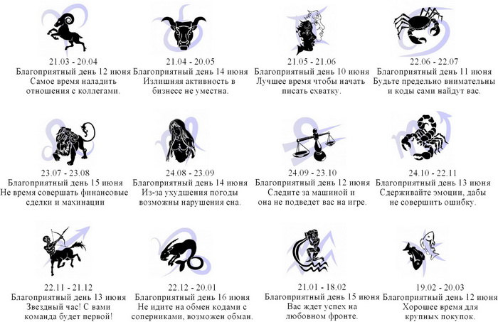
Код маркером в радиусе 10 метров от качели напротив арки. 

### Подсказка №1 для всех (10 минут)

EN-гороскоп подходит только для людей, родившихся под знаками: 

* Близнецы
* Рак
* Весы
* Стрелец
* Козерог

### Подсказка №2 для всех (20 минут)

Счастливый день у людей, родившихся под знаком рАк - 11 июня 2013 года – вторник, второй день недели. 

### Подсказка №3 для всех (30 минут)

Басег, экипировочный центр 
1905 года, 83 

### Ответ
Кокос

### Бонусы

Умножьте индекс загаданного места на 4 и прибавьте 36262. Нажмите "показать все" чтобы увидеть адрес.
Ресурсы ищите во дворе здания. Коды маркером на кирпичных постройках.
Рекомендуем во двор не заезжать. 

#### Бонус №1 "Дерево" (5 минут) 

''Вы получили ресурс дерево и 5 минут бонусного времени.''
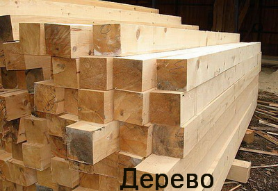

'''Ответы'''
мастер 

#### Бонус №2 "Металл" (5 минут)

''Вы получили ресурс металл и 5 минут бонусного времени.''
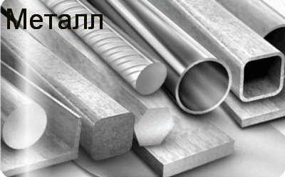

'''Ответы'''
квас 

## Уровень №4 "Развлечения" (1 час)

Заполняем сектора существительными, которые подходят к прилагательным. Незаполненным должен остаться только один сектор. 
Ищите агентов на аварийке. 

### Подсказка №1 для всех (10 минут)

* фабричная *е**л*
* трудовая *н**к*
* северная *о*н*
* депутатская *****к*с**********
* воинская п***н*****
* танковая **в**и*
* железнодорожная *л**ф****
* народная *е*н*
* линейная **г**р*
* московская **о**с**
* советская *а**н*
* октябрьская *е*****и*
* сибирская *о*о**
* ленинградская *б***т*
* коммунистическая **а**ь

### Подсказка №2 для всех (20 минут)

* мебель
* книжка
* война
* неприкосновенность
* повинность
* дивизия
* платформа
* песня
* алгебра
* прописка
* революция
* корона
* область
* власть

### Подсказка №3 для всех (22 минуты)

Советская, 21 

### Ответы

(для прохождения задания необходимо выполнить все сектора)

Фабричная (55) мебель
Трудовая (15) книжка
Северная (43) война
Депутатская (1) неприкосновенность
Воинская (5) повинность
Танковая (1) дивизия
Железнодорожная (2) платформа
Народная (1) песня 
Линейная (28) алгебра 
Московская (93) прописка 
Советская (21) москва1980 
Октябрьская (34) революция 
Сибирская (33) корона
Ленинградская (47) область
Коммунистическая (2) власть 

### Бонусы

Ресурсы ищите справа относительно главного входа в здание.
Чтобы получить телефон организации в здании, выполните следующее:
* Определите порядковый номер в алфавите каждой буквы из названия загаданной в основном задании улицы.
* К номеру первой буквы прибавьте 3.
* Возьмите номер второй буквы.
* Номер третей буквы умножьте на 2.
* Сложите номера первой, третей, пятой, шестой и седьмой букв.
Коды маркером на детской площадке. Есть метка EN баллоном.

'''Ответы'''
салат4 

#### Бонус №3 "Кирпич" (5 минут)

''Вы получили ресурс кирпич и 5 минут бонусного времени.''
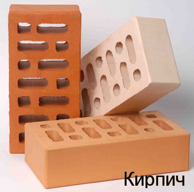

'''Ответы'''
штанга 

#### Бонус №4 "Бетон" (5 минут)

''Вы получили ресурс бетон и 5 минут бонусного времени.''
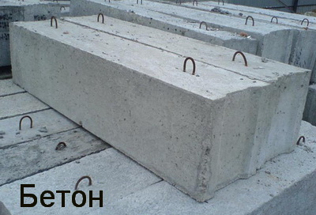

'''Ответы'''
корень 

## Уровень №5 "Игры" (1 час)

Пользуясь картой, уничтожьте все корабли соперника! 

Ранив корабль, вы закроете сектор. Необходимо закрыть все сектора. 

Промахнувшись, вы найдете неверный код. 

Вам пригодятся два правила: 

1. Корабли не касаются друг друга. 
1. Корабли могут плыть в разные стороны. 

Все коды написаны маркером, вводить без пробелов. Например: а1море. 

### Подсказка №1 для всех (20 минут)

А2, Б5, В3, Г1, Г5, Д8, Е3, Е6 - мимо. 

### Подсказка №2 для всех (40 минут)

Б1, А4, В7, В5, Д2, Д6 - ранил 

### Ответы

(для прохождения задания необходимо выполнить все сектора)

Четырехпалубный 1/4	д4стакан
Четырехпалубный 2/4 д5гитара
Четырехпалубный 3/4 д6коробка
Четырехпалубный 4/4 д7забор 

Трехпалубный 1/3 г2ведро
Трехпалубный 2/3 д2весна
Трехпалубный 3/3 е2мажор

Трехпалубный 1/3 а7парик
Трехпалубный 2/3 б7плот
Трехпалубный 3/3 в7песок

Двухпалубный 1/2 а1масса
Двухпалубный 2/2 б1кино

Двухпалубный 1/2 а3нефть
Двухпалубный 2/2 а4сахар

Двухпалубный 1/2 в4колобок
Двухпалубный 2/2 в5петух

## Уровень №6 "Афиша города" (1 час)

Прекрасное место для вечера летнего выходного дня. 

Звуки выходного дня (Ссылка на аудио)

Код маркером на белой клумбе около кафе. 

### Подсказка №1 для всех (10 минут)

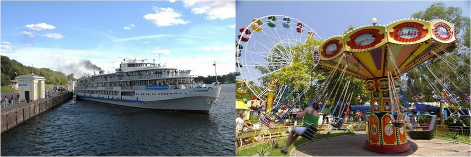

### Подсказка №2 для всех (20 минут)

Набережная реки, экскурсионный теплоход, аттракционы – такое в Новосибирске лишь в одном месте. 

### Подсказка №3 для всех (25 минут)

55° 00' 12.43" 
82° 56' 30.13" 

### Ответы
кукла

### Бонусы

Вычтите из номера телефона ближайшей к загаданному месту организации из рубрики "парикмахерские" число 531368.
Ресурсы ищите на крыше подземного сооружения во дворе здания.
Коды маркером на металлических и кирпичных конструкциях. 

#### Бонус №5 "Камень" (5 минут)

''Вы получили ресурс камень и 5 минут бонусного времени.''
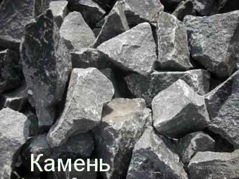

'''Ответы'''
кухня 

#### Бонус №6 "Стекло" (5 минут)

''Вы получили ресурс стекло и 5 минут бонусного времени.''
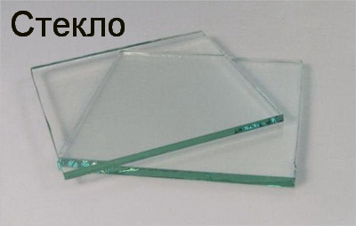

'''Ответы'''
улыбка 

## Уровень №7 "Программа телепередач" (1 час)

Афиша на текущую неделю. Приятного просмотра, от первого до последнего фильма. 
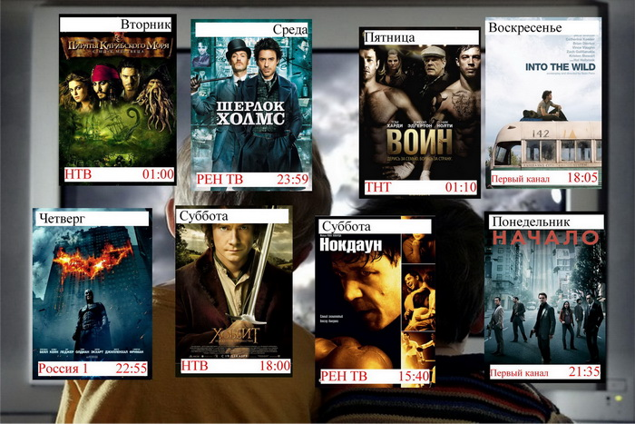
Ищите метку EN баллоном в радиусе 20 м от загаданного места. 
Код написан маркером. 

### Подсказка №1 для всех (10 минут)

Начнем с фильма 2005 года и закончим фильмом 2012-го. 

### Подсказка №2 для всех (20 минут)

Нокдаун (2005 г.) 
15+40=55 

### Подсказка №3 для всех (30 минут)

55° 01' 23.77" 
82° 56' 11.18" 

'''Ответы'''
лес

### Бонусы

Прибавьте к номеру телефона ближайшего к загаданному месту участкового пункта полиции число 340180.
Ресурсы ищите справа от здания. Коды написаны маркером. 

#### Бонус №7 "Дерево" (5 минут)

''Вы получили ресурс дерево и 5 минут бонусного времени.''
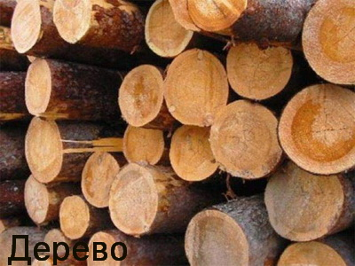

'''Ответы'''
пчела 

#### Бонус №8 "Стекло" (5 минут)

''Вы получили ресурс стекло и 5 минут бонусного времени.''
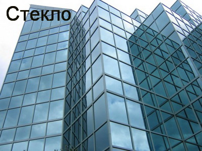

'''Ответы'''
самба 

## Уровень №8 "Вакансия" (1 час)

В салон красоты требуется колорист – парикмахер. 
Требования: порядочность, корректное цветовосприятие, знание английского языка, возможно без опыта работы. 
Заработная плата: средняя по городу. 
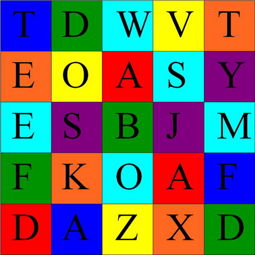
Код маркером на металлическом заборе за зданием. 

'''Ответы'''
свитер 

### Подсказка №1 для всех (10 минут)

Краски любят порядок – от красного до фиолетового, от A до Z. 
Средняя зарплата меня абсолютно устраивала. 

### Подсказка №2 для всех (20 минут)

A+A+D=1+1+4=6 
6/3 (A,A,D) = 2 = B. 

### Подсказка №3 для всех (30 минут)

BOUDOIR, салон красоты 
Семьи Шамшиных, 58 

### Бонусы

Ресурсы ищите в радиусе 30 метров от синей будки перед зданием.
Здание расположено на той же улице, что и загаданное место. Номер дома - 30. 

#### Бонус №9 "Дерево" (5 минут)

''Вы получили ресурс дерево и 5 минут бонусного времени.''
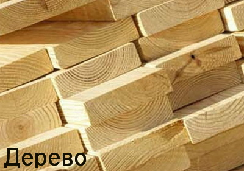

'''Ответы'''
радар 

#### Бонус №10 "Бетон" (5 минут )

''Вы получили ресурс бетон и 5 минут бонусного времени.''
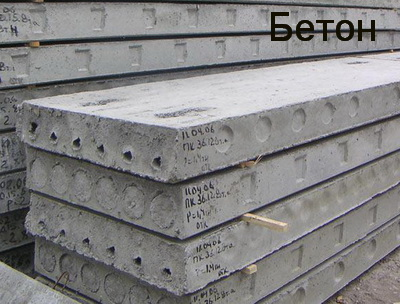

'''Ответы'''
лампа 

## Уровень №9 "Доска объявлений" (1 час)

Сниму квартиру на длительный срок. Правый берег. Не ниже 6 этажа. Обязательно метро в пешей доступности! 
А вот и варианты: 
* Красный проспект, 90
* Крылова, 5
* Восход, 1Б
* Геодезическая, 23
* Высоцкого, 39
* Красный проспект, 186
* Ватутина, 13
* Карла Маркса проспект, 15
* Дуси Ковальчук, 28
* Дзержинского проспект, 30
* Кошурникова, 12
* Восход, 18
Код маркером на мозаичной стене. 

### Подсказка №1 для всех (10 минут)

Выбрал наиболее подходящие. Поеду смотреть. Благо до метро рукой подать. 

### Подсказка №2 для всех (20 минут)

От первого подходящего варианта до метро 228 метров. 

### Подсказка №3 для всех (30 минут)

Алые паруса, агентство недвижимости и юридических услуг 
Красный проспект, 157/1 

### Ответы
луна

### Бонусы

Умножьте количество организаций в загаданном месте на 22622 и прибавьте 40.
Ресурсы ищите на аллее через дорогу от здания. Коды написаны маркером. 

'''Ответы'''
краска9 

#### Бонус №11 "Стекло" (5 минут)

''Вы получили ресурс стекло и 5 минут бонусного времени.''
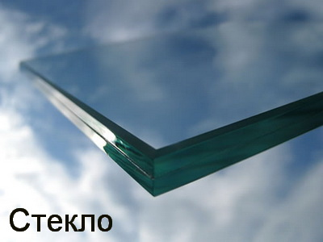

'''Ответы'''
филин 

#### Бонус №12 "Кирпич" (5 минут)

''Вы получили ресурс кирпич и 5 минут бонусного времени.''
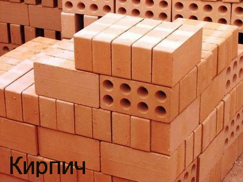

'''Ответы'''
комета 

## Уровень №10 "Газета рекомендует" (1 час 20 минут)

Субботний вечер мы рекомендуем вам провести в хорошей компании за вкусным ужином. Лучше всего для этого подойдут следующие места: 
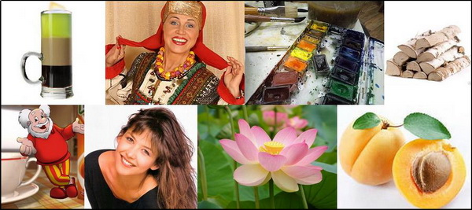
Место входа обозначено меткой EN баллоном. На месте не шуметь, не светить в окна фонарями, не привлекать внимания# 
Все коды маркером в радиусе 5 метров от меток EN баллоном. 

### Подсказка №1 для всех (10 минут)

Алкогольный коктейль; известная российская певица; вид красок; "корм" для источника тепла. 
Торговая марка чая; французская киноактриса; цветок – национальный символ Индии; фрукт - национальный символ Армении. 
Поужинать с друзьями лучше всего в кафе. 

### Подсказка №2 для всех (20 минут)

Б-55, Надежда, Акварель, Дрова 
Беседа, Марсо, Лотос, Абрикос 
Вам нужны номера домов. 

### Подсказка №3 для всех (25 минут)

55° 04' 21.87" 
82° 55' 18.36" 

### Ответы

(для прохождения задания необходимо выполнить все сектора)

* Сектор1 зверь
* Сектор2 шланг
* Сектор3 хомяк
* Сектор4 пульт
* Сектор5 маяк
* Сектор6 шанс

### Бонусы

Умножьте сумму семи цифр номера телефона ближайшей к загаданному месту организации из рубрики "столовые" на 103543 и прибавьте 9. Вам нужен ближайший к загаданному месту магазин.
Ресурсы ищите в радиусе 25 метров от входа в организацию. Коды написаны маркером. 

'''Ответы'''
поезд10 

#### Бонус №13 "Кирпич" (5 минут)

''Вы получили ресурс кирпич и 5 минут бонусного времени.''
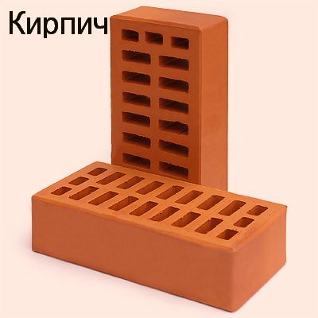

'''Ответы'''
фортуна 

#### Бонус №14 "Металл" (5 минут)

''Вы получили ресурс металл и 5 минут бонусного времени.''
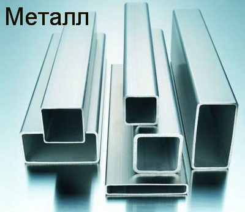

'''Ответы'''
камера 

## Уровень №11 "Спортивная страница" (1 час)

Вчера состоялись очередные матчи регулярного чемпионата КХЛ. Команда из Омска с крупным счетом переиграла армейцев из Москвы 6-3. Мытищинский Атлант без особых усилий одержал победу над горняками из Украины 4-1. Железнодорожники в гостях переиграли пражский клуб 5-2. С крупным счетом закончилась встреча в Нижнекамске: местный клуб не оставил шансов Витязю 7-4. В Екатеринбурге на 4 гола автозаводцев хозяева ничем не ответили. Упорным оказалось противостояние в столице Словакии, откуда клубу из Ханты-Мансийска не удалось увезти очки. 2-1. В столицу Сибири прибыл Астанинский клуб. Исход противостояния решила единственная шайба, заброшенная на последней минуте матча. Вратарь Новосибирцев был безупречен. 
Код маркером на бетонном бордюре перед зданием. 

### Подсказка №1 для всех (10 минут)

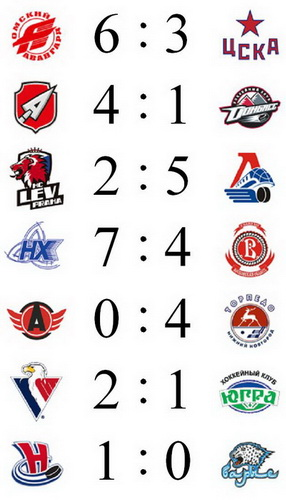

### Подсказка №2 для всех (20 минут)

авангАрд – цсКа 6-3 
атлант – донбасс 4-1 
лев – локомотив 2-5 
нефтехимик – витязь 7-4 
автомобилист – торпедо 0-4 
слован – югра 2-1 
сибирь – барыс 1-0 

### Подсказка №3 для всех (25 минут)

Академия плюс, магазин автозапчастей 
Николая Островского, 111 к5 

### Ответы
формат 

### Бонусы

Ресурсы ищите у ближайшего к загаданному месту здания с организацией из рубрики "ювелирные изделия".
Коды написаны маркером в подземном переходе. 

'''Ответы'''
огонь11 

#### Бонус №15 "Камень" (5 минут)

''Вы получили ресурс камень и 5 минут бонусного времени.''
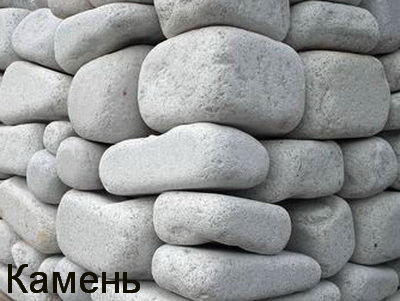

'''Ответы'''
коршун 

### Бонус №16 "Дерево" (5 минут)

''Вы получили ресурс дерево и 5 минут бонусного времени.''
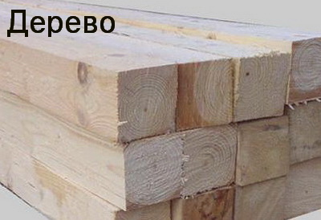

'''Ответы'''
совет 

## Уровень №12 "Музыкальная страница" (1 час)

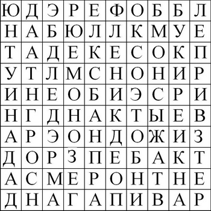

Мелодии на мобильный. Угадывай названия групп и получай их бесплатно! 
Рингтоны (Ссылка на рингтоны)
Чтобы не скачивать файл с музыкой, можете воспользоваться архивом "К заданию 12". 
Пароль к архиву: пампарам 
Код маркером на скамейке перед зданием. 

### Подсказка №1 для всех (10 минут)

Рингтоны в лучшем качестве (Ссылка на рингтоны)
Чтобы не скачивать файл с музыкой, можете воспользоваться архивом "К заданию 12 подсказка". 
Пароль к архиву: трямтрямтрям 

### Подсказка №2 для всех (20 минут)

* Ленинград
* Ранетки
* Рефлекс
* Пропаганда
* Звери
* Тату
* Леприконсы
* Дюна
* Винтаж
* Бумбокс
* Кино
* Любэ
* Демо
* Бандэрос

### Подсказка №3 для всех (25 минут)

Мезон Де Ботэ, салон красоты 
Мичурина, 7 

### Ответы

казино

### Бонусы

Индекс загаданного места умножьте на 87 и прибавьте 202680.
Индекс загаданного места умножьте на 131 и прибавьте 10567.
Ресурсы ищите в радиусе 15 метров от полученного места.
Коды написаны маркером. 

#### Бонус №17 "Бетон" (5 минут)

''Вы получили ресурс бетон и 5 минут бонусного времени.''
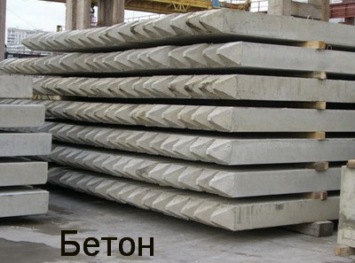

'''Ответы'''
курок 

#### Бонус №18 "Стекло" (5 минут)

''Вы получили ресурс стекло и 5 минут бонусного времени.''
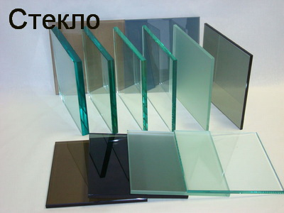

'''Ответы'''
волан 

## Уровень №13 "Пустой лист" (5 минут)

Неспеша отправляйтесь в Нью Йорк Пиццу на Фрунзе, 4. Там вас ждет встреча с редакторами. У вас есть 5 минут на дорогу и изучение возможных построек. Все ресурсы, заработанные на предыдущих уровнях, откроются вам после автоперехода. 

## Уровень №14 "Строительство"  (10 минут)

Перед вами все ресурсы, заработанные во время игры. Для удобства можете получить у редакторов карточки ресурсов. У вас есть 10 минут, чтобы определиться с постройками и получить бонусные коды. 
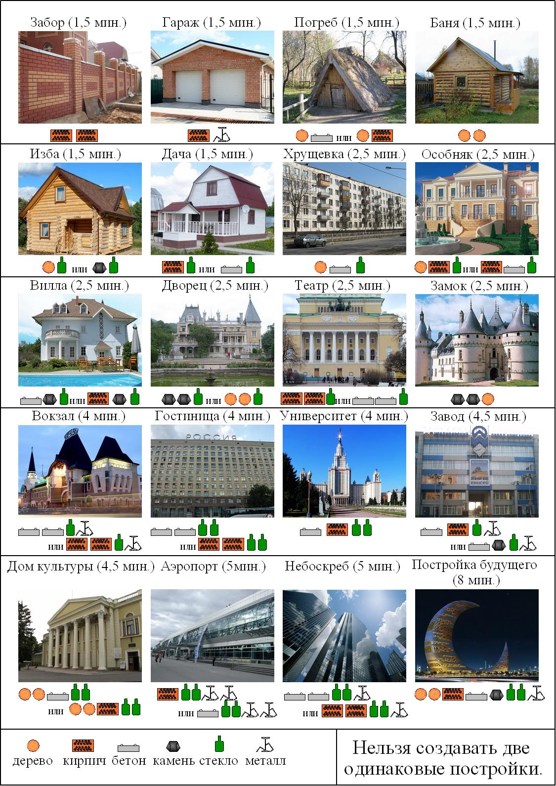
Правила создания построек: 
1. Каждый ресурс можно использовать только один раз.
1. Нельзя возводить две одинаковые постройки.
1. Не обязательно использовать все найденные ресурсы.
1. На принятие решения и вбитие кодов вам будет дано 10 минут.
1. Коды вы получите у редакторов. 
Для удобства можете получить у редакторов карточки ресурсов. 

### Бонусы

Бонус №19 "Забор" (1 минуту 30 секунд) забор2934 
Бонус №20 "Гараж" (1 минуту 30 секунд) гараж4561 
Бонус №21 "Погреб" (1 минуту 30 секунд) погреб2978 
Бонус №22 "Баня" (1 минуту 30 секунд) баня4729 
Бонус №23 "Изба" (1 минуту 30 секунд) изба5374 
Бонус №24 "Дача" (1 минуту 30 секунд) дача6804 
Бонус №25 "Хрущевка" (2 минуты 30 секунд) хрущёвка5731 
Бонус №26 "Особняк" (2 минуты 30 секунд) особняк4901 
Бонус №27 "Вилла" (2 минуты 30 секунд) вилла1099 
Бонус №28 "Дворец" (2 минуты 30 секунд) дворец2392 
Бонус №29 "Театр" (2 минуты 30 секунд) театр4750 
Бонус №30 "Замок" (2 минуты 30 секунд) замок2311 
Бонус №31 "Вокзал" (4 минуты) вокзал2816 
Бонус №32 "Гостиница" (4 минуты) гостиница1634 
Бонус №33 "Университет" (4 минуты) университет8691 
Бонус №34 "Завод" (4 минуты 30 секунд) завод5308 
Бонус №35 "Дом культуры" (4 минуты 30 секунд) домкультуры8253 
Бонус №36 "Аэропорт" (5 минут) аэропорт4974 
Бонус №37 "Небоскреб" (5 минут) небоскрёб5249 
Бонус №38 "Постройка будущего" (8 минут) построикабудущего2783 

----

Вот и всё:) 
Вы перелистнули последнюю страницу нашего журнала. 
Ждем ваших писем в редакцию. Приглашаем к сотрудничеству критиков. Опыт критики не обязателен:) 
Спасибо за участие!:) 