# Идеи 3

''Игровые метки: Ж
"Ж" в кружочке - конечная метка, "Ж" со стрелочкой направляющая метка.
Кодюли прописаны в формате Ж:**** , где вместо * могут быть слова, цифры, нубор букв и цифр. В движок все забито без префикса "Ж:"''

Внимательно читайте примечания ко всем уровням. Следуйте всем инструкциям из задания, соблюдайте условия прохождения уровней. В случае если организаторами будут выявлены нарушения связанные с несоблюдением условий, организаторы будут назначать штрафы.

* Превышение лимита экипажей на уровень: очки на уровне, как за последнее место.
* Нарушение светошумомаскировки на тех уровнях где ее необходимо соблюдать: 15минут.
* Залаз, парковка не по схеме из задания: 15минут.

Для уровней существует три степени разбаловки: высокая, низкая и фиксированная. Разбловка каждого уровня прописана в задании.

Фиксированная 60 баллов.

В случае слива уровня команда получает 0 баллов.

Первый уровень будет расположен в адмиралтейском районе города Санкт-Петербург и это единственный уровень на левом берегу Невы. Рекомендуем сразу сместить туда 1-2 экипажа, а после уровня вернуть их на правый берег.

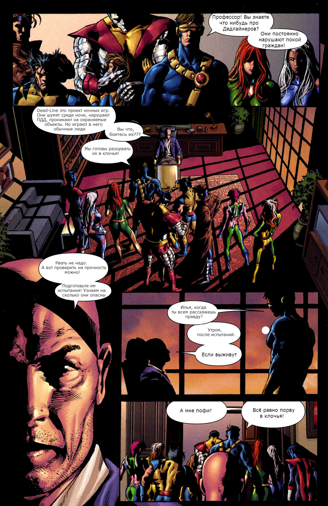

## Уровень №1 "Халк" (50 минут) 3 экипажа, Высокая разбаловка

### Подсказка №1 (5 минут)

На уровне действует ограничение не более трех экипажей от команды.

Коды на покрышках в пейнтбольной зоне.

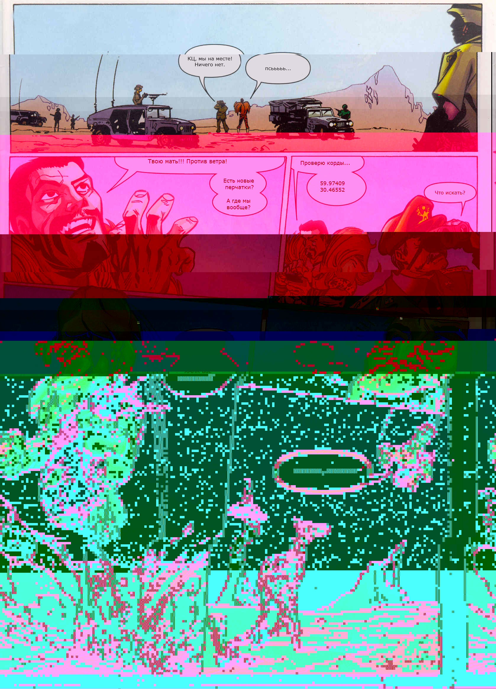

### Комментарий к уровню "Халк"

Приехав на указанное место (координаты), игрокам требовалось искать коды на покрышках, поднимая и перекидывая их с места на место.

## Уровень №2 "Ученики" (2 часа 20 минут) Высокая разбаловка

### Подсказка №1 (20 минут)

Подвал, чердак и крыло первого этажа, окна которого выходят на воду не играют.

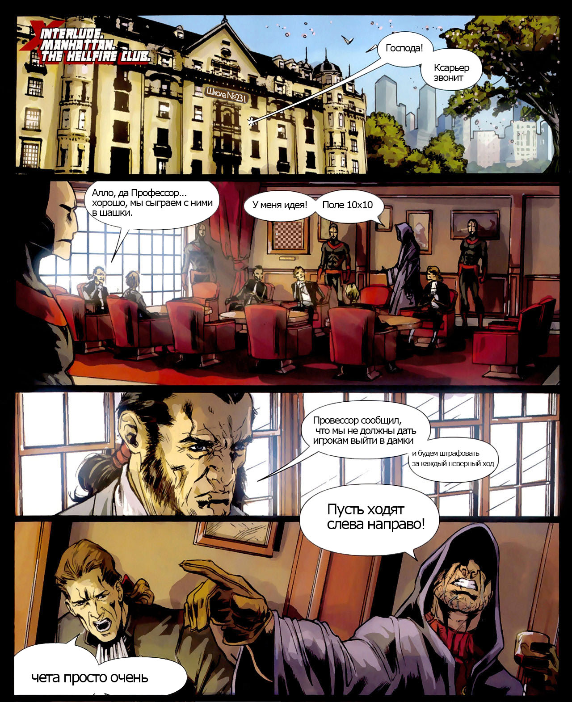

Вы начинаете с клекти А5

За каждый неверный ход вы получаете штраф - 2 минуты

### Подсказка №2 (40 минут)

наб. Крюкова канала 20

### Подсказка №3 (1 час)

Чтобы открыть расположение чужих шашек на поле - найдите коды столбцов (Они расположены на лестницах)

### Бонусы

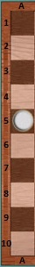 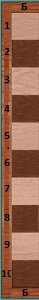 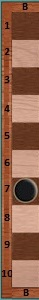 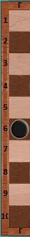 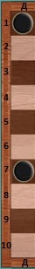 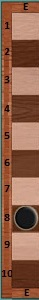 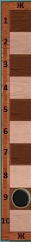 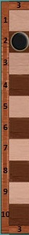 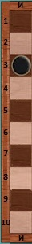 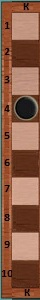

А1 - Так нельзя ходить
А3 - Так нельзя ходить
А5 - (Ж46)
А7 - Так нельзя ходить
А9 - Так нельзя ходить

Б2 - Так нельзя ходить
Б4 - (76пна)
Б6 - Вас съели- штраф 5 минут
Б8 - Так нельзя ходить
Б10 - Так нельзя ходить

В1 - Так нельзя ходить
В3 - (вцн89)
В5 - Вас съели- штраф 5 минут
В7 - Так нельзя ходить
В9 - Так нельзя ходить

Г2 - Вас съели- штраф 5 минут
Г4 - (45деут)
Г6 - Так нельзя ходить
Г8 - Так нельзя ходить
Г10 - Так нельзя ходить

Д1 - Так нельзя ходить
Д3 - (тно138)
Д5 - Вас съели- штраф 5 минут
Д7 - Так нельзя ходить
Д9 - Так нельзя ходить

Е2 -  Вас съели- штраф 5 минут
Е4 - (22анв)
Е6 - Так нельзя ходить
Е8 - Так нельзя ходить
Е10 - Так нельзя ходить

Ж1 -
Ж3 - Вас съели- штраф 5 минут
Ж5 - (95выл )
Ж7 - Так нельзя ходить
Ж9 - Так нельзя ходить

З2 - Так нельзя ходить
З4 - Вас съели- штраф 5 минут
З6 - (941щнт)
З8 - Так нельзя ходить
З10 - Так нельзя ходить

И1 - Так нельзя ходить
И3 - Так нельзя ходить
И5 - Вас съели- штраф 5 минут
И7 - (ннв599)
И9 - Так нельзя ходить

К2 - Так нельзя ходить
К4 - Так нельзя ходить
К6 - (зго42ж)
К8 - (зго42ж)
К10 - Так нельзя ходить

### Комментарий к уровню "Ученики"

Школа 231 находится по адресу наб. Крюкова канала 20. На месте необходимо было пройти виртуальное шахматное поле шашкой но с измененной ориентацией и размером поля.

На виртуальном поле были расставлены шашки противника.

За каждый неверный шаг команда получала штраф. В задании было указание на то, что необходимо стать дамкой, т.е сделать 10 шагов и пройти поле слева направо. О том что можно ходить только слева направо в задании также было указание. И была задана стартовая точка.

Чтобы узнать где стоят черные шашки можно было найти коды открывавшие столбцы виртуального поля. Открыв все поле,
достаточно было собрать 10 кодов клеток и получить части закрывающего кода.

## Уровень №3 "Ксавьер" (2 часа 40 минут) Низкая разбаловка

Рекомендуется отправлять на данный уровень не более 1-2 экипажей.

### Подсказка №1 (40 минут)

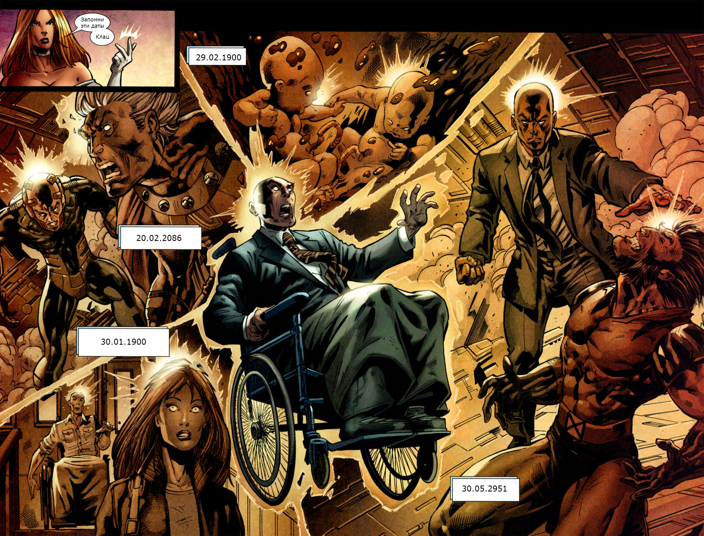

### Подсказка №2 (1 час)

29.02.1900 = 60
30.01.1900 = 30

### Подсказка №3 (1 час 20 минут)

60.067988
30.384021

### Комментарий к уровню "Ксавьер"

Отсчитывая от 01.01.1900 количество дней до указанной даты получались координаты. Быстрый подсчет можно получить в Экселе, поменяв формат ячейки на "Общий"

## Уровень №4 "Флэш" (1 час 50 минут) Высокая разбаловка

### Подсказка №1 (1 час)

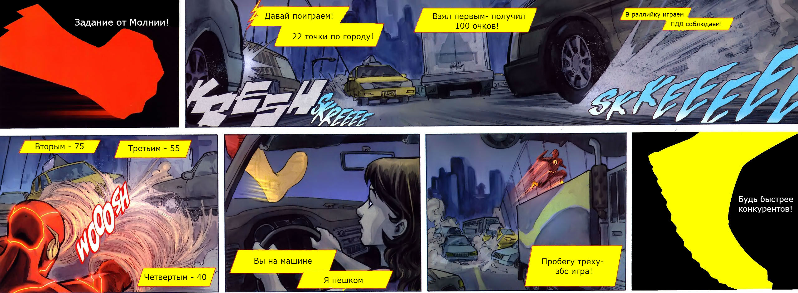

### Задание

<http://mitech.spb.ru/>
Логин:
Пароль:

### Комментарий к уровню "Флэш"

Раллийка с выдачей адресов всех точек и подсчетом статистики в зависимости от очередности взятия каждого отдельного кода.

## Уровень №5 "Зеленый фонарь" (3 часа 20 минут) Высокая разбаловка

### Подсказка №1 (1 час 20 минут)

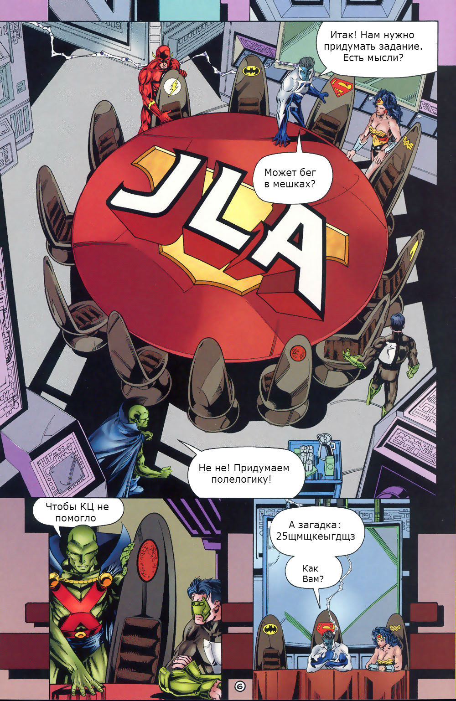

Играет только второй и третий этаж металлоконструкции.

На уровне действует штраф за перебор - 3 минуты за каждую третью попытку. (будет считаться вручную по мониторингу)

### Подсказка №2 (1 час 40 минут)

Полюстровский 52

### Подсказка №3 (2 часа)

Включите воображение- соединив нужные коды линиями вы получите фигуры. Объединив фигуры вы получите изображение. Его название закрывает все сектора.

### Комментарий к уровню "Зеленый фонарь"

Прочитав "задание" от супергероя в обратном направлении и на английской раскладке клавиатуры, получается polustra52- Полюстровский пр. д 52

Коды на уровне имели формат Ж: Nимясупергероя****, где Х- цифра по порядку, *- цифры кода.

Соединив линиями коды определенных героев, в зависимости с порядковым номером кода (N) можно было получить воображаемую фигуру- "самолет". Это и был итоговый код, закрывающий все сектора.

## Уровень №6 "Космос" (3 часа 40 минут) Высокая разбаловка

### Подсказка №1 (1 час 40 минут)

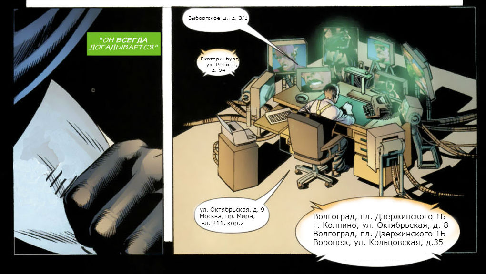

Формат ответа:****:****

Количество символов слева и справа от двоеточия, может быть абсолютно любым.

### Подсказка №2 (2 часа)

59.88785
30.49309

### Комментарий к уровню "Космос"

Найдя номера гипермаркетов Окей, адреса которых были указаны в задании, составлялись координаты места.

На уровне присутствовало 5 конечных меток. Из которых необходимо было составить анаграмму. Это были слова:плащ, черный, маска, шлем, ремень. Далее необходимо, вокруг конечки найти слова, начинающиеся на буквы, которые встречаются в конечной метке. Так как в некоторых словах, присутствовали буквы на которые нету слов. Были написаны просто набор букв, например:ььь, ыть.

## Уровень №7 "Магнетто" (4 часа) Низкая разбаловка

### Подсказка №1 (2 часа)

Разгадав задание, вбейте ответ в поле ввода кода, чтобы получить схему локации и адрес.

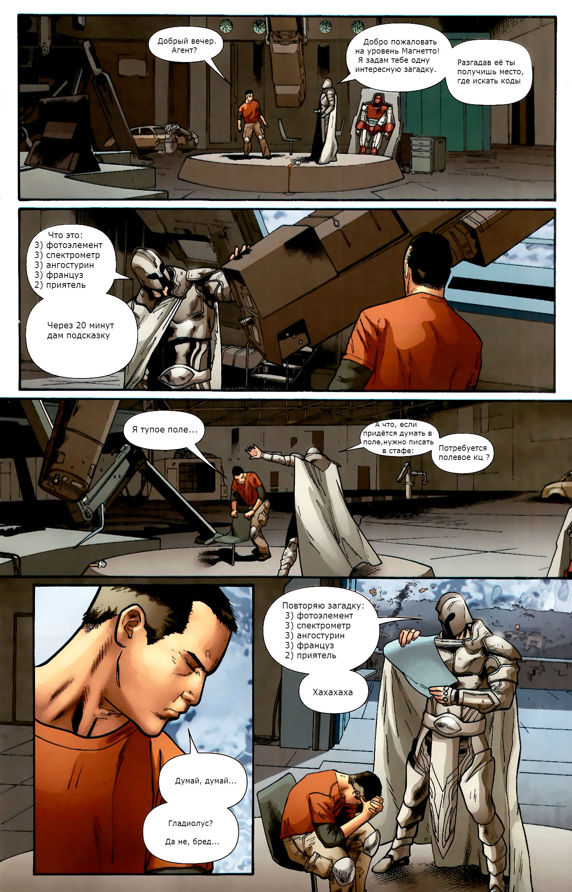

### Подсказка №2 (2 часа 20 минут)

### Подсказка №3 (2 часа 40 минут)

### Бонус №1 "Схема"

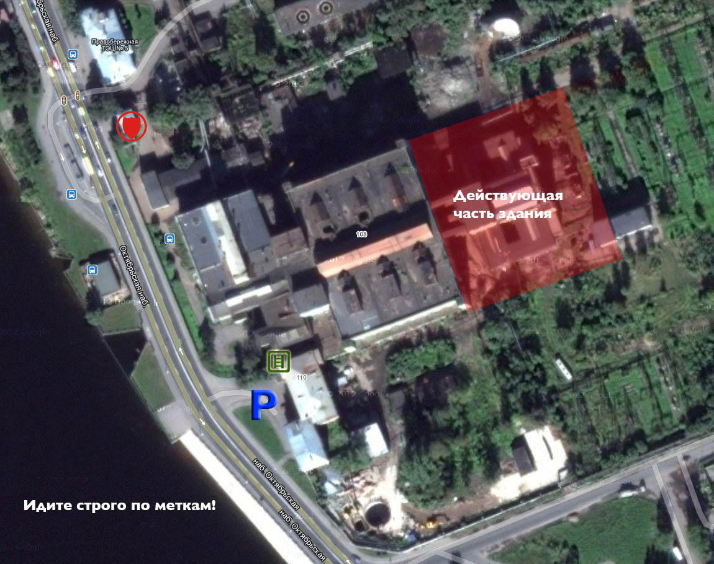

На пятый код направляющих меток нет. Код написан в центральном цеху в кабине крана. Вход в цех с третьего этажа.

### Комментарий к уровню "Магнетто"

Адрес загадан через стандартную расчлененку в тексте задания.

## Уровень №8 "Циклоп" (4 часа 20 минут) Низкая разбаловка

### Подсказка №1 (2 часа 20 минут)

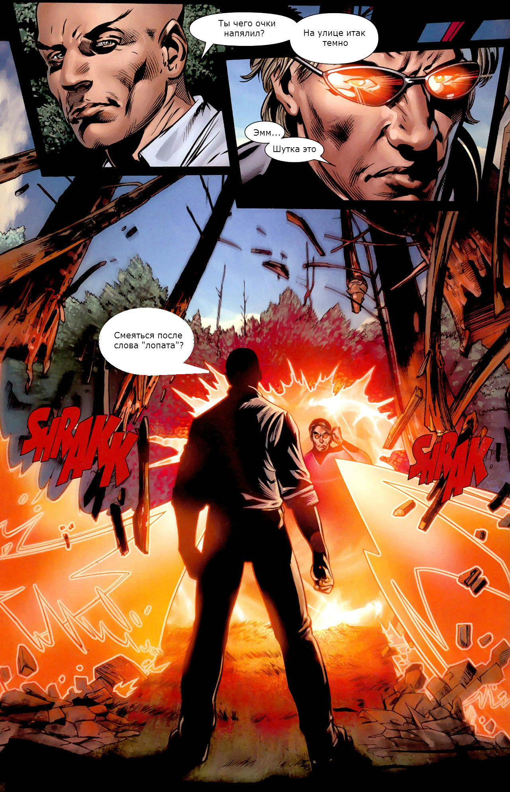

### Подсказка №2 (2 часа 40 минут)

### Комментарий к уровню "Циклоп"

Загадан был известнейший заброс Петербурга, именуемый Лопатина через ассоциацию со словом лопата. На месте игроков ждали агенты. Код был нацарапан на кирпиче и не пользуясь фонарями при моргающем свете командам ставилась задача найти его.

Сперва уровень был реализован с датчиком движения, т.е. командам необходимо было, зайдя в комнату, замереть чтобы включился свет и можно было разглядеть код нацарапанный на кирпиче. Но к сожалению, вышел из строя датчик движения.

## Уровень №9 "Россамаха" (4 часа 40 минут)

### Подсказка №1 (2 часа 40 минут)

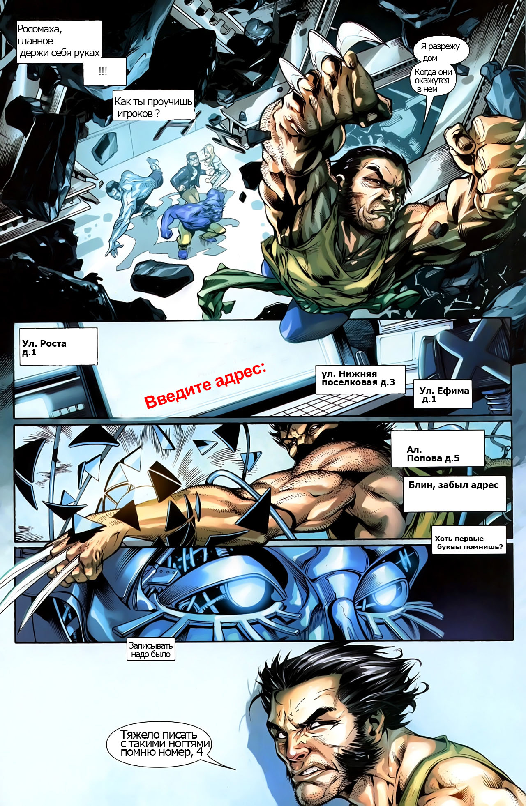

### Подсказка №2 (3 часа)

Ржевская 4

### Подсказка №3 (3 часа 20 минут)

Вам необходимо находить по три метки, сперва три метки Ж1 , через них вы проводите плоскость и отсекаете часть здания, далее найдя три метки Ж2 также отсекаете часть здания из оставшейся после первого отсечения итд. Чтобы понять какую часть здания убрать нужно найти коды у меток. В итоге вы получите пространство в котором находится закрыващий код.

### Комментарий к уровню "Россамаха"

Загадан Адрес Ржевская 4 по номерам букв в словах адресов перечисленных в тексте задания. На месте необходимо было находить по три метки, сперва три метки Ж1 , через них вы проводить плоскость и отсекаеть часть здания, далее найдя три метки Ж2 также отсекаеть часть здания из оставшейся после первого отсечения и тд. Чтобы понять какую часть здания убрать нужно найти коды у меток. В итоге вы получалось пространство в котором находится закрывающий код. Также было еще 15 ложных кодов.

## Уровень №10 "Гроза" (5 часов) Разбаловка высокая

### Подсказка №1 (3 часа)

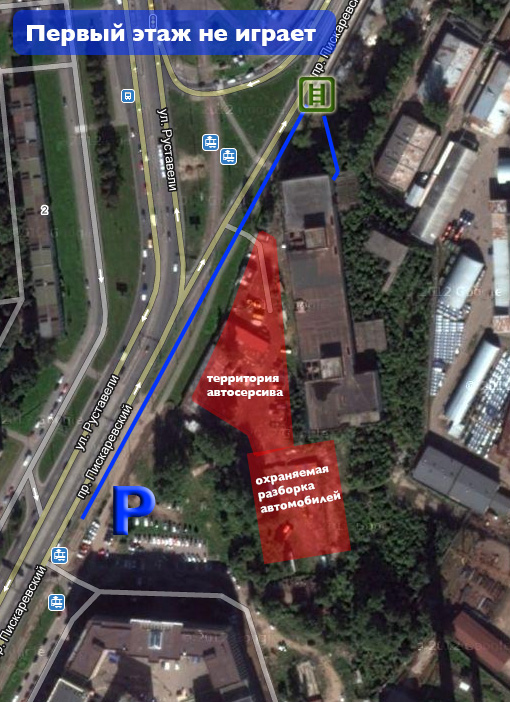

На уровне 12 кодюль. 6 конечных меток, написанных баллоном.

Формат ответа: кодкод

За ввод кодов в сектора не соответствующих логике будет начисляться штраф 10минут за каждый код.

### Бонусы

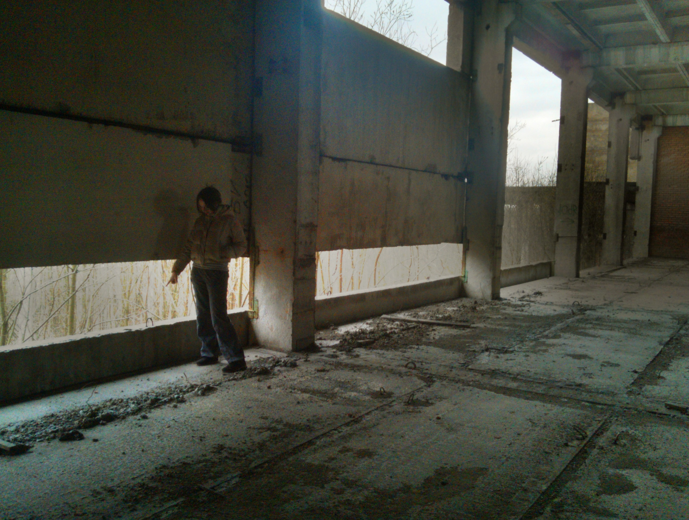 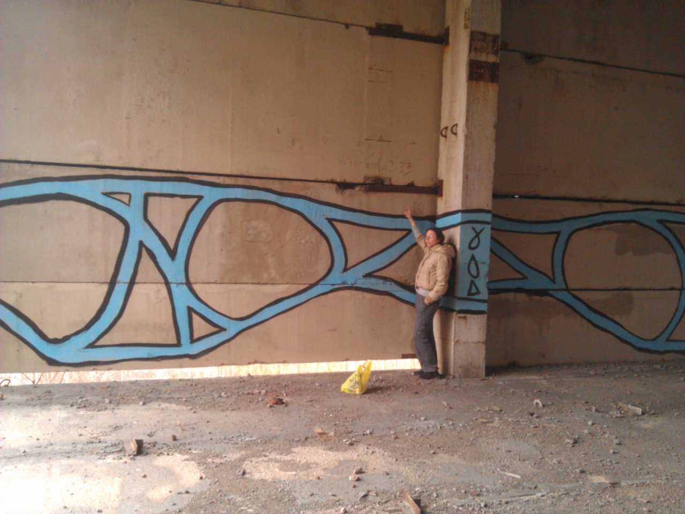 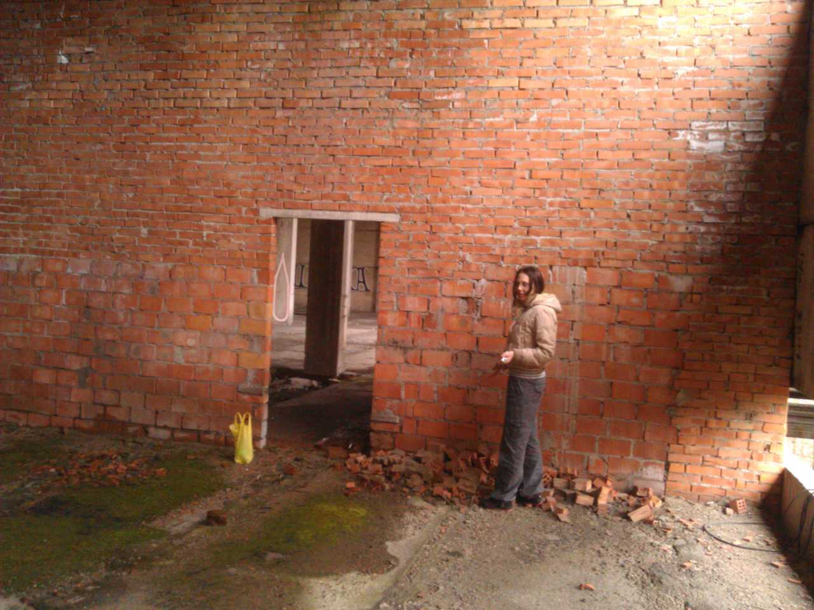 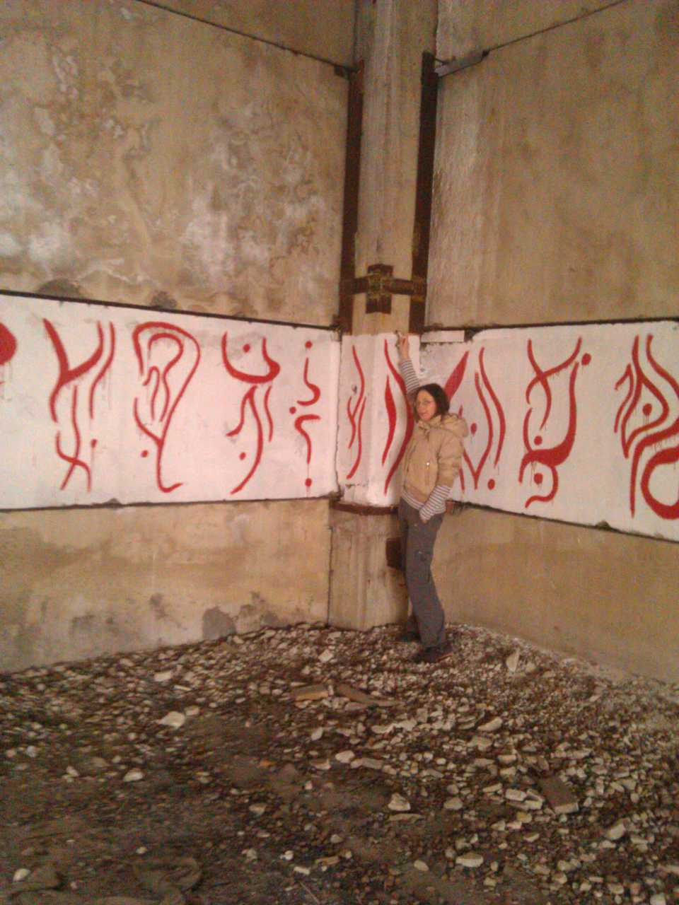 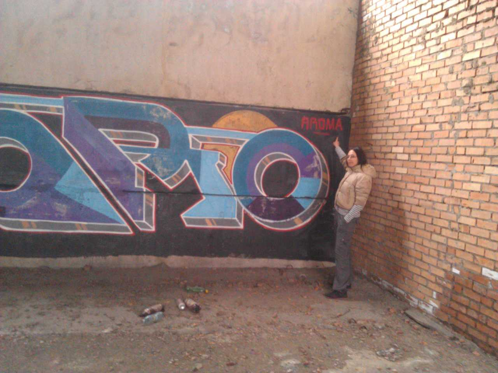 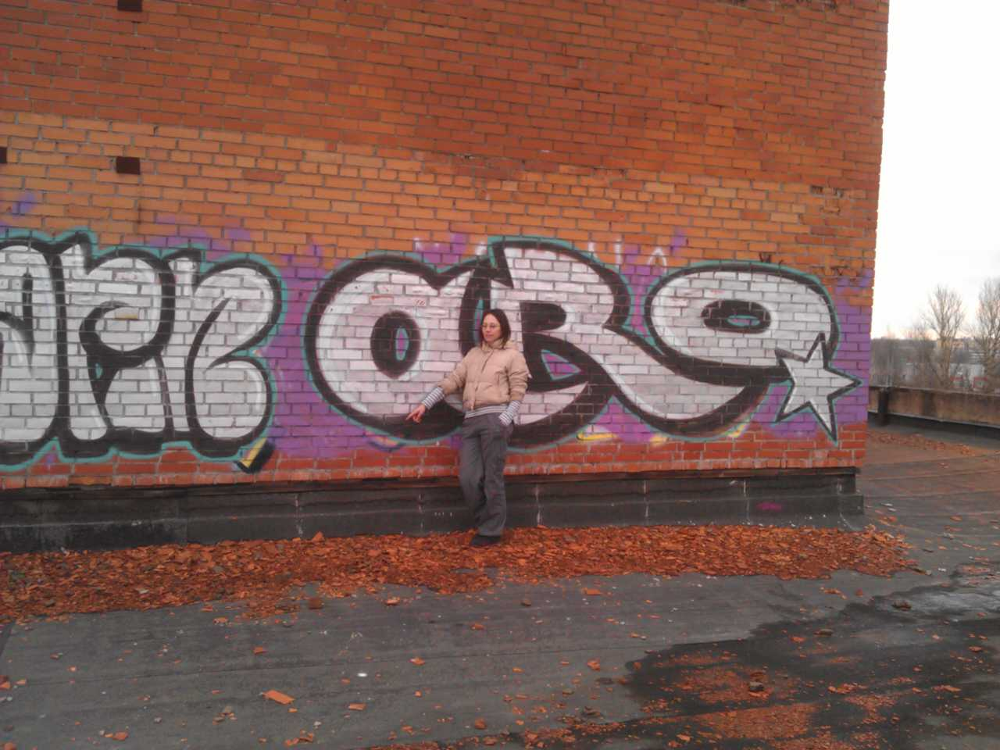

## Уровень №11 "Влияние" (4 часа 20 минут) Разбаловка высокая

### Подсказка №1 (3 часа 20 минут)

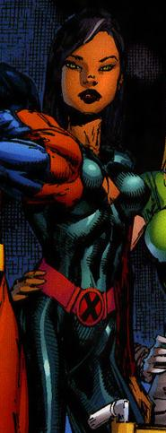

Её часы показывали 90.06498 градусов минут и 267.8094 градусов секунд

### Подсказка №2 (3 часа 40 минут)

59.98917
30.36510

1 зона: Правая часть первого этажа. (Возле правого входа)
2 зона: Весь второй этаж.
3 зона: Весь третий этаж.
4 зона: Сгоревшая часть четвертого этажа.
5 зона: Оставшаяся часть четвертого этажа.

Со временем. коды с определенных зон сгорают.

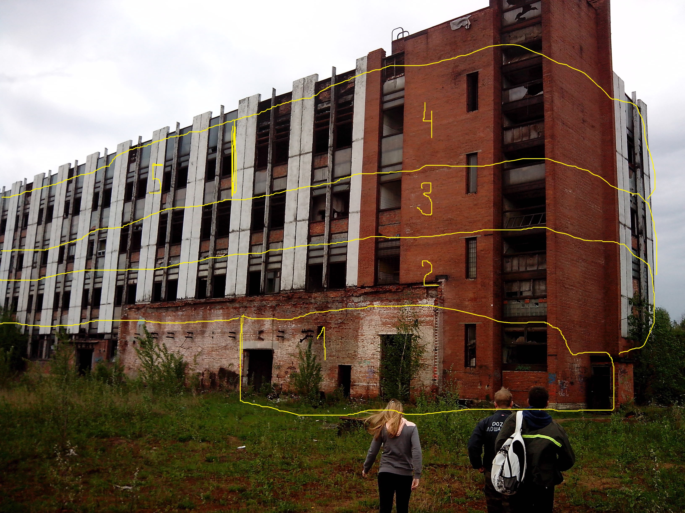

### Комментарий к уровню "Влияние"

Здание было виртуально разделено на 5 зон. В каждой написано по 5-10 кодов. В начале уровня в движек проходили все коды. Через определенное время зоны по-очереди закрывались и коды из них них становились неактивными. Побеждала команда, которая смогла вбить в движок наибольшее количество кодов.

## Уровень №12 "Супермен"

### Подсказка №1 (3 часа 40 минут)

???

### Подсказка №2 (4 часа)

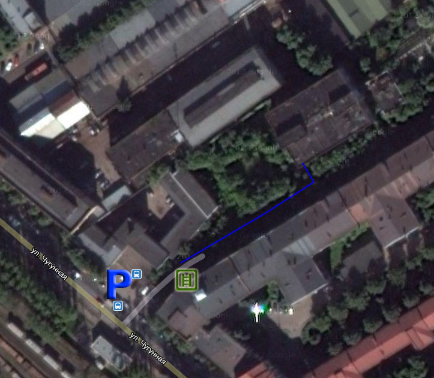

места кодов:

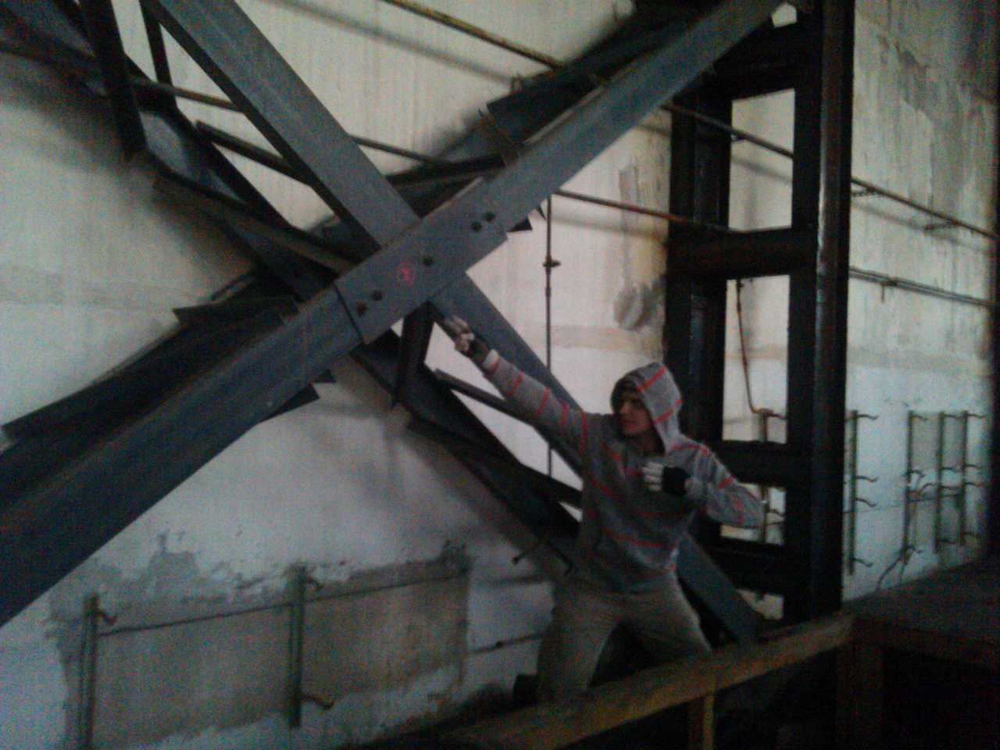 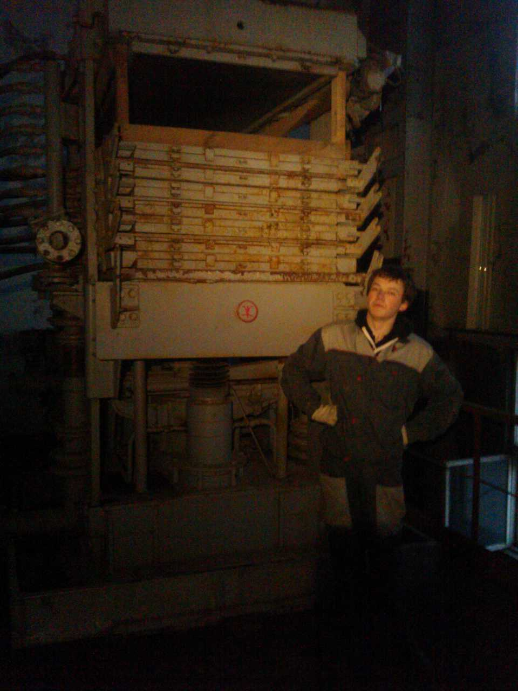 

### Комментарий к уровню "Супермен"

Разложив картинку задания на слои можно было найти схему локации и места прописания кодов.

## Уровень №13 "Капитан Капитан" (6 часов) Высокая разбаловка

### Подсказка №1 (4 часа)

### Подсказка №2 (4 часа 20 минут)

Задание прийдет в сл.подсказке

### Подсказка №3 (4 часа 40 минут)

Играют только столбы в подвале.

Все ко 1

формат ответа: слово

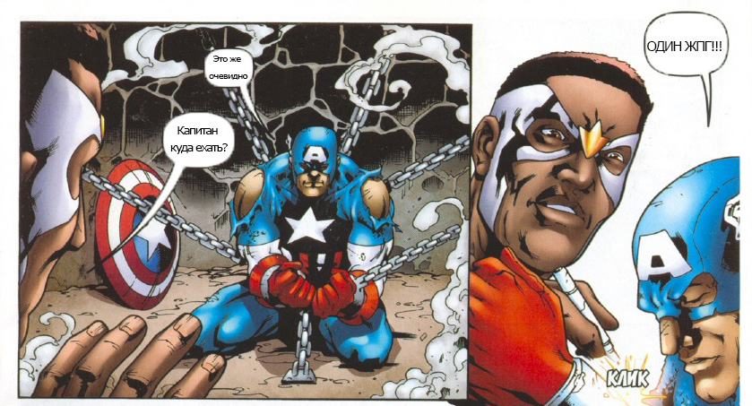

### Подсказка №4 (5 часов)

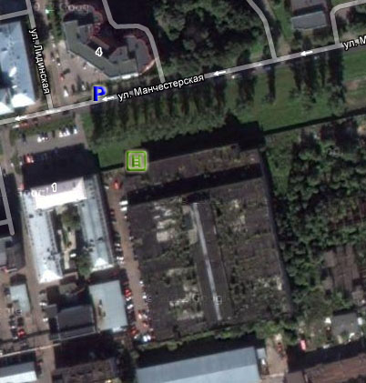

### Комментарий к уровню "Капитан Капитан"

Капитан какбе намекает на адрес картинки 1.jpg

Достаточно было подставить имя к шаблону адреса файлов игры, открывалась схема локации.

На месте был большой подвал со множеством столбов. Необходимо было найти 6 частей кодов, составить анаграмму и по ней закрывался уровень.

В изначальной идее на всех столбах должны были быть буквы, а в задании корды столбов по координатной сетке, которую можно было представить из столбов. После составления слова был пересыл на второй этаж, где находилась также гигантская сетка из полуметровых колодцев на полу. Необходимо было найти метки в колодцах, изобразить сетку из них и проведя линию через отмеченые колодцы вырисовывался логотип. Но к сожалению, авторы посчитали уровень слишком сложным в таком виде и было решено отказаться от идеи.

## Уровень №14 "Зверь" (6 часов 20 минут) Высокая разбаловка

### Подсказка №1 (4 часа 20 минут)

Разгадав задание, вбейте ответ в поле ввода кода, чтобы получить схему локации и адрес.

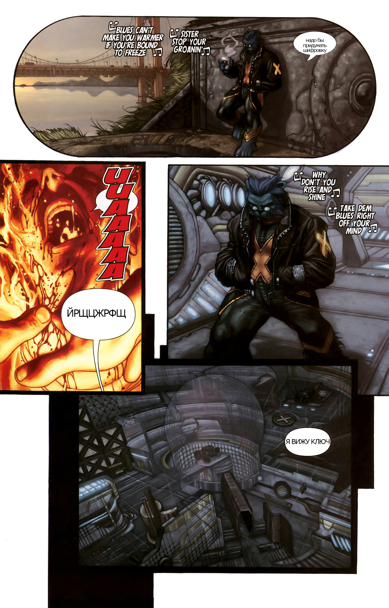

### Подсказка №2 (4 часа 40 минут)

Подсказка 1
Шифр Виженера

### Подсказка №3 (5 часов)

Корпусная 13
<http://d1.endata.cx/data/games/42539/korpusnaija_shema7867878y77h.jpg>

### Подсказка №4 (5 часов 20 минут)

Вам нужны метки:

А74
ГРУ
МИТ
ЗАД

### Бонус

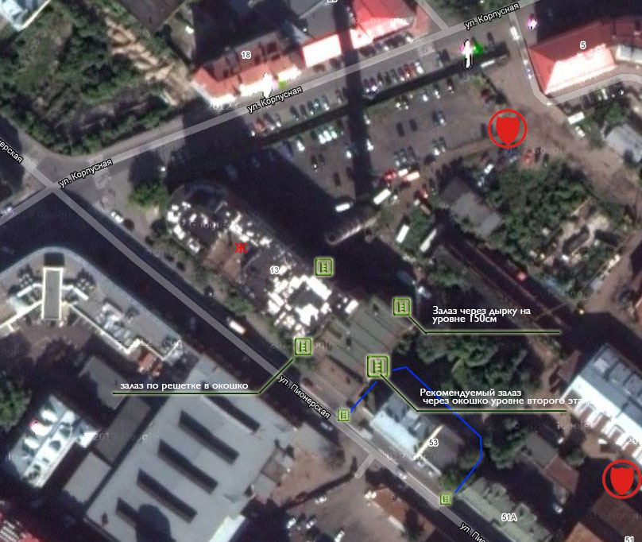

### Комментарий к уровню "Зверь"

Через шифр Виженера был загадан адрес Корпусная 13.

На месте игроки находили метку Ж около которой было прописано 4 кода в радиусе 7метров. Также на локации были разбросаны метки с префиксами, т.е Ж*** их было порядка 8штук, среди них 4 ложных. 4 кода около первой метки говорили о том, около каких меток с префиксами необходимо искать код закрывающий сектор.

## Уровень №15 "Пипец" Низкая разбаловка

### Подсказка №1 (4 часа 40 минут)

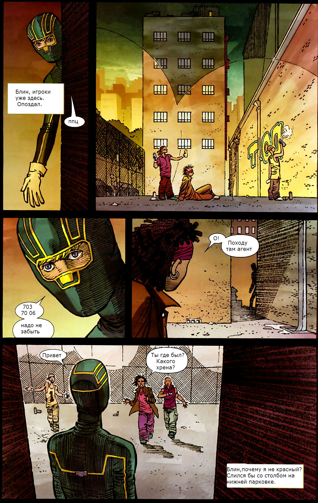

### Подсказка №2 (5 часов)

Нижняя парковка ГМ Окей Выборгское ш. 19 к 1

Коды на красных столбах.

### Комментарий к уровню "Пипец"

Телефон, указанный в задании принадлежит ГМ Окей по адресу Выборгское ш. 19а. (по ошибке, в движке был забит неверный номер)

На месте игрокам требовалось искать красные коды на красных столбах. (Уровень ведь "Пипец")

## Уровень №16 "Биврёст" Низкая разбаловка

### Подсказка №1 (5 часов)

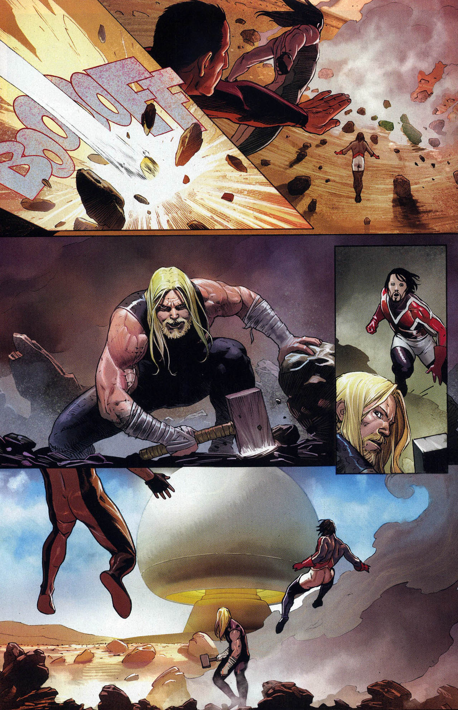

формат ответ: номера в правильном порядке слитно

### Подсказка №2 (5 часов 20 минут)

60.02949
30.43716

### Комментарий к уровню "Биврёст"

Координаты локации были спрятаны в имени файла.

Локация представляла из себя мост через железную дорогу, сваренный из металлических секций. В секциях были разбросаны коды маркерами разного цвета.

около залаза был написан первый код, являвшийся пересылом к секции с заданным номером. В следующей секции было уже дано два пересыла, написанных маркерами разных цветов. Названия уровня - Биврёст - это радужный мост из Норвежской мифологии, а также упоминаемый в комиксах о Торе. То что мост радужный являлось намеком на то, что необходимо было следовать по пересылу написанному маркером другого цвета, нежели предыдущий пересыл. Последовательность пересылов являлась закрывающим кодом.

## Уровень №17 "Дежавю" Низкая разбаловка

### Подсказка №1 (5 часов 20 минут)

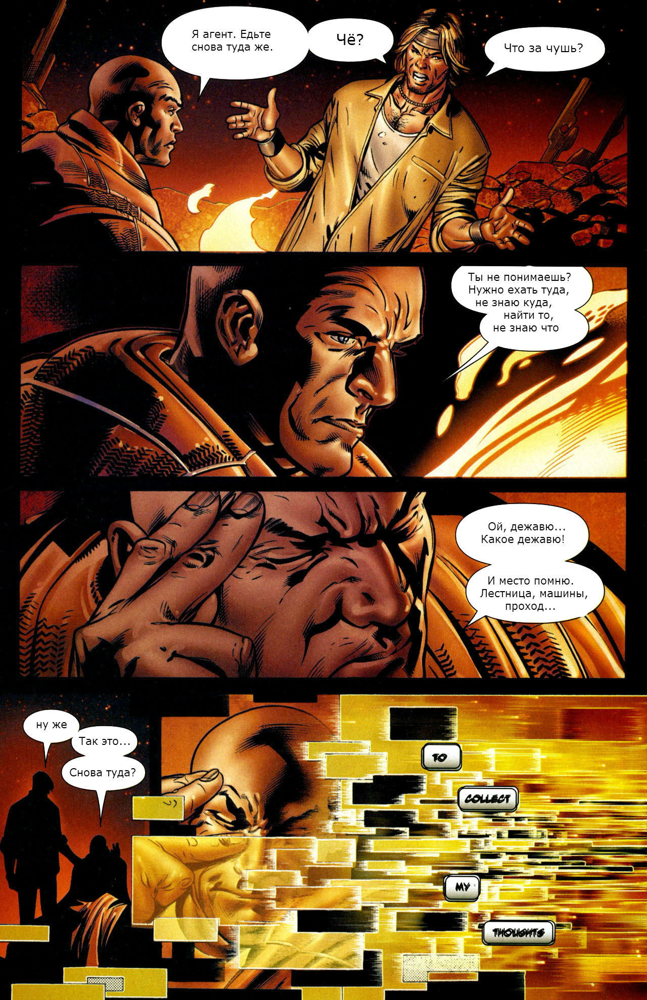

### Подсказка №2 (5 часов 40 минут)

Вы были на этом уровне вместе с Ксавьером.

### Подсказка №3 (6 часов)

60.067988
30.384021

### Комментарий к уровню "Дежавю"

В задании был пересыл на уже отыгравший в 4м задании пешеходный мост через КАД.

Изначальные коды были стёрты и игрокам необходимо было искать у старых меток новые коды.

## Уровень №18 "Халк"

### Подсказка №1 (5 часов 40 минут)

Утренний брифинг- на верхней парковке ТК Июнь.

В случае, если она закрыта- у МакДональдса

### Комментарий к уровню "Халк"

Уровень пришлось снять из-за технических неполадок.

Задумкой было сделать на уровне для каждой команды стену с замурованной в неё металической пластиной с выграверным кодом. Получить пластину можно было разбив стену.

## Уровень №19 "Бэтмен"

### Подсказка №1 (3 часа 40 минут)

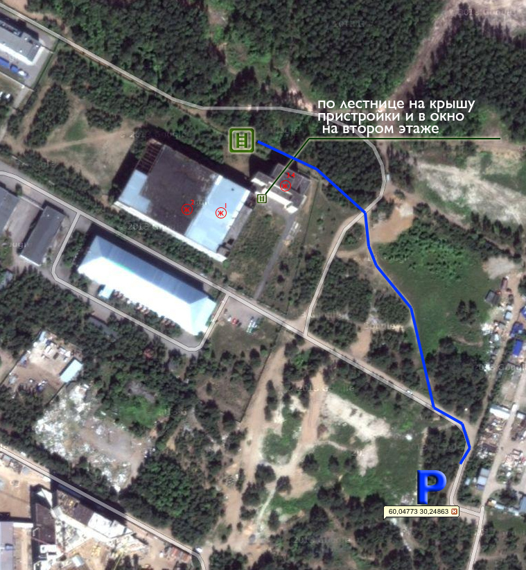

Уровень сталкер!

На территории живет большая сторожевая собака- будьте очень аккуратны. На всякий случай возьмите чем отбиваться от неё.

### Бонус №1

первая часть закрывающего уровень кода: пыщ1

### Бонус №2

вторая часть закрывающего уровень кода: ась42

### Бонус №3

Код в 314 комнате

#### Подсказка

третья часть закрывающего уровень кода: ноно2

### Бонус №4

В комнате 215 включите телевизор и посмотрите касету

#### Подсказка

четвертая часть закрывающего уровень кода: фин1

### Комментарий к уровню "Бэтмен"

На уровне было написано два кода ко3, один код ко1 и один ко1, сопровождавшийся перфаком:

Зайдя в нужную комнату игроки обнаруживали телевизор, видеомагнитафон и видеокасету, с написанной на коробке инструкцией. Выполнив действия, указанные на ней, игроки видели видео из фильма "Звонок" (момент, когда из колодца вылезает девочка и идёт к телевизору. В процессе, на видео мелькало изображение батареи. (именно там был код). После снятия кода на выходе игроков ждала девочка из фильма- переодевшийся агент. В случае, если команда долго не могла найти код, девочка заползала к игрокам в комнату.

К сожалению, не все команды попали на этот уровень :(
