# Идеи 4
## Полиглот

Немного поясню о том, что тут будет сегодня происходить.

В игре 10 основных заданий.

Правый берег:

1 - агентское;
1 - пригород;
3 - город. (1 уф)

Левый берег:

1 - агентское;
1 - пригород;
3 - город. (1 нестандарт)

Чеки выполнены в виде смайла красным либо желтым баллоном.

Максимальное кол-во кодов на уровне: 12.

Максимальное расстояние до пригорода не более 30 км.

----

Бонусы будут! В основном не сложные...
в том числе формат 4 КАРТИНКИ = 1 СЛОВО (что за слово). Смысл, узнать какое слово загадал автор этими 4-мя картинками. Загаданы существительные в Именительном падеже, не имена собственные! Есть много подобных приложений, так я усложнил задачу. В этих приложениях дается количество букв у загаданного слова, у нас такого нет - брутфорсите, хотя эти задания очень легкие.

## Уровень №1 "Пригород Плодовый вход"

Давным давно все разговаривали на одном язеке, но все стало меняться с момента когда съев яблоко, одна пара была изгнана очень далеко из дома. Но даже после этого она никогда не останавливалась и двигалась вперед до самого конца.

* тип задания: 3Т
* кол-во кодов на уровне: 10
* Чекаем левую сторону дороги на указательные чеки.
* Внимательней, ЖЕЛТЫЙ баллон.

### Подсказка №1 (30 минут)

Запретный плод, потом Вавилонское столпотворение и понеслось.

### Подсказка №2 (1 час)

п. Плодовый
Едем по главной, На развилках держимся правой стороны, асфальта.
Далее едем в сторону коровников, продолжаем двигаться по асфальту, поворачиваем налево.
Повернув налево по правой стороне у вас должны оказаться весы для грузовых машин.
Едем дальше по асфальту, по левой стороне на столбе чекаем указательный чек, далее домик по левой стороне с указательным чеком.

## Уровень №2 "Спуск доезд"

Хочаш гарачага? Спускайся ўніз. Пасядзім, папарыцца, міліцыя ўсё роўна тут ужо амаль не бывае.

* тип задания: 2Т
* кол-во кодов: 6
* Чек рядом с загаданным ориентиром.

### Подсказка №1 (30 минут)

В Белорусии сейчас такие вещи вполне в порядке вещей.

### Подсказка №2 (1 час)

Справа сауны у спуска Степана Разина.

## Уровень №3 "Спуск вход"

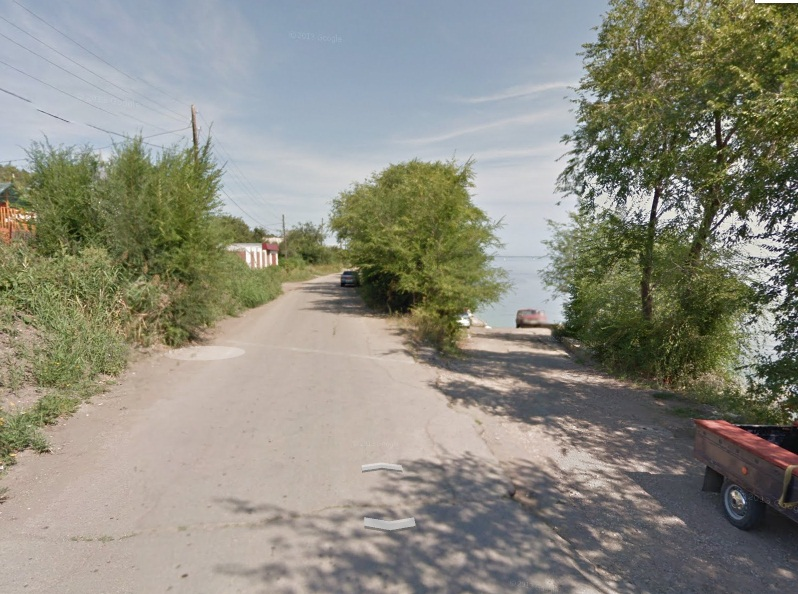

Едем прямо на набережную волги, переезжаем два лежачих полицейских и едем далее до развилки которая указана на верхнем рисунке. Доехав до нее, поворачиваем на право и спускаемся к воде.
У воды чекаем левую стену.

## Уровень №4 "Азовская вход"

Стомився я жити біля річки, ось нагодую коня та відправлюся до моря

* тип задания: 2Т
* кол-во кодов на уровне: 12
* локация примерно напротив указанных ориентиров (смотрим внимательно прежде чем звонить)
* стараемся не шуметь
* Локационый чек с правой стороны объекта.

### Подсказка №1 (30 минут)

Та що у нас в Україні морів багато? Зате коня багато де погодувати можна

## Подсказка №2 (1 час)

азовская. локация примерно напротив заправки роснефть (дом из красного кирпича)
На пересечении с ул. Парниковая, вход с правой стороны.

* Играет только подвал и последний этаж!!!
* Не палимся не шумим! В окна не светим!!!

## Уровень №5 "Маяковского вход"

Я никогда не думал, что у меня получится, но в конце концов я осилил вольк ин хосен. Как то пошловато звучит)

* тип задания: 3Т
* кол-во кодов на уровне: 5
* Доп: УФ

### Подсказка №1 (30 минут)

Да книга это, а вы о чём подумали? Совсем в конец испорченные

## Подсказка №2 (1 час)

ул. маяковского. Конец
Пятак конечной 52 маршрутки.

* От чека идем в левую сторону по тропинке по склону вниз.
* Чекаем левую сторону.
* Входного кода уже нет, просто собираем коды!

## Уровень №6 "Агентское правый 52 школа "

- Иванов,давай проверим твой английский
- Не хочу и вообще ,не доставайте меня своей школьной программой иначе в окно выпрыгну!

* тип задания: Агентское
* Ищем агентов.

### Подсказка №1 (30 минут)

В мои 19 лет вы мне не верите? Прыгаю! И вообще меня весь город запомнит

### Подсказка №2 (1 час)

школа № 52 (Терешковой ,8)

## Уровень №7 "Агентское левый"

В Ульяновске с лёгкостью можно найти место встречи Софийского Ленина и сын помещика из Ноттингемпшира

* тип задания: Агентское
* кол-во кодов на уровне: 1
* Ищем агентов.

### Подсказка №1 (30 минут)

Болгарский Ленин и сын мелкого помещика из Ноттингемпшира безусловно являются неотъемлимой частью друг руга

### Подсказка №2 (1 час)

гулливер на Димитрова

## Уровень №8 "14 инженерка мост доезд"

Заокеанские товарищи всегда удивлялись как мастерски пройдя всего один круг обработки фраза "Посмотрите на их лица" становится очень узнаваемой благодаря одной известной личности

* тип задания: 3Т
* кол-во кодов: 8

### Подсказка №1 (30 минут)

Технически достаточно по кругу обработать фразу до "Look at their faces", а дальше потребуется только гитара

### Подсказка №2 для всех (1 час)
Мост на пересечении 14 инженерного и Антонова.

## Уровень №9 "14 инженерка мост вход"

Локация перед мостом. ищем люк.
От чека спускаемся вниз и переходим дорогу.
Поворачиваем налево и идем против движения.
Пропускаем первую тропинку которая идет на право вдоль моста и идем далее.
Натыкаемся на вторую тропинку идущую направо вдоль моста и по ней так же поворачиваем на право и идем по ней. По правой стороне тропинки ищем люк, для удобства я воткнул в нее куст(сухую ветку)))))
Чек внизу.

# Уровень №10 "Металистов Доезд"

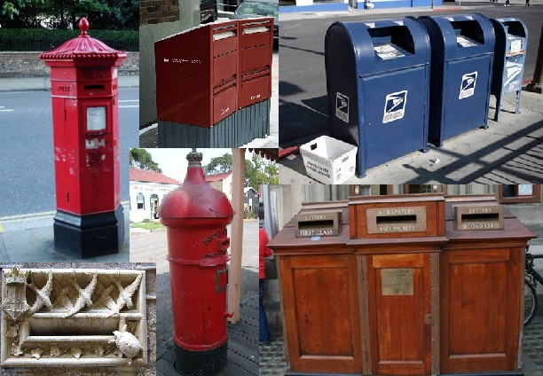

* тип задания: 3Т
* кол-во кодов на уровне: 8

### Подсказка №1 (30 минут)

И это все из разных стран? В конце концов что это такое?

### Подсказка №2 (1 час)

В конце улицы почтовая на гараже.
если ехать по почтовой вы в него упретесь.

## Уровень №11 "Металистов вход"

 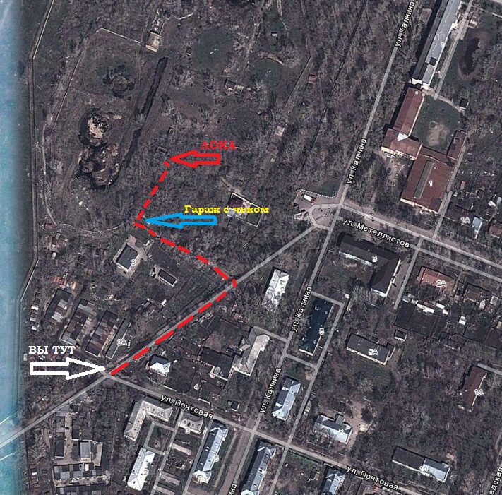

От чека едем по карте.
Если вы правильно поехали то по правой стороне у вас должна вдоль дороги идти труба, в конце этой трубы будет поворот налево, поворачиваем в гаражи. далее едем по дороге на свет (столб освещения.)
До света желательно не доезжать. так как по правой стороне от дороги будет какая то рабочая хрень.
Как раз напротив ворот этой хрени расположены гаражи на крайнем находим чек и по нему уходим за гараж и идем по "тропинке" в гущу. По тропинке идем до дерева с восклицательным знаком! От дерева налево и вы пришли!
Двигаясь по тропинке держитесь левой стороны##

* Собираем коды.
* Не палимся.
* Чек на 7 и 8 код один. Без цифры два.

## Уровень №12 "Пригород октябрьский вход"

Alle dachten, dass alles zu Ende gegangen ist, aber alles ist viel zu weit gekommen. Auf den zehnten Monat hat sich alles von den Beinen auf den Kopf umgedreht. Ich bin wie üblich auf Sauftour gegangen, und anstelle dessen was, auf das Studium ich zu fahren ist hinter dem Sieg nach links gegangen.

* тип задания: 2Т
* кол-во кодов на уровне: 10

### Подсказка №1 (30 минут)

Ich nicht октябренок. Wenn ich nach der Geraden gehe und kostet передомной die Auswahl wenn zu gehen zu lernen oder, auf links zu gehen, wähle ich zweites.

### Подсказка №2 (1 час)

п. Октябрьский
Едем по прямой, проезжаем парк победы их местный который будет по правой стороне и после него поворачиваем налево.

## Уровень №13 "34 инженерный доезд"

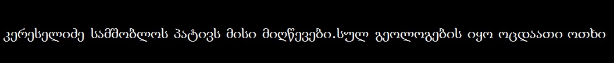

* тип задания: 2Т
* кол-во кодов на уровне: 5 - нестандартов.
* Чекаем правую сторону, внимательней Желтый баллон.

### Подсказка №1 (30 минут)

А что вас смущает? Обычный грузинский язык

### Подсказка №2 (1 час)

34-й инженерный проезд
Двигаясь в сторону Димитровградского шоссе чекаем правую сторону, трубы у дороги.

## Уровень №14 "34 инженерный вход"

Едем прямо к Димитровградскому шоссе и поворачиваем на права в сторону города.
Едем, смотрим на дорожные знаки!
Притормаживаем до 70 км. так как впереди пешеходных переход.
Проезжаем пешеходный переход, и едем дальше.
Опа внимание## Примыкание второстепенной дороги##
Она нам не нужна, едем дальше)))
Опа!!!Еще знак - Примыкание второстепенной дороги.
Тормозим у него##
От знака идем перпендикулярно от дороги на обочину и далее...
Чекаем## Входной чек с права здания.
Чеки ЖЕЛТЫМ баллоном.

----

## Бонусы

### Бонус №1 (2 минуты)

1992, 1993, 1994, 1996, 1997, 1998, 1999, 2000, 2001.

#### Подсказка

Спартак Москва, чемпионства РОССИИ.

#### Ответы

Спартак

### Бонус №2 (2 минуты)

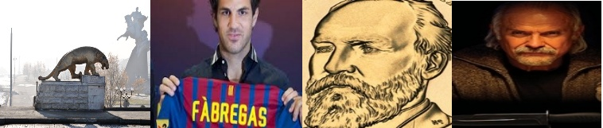

#### Подсказка

1 картинка - Северная Осетия (15 регион).
2 картинка - Сеск Фабрегас. В Барселоне 4 номер.
3 картинка - Джеймс Гарфилд, 20 Президент США.
4 картинка - Постер к фильму 12.

15 4 2012 = 15 апреля 2012 = Пасха

#### Ответы

Пасха

### Бонус №3 (1 минута)

аватар, бизнес, саммит, глоток, ананас, табель

#### Подсказка

Если записать все слова в столбик, то по одной из диагоналей можно будет увидеть слово.

#### Ответы

Ремонт

### Бонус №4 4 слова=1 слово - 1 (30 секунд)

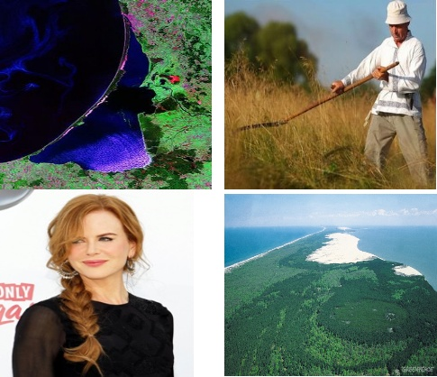

#### Ответы

коса

### Бонус №5 4 слова=1 слово - 2 (30 секунд)

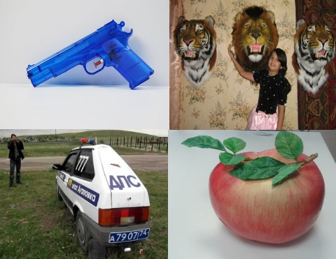

#### Ответы

муляж

### Бонус №6 4 слова=1 слово - 3 (30 секунд)

#### Ответы

успех

### Бонус №7 4 слова=1 слово - 4 (30 секунд)

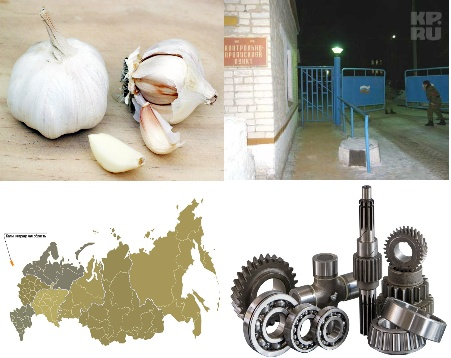

#### Ответы

Часть

### Бонус №8 4 слова=1 слово - 5 (30 секунд)

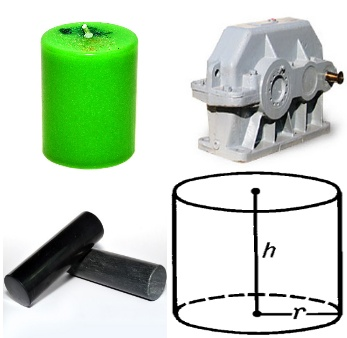

#### Ответы

Цилиндр

### Бонус №9 Марш несогласных-1 (30 секунд)

*ы о*я*а*е***о ****е*и**я
**ы*и** *е*я **о**и

Формат ответа: название песни на русском языке

#### Ответы
Весна

### Бонус №10 Марш несогласных-2 (30 секунд)

*о**о *ы*и *а*и*а* *ое* *а**у*е**о* *у*и
* э*о* *о*о*е *а* ***а**о **у*и*

Формат ответа: название песни на русском языке.

#### Ответы

безвоздушная тревога

### Бонус №11 Марш несогласных-3 (30 секунд)

*а* *е о***а**яю* у*и***я * *о**о*
*ы *е о*е*ае**я * *у*и*е *о**о*

Формат ответа: Имя Фамилия автора песни.

#### Ответы

Владимир Селиванов

### Бонус №12 Марш несогласных-4 (30 секунд)

**е *о* *о*у *ы *о* *о*у *ы **е
*а*у**и** *е***и*о* **аю
*а* y *о**и y *о**о**я **е я *е*я *а**и *а**и*аю
*е*е *ы *о*о**и **и**ые

Формат ответа: название песни, на русском языке

#### Ответы

Дельфины

### Бонус №13 Марш несогласных-5 (30 секунд)

*и*о*а *е*а **у*о*а *е*а
*е *о**ы** *е*е * *о*о *е*е**а

Формат ответа: название песни

#### Ответы

Широка река

### Бонус №14 Фрагменты-1 (30 секунд)

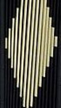

#### Ответы

баян
аккордион

### Бонус №15 Фрагменты-2 (30 секунд)

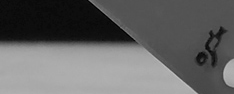

#### Ответы

лезвие

### Бонус №16 Фрагменты-3 (30 секунд)

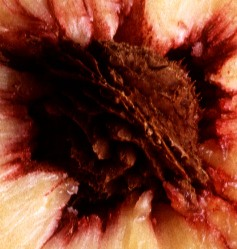

#### Ответы

Персик
Нектарин

### Бонус №17 Бонус 4 (30 секунд)

Ехать в поезде - долго. На самолете страшно, но можно под градусом. В отпуск очень хочется.
В общем жена запланировала такую поездку:
Барселона-Шарлеруа-Люксембург-Загреб-Приштина.

### Ответы

Бегун

### Бонус №18 Бонус 5 (1 минута)

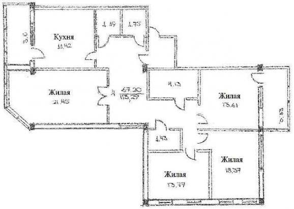

Загадан реальный адрес организации в Ульяновске.

#### Ответы

Московское шоссе 100 б

### Бонус №19 Бонус 6 (40 секунд)

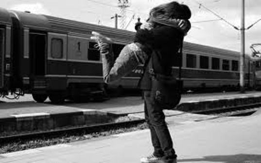

Загадан реальный адрес организации в Ульяновске.

#### Ответы

Гагарина, 12

### Бонус №20 Марш несогласных (2 минуты 30 секунд)

*e a*e **e **a**io** *y **ie**
a** *e'** *ee* o* *i***i** *i** **e e**

Формат ответа: название песни, на языке оригинала.

#### Ответы

We Are The Champions