# Идеи 5
## Полный БеспRеDеL: возвращение

Приветствуем всех осмелившихся!) 

Информация по самой игре будет в заглушке с 12.00 25 мая, собственно до этого времени доступен приквел) Наверно, кто-то ждал штабной приквел, кто-то - полевой, в общем, у нас вот такой получился) 

Выполнять его или нет - на ваше личное усмотрение) 

У вас есть возможность заработать максимум 36 минут бонуса. На локации 106 кодов (вы ж хотели стокодовку))) почему "стокодовка", а кодов 106? а потому что блондинки))))). Коды стоимостью 20 секунд. И плюс задание (за него 40 секунд - для затравки)) Собственно вот оно: 

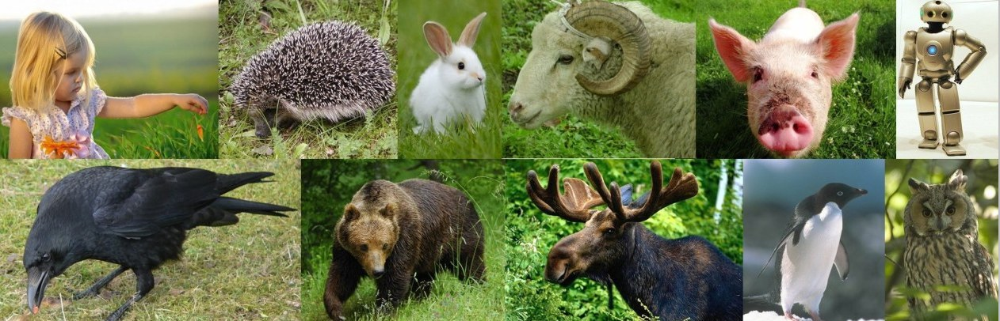

Ну-ка, детки, скажите, что их объединяет? Формат ответа: Слово 

#### Ответы

Смешарики 

### Бонус "Локация"

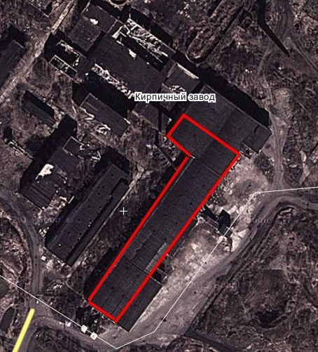

#### Подсказка

Цигломень, кирпичный завод. Надеюсь, все знают, но если что звоните.
Зона поиска на картинке и плюс на самой локации есть чеки. На коды естессссссственно конечек нет. 
Баллон синий, маркеры черный, зеленый, белый.
Коды BL***, где *** - слово; вводить только слово.
Будьте осторожны! 
P.S. Там грязно)

----

Всем привет! 

Мы рады вас приветствовать на нашей игре... тех, кто не побоялся нашей логики ;-) 

В общем, вас ждет 9,5 заданий, ну и там бонусные семечки для штаба (если он у вас будет). Ни одна локация не будет классической поисковой. Но что делать на локациях, в основном, вам придется догадываться самим, ну или брать штрафные подсказки с логикой поля. Коды опасности остаются прежними, локации интересные (ну нам там кажется), логика отсутствует присутствует (да-да, наша женская логика двух блондинок)))), матов будет много)) 

Обращаем ваше внимание, что время выполнения уровней разное, разное время прихода подсказок, автопереходы или возможность пройти уровень есть везде. Поэтому внимательно читайте задания. 
Ну и естественно переборы будут караться штрафами (если, конечно, иное не предусмотрено заданием). 

Еще хочется добавить, что в допах костюм выпускницы. Так вот, в него включается 4 элемента, за каждый отсутствующий элемент 30 минут штрафа, таким образом отсутствие костюма гарантирует минимум 2 часа штрафа =) Ибо найти такой костюм легко)) 

Баллон - синий 
Маркер - черный, белый, синий, может еще зеленый и красный 
Коды формата BL***R***, где ***-цифры или слова, вводить всё полностью (если иное не указано в задании) 
Чек - BL2 

Надеемся, допы взяли все))) 

Территория игры - Северодвинск и окрестности. Наверное) 

Если что, ну в крайнем случае, ну в очень крайнем, звоните. Телефоны будут сверху всю игру. 

Удачи, сладкие) =* 

P.S. Ждем вас в 21.00 на парковке у "Сити" 

P.P.S. И что бы ни случилось, помните, мы вас любим! ;-) klarxen, Elfa 

### Форматы штабных заданий

Со следующего уровня будут по немногу приходить штабные бонусные:

1. Две буквы. Загаданы два слова, отличающиеся на две рядом стоящие буквы. В ответ зайдет пара этих слов через пробел.
1. Одна буква. То же самое, только буква одна.
1. Слово в слове. Загаданы два слова, в каждом из которых есть еще одно слово. Пример: колоКОЛ и уКОЛ, бьем через пробел пару, слово, в котором меньше букв, идет первым.
1. Марш несогласных. Мы взяли известные мультфразы советского и российского производства. Убрали из них все согласные буквы, оставили вам только гласные и знаки препинания. В ответ зайдет названия кинофильма или мультика согласно Википедии в формате: Следствие вели Колобки.

## Уровень №1 "Агентское" - 1 час 10 минут

- Страшно то как! 
- Что опять? 
- А вдруг я туда зайду, а там жёлтый цыплёнок, смотрящий на юг, когда всходит солнце на востоке, клюющего червяка с худым тельцем, который умер от обряда сектантов при полной луне на кладбище... 
- Что за бред? Ты грибов что ли наелась? 
- А еще я боюсь смотреть на небо... 
- Выпей еще, а? 
- А еще я опасаюсь червяков... 
- Кто-то из нас сумасшедшая... но явно не я! 

Примечание: на месте ищите агента. 
Он отзовется на фразу: "Команда (название) к подаче последнего звонка готова!" 

Смело одевайте костюм! 

По субъективному мнению агента команды получат от 1 до 5 минут 

### Подсказка №1 (10 минут)

Ну тут всё элементарно... фобии же) 

### Комментарий

Агент в обмен на школьный вальс "выпускницы" с посторонним человеком выдавал колокольчик, на котором маркером было написано BL33R, если посветить на него УФ, получалось, что код BL88R

## Уровень №2 "Ягры" - 50 минут

А теперь фотоуровень. 

Сейчас вы всей толпой едете в бывшее здание "Ковчега" (Ягры) - кто не знает навигатор/гугл в помощь. 

На локации вас ждет 1 основной код. Конёчки есть. 

Ваша задача НА ВСЮ игру – сделать фотографию вашего прекрасного юноши-"выпускницы" из команды, спящей на лавочке. 

Итак, вы делаете фотку, на которой спит "выпускница". За такую фоту вы получите ровно 0 (ноль) минут бонусного времени. Но вы сможете увеличить это цифру до 30, если на фото будут присутствовать 6 неких предметов. Об этом дальше. 

На локации, кроме основного, написаны еще шесть бонусных кодов. Каждый бонусный код откроет бонус, в подсказке к которому вы найдете предмет, за присутствие которого на фото вы получите +5 минут бонуса. 

Вы вольны распорядиться временем на локе как угодно) Но ЭТУ ФОТОГРАФИЮ надо будет привезти на послеигровой брифинг. Уточняем: за просто фото вы получите 0 минут бонуса, за каждый доп предмет +5 минут бонуса (максимум 30 минут), за отсутствие фото - штраф полчаса) И не говорите, что вас не предупреждали) 

### Предметы 

одуванчик 
воздушный шарик (надутый) 
стеклянный стакан 
солнечные очки 
посторонний человек в кадре 
луковица 

## Уровень №3 "Рикасиха" - 1 час 30 минут

- Эля, пойдем в клуб! 
- Ну ты как будто не читала моих постов! 
- Да читала-читала... 
- И что там будет интересного? 
- Ну там будет много народу танцевать... 

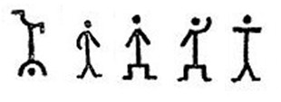

### Подсказка №1 (15 минут)

http://ru.wikipedia.org/wiki/%D0%9F%D0%BB%D1%8F%D1%88%D1%83%D1%89%D0%B8%D0%B5_%D1%87%D0%B5%D0%BB%D0%BE%D0%B2%D0%B5%D1%87%D0%BA%D0%B8 

в этой подсказке будет написано, как решить интерактив вспомните электронные часы.

* вправо-вправо
* вниз-вниз
* влево-влево
* вниз-вниз
* вправо-вправо

всё это образует цифру 2. 

дальше сами 

### Бонус "Локация"

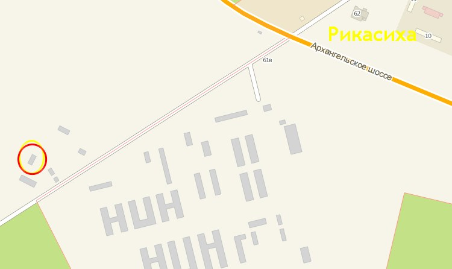

#### Ответы

лодка 

### Комментарий

На локации шесть кодов, на один из них есть чек маркером и он написан маркером, на одном чеке маркером написано УФшкой 2 кода и тут один код маркером, второй УФшкой, третий чек УФ и код УФ, четвертый чек УФ на два кода - один маркером, второй УФшкой.

## Уровень №4 "Баржа" - 1 час 30 минут

И тут с труб раздался крик: 
- Спасите! Помогите! Снимите меня отсюда! Я не хочу в этот майский день остаться тут навечно! 

### Подсказка №1 (10 минут)

Трижды сигналить... На что-то это похоже... 

### Подсказка №2 (20 минут)

Сигнал бедствия, в переводе означающий "Майский день" 

''в этой подсказке будет написана нужная комбинация
0-0 0-2 2-3 3-5 5-2 ''

### Бонус "Локация"

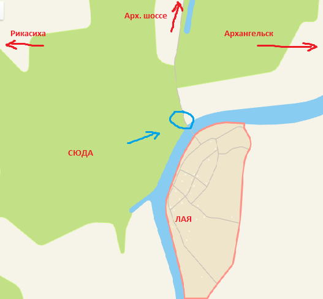

### Ответы

Mayday 

### Комментарий

На локации написано 11 кодов, но только 5 из них составляют верную комбинацию в домино; остальные шесть доминошек не подходят.

## Уровень №5 "Квартал" - 1 час

Чрезвычайно сложно писать такие простые задания! Реально сложно! Естественно на это я потратила больше времени, чем на сложные задания. Вы же мне верите, правда? Отгадывайте уже быстрее! 

### Подсказка №1 (10 минут)

В жизни не поверю, что вы не разгадали! Смотрите внимательно на задание, ничего не спрятано даже! 

### Подсказка №2 (15 минут)

Да ну по первым буквам предложений же! 

''перед вами объемный код. вам нужно найти точки, с которых на сваях вы увидите нужные цифры ''

### Бонус "Локация"

Победы 66, рядом 

### Ответы

чрево 

### Комментарий

На сваях с трех разных точек видны цифры, которые и составляют код

## Уровень №6 "Вышка" - 1 час 35 минут

- Я женщина-луна! Он-пепел! 
- Ааааааааааааааааааа, не своди меня с ума! 

Примечание: на локации ведите себя потише, к локе продвигаться без фонарей. Если что мы вас не знаем, вы нас не знаете) 

### Подсказка №1 (10 минут)

Тут уже даже не "не своди", уже сводишь! 

### Подсказка №2 (20 минут)

список Сводеша 

### Бонус "Локация"

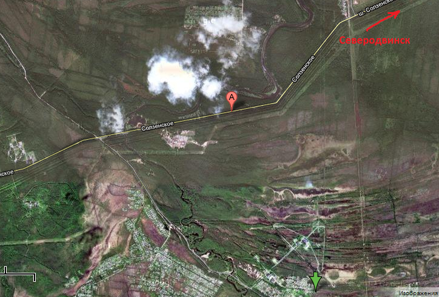
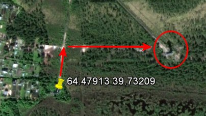

### Ответы

1361473167 

### Комментарий

На локации расписаны 30 кодов. Около каждого чека 5 кодов, верный из них только один.

## Уровень №7 "Радар" - 1 час 20 минут

- Эля! Эля! Смотри как прикольно! Это называют и обезьяной, и собакой, и улиткой, и лягушкой, и мышкой, и уточкой, и червем! 

P.S. Обращаем внимание на бонус "Сюрпрайз", он поможет найти то, зачем вы туда и поперлись :) 

### Подсказка №1 (15 минут)

В России это называют "собака" 

### Подсказка №2 (25 минут)

http://ru.wikipedia.org/wiki/@  ищем официальное название 

### Бонус за внимательность -  5 минут 

Будьте предельно внимательны! За это можно заработать 5 минут) 

### Бонус "Локация"

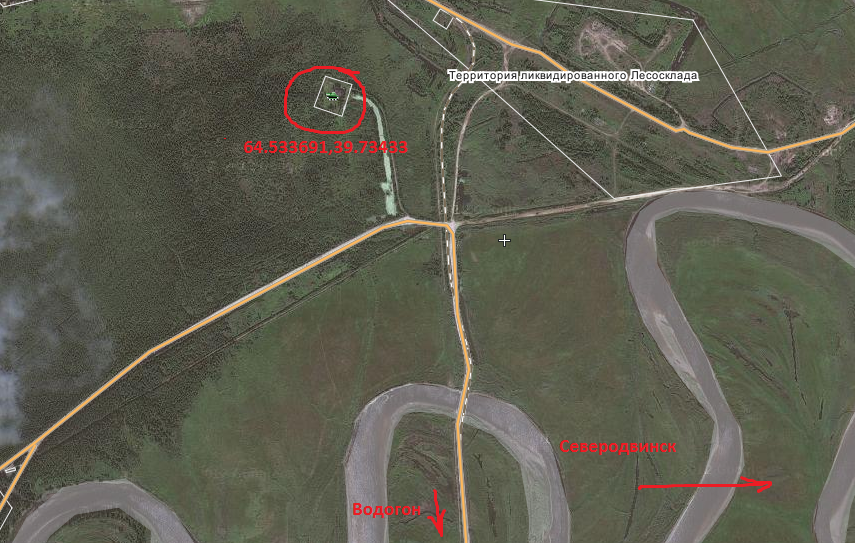

### Ответы

коммерческое at 

### Бонус "Сюрпрайз"

Коды вот здесь, вам осталось их только найти:

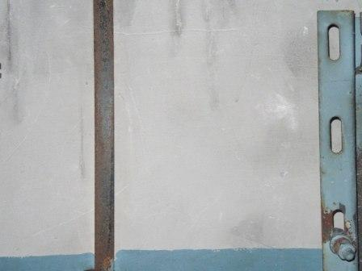
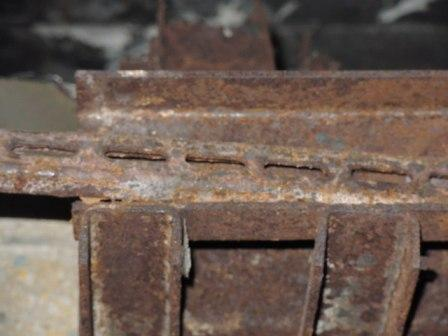
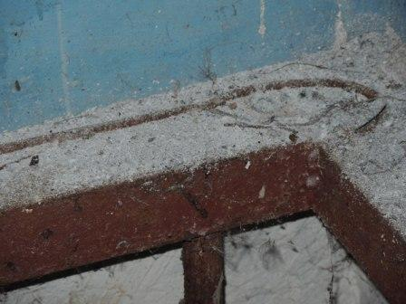
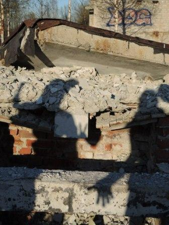
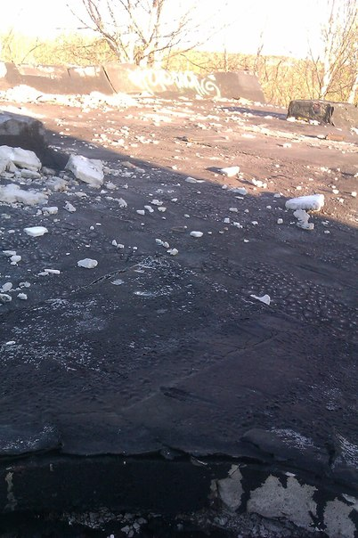

### Комментарий

5 кодов - 5 фотографий мест, где они написаны. Осталось найти эти места

## Уровень №8 "Домики" - 40 минут

Ребята! Доигрываете уже быстрее! А то она уже начала нести чушь! 
- Конопли то, Рейка, нам не надо... Нам бы с тобой сейчас намазип... 

Примечание: 
введите код баллоном прямо на входе 

Примечание2: 
на локации ведите себя ТИХО, к локе продвигаться без фонарей. Если что мы вас не знаем, вы нас не знаете) 

### Подсказка №1 (15 минут)

литорея 

### Бонус "Локация"

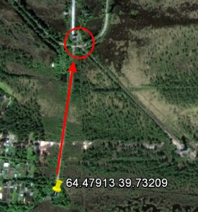

### Ответы

парафин 

## Уровень №9 "Коридор" - 45 минут

А какой сегодня праздник? Правильно. Последний Звонок! А так как мы уже давно не влезаем в юбочки школьниц-одиннадцатиклашек, то по этому поводу мы решили с Катей взять пиваса и посидеть. С горя. Как нормальные бабы, подумать о жизни. Как обычно, Катя начала с того, что крокодил не ловится, не растет кокос, а сиськи, собственно, не растут. Хотя растут, но с другой стороны. Внизу спины. И на самом деле это далеко не они растут. 
-Херня вопрос! Сейчас все будет! Поехали расставим силки на мужиков и может, наконец-то тебя женим. - После выпитого море казалось по колено, а пьяные школьницы уже не вызывали щемящее чувство тоски по утраченной юности и бесцеллюлитным попам 
-Стареем, Элька... Пошли что ли на дорогу выйдем, машину словим да в Северный, мне стипендию как раз перевели.... 

''Вам нужно собрать последовательность: 
звонок-бутылка-грудь-два обозначения мужчин-дорога-машина ''

### Комментарий

На локации чеки, рядом с ними рисунки. По этим чекам собираем коды. Потом внимательно смотрим историю и соотносим текст с рисунками - и вот она последовательность

## Уровень №13 "Заглушка" - 20 минут

Собственно ваши мучения практически закончились)) 
Но у вас еще есть время сделать фотографию и разгадать оставшиеся бонусы) 
Фотографию выпускницы вам нужно привезти на бриф. 
Напоминаем, что за просто фото вы получите 0 минут бонуса, за каждый доп предмет 5 минут бонуса (максимум 30 минут), за отсутствие фото - штраф полчаса) 

По поводу брифа: звоните 89021905346 (Катя) или 89600124920 (Эля) 

----

## Бонусы

### Бонус №1 "Две буквы"

На беспалубном судне еда 

#### Ответы

снедь снека 

### Бонус №2 "Две буквы"

На узком водном пространстве наступление противника 

#### Ответы

пролив прорыв 

### Бонус №3 "Две буквы"

малютка бежит 

#### Ответы

кроха кросс 

### Бонус №4 "Две буквы"

на каланче муха 

#### Ответы
вышка мошка 

### Бонус №5 "Две буквы"

фольклорный солидол 

#### Ответы
сказка смазка 

### Бонус №6 "Одна буква"

наклейка на штабельном конвейере 

#### Ответы
стакер стикер 

### Бонус №7 "Одна буква"

бабочка на футболке 

#### Ответы
майка маака 

### Бонус №8 "Одна буква"

компьютерный разъем в виде крупного животного 

#### Ответы
слот слон 

### Бонус №9 "Одна буква"

часть шприца на футболе 

#### Ответы
игла игра 

### Бонус №10 "Одна буква"

Вынужденная остановка на раздолье 

#### Ответы
простой простор 

### Бонус №11 "Слово в слове"

на французской реке тропический ветер 

#### Ответы
сона муссон 

### Бонус №12 "Слово в слове"

пчела-селедка 

#### Ответы
матка матье 

### Бонус №13 "Слово в слове"

координата курорта в болгарии 

#### Ответы
юндола долгота 

### Бонус №14 "Слово в слове"

часть ноги лесистого животного 

#### Ответы
олень голень 

### Бонус №15 "Слово в слове"

порча сахарного сиропа 

#### Ответы
сглаз глазурь 

### Бонус №16 "Марш несогласных"

**у*а*, *о*е*ь*а, я**о *ие*и*е**ое. И*и, *о*е*, о**а*и*ь*я * **а*у? 

#### Ответы
бременские музыканты 

### Бонус №17 "Марш несогласных"

- *а* *ы **о, и *о**е*ы *а *е*я е**ь *у*е*е?
- А*а! 

#### Ответы
Вовка в Тридевятом царстве 

### Бонус №18 "Марш несогласных"

*и*у я *а* *о*а**а, а **е *е*а*ь, а **е *е*а*ь, а **е *е*а*ь о*о*а! 

#### Ответы
летучий корабль 

### Бонус №19 "Марш несогласных"

*а* *о**и**я, *о*о*е,
А *о*е* *ы*ь, *о*а*е,
А *о*е* *ы*ь, *о*о*е
О**а**ы *о*е**о 

#### Ответы
Пластилиновая ворона 

### Бонус №20 "Марш несогласных"

*е*я*а, *а*а**е *и*ь **у**о! 

#### Ответы

Приключения кота Леопольда 