# Идеи 6
## Мракобесие и джаз

## Брифинг "Глашатай" - 3 минуты

Рады приветствовать вас на второй игре Чемпионата ENcore 2013. 

Эта игра про средние века. 
Рыцарские турниры, крестовые походы, инквизицию, королей, принцесс, демонов, ведьм и т.д. Представьте себе, что вы вдруг попали в то время и наслаждайтесь ) 

Вот некоторые правила, которые действуют на этой игре: 

1. Метка игры ENС2. 
2. Для стандартных кодов - они начинаются с ENС2, можно вводить без ENС2. 
3. Советуем внимательно читать форматы ответов, примечания и загадки. 
4. За невыполнение просьб организаторов на уровнях - штраф 30 минут. 
5. Телефоны для экстренной связи : 

_BD_ - 050-301-51-54 
Flight - 066-183-77-50 

"Зеркала" сайта: 
http://kharkov.encounter.cx 
http://kharkov.encounter.ru 
http://kharkov.en-world.org 
http://79.125.20.11/kharkov.en.cx 
http://79.125.117.164/kharkov.en.cx 

Старт общий, так что далеко не уходите. 

Всем удачи! 

## Уровень №1 "Турнир"

Вам предстоит принять участие в рыцарском турнире. 

Делайте это спокойно и без спешки, уровень все команды закроют одновременно. 

Для этого необходимо выбрать из своей команды двух самых ловких и метких. 
Подойдите к агентам и выполняйте их указания. 

За каждую пораженную мишень команда получит 5 минут бонусного времени. 
Всего мишеней две, попыток броска одна, на одного участника. 

## Уровень №2 "Благословение" - 35 минут

Я рыцарь - последний отпрыск своего рода, и о моих приключениях будет повесть эта. Все началось в день великого турнира, когда людьми полна была дворцовая улица... И огласил начало турнира король, и дала рукой знак та, что женой его названа. И выехал первым на поединок лорд с громким именем. И столпилась вокруг ристалища толпа - от люда торгового до люда ученого. И начался турнир - во славу великой Франции! 

Я ждал своей очереди, ибо по жребию - бился я последний... 
Зато я получил благословение! 

Вам нужен сквер напротив дома №50. 
Ищите реквизит на дереве. 
Реквизит руками не трогать! 

### Подсказка №1 (10 минут)
Из последних слов в предложениях складывается фраза. 

### Подсказка №2 (18 минут)
ул. Луи Пастера 

### Подсказка №3 (25 минут)
И благословение получил я не от кого-нибудь - от папы! 

### Подсказка №4 (30 минут)
Папа Урбан II, родился в графстве Шампань. 

### Ответы
12 марта 1088

## Уровень №3 "Торжество" - 45 минут

Откройте конверт со стороны А. 

### Подсказка №1 (5 минут)

Я выиграл рыцарский турнир, и теперь в моей голове звучала радостная песня. 

### Подсказка №2 (15 минут)

Как много горящих очей, 
Как много картонных мечей. 
...И я сегодня так странно одет, 
И я излучаю таинственный свет. 
Не спрашивай, это зачем, 
Это зачем... 

Ты - Королева Ночи, 
Я - Господин Никто. 
Когда сойдутся две темноты, 
Когда сойдутся две темноты, 
Начнется рассвет, а потом... 

### Подсказка №3 (20 минут)

Откройте конверт со стороны БАЛ. 

### Подсказка №4 (35 минут)

Танцующие движутся по какой-то определенной траектории. 

## Уровень №4 "Лютня" - 45 минут

На балу звучала музыка. '''mp3'''

Ищите код на столбе возле дома №44. 

### Подсказка №1 (10 минут)

Странные помехи слышны в записи... И они различной длительности... 

### Подсказка №2 (15 минут)

Воспользуйтесь азбукой Морзе. 

### Подсказка №3 (20 минут)

. .	 . _ 	. _ . 	_ _ 

### Подсказка №4 (25 минут)

Ул. Мира, 44 

## Уровень №5 "Похищение"

На балу произошло ужасное событие: была похищена принцесса! 

Король велел всем рыцарям собраться здесь: 

 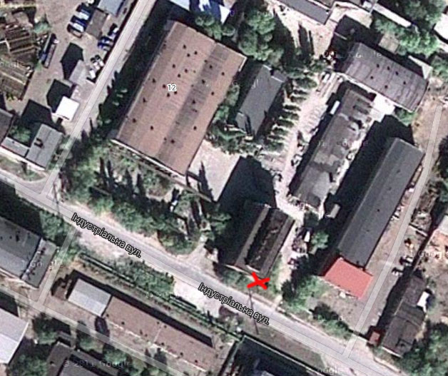

Ищите код доезда внутри здания. 

Внимание## 
В здание заходить только со стороны, отмеченной крестиком. 
Не шуметь! 

## Уровень №6 "Охота на чудищ" - 1 час 10 минут

Король объявил награду любому жителю, помогающему в истреблении чудищ, ведьм и всякой силы нечистой. Самая большая награда полагалась за убийство драконов. Но убить их сложно, гораздо легче справиться с вампирами, еще проще - с ведьмами и бесами. 

Играют 2,3,4,5 этажи здания. 
Коды в радиусе 5 метров от метки-монстра. 

Чтобы закрыть уровень, вам необходимо убить либо двух драконов, либо четырех вампиров, либо шесть ведьм, либо восемь бесов. 

Также за каждого убитого монстра можно получить бонусное время. 

* Бес - 1 минута
* Ведьма - 2 минуты
* Вампиры - 3 минуты
* Дракон - 5 минут

'''Внимание## 
На объекте категорически запрещено шуметь! 
На окнах кодов нет! 
В шахтах лифтов кодов нет! 
Внимательно смотрите под ноги, много досок с гвоздями! '''

### Подсказка №1 (40 минут)

Ведьмы: 

* 2й этаж: на синей трубе в комнате за меткой.
* 2й этаж: в дырке наверху слева от метки.
* 3й этаж: в шкафу справа от метки, на верхней полке.
* 4й этаж: на стене из стеклянных блоков напротив колонны с меткой.
* 4й этаж: на люстре в соседней от метки комнате.
* 5й этаж: на деревяшке справа от метки.

----

Подсказка на расположение драконов

* 5й этаж: в соседней от метки комнате; на выступе стены на высоте примерно 2 метра.
* 3й этаж: на уровне колена, на деревяшке недалеко от двери, справа от метки.

----

## Уровень №7 "Сбор" - 12 минут

И мы начали сборы. 

ВВЯМБХИФМГТШ... 

Продолжите ряд. 

### Подсказка №1 (4 минуты)

Для путешествия нам нужны деньги. 

### Подсказка №2 (8 минут)

ВВ - Владимир Великий 

### Ответы

ЛУГС

## Уровень №8 "В путь" - 1 час

Мы отправились в путь, чтобы спасти принцессу: 

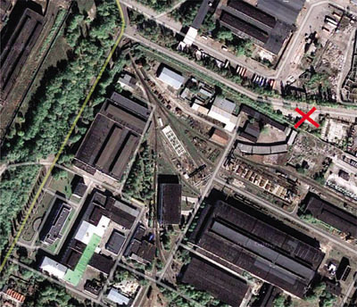 

N49.95957 E36.39724 

Ищите код доезда внутри одного из зданий. 

## Уровень №9 "Необходимость" - 35 минут

''Блокировка ответов: не более 1 попытки в течение 3 минут (для команды)''

На уровне 8 подсказок. 
Играют два помеченных здания и бетонные плиты рядом с одним из них. 
Они помечены метками 1,2,3. 

### Подсказка №1 (15 минут)

[на обочине] 
[Ридли Скотт 1979] 
[4] 

[Марс = 0,15] 
[Венера = 0,65] 
[Меркурий = 0,106] 

[.ru] 3.1 
[ Девиз: «Скромность и постоянство»] 

### Подсказка №2 (20 минут)

Нигредо, альбедо, рубедо. 

### Подсказка №3 (30 минут)

Философский камень. 

### Ответы

Философский камень

## Уровень №10 "Воззвание" - 15 минут

Спасение принцессы - важное мероприятие. И, очевидно, для этого нам понадобится помощь волшебника: 

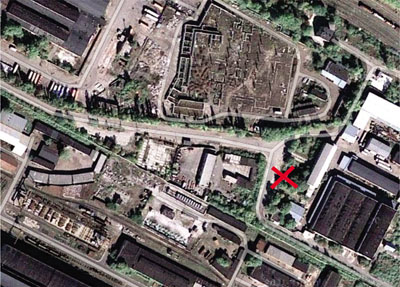

N49.959165 E36.399701 

Ищите металлический объект. 
Когда найдёте, зайдите внутрь и трижды позовите Великого Мерлина. 

### Подсказка №1 (5 минут)

Если ещё не поняли в чем вся соль, позовите ещё громче. 

### Подсказка №2 (10 минут)

Вы кричите: "Великий Мерлин!", а в ответ только: "Лин! Лин! Лин!.." 

### Подсказка №3 (14 минут)

Эхо 

### Ответы
эхо - для всех 

## Уровень №11 "Экипировка рыцаря" - 1 час

Итак, мы пустились в путь по дороге, называющейся "Или". Хотя в соседней державе она называется иначе. 
Вскоре мы дошли до лавки оружейника Футбриджа. 

#### Полевая логика: 

Вам необходимо собрать экипировку для рыцаря. 

Ваши изначальные параметры: 

Вес	0
Сила	50
Ловкость	60
Защита	0

Чтобы сражаться дальше, вы должны обладать параметрами: 

Вес	100 максимум
Сила	200 минимум
Ловкость	50 минимум
Защита	75 минимум

На уровне 16 кодов. Каждый код соответствует шмотке и открывает бонус с ее параметрами. 

### Подсказка №1 (8 минут)

Наверное, английское название этой большой наезженной дороги, соединяющей важные города, мне нравится больше. 
Кстати, Footbridge - хитрый тип, но ассортимент оружия поражает. 

### Подсказка №2 (16 минут)

Большая дорога - ТРАКТ, или - Or. Footbridge - мост для пешеходов. 

### Подсказка №3 (20 минут)

Пешеходный мост на пр. Тракторостроителей. 
N49.96107, E36.356945 

### Подсказка №4 (35 минут)

#### Доспехи: 

##### Большой доспех

Вес	+50
Сила	+50
Ловкость	-30
Защита	+60

##### Доспех Лорда

Вес	+40
Сила	+40
Ловкость	-30
Защита	+50

##### Легкий доспех

Вес	+30
Сила	+30
Ловкость	-20
Защита	+45

##### Доспех святых

Вес	+30
Сила	+40
Ловкость	-20
Защита	+40

#### Шлемы: 

##### Шлем Дракона

Вес	+30
Сила	+20
Ловкость	0
Защита	+30

##### Шлем Воина

Вес	+20
Сила	+10
Ловкость	+10
Защита	+20

##### Легкий шлем

Вес	+15
Сила	+10
Ловкость	+15
Защита	+15

##### Шлем Удачи

Вес	+25
Сила	+15
Ловкость	0
Защита	+25

### Подсказка №5 (45 минут)

#### Щиты: 

##### Щит Огра

Вес	+30
Сила	+20
Ловкость	-10
Защита	+30

##### Щит Девы

Вес	+20
Сила	+10
Ловкость	0
Защита	+15

##### Тяжелый щит

Вес	+30
Сила	+15
Ловкость	-5
Защита	+20

##### Щит Кочевника

Вес	+15
Сила	+15
Ловкость	0
Защита	+10

#### Мечи: 

##### Меч Палладина

Вес	+40
Сила	+120
Ловкость	-10
Защита	+10

##### Острый меч

Вес	+20
Сила	+90
Ловкость	0
Защита	0

##### Меч Смерти

Вес	+30
Сила	+110
Ловкость	0
Защита	0

##### Меч Огня

Вес	+35
Сила	+100
Ловкость	-5
Защита	0

### Подсказка №6 (55 минут)

Доспех Cвятых, Легкий шлем, Тяжелый щит, Острый меч 

## Уровень №12 "Попандос" - 1 час

This can help me to find my way:

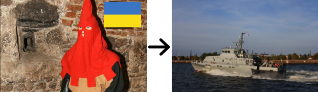
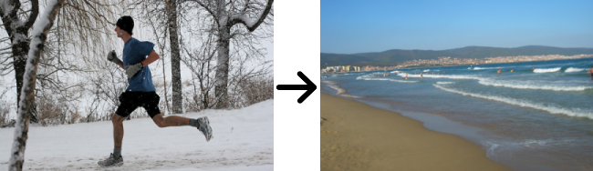
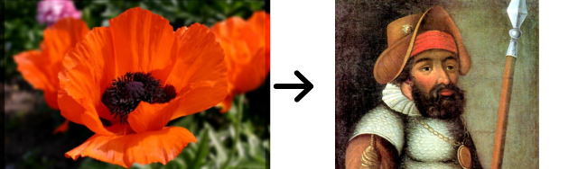

Ищите подсказку куда двигаться дальше на столбе напротив дома №2. 

'''Внимание## 
На объект заходить только с помеченного входа, рядом с которым находится код доезда! 
Не шуметь!''' 

### Подсказка №1 (12 минут)

Кат + ? = катер; 
бег + ? = берег; 
мак + ? = Ермак. 

### Подсказка №2 (15 минут)

Paste "ЕР". 

### Подсказка №3 (20 минут)

ул. Луи Пастера, 2, ищите на столбе подсказку с координатами. 

### Подсказка №4 (30 минут)
N49.935215, E36.361291 

## Уровень №13 "Застенки" - 1 час

''Вот уж чего мы не ожидали, так это того, что мы попадем в застенки инквизиции! Зря мы звали на помощь Мерлина! И нас выпустят лишь, если мы с Божьей помощью пройдем все испытания и докажем свою невиновность! ''

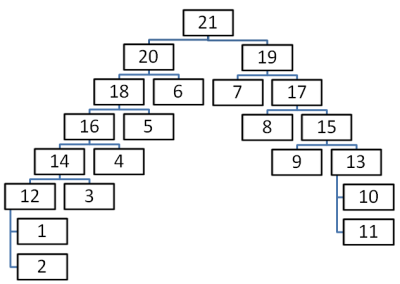

Играет только второй этаж. 
На уровне 11 подсказок. 
Разгадав их, вы получите 11 кодов. 
Остальные коды нужно додумать логически, согласно схеме. 

'''Внимание! 
Следующее задание на этом же объекте, вы можете разделиться, но не советуем. '''

Для логических кодов индекс соответствует номеру кода. 
Могут быть имена собственные. 

Например: король17, Артур34. 

### Ответы

Рыба 1
Зебра 2
Индия3
Бутылка4
Плач5
Молитва6
Награда7
Палестина8
Могила9
Камера пыток10
Ведьма11
Животное12
Инквизиция13
Корова14
Крест15
Молоко16
Тамплиер17
Младенец18
Орден19
Дева Мария20
Альфонс21

### Уровень №14 "Побег" - 45 минут

Мы должны бежать отсюда. Это сложная загадка.: 

Отправились как-то раз рыцарь, благородная дама, монах, крестьянин и купец в путешествие. Ночью им нужно было перебраться на другой берег реки. К сожалению, у них был только один фонарь на всех... 

1. У вас есть 30 секунд, чтобы переправить всех на другой берег.
1. Скорость движения по мосту у всех различна. Если переправляются два человека, то их время переправы равно времени прохождения самого медленного.
1. Без фонаря двигаться по мосту нельзя. Если кто-то переносит фонарь на другой берег, нужно вернуть его обратно, чтобы прошли остальные.
1. Мост очень ветхий, выдерживает не более двух человек.

Крестьянин 1 с 
Рыцарь 3 с 
Дама 6 с 
Купец 8 с 
Монах 12 с 

Играет подвал. 
Вход через второй этаж. Ищите метку. 
Ищите 15 подсказок. 

### Подсказка №1 (15 минут)

крестьянин - 1 с 
рыцарь - 3 с 
дама - 6 с 
купец - 8 с 
монах - 12 с 

### Подсказка №2 (30 минут)

крестьянин - SE 
рыцарь - KL 
дама - NT 
купец - XW 
монах - ZA 

крестьянин + рыцарь - NE 
крестьянин + дама - HK 
крестьянин + купец - IW 
крестьянин + монах - WC 
рыцарь + дама - LM 
рыцарь + купец - NB 
рыцарь + монах - XA 
дама + купец - AP 
дама + монах - TE 
купец + монах - BS 

### Ответы

NE SE BS KL HK SE NE 
NE KL BS SE HK SE NE
NE SE HK SE BS KL NE
NE SE HK KL BS SE NE

## Уровень №15 "Дракон" - 1 час

Отшельник сказал, что дом дракона указан на старинной карте. А спрятана она в тайнике:

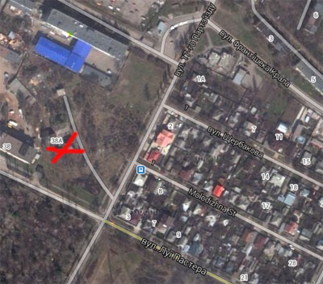 

N49.939441 E36.357397 

Ищите код доезда снаружи здания. 

## Уровень №16 "Понимание" - 35 минут

Мы усердно принялись за поиски карты. 

Ищите 6 кодов баллоном. 
Играет 1 и 2 этаж. 

В радиусе 5 метров от каждого кода баллоном есть бонусный код, написанный синим или черным маркером. Стоимость бонуса 5 минут. 

'''Внимание## 
На объекте будьте предельно внимательны и осторожны! 
Светите под ноги, много битого стекла и гвоздей! 
Выход на второй этаж по двум лестницам, нужные лестницы подписаны на входе. '''

## Уровень №17 "Карта" - 45 минут

Наконец-то карта была у нас в руках. 

Откройте конверт с правильной стороны. 
Коды на ближайших к объектам столбах. 

### Подсказка №1 (4 минуты)

На предыдущем уровне вы сняли коды: 

AHOP1, OBAT2, PAKA3, TAPB4, TEOP5, KTO6 

### Подсказка №2 (8 минут)
Прочитайте коды наоборот, начиная с последнего. 

### Подсказка №3 (12 минут)
Откройте конверт со стороны ВОРОН. 

### Подсказка №4 (30 минут)

Пр. Косиора, 51/22 
ул. Рыбалко, 40 
бул. Юрьева, 17 
пр. Маршала Жукова, 5 
Московский пр. 219 

## Уровень №18 "Схватка" - 1 час

Вскоре на нас напал отряд врагов: 

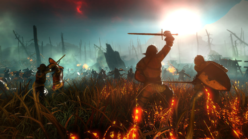
 
Б=В, О2=А 

Вам нужен объект напротив дома №50. 
Проникать на объект через дырку в заборе. 
На дырке стоит метка ENC2 маркером. 
Играет строение, на входе и дальний ангар. 
Двухэтажный кирпичный домик не играет. 

'''Внимание! 
На объекте не шуметь! 
Будьте внимательны и осторожны при проникновении на объект. '''

### Подсказка №1 (10 минут)

Поле боя 

### Подсказка №2 (15 минут)
ул. Полевая 52 

### Подсказка №3 (40 минут)
Видели повешенных под сводом? На потоки крови внимание обратили? Осторожно, смотрите под ноги, в полу может торчать арматура! 

## Уровень №19 "Провидение" - 25 минут

''Блокировка ответов: не более 2 попыток в течение 2 минут (для команды)''

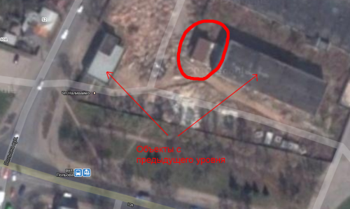 

Вам нужен объект в кружочке. 
Ищите подсказку, с какой стороны открыть конверт, на втором этаже в комнате справа в дырке под розетку. 

### Подсказка №1 (12 минут)
Императрица, влюбленные, луна, маг. 

### Подсказка №2 (18 минут)
Карты Таро. Номер карты соответствует номеру буквы в алфавите. 

### Подсказка №3 (24 минуты)
Вера 

### Ответы

Вера

## Уровень №20 "Вельможи" - 40 минут

Теперь мы точно знаем, куда ехать дальше! 

Ищите подсказку на столбе около дома № 12. 

### Подсказка №1 (8 минут)

Истинная вера - вот что нам поможет в поиске! 

### Подсказка №2 (15 минут)
Ул. Веринская 12. 

### Подсказка №3 (20 минут)
Ул. Сергеевская 8а. Ищите заброшенное здание рядом. 

### Подсказка №4 (30 минут)
Корона + Колпак 

### Подсказка №5 (35 минут)
Король и шут 

### Ответы
Король и шут - для всех 

## Уровень №21 "Продолжение пути" - 1 час

ENcore - Мракобесие и джаз :) 307 

Ищите код доезда на синих воротах. 
Код написан маркером. 

### Подсказка №1 (10 минут)
Привет от авторов игры :) 

### Подсказка №2 (15 минут)
SHEFF:) 

### Подсказка №3 (20 минут)
Ул. Шевченко, 307 

### Ответы
SHEFFF

## Уровень №22 "Определение" - 40 минут

''Мы двигались дальше, не взирая на все преграды, мы пересекали непроходимые густые чащи лесов, кишащие бандитами, спускались по непроходимым горным перевалам, переходили горные реки, но вот закончились последние деревья, и перед нами открылись бескрайние просторы степи. На нас ярко светило солнце. Я прикрыл его рукой, чтобы повнимательнее рассмотреть горизонт, но увидел только полосы ясного синего неба и некошеной травы. Лишь вдалеке виднелась маленькая черная точка. Я сразу смекнул, что это именно то поместье, которое мы искали, ведь там нам предстояло узнать, в какой стране мне искать похитителя...''

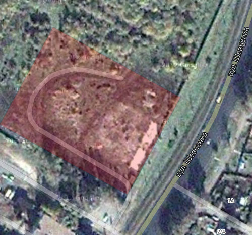

На территории, отмеченной красным, ищите 9 подсказок. 

### Подсказка №1 (10 минут)
Видимо без Евклида не разобраться. 

### Подсказка №2 (20 минут)
 
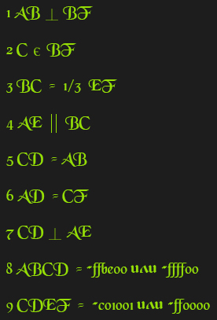

### Подсказка №3 (30 минут)
 

### Подсказка №4 (35 минут)

Моравия 

''Вы и ваши спутники сильно утомились в пути. За отдельную плату вы можете нанять местных сыщиков.''

 
### Ответы
Моравия

## Уровень №24 "Принцесса" - 1 час

Теперь мы знаем, где искать принцессу. 
Её держат в замке на острове. 

 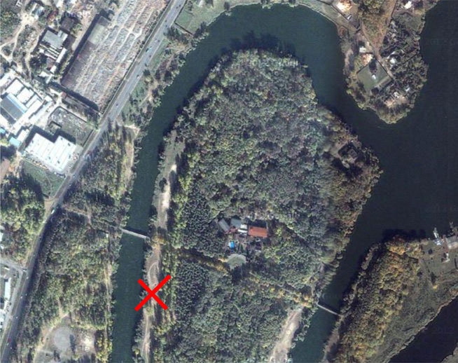

N50.017422, E36.296167 

Ищите агента, он выдаст код доезда. 

## Уровень №25 "Подготовка"

Вы на уровне заглушке. Этот уровень будет снят после прохождения его всеми командами. 
После того, как агент проинструктирует вас и допустит к выполнению задания, введите в поле ответа слово СПАСЕНИЕ 

ВНИМАНИЕ## 
Если Вы вобьете код прохождения заглушки раньше, чем агент допустит Вас к прохождению уровня, это будут ВАШИ проблемы. 

Пока стоите на заглушке приготовьте ВСЕ ваши конверты. 
Без них агент не допустит вас к прохождению задания. 

### Уровень №26 "Спасение" - 15 минут

Скажите агенту фразу: "Марио готов к работе!" и приступайте к выполнению задания. 

----

## Бонусы

### Штабной бонус 1 -  5 минут 

Во время наших путешествий нам довелось попасть в одно небольшое поселение в центре Европы. Нам нужно было переночевать и дать отдых нашим лошадям. Большая часть местного населения была южанами. Мне удалось разговорить одного из коренных жителей, который поведал увлекательную историю.

''Эта история началась в далекие незапамятные времена где-то в нижних землях в конце прошлого тысячелетия. В те времена люди только начинали заселять эти места. На берегу небольшой реки располагалось несколько укреплений. Как раз в это время в семье местных правителей родился мальчик, которому в будущем была уготована великая роль в истории. Когда пришло время, он первым из своей династии построил маленький замок рядом с укреплениями и столкнулся с людьми из вечного города. Позже территория владений этого рода только увеличивалась. Потомки этой династии хорошо зарекомендовали себя на войне. И некоторые из них стали даже великими полководцами. Хорошо известен и последний такой военачальник. Он был очень мудр и храбр, и после ожесточенной и кровопролитной битвы на Балканах основал организацию по борьбе с иноверцами. Сначала в организации было две дюжины человек, но со временем их количество возросло.''

Укажите имя одного из членов этой организации, на которого ее название оказало наибольшее влияние.

#### Ответы

Дракула 

### Штабной бонус 2 - 10 минут 

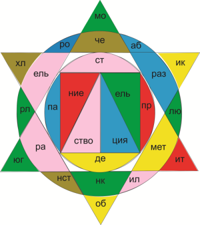

1. Фигура с большим числов углов идет за фигурой с меньшим или равным числом углов.
1. После желтого - зеленый.
1. После зеленого - коричневый.
1. За красным цветом должна быть вогнутая дуга.
1. За красным - розовый или желтый.
1. После синего - не розовый.
1. После коричневого - розовый.
1. После синего - выпуклася дуга.
1. После розового - синий.
1. Цвет может играть несколько раз.
1. Фигур пять. Каждая используется однажды.

#### Ответы

демонстрация 

### Штабной бонус 3 - 5 минут 

Для некоторых это ассоциируется с игрой связанной с хищной рыбой, для других - с командой из прибалтийской столицы. Назовите человека создавшего знаменитую американскую разновидность этого.

#### Ответы

Grant DeVolson Wood 

### Штабной бонус 4 - 3 минуты 

Некоторых название этого города может навести на мысль о женских грудях, другим на ум придёт орден, а какой?

#### Ответы

Францисканцы 

### Штабной бонус 5 - 5 минут 

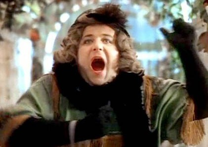

Мы не просим вас назвать имя, назовите фамилию автора.

#### Ответы

Эко 

### Штабной бонус 6 - 5 минут 

Вопрос задаёт один из организаторов харьковской Енки:

В 1816 году гарнизон ЭТОГО замка стал участником нетипичного для солдат события. С тех пор ОНО происходит там регулярно. Мы не спрашиваем вас к какой годовщине это было приурочено, назовите лишь упомянутый замок.

#### Ответы

Кронборг 

### Штабной бонус 7 - 5 минут 

Последний не обошёлся без английского рыцаря шотландского происхождения. А вас мы попросим назвать то, что в самом конце 60-ых двадцатого столетия стало альтернативой детскому.

#### Ответы

Бойня номер пять 

### Штабной бонус 8 - 5 минут 

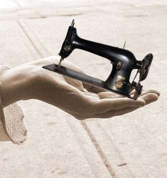

#### Ответы

Миннезингеры 

### Штабной бонус 9 - 5 минут 

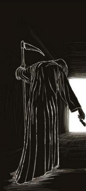

Назовите виновника.

#### Ответы

Yersinia pestis 

### Штабной бонус 10 - 5 минут 

Говорят, что одним из источников вдохновения для этой песни стал конфликт связанный с некоторыми растениями. Мы не просим вам назвать песню, назовите три буквы связанные с игрой, основой которой упомянутая песня стала относительно недавно. 

#### Ответы

HBO 

### Штабной бонус 11 - 3 минуты 

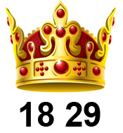

#### Ответы

рыцарь 

### Штабной бонус 12 - 3 минуты 

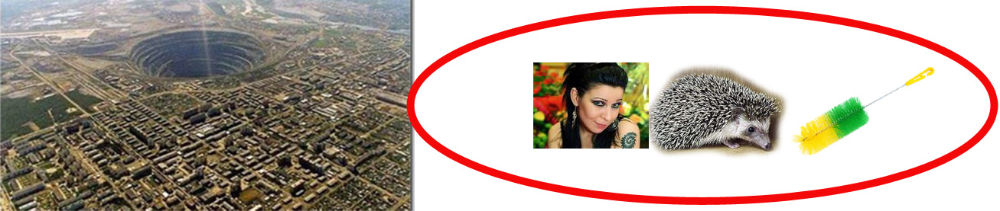

#### Ответы

копьё 

### Штабной бонус 13 - 3 минуты 

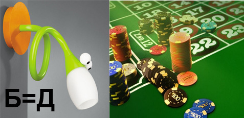

#### Ответы

дракон 

### Штабной бонус 14

После выхода сериала "Стрела" мы можем лицезреть ЕГО ТАКОГО. На вопрос о том, на что клюёт ТАКОЙ ОН в самом популярном ответе MAIL.RU упоминалась хоть и несколько скаламбуренная, но "иномарка" характерного серебристо-седоватого цвета. На самом же деле ТАКИМ ОН наверняка не был, ведь, согласно большинству источников, был влюблён в некую барышню, подарившую ему...что именно?

#### Ответы
Эскалибур 

### Штабной бонус 15 - 5 минут 

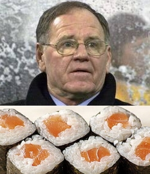

Назовите год рождения.

#### Ответы

1452 
1646 

### Штабной бонус 16 - 5 минут 

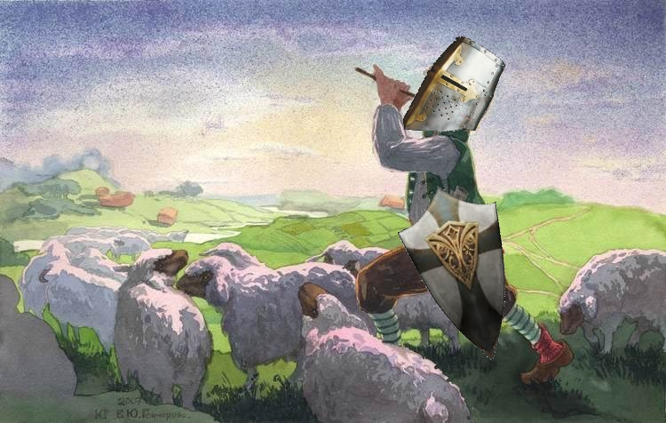

#### Ответы

крестовые походы пастушков 