# Идеи 8
## Без коммENтариев (vitebsk.en.cx)

## Уровень №1 "Похищение"

'''Поле:''' Итак, начнем. Тяните жребий, выбирайте одного человека в вашей команде с хорошим вестибулярным аппаратом и сажайте его в машину организаторов. Ближайшие 25 минут ему не звоните. Взять трубку все равно не разрешат.

Остальной части команды будет предложена возможность пройти (во всяком случае попытаться) бонус. Это будет единственный бонус, и его прохождение даст Вам минус 15 минут к финишному времени.

'''Штаб:''' Штабного задания на этом уровне не будет. Поможете полю.

На большинстве уровней будут проверки штабных. Эти архивы будут содержать существенную (или не очень) подсказку полю. В общем, всё как обычно.

'''ВАЖНО: Пароль к архиву вводить без пробелов. '''

Форма ответа стандартная: поле штаб через пробел. В случае нескольких кодов – сортируются по возрастанию последней цифры. В скобках в форме ответа будет указан пример штабного ответа.

### Подсказка №1 для всех (25 м.)

Можете звонить вашему игроку. Ваша задача - найти его.

### Подсказка №2 для всех (40 м.)

Последовательности поворотов (включая первый - с Панковой на Терешкову)
* -для маршрута Mitsubishi: п-л-л-п-л-л-л
* -для маршрута Ford: л-п-л-п-л-л-п-л
* -для маршрута Audi: л-п-п-л-л-л-п-п-л-л

### Подсказка №3 для всех (1 ч.)

Приблизительные расстояния между поворотами (начиная от первого - с Панковой на Терешкову), м:
* -для маршрута Mitsubishi: 900-1000-1800-1000-900-1000
* -для маршрута Ford: 750-750-600-1000-1900-750
* -для маршрута Audi: 1300-800-600-300-800-800-950-800

### Коды

* репитограф - для всех
* Комментарий к уровню "Похищение"
* Перед началом уровня, организаторы увозили на машинах зявязанноглазых игроков каждой из команд разными маршрутами, но в одно и то же место. Задача игроков была – определить вслепую направления поворотов, расстояния, характерные признаки пересечения тех или иных улиц или проспектов. Задача команды - по устному описанию максимально быстро разыскать своего игрока.

Плюс на этом уровне командам предлагалось пройти бонус: необходимо было проглотить рассасывающуюся капсулу от медпрепарата внутри которой находилась бумажка с кодом. Рассасывается эта капсула (даже не смотря на то что их было две - одна в одной) быстро. Так что время на маневры было мало. Единственный вариант прохождения – простите, извлечь её вместе с завтраком, обедом и ужином. Попытались, к нашему удивлению, почти все команды. Удалось лишь троим. Особенно целеустремленные, но невезучие, даже пробовали повторно…

## Уровень №2 "При чём здесь репитограф?"

”При чём здесь репитограф?”

'''Поле:''' Задание уже у Вас.

'''Штаб:'''

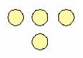

Назовите цвет

'''Форма ответа:''' поле штаб

### Подсказка №1 для всех (10 м.)

'''Поле:''' Карта не указывает Вам на месторасположение какого-либо объекта. Она сама по себе является ключом к получению кода. Подумайте, где и как её можно применить
'''Штаб:'''  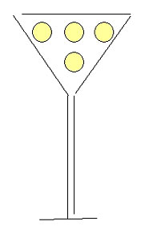

### Подсказка №2 для всех (25 м.)

'''Поле:''' Совместив кальку с картой в трамвае (а именно схема их движения и нанесена на неё) в прямоугольничке вы увидите кодовое слово.
'''Штаб:''' Какой цвет у сигнала трамвайного светофора? Ну… Поле как раз в трамвае. Пусть узнает заодно. Или почитайте ПДД п.45

### Подсказка №3 для всех (40 м.)

'''Поле:''' Трамвайно
'''Штаб:''' Бело-лунный

### Коды
трамвайно бело-лунный - для всех

### Комментарий к уровню "При чём здесь репитограф?"

На предыдущем уровне команды получили конверты, внутри которых лежала калька с непонятными на первый взгляд ломанными линиями и прямоугольником с меткой. Догадавшись что линии повторяют схему движения трамваев города, многие команды уезжали прочесывать тот район, где, по их мнению, должен был находится объект, символично изображенный на кальке прямоугольником. А вот те, кто подумал, что прозрачная бумага использована не случайно - решили попробовать приложить её к схеме движения транспорта (в обязательном порядке присутствующую в любом трамвае/троллейбусе). К их облегчению, в прямоугольнике аккуратно расположилось слово, вместе с меткой образовавшее по всем правилам написанный код. Так что мозговым штурмом уровень брался буквально за считанные минуты.

Начиная с этого, и на всех последующих уровнях, штаб либо тематически привязывался к полевому заданию, либо путем вскрытия проверочного архива давал хорошую подсказку полю. Полевые коды, в свою очередь, являлись дополнительной подсказкой к штабному заданию.

### Уровень №3 "Ночные снайперы"

”Ночные снайперы”

'''Поле: '''Не доезжая до: 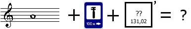

ищите нашу метку.

'''Штаб:''' Исходя из одного известного выражения, сильный должен ненавидеть его, слабый - боготворить. Назовите его фамилию и достаточно ироничное, но вместе с тем легендарное название одной из его первых моделей.

'''Форма ответа:''' поле штаб(Ford Scorpio)

### Подсказка №1 для всех (10 м.)

'''Поле:''' Недоезжая до Ля ТО Х
'''Штаб:''' В одном варианте афоризма он помог американскому президенту в достижении идеалов Великой Французской революции.

### Подсказка №2 для всех (20 м.)

'''Поле:''' На всякий случай вкратце маршрут: Выезжаете из города по направлению к пос. Октябрьский, недоезжая будет поворот направо и указатель. Далее на развилке на ж/д переезде едете налево. Сразу при въезде в лес будет наша метка.
'''Штаб:''' В другом - пошёл наперекор воле Творца

### Подсказка №3 для всех (30 м.)
'''Поле:''' Целься точнее, беги быстрее - формула успеха.
'''Штаб:''' Бог создал людей разными… Авраам Линкольн дал им свободу... А он дал им равенство. И, в определенном смысле, средство достижения мира

### Подсказка №4 для всех (45 м.)
'''Поле:''' Ничего, в шахматах отыграетесь.
'''Штаб:''' Сэмюэль Кольт. А одна из его легендарных моделей револьверов была, судя по названию, предназначена «для делания мира».

### Коды

миротворецкольта colt peacemaker - для всех

### Комментарий к уровню "Ночные снайперы"

В лесу, не доезжая дачного поселка Лятохи, команды поджидала импровизированная трасса для биатлона. Оганизаторы объясняли правила эстафеты, выдавали лыжи и отправляли на огневой рубеж. В качестве мишеней выступали наполненные водой контрацептивы. Отсутствие снега только добавляло веселья.
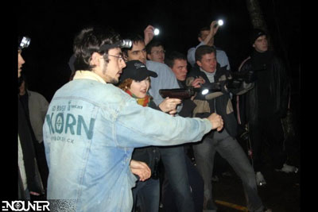

## Уровень №4 "Криптографическое трофи"

”Криптографическое трофи”

'''Поле:''' Следующее малопонятное словосочетание:

ЛАУРА КОЙОТ ВЫБЫЛ

подскажет Вам где искать скамейки, а следовательно и коды.

'''Штаб:''' Вам не безразлично как написан вопрос? Тогда вы наверняка в курсе полного имени Джека.

'''Форма ответа:''' поле1 поле2 поле3 поле4 штаб(Jackhammer)

### Подсказка №1 для всех (10 м.)

'''Поле:''' Следующее Малопонятное Словосочетание - SMS
'''Штаб:''' А не любите попить чайку с французской сдобой? А читаете часом не витебский еженедельник? А одну из старейших британских газет не уважаете?

### Подсказка №2 для всех (20 м.)

'''Поле:''' Расшифровать фразу можно применив Т9 на своих мобильных телефонах. А скамеек там изображено не так уж и много. Вам нужно объехать все. Если окажется что в этом месте скамейки нет, ищите рядом.
'''Штаб:''' Газеты - Курьер и Таймс. А попить чаю с французской булочкой мы всё же настоятельно рекомендуем.

### Подсказка №3 для всех (35 м.)

'''Поле:''' Бывший магазин «Колос» называется сейчас «Витебские продукты» и находится на пересечении ул.Берестеня – ул.Фрунзе.
'''Штаб:''' sphinx of quartz?

### Подсказка №4 для всех (50 м.)
'''Поле:''' Местонахождение кодов:
* - на остановке около синего дома
* - около зубной клиники на ул. Шрадера
* - два кода в парке около фонтана на площади Победы
'''Штаб''': Речь шла о специальных выражениях, содержащих сразу все буквы алфавита. В английском варианте: Jackdaws love my big sphinx of quartz.

### Подсказка №5 для всех (1 ч. 30 м.)

гараммонт1 комиксаанс2 аррриалл3 таххома4 jackdaws

### Коды

гараммонт1 комиксаанс2 аррриалл3 таххома4 jackdaws - для всех

### Комментарий к уровню "Криптографическое трофи"

Введя на своем телефоне с включенной функцией автозамены фразу "лаура койот выбыл" - игроки могли трансформировать её в гораздо более понятное "карта колос бывши". На террасе летнего кафе известного и недавно переименованного магазина "Колос" изображена художественная карта центральной части города. Скамеек там изображено не так уж и много, и все существуют и в реальности. Так что разгадав смысл задания, командам оставалось только составить оптимальный маршрут и собрать коды.

## Уровень №5 "SadoMazzoEggs"

”SadoMazzoEggs”

'''Поле:''' Внимательный штаб уже возможно знает на какое поле надо отправить поле. Если нет, то ищите требуемую информацию на сайте vitebsk.en.cx

'''ВАЖНО:''' приступать к выполнению уровня разрешается только после выполнения инструкций агентов!

'''Штаб:''' Кстати на этом же сайте, на титульной страничке гораздо больше "Зулу" чем Вы можете представить. Как минимум оно подразумевается ещё в десятке мест. Но в неочевидной форме, само собой. Догадавшись о чем это мы и учитывая, что форма ответа - три слова на русском языке, хороший координатор без труда даст правильный ответ.

'''Форма ответа:''' поле штаб(три слова на русском языке)

### Подсказка №1 для всех (10 м.)
'''Поле:''' Присмотритесь к карте города на титульной страничке в правом верхнем углу повнимателнее
'''Штаб:''' Но завтра, например, этих "подразумений" станет уже девять

### Подсказка №2 для всех (20 м.)
'''Поле:''' Футбольный стадион на Офицерской улице. А тем то уже там... Эх... А кто сказал что будет легко?
'''Штаб:''' Время, время! Следите за временем!

### Подсказка №3 для всех (40 м.)
'''Поле:''' Скажите организаторам кодовую фразу "Ахалай махалай", и они снимут яйцо для Вас. И развяжут. Может быть...
'''Штаб:''' Его называют "Временем Зулу"

### Подсказка №4 для всех (1 ч.)
этовремязулу универсальное координированное время

### Коды
этовремязулу универсальное координированное время - для всех

### Комментарий к уровню "SadoMazzoEggs"
На главной странице сайта на момент написания игры в верхнем правом углу распологался снимок города из космоса. Т.е. типовой дизайн сайта. После начала игры картинка была перезалита на несколько измененную:

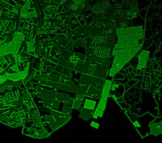

Метка прямо указывала пункт назначения.

Сам уровень запомнился как один из самых забавных. По приезду на место организаторы быстро связывали всем игрокам руки за спиной специальными стяжками и предлагали добыть код, который находился внутри яиц, подвешенных на высоте порядка двух с половиной метров. Методика прохождения у команд была разная. Кто то умудрился просунуть ноги через стянутые руки, кто то садился на плечи и раскусывал яйцо, кто то пытался строить лесенку из игроков команды. Но сняв или сбив яйцо, извлечь из него маленькую и свернутую бумажку с кодом оказалось тоже делом не простым. Кто то умудрился сделать это... губами

## Уровень №6 "Артистичный"

”Артистичный”

'''Поле:''' Следующий код Вам поведает многовековая сцена.
'''Штаб:'''
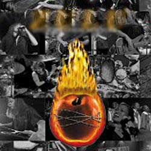
Это почти точное изображение CD одной замечательной рок-группы. К сожалению, купить его никому не удалось.
'''Форма ответа:''' поле штаб(Led Zeppelin)

### Подсказка №1 для всех (10 м.)
'''Поле:''' Сцена на площади Тысячелетия.
'''Штаб:'''
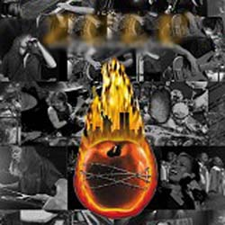
А вот как в точности выглядела оригинальная обложка альбома. По вполне понятным причинам дизайн пришлось в спешном порядке менять, а выпуск диска – переносить.

### Подсказка №2 для всех (25 м.)
'''Поле:''' Поведает в буквальном смысле слова.
'''Штаб:''' Яблоко (символ Нью-Йорка) в огне, две башни, объятые пламенем, и… релиз альбома назначенный на 11 сентября 2001 г. Мда…

### Подсказка №3 для всех (40 м.)
'''Поле:''' В наушнике, вмонтированном в сцену уже давно звучит искомый код.
'''Штаб:''' Dream Theater

### Коды
театр грёз dream theater - для всех

### Комментарий к уровню "Артистичный"
В фундамент концертной площадки на площади Тысячелетия, являвшейся целью поиска команд, был вмонтирован аккуратно замаскированный диктофон, на котором довольно тихо на repeat произносился код. С приходом подсказок, команды догадывались, что код не просто написан на сцене. Но гораздо более яркие впечатления остались у игроков, отчаявшихся что либо найти и присевших покурить, или завязать, к примеру шнурки, около диктофона и случайно услышавших код.

## Уровень №7 "Серпантин"

"Серпантин"

'''Поле:''' Организаторы ждут Вас недалеко от этого места:

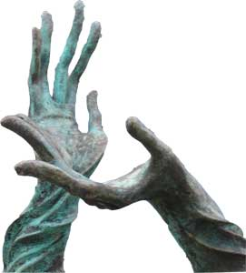

При себе иметь десять пластиковых бутылок (>=1.5 л), наполовину заполненных водой.

'''Штаб:''' Это устройство появилось в автомобилях довольно давно. Относительно распространенным стало уже с 30-х годов прошлого века. А на сегодняшний день является одним из определяющих факторов потребительского выбора.

'''Форма ответа:''' поле штаб(бортовая навигационная система)

### Подсказка №1 для всех (20 м.)
Поле: Езжайте на автостоянку около Эвикома.
Штаб: Особенно в Америке

### Подсказка №2 для всех (40 м.)
Штаб: А ещё оно носит репутацию «женского»

### Подсказка №3 для всех (1 ч.)
бесссцепления автоматическая коробка передач

### Коды
бесссцепления автоматическая коробка переключения передач - для всех

### Комментарий к уровню "Серпантин"
Проехать змейку на автомобиле с завязанными глазами, ориентируясь исключительно на слова штурмана, в принципе не так уж и несложно (хотя впечатления, говорят, необычные). А вот сделать это как можно быстрее и не уронить при этом вешку…

Под конец уровня пустая стоянка, в девять рядов заставленная полторалитровыми бутылками, смотрелась эффектно.

## Уровень №8 "Дети подземелий"

”Дети подземелий”

'''Поле:'''Тут недалеко творится что-то странное. И несомненно ужасное. Хотя вот по этим лицам, старательно намекающим Вам где именно,

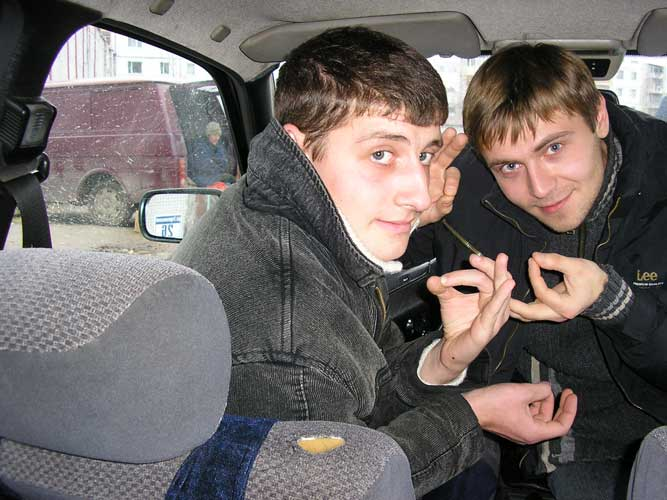

этого не скажешь.

'''Штаб:''' В прямом смысле «действующий» экспонат современного искусства установили в Лондоне пару лет назад. Автор (её вам и предстоит назвать) – художница итальянских кровей. Кстати, сооружение не только украшает улицу, но и служит своеобразным и весьма забавным психологическим тестом.

'''Форма ответа:''' поле штаб(Белуччи)

### Подсказка №1 для всех (10 м.)
'''Поле:''' Обратите внимание на зеркало заднего вида.
'''Штаб:''' 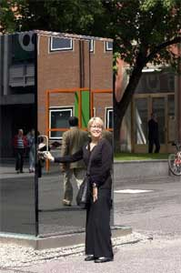  

### Подсказка №2 для всех (25 м.)
'''Поле:''' Код состоит из цифр и легко находится на ощупь. Да и снабжен меткой к тому же. Находится недалеко - на ул. Терешковой
'''Штаб:''' 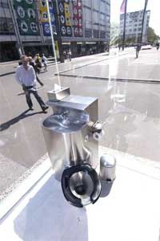

### Подсказка №3 для всех (40 м.)
'''Поле:''' 103157
'''Штаб:''' Бонвичини

### Коды
103157 бонвичини - для всех

### Комментарий к уровню "Дети подземелий"
При внимательном изучении бокового зеркала автомобиля на фото, можно было рассмотреть номер дома стоявшего позади дома. А дом №26 неподалёку, как следовало из задания, был только один. Чакры, изображаемые молодыми людьми - были не более чем отвлечением внимания... но отправили пару команд на поиски кришнаитов.

На самом уровне команды ждал абсолютно темный подвал, внутри которого на стене был закреплен код из металлических цифр (которыми обозначают квартиры) и специально изготовленная объемная метка. Запрет на пользование любыми осветительными приборами строго контролировался организаторами. Для дополнительного эффекта в подвале играла специфическая и весьма жутковатая музыка… Если это можно назвать музыкой. Скорее звуки из фильмов ужаса.

## Уровень №9 "А Вы уже и не надеялись…"

”Уже и не надеялись…”

'''Поле:'''
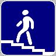
Мост недалеко от этого знака даст Вам пароль от архива.

архив

'''Штаб:''' Это – одна из самых из самых сложных в изготовлении продукция фармацевтических фабрик. Поэтому производителей, обладающих необходимой технологией, не наберётся и десяток. Назовите город, где это впервые начали производить.

'''Форма ответа:''' поле штаб(Амстердам)

### Подсказка №1 для всех (15 м.)
'''Поле:''' Надеемся Вы не путаете этот знак со знаком 5.17.1-2 «Подземный пешеходный переход»?
'''Штаб:''' Но в то же время, это ОЧЕНЬ массовая продукция.

### Подсказка №2 для всех (25 м.)
'''Поле:''' Надземный пешеходный переход в зоне покрытия игры только один – в Комарах. Пароль от архива – под мостом.
'''Штаб:''' Самое интересное, что к ней предъявляются требования не только по химическому составу, но и по физико-механическим свойствам.

### Подсказка №3 для всех (40 м.)
'''Поле:''' На некоторых столбах по дороге к башне на всякий случай поставлены метки.
'''Штаб:''' В частности, капсула должна выдерживать практически моментальный разгон до более чем 300 км\ч и быть маскимально травмобезопасной…

### Подсказка №4 для всех (1 ч. 20 м.)
'''Поле:''' шарикблин1 нетаблетка2
'''Штаб:''' … чтобы не оставлять синяков на теле пейнтболлиста.

### Коды
шарикблин1 нетаблетка2 виндзор - для всех

### Комментарий к уровню "А Вы уже и не надеялись…"
Немало команд всё таки перепутало знаки подземного и надземного переходов, потеряв немало времени на изучение центральных перекрестков города… А надземный переход в районе Витебска действительно только один. Под мостом команды находили пароль от архива, вскрыв который, получали карту как пройти к затерянной в полях/лесах водонапорной башне. Коды находились на верху башни - один внутри, другой снаружи. И если первый добывался достаточно легко (особенно после марш-броска по болотистой местности), то добывание второго усложнялось как сильным ветром и высотой башни, так и тем, что нижняя ступенька наружной лестницы (хоть и была где-то на уровне глаз) находилась прямо над небольшой запрудой, образованной стоком воды.

## Уровень №10 "Есть у нас один могильничек…"

”Есть у нас один могильничек…”

'''Поле:''' Езжайте по направлению к городу и ориентируйтесь по этим фотографиям:
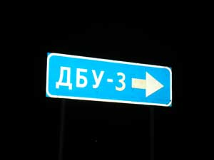 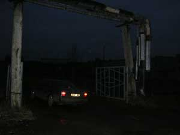 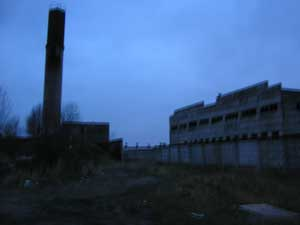

'''Штаб:''' Витебск – Юрмала – Ялта = бутерброд

'''Форма ответа:''' поле штаб(Бутерброд)

### Подсказка №1 для всех (10 м.)
'''Поле:''' На уровне 4 полевых кода. Каждый из них находится в радиусе 10 м от метки помеченной соответствующей цифрой. В здании не помеченном меткой, кодов нет. На крыши не лазить!

### Подсказка №2 для всех (20 м.)
'''Штаб:''' Ну а так то?
Глазго – Мадрас + Тегеран = бутерброд

### Подсказка №3 для всех (40 м.)
ПОДСКАЗКА №2 (30 мин)
'''Поле:''' Код №4 в башне
'''Штаб:''' Взгляните на время и подтяните пояс!

### Подсказка №4 для всех (50 м.)
'''Поле:''' За кодом №1 Вам придется лезть по трубе, заботливо приготовленной Вам организаторами.
'''Штаб:''' Вас интересуют острова

### Подсказка №5 для всех (1 ч.)
'''Поле:''' Метка для кода №3 расположена прямо под потолком.
'''Штаб:''' Сандвич

### Подсказка №6 для всех (1 ч. 10 м.)
'''Поле:''' трубасукаприкольная куклатанк2 джессикаджонатановна алуппка4
'''Штаб:''' сандвич

### Коды
трубасукаприкольная куклатанк2 джессикаджонатановна алуппка4 сандвич - для всех

### Комментарий к уровню "Есть у нас один могильничек…"
Ну и на последок хороший подарок любителям огромных недостроев. А также шанс вырвать место повыше прямо на самом финише хорошо подготовленным в поиске командам.

Первый код находился в конце длинной воздухоотводящей трубе, проходящей под потолком цеха. Она была достаточно большого диметра, чтобы внутри неё мог перемещаться человек. Клаустрофобам строго не рекомендовано!

Метка второго кода была расположена в углу ничем не примечательного здоровенного и совершенно пустого ангара. А написан код был на гелевом шарике, привязанном тонкой леской к кирпичу, лежащему неподалёку. После долгого и безуспешного осматривания каждой щели код обнаруживался висящим прямо над головой.

Третий код – для любителей немного поэкстримальничать. Забравшись по металлической опоре под потолок и пробежавшись по балке, попадаешь на подвесной кран. На одной из перил и находился код. Метка, указывающая что код надо искать где-то здесь была нарисована на стене прямо под потолком. За счет большой высоты случайно наткнуться на неё лучом фонаря было достаточно сложно.

Ну а четвертый код – наверху высоченной башни около завода.