# Картинки

## Убийство аристократа

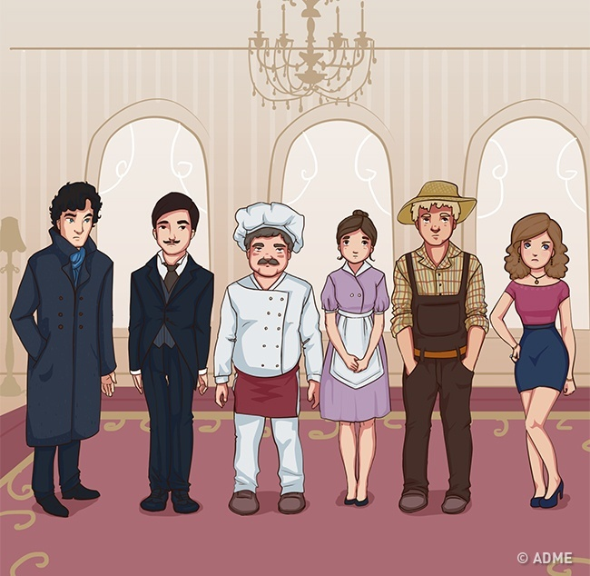

Джордж Смит был убит воскресным вечером. В этот момент в доме находилось 5 человек: жена мистера Смита, личный повар, дворецкий, служанка и садовник. Все они рассказали детективу Стивенсу, чем занимались в этот вечер:

* Миссис Смит сидела у камина и читала книгу.
* Повар готовил завтрак.
* Дворецкий командовал рабочими в гостиной.
* Служанка мыла посуду.
* Садовник поливал растения в оранжерее.

Сразу же после разговора детектив арестовал убийцу. Кто убийца и как Стивенс вычислил преступника? Ответ на обороте.

----

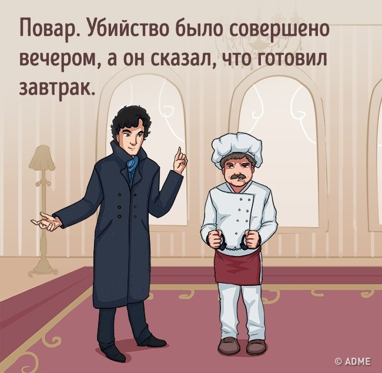 

## Глупый убийца

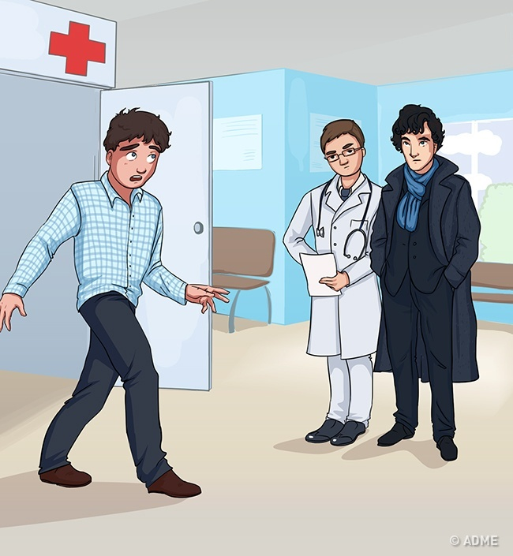

Детектив разговаривал с доктором в приемном покое, когда в дверь вбежал встревоженный мужчина и закричал: «Кто-то стрелял в мою жену!»

Детектив попросил его рассказать, что случилось. Мужчина представился мистером Кларком и поведал, что он был на работе, когда ему позвонила домработница и сказала, что с его женой случилось что-то ужасное и она в реанимации. Он тут же бросил трубку и побежал в больницу.

Как только мистер Кларк замолчал, детектив тут же арестовал его за покушение на убийство жены. Почему он так поступил?

----

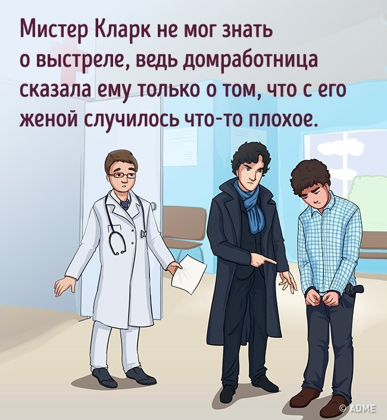

## Кровные узы

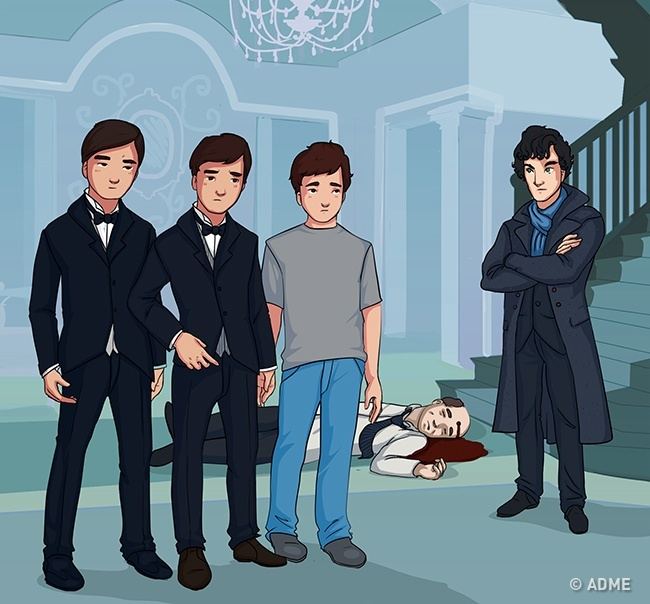 

Миллионер был убит в своем доме выстрелом в лоб. Детектив опросил 3 сыновей миллионера: Джека, Джона и Джеймса, которые были дома.

- Джек сказал, что этим вечером он, Джон и отец были на приеме. Они приехали домой и вошли в гостиную: первым зашел отец, за ним Джон и затем сам Джек. Когда отец подошел к лестнице на второй этаж, в дом вошел Джеймс и застрелил отца.
- Джон подтвердил показания Джека.
- Джеймс рассказал, что был в этот вечер в гостях у друзей, и когда он вошел в гостиную, отец уже был мертв.
 
Детектив сразу же понял, кто убил миллионера. Кто это был и как Стивенс об этом догадался?

----

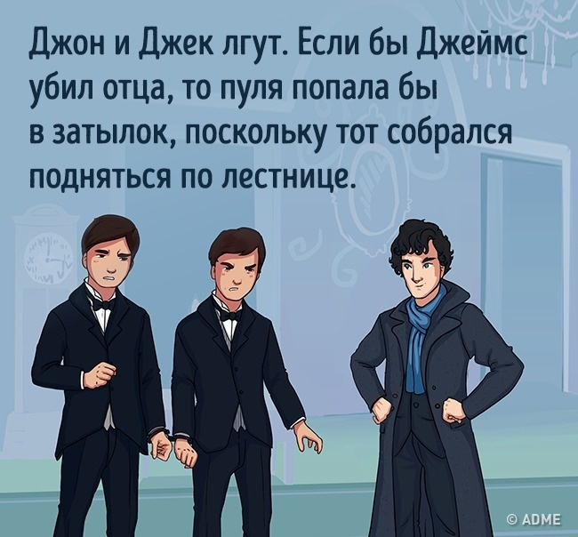 

##  Побег

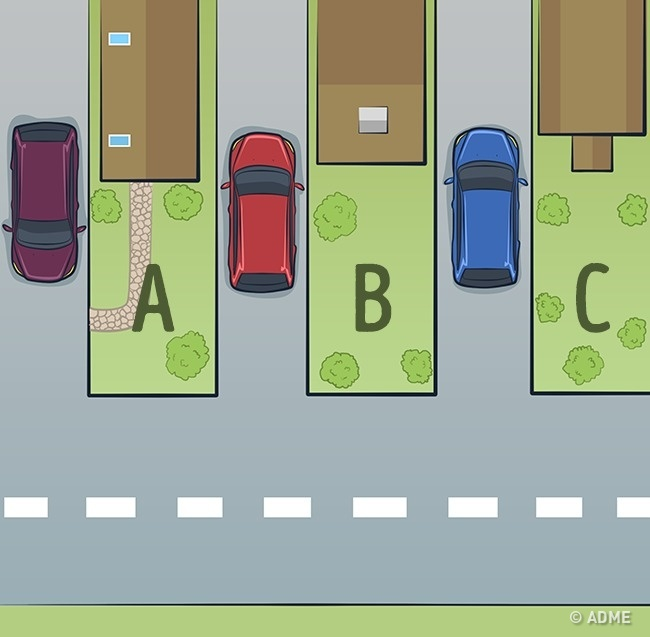

Однажды детективу дали задание найти преступника, сбежавшего из тюрьмы. Он знал, что преступник находится в одном из трех домов, но ему нужно было знать точный адрес, чтобы не спугнуть преступника. Для начала с помощью дрона он сфотографировал дома сверху.

Как только детектив посмотрел на фото, он сразу понял, где находится беглец. Где преступник и как его удалось вычислить?

----

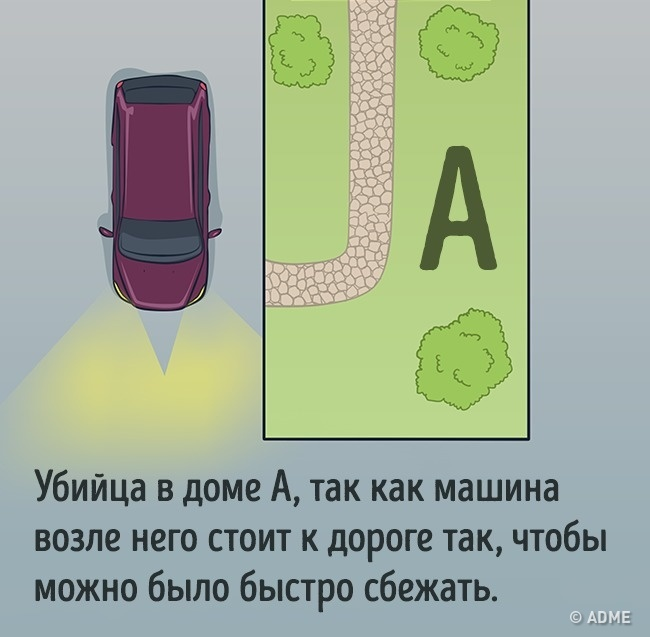 

##  Романтическое путешествие

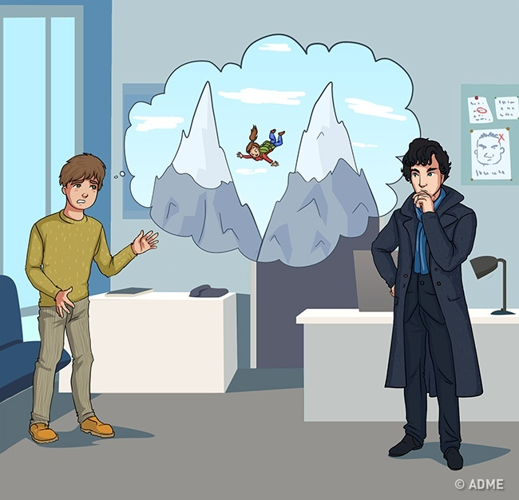

Мистер и миссис Клайд отправились в путешествие в горы. Но уже через два дня мистер Клайд вернулся домой один. Он пошел в полицию и рассказал детективу, что во время восхождения миссис Клайд разбилась насмерть.

На следующий день детектив Стивенс пошел домой к мистеру Клайду и арестовал его за убийство жены. Клайд признался в совершении преступления, только спросил, как детектив узнал, что он убийца. Стивенс сказал, что утром ему позвонил туристический агент и кое-что сообщил.

Что поведал детективу туристический агент?

----

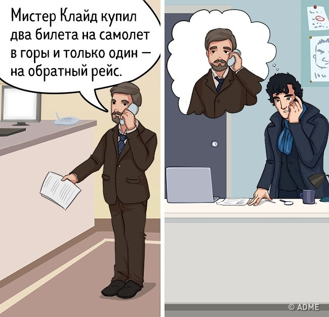 

##  Убийство по дружбе

Мэри и Бен жили в одном доме вместе с 4 своими друзьями. Однажды, вернувшись с работы, Бен увидел на диване мертвую Мэри и тут же вызвал полицию.

Детектив приехал на вызов и понял, что Мэри убили совсем недавно. Он опросил всех 4 друзей.

- Миа была на кухне и рассказала, что пришла с работы 2 часа назад и тут же отправилась на кухню.
- Джон сидел с книгой на шезлонге в саду и, по его словам, не уходил оттуда с утра.
- Дженнифер плавала в бассейне и сказала, что провела там не менее 3 часов.
- Джейн была в своей комнате и рисовала.

Детектив попросил всех показать свои руки и тут же понял, что один из них соврал, а значит, этот человек и есть убийца. Как Стивенс определил убийцу?

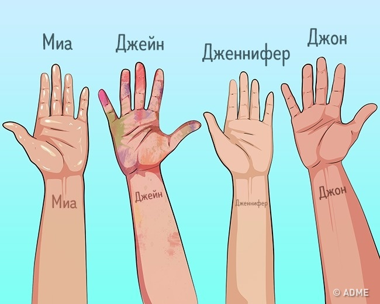

----
 
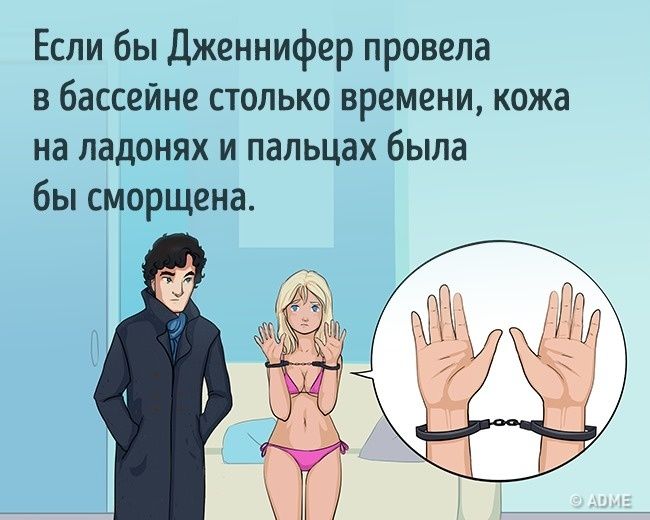 

## Трагедия детектива

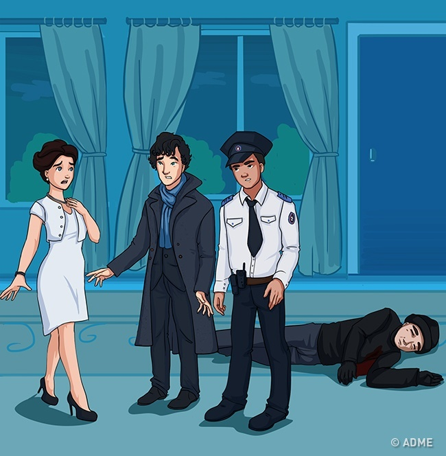

Утром в свой выходной детектив сильно поссорился с женой и ушел, оставив ключи и телефон. Когда вечером он вернулся домой, то застал там своего коллегу, испуганную жену и мертвого человека на полу. Жена рассказывала полицейскому такую историю:

«Я сидела в гостиной и услышала дверной звонок. Подумала, что вернулся муж, и открыла дверь. И тут преступник толкнул меня, вошел в квартиру, и я ударила его ножом, который был у меня в руке».

Услышав это, детектив приказал коллеге арестовать свою жену за то, что она планировала его убийство.

Как детектив догадался об этом?

----

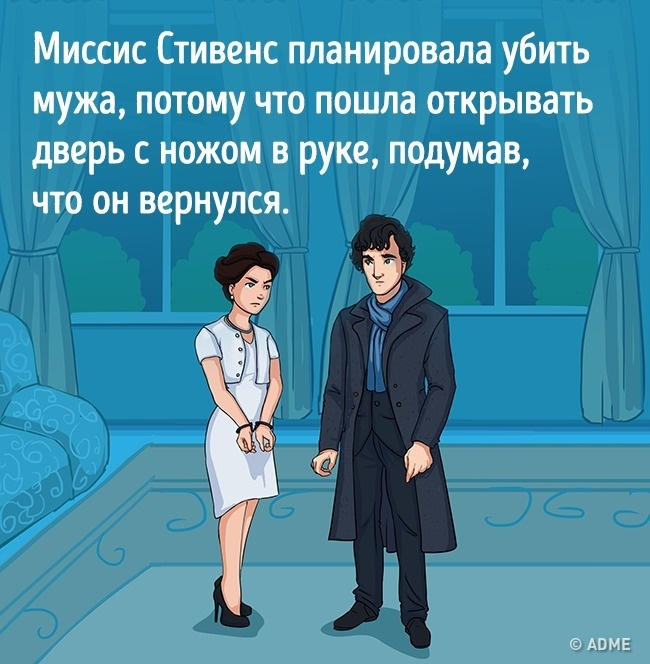 
