# Этот тест в картинках покажет, насколько логично вы мыслите

Как давно вы играли в Шерлока? В повседневной жизни делать это получается довольно редко, только если не стоит задачи выяснить, куда пропал любимый шарф или кто на работе взял вашу кружку. Но ведь иногда так хочется проверить, на что способен наш мозг.

## Начнем с простенькой разминки. Взгляните на картинку

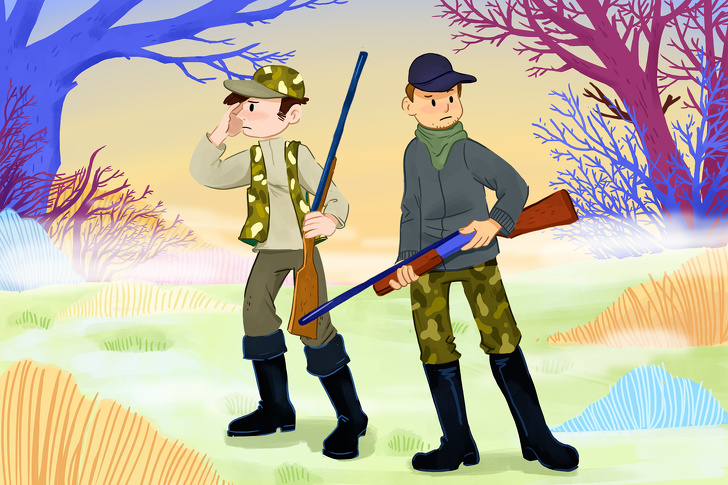

Двое браконьеров охотятся за оленем. Он промелькнул перед глазами и скрылся из виду. Охотники было погнались за ним, но упустили. Однако он убежал совсем недалеко. Сможете найти его?

[Ответ][./Незадачливые охотники]

## Немного сложнее. Встреча на улице

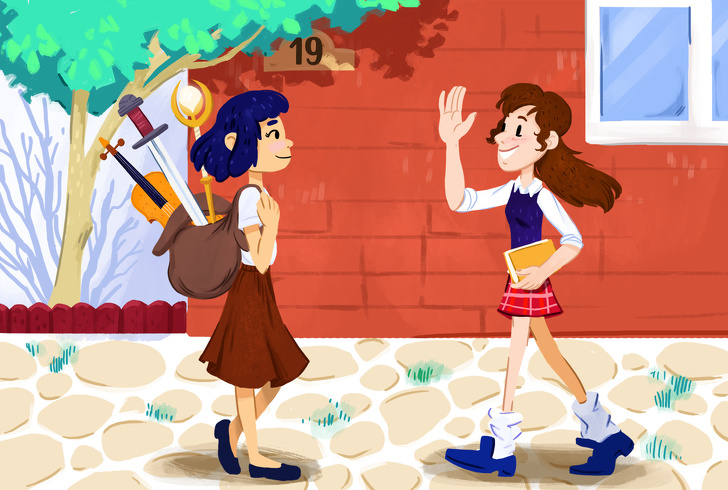

Две подружки случайно встретились на улице.

— Здравствуй, Алиса. Куда ты идешь?
— Я иду в 23-й дом, — сказала Алиса. — А ты куда, Женя?
— А я к Свете, подружке, она живет в доме № 7, — ответила Женя.

Теперь скажите:

1. Кто из них Женя, а кто Алиса?
2. Куда идет девочка со стрижкой каре?

[Ответ][./Встреча на улице]

## Кто хозяйка кошки Матрешки?

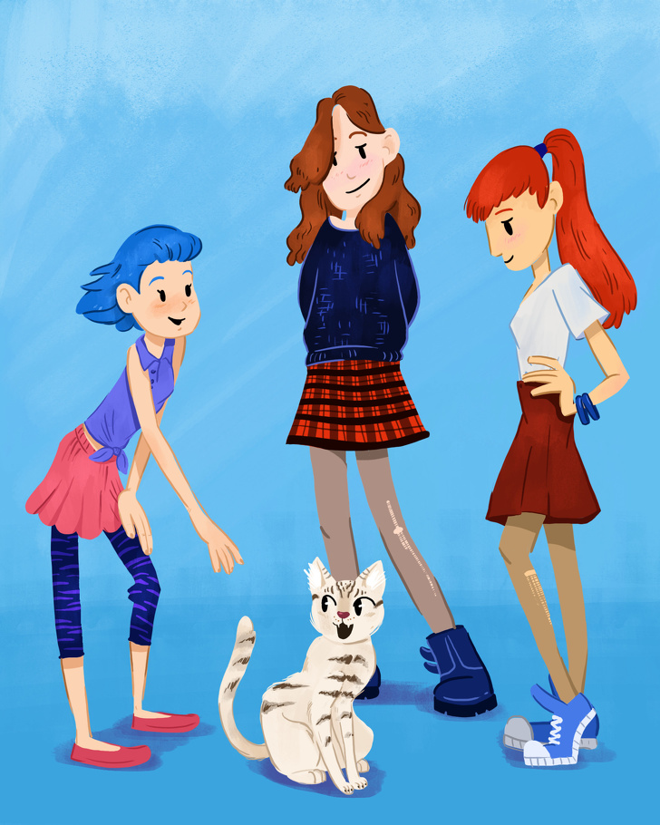

На рисунке 3 подружки: Алена, Маша и Ирина. Все девочки очень увлечены кошкой, вот только кто же из них является ее хозяйкой?

[Ответ][./Кошка Матрешка]

## Дети в походе

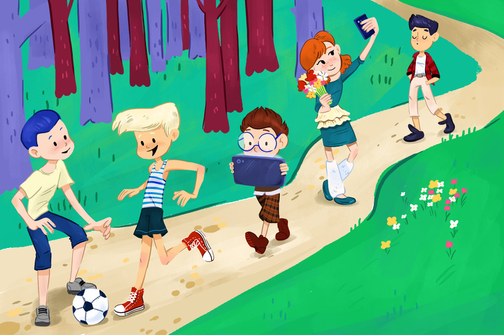

По дороге идут 5 ребят. Одного из них зовут Мишей, и он стоит с краю. Если бы Варя шла рядом с Максимом, то Егор оказался бы рядом со своим тезкой. Вопрос: кто где идет?

[Ответ][./Дети в походе]

## Старушки с лейками

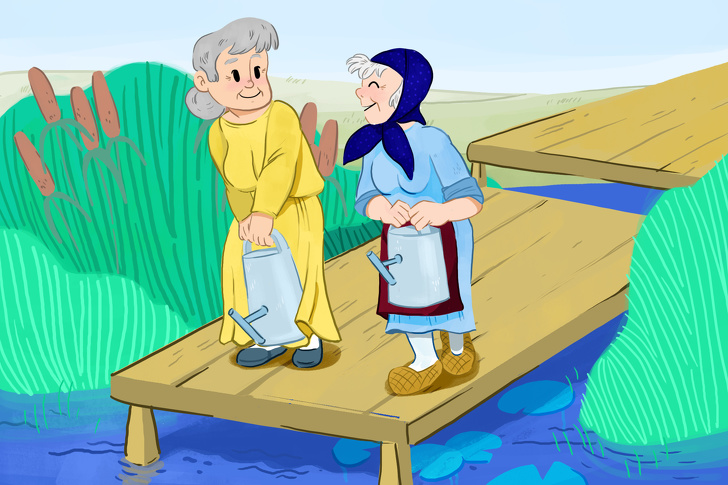

Две старушки-подружки пошли на речку, чтобы набрать воды для поливки. Кто из них польет свой огород большим количеством воды?

[Ответ][./Старушки с лейками]

## Куда едет поезд?

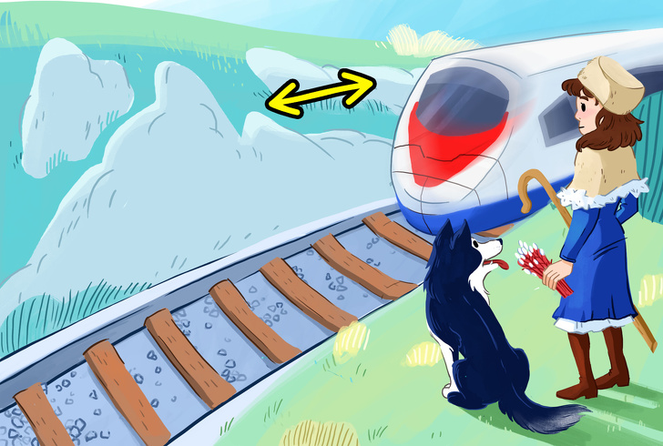

На картинке вы видите участок железной дороги «Москва — Нижний Новгород». Здесь направление дороги совпадает с направлением стрелки, изображенной сверху, концы стрелки указывают на запад и восток. Посмотрев на рисунок, скажите:

1. Куда идет поезд: из Москвы в Нижний Новгород или обратно?
2. Какое время года и какой месяц показаны на рисунке?
3. Чем занимается девочка, изображенная на картинке?

[Ответ][./Поезд Москва - Нижний Новгород]

## Задача посложнее: нужно найти все неточности на картинке. Говорим сразу — их 16!

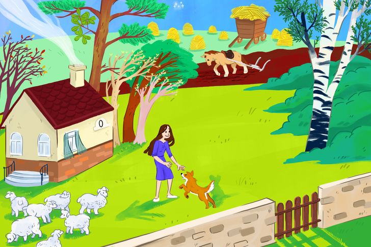

Вглядывайтесь внимательнее в мелкие детали, и у вас все получится.

[Ответ][./Картинка с домом]

## Жизнь в реалиях постапокалипсиса

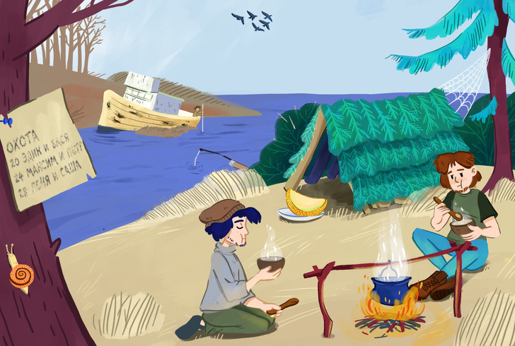

Посмотрите внимательно на картинку и ответьте на следующие вопросы:

1. Сколько человек живет в лагере?
2. Как давно они живут на этом месте?
3. Глубока ли река около лагеря?
4. Журавли летят на север или на юг?
5. На картинке изображены 4 человека. Чем каждый из них занимается?
6. Кто еще, кроме ребят, выжил после апокалипсиса?
7. Носом вверх или вниз по течению стоит пароход?
8. Какой месяц показан на рисунке?

[Ответ][./Постапокалипсис]

## Загадка про папу и сына

Внимательно вглядитесь в картинку и ответьте на вопросы, как и в предыдущей загадке.

1. Кто по профессии отец?
2. В какой стране живет эта семья?
3. Какое время года и какой месяц?
4. Есть ли еще дети в семье?
5. В каком году происходит действие?

[Ответ][./Папа и сын]

## А теперь самое сложное задание: найдите 8 отличий между двумя картинками

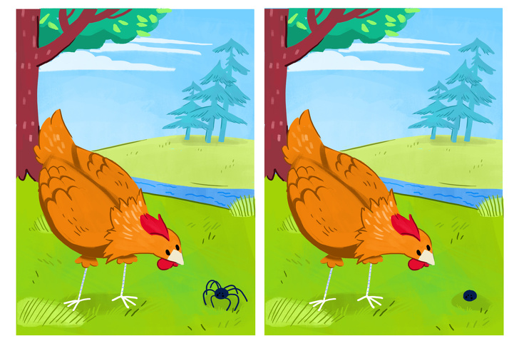

[Ответ][./Курица и паук]

## С каким счетом окончился матч?

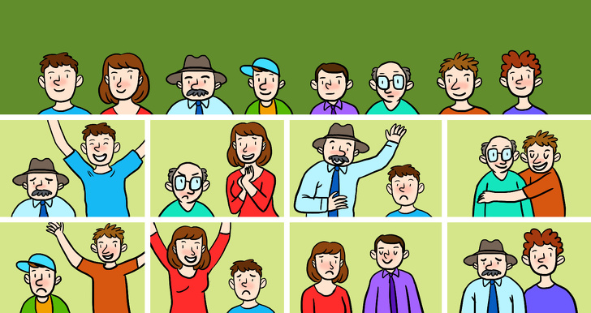

[Ответ][./С каким счетом окончился матч]

## Найдите на картинке семь вещей, в которых ошибся художник

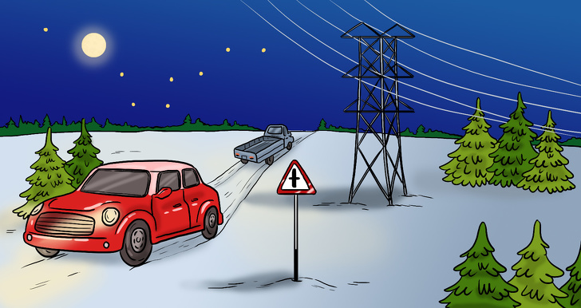

[Ответ][./Семь вещей, в которых ошибся художник]

##  Пять вопросов

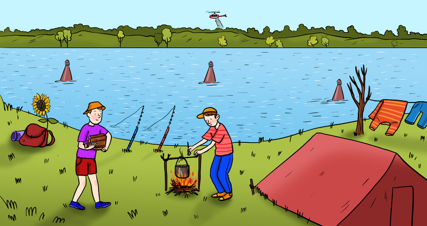

1. В какую сторону течет река?
2. Ходят ли по ней суда?
3. Как долго будет расти подсолнух?
4. Как быстро высохнет белье?
5. В какой город летит вертолет?

[Ответ][./Пять вопросов]

## Восемь вопросов о железной дороге

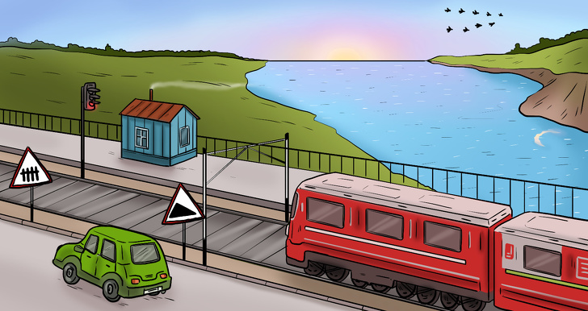

1. Много ли времени осталось до новолуния?
2. Скоро ли наступит ночь?
3. К какому времени года относится рисунок?
4. В какую сторону течет река?
5. С какой скоростью движется поезд?
6. Долго ли будет двигаться машина вдоль железной дороги?
7. К чему сейчас должен подготовиться водитель машины?
8. Дует ли ветер?

[Ответ][./Восемь вопросов о железной дороге]

## Загадка про двух друзей и новое жилье

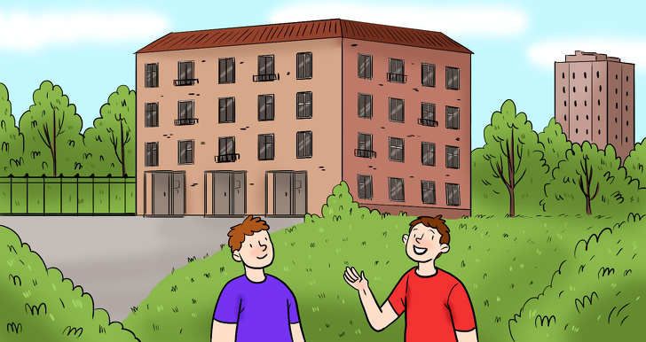

Два друга — Петя и Ваня — встретились около дома, в котором недавно оба купили квартиры. Петя живет на втором этаже дома, изображенного на рисунке; комната его друга находится в два раза выше от земли. На каком этаже живет Ваня?

[Ответ][./Загадка про двух друзей и новое жилье]

## На рисунке изображен лес средней климатической полосы в конце марта. В чем ошибся художник?

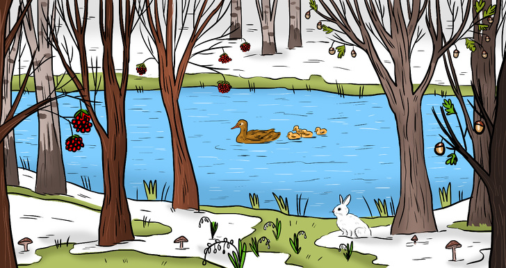

[Ответ][./Загадка про лес]
