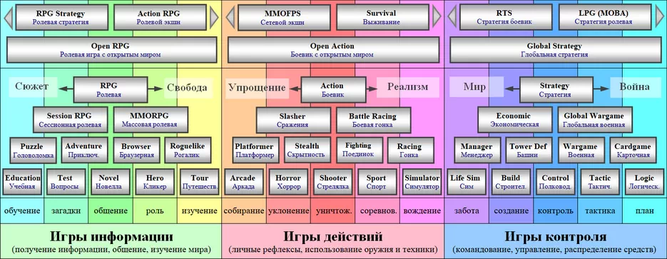

# Жанры компьютерных игр (общая схема)

За основной критерий деления жанров берём действия, наиболее часто совершаемые в играх данного жанра, и ничего больше (положение камеры: вид из глаз, вид сзади, вид сверху, вид из кабины; движение времени: реальное время или пошаговый режим; количество игроков - не являются критериями для жанров, они лишь определяют способ подачи геймплея).

Игры делится на три большие группы: ролевые, стрелялки, стратегии. Все игры внутри группы очень похожи между собой, но одновременно с этим имеются игры с различными отклонениями. Эталоны групп игр находятся на золотой середине, а жанры с всё большими отклонениями – всё дальше от центра.

Выделены 15 основных геймплейных элементов из которых состоит вообще любая игра (предпоследняя строчка снизу: обучение, загадки, общение, роль, изучение, собирание, уклонение, уничтожение, соревнование, техника, забота, развитие, контроль, тактика, план).

Подробное описание внутренней логики схемы жанров можно изучить в статье «[Классификация жанров компьютерных игр](http://gamesisart.ru/janr.html "читать статью Классификация жанров компьютерных игр")».

## Игры информации

Как понятно из названия, главное в играх этой группы – получение информации во всех её проявлениях. В таких играх порой присутствует и планирование, и динамика, но информация в них намного важней.

Золотой серединой группы является [«RPG (RolePlayng Game)» – «ролевая игра»](http://gamesisart.ru/TableJanr.html#RPG).

Игры, в которых «можно жить», вживаться в роль героя, в которых в качестве главных достоинств выставляют атмосферу, сюжет, игровой мир.

На одной границе группы - прямой, как рельса, сюжет (где имеется единственный правильный путь, и невозможно отойти хотя бы на шаг от этого пути), на другой границе противоположность – абсолютная свобода (огромный открытый мир, свобода действий и полное отсутствие сюжета). Все жанры группы лежат между этими двумя крайностями.

|                            |                                                                                                                                                                                                                                                                                                                                                              |                                                                                                                                                                                                                                           |
| -------------------------- | ------------------------------------------------------------------------------------------------------------------------------------------------------------------------------------------------------------------------------------------------------------------------------------------------------------------------------------------------------------ | ----------------------------------------------------------------------------------------------------------------------------------------------------------------------------------------------------------------------------------------- |
| Education (обучающая игра) |                                                                                                                                                                                                                                                                                                                                                              |                                                                                                                                                                                                                                           |
| Названия:                  | «Детская игра», «Игра для дошкольников»                                                                                                                                                                                                                                                                                                                      | Жанровый состав:     |
| Состав:                    | это элементарный жанр «[обучение](http://gamesisart.ru/TableJanr.html#Education)»                                                                                                                                                                                                                                                                            |                                                                                                                                                                                                                                           |
| О жанре:                   | Многие, начиная перечисление названий известных им жанров, забывают именно об этом жанре. Помнят о нём только две категории людей: сами создатели такого рода игр и родители маленьких детей.      Cам жанр предназначен для узкой возрастной аудитории, но, как составная часть, он используется во множестве игр. Называется такая часть — tutorial. |                                                                                                                                                                                                                                           |
| Описание:                  | Главное действие — получение новой информации, а точнее — обучение. Самые простейшие из них — изучение цифр, алфавита, названий вещей.                                                                                                                                                                                                                       |                                                                                                                                                                                                                                           |
| Признак:                   | **учебный материал, отсутствие свободы действий**                                                                                                                                                                                                                                                                                                            |                                                                                                                                                                                                                                           |
| Игры:                      | детские                                                                                                                                                                                                                                                                                                                                                      | [**Лучшие игры жанра**](http://gamesisart.ru/pc_rpg.html#Education "Перейти к списку лучших игр этого жанра")                                                                                                                             |

|   |   |   |
|---|---|---|
|Test (вопросы, загадки)|   |   |
|Названия:|«Intellectual game» («интеллектуальная игра»)|Жанровый состав:    |
|Состав:|это элементарный жанр «[загадки](http://gamesisart.ru/TableJanr.html#Test)»|
|О жанре:|По сравнению с играми обучения здесь больше свободы: есть несколько вариантов ответа на каждый вопрос. Сюда относятся почти все интеллектуальные телевизионные викторины, и их компьютерные аналоги.|
|Описание:|Главное действие — проверка знаний (ранее полученной информации). Задается вопрос, игрок должен выбрать единственно верный ответ из предложенных вариантов, либо, при отсутствии готовых вариантов, создать свой ответ.|
|Признак:|**несколько вариантов ответа**|
|Игры:|«Кто хочет стать миллионером?»|[**Лучшие игры жанра**](http://gamesisart.ru/pc_rpg.html#Test "Перейти к списку лучших игр этого жанра")|

|   |   |   |
|---|---|---|
|Contact (общение)|   |   |
|Названия:|«Игра общения», «визуальная новелла», «симулятор свидания»|Жанровый состав:    |
|Состав:|это элементарный жанр «[общение](http://gamesisart.ru/TableJanr.html#Contact)»|
|О жанре:|По сравнению с играми «[загадками](http://gamesisart.ru/TableJanr.html#Test)» здесь больше свободы: правильных ответов всегда больше одного, также при очередном вопросе или ответе игрока, результат от этого действии может зависеть от всех предыдущих действий. Множество вопросов и ответов связываются между собой логически в одно целое – в разговор.   Основная группа игр, где на главном месте общение — симуляторы свиданий.   Сюда же можно отнести так называемые «программы имитации искусственного интеллекта» (это когда вы можете вводить текст, представляющий собой вопрос или утверждение, а программа будет логично отвечать на всё это) хотя игрой это назвать сложно.   Игры этого жанра примитивны. Есть ещё очень большой потенциал их развития. Возможное дальнейшее развитие таких игр будет способствовать созданию важной части искусственного интеллекта – логической речи.|
|Описание:|Главное действие — общение (разговор). С игроком общается виртуальный собеседник, способный как задавать вопросы игроку, так и отвечать на множество вопросов игрока.|
|Признак:|**собеседник и ничего больше**|
|Игры:|«Приключения Ларри», «Рандеву с незнакомкой»|[**Лучшие игры жанра**](http://gamesisart.ru/pc_rpg.html#Contact "Перейти к списку лучших игр этого жанра")|

|   |   |   |
|---|---|---|
|Hero (геройская игра)|   |   |
|Названия:|«Тайм менеджер», «Текстовой симулятор жизни»|Жанровый состав:    |
|Состав:|это элементарный жанр «[герой](http://gamesisart.ru/TableJanr.html#Hero)»|
|О жанре:|Геройская система (набор характеристик, навыки, инвентарь) как одна из составляющих игры - используется в большинстве современных игр. Эта жанровая примесь используется и в играх боевиках, и в стратегиях, и, конечно же, на ней держатся почти все ролевые игры.   В чистом виде часто встречается в самых простейших играх - приложениях социальных сетей.|
|Описание:|Главное действие — развитие чего и кого угодно по уровням и характеристикам. В таких играх существует и небольшая доля общения, но, в основном, оно сводится лишь к обмену результатами с другими игроками.|
|Признак:|**геройская статистика (уровни, характеристики, вещи)**|
|Игры:|«Click Heroes», «Симулятор компьютерщика», игровые приложения в социальных сетях|[**Лучшие игры жанра**](http://gamesisart.ru/pc_rpg.html#Hero "Перейти к списку лучших игр этого жанра")|

|   |   |   |
|---|---|---|
|Toure (путешествие)|   |   |
|Названия:|«Виртуальный гид», «Бродилка»|Жанровый состав:    |
|Состав:|это элементарный жанр «[изучение мира](http://gamesisart.ru/TableJanr.html#Toure)»|
|О жанре:|По сравнению с «[геройскими](http://gamesisart.ru/TableJanr.html#Hero)» играми ещё большая свобода. Игрок всё так же может общатся с любым существом, но плюс к этому, теперь он сам может решать, какое существо какую роль будет играть в его жизни. Игрок сам выбирает, кто для него враг, кто друг, с кем можно поговорить, а кого можно вообще не замечать. Перед ним свободный, открытый для изучения мир.   Свобода одного существа заканчивается там, где начинается свобода другого. И как самая крайняя точка свободы - полное одиночество. В большинстве игр это состояние временное. Ролевые связи отсутствуют в начале игры, они создаются в процессе.   Но существуют и игры, очень близкие к крайней точке, где игрок практически один, и он свободен в своих действиях, это так называемые «виртуальные путешествия».|
|Описание:|Главное действие — изучение окружающего мира. Игрок ходит где хочет, общается с кем хочет, и занимается тем чем хочет. Нет ничего обязательного к выполнению.|
|Признак:|**открытый мир, свобода выбора**|
|Игры:|«The Path», «Dear Ester»|[**Лучшие игры жанра**](http://gamesisart.ru/pc_rpg.html#Toure "Перейти к списку лучших игр этого жанра")|

|   |   |   |
|---|---|---|
|Puzzle (головоломка)|   |   |
|Названия:||Жанровый состав:      |
|Состав:|«[обучение](http://gamesisart.ru/TableJanr.html#Education)» + «[загадка](http://gamesisart.ru/TableJanr.html#Test)»|
|О жанре:|Жанр на стыке «[обучения](http://gamesisart.ru/TableJanr.html#Education)» и «[загадки](http://gamesisart.ru/TableJanr.html#Test)». В итоге получается единый процесс: [обучение](http://gamesisart.ru/TableJanr.html#Education) и, сразу же, применение полученных знаний втечение одной игры.|
|Описание:|Главное действие — изучение неких правил, закономерностей; затем поиск довольно простых комбинаций действий, которые по данным закономерностям приведут к желаемому результату.|
|Признак:|**непонятные устройства, механизмы или способности**|
|Игры:|«[World of Goo](http://gamesisart.ru/indie.html#IGF2008)», «[Braid](http://gamesisart.ru/indie.html#Braid)», «Crazy Machines»|[**Лучшие игры жанра**](http://gamesisart.ru/pc_rpg.html#Puzzle "Перейти к списку лучших игр этого жанра")|

|   |   |   |
|---|---|---|
|Quest (Квест)|   |   |
|Названия:|«Classic Quest» («Классический квест»)|Жанровый состав:      |
|Состав:|«[загадка](http://gamesisart.ru/TableJanr.html#Test)» + «[общение](http://gamesisart.ru/TableJanr.html#Contact)»|
|О жанре:|Это та же самая [головоломка](http://gamesisart.ru/TableJanr.html#Puzzle): нужно решить какую-то загадку (задачу, проблему), но методы её решения неизвестны игроку. Для того чтобы загадка была решена, нужно самому собирать разрозненную информацию, а уже для этого необходимо [общаться](http://gamesisart.ru/TableJanr.html#Contact) с различными собеседниками (которые, возможно, в свою очередь будут задавать всё новые загадки).   Как правило, квест достаточно линеен, решение либо единственно, либо их очень мало.|
|Описание:|Главное действие — решение проблем (задач, загадок) других людей, для решения своей собственной основной проблемы. Половина игры - общение с персонажами, половина - решение загадок. Чаще всего загадки решаются применением нужной вещи в нужном месте. Для переноса вещей существует небольшой инвентарь.|
|Признак:|**разговоры, применение вещей**|
|Игры:|«Syberia», «Last Express», «[Machinarium](http://gamesisart.ru/indie.html#Braid)»|[**Лучшие игры жанра**](http://gamesisart.ru/pc_rpg.html#Quest "Перейти к списку лучших игр этого жанра")|

|   |   |   |
|---|---|---|
|Browser RPG (браузерные ролевые)|   |   |
|Названия:|браузерные игры|Жанровый состав:      |
|Состав:|«[общение](http://gamesisart.ru/TableJanr.html#Contact)» + «[роль](http://gamesisart.ru/TableJanr.html#Hero)»|
|О жанре:|Браузерные игры существуют за счет [общения](http://gamesisart.ru/TableJanr.html#Contact) множества реальных игроков. Все они соревнуются в рамках единой [ролевой системы](http://gamesisart.ru/TableJanr.html#Hero).|
|Описание:|Главное действие — общение в широком смысле слова (разговор, сражение, союз, торговля). В таких играх общаться можно с несколькими категориями людей (живых существ). К какой категории относятся существа, зависит от их роли в вашей жизни. Это могут быть: враги, союзники, торговцы. С каждой категорией существ свой метод общения.|
|Признак:|**взаимодействие с реальными игроками для развития своего героя**|
|Игры:|«Ботва», «Понаехали тут», игровые приложения в социальных сетях|[**Лучшие игры жанра**](http://gamesisart.ru/pc_rpg.html#BrowserRPG "Перейти к списку лучших игр этого жанра")|

|   |   |   |
|---|---|---|
|Adventure (приключения)|   |   |
|Названия:|«бродилка»|Жанровый состав:      |
|Состав:|«[роль](http://gamesisart.ru/TableJanr.html#Hero)» + «[изучение мира](http://gamesisart.ru/TableJanr.html#Toure)»|
|О жанре:|В составе есть «[изучение мира](http://gamesisart.ru/TableJanr.html#Toure)», значит это «путешествие». Также в составе есть «[роль](http://gamesisart.ru/TableJanr.html#Hero)», а значит есть сюжет. В итоге получается, что это «путешествие» с «сюжетом». Что можно назвать одним словом - «[приключение](http://gamesisart.ru/TableJanr.html#Adventure)».   Герой «вооружен» всем арсеналом ролевой системы, сюжет достаточно прост, но интересен.      Очень давно, до появления трехмерности в играх, это место занимали так называемые «бродилки», давно умерший жанр. Но сейчас сюда входят те игры, в которых сюжет и атмосферность преобладают над геймплеем.|
|Описание:|Игра представляет из себя одну большую карту, либо несколько кусков, обычно разных по геймплею, но связанных между собой. Особых ограничений в перемещении по карте нет. В игровом мире живет очень много интересных персонажей, почти со всеми можно поговорить. Все геройские атрибуты имеются (развитие, навыки, носимые с собой вещи).|
|Признак:|**просторный мир, множество интересных персонажей, сражения минимальны**|
|Игры:|«Beyond Good & Evil», «Dreamfall: The Longest Journey», «Scrapland»|[**Лучшие игры жанра**](http://gamesisart.ru/pc_rpg.html#Adventure "Перейти к списку лучших игр этого жанра")|

|   |   |   |
|---|---|---|
|MUD (Текстовая онлайновая игра)|   |   |
|Названия:|«Interactive fiction»|Жанровый состав:        |
|Состав:|«[обучение](http://gamesisart.ru/TableJanr.html#Education)» + «[загадки](http://gamesisart.ru/TableJanr.html#Test)» + «[общение](http://gamesisart.ru/TableJanr.html#Contact)»|
|О жанре:|Жанр-антиквариат - [MUD](http://gamesisart.ru/TableJanr.html#MUD). Упрощенно можно представить такие игры как [квесты](http://gamesisart.ru/TableJanr.html#Quest), но без графической картинки мира. Взаимодействие с виртуальным миром происходит с помощью «[общения](http://gamesisart.ru/TableJanr.html#Contact)» текстом. Слова, которые можно использовать для решения поставленных сюжетных [загадок](http://gamesisart.ru/TableJanr.html#Test), неизвестны. Их нужно придумывать, внимательно [изучая](http://gamesisart.ru/TableJanr.html#Education) предоставленный текст.|
|Описание:|В текстовом окошке появляется описание места, а вы можете текстовой же строкой задавать команды: двигаться в какую-то сторону, использовать вещь, применять заклинание... У игры есть [ролевая система](http://gamesisart.ru/TableJanr.html#Hero) (часто — классическая D&D, иногда — своя, оригинальная), которая и определяет развитие персонажа.   Самое любопытное — в том, что полный список ключевых слов игроку неизвестен. Более того, он зависит от места, где его герой находится. Внимательно читая описания, можно найти много нового, от невнимательного игрока — скрытого. В таких мирах воистину знание — сила.|
|Признак:|**решение квестов с помощью текстовых команд**|
|Игры:|«Adamant MUD», «Arctic MUD», «RMUD»|[**Лучшие игры жанра**](http://gamesisart.ru/pc_rpg.html#MUD "Перейти к списку лучших игр этого жанра")|

|   |   |   |
|---|---|---|
|MMORPG (онлайновая ролевая игра)|   |   |
|Названия:|«гриндилка»|Жанровый состав:        |
|Состав:|«[общение](http://gamesisart.ru/TableJanr.html#Contact)» + «[роль](http://gamesisart.ru/TableJanr.html#Hero)» + «[изучение мира](http://gamesisart.ru/TableJanr.html#Toure)»|
|О жанре:|Жанр-антиквариат - [MUD](http://gamesisart.ru/TableJanr.html#MUD). Упрощенно можно представить такие игры как [квесты](http://gamesisart.ru/TableJanr.html#Quest), но без графической картинки мира. Взаимодействие с виртуальным миром происходит с помощью «[общения](http://gamesisart.ru/TableJanr.html#Contact)» текстом. Слова, которые можно использовать для решения поставленных сюжетных [загадок](http://gamesisart.ru/TableJanr.html#Test), неизвестны. Их нужно придумывать, внимательно [изучая](http://gamesisart.ru/TableJanr.html#Education) предоставленный текст.[Общение](http://gamesisart.ru/TableJanr.html#Contact) в широком смысле слова. В отличие от «[квеста](http://gamesisart.ru/TableJanr.html#Quest)», общаться здесь нужно не для решения проблем, а для развития своего [социального статуса](http://gamesisart.ru/TableJanr.html#Hero) (который в большинстве случаев отображается лишь цифрами напротив строчки «уровень героя» и увеличением количества спецприемов).      Также в MMORPG часто очень огромный, открытый для [исследования](http://gamesisart.ru/TableJanr.html#Toure) мир, но он становится практически бессмысленным и ненужным без участия других игроков. По сути, игроки соревнуются между собой в огромном, но полупустом мире. В одном случае напрямую – «PvP» (Player versus Player), в другом случае косвенно, через свои заслуги – «PvE» (Player versus Enemy).|
|Описание:|Путешествие по виртуальному миру, общение с другими героями, развитие своего персонажа. Мирное общение с другими игроками происходит в городах виртуального мира, прокачка - за их пределами. Относительно скучный геймплей, преобладающий в обычных локациях, разбавляется инстансами (это более тщательно проработанные отдельные игровые локации), уникальными событиями в сюжетных квестах, массовыми развлечения типа: рейдов, штуромов и локальных войн.|
|Признак:|**множество реальных игроков в виртуальном мире с RPG системой**|
|Игры:|«World of Warcraft», «Lineage II», «Аллоды: Онлайн»|[**Лучшие игры жанра**](http://gamesisart.ru/pc_rpg.html#MMORPG "Перейти к списку лучших игр этого жанра")|

|   |   |   |
|---|---|---|
|RPG (ролевая игра)|   |   |
|Названия:|«РПГ», «Классическая компьютерная ролевая игра»|Жанровый состав:        |
|Состав:|«[загадки](http://gamesisart.ru/TableJanr.html#Test)» + «[общение](http://gamesisart.ru/TableJanr.html#Contact)» + «[роль](http://gamesisart.ru/TableJanr.html#Hero)»|
|О жанре:|Золотая середина раздела «игры информации».   Элементы «[загадки](http://gamesisart.ru/TableJanr.html#Test)», «[общение](http://gamesisart.ru/TableJanr.html#Contact)» складываются в «[квесты](http://gamesisart.ru/TableJanr.html#Quest)», на которых построен весь сюжет таких игр. В сюжете появляется довольно большая свобода благодоря элементу «[роль](http://gamesisart.ru/TableJanr.html#Hero)».Роль в свою очередь — общение в широком смысле слова. В итоге получается: ролевое общение во имя решения глобальных проблем.|
|Описание:|Главное действие — общение в широком смысле слова (разговор, сражение, союз, торговля). В таких играх общаться можно с несколькими категориями людей (живых существ). К какой категории относятся существа, зависит от их роли в вашей жизни. Это могут быть: враги, союзники, торговцы, работодатели, просто прохожие. С каждой категорией существ свой метод общения. Всё это общение – инструмент для решения четко поставленных задач в виде «квестов».|
|Признак:|**множество реальных игроков в виртуальном мире с RPG системой**|
|Игры:|«Star Wars: Knights of the Old Republic», «Neverwinter Nights», «Dragon Age: Origins»|[**Лучшие игры жанра**](http://gamesisart.ru/pc_rpg.html#RPG "Перейти к списку лучших игр этого жанра")|

|   |   |   |
|---|---|---|
|Open RPG (открытая ролевая игра)|   |   |
|Названия:|«True RPG», «Ролевая игра с открытым миром»|Жанровый состав:            |
|Состав:|«[обучение](http://gamesisart.ru/TableJanr.html#Education)» +«[загадки](http://gamesisart.ru/TableJanr.html#Test)» + «[общение](http://gamesisart.ru/TableJanr.html#Contact)» + «[роль](http://gamesisart.ru/TableJanr.html#Hero)» + «[изучение мира](http://gamesisart.ru/TableJanr.html#Toure)»|
|О жанре:|«[Ролевые игры](http://gamesisart.ru/TableJanr.html#RPG)» с добавлением [свободного для изучения мира](http://gamesisart.ru/TableJanr.html#Toure). По сравнению с обычными [RPG](http://gamesisart.ru/TableJanr.html#RPG) появилась очень большая свобода действий, а значит роль сюжета уменьшилась. Чаще всего сюжет представлен лишь одним длинным основным квестом, нужным для прохождения игры (в классическом понимании), и в принципе необязательным для выполнения.   Если рассматривать составляющие жанра, то «Open RPG» – это «[приключение](http://gamesisart.ru/TableJanr.html#Adventure)» («[роль](http://gamesisart.ru/TableJanr.html#Hero)»+«[изучение мира](http://gamesisart.ru/TableJanr.html#Toure)»), доверху напичканное независимыми друг от друга «[квестами](http://gamesisart.ru/TableJanr.html#Quest)» («[загадки](http://gamesisart.ru/TableJanr.html#Test)»+«[общение](http://gamesisart.ru/TableJanr.html#Contact)»).|
|Описание:|Главное действие — общение в широком смысле слова (разговор, сражение, союз, торговля). В таких играх общаться можно с несколькими категориями людей (живых существ). К какой категории относятся существа, зависит от их роли в вашей жизни. Это могут быть: враги, союзники, торговцы, работодатели, просто прохожие.   Игрок сам выбирает (своими действиями) кто и какую роль будет играть в его жизни, кто будет врагом, а кто союзником. Всё это ролевое общение – инструмент для решения четко поставленных задач в виде «квестов».|
|Признак:|**множество независимых «квестов», свобода выбора своих врагов и союзников**|
|Игры:|серия «The Elder Scrolls» («Morrowind», «Oblivion»), «Gothic», «Fable: The Lost Chapters»|[**Лучшие игры жанра**](http://gamesisart.ru/pc_rpg.html#pc_rpg.html#OpenRPG "Перейти к списку лучших игр этого жанра")|

|   |   |   |
|---|---|---|
|Action-RPG (боевая ролевая игра)|   |   |
|Названия:|«Hack’n’Slash RPG», «ролевой слешер»|Жанровый состав:            |
|Состав:|«[загадки](http://gamesisart.ru/TableJanr.html#Test)», «[общение](http://gamesisart.ru/TableJanr.html#Contact)», «[роль](http://gamesisart.ru/TableJanr.html#Hero)», «[уклонение](http://gamesisart.ru/TableJanr.html#Horror)», «[уничтожение](http://gamesisart.ru/TableJanr.html#Shooter)»|
|О жанре:|Жанр на стыке двух разделов «[игр информации](http://gamesisart.ru/TableJanr.html#Info_Games)» и «[игр действий](http://gamesisart.ru/TableJanr.html#Action_Games)». Смесь двух жанров: «[RPG](http://gamesisart.ru/TableJanr.html#RPG)» и «[Slasher](http://gamesisart.ru/TableJanr.html#Slasher)».   Это всё та же «[RPG](http://gamesisart.ru/TableJanr.html#RPG)», но в ней основной упор сделан на один элемент ролевого общения – сражение. В следствие чего остальные элементы (разговор, союз, торговля) атрофировались и ушли на второй план. Сделано это с помощю того, что из всех элементов игры наиболее интересен сделан геймплей сражения. Все действия также как в «[RPG](http://gamesisart.ru/TableJanr.html#RPG)» происходят для выполнения «[квестов](http://gamesisart.ru/TableJanr.html#Quest)». Но в «Action-RPG» цель это не главное, главным становится процесс.|
|Описание:|Главное действие — один из элементов ролевого общения - сражение. Все уровни такой игры представляют собой одно сплошное поле боя, на которых ничего кроме враждебных монстров нет, сражатся нужно постоянно. Существуют лишь небольшие островки безопасности – города или небольшие поселения, в которых и сосредоточены оставшиеся элементы ролевого общения – торговля, общение и союз.|
|Признак:|**ролевая игра, в которой сражения и прокачка доминируют над всем остальным**|
|Игры:|серии «Diablo», «Dungeon Siege», «Torchlight», «Sacred»|[**Лучшие игры жанра**](http://gamesisart.ru/pc_rpg.html#Action-RPG "Перейти к списку лучших игр этого жанра")|

## Игры действий

Главное в играх этой группы – движения, которые необходим совершать управляя каким либо телом (человеческим или гуманоидным), либо техническим средством.

Золотой серединой группы является «[Action](http://gamesisart.ru/TableJanr.html#Action)» (игра-боевик).

Наиболее динамичные игры. Именно эти игры принято хвалить за то, что они развивают скорость реакции.

На одной границе группы - аркадность (простота в освоении, нереальность происходящего), на другой границе противоположность – симуляторность (сложность в освоении, реалистичность). Все жанры группы лежат между этими двумя крайностями.

|   |   |   |
|---|---|---|
|Arcade (аркада)|   |   |
|Названия:|«Classic Arcade»|Жанровый состав:    |
|Состав:|это элементарный жанр «[собирание](http://gamesisart.ru/TableJanr.html#Platformer)»|
|О жанре:|Появление слова «аркада» связано с простейшими игровыми автоматами, игры которых пытались выделить в жанр. Слово «аркада» используется и как прилагательное к другим жанрам, например: аркадный платформер, аркадный шутер, аркадные гонки. Под словом "аркадный" обычно понимают - нереалистичный, более простой чем в реальности.   Чаще всего игру записывают в ряды аркад по такому принципу: если это игра действия, но не экшн (нельзя стрелять, сражаться) и не гонки (нельзя использовать технику), то это игра - аркада. Метод дедукции – это конечно хорошо, но пора бы уже дать и более точное определение жанра.   Классическая аркада - группа очень разнообразных игр действия, не попадающих под определения других жанров. Единственное, чем их можно объединить вместе - небольшие по размеру уровни, которые нужно полностью зачистить.   Это один из самых старых жанров. Эталонные игры этого жанра можно найти сейчас только на старых консолях. В настоящее время к этому жанру относятся только самые простые игры действия.|
|Описание:|Главная задача - собрать все особые объекты на уровне (иногда бывают более спецефичные задачи: закрасить весь уровень, найти выход, попасть в определенную точку, вовремя нажимать клавиши). Довольно часто такие игры бесконечны, а целью игры является набор наибольшего количества игровых очков. Чаще всего используется вид сверху, реже - вид сбоку. Безмятежный процесс сбора вещей нарушается присутствием на уровнях врагов или ловушек.|
|Признак:|**выполнение заданий на небольшом ограниченном уровне**|
|Игры:|«Pacman», «Lode Runner», «Bomberman»|[**Лучшие игры жанра**](http://gamesisart.ru/pc_action.html#Arcade "Перейти к списку лучших игр этого жанра")|

|   |   |   |
|---|---|---|
|Horror (хоррор)|   |   |
|Названия:|«Survival-horror», «выживание», «ужасы», «ужастик», «симулятор выживания»|Жанровый состав:    |
|Состав:|это элементарный жанр «[уклонение](http://gamesisart.ru/TableJanr.html#Horror)»|
|О жанре:|К этому жанру причисляют много обычных экшенов, в которых присутствуют пугающие моменты. Это не правильный подход в определении жанра. Хоррор – это игровая механика, а не атмосфера игрового мира.   Существуют особая категория «Экшн-хорроры» - игры, в которых есть возможность уничтожать врагов, но более эффективно будет всё же избегать боя. В чистых хоррорах атаковать врагов невозможно.|
|Описание:|Главное действие — уклонение от врагов, выживание. Герой игры не обладает боевыми навыками, поэтому ему приходится избегать встречи с врагами, прятаться от них, убегать.|
|Признак:|**герои игры не может атаковать, вокруг есть опасные враги**|
|Игры:|«Outlast», «Alien: Isolation», «Penumbra»   Экшн-хорроры: «Resident Evil», «Silent Hill»|[**Лучшие игры жанра**](http://gamesisart.ru/pc_action.html#Horror "Перейти к списку лучших игр этого жанра")|

|   |   |   |
|---|---|---|
|Shooter (Стрелялка)|   |   |
|Названия:|«Shoot'em up», «виртуальный тир», «шутер»|Жанровый состав:    |
|Состав:|это элементарный жанр «[уничтожение](http://gamesisart.ru/TableJanr.html#Shooter)»|
|О жанре:|Часто «шутерами» ошибочно называют вообще все «[боевики](http://gamesisart.ru/TableJanr.html#Action)», это не правильно. Большая часть «[боевиков](http://gamesisart.ru/TableJanr.html#Action)» намного сложней «шутеров».   Самый чистокровный представитель шутеров – «виртуальный тир» — предельно упрощенная игра, где вам просто надо попадать по каким-либо мишеням, обычно — движущимся. «Scroller» (игра с постоянным равномерным движением вперед, где очень часто главные герои – космические корабли) тоже относится к шутерам. Сюда же относятся самые простые боевики, где кроме стрельбы почти ничего нет.|
|Описание:|Главное действие — уничтожение всего, что движется. Количество боеприпасов почти всегда неограниченное, поэтому стрельбу можно вести постоянно. Камера может быть двух видов: вид сверху (тогда герой либо находится в центре экрана, а со всех сторон надвигаются враги («Alien Sooter»), либо он движется вперед с постоянной скоростью, тем самым в границы экрана попадают всё новые и новые враги ) или вид из глаз (при этом герой либо всегда стоит на месте («Moorhuhn»), либо автоматически передвигается на новую позицию, после уничтожения всех врагов на текущем месте («House of the Dead»).|
|Признак:|**непрекращающаяся стрельба, перемещение ограничено**|
|Игры:|«Call of Duty 4: Modern Warfare», «Medal of Honor: Allied Assault», «Moorhuhn», «House of the Dead»|[**Лучшие игры жанра**](http://gamesisart.ru/pc_action.html#Shooter "Перейти к списку лучших игр этого жанра")|

|   |   |   |
|---|---|---|
|Sport (Спорт)|   |   |
|Названия:|«Спортивный симулятор», «Спортсим»|Жанровый состав:    |
|Состав:|это элементарный жанр «[соревнование](http://gamesisart.ru/TableJanr.html#Sport)»|
|О жанре:|Управление человеческим телом, загнанным в определенные рамки правил, которые соблюдаются с максимальной тщательностью. Территория также ограничена, нельзя покинуть поле или стадион. В жанре есть небольшое условное деление на одиночные и командные игры. Игры где мы управляем всего одним человеком: симулятор гольфа, легкой атлетики, художественной гимнастики и прочих видов спорта Олимпийских игр. В играх, где мы управляем не одним человеком, а целой командой (выбирая по очереди игроков команды), управление усложняется добавлением навигации между членами команды. Это симуляторы таких игр как: футбол, хоккей, баскетбол.|
|Описание:|Главное действие — соревнование. Ставится задача противостоять соперникам. Именно соперникам, а не врагам или конкурентам, поэтому всё противостояние в рамках правил, и никаких запрещенных приемов («файтинги» не относятся к этому жанру). В каждом виде соревнований свои правила.|
|Признак:|**СПОРТ – Соперничество, Происходящее на Ограниченной Рамками Территории**|
|Игры:|«Beidjing 2008», «NBA’09», «FIFA’09»|[**Лучшие игры жанра**](http://gamesisart.ru/pc_action.html#Sport "Перейти к списку лучших игр этого жанра")|

|   |   |   |
|---|---|---|
|Simulator (Симулятор технических средств)|   |   |
|Названия:|«Vehicle Simulator game», «вождение»|Жанровый состав:    |
|Состав:|это элементарный жанр «[вождение](http://gamesisart.ru/TableJanr.html#Simulator)»|
|О жанре:|Симуляция – наиболее точное воспроизведение реальности. Очень часто понятие «симулятор» используют для очень многих разнообразных жанров. [Стратегию](http://gamesisart.ru/TableJanr.html#Strategy) называют «симулятором полководца», Black & White — «симулятором бога», а какой-нибудь [боевик](http://gamesisart.ru/TableJanr.html#Action) — «симулятором спецназовца или наемного убийцы». Этот подход неконструктивен, потому что на самом деле между всеми этими играми нет практически ничего общего. Пользуясь им, мы занесем в симуляторы почти все игры — а это значит, что слово будет вообще ничего не значить.   Из игр действий существует два не особенно похожих друг на друга симуляторных жанра — симулятор техники и [спортивный](http://gamesisart.ru/TableJanr.html#Sport), которых мало что роднит. «[Спортивные симуляторы](http://gamesisart.ru/TableJanr.html#Sport)» на самом деле можно называть просто «спорт», но так как этот виртуальный спорт очень далек от реального, и даже противоречит спортивному образу жизни, к нему добавляют слово «симулятор».   Единственным жанром где без слова «симулятор» не обойтись - это «симулятор технических средств», он и будет называться этим почетным словом.   На самом деле симулятор техники очень похож на [боевик](http://gamesisart.ru/TableJanr.html#Action), но здесь во главу угла ставится управление не собственным телом, а каким-либо техническим средством.   Сюда входят симуляторы: самолетов, танков и прочей военной техники, автомобилей, строительной техники, морских судов, космических кораблей. По большей части это всё механические средства передвижения.|
|Описание:|Главное действие — симулирование реальных ситуации. Большую часть экрана занимает внутренний вид кабины симулируемой техники. В игре воспроизводятся все тонкости и нюансы, возможные в аналогичной ситуации в жизни (чего в игре любого другого жанра не встретить). Для управления используется либо почти все кнопоки клавиатуры, либо отдельное контрольное устройство.|
|Признак:|**сложное управление, реалистичные правила**|
|Игры:|«Ил-2 Штурмовик», «Silent Hunter 3», «Microsoft Flight Simulator»|[**Лучшие игры жанра**](http://gamesisart.ru/pc_action.html#Simulator "Перейти к списку лучших игр этого жанра")|

|   |   |   |
|---|---|---|
|Racing (Гонки)|   |   |
|Названия:|«автосимулятор», «аркадный симулятор»|Жанровый состав:      |
|Состав:|«[соревнование](http://gamesisart.ru/TableJanr.html#Sport)» + «[техника](http://gamesisart.ru/TableJanr.html#Simulator)»|
|О жанре:|Наполовину «[симулятор](http://gamesisart.ru/TableJanr.html#Simulator)», наполовину «[соревнование](http://gamesisart.ru/TableJanr.html#Sport)» - в результате «гонки».   На самом деле, от «симулятора» остается 10-20%, не больше. Из-за этого жанр часто неверно называют «аркадным симулятором». В самом этом названии противоречие, смысл получается «нереальный имитатор реальности».   Как и в «симуляторах», мы управляем каким либо техническим средством, но при этом качество симуляции этой техники не так важно. Важна привнесенная соревновательная составляющая.   Сюда также относятся такие игры, которые на первый взгляд не относятся к гонкам. Например, «Tony Hawk’s Pro Skater»: наперегонки никто не ездит, но «симуляция» скейтборда присутствует, «соревновательная» часть, основанная на зарабатывании очков посредством совершения трюков, также есть, значит это гонки. Сюда с большой натяжкой можно отнести игры серии «Guitar Hero», а вот ещё одна музыкальная «Audiosurf» точно принадлежит этому жанру.|
|Описание:|Главное действие — соревнование на определенном виде техники. Чаще всего это гонки на автомобилях, но бывают гонки и на футуристической технике, и на других экзотических средствах передвижения. При этом большая часть соревнований сводится к тому, что победителем считается первый приехавший к финишу; реже бывает соревнование по количеству заработанных очков.|
|Признак:|**средства передвижения, соревнующиеся между собой либо по скорости, либо по очкам**|
|Игры:|«Colin McRae Dirt 2», «Need for Speed: Underground», «Test Drive Unlimited», «Ballistic», «Tony Hawk’s Pro Skater»|[**Лучшие игры жанра**](http://gamesisart.ru/pc_action.html#Racing "Перейти к списку лучших игр этого жанра")|

|   |   |   |
|---|---|---|
|Fighting (поединок)|   |   |
|Названия:|«единоборства», «DeathMatch»|Жанровый состав:      |
|Состав:|«[уничтожение](http://gamesisart.ru/TableJanr.html#Shooter)» + «[соревнование](http://gamesisart.ru/TableJanr.html#Sport)»|
|О жанре:|Соревнования по уничтожению соперников. Сюда входят как обычные спортивные соревнования: бокс, восточные единоборства, фехтование, реслинг; так и придуманные кровавые соревнования.   Сюда же относятся трехмерные игры в режиме «DeathMatch». Это отдельная категория «3D-Fighting».|
|Описание:|Главное действие — уничтожение соперников. Двое или более противников встречаются на ринге (или в любом другом ограниченном месте), сражаются между собой с помощью ударов, спецприемов, оружий. Каждый успешный удар уменьшает здоровье у врага, в итоге потерявший всё здоровье считается проигравшим, оставшийся в живых – победителем. Во многих играх присутствуют выкрикивания комментаторов, типа: «excellent», «fight» и прочие подбадривающие фразы. Часто на уровнях лежат дополнительные виды оружия.|
|Признак:|**соперники убивающие друг друга в ограниченном пространстве**|
|Игры:|«Mortal Kombat», «Street Fighter IV», «Tekken». «Counter-Strike», «Unreal Tournament», «Quake III»|[**Лучшие игры жанра**](http://gamesisart.ru/pc_action.html#Fighting "Перейти к списку лучших игр этого жанра")|

|   |   |   |
|---|---|---|
|Stealth-Action (Шпионский боевик)|   |   |
|Названия:|«Стелс»|Жанровый состав:      |
|Состав:|«[уклонение](http://gamesisart.ru/TableJanr.html#Horror)» + «[уничтожение](http://gamesisart.ru/TableJanr.html#Shooter)»|
|О жанре:|Игры, в которых крайне редко нужно (а то и вообще не требуется) уничтожать врагов. Во главу угла ставится незаметность и аккуратность перемещений, избегание контакта с противником.|
|Описание:|Главное действие — скрытное передвижение. Герой игры – большой специалист в своем деле (шпион, вор, убийца, снайпер). Задачи соответствующие – взлом неприступных банков, бесшумные убийства, подрывная деятельность на территории вражеских государств. У героя имеется множество различных шпионских приспособлений: устройство ночного видения, ловушки, взрывные устройства, бесшумное оружие. Обычно управляемый персонаж очень уязвим. Если взяться играть в такую игру как в обычный «Action», то продлится это недолго – пара точных выстрелов в героя, и он будет мертв.|
|Признак:|**враги не атакуют, пока не заметят нас**|
|Игры:|«Thief», «Hitman», «Tom Clancy's Splinter Cell»|[**Лучшие игры жанра**](http://gamesisart.ru/pc_action.html#Stealth "Перейти к списку лучших игр этого жанра")|

|   |   |   |
|---|---|---|
|Platformer (платформер)|   |   |
|Названия:||Жанровый состав:      |
|Состав:|«[собирание](http://gamesisart.ru/TableJanr.html#Arcade)» + «[уклонение](http://gamesisart.ru/TableJanr.html#Horror)»|
|О жанре:|В очень далекие времена, когда все «игры движения» были двухмерными, элементы платформера присутствовали повсеместно, границы жанра были расплывчаты. Сейчас же - его можно очень четко выделить.   Основную часть таких игр занимает «[уклонение](http://gamesisart.ru/TableJanr.html#Horror)» от ловушек, избегание пропастей, ям и прочих опасностей. А «[Собирание](http://gamesisart.ru/TableJanr.html#Arcade)» в платформерах отходит на второй план (по сравнению с аркадами).|
|Описание:|Главное действие — прыжки. Чаще всего это двумерные игры (вид сбоку), однако существуют и трехмерные игры, геймплей которых построен на одних сплошных прыжках.   Прыжки нужны для преодоления препятствий – пропастей, ловушек, врагов. Уровни построены из различных платформ (платформы – это прямоугольные островки, висящие в воздухе или поднятые над общим уровнем земли, на которых можно стоять).   Игровой процесс достаточно прост, поэтому он разбавляется системой бонусов: начисление очков, постепенно открываемые элементы игры.|
|Признак:|**вид сбоку, множество платформ, ям и ловушек**|
|Игры:|«[Super Meat Boy](http://gamesisart.ru/indie.html#Other)», «[N](http://gamesisart.ru/indie.html#IGF2005)», «Super Mario», «Sonic the Hedgehog». «Mirror’s Edge»|[**Лучшие игры жанра**](http://gamesisart.ru/pc_action.html#Platformer "Перейти к списку лучших игр этого жанра")|

|   |   |   |
|---|---|---|
|Slasher (сражение)|   |   |
|Названия:|«рубилово», «слешер»|Жанровый состав:        |
|Состав:|«[собирание](http://gamesisart.ru/TableJanr.html#Arcade)» + «[уклонение](http://gamesisart.ru/TableJanr.html#Horror)» + «[уничтожение](http://gamesisart.ru/TableJanr.html#Shooter)»|
|О жанре:|Весь смысл таких игр: преодоление препятствий в виде врагов, с помощью действий «[уклонения](http://gamesisart.ru/TableJanr.html#Horror)» и «[уничтожения](http://gamesisart.ru/TableJanr.html#Shooter)». Наиболее сложными и зрелищными «сражения» становятся когда главный герой вооружен холодным оружием (поэтому часто жанр ассоциируется с битвой на мечах), но в «слешерах» существуют и другие виды оружия: луки, арбалеты, боевая магия и даже огнестрельное оружие («Devil May Cry»).   Основное отличие от «[боевиков](http://gamesisart.ru/TableJanr.html#Action)» (где главное точность и быстрота) - сильные враги, которые заставляют игрока постоянно маневрировать, «[уклонятся](http://gamesisart.ru/TableJanr.html#Horror)». В играх жанра присутствуют боссы (наиболее сильные и сложные по поведению враги).|
|Описание:|Главное действие — уничтожение сильных врагов. Враги живут намного дольше, чем в среднестатистическом «[боевике](http://gamesisart.ru/TableJanr.html#Action)», убиваются только в ближнем бою и с большим трудом. Чтобы успешно играть в такие игры, нужно изучать поведение врагов, находить слабые места, вовремя наносить удары, блокировать вражеские атаки.|
|Признак:|**зрелищность, сильные враги, большие и сложные боссы**|
|Игры:|«Darksiders», «Devil May Cry», «Enclave», «Legacy of Kain»|[**Лучшие игры жанра**](http://gamesisart.ru/pc_action.html#Slasher "Перейти к списку лучших игр этого жанра")|

|   |   |   |
|---|---|---|
|Battle Racing (Гонки-сражения)|   |   |
|Названия:|«симулятор», «Technical Combat», «Death Racing»|Жанровый состав:        |
|Состав:|«[уничтожение](http://gamesisart.ru/TableJanr.html#Shooter)» + «[соревнование](http://gamesisart.ru/TableJanr.html#Sport)» + «[техника](http://gamesisart.ru/TableJanr.html#Simulator)»|
|О жанре:|Обычные «[гонки](http://gamesisart.ru/TableJanr.html#Racing)», но с применением оружия и «[уничтожением](http://gamesisart.ru/TableJanr.html#Shooter)» врагов. Реже бывает [«соревнование](http://gamesisart.ru/TableJanr.html#Sport)» по «[уничтожению](http://gamesisart.ru/TableJanr.html#Racing)» на «[технике](http://gamesisart.ru/TableJanr.html#Simulator)» (режимы игры «Unreal Tournament», «Battlefield»).|
|Описание:|Главное действие — соревнование на определенном виде техники с уничтожением противников. Может быть несколько вариантов: либо это «гонки» с редким использованием оружия, либо использование оружия очень существенно («Carmaggedon»), либо для победы требуется только уничтожение противников и ничего больше (режимы «CrashDay»).|
|Признак:|**средства передвижения, оборудованные средствами уничтожения**|
|Игры:|«World of Tanks», «Split/Second», «Blur», «Carmaggedon», «CrashDay», «Ace Combat»|[**Лучшие игры жанра**](http://gamesisart.ru/pc_action.html#Battle_Racing "Перейти к списку лучших игр этого жанра")|

|   |   |   |
|---|---|---|
|Action (боевик)|   |   |
|Названия:|«3D-Action», «стрелялка», «FPS», «TPS», «Beat 'em up», «Shooter» или «3D-Shooter»|Жанровый состав:        |
|Состав:|«[уклонение](http://gamesisart.ru/TableJanr.html#Horror)» + «[уничтожение](http://gamesisart.ru/TableJanr.html#Shooter)» + «[соревнование](http://gamesisart.ru/TableJanr.html#Sport)»|
|О жанре:|Сражения с помощью «[уклонения](http://gamesisart.ru/TableJanr.html#Horror)» и «[уничтожения](http://gamesisart.ru/TableJanr.html#Shooter)», враги при этом не так сложны как в «[Slasher](http://gamesisart.ru/TableJanr.html#Slasher)»е, они имеют равные возможности с игроком как в «[соревнованиях](http://gamesisart.ru/TableJanr.html#Sport)».   С некоторых пор перед словом action традиционно пишут «3D». Главное в играх действий это зрелищность, поэтому боевики обязаны быть на переднем краю прогресса, использовать самые новые спецэффекты и технологии. Поэтому все они и трехмерные, и очень красивые, но и устаревают быстро на фоне новинок жанра.|
|Описание:|Главное действие — уничтожение врагов, равных по силе. Так как врагов много, а у игрока персонаж всего один, в виде компенсации этот персонаж наделён различными спецприемами или нечеловеческими способностями («slo-mo», восстановление здоровья, управление временем). Если спецприемов нет, они заменяются большим арсеналом оружия, более сильным чем у врагов.|
|Признак:|**средства передвижения, оборудованные средствами уничтожения**|
|Игры:|«Half-Life», «BioShock», «Max Payne»|[**Лучшие игры жанра**](http://gamesisart.ru/pc_action.html#Action "Перейти к списку лучших игр этого жанра")|

|   |   |   |
|---|---|---|
|Open Action (открытый боевик)|   |   |
|Названия:|«GTA-подобная игра», «Боевик с открытым миром»|Жанровый состав:            |
|Состав:|«[собирание](http://gamesisart.ru/TableJanr.html#Arcade)» + «[уклонение](http://gamesisart.ru/TableJanr.html#Horror)» + «[уничтожение](http://gamesisart.ru/TableJanr.html#Shooter)» + «[соревнование](http://gamesisart.ru/TableJanr.html#Sport)» + «[техника](http://gamesisart.ru/TableJanr.html#Simulator)» + «[изучение мира](http://gamesisart.ru/TableJanr.html#Toure)»|
|О жанре:|Это так называемые «GTA-подобные игры». Официально для них ещё не придумали названия, но «Open Action» (по аналогии с «[Open RPG](http://gamesisart.ru/TableJanr.html#OpenRPG)») вполне подходит для названия.   «[Экшн](http://gamesisart.ru/TableJanr.html#Action)» с расширенными возможностями. К обычным составляющим добавляется «[изучение мира](http://gamesisart.ru/TableJanr.html#Toure)», а значит большая свобода в пространстве (и как следствие – появление «[вождения](http://gamesisart.ru/TableJanr.html#Simulator)»). Но при этом часто нет свободы в ролевом общении. Получается такая «Open RPG», в которой главное не сюжет, а действие.   Отличить «Open Action» от других боевиков очень просто: в них есть глобальная карта, и Вы спокойно можете попасть в любую точку этой карты, она не изменяется от миссии к миссии как во всех других боевиках (например, «FarCry» был близко к жанру «Open RPG», все элементы были, но не было одной большой постоянной карты, поэтому в итоге получился линейный боевик с очень большой свободой; а уже «FarCry 2» исправил этот недостаток и стал полноценным «Open Action»).|
|Описание:|Главное действие — «[уничтожение](http://gamesisart.ru/TableJanr.html#Shooter)» врагов на огромной открытой территории. Обычно в таких играх в качестве мира для изучения выступают города-мегаполисы, иногда маленькие города и прилегающая к ним территория, иногда совсем дикие земли. Чаще всего присутствует «[техника](http://gamesisart.ru/TableJanr.html#Simulator)» всех видов: автомобили, мотоциклы, вертолеты, самолеты, катеры, лошади. Но полное отсутствие техники ещё не говорит о том, что такая игра не относится к жанру (яркий пример - «S.T.A.L.K.E.R.»).|
|Признак:|**глобальная карта, в любое место можно вернутся в любой момент**|
|Игры:|«Grand Theif Auto», «Mafia», «Gun», «S.T.A.L.K.E.R.»|[**Лучшие игры жанра**](http://gamesisart.ru/pc_action.html#Open%20Action "Перейти к списку лучших игр этого жанра")|

## Игры контроля

Группа «игры контроля» состоит из тех игр, главная суть которых — планирование событий и управление для достижения преимущества в дальнейшем. Сюда попадают все виды стратегий, различные экономические игры, варгеймы, тактики.

Золотой серединой группы является «[Strategy](http://gamesisart.ru/TableJanr.html#Strategy)» (обычная локальная стратегия).

На одной границе группы – игра во имя результата и достижения цели, на другой границе противоположность – игра во имя самого процесса игры. Все жанры группы лежат между этими двумя крайностями.

|   |   |   |
|---|---|---|
|Logic (Логическая игра)|   |   |
|Названия:||Жанровый состав:    |
|Состав:|это элементарный жанр «[планирование](http://gamesisart.ru/TableJanr.html#Logic)»|
|О жанре:|Обычно «[логические игры](http://gamesisart.ru/TableJanr.html#Logic)», «[интеллектуальные игры](http://gamesisart.ru/TableJanr.html#Test)» и «[пазлы](http://gamesisart.ru/TableJanr.html#Pazzle)» причисляют к одному жанру, называя их «казуальными». Их объединяет лишь абстрактность происходящего на экране, больше сходств нет. «[Интеллектуальные](http://gamesisart.ru/TableJanr.html#Test)» решаются с помощью накопленных ранее знаний, «[пазлы](http://gamesisart.ru/TableJanr.html#Pazzle)» - с помощью полученных в процессе игры знаний. «[Логические](http://gamesisart.ru/TableJanr.html#Logic)» же – нужно решать с помощью планирования всех своих последующих действий.   Простейший пример логической игры – «пятнашки». Полученная информация здесь ничего не даст в отличие от «[пазлов](http://gamesisart.ru/TableJanr.html#Pazzle)». Правила здесь просты и понятны с самого начала: есть свободная клетка, её можно заполнить любым соседним элементом, в итоге соседняя клетка станет свободной. Всё просто, но за один ход ничего не получится, множество случайных ходов тоже не поможет. Необходимо планирование.   Этот жанр лежит на стыке с играми движения. Сюда входят всевозможные тетрисы, пасьянсы, «шарики» и прочие простые игры.|
|Описание:|Главное действие — планирование всех последующих действий. Логические игры очень абстрактны: в них используются различные кубики, шарики, карты – ничего реального. Правила игры – не секрет. Игрок может совершать простые, примитивные действия, которые сами по себе мало что изменяют, но определенная комбинация или последовательность этих действий может привести к достижению цели.   Иногда логические игры бывают бесконечными («Тетрис»). Это не значит, что в них нет конечной цели, в таких играх цель – выжить как можно дольше.|
|Признак:|**правила известны, для победы необходима сложная комбинация простых действий**|
|Игры:|«Пятнашки», «Тетрис», «Zuma», пасьянсы|[**Лучшие игры жанра**](http://gamesisart.ru/pc_strategy.html#Logic "Перейти к списку лучших игр этого жанра")|

|   |   |   |
|---|---|---|
|Tactic (Тактическая игра)|   |   |
|Названия:||Жанровый состав:    |
|Состав:|это элементарный жанр «[тактика](http://gamesisart.ru/TableJanr.html#Tactic)» - слаженное взаимодействие|
|О жанре:|Сюда относятся те игры, где один игрок управляет несколькими персонажами так, что на каждого уходит одинаковое количество времени (а не так, что один из них ведущий, все остальные – ведомые). Для этого необходим либо пошаговый режим, либо неспешный геймплей в реальном времени.   Тактические игры очень близки к ролевым играм. Миссия тактической игры — это классическая ролевка без сюжетных излишеств, но с упором на боевую механику. К жанру «тактики» относится один из жанров ролевых игр - «jRPG» (в них объектом управления всегда является группа героев).|
|Описание:|Главное действие — слаженное взаимодействие персонажей. В тактике каждый боец — индивидуальность, он развивается, разнообразно экипируется, пользуется множеством приемов, имеет ролевую систему, заставляющую игрока отдавать ему только те приказы, которые будут соответствовать выбранному классу. Каждый по отдельности выполняет свою роль, в итоге получается слаженное взаимодействие.|
|Признак:|**несколько героев, среди них нет главного**|
|Игры:|«Commandos 2: Men of Courage», «Silent Storm», Jagged Alliance 2»|[**Лучшие игры жанра**](http://gamesisart.ru/pc_strategy.html#Tactic "Перейти к списку лучших игр этого жанра")|

|   |   |   |
|---|---|---|
|MicroControl (микроконтроль)|   |   |
|Названия:|«симулятор полководца»|Жанровый состав:    |
|Состав:|это элементарный жанр «[микроконтроль](http://gamesisart.ru/TableJanr.html#MicroControl)» - минимизация потерь|
|О жанре:|Это эмитация полководческой деятельности. Казалось бы, это тоже самое, что и «[тактика](http://gamesisart.ru/TableJanr.html#Tactic)» - слаженное взаимодействие. Но в отличие от «[тактики](http://gamesisart.ru/TableJanr.html#Tactic)» здесь в подчинении намного больше существ (обычно существа объединяются в отряды), и битвы часто происходят в реальном времени. Невозможно успеть командовать одновременно всеми, поэтому идеальное слаженное взаимодействие - недостижимая цель.   Всё сводится к тому, что приходится очень быстро решать: «Что на данный момент важнее?», «Кого лучше уничтожить у врага?», «Чем своим можно пожертвовать ради этого?».   В «[тактике](http://gamesisart.ru/TableJanr.html#Tactic)» всё можно закончить без жертв со своей стороны. В «микроконтроле» же - редко когда битва обходится без жертв.|
|Описание:|Главное действие — управление отрядами в реальном времени. Обычно эти игры воспроизводят реально происходившие массовые сражения. Игрок выступает в роли полководца одной из воюющих сторон.|
|Признак:|**большое войско в подчинении, не пошаговый режим, и как следствие – неминуемые потери**|
|Игры:|сражения из серии игр «Total War»|[**Лучшие игры жанра**](http://gamesisart.ru/pc_strategy.html#Control "Перейти к списку лучших игр этого жанра")|

|   |   |   |
|---|---|---|
|Building (cтроительство)|   |   |
|Названия:|«cтроительство», «песочница», «градостроительный симулятор», «симулятор мэра», «City-building»|Жанровый состав:    |
|Состав:|это элементарный жанр «[развитие](http://gamesisart.ru/TableJanr.html#City)»|
|О жанре:|Что нужно для «развития»? Нужны начальные ресурсы, которые будут вложены в постройку зданий. Всё что предстоит делать игроку в играх этого жанра – тратить деньги на постройку зданий.|
|Описание:|Главное действие — распределение доступных ресурсов для развития. В подчинении игрока находятся ресурсы (деньги, стройматериалы, строители, свободная для застройки земля), их нужно с умом использовать для развития (обычно, постройка города). Ресурсы могут быть у игрока с самого начала, или ему приходится их зарабатывать во время игры (пополнение ресурсов либо слабо зависит от действий игрока, либо оно происходит автоматически с течением времени, либо ресурсы вообще бесконечны). Никаких сложностей не возникает, конечные цели практически отсутствуют, затягивает сам процесс.|
|Признак:|**доступные ресурсы, развитие и постройка зданий**|
|Игры:|«SimCity 4», «Caesar IV», «Cities XL 2011», «Minecraft»|[**Лучшие игры жанра**](http://gamesisart.ru/pc_strategy.html#Build "Перейти к списку лучших игр этого жанра")|

|   |   |   |
|---|---|---|
|Life Sim (сим)|   |   |
|Названия:|«симулятор жизни», «Artipicial Life game», «Social simulation game»|Жанровый состав:    |
|Состав:|это элементарный жанр «[забота](http://gamesisart.ru/TableJanr.html#Sim)»|
|О жанре:|Такие игры называют «симуляторами жизни». Самый известный представитель – «The Sims». Лучше всего таким играм подходит название «симулятор родительской заботы». Сюда же относятся игры-тамагочи, симуляторы домашних животных.|
|Описание:|Главное в таких играх сам процесс. Наблюдаем за подопечными персонажами, они живут сами по себе, без нашего участия. У них есть текущие цели, есть долгосрочные цели, есть параметры, которые должны быть постоянно в норме (сытость, радость, энергия, комфорт).   Игрок может лишь создавать для персонажей текущие цели. Больше ничем управлять нельзя. Остальные движения персонажи делают по своему усмотрению, иногда не сразу выполняет поставленную игроком цель.|
|Признак:|**удовлетворение потребностей персонажа**|
|Игры:|«The Sims 2», «Singles», тамагочи|[**Лучшие игры жанра**](http://gamesisart.ru/pc_strategy.html#Life_Sim "Перейти к списку лучших игр этого жанра")|

|   |   |   |
|---|---|---|
|Economical (экономическая стратегия)|   |   |
|Названия:|«Manager», «Менеджер», «Tycoon»|Жанровый состав:      |
|Состав:|«[развитие](http://gamesisart.ru/TableJanr.html#City)» + «[забота](http://gamesisart.ru/TableJanr.html#Sim)»|
|О жанре:|Выглядят такие игры как обычные «стратегии», но боевых подразделений либо очень мало, либо они совсем отсутствуют. Экономика основана на добыче ресурсов, преобразовании их в товары, и наконец, их продаже или использовании для своих нужд. В хороших экономических стратегиях нужно не только продавать, но и покупать товары у других, сказывается дефицит определенных товаров; лишних денег не бывает, приходиться с умом выбирать каждую постройку и покупку.   Есть отдельный поджанр: Tycoon. Это те же самые стратегии «развития», но вместо объекта управления не большой самодостаточный город, а отдельное заведение, ориентированное на посетителей. Управляемые заведения могут быть самыми различными: парк развлечений, ресторан, гостиница, зоопарк, курорт, обычный магазин. Сюда же относятся спортивные менеджеры.|
|Описание:|У игрока есть некое подобие города с различными видами зданий или небольшое заведение. Город постепенно развивается, появляются новые задания, построенные на деньги и другие ресурсы. Чтобы получить деньги, нужно что-то производить в уже построенных здания и продавать это кому-нибудь. Отличительная черта игр этого жанра – огромное количество видов ресурсов, товаров, валют, мест сбыта.|
|Признак:|**множество видов товаров и ресурсов**|
|Игры:|«Anno 1404», «Tropico 3», «Stronghold: Crusader», «Theme Park», «Tycoon», «Zoo Empire»|[**Лучшие игры жанра**](http://gamesisart.ru/pc_strategy.html#Economic "Перейти к списку лучших игр этого жанра")|

|   |   |   |
|---|---|---|
|Tower Defence (защитные башни)|   |   |
|Названия:|«TD», «башни», «защита базы», «оборона»|Жанровый состав:      |
|Состав:|«[микроконтроль](http://gamesisart.ru/TableJanr.html#Control)» + «[развитие](http://gamesisart.ru/TableJanr.html#City)»|
|О жанре:|Строительство, которое требует от игрока быстроты реакции.|
|Описание:|В игре под нашим распоряжением небольшая база, которую нужно защитить от наступления превосходящих сил противника. Мы можем быстро возводить защитные сооружения, а они будут автоматически уничтожать врагов. Со временем нужно улучшать и строить всё больше сооружений.|
|Признак:|**возможность строительства, множество атакующих врагов**|
|Игры:|«Kingdom Rush», «Prime World — Defenders», «Space run», «Defense Grid», «Orcs Must Die»|[**Лучшие игры жанра**](http://gamesisart.ru/pc_strategy.html#TD "Перейти к списку лучших игр этого жанра")|

|   |   |   |
|---|---|---|
|Wargame (военная игра)|   |   |
|Названия:|«варгейм»|Жанровый состав:      |
|Состав:|«[тактика](http://gamesisart.ru/TableJanr.html#Tactic)» + «[микроконтроль](http://gamesisart.ru/TableJanr.html#Control)»|
|О жанре:|Это «[микроконтроль](http://gamesisart.ru/TableJanr.html#Control)», но с намного большим использованием «[тактики](http://gamesisart.ru/TableJanr.html#Tactic)». Как и в «[тактике](http://gamesisart.ru/TableJanr.html#Tactic)» - есть слаженное взаимодействие, как и в «[микроконтроле](http://gamesisart.ru/TableJanr.html#Control)» – есть множество подчиненных, частью из которых непременно придется пожертвовать.   Состав армии и количество различных видов подразделений определяется в начале сражения и уже больше не изменяется во время игры, что заставляет побеждать именно «[тактикой](http://gamesisart.ru/TableJanr.html#Tactic)», а не количеством войск как в обычной «[стратегии](http://gamesisart.ru/TableJanr.html#Strategy)».|
|Описание:|С самого начала и до конца миссии под управлением игрока находится несколько боевых подразделений. Впереди неизведанная территория с возможными засадами и ловушками. Цель каждой миссии - выполнить все поставленные задачи, полученные во время брифинга. Действия могут происходить пошагово или в режиме реального времени, но в любом случае всегда можно остановиться и обдумывать свои дальнейшие действия.|
|Признак:|**в подчинении небольшое войско, в котором нужно беречь каждый юнит**|
|Игры:|«Blitzkrieg», «Close Combat», «World War II: Frontline Command»|[**Лучшие игры жанра**](http://gamesisart.ru/pc_strategy.html#Wargame "Перейти к списку лучших игр этого жанра")|

|   |   |   |
|---|---|---|
|Cardgame (карточная ролевая игра)|   |   |
|Названия:|«настольная ролевая игра», «карточная коллекционная игра»|Жанровый состав:      |
|Состав:|«[планирование](http://gamesisart.ru/TableJanr.html#Logic)» + «[тактика](http://gamesisart.ru/TableJanr.html#Tactic)»|
|О жанре:|Это обычная «[тактика](http://gamesisart.ru/TableJanr.html#Tactic)», но силы противника неизвестны, поэтому необходимо «[планирование](http://gamesisart.ru/TableJanr.html#Logic)».   Необходимо предугадывать развитие событий (ходы противника) и делать так, чтобы это развитие было в вашу пользу. После каждого хода противника ситуация немного изменяется и появляется необходимость корректировки своего «[плана](http://gamesisart.ru/TableJanr.html#Logic)».   Больше всего под такое описание подходят карточные ролевые игры.|
|Описание:|Между собой сражаются двое или несколько игроков. У каждого игрока свой набор карт, каждая из них олицетворяет отдельное подразделение армии. Игроки ничего не знают о составе вражеских армий, поэтому «[план](http://gamesisart.ru/TableJanr.html#Logic)» меняется прямо по ходу боя. Игроки на каждом ходу кладут карту изображая тем самым атаку, противник защищается. Так продолжается пока у противников не кончатся отряды, пока в живых не останется всего один игрок.|
|Признак:|**сила и состав армии врага неизвестен, корректировка плана после каждого хода**|
|Игры:|«Dangeons & Dragons», «Magic: The Gathering», «Heartstone»|[**Лучшие игры жанра**](http://gamesisart.ru/pc_strategy.html#Cardgame "Перейти к списку лучших игр этого жанра")|

|   |   |   |
|---|---|---|
|Global Wargame (глобальная военная игра)|   |   |
|Названия:|«глобальный варгейм», «симулятор главнокомандующего»|Жанровый состав:        |
|Состав:|«[планирование](http://gamesisart.ru/TableJanr.html#Logic)» + «[тактика](http://gamesisart.ru/TableJanr.html#Tactic)» + «[микроконтроль](http://gamesisart.ru/TableJanr.html#Control)»|
|О жанре:|Это «[варгейм](http://gamesisart.ru/TableJanr.html#Wargame)», но более обширный, глобальный и более схематичный.|
|Описание:|Поле боя делится на элементарные части - квадраты или гексы (шестиугольники). В каждом квадрате или гексе может одновременно находиться строго один отряд. Перемещения происходят так же четко – с одного элемента на другой. У каждого подчиненного отряда есть своя дальность передвижения и дальность боя, иногда есть спецприемы. На этих различиях отрядов друг от друга и строится «тактика» боя.   Простейший пример: шашки или шахматы.|
|Признак:|**пошаговый режим, сетка на поле боя, невозможность производить или строить**|
|Игры:|«Battles in Normandy», «Risk II», «Panzer General II»; сражения «King’s Bounty», сражения «Heroes»|[**Лучшие игры жанра**](http://gamesisart.ru/pc_strategy.html#Global_Wargame "Перейти к списку лучших игр этого жанра")|

|   |   |   |
|---|---|---|
|Sim Strategy (стратегия непрямого контроля)|   |   |
|Названия:|«Indirect control strategy», «Симулятор Бога», «Симулятор короля»|Жанровый состав:        |
|Состав:|«[микроконтроль](http://gamesisart.ru/TableJanr.html#Control)» + «[развитие](http://gamesisart.ru/TableJanr.html#City)» + «[забота](http://gamesisart.ru/TableJanr.html#Sim)»|
|О жанре:|Это «[менеджер](http://gamesisart.ru/TableJanr.html#Manager)», состоящий из элементов «[развития](http://gamesisart.ru/TableJanr.html#City)» и «[заботы](http://gamesisart.ru/TableJanr.html#Sim)», но такой, что игрок должен управлять не только экономикой, но и военными действиями, управляя отрядами тем же способом что и клиентами.   Игры жанра очень близки к симуляторности, всё более реально чем в обычной «стратегии». Здесь можно управлять, раздавая приказы воинам, но вручную контролировать их на поле боя нельзя.|
|Описание:|Главное действие — «[микроконтроль](http://gamesisart.ru/TableJanr.html#Control)» с помощью денег. Игрок выступает в роли правителя, он распределяет материальные средства между своими воинами и постройками новых зданий. Воинами управлять нельзя, а враги имеются. Необходимо стимулировать действия подчиненных воинов с помощью денежных выплат или другими способами.|
|Признак:|**в подчинении есть воины, они не контролируются, а управляются системой наград и поощрений**|
|Игры:|«Black & White», «Black & White 2», «Majesty 2: The Fantasy Kingdom Sim»|[**Лучшие игры жанра**](http://gamesisart.ru/pc_strategy.html#Sim%20Strategy "Перейти к списку лучших игр этого жанра")|

|   |   |   |
|---|---|---|
|Strategy (локальная стратегия)|   |   |
|Названия:|«TBS» («пошаговая стратегия»)|Жанровый состав:        |
|Состав:|«[тактика](http://gamesisart.ru/TableJanr.html#Tactic)» + «[микроконтроль](http://gamesisart.ru/TableJanr.html#Control)» + «[развитие](http://gamesisart.ru/TableJanr.html#City)»|
|О жанре:|Это, по сути, «[варгейм](http://gamesisart.ru/TableJanr.html#Wargame)» («[тактика](http://gamesisart.ru/TableJanr.html#Tactic)», «[микроконтроль](http://gamesisart.ru/TableJanr.html#Control)»), но с добавлением элемента «[развития](http://gamesisart.ru/TableJanr.html#City)».   «Развитие» позволяет нанимать или производить новые боевые единицы. Производство снимает часть ответственности с [тактики](http://gamesisart.ru/TableJanr.html#Tactic): если есть большое преимущество в количестве боевых единиц, то в бою на [тактику](http://gamesisart.ru/TableJanr.html#Tactic) можно и не обращать внимания.|
|Описание:|Геймплей делится на две составляющие: построение базы (необходимой для создания армии) и участие в сражениях. Если базы статичные (стоят с самого начала игры, не уничтожаются, и нельзя построить новые), то все действия в таких играх сводятся к захвату баз (ключевых точек). Если же базы уничтожаются, то все действия сводятся к накоплению наибольшей по силе армии и уничтожении армии и базы противника.|
|Признак:|**есть базы для создания армии и есть противник**|
|Игры:|«Heroes of Might and Magic III», «Disciples II: Dark Prophecy», «Etherlords»|[**Лучшие игры жанра**](http://gamesisart.ru/pc_strategy.html#Strategy "Перейти к списку лучших игр этого жанра")|

|   |   |   |
|---|---|---|
|Global Strategy (глобальная стратегия)|   |   |
|Названия:|«God sim» (симулятор бога), симулятор правителя|Жанровый состав:            |
|Состав:|«[планирование](http://gamesisart.ru/TableJanr.html#Logic)» + «[тактика](http://gamesisart.ru/TableJanr.html#Tactic)» + «[микроконтроль](http://gamesisart.ru/TableJanr.html#Control)» + «[развитие](http://gamesisart.ru/TableJanr.html#City)» + «[забота](http://gamesisart.ru/TableJanr.html#Sim)»|
|О жанре:|Это «[Локальная стратегия](http://gamesisart.ru/TableJanr.html#Strategy)», но с добавлением элемента «[планирования](http://gamesisart.ru/TableJanr.html#Logic)» и «[заботы](http://gamesisart.ru/TableJanr.html#Sim)». В итоге — планомерное развитие, которое временами проверяется на поле боя. Вся партия — результат точного расчета.|
|Описание:|Игры такого рода состоят из многих частей, составляющих вместе деятельность правительства отдельного государства: распространение по карте, постройка баз, постройка боевых единиц на базах, дипломатия, технический прогресс, забота о гражданах своей страны.   Глобальные стратегии могут быть либо пошаговыми, либо в реальном времени, но с очень неспешным геймплеем.|
|Признак:|**игрок управляет целой страной: промышленностью, экономикой, армией, наукой, дипломатией, разведкой**|
|Игры:|«Civilization IV», «Galactic Civilizations II», «Spore»|[**Лучшие игры жанра**](http://gamesisart.ru/pc_strategy.html#Global_Strategy "Перейти к списку лучших игр этого жанра")|

|   |   |   |
|---|---|---|
|RTS (стратегия-боевик)|   |   |
|Названия:|«стратегия в реальном времени», «mass action»|Жанровый состав:            |
|Состав:|«[тактика](http://gamesisart.ru/TableJanr.html#Tactic)» + «[микроконтроль](http://gamesisart.ru/TableJanr.html#Control)» + «[развитие](http://gamesisart.ru/TableJanr.html#City)» + «[уничтожение](http://gamesisart.ru/TableJanr.html#Shooter)» + «[соревнование](http://gamesisart.ru/TableJanr.html#Sport)»|
|О жанре:|Это «[Локальная стратегия](http://gamesisart.ru/TableJanr.html#Strategy)», но происходящая в реальном времени. Реакция и точность (атрибуты «[игр действий](http://gamesisart.ru/TableJanr.html#Action_Games)») также важны, как и «[тактика](http://gamesisart.ru/TableJanr.html#Tactic)» с «[развитием](http://gamesisart.ru/TableJanr.html#City)» (атрибуты «[игр контроля](http://gamesisart.ru/TableJanr.html#Control_Games)»). Элементы «уничтожение» и «соревнование» складываются в «Fighting (поединок)». Именно «поединок» больше всего напоминают стратегии этого вида.|
|Описание:|Геймплей делится на две составляющие: построение базы (необходимой для создания армии) и участие в сражениях. Во время построения своей армии задается «[тактика](http://gamesisart.ru/TableJanr.html#Tactic)» и «[развитие](http://gamesisart.ru/TableJanr.html#City)», во время самого сражения важен «[микроконтроль](http://gamesisart.ru/TableJanr.html#Control)».|
|Признак:|**строительство базы и сражения в реальном времени**|
|Игры:|«[Warcraft III](http://gamesisart.ru/pc.html#WarCraft)», «Starcraft II: Wings of Liberty», «Warhammer 40 000: Dawn of War»|[**Лучшие игры жанра**](http://gamesisart.ru/pc_strategy.html#RTS "Перейти к списку лучших игр этого жанра")|

|   |   |   |
|---|---|---|
|LPG (MOBA) (cтратегия ролевая)|   |   |
|Названия:|"ДотА-подобная", "Стратегия ролевая", "RPG in RTS", "MOBA", "Lane-Pushing Game"|Жанровый состав:                   |
|Состав:|[тактика](https://gamesisart.ru/TableJanr.html#Tactic) + [микроконтроль](https://gamesisart.ru/TableJanr.html#Control) + [создание](https://gamesisart.ru/TableJanr.html#Build) + [общение](https://gamesisart.ru/TableJanr.html#Novel) + [роль](https://gamesisart.ru/TableJanr.html#Hero)|
|О жанре:|Жанр на стыке "игр контроля" и "игр информации". Стратегия первична: вокруг происходит война, есть своя и вражеская база, постоянные потоки обычных солдат, вид сверху. Но мы играем не за стратега, а за обычного подчинённого, которого можно "[прокачивать](https://gamesisart.ru/TableJanr.html#Hero)". Действовать нужно в команде с союзниками, поэтому активно используется "[общение](https://gamesisart.ru/TableJanr.html#Novel)".   Жанр сформировался в 2003 году, с выходом отдельной карты "Defense of the Ancients" для игры "Warcraft III". Обычные пользователи переделали правила RTS+RPG в новую формулу геймплея. Официального названия жанра пока нет, но многие уже используют вариант MOBA (Multiplayer Online Battle Arena), это крайне размытая формулировка, под которую могут попасть вообще все сетевые игры. Более точное название — Lane-Pushing Game (LPG). Игры, где главная задача — группой героев продвинуть линю своих войск вперёд.|
|Описание:|Игра происходит партиями. Перед началом выбирается герой из списка возможных. Две команды игроков соревнуются между собой на поле боя, а постройки и потоки солдат находятся под управлением компьютера. Каждый игрок управляет только одним героем, для победы важны общие согласованные действия всех союзников. Финальная цель — уничтожить базу противников.|
|Признак:|**стратегия, где под управлением всего один герой**|
|Примеры:|"Defense of the Ancients" (DotA), "Heroes of the Storm" (HotS), "League of Legends" (LoL)|[**Лучшие игры жанра**](https://gamesisart.ru/pc_strategy.html#MOBA "Перейти к списку лучших игр этого жанра")|