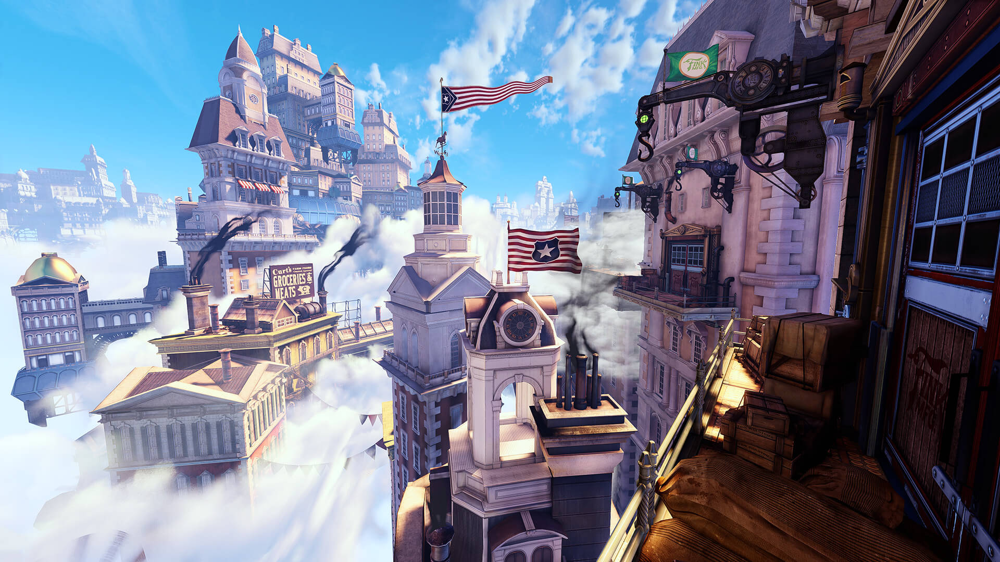

# BioShock & BioShock Infinite - Восторг и Колумбия

Эти два города, созданные художниками из Irrational Games, являются лучшим примером того, что игра может быть настоящим произведением искусства. Уникальная архитектура по образцу прошлых веков, плакаты, старая мебель, освещение, затопленные коридоры Rapture, высотные здания Колумбии…

Многим нравится что вымышленные миры наполнены различными маленькими деталями, которые делают прохождение более увлекательным. И Колумбия, и Восторг дали достаточно эмоций. Irrational Games – в плане реализации локации, вам просто нет равных.
