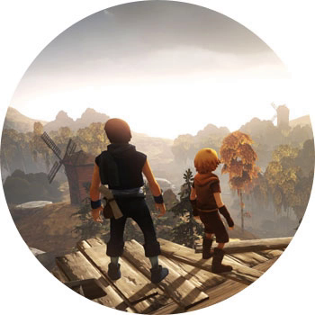

BROTHERS: A TALE OF TWO SONS

ПЛАТФОРМЫ: PC, PS3, XBOX 360, PS4, XBOX ONE

Сказочная кооперативная паззл-адвенчура с не самым замысловатым сюжетом, но очень мощной моральной подоплекой. Есть два брата, чья мама давным-давно умерла, а тут вдруг и отцу сильно заплохело. Спасти его может разве что сок огромного дерева, которое растет за горами, лесами, полями и вообще очень далеко. Сильная и драматичная история, которую создатели умудрились рассказать без применения слов (по крайней мере, понятных человеку) вообще.

Кооператива как такового здесь нет: вы будете играть за обоих братьев одновременно (готовьте джойстики, без них будет тяжко). Поначалу мозг откажется понимать, как это вообще возможно, но со временем втянется и даже начнет получать удовольствие от такого процесса. Геймплей оригинальный и интуитивно понятный: всего две кнопки для взаимодействия с окружающим миром, и два стика — для управления братьями.

Здесь нет ничего, помимо основной сюжетной линии, да и проходится она достаточно быстро — часа за 4. Все сцены и задания очень самобытны и атмосферны, нет повторяющихся механик, зато есть великолепные красочные пейзажи. Сама история местами жестокая, кровавая, но, главное, очень волшебная и эмоционально мощная.
