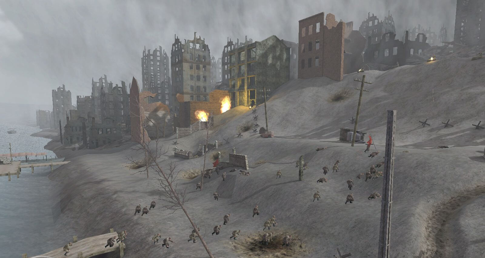

# Call of Duty - Сталинград

По образцу отличного фильма «Враг у Ворот», Сталинград навсегда изменил видение сражений в компьютерных играх. В 2003 году, когда вышла игра, сам факт советского солдата в роли главного героя, который вместо оружия получает только пару патронов, стал революцией. Переправа через Волгу, пикирующие немецкие истребители, солдаты в страхе бросаются в ледяную реку, офицер зачитывающий письмо матери одного из призывников в «Красную армию» во время стрельбы по дезертирам… Это было потрясающе!

Движок из Quake III, выполнил свою задачу на отлично. Сталинград в Call of Duty был переполнен страхом, кровью и войной. Руины зданий, покрытое дымовыми завесами небо – просто отличная игра для поклонников шутеров Второй мировой войны.
