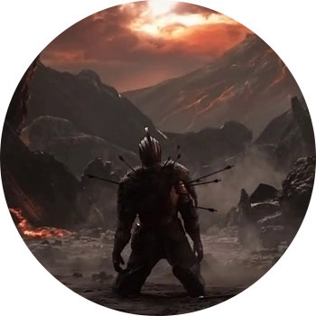

DARK SOULS

ПЛАТФОРМЫ: PC, PS3, XBOX 360

Здесь все такое же мрачное, как в страшилках про "черную-черную улицу в черном-черном городе". Человеков скосила болезнь, превращающая всех в нежить, и главный герой отправляется в длиннющий трип, чтобы восстановить баланс белого и остановить надвигающуюся Эпоху Тьмы. И вот вы идете по миру, выполняя квесты и сражаясь с вражьими созданиями.

Здесь не будет весело или просто — только сложность 180 левела и страх, только хардкор. Помните "Черепашек-ниндзя" на Денди, в которых, умирая, вы оказывались в самом начале? Тут примерно так же, но лайтовее. Каждое существо ростом выше полуметра убивает вас в два плевка, а каждая смерть откидывает сильно назад, отбирая накопленный опыт. Но хотя бы не в начало.

Dark Souls воспитывает характер и творит магию с нервной системой, а на фоне явного тренда к упрощению игр, восхитительна и особо ценна. Обязательна тем, кто реально любит преодолевать сложности.
