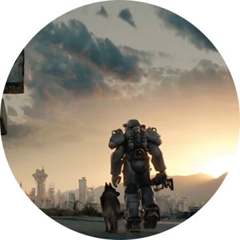

FALLOUT 4

ПЛАТФОРМЫ: PC, PS4, XBOX ONE

Ядерный бум породил постапокалипсис. Выжили только те, кто успел добраться до бункера. Все либо полуразрушено, либо полумутировало. Через 200 лет герой вылезает из бункера и идет гулять по разрушенному миру в поисках своего сына — барашка Шона.

Общепризнанно один из самых ожидаемых проектов 2015 года скорее удался, чем нет. Локации проработаны, враги очень ужасают, квесты интересные (хотя, справедливости ради, попадается и дикая скукота типа "а принеси-ка мне вот ту штуку, которая спокойно лежит через дорогу"), общий сюжет набирает обороты, и в итоге оказывается, что герой ввязан в какую-то дичайшую историю. У фанатов оригинальной дилогии вызовет боль и жжение ниже спины, для всех остальных — очень даже играбельно.
