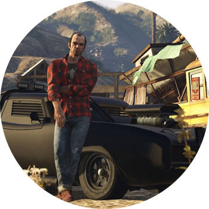

GRAND THEFT AUTO V

ПЛАТФОРМЫ: PC, PS3, PS4, XBOX 360, XBOX ONE

Нет смысла рекламировать GTA. О прелестях этого мира знает каждый покемон еще со времен Vice City. Но пятая часть (она же 15 игра из серии) — это нечто. Да господи, Rockstar угрохал 266! миллионов! долларов! в разработку игры! Здесь сразу 3 главных героя с проработанными характерами, чьи истории переплетены. Итоговая цель — обокрасть Федеральное Хранилище США, вынеся в сумках и карманах более 200 миллионов долларов. Oh, my!

В GTA V есть максимальная свобода: открытый динамичный мир, возможность переключаться между героями в любой момент и аж 3 концовки основной сюжетной линии. Воровать, ходить в стриптиз-клубы, угонять тачки, любить, смотреть телик, заниматься йогой, играть в тамагочи, делать селфи, перевозить контрабанду! Тут можно вообще все.

И брэйкинг ньюс для тех, кто проспал в норе последние годы: в GTA V наконец появился мультиплеер. Теперь все то же самое можно делать по сети со своей бандой, и иметь друзей совсем не обязательно. Но будьте готовы к смерти в стиле "Игры престолов" — очень и очень внезапной.
