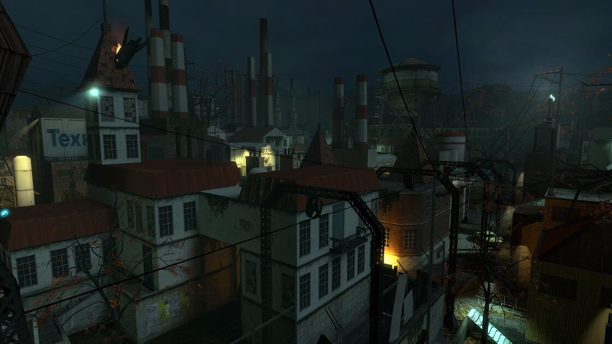

# Half-Life 2 - Город Рейвенхолм

Как только мы вошли в этот город, атмосфера игры изменилась до неузнаваемости. Равенхольм был переполнен зомби, и единственным выжившим был отец Григорий. И это единственное место в игре, которое мы проходили под покровом ночи.

Небольшое количество боеприпасов и использование дисковых пил, с помощью которых мы избавлялись от зомби, было чем-то действительно неожиданным. Чувство растущего беспокойства и страха, душераздирающие крики зомби превратили все в настоящий первоклассный ужастик, в котором нам предстояло выжить. Неудивительно, что после этого Valve взялся за Left4Dead.
