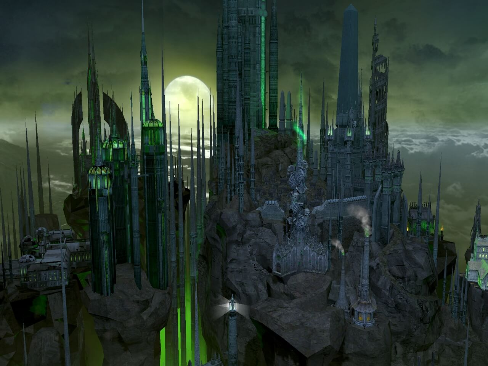

# Heroes of Might and Magic V – Некрополис

Одной из главных причин, по которой многие никогда не играли в шестую часть, было отсутствие хорошо сделанных замков, и сразу вспоминаются проведенные времена в пятой части. Может поэтому крепости из “пятерки” произвели такое впечатление? Ведь архитектура была похожа на Минас Тирит из Властелина колец. То, что наиболее сильно создало запоминающийся эффект – это отличный саундтрек после въезда в город,
