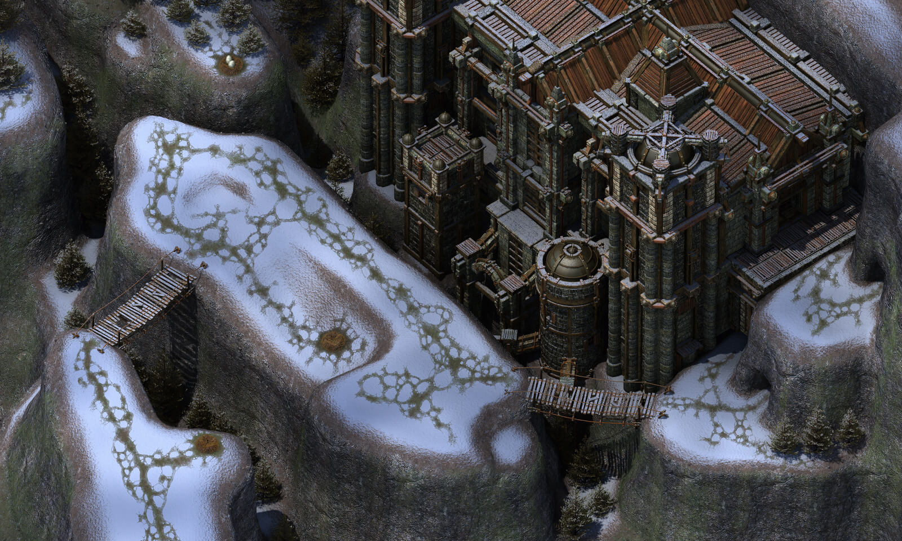

# Icewind Dale II – Таргос

Таргос! Каким же был этот город! Портовая деревня, усыпанная снегом, является лучшим примером того, что 2D-графика все еще может быть невероятно красивой, создавая при этом еще и прекрасную атмосферу. Таргос, в котором происходит вторжение враждебных рас, в добавок с погодой и трудными условиями жизни, является ярким примером сочетания всех компонентов игры.

Что же поразило больше всего в этом месте? Детали и музыка. Город богат на детали, и путешествие по тропинкам, протоптанными простыми жителями, само по себе доставляет удовольствие.
