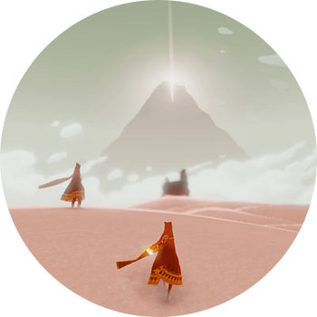

JOURNEY

ПЛАТФОРМЫ: PS3, PS4

Вы — таинственный некто, ваша цель — добраться до оооочень далекой горы. Синопсис сюжета описывается этим более, чем полностью, но вы даже не представляете, какой волшебный и необычный игровой опыт за этим скрывается. Это оченьмедитативная и красивая игра — музыкой, графикой, пейзажами, — в которой вам нужно будет идти через очень живописные локации.

Тут все действительно необычно и непривычно. Нет карты, нет подсказок, нет мультиплеера как такового, но! Во время путешествия вы можете встретиться с другим игроком и вместе с ним двинуть к той самой горе. Вы не знаете о вашем спутнике ровным счетом ничего — кроме того, что это живой человек. У вас нет способов общения, кроме подобия криков, и только в конце, пройдя "Путешествие", вы видите имя вашего спутника в титрах. Оооочень необычный и крутой игровой опыт.
