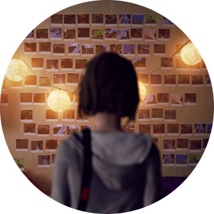

LIFE IS STRANGE

ПЛАТФОРМЫ: PC, PS3, PS4, XBOX 360, XBOX ONE

Хипстерский приключенческий кино-квест, очень крутая интерактивная повседневность, в которой вы проживаете жизнь девочки-студента Макс. В критический момент нежное создание открывает в себе способность отматывать время назад и исправлять ошибки. Поначалу скилл используется в основном для житейских-студенческих мелочей, но по ходу действия выясняется, что городу Макс грозит апокалипсис, и хорошо бы его предотвратить.

Игра выходила как сериал, по эпизодам, и если первые части похожи на девочковый сериал с подростковой драмой, то где-то с середины страдашки уходят на второй план, а главной становится адовейшая загадка исчезновения девушки в стиле "Твин Пикса". Каждое решение и действие имеет свои плоды и рано или поздно обязательно аукнется. В комплекте — крутой саундтрек, проработанный детективный сюжет, реалистичность с приятной долей мистики. Разочаровывает, правда, тот факт, что финальный выбор одинаков для всех и не зависит от ваших ранее принятых решений.
