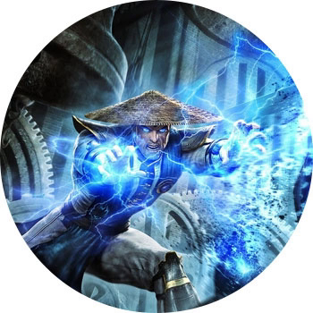

MORTAL KOMBAT X

ПЛАТФОРМЫ: PC, PS4, XBOX ONE, ANDROID, IOS

Убитые джойстики Денди и детство не отпустят никогда, но время идет. В последние годы "Мортал" набирает обороты и эволюционирует, и в "десятке" это ощущается особенно мощно: кости здесь хрустят как никогда звучно. Например, у Сони и Джонни Кейджа появились дети, которые унаследовали любовь родителей к кровище и тоже вырывают внутренности всем, кому ни попадя. Например, в 10-й части можно уничтожить, кгхм, мужское достоинство отца руками его же дочери.

Новые герои типа Хищника, а еще те, кто вернулся из отпуска (например, Таня из 4 части). В общем, идеальные к-к-комбо пары для файтов. Да и разнообразия прибавилось: теперь у каждого героя можно выбрать приоритеты в бое. Из спорных моментов — появилась возможность... купить Фаталити. Система архаичного нажатия клавиш все еще работает, но теперь от этого можно уйти, просто заплатив.
