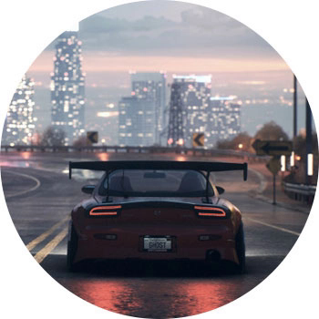

NEED FOR SPEED (2015)

ПЛАТФОРМЫ: PC, PS3, PS4, XBOX 360, XBOX ONE

Нет никакого смысла рассказывать про легендарные гонки Need for Speed — свое имя они заработали еще в далеких двухтысячных. Это не просто игра, это самая настоящая эпоха. В перезапуске 2015 года есть все то, что мутировавшая серия умудрилась растерять за последние части: и продвинутый тюнинг авто, и дивный новый открытый мир, и гонки от полиции.

Поначалу кажется, что перезапуск серии — идея не создателей, а пиарщиков, которым хотелось больше золота от уже изжившего себя продукта. Но на деле оказывается, что игра 15-го года вобрала в себя все лучшее из предыдущих частей, и на выходе получилась сама суть Жажды Скорости. Обязательно для всех, кто хоть раз чувствовал прилив адреналина за клавиатурой, джойстиком или настоящим рулем.
