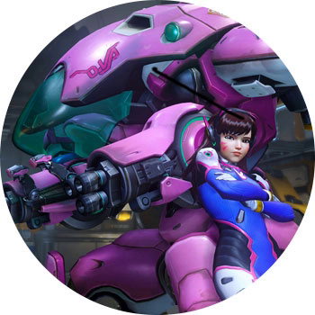

OVERWATCH

ПЛАТФОРМЫ: PC, PS4, XBOX ONE

Командный онлайн-шутер от Blizzard с фэнтезийной рисовкой. В будущем машины все-таки восстали, как и обещал Терминатор. Но побороть восставших роботов смогла организация Overwatch. Все утихомирилось, ребята из организации перестали быть нужными человечеству, из-за чего были вынуждены разойтись по домам. Но через несколько лет преступность набрала обороты, и членам Overwatch пришлось заново объединиться в команду и взять в руки оружие, дабы спасти мирных жителей.

Мультиплеерный идеал, возведенный в абсолют. По опыту Team Fortress 2, в которую играют даже спустя почти 10 лет с момента выхода, в принципе очевидно: командные шутеры живут вне времени, как и Цой, стоит им только покорить свою аудиторию. Blizzard свою игру не навязывал — шум вокруг нее поднялся и не утихал с первых дней выхода беты. А после релиза сервера, которые были рассчитаны на что-то нечеловеческое, упали. Поток желающих поиграть оказался больше этого самого "нечеловеческого".

Overwatch — это очень разные персонажи, каждый со своей историей и скиллами, куча арен и режимов (по 3 карты в каждом). Персы не нуждаются в прокачке или кастомизации, все решают только ваши личные умения — ничего лишнего. Геймплей интуитивный и понятный, а за счет рисовки понравится даже вашей девушке: будет залипать в монитор, пока вы творите дестрой.
