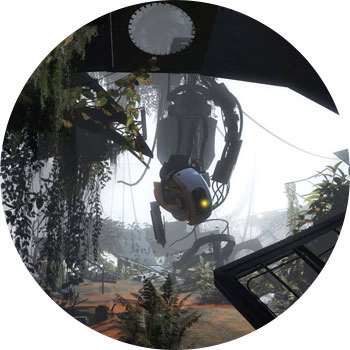

PORTAL 2

ПЛАТФОРМЫ: PC, PS3, XBOX 360

Качественная головоломка-эксперимент с достаточно сложными паззлами — для логически мыслящих мазахистов, которые любят проверять свою соображалку и не мыслят жизни без трудностей. Сюжет простой: главная героиня, Челл, приходит в себя в одной из камер высоконаучной лаборатории Aperture и предпринимает попытку бежать. В ее распоряжении — портальная пушка, с помощью которой можно перемещать себя и другие предметов.

Поначалу будет не особо сложно, но это только поначалу: дальше даже примитивные вещи станут запутанными, а пустая комната превратится в квест. На редкость хорошая локализация и очень много качественного юмора. Обязано понравиться тем, кто любит мозгоштурмы и хочет получать от игр максимум профита.
