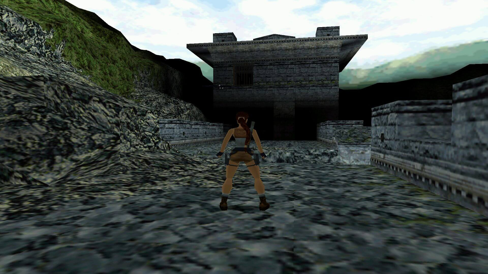

# Tomb Raider 2 - Китайская стена

Tomb Raider 2 – лучшая версия серии игр про сексуального археолога. Начальная локация – Китайская стена, на которой находятся более сложные загадки и места для акробатики. Сама стена, возможно, не очень красивая, с точки зрения графической части, но вот сама атмосфера! Тигры в оврагах, пауки падающие с потолка!

И, конечно же, самое лучшее… Именно в конце этого места мы могли обнаружить один из самых больших по размерам секретов этой игры. Речь идет про хорошо сохранившегося тиранозавра Рекс, который в подземных глубинах ждал на обед самую сексуальную кучу пикселей в истории компьютерных игр.
