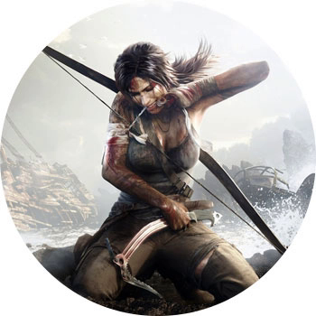

TOMB RAIDER (2013)

ПЛАТФОРМЫ: PC, MAC, PS3, XBOX 360

"Расхитительница гробниц" 2013 года — это приквел к самой первой игре серии. Тут Лара лихо превращается из выпускницы археологического университета в яростный секс-символ для всех геймеров. По сюжету, Лара с экспедицией ищут потерянную цивилизацию, но жуткий шторм уничтожает корабль, а затем отбрасывает всех выживших на берег кажется-необитаемого острова.

Когда Crystal Dynamics объявила, что в ее планах — осовременить самую известную игровую женщину, мир задержал дыхание: ясное дело, перезапуски — штука страшная. Но в итоге получилось очень даже годно: идеально исполненная система боя от третьего лица, приятный геймплей и реалистичная система приобретения навыков выживания. Правда, ушли в небытие ломающие голову головоломки, которыми так славилась старая Лара. Но это компенсируется большим количеством плюсов — взять хоть неплохую систему соревновательного мультиплеера и сохранившую свою упругость грудь Лары.
