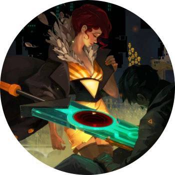

TRANSISTOR

ПЛАТФОРМЫ: PC, PS3, XBOX 460, PS4

Фэнтезийная бродилка, которая с первого взгляда ооочень похожа на Bastion (один и тот же разработчик, как никак), но на самом деле представляет из себя нечто совсем другое. Вам придется играть за красноволосую певицу Ред, на чью жизнь недавно совершили покушение и которая настроена люто мстить за это. На ее стороне — огромный говорящий меч Транзистор, в который помещено сознание неизвестного, который спас жизнь Ред.

Внешне все примерно как в Bastion: экшн-RPG от третьего лица, в которой нужно путешествовать по красивейшему фэнтези-миру, драться и делать всякие мелкие штуки. Но игровой процесс со времен первой игры студии стал глубже, история более личной, а атмосфера — атмосферной. Если дать волю нытью, можно сказать про однообразные бои и достаточно небольшую продолжительность игры.
