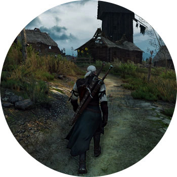

ВЕДЬМАК 3. ДИКАЯ ОХОТА

ПЛАТФОРМЫ: PC, PS4, XBOX ONE

Геральт, специалист по уничтожению монстров, путешествует по фэнтезийному миру в поисках девушки Цири, которая может остановить пришествие Дикой Охоты (просто примите как факт, что это плохо и страшно). Гуляет по полям и лесам, убивает гриффонов, в перерывах спит с красотками и шуткует. И жнец, и на дуде игрец.

Любая часть "Ведьмака" неприлично хороша, и с каждой следующей игрушкой серии все становится только лучше. Это даже несправедливо по отношению к конкурентам, которым априори должно быть очень стыдно за то, какие они в сравнении с "Ведьмаком". "Дикая охота" — это суперпроработанные квесты, за многими из которых кроется нереальная кулстори. Все пройденные квесты и решения влияют на финал игры, что круто и мотивирует. Боевая система здесь получила много плюсов со времен второй части, Знаки приобрели в полезности, мир детализирован и открыт настолько, насколько это вообще возможно.

Понравится даже тем, кто просто любит крутые романы. И обожемой, сколько же эпичнейших коубов породила локализация!
