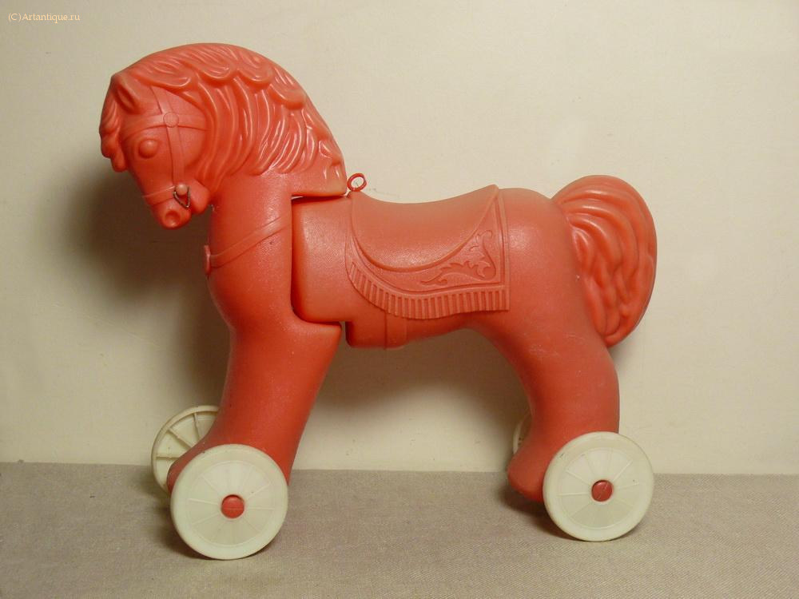
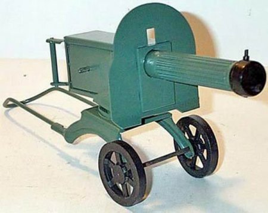

# Советские игрушки

>   In Soviet Russia toys play you!
>
>   ***Anonymous***

Совковые игрушки — прибитые к полу девайсы тоталитарного прошлого, на которых воспитывалось не одно поколение олдфагов. Пользовались лютой, бешеной популярностью ввиду того, что других игрушек у советских детей попросту не было. Марио они знали только того, который шёл грабить ~~корованы~~ банк. А другие свистелки-перделки Партией не одобрялись.

## Что в них советского?

Советские игрушки отличались советской суровостью, соцреалистическим дизайном и советскими габаритами. Средней советской игрушкой можно было убить классового врага, не прилагая особых усилий, из-за минимума пластмассы и максимума чугуния в корпусе. Повышенная ударопрочность изделий была вызвана чрезмерной разрушительной силой среднего спиногрыза несносного, обожавшего крушить всё в пределах видимости, и специалистами, работавшими на полставки в разработке вооружения. Совковые игрушки выдерживали любые экзекуции, а потому жили долго и оставались любимыми навсегда.

Весьма и весьма часто попадались экземпляры игрушек, отличавшиеся, прямо скажем, неординарностью и изобретательностью, что порождало винрар и мегапопулярность у оных. Именно таким игрушкам посвящается эта статья с надеждой, что другие дополнят её своими любимыми докомпьютерными развлекалочками. Просьба упоминать лишь те игры, которые были хотя бы ещё у двух анонимусов, кроме вас (электронные игры, типа «Ну, погоди!» в эту категорию не входят).

## Транспорт

### За рулём

Гламурный «Зарулём» такой гламурный

Винрарный агрегат, запомнившийся любому рождённому в СССР, после газированных автоматов и октябрятских звёздочек. Представляет собой вращающийся диск, изображающий закольцованную дорогу, по которой движется автомобильчик с магнитиком на пузе. Также существовал автобус с магнитиком. Цель игры — держать автомобильчик строго на проезжей части, вписываясь в повороты и проезжая под мостами. Внешнее кольцо дороги более простое в освоении, внутреннее — требует левел апа.

Особую винрарность игрушке придавала передняя панель, кагбе имитирующая панель драгоценного советского ведра, срулём, зажиганием и переключателем скоростей. Руль малолетние долбоёбы обычно отламывали и гонялись с ним по двору. Мудрые инженер-сенпаи, предугадывая это, сделали руль съёмным — то есть, отломив, его можно было легко приделать обратно. Зажигание доставляло больше всего, потому что было почти как настоящее, даже ключ можно было по-настоящему посеять. Рычаг переключения скоростей влиял на скорость вращения диска и, соответственно, на скорость машинки.

Дитяти, которым надоело просто гонять по кругу, выдумывали дополнительные моды и апгрейды для своих «За рулёмов». Были маньяки, которые обожали класть на дорогу букашек, а потом давить их машинкой. Верхом мастерства считалось на полной скорости проехать огороженный участок в углу дороги, не задев заграждение. Или же остановиться точно в нём, также ничего не задев. Ещё одна фигура высшего пилотажа: на самой большой скорости развернуть машину так, чтобы её зад занесло вперёд и вынесло с другой стороны. При этом машинка делает оборот на все 360 градусов и продолжает движение. Алсо, многие практиковали вместо машинки любую другую металлическую хуйню (например, шарик), что тоже доставляло, придавая новизны процессу. Также можно было последовательно вколхозить moar батареек, и тогда машинка бегала значительно быстрее.

Именно «За рулём» породил столько профессиональных водятлов. Винрарность этого игрища помнится до сих пор.

Даже если двигатель не работал (не крутится диск), не беда — один малолетний долбоеб крутит диск руками, а другой вертит баранку и ловит лулзы.

Алсо выпускался продвинутый вариант сего девайса — «АВТО-Тренажёр». Этот винрар имел несколько разных модификаций. В некоторых диск с дорогой был неподвижен, а машинка сама ездила по кругу. Еще один вариант имел отдельный выносной блок педалей и коробки передач (Logitech G25 нервно курит), указатели поворота, и машинка ездила на все четыре стороны (внутри располагались два моторчика, ездящих по окружности, и магнит между ними). А еще была мультиплеерная версия девайса, с двумя рулями! Был ещё заводской мод данной игры под названием «Юный водитель», в котором трассу можно было модифицировать, то есть «опоры мостов» двигались, в отличие от сабжа.

В заключение отметим, что сабж выпускается до сих пор! Пруфы гуглить по запросу «Купить игру „За рулём“». Можно и не гуглить, а пешком зайти в какой-нибудь крупный «Детский мир». Одна лишь загвоздка — нынешние «зарулёмы» делает дядюшка Ляо из хуёвейшего пластика и самых внезапных расцветок, которые могут вызвать катаракту, эпилептический припадок и преждевременное облысение. Устройства хрупкие, выдерживают в лучшем случае пару месяцев интенсивного использования, и всё время эксплуатации ощутимо попахивают полимерами.

### Игрушечные «педальные» автомобили

Сабж

Стоит упомянуть сей девайс только потому, что он давал возможность юному дарованию прокатиться на вполне себе настоящем одноместном автомобильчике на педальной тяге. Сей агрегат имел рабочие фары, задние габариты, «четкое» рулевое управление, божественную сидушку, съемное ветровое стекло, открывающийся багажник и капот (с бутафорским двигателем), и ощущение, что у тебя (писуна 4-х лет от роду) настоящая машина. Был даже трактор (колесный) в таком стиле.

Из минусов стоит отметить слабую динамику (402 метра не осилит), слабое рулевое управление, хилое крепление колес. Отдельным пунктом можно отметить, что при буксировке, либо скатывании авто с наклонной поверхности педали крутились сами, и на скорости выше 10 км/ч становились неким подобием мясорубки. В случае же неудачного расположения нижних конечностей можно было стать безногим героем — товарищем Мересьевым. Короче, Тазик в миниатюре. При этом — фетиш, несмотря на явные недостатки, был нехилый: велосипеды «Дружок» или «Конек Горбунок» воспринимались как жалкие «мотаки» по сравнению с «тру тачкой». Подобные агрегаты можно увидеть в некоторых советских детских фильмах.

Для не слишком состоятельных парней в парках работали целые автопрокатные мастерские, где можно было выбрать себе такой аппарат из пары десятков разной степени убитости и гонять на нём по площадке, врезаясь в машинки таких же оболтусов и в ноги взрослых.

Алсо, в каком-то говножурнале типа «ТВ Парка» рассказывали, что один (желавший, видимо, деткам смерти) советский ылитный папочка сделал своим отпрыскам версию с мотором кубиков на тридцать (лёгкая бензопила, да), чем доставил всему двору как лулзы, так и синяки с шишками. Доработка напильником в лучшем своём виде.

Младшим братом педальных автомобилей была трёхколёсная педальная конструкция, изображавшая двуколку и запряжённую в неё скаковую лошадь. Два колеса были частью двуколки (там же располагалось сиденье для жокея), а третье (переднее) колесо было где-то под телом лошади, штампованным из жести. С помощью системы хитрых рычагов колесо соединялось с ногами лошади, подвижно прикреплёнными к туловищу, и при движении агрегата казалось, что лошадка, типа того, что даже скачет. Но такая конструкция встречалась намного реже, чем стандартные педальные автомобили. Возможно, именно эта игрушка и породила ругательство «конь педальный».

### Сани и снегокаты

Зимний вариант педальных лосей автомобилей. Процветают и по сей день, практически не претерпев серьёзных изменений в конструкции. Большинство каталось на чугуниевых санках с проволочной спинкой, нищеброды на дедушкиных деревянных, дети инженеров и водил на пластиковых корытах, дети работников торговли на снегокатах, а маленьких евреев на горку не пускали, их медленно и печально катали бабушки в санках типа коляски. В наши дни снегокатом уже никого не удивишь, а в советскую эпоху его владелец получал +стопицот к крутости на зимний сезон. Снегокаты существовали двух основных типов:

Одноместный «Чук и Гек». С велосипедным рулём, независимыми тормозами (на скользких поверхностях, ими можно было прекрасно рулить) и металлическими полозьями. Менее скоростная, но более живучая модель.
Двухместный «Аргамак» (на практике часто трехместный — двое гонщиков сидели, третий стоял сзади на окончаниях полозьев, слегка пригнувшись и держась за плечи последнего сидящего; такая компоновка экипажа снегоката, понятно, значительно добавляла лулзов). Внезапно, разработан сумрачными гениями вспомогательного производства из подмосковного НПО «Энергомаш», клепающего ракетные двигатели, а потом уже попизжен всеми, кому не лень. С квадратным «автомобильным» рулём, центральным тормозом и пластиковыми полозьями, которые позволяли «Аргамаку» разгоняться до бешеной скорости, вызывая лютую зависть у саночных нищебродов. «Аргамак» был чем-то вроде Феррари у советской детворы. Особо продвинутые обматывали руль тряпичной изолентой и приделывали под сиденье велосипедные отражатели или фонари. Впрочем, на приличествующих лыжных горках за использование «Аргамака» выдавали целительных пиздюлей и выпроваживали волшебным пендалем. Почему ? Да потому что сия железная дура при потере седока (что нередко случается), имея нехилую массу, неконтролируемо неслась вниз, собирая фраги из попавшихся на пути.
Продвинутые спортсмены рассекали на «корытах» с раздельными тормозами (предках современных спортивных саней: утвердившись на них жопой, спиногрыз становился саночником, а пузом — скелетонщиком), пластиковых мини-лыжах или самодельных приспособлениях, позволявших совершать недоступные даже владельцам снегокатов маневры. Были и алюминиевые тарелки, похожие на параболические антенны с двумя ремешками по бокам, абсолютно неуправляемые, неустойчивые и жоподробильные. Среди самопальных аналогов особенно доставляет конструкция, которую где-то в начале 80-х годов называли «рулевик». Она представляет собой деревянную прямоугольную сидушку на трёх коньках. Два из них были намертво приколочены по углам сзади и лишь принимали нагрузку сидящего обладателя мегадевайса. Передний конёк крепился хитро — с помощью горизонтально поставленного подшипника в передней части изделия делалось рулевое управление. Руль представлял собой горизонтально расположенную поперечную доску, под которой находился передний конёк. Рулить можно было, лёжа на «рулевике» на животе, или же сидя и упираясь в доску-руль ногами. Благодаря приличному весу конструкция разгонялась до приличной скорости, и лишь тащить её назад в горку было канительно.

Совсем пролетарский вариант представлял собой простую деревянную табуретку, у которой ножки были спилены наполовину, а к культям были приколочены деревянные детские лыжи. Несмотря на примитивность конструкции, она ездила на диво хорошо и отличалась хорошей грузоподъёмностью, хотя была тяжеловата.

Особые нищеброды использовали в качестве санок холодильник с помойки, марки «ЗИЛ», лишь незначительно отличающийся по массе от одноименных грузовиков. Да, да. Тот самый бочкообразный с ручкой и замком. Затолкать его в горку можно было минимум втроем, но зато благодаря своей эпической массе плюс «n» спиногрызов сверху позволял уехать с максимальной скоростью максимально далеко. Естественно, все это в ущерб управляемости. В случае ДТП все вышеперечисленные ездоки на своих саночках выпиливались к ебеням с кровью и треснутыми костями конечностей, а нерадивые водилы «ЗИЛа» получали дома ремнем по жопе.

Ещё один вариант — сани-тарелка, по всеобщему поверью, параболические антенны, не прошедшие госприемку. А чо, СССР, мощный ВПК, хуле. За ненадобностью к ним приделывали с двух сторон по ручке и продавали детям на утеху.

На него фапала вся страна

Альтернатива для нищебродов

Альтернатива для быдла

Альтернатива для крутых поцанов

Жопа с ручкой

Из пластмассы и ремешков

Из говна и спичек

Для малышей и просто сосунков

### Модельки автомобилей

Металлические модельки настоящих автомобилей (в масштабе 1:43 (sic!)) были лютейшим вином для юного хикки. У сабжей открывалось все, что можно было открыть (при наличии отвертки и нездравой энергетики можно было отделить кузов от рамы). Под капотом располагался макет двигла, покрашенный серебристой краской, в багажнике — полноценная запаска, а габаритки были выполнены из полированного пластика. Имелись полноценно откидывающиеся сиденья, довольно крепкие стекла, котрые даже открывались в некоторых тру-моделях самых тру-машин. Данные изделия не предназначались для пылких детских игр, но были все-таки в них задействованы. Вследствие чего до седых мудей владельца машинки не доживала ни одна модель.

А еще были винрарные стальные машинки «Малютка», похожие на помесь Москвича и горбатого Запорожца — кроме тру-машинки в комплекте был пандус, на который маффффынка заезжала — так советских детей приучали к тому, что им придется каждые выходные ебаться с собственной машиной в поисках утечки масла…

Как вариант, существовала винрарная, неубиваемая серия «военная техника», в которой наличествовали православные БТРы, тягачи, грузовики и танки. Цельнометаллические, ударопрочные, и необычайно похожие на свои реальные образцы (ах, эти пластмассовые пулемётные стволы, подвижные в вертикальной плоскости). Венцом серии была модель танка Т-62 габаритами примерно 50×20 см, с резиновыми гусеницами и пушкой, стреляющей резиновыми же снарядами. В силу того, что на 95% она состояла из чугуния, единственный урон который может ей нанести юный танкист — проебать гусеницы. По той же причине модель была пригодна для верховой езды по коридору. Если же хотелось не ездить, а просто пострелять (в стекла дефицитных «стенок», в сестру, в глаза других малолетних долбоебов), существовали аналогично неубиваемые стационарные артиллерийские орудия. Хотя резиновые колеса были и у них (подробности ниже). Стоит отметить, что порой эти модельки можно встретить и в современных магазинах, причем делают их по тем же советским клише, даже надпись «Made in USSR» поленились перебить.

### Вертолёт

Вертолёт «Муха» — ~~из спичек и желудей~~ из палок и верёвок

Игрушка состояла из двух частей: собственно вертолёт и своеобразная рукоятка со стартером. Вертолёт насаживается на это приспособление, стартер дёргается, лопасти раскручиваются, вертолёт летит.

Раскрутка тяжёлых лопастей требовала серьёзных усилий, от чего невозбранно качались мышцы правой руки. Анонимусы благодарны игрушке «Вертолёт», после которой фап у них уже затруднений не вызывал. Кроме того, традиционная леска имела особенность запутываться в труднораспутываемую бороду уже на третьем-четвёртом запуске. Большую часть времени приходилось кропотливо распутывать это мочало, каковой процесс вырабатывал у анонимусов терпение буддистских монахов.

У этих недружелюбных игрушек была ещё одна беда. После нескольких десятков запусков на пусковой рукоятке разъёбывался паз, в который вставлялась лопатка вертолёта, раскручивающая винт, в результате чего лопасти уже не раскручивались так кошерно. Или же не раскручивались вообще. Какому долбоёбу пришло на ум сделать эту насадку из мягкой пластмассы — до сих пор непонятно. Фейл. А ещё, резинка, возвращающая катушку обратно, внутри запускающего пульта часто срывалась, в результате чего леска обратно не заматывалась и приходилось аккуратно наматывать её на катушку вручную или разбирать сие гениальное устройство (как и все советские игрухи) для того, чтобы надеть резину на место, обламывая все желание играть в эту хрень снова и вызывая батхерт.

Еще была другая модель вертолета, где запускающее устройство не имело лески, а представляло из себя комбинацию шестеренок, штока, на который насаживался сам вертолет, и запускающей зубчатой узкой полоски (продевалась между шестеренок). По сравнению с лесочным данное запускающее устройство было гораздо более практичным и долговечным. Алсо, на хвостах вертолётов были написаны названия городов. 100% встречались вертолёты с городами «Ленинград» и «Казань».

Были известны печальные случаи, когда вертолет при жёсткой посадке терял пружины, державшие лопасти (возможно, такие пружины были не у всех моделей). Пружины вылетали и улетали далеко-далеко… Найти их не всегда удавалось. Вертолет, потерявший пружины, более не летал. Requiescat in pacem.

Также существовала аналогичная игрушка в виде летающей тарелки. Взлетала НЛОшка невысоко — но в воздухе держалась долго и приземлялась мягко и аккуратно. Встречалась редко.

### Инерционный гоночный автомобиль

Та самая гоночная машина. Пусковая лента утрачена за давностью лет.

ГДР-овская гоночная машина, пилотируемая всадником без головы (изготовлена где-то в начале 80-х гг ХХ века) доминирует на фоне отечественного аналога.

Младшим братом одной из конструкций вертолёта можно считать гоночный автомобильчик с пусковым устройством типа «зубчатая лента». Игрушка представляла собой машинку ретро-футуристического образца с массивным колесом-маховиком в средней части и некрутящимися колёсами в задней. Фигурка гонщика также располагалась сзади, за колесом. Это описание игрушки, имеющейся у анонимуса, но он видел и иные варианты — например, где место гонщика было перед колесом-маховиком.

На оси колеса-маховика сделаны зубцы, а через корпус в этом месте проходит сквозное вертикальное отверстие. В него заправляется пусковое приспособление — пластмассовая лента с зубцами на одной стороне и специальной ручкой на одном конце. Затем ленту резко выдёргивают из машинки, колесо-маховик крутится, и вся конструкция едет. Если бы конструкторы-игрушечники включили мозги, то задние колёса тоже стоило бы сделать крутящимися — тогда трение об пол не останавливало бы машинку так быстро.

«Бархан» смотрит на тебя как на очередное препятствие

Инерционных машинок в СССР было просто немерено. И подразделялись они на несколько типов. За исключением вышеописанного, были инерционные машинки «самозаводящегося» (или откатного) типа, и стандартные инерционные «поступательные» модели. Первые нужно было откатывать назад, а потом отпускать. Вторые нужно было толкать вперёд, прилагая усилие. Из последних, самым запоминающимся экземпляром бесспорно является суровый «Бархан» (или модификация с крышей «Бизон»). Эдакий Свиборг среди игрушек. Машина с внушительными колёсами и хриплым рыком инерционного мотора, обвешанная чумовыми наклейками «Супир». Выглядел «Бархан» очень убедительно. Но за фасадом невъебенной мощи крылся хилый, убогий моторчик с, блджад, пластмассовыми шестерёнками, зубья у которых слизывало на раз-два-три, после чего суровый «Бархан» превращался в элегантный памятник советской игрушке. Ездить он не мог уже в принципе. А ведь так хотелось испытать мощь чудовищных колёс на бездорожье, в дворовых говнах. Однако, вся эта мегакруть ниасиливала даже ворс коммунистического ковра на полу. Эпик фейл, товарищи!

Ещё была инерционная гоночная машинка, за пилотом которой находился красный полупрозрачный пластик. При хорошем разгоне машинки этот пластик не хило светился. Вскрытие показало, что за маховиком стояла хитрая конструкция из миниатюрного точильного круга и кремня. При сильном разгоне этот точильный круг высекал нехуевые искры. Доставляло неиллюзорно, это вам не сегодняшние светодиоды, запах напалма по утру вареного железа прилагался — мегакруть.

Предметом вожделения и зависти была инерционная милицейская «Нива»: ведь она издавала звук сирены и мигала мигалкой!

### Советский автопром MD Edition

А ещё им можно было забивать гвозди и недругов по песочнице

Простые до отупения и совершенно неубиваемые модели автомобилей от самосвалов до легковушек размерами от кирпича и выше наличествовали в не меньшем ассортименте, чем за рубежом (чего нельзя сказать о качестве). Основной мякоткой этих моделей был чугуниевый стальной корпус и совершенно несгибаемая пластмасса. Стоит ли говорить что эти игрушки совершенно спокойно переживали туеву кучу китайских пластмассовых поделий начала 90-х. Суровый коммунистический дизайн с лихвой компенсировала устойчивость моделей к любым говнам. В редких случаях прихода в негодность игрушки чистились, проходили курс пластической хирургии молотком и вновь вставали в строй. Несмотря на незамысловатость моделей Анонимус мог невозбранно почувствовать себя дальнобойщиком, водителем кареты скорой помощи, бомбилой и т. д. в условиях, максимально приближенных к дорожным реалиям замкадья. Так-то!

Одна из самых знаменитых моделей называлась «Волгарь». Она была такой выносливой, что на ней верхом мог кататься взрослый дядька. Некоторые самосвалы продавались вместе с винрарнейшим снегоуборщиком, один в один напоминавшим настоящий. У него был классический ковш и резиновый транспортёр, приводимый в движение рукояткой. В песочнице ему не было равных. «Волгарь», буксируемый на верёвочке, издавал такой грохот и лязг, что слышно было во всех окрестных кварталах.

### Железная дорога

не совсем кошерный вариант железной дороги

Тот самый «Кирпич»

В том или ином виде была практически у каждого. Наиболее кошерный вариант — немецкий ширококолейный фирмы Piko (фирма жива, после воскрешения, здравствует, делает все те же рельсы только в Кетае). Типоразмеры делятся по ширине колеи: HO — 16,5 мм, TT — 12 мм, N — 9 мм. В немецкой рекламе показывали и более крупные модельки — в товарные вагоны легко влезало по паре яблок среднего размера. Но в СССР такие железные дороги не ввозились.

Базовый набор содержал рельсы, которые можно было собрать в круг блджад, локомотив и пару-тройки вагонов. Локомотив получал питание от рельсов, либо (иногда, и только в случае электровоза) от одного рельса и !!!воздушного контактного провода!!! ежели таковой имелся. Дополнительно можно было купить всякие разные вагончики, кстати, сделанные ну очень качественно, а также стрелки, семафоры, светофоры (это не одно и то же!) и т. п.

Отдельного внимания заслуживает блок питания. В жд-моделист сообществе «Кирпич». Этот девайс весом в пару-тройку килограмм, по всей видимости немцам помогал совьетцкий ВПК с чугунием для станины, имел 4 клеммы и один регулятор напряжения. На две клеммы выдавалось постоянное напряжение от −15 (для движения задним ходом) до +15 вольт, а на вторые две клеммы выдавалось переменное напряжение для питания электрострелок. Блок питания имел индивидуальную защиту от перегрева по обеим цепям (переменной и постоянной), что делало его ну просто вундервафлей в руках начинающего маньяка. От короткого замыкания до срабатывания защиты проходило несколько секунд, что позволяло использовать блок как микроэлектросварочный аппарат, стартер для самодельных целлулоидных ракет (на пару спичечных головок наматывалась проволока, которая при подаче 15В раскалялась и зажигала серу) и т. п.

У детей попроще железная дорога была из пластмассы, а паровозик — заводной. Однако даже такой вариант некисло доставлял. Встречались также шлагбаумы, перекрестки и светофоры.

Также был вариант советской музыкальной пластмассовой железной дороги, на которую таки надевались пласмассовые же рельсы, но с электромеханическим паровозиком и вагоном. Принцип извлечения музыки заключался в забивании укладке на жезнодорожное полотно овальных выпуклых шпал, с одной стороны раскрашенных разными цветами и пронумерованных соответсвующим номером в зависимости от их размера. Шпалы были вырублены из всякой стальной хуеты с картинками и надписями, а покрашены только с одной стороны, поэтому доставляло читать надписи с другой стороны и собирать из них разные слова как из мозаики. Снизу паровозика была быстро крутящаяся палочка, ударяющая при движении по каждому рельсу несколько раз. Соответсвенно, маленькая шпала издавала звонкий звук, а бОльшая по размеру — глухой, как у консервной банки. В результате была кагбе полифоническая мелодия.

Не путать с ДЖД, они обижаются.

### Катер с моторчиком

Секс с изготовлением модели вознаграждается оргазмом запуска

Представлял собой катер с электромотором, который работал от двух батареек. У анонимуса было два таких, один назывался «отдых», другой «нептун». К корме был прикреплен руль, который перед запуском можно было повернуть и тем самым заставить катер плавать по кругу, а для большого водоёма это критично, особенно если учесть, что после раздрючивания пластикового корпуса валом, который соединял винт с мотором, он начинал пропускать воду и катер шел ко дну аки титаник. А ещё анонимус добавляет, что некоторые катера в снаряжённом квадратной батареей состоянии имели зверскую осадку, в результате при чуть более чем минимальной волне вода просачивалась внутрь через верхнюю крышку, что тоже вызывало известный финал без всяких айсбергов.

Другой анонимус-олдфаг помнит модель патрульного катера для самостоятельной сборки руками, свободную от вышеперечисленных недостатков за счет использования православной эпоксидки, дихлорэтана и додумывания конструкции на месте. В комплекте шли корпус судна, рулевая рубка, винрарнейший электромоторчик «Гном» (самый мощный в советских игрушках), пара листов полистирола и немножко деталей оснастки, которые нельзя было изготовить вручную. Да-да, мой дорогой школьник, всё остальное вплоть до спасательных кругов и радаров, анонимус вырезал сам по прилагавшимся чертежам, приклеивал и канонiчно раскрашивал. Незаменимый опыт по использованию надфилей, лобзика и клея с кисточкой, а уж удовольствие от запуска на ближайших прудах не сравнится ни с одной из готовых игрушек. Так-то!

Существовала также подводная лодка, погружение которой регулировалось рулями глубины (а не водяными баками, как у настоящей). В качестве балласта использовались идущие в комплекте два куска металла, а моторчик работал от резинки. То есть один конец резинки крепился к валу с винтом, второй к статичной фиговине на дне лодки. Затем винт закручивался, лодка опускалась в воду и PROFIT! Если закрутить винт не в ту сторону, лодка эпично сдавала задним ходом. При остановке мотора лодка всплывала, так как была сделана (напоминаем) из большого куска полимеров.

### Умка

Вершина инженерной мысли советского машинкостроения. Этот автомобильчик умел не просто ездить. Натыкаясь на препятствия, он умел от них отворачивать. Больше того, «Умка» не падала со стола! Ощупывая край, она упорно искала где можно проехать, чем вызывала фалломорфирование у тех, кто за ней наблюдал. Также, у Умки была одна «болезнь». Уткнувшись задницей в стену, она останавливалась (как назло, чаще всего она делала это под кроватью, откуда её сложно было достать). Но это было редко.

Самое поразительное, что электроники в Умке не было вообще! Чистая механика. Столь осознанное поведение совершалось благодаря хитроумной системе. Дело в том, что машинка ездила на одном единственном колесе, спрятанном в дне. Колесо было расположено под углом, и крепилось на подвижной основе. Впереди у Умки находился крючок-щуп, совмещённый с длинной лопаточкой, которая и фиксировала колесо, поворачивая его так, чтобы Умка вовремя изменяла направление своего движения.

Алсо, дизайн у Умки был на удивление красивым (для того времени). Машинка выглядела действительно симпатично. Она способна неиллюзорно доставить даже современным детям, извращённым компьютерами и покемонами.

### Луноход

Планетоход с ЧПУ

Прямиком из космических говн

Советская игрушка, имевшая больше мозгов, чем средний советский партийный функционер. Представлял собой, натурально, вездеход на батарейках, но управлявшийся не по радио или по проводам, а программируемый с помощью встроенного пульта. Умел ездить вперед, назад, поворачивать на заданный угол, мигать лампочкой со звуком «пиу-пиу» и запускать крутящийся снаряд в виде диска. Всего в память помещалось 16 действий, так что советские дети рано учились экономить байты и такты при программировании баллистических ракет.

Была версия без фар, поворотников и запускаемой вертушки (вместо неё был отсек для батарейки «Крона»), но зато с наличием переднего парктроника. Если луноход упирался мордой в препятствие, то программа останавливалась, не насилуя электромоторчики девайса. Вообще, слабые для такой массы моторы — главный минус обеих модификаций (следует отметить, что при совке мощных малогабаритных моторчиков не было как класса).

Обычно такой луноход был один на весь район, так что на его запуск собиралась целая толпа. Проводились соревнования трех видов: прохождение из точки А в точку Б за наименьшее время, то же самое но с самой короткой программой, и преодоление полосы препятствий. В последнем случае победителем объявлялся тот, чей луноход проходил по ней наибольшее расстояние. Был невозбранно скопипащен с американской игрушки и стоил 27 рублей, примерно пятую часть средней зарплаты. Анонимус, владевший в свое время этим чудом, сообщает, что питалось оно не от привычных сегодня батареек типа А, а от НЁХ в картонном кожухе (батарейки в металлическом кожухе вообще пошли ближе к перестройке, а до этого был сплошной суровый картон). Когда НЁХ почила в бозе, анонимус очень расстроился, ибо найти замену не удалось и Луноход канул в лету.

Алсо, существовали забавные заводные шагающие луноходы на ножках, похожие на жуков.

### Танк с управлением по проводам

Аппарат с управлением по проводу

Более дешевая, и поэтому сравнительно распространенная игрушка. Выпускался в Нерезиновке, игрешучнолитейной фирмой «Огонёк». Модельный ряд — 1941—1945 г.г.: ИС-3, КВ, Т-34, ИСУ-122, ИСУ-152. Представлял собой обычный танчик для склейки, в масштабе 1:30, но имевший внутри два моторчика, через редукторы крутивших гусеницы. Батарейки размещались в пульте управления, который присоединялся проводами напрямую к моторчикам. Управление состояло из двух ползунковых переключателей полярности моторчиков, отвечавших за направление вращения гусениц. Требовал недоступной младшим школьникам аккуратности при сборке, так как редукторы склеивались из таких же кривоватых пластиковых деталей как и корпус, а моторчики, гусеницы и пульт управления собирались с помощью прижигания паяльником пластиковых шпеньков и сварки пластиковых пластин тем же паяльником. Малейшая несоосность деталей приводила к отрыву моторов от рамы, соскакиванию гусениц, отказам рукояток управления и другим неполадкам, тысячи их!

Зато правильно собранный пряморуким папой танчик мог резво бегать по песочнице, сокрушая укрепления из куличиков и погребая заживо их пластиковых защитников.

В унылом варианте без моторов выпускаются по сей день. Из-за недостаточно православного масштаба и реально страшного качества в среде клейщиков пользуются популярностью чуть менее, чем никакой. Годны для домашней имитации Прохоровской битвы с сожжением пары сотен сабжей.

### Машинки и кораблики с управлением по проводам

Игрушечный прожектор

Имели аналогичную либо усложненную (по сравнению с танком) схему и пульт с 4 кнопками — прообраз современного WASD. Могли иметь как разные корпуса на одном шасси (от гусеничного вездехода до канонiчного лунохода), так и оригинальную конструкцию, вроде прыгающего аки лягушка пескохода на тонких проволочных ножках или плавающего (плавание обычно заканчивалось проникновением воды в батарейный отсек и пиздецом) вездехода с шнековым приводом.

Батарейки на таких машинках вставлялись в корпус, на пульте оставались только кнопки. То ли где-то в Прибалтике, то ли в одной из стран Варшавского договора (на деталях имелась маркировка латиницей) выпускались яхта и подводная лодка, построенные на том же принципе. Имели на пульте вместо кнопок три рычажка-реостата, плавно управлявшие на подлодке тягой, рулями глубины и румпелем, на яхте же средний рычажок отвечал за спуск и подъем паруса, но на практике не использовался — управление такелажем отсутствовало, и ветер либо обрывал провода и уносил лодку с поднятым парусом в ебеня, либо просто переворачивал.

### Машинки с однокнопочным радиоуправлением

Сабж

Было три вида таких машинок (не исключено, что их было больше) — желтая футуристического вида машина «ралли», такой же раскраски, но более традиционного дизайна, «малышка» и голубой рафик «автовелогонка». Снизу машинок был переключатель ВКЛ/ВЫКЛ, который включал задние колёса. После чего машинка ставилась и ехала исключительно вперёд. Кнопка на пульте выполняла единственную функцию — заставляла ехать машину назад и влево. У этих машинок была хитровыебанная конструкция. На самом деле передние колёса даже не касались земли, а поворот обеспечивало пластмассовое колесо, находящееся на днище машины между передними колёсами. К слову, проходимость у этой машины была никакой, она могла ездить только по исключительно ровным поверхностям. Весь профит сводился к одной простой наёбке: собрать вокруг себя побольше детей, включить машинку, поставить её на пол, спрятать пульт за спину, а когда машина доезжала до стены или какого-нибудь другого препятствия, жать на кнопку. Все пиздюки тут же начинали просто охуевать от того, что машинка «видит» препятствие и категорически не хочет целоваться со стеной. Машинка жрала аж целых 6 пальчиковых батареек, а в пульт надо было вставлять крону.

### Механические машинки с управлением с пульта

Суровый аналог для детей, у которых не было батареек. Для того, чтобы машинка ехала, нужно было крутить ручку на пульте, похожую на ручку мясорубки, вращение на колеса передавалось через специальный тросик. Рулить машинкой можно было с помощью подобия руля на пульте, которое через второй тросик соединялось с передними колесами.

Был и некий переходный тип между сабжем и электрическими машинками с проводным кнопочным пультом: передние колёса поворачивались механическим рулём, а направление движения (вперёд-назад) задавалось электрокнопками. Например, у анона была сделанная по такому принципу пожарная машина.

Алсо, существовал весьма причудливый автомобиль, управляемый… Щелчками! Пультом управления являлась обычная щёлкалка. Услышав щелчок, автомобиль начинал разворачиваться (причём делал это задом-наперёд), следующий щелчок вновь заставлял его ехать вперёд. На самом деле, датчик машинки реагировал не только на щелчки, но и на хлопки, громкое топанье и вопли. Таки да. Однако в какой-то момент разряда батареек чувствительность микрофона становилась никакой, однако мотор ещё крутился и машинка могла ехать не реагируя даже на стуки по ней самой. Такие дела.

Еще был рафик-скорая с мигалкой и сиреной.

### Перекрёсток

Игрушка, порождённая зловещим разумом сумрачного гения. Металлическая крестовина, к которой присоединялось два металлических жгута, образующих восьмёрку. Из крестовины торчат две совмещённые фишки: зелёная и красная. По согнутым проводам гоняются две заводные машинки, до боли напоминающие православный Москвич 412. Одна машинка, заезжая на перекрёсток, втыкается в фишку, сдвигая таким образом противоположную фишку, и позволяя второй машинке ехать дальше. И так пока у обеих не закончится завод. Разумеется, всё шло немного не так. Машинки постоянно соскакивали со своих монорельсов, уносясь по им одним известному маршруту. Металлические жгуты чаще всего использовались мелюзгой для выяснения отношений. Включив режим берсеркеров, малолетние дебилы наносили себе этими сотонинскими хлыстами весьма неиллюзорные увечья.

Алсо, сам перекрёсток в руках озверевшего чада становился оружием массового поражения, которому мог позавидовать даже Наруто.

Еще эти машинки могли использоваться как дистанционно управляемые с помощью этих же тросов, вставленных в специальное отверстие в капоте. Трос служил исключительно рулем.

### Летающий голубь

Сабж оправдывал своё охуенно оригинальное название на все 100%! Он действительно летал, причём весьма недурственно. Внутри у гобуля находился резиномотор, который заводили рукояткой, расположенной в голубиной жопе. После этого ЛГ начинал неистово махать крыльями, кагбе намекая «Мне бы в небо». Продолжительность птичьей жизни была крайне невысока. Они были слишком хрупкими, и требовали слишком бережного отношения, от чего и страдали. Крылья делались из плёнки, по прочности напоминающей засохшие сопли, и потому рвались, если птаха падала даже просто в траву. Также хвост этой птицы крепился очень непрочно. Лучше всего летающие голуби запускались с открытых пригорков. Они очень натуралистично порхали, а когда заканчивался завод, переходили на красивое планирование. Впрочем, большинство анонимусов пытались запускать гобулей в своих хрущёвских малогабаритках, ускоряя процесс прихода изделия в полнейшую негодность.

Алсо, когда голубя запускали без крыльев, то он издавал звук, напоминавший резкий пердёж, чем неимоверно веселил малолетних балбесов.

### Газовый кукурузник

Выпускался на закате СССР. Открыв картонную коробку, вы обнаруживали фюзеляж, плоскости и хвостовое оперение этого игрушечного высокоплана с размахом крыла около полуметра, которые необходимо было соединить в единое целое. Самолёт (за исключением пластмассового шасси, винта и двигателя) был выполнен целиком из пенопласта, что с первого (и второго, и третьего) взгляда вызывало сомнения в длительности предстоящей эксплуатации. Особенностью вундервафли являлся двухтактный двигатель, винт которого приводился в движение сжатым углекислым газом (да-да, олдфаги, из того самого сифонного баллончика). Конструкторы чуда предполагали, что собственноручно и заботливо собранный, во время работы двигателя (25-30 сек.) самолёт должен самостоятельно подняться на определённую высоту, после чего плавно спланировать на землю, услаждая взор малолетнего Анонимуса, и заставляя его грезить небом. На деле же мечты о парении в небесах спотыкались о суровую действительность немедленно после открытия коробки с товаром. Резиновые кольца, надетые на фюзеляж и крылья, впивались в нежную плоть пенопласта, грозя тут же перекусить её. Клей ПВА отказывался обеспечить нормальное соединение деталей, а клей «Момент» разъедал их. Так что оставался только скотч (не предусмотренный инструкцией по эксплуатации). После сборки самолёт ставился на полку как украшение, потому что сифонные баллончики к тому благословенному времени превратились, как и многое другое, в жуткий дефицит. Но вот баллончик найден. Винт раскручен, руку Анонимуса обдаёт холодом выхлопа и … Машина легко взмывает в небо. На высоте нескольких метров её подхватывает лёгкий порыв ветра, отчего она переворачивается, и камнем падает на землю, ломая крылья и хвост. Командир корабля и экипаж прощаются с Анонимусом и желают ему пережить кошмар перестройки.

### Реактивный гончик

Верх изобретательности советских игрушечников! В обычный пластмассовый гончик (простая пластмассовая машинка гоночного типа) интегрировался обычный воздушный шарик. Шарик надувался, машина ставилась на пол, и отпускалась. Воздух, со свистом и попёрдыванием рвущийся из шарика, толкал мегакар к светлому будущему.

### Водяная ракета

Инструкция по применению сабжа: 1. Накачать; 2. Дёрнуть рычажок; 3.?????? 4. PROFIT!!!. Мануал, кстати, из фильма «Москва-Кассиопея»

Винрарный девайс, побочная продукция советских ракетостроительных заводов. В полую пластмассовую ракету наливалась вода, примерно половина объема (пропорции были важны, при недоливе ракета летела невысоко, при переливе не летела вовсе). Потом ракета долго и упорно накачивалась обычным велосипедным насосом. Этот же насос, с прикрученным переходником, что шел в комплекте, служил стартовой площадкой. Результат превосходил все ожидания. Ракета летела выше опоры линии высоковольтных передач. А внизу стоял счастливый Анонимус, с ног до головы обданный отработанным топливом, и махал рукой Гагарину. Резиновые прокладки быстро изнашивались, что продлевало процесс подготовки, и делало отложенный старт совсем невозможным.

### Амфибия

Амфибии были весьма популярны у советской детворы, ибо их можно было невозбранно затащить в ванну, в лужу, в реку, море, окиян, и им при этом ничего не делалось. Они просто не тонули! Разновидностей амфибий было запредельно много. Но, как обычно, была одна, которая являлась самой трушной.

Данная амфибия имела стандартный белый верх и синий (реже, красный) низ. Работала от квадратной батарейки на 4,5 В. Во-первых, она умела ездить (на настоящих резиновых шинах). Во-вторых, её передние колёса поворачивались (можно было задать любой радиус поворота, и тачила гоняла по наиболее подходящему кругу). В-третьих, она умела плавать! То есть, не просто держалась на воде, а именно плыла, приводимая в движение гребным винтом! Правда позже появились менее кошерные варианты. Советский сумрачный гений выкинул нахуй редуктор, приводящий в движении винт, и машина плыла только благодаря задним колесам, на которые сделали специальные наплывы, чтоб грести. Но машина плыла уже не так резво… Не труЪ. И, наконец, в-четвёртых, амфибии комплектовались различными ништяками. На одной базе невозбранно могла крепиться кошерная пушка (которую можно было поворачивать как заблагорассудится), брутальные ракеты (которые могли стрелять), или прикольный прожектор перестройки, который светил не хуже фонарика. В зависимости от комплектации, амфибии носили гордые названия, типа «Восход», «Шквал» и т. д.

Как и все игрушки, сделанные не из гранита, эти амфибии выходили из строя в рекордные сроки. Они имелись у каждого второго советского малыша, как правило, в разной степени разъёбанности: от жуткой, до просто ужасной.

### Красный конь

Советский Буцефал

Конь был в точности как на картине Петрова-Водкина и сделан из прочнейшей в мире советской пластмассы, которая, как известно, прочнее любого импортного чугуния. Конь был размером чуть меньше, чем сам трехгодовалый анонимус. Копыта коня были подкованы литыми белыми дисками с низкопрофильной резиной, что позволяло юному Всаднику Апокалипсиса развивать первую космическую по коридору коммунальной квартиры. Половые признаки у его мустанга отсутствовали тотально по всей сферической поверхности, видимо, для того, чтобы юнлингов не смущало, что у них меньше. И все же этот конь был бы всего лишь унылым куском пластмассы на колесиках, если бы не одна его изюминка. В основании холки у коня было кольцо. И если продеть в него писюн потянуть за него как следует и отпустить, монстра издавала демонический кобылиный ржач: «ИИииггоофхтагн!!», — который вызывал преждевременные роды у беременных, приступы энуреза у детей и метеоризма у взрослых, а также в редких случаях сердечные приступы и психозы. И весь этот однотрековый плеер работал без батареек, да и без электроники вообще. Только меха, только свистулька, только пружина, только хардкор.

## Конструкторы и наборы

### Металлический конструктор

Вертолёт из конструктора

А вот, что можно было сделать из немецкого варианта

Винрарная вещь, развивающая фантазию и компенсирующая недостаток прочих игрушек. При известной сноровке, соединив несколько комплектов, можно собрать дивную машинку, кран или паровозик. Причём в некоторых конструкторах колёсики были с резиновыми шинами! Конечно, положа руку на сердце, стоит признать, что отечественные конструкторы сильно (очень сильно) уступали по функциональным возможностям своим буржуинским аналогам. Там-то были конструкторы и с двойным (и даже тройным) рядом отверстий на пластинках, и с моторчиками, и с зубчатыми передачами. И сами наборы включали множество деталей, позволявших смастерить сложную и функциональную модель (например, гоночную машину с поворачивающимися передними колёсами). Наши, напротив, из поколения в поколение отличались пролетарской простотой, и даже сейчас практически не изменились по сравнению с временами двадцати-тридцатилетней давности. Разве что стальные конструкторы пропали, полностью заменённые алюминием. Между прочим, советский конструктор был на 100% совместим с немецким «Construction» (ибо оба были невозбранной копипастой с расово английского «Meccano»), что позволяло добавить в последний недостающего железа и гаек с винтами за копейки, ибо при сборке чего-нибудь серьезного детали быстро кончались. В некоторых моделях отечественных металлических конструкторов были даже шкалы, проградуированные в условных делениях, а инструкция предполагала сборку весов. Изредка в отечественных конструкторах предусматривались пластмассовые детали, которые можно было выгибать, делая котёл паровоза или мотор старинной машины.

Also, достаточно мелкие гаечки этого конструктора прекрасно забивали носы, уши и жопу малолетних добоебов, еще не научившихся не совать различные предметы в непредназначенные для этого отверстия. В итоге родители высирали маленькую горстку металлических кирпичей и убирали конструктор подальше от своего чада. Ибо нехуй!

Следует отметить, что конструктор приносил пользу и после взросления его владельца как неисчерпаемый источник железяк с дырочками, которые использовались в качестве крепежа для всего чего угодно при ремонте. Анонимус однажды починил этим конструктором компьютер и машину.

### Конструктор «Полёт»

Пластиковый «убийца» металлоконструктора. Несмотря на авиационное название, из него можно было сделать вообще всё: от мирного советского трактора — до ОБЧР. Возможно, имелся в виду «полёт фантазии». Сабж был разных видов: с cине-белыми, сине-красными и бело-жёлтыми деталями. Единственным фейлом столь винрарного набора для рук-не-из-жопы был довольно быстрый износ соединительных перемычек (Анонимус у которого такой конструктор появился году в 1987 как раз хочет отметить что эти самые белые перемычки доставляли батхерт — от них были мозоли из-за неимоверной жесткости, конструктор жив до сих пор и его мучают племянники, но все перемычки целы… Лютый вин!). От них через некоторое время начинали отламываться продольные сегменты. Но благодаря тому, что перемычек этих было в конструкторе чуть меньше чем дохуя, такая засада особо не напрягала. Сломанные перемычки можно было нацепить на спицы на велике и понтоваться в ближайшей песочнице. Более того, если верить приложенной к конструктору матчасти, то докупив некий апгрейд, можно было механизировать свои изобретения, устанавливая на них специальные моторчики и тяги. Назывался он «Мотор-1», в комплекте было 2 моторчика, оси для колес, шкивы, шестерни с крепежом (делать редукторы, epic win!) шатунная группа, крепеж батарейки «планета», концевик, пассики и много всякой фигни, сопрягающейся по крепежу с основным набором деталей «Полет». Количество кайфа от конструктора возрастало в разы.

Сферический «Полёт» в вакууме

Классический мех

### Электроконструктор

Винрарнейшая вещь, позволяющая юному школьнику попробовать свои силы в роли инженера-электрика. Можно было собрать светофор и управлять им с помощью реле, можно было замутить дверной звонок, можно было даже собрать телеграф и передавать сообщения морзянкой (в те времена знание морзянки прибавляло +9000 к крутости школьника). Опять же, никто не мешал пораскинуть мозгами и создавать интересные вещи в комбинации. В комплекте ещё был электромотор, который можно было с помощью инженерной смекалки приделать к какой-нибудь машинке (кстати, собранной из металлического или пластмассового конструктора) и получить двойной профит, удивляя необычной самоходной повозкой своих друзей. А ещё в комплекте к этому моторчику зачем-то прилагались 2 пропеллера. Без соблюдений правил техники безопасности можно было нехило получить лопастями по пальцам, из-за чего малолетние долбоёбы любили играть в игру «останови пропеллер», прокачивая скорость реакции.

Набор начинающего шахида

### Радиоконструктор

Представлял из себя набор деталей, подготовленную (протравленную, просверленную и даже луженную) текстолитовую плату, корпус, пакетик с болтами/гайками и инструкцию с принципиальной и монтажной схемами. Чаще всего это был карманный ДВ/СВ-радиоприемник прямого усиления на дискретных транзисторах. Сложность сборки была в общем случае практически нулевой, нужно было лишь правильно вставить деталюшки в плату и не слишком криво припаять их. Были и более продвинутые варианты, в которых требовалось хотя бы самостоятельно намотать магнитную антенну. На закате совка анонимусом был замечен конструктор, на выхлопе которого получался кассетный плеер! Правда плата там была уже полностью укомплектована, от МД требовалось в основном завершить слесарные работы (если не считать пайку соединительных проводов сколь либо серьезным радиоконструированием).

Данный вид конструкторов жив и неплохо себя чувствует даже сегодня. Ассортимент девайсов сильно расширен и переведен на современную компонентную базу, правда «играет» в них уже не школота, сутки напролет сидящая в WOW, а в основном бородатые дядьки-олдфаги (ну, или в крайнем случае, — их дети).

ЭКОН-01 (made in ВНИИ «Электростандарт»)

Для детей самого младшего школьного возраста существовала супермегахитовая версия — «модульный радиоконструктор». Представлял из себя прямоугольную коробку-базу, нашпигованную по внутреннему периметру контактными полосками-ламелями. Также, в состав конструктора входила туева хуча самых настоящих транзисторов, резисторов и всяких там дросселей, заключенных в прямоугольные же пластмассовые футлярчики, но с контактами по внешней стороне. Вся фишка заключалась в том, чтобы в правильном порядке навпихивать «кубики» с радиодеталями в базу, а затем, правильно выставив переключатели, наслаждаться разнообразным миганием лампочек и гудением динамиков, коих на базе имелось весьма и весьма. Анонимус гарантирует, что первый генератор прямоугольных импульсов он собрал именно на такой вундервафле. Сирена!!! Там можно было собрать в 7 утра в воскресенье СИРЕНУ и сразу порадовать домашних! Благо, в прилагаемой к конструктору книжице (страниц эдак на двести) разнообразных схем сборки имелось более, чем юный мозг мог осилить.

Алсо анон помнит еще один кошерный мегаконструктор, продававшийся в универмагах в последние годы Советцкой Власти. Выглядел он как россыпь дискретных хреновин, название и назначение которых было недоступно для моска среднестатистического долбоёба. Но если руки росли не из жопы, то при правильной пайке получался охереннейший миниатюрный телевизорчик, ничем не отличающийся от более старших собратьев. От покупки останавливало только одно — невменяемо высокая цена (анон как щас помнит — 108 рублей 00 копеек). Кроме того, как вы уже поняли, конструктор был одноразовым, так как разобрать и перепаять данный девайс еще никому не удавалось.

Кроме того, существовал конструктор Электроника Контур-80, из которого можно было собрать радиостанцию, которая работала практически без наладок.

### Набор «Юный Химик»

Творение латышского сумрачного гения, этот набор позволял каждому школьник-куну стать немножко безумным ученым. Набор содержал нагревательный прибор, пробирки, несколько реактивов, индикаторные бумажки, бутылочки с кислотой, магний и реторту. С ним можно было делать много всяких интересных штук. Поджигать магний, устраивать газовую атаку, собирать за пять минут самогонный аппарат (очень маломощный), а при желании и таланте даже устроить неслабый взрывчик.

В наше время в России налажен выпуск нового поколения «Юных химиков». Однако они уже не торт. Реактивов меньше, и самых винрарных (кислоты, магния) может не оказаться. И нет реторты.

### Конструктор «Архитектор»

Вариант-2. Да здравствуют хрущобы!

Было несколько видов, из которых запомнилось три.

Вариант-1. Продавался в большой тубе, и представлял из себя массу кирпичиков, окошек, дверок и перемычек. При наличии прямых рук, можно было собрать шЫдЭвр архитектурной мысли!

Анон гарантирует, что данная версия «Архитектора» реально закладывала в неокрепшие умы детей азы правильного строительства. Во всяком случае, делать правильную кладку будущие прорабы научились именно благодаря ему.

Вариант-2. Из него можно было собрать классическую хрущобу. Состоял из панелей и блоков. В первоначальных вариантах панели были только односторонние, поэтому многоэтажки выходили без этажей. Впоследствии, этот косяк поправили, и конструктор стал выпускаться с двусторонними панелями, что позволило создавать труЪ этажи. Алсо, доставляла возможность украшать эти коробки кошерными балкончиками и даже малюсенькими подцветочничками, ня! Имея пару-тройку наборов такого конструктора, можно было построить любимый микрорайон, еба! У анонимуса был конструктор, из которого таки можно было собрать микрорайон. Представлял из себя всё тот же набор деревянных брусков, но с нарисованными окошками. Поставишь 5 штук друг на друга, получи хрущёвку. Налепил 9 штук, вот тебе и многоэтажечка. Алсо, присутствовали деревья высотой 2 сантиметра, эстакады, арки и прочие занимательные штуки. С помощью другого конструктора, в виде небольших пластмассовых дисков с прорезями, мелкий анонимус устраивал экстерминатус только что построенному городу, пуляя с помощью линейки круглые снарядики. А если городок построить на диване - можно было смоделировать землетрясение в 9-10 баллов по Рихтеру.

Вариант-3. Продавался в большой коробке и представлял собой набор деревянных планок с пазами как на брусьях для сруба, крестовин и фанерных пластинок с вырезами. Можно было собрать избушку. Из нескольких наборов можно было собрать мини-Кижи.

### Конструктор «Собери зверей и птиц»

Фауна а-ля Пабло Пикассо. Слева — птица, справа — олень

Малоизвестный конструктор, выпускавшийся в середине 80-х гг. Представлял собой плоские кусочки пластмассы разнообразной формы (овальные, каплевидные, П-образные) с надрезами. Вставляя кусочки в надрезы друг друга, можно было создавать разных странных зверушек и птичек в стиле кубизма. Неплохо развивает фантазию, кстати.

### Авиаконструктор
Секретная разработка советских КБ, не иначе. Представлял собой набор разноцветных пластиковых деталей, из которых дошколие и люди постарше могли невозбранно соорудить свыше девяти тысяч модификаций самолетов, вертолетов и других замечательных агрегатов. Основным преимуществом такого изделия, как и всякого другого конструктора, являлась его многоразовость, а также возможность проявить собственную изобретательность и фантазию, что так необходимо для развития мозга ребенка. Стоит также отметить высокое качество данного товара. Несмотря на ядовитую цветовую гамму запчастей, было понятно, что на их изготовление пошло достаточное количество полимеров, что однако не мешало с лёгкостью ломаться лопостям вентиляторов в руках МД.

Были вариации таких конструкторов с моторчиками (крутили винт) или с кошерными выпуклыми иллюминаторами.

Биплан

Вертолет

Моноплан

### Промежуточные модели ~~стрелкового оружия~~ конструкторов

Представляли собой нечто среднее между танчиками и прогрессивными выкройками из журнала «Моделист-Конструктор». От первых отличались исторической недостоверностью, от вторых — производством в этой стране (а также, в некоторых соседних) в промышленных масштабах. Анонимус помнит, по-крайней мере, три подобных чуда — коробчатый змей, планер на резиномоторе и катер на паропульсире. Первые две вещи состояли из здоровенных коробок, набитых отшлифованными деревянными планками/нитками/бумагой/венгеркой, которые, по открытии, предстояло собрать в соответствии с инструкцией, по своей сложности не уступающей сборочному листу танка Т-72. И это таки летало!

К змею часто прилагалась пластмассовая фигурка парашютиста, небольшой целлофановый парашютик и хитрая проволочная скобка. Парашютист цеплялся к парашюту, тот — к скобке, скобка — на леску. Потом разжимаешь пальцы и — фюить! всю эту конструкцию ветром гонит наверх. Там скобка бьётся о стопор, отпускает парашют и скользит вниз. А парашют летит и приземляется (в зависимости от рельефа местности) в самые разнообразные ебеня, как-то: застревает в деревьях, тонет в прудах, цепляется за провода, залетает на крыши или территории «Посторонним вход воспрещён», попадает под колёса машин, в открытые окна, собачьи будки, чаны с гудроном, но всё-равно доставляет неимоверно. Можно проводить соревнования на дальность полёта, а городским жителям, стеснённым в пространстве — заменять парашютик на кусок тряпки с солидной гайкой и тренироваться в бомбометании.

Катерок же изумлял своими внешними малыми размерами и большим весом, ибо состоял, почти весь, из уже нарезаных листков луженой жести и меди. Которые нужно было, всего-навсего, правильно скрепить вместе пайкой. Сухое горючее, необходимое для функционирования, конечно же, в комплект не входило. Но его было очень много в любом спортивном магазине.

## Оружие

### Пистолет дискомет

Обойма в комплекте

Уникальное средство массового поражения в упор (при удалении от цели более, чем на метр — урон чуть более, чем никакой). Представляет собой пластиковый девайс, по виду напоминающий смесь макара с браунингом и маузером сразу (советский ребёнок должен был знать разницу!), в который заряжались пластиковые диски, лихо проебывающиеся стрелком сразу после выстрела. Собственно, винрарность в том, что проебаный боезапас легко компенсировался монетками соответствующего диаметра (идеально подходили доденоминационные рублевые монеты. У тогдашнего молокососа был выбор — либо накопить 300—500 шт. таких монет и купить жвачку «Turbo», либо бодро расстрелять весь имеющийся запас из дискомета. Следовательно, область применения тогдашних рублевых монет была очевидна и носила исключительно деструктивный характер). В советское время ввиду крупного размера юбилейных рублей можно было использовать двухкопеечные^W15-копеечные монеты. После чего дальность резко уменьшалась, но зато резко увеличивалась убойность при выстреле в упор. На рукоятке изображена перевернутая пентаграмма, что намекаэ (та же звезда, что и на ПМ + угол наклона рукояти а-ля браунинг).

Данный образец, несмотря на негрозный внешний вид, очень быстро (с пары попаданий) вызывал уважение у обладателей блестящих револьверов — металлических, охуенно красивых, но совершенно безопасных трещеток. Сей девайс сам по себе частенько становился причиной холиваров и даже драк, где и применялся по назначению.

Этот пистолетик существовал еще минимум в двух разновидностях, а именно — в виде сильно уменьшенного Вальтера П-38 (без ствола, но красного цвета!), и серого цвета непонятно-чего на винтах. Серое непойми-что было замечательно тем, что его можно было разобрать и заменить родную убогую боевую пружину на самодельную, из жесткой проволоки. Модифицированный таким образом девайс позволял играть в войнушки с другими малолетними дебилами, обеспечивая поражение пластиковыми дисками на вполне приличных дистанциях около 10 м. Да, а рубли в те времена были гораздо крупнее маленьких «павловских», и для стрельбы из этих пистолетов не подходили. И вообще, из снарядов монетного происхождения большинство школьников тогда могло себе позволить только трехкопеечные монеты — ими и пользовались.

### Электронное оружие с издаванием звуков

Игрушечная вундервафля

В эпоху позднего совка появились также и электронные игрушки, которые при стрельбе издавали звуки и мигали лампочками. Самым эпичным представителем подобных игрушек можно считать целый пулемет «Максим» в миниатюре. Аналогов данной игрушке не выпускается до сих пор.

### Помповое ружье

Существовало помповое ружье, стрелявшее шариками из жесткого пенопласта размером с теннисный мяч. Представляло собой воздушный насос — две пластиковых трубы, вставленных одна в другую. На конце одной из них, служившей стволом, находилось рифленое резиновое кольцо черного цвета, оно и запечатывалось шариком. После совершения нескольких возвратно-поступательных движений, напоминающих передергивание затвора, шарик под давлением воздуха летел к цели.

Другое пневматическое ружо. Представляло из себя металлическую двустволку, с поршнями внутри каждого ствола. Путем переламывания винтовки поршни взводились в положение готовности (заднее) и защелкивались, винтовка возвращалась в исходное состояние, затем в дула вставлялись две пробки. По нажатии курка пружина толкала поршень вперед, а тот в свою очередь создавшимся давлением воздуха — пробку. Изощренному детскому мозгу было явно недостаточно хаотичного кувыркания пробки в пространстве, поэтому в качестве снарядов использовались карандаши, шариковые стержни и даже иголки. Мощности пружины хватало на то, чтобы уже чисто механически толкнуть снаряд на несколько метров.

Было также пневматическое ружье, взвод которого осуществлялся рычагом продольным движением от приклада наподобие винрарнейшего винчестера 1873, которое стреляло пластиковыми пробками. Мощность девайса была достаточной, чтобы снести с полки пустую поллитровую банку или ушатать соседского МД. Корпус из черного пластика был украшен филигранью советского образца, имел некое подобие прицела, но был довольно хрупким, поэтому уебать супостата в рукопашной схватке было чревато потерей сабжа. Кроме того, чересчур упорное натягивание рычага, взводившего механизм, также могло вывести из строя путем разламывания сабжа пополам.

### Пистолет-вертушкомёт «Полёт»

Футуристического вида пистолет (иногда с прозрачным корпусом) и пружиной внутри. Вертушка в виде пропеллера на палочке вставлялась, заводилась на несколько щелчков против хода и очень энергично вылетала после нажатия на спуск.

### Пистолет-хлопушка

Одна из первых моделей

Поздние пистолеты. Хром и слоновая кость

Существовало два варианта: с кольцевым пистоном, и с православной бумажной лентой. Самыми кошерными пистонами были отдельные кружочки, их приходилось менять при каждом выстреле, зато под них существовало огромное количество ганов (чего стоил один только браунинг с надписью «РЖЕВ» на рукоятке Но суть сводилась к одному. На пистоне размещался заряд, ебоша по которому, курок вызывал оглушительный БАБАХ! с феерическим вспыхом и дымом. Что весьма не одобрялось родителями, в очередной раз прикусывающими себе языки, или роняющими на себя тарелки с кипятком. После выстрела в комнате ещё очень долго воняло серой. Алсо, пистончики стрелялись гораздо чаще отнюдь не пистолетами, а пролетарскими кирпичами, гвоздями и прочей ебатой, что зачатстую приводило к мелким ожогам шаловливых отростков тела.

Отдельные дятлы предпочитали раскладывать пистоны на ровной поверхности, после чего невозбранно и резко проводить по ним чем-нибудь твердым (обычно ногтем, отчего была возможность приобрести дополнительные ожоги под ногтями), чтобы пистоны вспыхивали. Особенную радость окружающим доставляло тотальное уничтожение всех имеющихся в запасе пистонов — вонь и смрад в плотно закрытом помещении обеспечены! Хотя можно было просто поджечь такой рулончик спичками. Но их никто не давал детям. Высшим апогеем вина было сворачивание полосок с пистонами в несколько слоев, водружение этого на твердую металлическую поверхность, и удар молотком с длинной ручкой. Звук сего действа можно было легко попутать с настоящим выстрелом. По аналогии, доставляло размещать цельные рулончики на расстоянии 20-30 см друг от друга на прямых участках трамвайных рельсов. Реалистичный звук пулеметных очередей был несопоставим с ничтожной стоимостью пистонов.

Алсо существовала модификация, которая использовала кольцевой пластиковый пистон и стреляла пульками. (Но также есть основания полагать, что эти пистолеты были не советского, а китайского производства, получившие распространение в начале 1990-ых годов, до появления китайских же «воздушек».) Пульки были полые внутри и с дыркой в носовой части (шоб не слишком сильно стреляло), однако очень часто встречался брак, у которого нос был цельный. Такой боеприпас представлял особую ценность.

### Пистолет со стрелой с присоской

Двуствольная модификация из чугуния

Вундервафель данного класса существовало over 9000, но все они по сути работали одинаково. В дуло пистолета засовывается стрела с присоской, которая сжимает пружину и цепляется хвостовой «шляпкой» за крючок, фиксируясь в стволе. Нажатие на спуск опускает крючок и стрела с присоской летит в цель. В чистом виде оружие малоэффективно из-за тяжести стрелы и из-за того, что она была одна. Однако можно было с помощью фломастера (используя как шомпол) зацепить пружину за крючок без всякой стрелы, а потом стрелять всем, что влезет в дуло, например, мелкими камешками и палочками, коих на детских прощадках чуть менее, чем дохрена. Также в качестве замены стрелы использовался обычный деревянный карандаш, у которого с одной стороны делался пропил для цепляния крючка. ДЕвайс при определенной сноровке стрелял метко и больно.

Существовал и более простой способ существенно повысить убойную силу штатной стрелы. А именно — присоску снять, стрелу развернуть «к лесу задом» и насильно вограть в дуло до щелчка. Фокус гарантировал такое существенное изменение в кинетике, что оная стрела при столкновении с препятствием могла (и регулярно так и происходило) невозбранно разлететься к хуям на несколько частей. Так что при попадании этой штуки в лоб школоте, ощущения были гарантированы самые запоминающиеся.

Был ещё многозарядный вариант револьвера, в барабане которого были подпружиненные поршни. Заряжание производилось с фронтальной части барабана. Пластиковые пульки вставлялись в каморы, при этом пружинки сжимались; после чего нужно было провернуть барабан вручную, уткнув пульку в выступ корпуса. Когда снаряжались все каморы, можно было начинать пулять. От нажатия спускового крючка барабан проворачивался и пулька, под действием пружинки, вылетала (нужно сказать, что весьма недалеко, ибо пружинки были слабоваты). Так как штатных зарядов было ограниченное количество, проебывались они быстро. Тогда малолетний стрелок фрагментировал карандаш на кусочки соответствующей длины (по диаметру точно подходили), и пулял ими. Цвет револьвера серый, материал исполнения — пластмасса. И, конечно же, звезда на рукоятке.

### Лук и арбалет со стрелой с присоской

Представляли собой, как ни странно, лук и арбалет малой убойной силы. Плечи были проволочные, тетива — толстая леска. Стрелы были пластмассовые с присоской на конце и их было мало. Присоска ни к чему не присасывалась и только ухудшала аэродинамику. Поэтому на улице стреляли в основном самодельными стрелами из палок/веток. Можно было собрать стрелы и намазать их моментом, после чего выстрелить вечером в витрину магазина — утром стрелу оторвать еще получалось, а вот присоску — уже никак. Лулзы шли пачками.

### Луки, арбалеты и бичи из подручных материалов

Идеальным подручным материалом являлись лыжи. Правильно изготовленный лук из лыж имел двойной изгиб и стабилизатор из куска арматуры. Такой лук даже в руках школьника посылал стрелу более чем на 100 метров или на меньшей дистанции пробивал навылет среднюю бродячую собаку. Если получалось попасть, конечно. В 90-е некоторое распространение получили бичи из кожи, сплетенной с тонкими стальными тросиками. Лучшие изготавливались с применением спертой с заводов струнной проволоки и позволяли перерубить пополам голубя или нанести серьезные раны пацану не с раёна.

### Сабли

Вот она, няшка

Были, кажется, у всех, доставляли наркоманскими расцветками (как вам синяя сабля в зеленых ножнах?). Клинок полый, конец закругленный, дешево, безопасно и сердито. Можно было безнаказанно взять и уебать кому-нибудь. И получить такой же сабелькой в ответ.

### Набор юного богатыря

Включал в себя меч в ножнах, портупею, на которую этот меч вешался (портупея была велика и впору скорее взрослому или подростку, чем ребёнку), щит, шлем (несмотря на наличие вентиляционных отверстий, башка страшно потела в нём), лук (тонкая резиновая тетива быстро обрывалась) и колчан стрел с присосками (которые присасывались только к гладким поверхностям и только при очень прямом попадании). Все предметы были насыщенно-красного цвета.

### Игрушечное оружие фирмы Страуме

Прибалтийский завод выпускал винрарнейшие приблуды для игры в войнушку. Маленькие «Маузеры» и «АК-74» громко трещали и мигали красной лампочкой в стволе, а игрушечный ручной пулемет даже протягивал ленту, закольцованную чтобы не потерялась. Кроме узнаваемого Калашникова из автоматов выпускался футуристичного вида сцукобластер с подствольным ракетометом. В некоторых моделях находился моторчик, на ось которого был нацеплен согнутый кембрик, который бил по корпусу имитируя стрельбу. Еще имелись автоматы «Томсона» зеленого цвета, обладатель которого сразу повышался в звании в очередных войнушках. В Беларуси кроме них продавались еще и пистолеты, внутри которых при нажатии курка колесико терло по кремню и внутри прозрачного наконечника ствола летали разноцветные искры. Ночью смотрелось охуительно, днем — хуево.

Возможно, продуктом этой же фабрики был крутой железный ППШ с красным пластмассовым прикладом, имеющий мощную механическую трещотку, имитирующую звук выстрелов.

### Пушка с пружинным механизмом стрельбы

Существовала в виде советской поствоенной модели. Снабжалась пластмассовыми патронами с резиновыми наконечниками, дабы не особо причинить вред окружающим. После того как взводился ударный механизм, в дуло пушки вставлялся пластмассовый снаряд. И спуская курок, пушка с грохотом металла выстреливала из своего дула снаряд на приличное расстояние. Кроме того, пушку можно было зарядить круглым пистоном для полной и окончательной имитации канонады. Из-за своей дальнострельности, теряла весь свой боекомплект. И анонимус спешил к ближайшим кустам, чтобы пополнить боекомплект деревянными заменителями патронов. Использовался для стрельбы по солдатикам, особенно когда те находились в песчаных окопах или прятались в песчаных городах. Так же боёк пушки был полезен для пробивания пистонов. Смерть пушки наступала либо от изнашивания пружины, либо из-за разлома ударного металлического бойка.

Более детский вариант был сделан в виде старинной пушки и стрелял крупными пластмассовыми ядрами.

### Водяной пистолет «Импульс»

Эхо войны

Водяных пистолетов в Союзе было немало. Качеством они практически не отличались от современных образцов. Ресурс эксплуатации у всех был примерно одинаков. Они «дохли» через несколько дней интенсивной игры. Бодрые, остренькие и дальнобойные струйки вскоре превращались в унылое пульверизаторное опрыскивание на расстояние вытянутой руки. Короче, ссали хуже, чем их хозяева-пиздюки. К слову, были пистолеты, которые так стреляли изначально. Но… Был один мегаган, который не изнашивался охуительно долго. Выглядел он как большой футуристический бластер красно-белого цвета или желто-красного, приплюснутый сверху. В него не только входило гораздо больше воды, так ещё и стрелял он очень даже далеко и чОтко. Износостойкость орудия была запредельной. Назывался девайс «Импульс». Однако была у него одна слабость, которая сводила на нет все его плюсы: если был неудачный образец — он протекал через ручку. Алсо, есть версия, что протекал любой образец через рандомный эксплуатационный период.

## Живность и прочая шагающая хрень

### Бегемотик

Баргамотик-обжорик

Заполненный водой герметичный пластмассовый цилиндр с кнопкой внизу и резиновой крышкой вверху. Внутри покоится вмурованный в стену бегемот с открывающейся верхней челюстью. Внизу разбросаны цветные шарики. При нажатии на кнопку шарики подбрасываются вверх, а пасть бегемота открывается. Цель: зохавать бегемотом как можно больше шариков. Вспомним о игрушечном супер-мега-хите «Hungry Hungry Hippos» и его вариациях! Очень и очень многие часами медитировали на этот девайс. А о Snake Rattle`n`Roll никто даже не подозревал. Бывали и вариации, например, дельфин вместо бегемота, а вместо шариков — колечки, которые требовалось надеть дельфину на нос. Кстате, дельфин был с носом рыбы-меча — это аватар ископаемого дельфина Eurhinodelphis, однако! Это вам не в тапки срать — па-ле-он-то-ло-ги-я, наука, блджад!

Ещё один бегемотик нигде не плавал. У него внутри находилась пружинка, которую заводили, вытаскивая изо рта бегемота приманку на прочном шнурке и с колечком. Когда приманку отпускали, пружина начинала раскручиваться, при этом бегемотик быстро шевелил лапками (типа, плыл), а шнурок с приманкой сматывался в его пасть. Фишка состояла в том, что приманка влетала в пасть бегемота, и он, типа, заглатывал её, потому что верхняя челюсть у него прикреплена подвижно,.

### Лягушка

Штука, заставляющая срать кирпичами даже видавших виды джЫдаев. Зелёная хуита, отдалённо напоминающая лягву, с пружиной внизу. При надавливании, пружина сжималась, и удерживалась присоской. Через какое-то время присоска ослабевала, и пружина распрямлялась, подбрасывая лягушку высоко вверх. Как правило, это происходило, когда никто не ждал. Лягва умудрялась застать врасплох даже тех, кто дожидался её прыжка. Чего уж говорить о несведущих. Визги, вздрагивания и мат были обеспечены. Злоебучая лягушка будто бы нарочно сидела очень долго, глядя на собравшихся вокруг идиотов, как на говно. И когда уже казалось, что сегодня прыгать она не будет, эта сволочь подпрыгивала, вызывая баттхёрт. Лютая весч. Помимо лягух в ранне-постперестроечный период продавались также винрарные пауки. До скатывания сраными китаёзами в говно, исполнение у них было такое, что его нетрудно было перепутать с настоящим тарантулом. Качество высранных кирпичей превосходило все ожидания, директор школы Анонимуса подтвердит, еще как!

Лягушка-убийца

Алсо был невиданный мутант пластмассовой лягушки, пружины и ножниц. Хитрожопый анонимус мог использовать её в качестве оружия ближнего боя. Достаточно было показать её издалека какому нибудь знакомому, как он, заинтересовавшись, подходил и начинал осматривать зелёную хуиту вблизи. Неуловимое движение пальцами — и лягушка довольно-таки мощно выстреливала незадачливому товарищу в лоб (при необходимой сноровке можно было даже выбить глаз), а если представить себе, что режешь ножницами длинный лист бумаги, то можно было нанести целое комбо. Если же товарищу удавалось увернуться, то под ним была аккуратная кучка свежевысранных кирпичей.

Помимо лягушки, существовал аналогичный паук. И ещё боксёрский кулак, только вместо «ножниц» на конце был этакий пистолетик, преобразующий нажатие на широкий курок в сведение концов пластин (те же яйца, только вертикально).

### Пластмассовые звери

Зоопарк в моём багаже ((с) Джеральд Даррелл)

Творение чехословацких мастеров-игрушечников, наглядное пособие для начинающего Брема, Даррелла или Айболита. Да, сейчас полно такого же (и даже лучшего по проработке деталей) зверья китайского производства, но тогда это был писк! Выпускалось несколько наборов зверушек с разным их количеством и качеством исполнения, в том числе наборчик ископаемых животных с традиционными мамонтом, бронтозавром и саблезубым тигром, больше похожим на купированную дворнягу. В любом случае, они были покрыты мерзко держащейся краской, которая не выдерживала детской тяги к познанию особенностей фауны мира, и облуплялась уже в первые дни после покупки. Тогда приходилось вооружаться гуашью и восстанавливать утраченный лоск. Жирафу, например, пришлось восстанавливать пятнистость на шкуре с помощью кисточки и обычной тёмно-коричневой морилки. Но зато сколько лет прошло, а он сохранил наведённый глянец.

Цвет большинства зверушек колебался от унылого чёрного, коричневого и поносно-рыжего до кислотно-зелёного (у крокодилов). Но всё равно, было за счастье обладать таким зверьём. Даже подаренные одноклассницами на 23 февраля в далёких 80-х годах зверьки по-прежнему в строю — они есть не просят и радуют уже новые поколения.

Также был отечественный набор домашних животных (довольно страшненького дизайна), включающий корову, свинью, козу, утку и курицу (а может, и кого-то еще). Эти игрушки были сделаны из легкой пластмассы и плавали, что доставляло при купании.

Были и тысячи, тысячи всевозможных «одиночных» фигурок всевозможных зверей, не образующих наборы. Пластмассовые, резиновые, реалистичные, мультяшные, красивые, уродливые… Всех не перечесть.

### Шагающие игрушки

Ножками потопали, ручками похлопали…

Возможно, кто-то из олдфагусовъ помнит бессмертные строки про бычка, который идёт по доске, качается и вздыхает на ходу. И кто-то, возможно, видел такие игрушки, или же обладал ими в детстве.

Все игрушки такого рода устроены просто. Ступни их выгнуты, что позволяет зверьку качаться из стороны в сторону. Черепаха хорошо пробегает по наклонной плоскости — нужно лишь толкнуть её в бок, и она зашагает вниз, резво переставляя ноги. Ослик — более продвинутый вариант: у него на шее привязан грузик, который надлежало свесить с краю стола. Ослик после толчка в бок резво шагает, а груз опускается и тянет его вперёд. Дойдя до края стола, игрушка останавливается.

В начале 90-х годов в ларьках обоих Дефолт-сити встречались сделанные по тому же принципу шагающие Винни-Пухи (отечественный, кошерный вариант). Ну и конечно, шагающие пингвинчики навсегда в сердце олдфагов.

## Морской бой

###  Механический

Место сражения.

Винрарный агрегат, позволявший олдфагу при известной сноровке ощутить себя капитан-лейтенантом Маринеску. Представлял собой прямоугольное поле из стали, имитировавшее воду путём нанесения чередующихся полос разных оттенков лазурного цвета — это нижний ярус. Со стороны каждого из двух игроков во втором верхнем ярусе игрового поля (собственно, это водная гладь) имелись прорези, в которые вставлялись маленькие макеты кораблей. Девайс был оборудован также двумя торпедными аппаратами, конструктивно представлявшими из себя корпус, вращающийся на вертикальной оси, закреплённой в игровом поле. В верхней части корпуса имелось углубление, в которое можно было положить металлический шарик (калибром 6 мм, страйкболисты описались от восторга!), символизировавший торпеду. После нажатия специального рычажка шарик проваливался вниз, и попадал на наклонный жёлоб, который, по задумке конструкторов девайса, спускался ниже водной глади, и был направлен в сторону вражеского конца игровой доски. Кроме того, в торпедном аппарате имелся самый настоящий перископ в виде наклонного зеркальца; взгляд, брошеный на прицел вертикально вниз, преломлялся вперёд, и устремлялся в туманную даль, где, очевидно, покачиваясь на волнах, следовала вражеская эскадра. Чтобы получить профит, нужно было зарядить торпедный аппарат минимум одним шариком и вращать его вправо-влево до тех пор, пока в перископе не станет виден один из кораблей противника. После этого нажимался рычажок, шарик, набирая скорость, скатывался по жёлобу торпедного аппарата, пересекал по дну коробки пространство под водной гладью, и при особом везении втыкался в подводную часть вражеского корабля, отчего тот вылетал из предназначенной для него щели, и падал вниз, то есть тонул и ложился на стальное дно Мирового океана. Скрытность движения шарика до момента попадания в цель гарантировала эффект неожиданности. Противник негодуэ! Также в оба торпедных аппарата можно было запихать не один, а много-много шариков (так что рычажок еле нажимался) и устроить тотальный экстерминатус вражеским кораблям, после чего противник высирал тонну кирпичей. Еще, при наличии достаточного количество шариков, был вариант блиц игры, когда торпеды заряжались и выпускались непрерывно. В такой игре залогом успеха была не точность, а скорость заряжания. Важно было установить девайс на как можно более ровную поверхность, ибо в противном случае движение торпеды из поступательно-прямолинейного превращалось в криволинейное со всеми вытекающими.

### Электронный

Электронный

Электронная версия каноничного бумажного морского боя на КР580ВМ80А. Имеет четыре поля, по два с каждой стороны. На одном выставляются «свои корабли», а на другом нужно угадывать корабли соперника, используя два ползунковых десятипозиционных переключателя с каждой стороны, с помощью которых нужно было вбивать в девайс координаты при установке кораблей и во время игры. Девайс умел издавать звуковые эффекты: на протяжении всей игры пикал, а при выстреле, попадании или победе издавал соответствующие звуковые сигналы. Существовало, по меньшей мере, два внешне абсолютно разных девайса с похожей начинкой. 

### Магнитный

## Прочие

### Кто быстрее

Собственно, сабж. Оригинальный дизайн наклеек на часах и игровом поле заменён собственноручно нарисованным ввиду мерзкой слащавости оригинала

Хитровыебанная вещь, состоящая из полосы препятствий, и пульта управления этими препятствиями. Механического, разумеется. Цель, докатить шарик из пункта А, в пункт Бе, пока на таймере тикает время.

Олдфагусъ, имевший счастье провести часть детских лет в Германии (а также по совместительству обладатель вполне дееспособного экземпляра оной игрушки), вспоминает, что ровнёхонько такую же игрушку видел в буржуинском каталоге «Нэкерманн» (а может, «Квелле» — да кому это важно?) за тысяча девятьсот восемьдесят лохматый год в любимом разделе игрушек. А потому может утверждать, что эта игрушка, со всей её интересностью, невозбранно скопипащена с буржуйской игрульки.

Отдельно, по поводу «Кто быстрее», свое слово может сказать любой совковый мелкий радиолюбитель-кун. В силу некоторых неизвестных причин 4/5 всех руководств для осваивающих паяльник начиналось с «игрушки» с соотв. названием. Цель — по нажатию Кнопки1 два соседних долбоеба должны были нажать на Кнопку2, каждому свою. Побеждал тот, кто нажал первым, загоралась лампочка. Всё. Тотальный идиотизм начинания не мог не привлечь пристального внимания и недоуменного WTF. Но собирали. По заветам старших (письменным в тех же руководствах), советская молодежь должна была радостно в это играться, устраивать соревнования… нутыпонел. Мрак и ужос.

### Лабиринты

Почувствуй себя Тесеем, Ариадной и Минотавром в одном флаконе

Собственно, вся история началась с элементарного жмотства царя Миноса, за которое Посейдон наказал его... жену неуёмной страстью к Критскому быку. После того, как страсть была унята, родился Минотавр. И все заверте... Дальше курим греческие мифы.

Английские лорды, дабы вбухать с умом бешеное бабло, звеневшее в их карманах, делали лабиринты из красиво стриженых кустиков на площади в сколько-то гектаров. Простые советские граждане, не располагая такими деньжищами, сажали на шести сотках картошку и морковку. А лабиринтами их обеспечивала советская игрушечная промышленность. Надо сказать, весьма забавными и толковыми лабиринтами.

Для тех, у кого извилин было поменьше, выпускали простенькие одноуровневые лабиринты с прозрачной крышечкой. Тут требовалась лишь элементарная ловкость рук, чтобы перегнать шарик с краю в середину. А можно было просто снять крышку...

Для эстетов выпускались многоуровневые лабиринты в виде наглухо запаянного стеклянного кубика, шарика или цилиндра. Чтобы их пройти, нужно шевельнуть серым веществом и элементарно проследить, куда ведут все ходы и выходы на каждом уровне. Автор этих строк вспоминает, что к его услугам были листок из тетради в клеточку, на котором путём анализа движений шарика в лабиринте вырисовывались все хитросплетения головоломки.

### Геометрические головоломки

### «Тактика»

### Электровикторина

«Эрудит» готов проверить, можешь ли ты пользоваться мозгами по назначению

Девайс первого типа (для детсадовско-младшешкольного возраста) представлял собой толстую картонку, на которую была наклеена фольга и по ней разведены толстые контактные дорожки. Сверху на фольгу клалась бумажка, разделенная на квадратики. В квадратиках были вопросы и ответы или картинки. Цель — найди соответствие между вопросом и ответом и приложить контакт к фольге через дырочку, находящуюся в соответствующем квадратике. В случае правильного ответа контактная дорожка совпадает и загорается лампочка. Юные кулхацкеры уже тогда поняли, что достаточно запомнить правильное расположение парных контактов, чтоб мгновенно отвечать на любые вопросы. Автор лично отжигал таким макаром в детском садике, когда воспитательница проводила викторину с помощью данного девайса.

Поскольку детсадовцы с возрастом эволюционируют в школоту и становятся умнее и хитрее, викторины для них тоже менялись. Одна из викторин, рассчитанных на школьников среднего звена - игрушка под суровым названием «Экзаменатор "Эрудит"». В комплект игры входят сам приборчик со множеством рычажков и тумблеров, а также четыре книжечки с вопросами по разным темам: 1) Физика; 2) География; 3) Правила дорожного движения; 4) Математика. Вопросы кодируются по номерам разворотов страниц, и на каждый вопрос даются варианты ответов. Соответственно, игрок выбирает правильный ответ рычажком и вводит результат в приборчик. После ответов на все вопросы прибор высвечивает оценку от «2» до «5». Вопросов много, и запомнить, когда какую кнопку жать нужно, просто не получится. Нужно поступать традиционным способом - напрягать мозг над каждым вопросом. Не всем это доступно.

Вопросы по географии

Вопросы по математике. Никакого матана, а сумеешь ли правильно ответить?

Правила дорожного движения. Но спасёт ли их знание от бухого драйвера?

Всеми любимая физика

### Корона

В мире известна так же как «Филиппинский бильярд» и «Новус». Настольная игра вроде мини-бильярда, вместо шаров — небольшие деревянные диски. Нищеброды играли самодельными киями на досках для нард, натертых борной кислотой.

### Настольный Хоккей

Настольного хоккея было несколько видов. К слову, в те далёкие времена, хоккей был очень популярным в СССР видом спорта и все советские люди с особым удовольствием смотрели матчи с участием сборных СССР, Канады и Чехии тогда еще Чехословакии. Обычно после трансляции очередного матча, просыпалось желание покатать шайбу самому, а в случае проигрыша «наших», отомстить за поражение уже непосредственно на столе. На поле были хоккеисты красного и синего цвета (у анонимуса из Беларуси - красного и зеленого, что как бы намекает). Красные, естественно, были командой СССР, а синие либо канадцами, либо чехами (как вариант — Спартак и Динамо Сокол (Киев)). Особого внимания заслуживает хоккей с маленькими хоккеистами и вратарями, которых нельзя крутить (на бортиках такого хоккея не было циферок и бегунков для ведения счёта). В детстве анонимус любил наблюдать за баталиями, которые устраивали его взрослые дядьки. Особенно доставляли их комментарии подобного рода: «Грецки берёт шайбу, выход один-на-один, щелчок, ай-яй-яй-яй-яй, Мышкин на месте и парирует удар»[6]. Также доставляли моменты замены игроков (!) когда уже много раз не получалось забить с выхода один-на-один, центрового хоккеиста выдёргивали и ставили на его место другого. Этот настольный хоккей можно было допилить, повысив скорость и динамичность игры в несколько раз. Во-первых — убрать стандартную резиново-металлическую шайбу и выпилить шайбу таких же габаритных размеров из дерева самому. Деревянная шайба начинала летать со скоростью звука и порой уследить за ней было практически невозможно. Второй вариант допила — замена стандартных пружин хоккеистов на более мощные. После такого апгрейда аццки болели кисти рук, но хоккеисты ебошили по шайбе от души. Еще можно было немножко согнуть клюшку у игрока, что приводило к лучшему контролю шайбы и точности броска. Также можно было заниматься читерством и, пока никого нету дома, невозбранно скручивать более мощные пружины у предполагаемой команды противника и менять их на слабые пружины своей команды… ??? PROFIT!!!

Олсо. На ряду с настольным хоккеем присутствовал также настольный футбол, где нужно было оттягивать специальные пружинки, благодаря которым маленькие металлические игроки реально пинали металлический мяч ногами. Шарик практически всегда улетал за поле, и им можно было зарядить в лоб сопернику.
Also. Кроме хоккея и футбола, имел место быть настольный баскетбол. Он был совсем небольшим, и поле у него было покрыто пластиковым колпаком. Вместо игрушечных Джорданов, на поле находились дырки, из которых мяч выбивался специальными толкачами. Часть дырок управлялась одним игроком, часть — другим.

### Детская Логическая Машина (ДЛМ) aka «Доломайка»

Так и просится взять и доломать

Эпическая и весьма недешевая хреновина, стоила четверть зарплаты инженера. Представляла собой упрощенную до предела, но таки почти настоящую аналоговую вычислительную машину, которая умела производить основные арифметические действия над целыми числами. «Программирование» производилось точно так же, как и у взрослой аналоговой машины — при помощи гибких перемычек со штеккерами на концах и переключателей. В комплекте была брошюра, содержащая «программы» самого разного применения, от математических игр, до личностных тестов (если ты блондин, соедини перемычкой гнезда 5 и 12 и т. п.).

### Весёлая карусель

Русская рулетка

Тайное оружие ZOG, внедрённое в нашу страну с целью разложения населения с молодых ногтей. Всё дело в том, что пресловутая «Весёлая карусель» была ни чем иным, как обычной казиношной рулеткой в миниатюре. Было и поле, и фишки, и всё как надо, чтобы подготовить школоту к серьёзному проёбыванию кровных накоплений в грядущие лихие девяностые. Анонимус с друзьями, не мудрствуя лукаво, называли эту игру «Казино», и играли в неё на заранее нарисованные деньги (в виду тотальной нехватки денег настоящих). В наши дни с большими «Весёлыми каруселями» ведётся активная борьба, но покамест с переменным успехом. Ибо, та ещё зараза. Так же имеется и до сих пор функционирует данная карусель с электродвигателем, дохловато вращающим колесо "барабан".

### Фильмоскоп

Именно такой, малинового цвета

Поскольку в СССР видики были далеко не у всех, а по телевизору мультики показывали крайне редко, анону оставалось довольствоваться диафильмами. На плёнке, похожей на проявленную фотоплёнку, располагались картинки (в основном кадры из одноимённых мультиков), под картинками был текст. Получалось, что смотришь кагбы мультик, но со скоростью 0,1fps и с вырезанными сценами, которые приходилось дофантазирывовать. Нынешней школоте не понять, как такую хуету вообще можно было смотреть. Вечером в комнате выключался свет, фильмоскоп направлялся на простыню, повешенную на пустой стене и начинался сеанс. Кто-нибудь из родителей заряжал плёнку, настраивал резкость, крутил ручку, меняющую кадры и читал текст, ибо в таком возрасте анонимус читал с трудом. Диафильмы были различными. У аннона в коллекции в основном были сказки а-ля «Ну, погоди!», но приходилось видать фильмы про военные подвиги русских лётчиков и танкистов. Анон рос, и со временем сам научился читать, включать фильмоскоп, заряжать плёнку и крутить диафильмы знакомым девочкам, представляя себя настоящим киномехаником, тут-то девайсу и настал пиздец.

Первые аппараты являлись живым воплощением гиперболоида инженера Гарина. Посудите сами. Форма напоминает пушку. При открытом кожухе, взору открывается мощная лампа и суровый увеличитель. Во время работы, фильмоскоп время от времени зловеще гудел, как трансформатор, и грелся так, что на нём можно было легко зажарить яичницу. Менять плёнку следовало очень аккуратно, рискуя получить ожоги.

Последняя модификация фильмоскопов уже не являлась проектором, а имела собственный экран, на котором демонстрировала вышеуказанные диафильмы. Появилась она на заре видеосалонов, поэтому так и не стала популярной.

Так же существовал девайс, похожий на миниатюрную кинокамеру, внутри которой находилась микропленка. Заглянув в объектив и вращая ручку можно было просмотреть отрезок мультфильма длиной около 15-30 секунд.

Алсо, анону запомнилась одна лента, которая была у его друга, и называлась «Откуда берутся дети». Диафильм был наивен, как пожилая учительница анатомии, но неискушённой детворой воспринимался как жосткий прон. Его смотрели втайне от родителей, под столом (!!!), соблюдая глубокую конспирацию. Эх-х, было время!

### Стереоскоп

Стереоскоп

Советский анонимус мог увидеть «настоящее тридэ» задолго до этого вашего Аватара и прочих имаксов с помощью данного мегадевайса. Представлял собой что-то вроде бинокля с прозрачно-матовым экраном, в который заряжались картонные носители с десятком пар картинок — чаще всего раскадровка кукольных мультфильмов. Девайс не имел механических частей и поэтому мог прожить в разы дольше любых фильмоскопов, если только не попадал в любопытные руки юного вивисектора.

Любой уважающий себя город (а курорт — в особенности), считал своим долгом продавать стереоскопы с внушительным набором стереодиапозитивов, посвящённых себе любимому. Стереоскопы позволяли, вернувшись из тёплого Сочи в родной грязный Новоебенёвск, наслаждаться 3D-воспоминаниями.

Алсо, существовали и моноскопы (как правило, в виде домиков, яиц, или шарообразных хранилищ для покемонов), с одним единственным фотопозитивом. Зато фотопозитив был с вашим изображением. В большинстве советских квартир эти яйца хранились на сервантах, среди пыльных салатниц и фужеров.

### Детский телефон

Когда мобильники не были даже фантастикой, существовали самые настоящие детские телефоны, которые выглядели точь в точь как настоящие, только размером были немного поменьше. Работали они от батареек, и соединялись двадцатиметровым проводом. Когда на одном телефоне крутили диск, второй — звонил. Были, впрочем, аппараты и без диска - на них вызов осуществлялся снятием трубки, что заставляло второй телефон мерзко пищать. Поднимая трубку, можно было услышать, например: «Сынок, иди кушать!» Но круче всего было купить телефон в складчину, с друганом, живущим в соседней квартире, или же этажом ниже/выше. Провод просто выводился в окно, и протягивался по внешней стене дома. Таким образом, можно было создать собственную телефонную линию. Win!

Алсо, длины штатного провода постоянно не хватало, поэтому один анон угробил две недели летних каникул, распутывая брак настоящего телефонного кабеля, спижженного его батей с кабельного завода. Зато получившегося провода оказалось достаточно, чтобы докинуть линию до дачи другой личинки человека, расположенной в двухстах метрах!

Кому интересно, читайте рассказ Николая Носова «Телефон» — там описано гораздо подробнее.

### Выжигатель

Выжигатель по дереву

Универсальный инструмент обучения будущих терморектальных криптоаналитиков. Можно было выжигать по фанерке на уроках труда, по парте на них же, можно было выжигать по соседской кошке, соседской двери, окну, автомобилю, сыну (дочери), можно было выжигать по бумаге, пластмассе и даже тонкому металлу. Чтобы нанести предварительный рисунок для выжигаемой фанерки, бралась бумажная копия наносимого рисунка, под неё клалась копирка, снизу фанерка. Дальше нужно было долго и муторно прочертить по контурам. После выжигать, задыхаясь выжигаемыми газами.

Выжигателем можно было прикуривать, дистанционно запаливать самодельные бомбы, истреблять насекомых, запечатывать банки с вареньем, вырезать скульптуры из резины (или просто резать автомобильные шины), сваривать пластик для теплиц, вулканизировать заплатки для колес велосипеда, греть чай и рисовать в темноте светящиеся буквы. И все эти удовольствия за 3руб. 14коп. или около того. Так как состоял выжигатель из реостата, нихромовой проволочки, ручки и соединительных проводов, его могли выпускать даже мастерские при интернатах для умственно отсталых — и выпускали. Продвинутые разновидности имели набор сменных наконечников разной величины и формы, упрощенные не имели даже регулировки, но суть оставалось одна и та же.

Сегодня выжигатели вышли из категории детской игрушки и используются в основном в ветеринарии для клеймения животных среднего размера и в среде экзальтированных херок — для клеймения себя. Еще одним местом, где невозбранно используют олдовые выжигатели, является КВД. Всякие бяки, образовывающиеся под зарубцевавшейся кожей (например, после пореза стопы во время купания в море), выжигает дядя-доктор, используя в работе термос с жидким азотом и олдскульный совковый выжигатель по дереву. Анонимус подсказывает, что выжигатель отличный инструмент для нагрева и последующего плавления гашишных плюшек (в варианте сигарета-бутылка-плюшка заменяет сигарету).

Алсо, некоторые выжигатели включали в себя гравёр — адовый микросварочный аппарат изрыгавший искры, и оставлявший неизгладимый след на любой металлической поверхности, до которой дотянулись ручонки малолетнего гравировщика. Как правило, изыски гравирования ограничивались написанием собственного имени, даты, или просто слова из трёх букв, но процесс выглядел брутальнее концерта Rammstein. Гравёр было необходимо заземлять, и не приведи Б-гъ вставить штекер выжигателя в гнездо гравера! Выжигательная насадка тут же накалялась добела, и кагбе намекала (у одного неудачливого анонимуса выжигательная насадка случайно вставленая в гнездо гравера расплавилась нахуй и жидкий метал полетел на ноги).

### Девчачьи игрушки

Удивительно, но со времён олдфажного детства они не изменились. Те же куклы, пупсы, ванночки, наборы посуды и утвари, пластиковые ножницы и расчёски, бумажные выкройки платьиц, закрепляемые на бумажных же фигурках. Изменилось только качество, иногда даже в худшую сторону. Анонимус в некотором замешательстве от такой стабильности.

Ну, разве что у кукол всё чаще стали появляться ярко выраженные половые признаки.

### «Рисунок» (Волшебный экран)

Сабж

Девайс укрского производства гордо нес имя "Малювалка". Весьма любопытный прибор с экраном и парой вращающихся головок. С внутренней стороны экран был покрыт серебристым порошком, по которому чертились бороздки специальным штырьком. Одна из головок, отвечала за вертикальное движение штырька, другая — за горизонтальное. При одновременном осмысленном вращении головок, можно было попытаться изобразить нечто высокохудожественое. Но, как показывала практика, вне зависимости от стараний, всегда получалась какая-то херня. Затереть неудавшийся рисунок можно было энергичным встряхиванием приспособления. Алсо известно, что игрушка была слизана с забугорной игрушки Etch-Sketch-Magic-Screen.

### Пластилин

Разноцветная липкая хуита, лепка из которой должна была развивать в личинках человека художественный талант. На самом деле использовалась находчивыми советскими пацанами для следующих дел:

* Подделка печатей на билетах в кино.
* Изготовление особо мощных снарядов для стрельбы из рогаток и трубочек.
* Метание максимально размятых порций сабжа в волосы анонимусам; в качестве цели лучше всего подходили пышные прически одноклассниц. Лулзы окружающим доставлял процесс извлечения комка этой липкой размазни из шевелюры.
* Изготовление солдатиков и танчиков для расстрела из пневматического оружия.
* Затыкание выхлопной трубы надоевшему автомобилисту.
* Замазывание глазка и замка на входной двери соседа.
* Изготовление гигантских хуев с последующим подкладыванием их на стол учителю.
* Изготовление дубинок из пластиковых трубок, если под рукой не было свинца.

Существовал состав «Пластика», который затвердевал при нагревании. То есть, вместо мягкого пластилинового хуйца можно было изготовить вполне функциональную дилду, и по секрету продать старшеклассницам за довольно неплохие деньги.

## Ссылки

* [тоже сабж с картинками](http://20th.su/category/nashi-igrushki/)
* [Сильно освежает память, куча альбомов.](https://vk.com/public99052)
