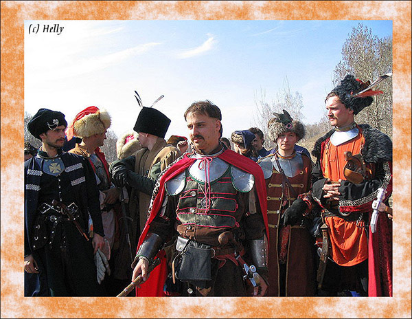
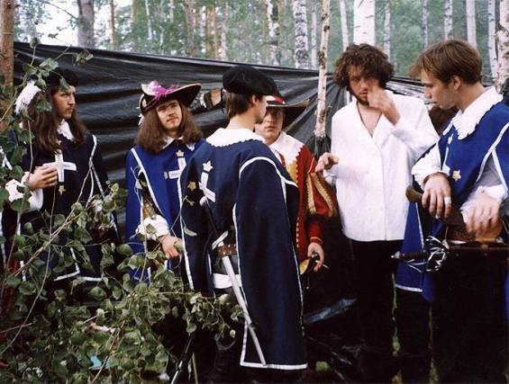
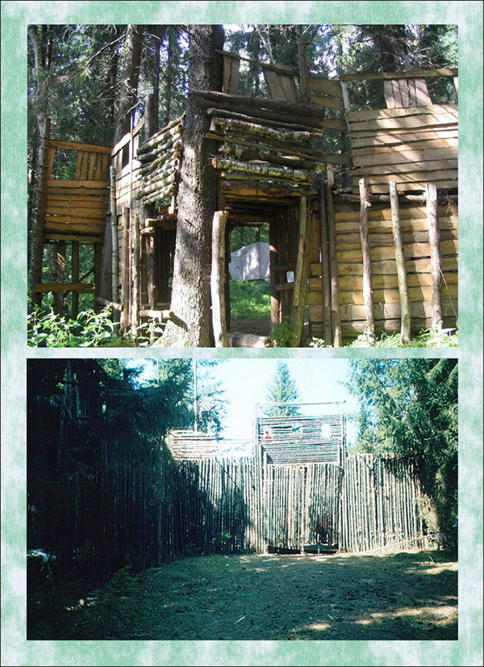

# Ролевые игры живого действия

Ролевые игры живого действия (РЖД) – массовый вид ролевой игры, в которой игроки действуют за вымышленных или реальных персонажей в различных сюжетных обстоятельствах, разыгрывают их в форме свободной импровизации, и совместно создают сюжет игры. При этом, главные аспекты РЖД – живое/физическое взаимодействие (а не чисто вербальное общение, как в настольно-словесных играх), театральный тип отыгрыша ролей, наличие и важная роль игровой атрибутики (костюмов, оружия, доспехов, городов, крепостей и прочих объектов материальной культуры игры). В ролевой игре живого действия, все происходит в реальности – хоть это и игровая реальность со свойственными ей ограничениями и условностями.

## Что это такое? 

Как и все прочие ролевые игры, кроме социально-адаптивных детских ролевых игр, РЖД – хобби, сочетающее несколько ключевых элементов и удовлетворяющее несколько важных потребностей. Главные из них: потребность в самоактуализации, творческой реализации, в общении и ярких впечатлениях. 

Пожалуй, именно живые ролевые игры среди всех РИ (а возможно, среди всех хобби вообще) являются самым высокоорганизованным и сложным видом игровой деятельности, который включает играющих в наиболее комплексный – социально-групповой, соревновательный, творческий, терапевтический и т.д. – процесс. 

По массовости, РЖД далеко не самое распространенное увлечение. Точной статистики не существует, но примерная оценка показывает, что практически любое заметное сообщество (любители авторской песни, байкеры и т.п.) куда больше, чем ролевое. Два других направления ролевых игр (компьютерные и настольно-словесные) неизмеримо более массовые увлечения.

Это легко объяснимо – как компьютерные, так и настольно-словесные игры требуют на порядок меньше ресурсов, времени и сил. Компьютер, диск – и сиди, расстреливай монстров, строй цивилизации. Кубики, компания друзей – и убивай драконов, зачищай подземелья. 

С РЖД не все так просто. Мало того, что на полигонную игру нужно куда-то ехать (порой в другой конец страны), и жить в палатках на природе, в туристических условиях. Но даже если она проходит в родном городе, к игре требуется подготовка, обязательства, которые возьмет на себя не каждый человек. 

Мало кто будет всерьез шить средневековые костюмы, самостоятельно делать историчный доспех (!), тренироваться в клубе или спортзале, закупать туристическое снаряжение, писать мастерам, общаться с игроками, собирать команду и создавать командные традиции, символику, культуру – в общем, тратить месяцы ради 2-3-4 дней игры. Для большинства людей такой подход вообще в диковинку. Впрочем, среднестатистическому гражданину экстремальными кажутся и прочие активные увлечения: дайвинг, «КВН» или альпинизм.

Со временем, число людей, вовлеченных в ролевой движение, растет, качественный уровень обеспечения игр так же возрастает – и постепенно культура РИ живого действия становится понятнее обывателю, налет сумасшествия, неформальства и хипповости с нее исчезает. Это соответствует действительности, потому что в РЖД играют совершенно разные люди. 

Игры, которые проводятся опытными группами мастеров и игроков – временами ярче, чем спектакли государственных театров; эффективнее, чем профессиональные тренинги; увлекательнее, чем хорошие книги; и слаженнее, чем военные учения и маневры. 

Безусловно, у ролевых игр живого действия большие перспективы – в организации досуга детей, подростков и взрослых; в проведении сложных военных учений; бизнес- и социально-ориентированных тренингов; реалити-шоу нового поколения – и т.д.

## Виды РЖД 

Ролевые игры живого действия можно разделить на три типа, различных по месту проведения и, соответственно, по своему формату. Это полевые РИ (полигонные), павильонные (кабинетные) и городские (в том числе, “игры по жизни”).

Для всех видов ролевой игры живого действия, одинаково главное: участники совместно разыгрывают и создают исторической, фантастической, политической или другой сюжет.Всякий раз это новый сюжет, с новыми участниками, событиями, акцентами, поворотами. И даже если игра несколько раз происходит по одному и тому же источнику (по книге, фильму или историческим реалиям), каждый раз получается самостоятельная история, отличная от всех других.

## Процесс ролевой игры живого действия

Если вы до сих пор не представили себе, что такое ролевая игра, и как она происходит – примеры отчетов (т.е. описаний событий с точки зрения участника/персонажа прошедшей полигонной игры). Четыре отчета разных персонажей с одной из первых полигонных игр в России – «Хоббитские Игрища – 1990 г». Первый отчет, второй отчет, третий, четвертый, плюс фотографии с этой игры. А так же, отчеты с игр «Ведьмак: нечто большее» 2005 года (плюс фотографии с игры), «Пути Кармы» 2004 года (плюс фотографии).

## Если вы хотите попробовать

Если вас заинтересовали ролевые игры живого действия, и вы хотите попробовать себя – нужно найти более опытных единомышленников, которые введут вас в курс дела и помогут поучаствовать в полигонной, павильонной или городской игре. 

Для этого, зарегистрируйтесь на форумах популярного игрового портала "Ролемансер", где в разделе "Полевые игры" или "Павильонные игры" можно поискать земляков, разбирающихся в РЖД, и познакомиться с ними, узнать, какие игры планируются в ближайшем сезоне, и кем возможно туда поехать. Так же, очень полезны сайты о живых ролевых играх в России Александр VI, Ролевые игры живого действия. 

Обратите внимание на подборку ссылок, расположенную внизу этой статьи: там есть достаточно русскоязычных ресурсов, которые помогут вам познакомиться с РЖД, и найти друзей, которые проконсультируют вас по интересующим вопросам, и помогут вступить в сообщество ролевых игр живого действия.

## Галерея

Глядя на фотографии с игры, словно смотришь в открытые окна других миров. Что это за люди, какие у них судьбы, к чему они стремятся?.. Воины с игры “Тени Империи” (1998).

Казацкое войско – кто скажет, что эти ребята не настоящие казаки? Игра “Огнем и мечом” (2005) по одноименному роману Г. Сенкевича.

Кельтская мифология оказала огромное влияние на мировую культуру. Яркие и красивые образы были созданы участниками игры по ирландскому фольклору. Павильонная игра “Павия”(2005).

 
Королевские мушкетеры пришли с визитом в Бастилию. «Война и мир» (2003).

 
Крепости, выстроенные специально для игры. Их можно штурмовать и оборонять согласно игровым правилам. Сверху вниз: “Черный отряд” (2006) и “Хоббитские игрища”(2002).

 
Достоверно и артистично сыграть можно даже совершенно фантастических персонажей. Тяжелый боевой киборг, игра «Киберпанк» (2001).

 
Огнедышащий Дракон. Те, кто видели его воочию, говорят, что это было жуткое и завораживающее зрелище. Но даже на фотографии видно – красиво и страшно. Игра «Его Величество Дракон» (2005).
