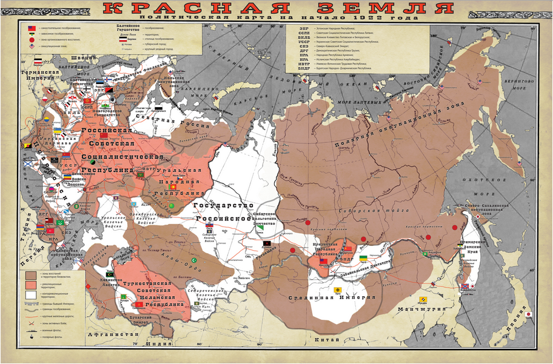
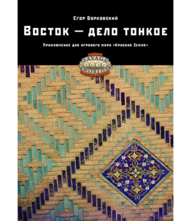

# Красная земля

|   |
|---|
|| 
|Логотип авторской группы «Штабъ Духонина». Автор: Андрей Ермоленко |

«Красная Земля» — это игровой мир по альтернативной истории Гражданской Войны России 1918—1923 г., созданый для игры по правилам «Дневника Авантюриста». Авторский коллектив — «Штабъ Духонина» (Егор Борковский, Константин Трофименко, Михаил Шалупаев, при участии Ивана Янькова) — работал над игрой более трех лет, начав с публикации дизайн-документа «Красной земли» и короткого модуля «Вороний Грай» в 2009—2010 годах, после чего в 2012 году на сайте «Студии 101» появилась первая версия основной книги правил и другие материалы по игре. Персонажам игроков предлагается выступить в роли жителей и гостей России времён 1920-х годов, Гражданская война в которой так и не прекратилась из-за вмешательства сверхъестественных сил.

## Возникновение «Красной земли»

В октябре 1919-го Вооружённые силы Юга России (ВСЮР) под командованием Деникина прорвали Южный Фронт большевиков и вышли к Москве. Одновременно под ударами сил Колчака рушился Восточный Фронт, и столица Советской России стала уязвима для удара в тыл. Казалось, провозглашённая большевиками Российская Советская Социалистическая Республика (РССР) неминуемо должна пасть, но в ночь с 31 октября на 1 ноября, во время решающего штурма Москвы, мир изменился. Большинству людей до сих пор неизвестно, чьи действия и ритуалы были тому причиной, но в ту ночь грань между мирами материи и духа, мирами живых и мертвых нарушилась. Скошенные пулями красноармейцы вставали и вновь шли в бой, а большевистские комиссары рвали своих врагов на куски, черпая силу в багровом зареве, нависшем над городом. Позже этот переломный момент стали называть Переломом.

|   |
|---|
|.png)  | 
|Мёртвые всадники четырёх движений с обложки книги «Красная земля». Иллюстрация Андрея Ермоленко.   |

Неудача под Москвой рассорила белых между собой. Сибиряки обвиняли в неудачах «южан», деникинцы — колчаковцев , в итоге Красной Армии удалось начать контрнаступление, после которого на всех фронтах установилось позиционное равновесие. Юг России в 1920 году перестал признавать власть Верховного Правителя (Колчака), и объявил себя независимым государством Новороссией, а ВСЮР были переименованы в ВСН — Вооруженные Силы Новороссии. На сегодняшний день это одна из самых боеспособных белых армий. Наиболее яростное, но безрезультатное противостояние между силами Красной Армии и ВСН наблюдается в окопах и блиндажах Царицынского Фронта.

В 1921 году полномочные послы мировых держав и делегаты новых государственных образований, расположившихся на территории бывшей Российской Империи собрались в Одессе на мирную конференцию, посвященную определению статуса Одессы, как вольного города, урегулированию конфликтов и определению новых границ между сторонами-участницами. Советские правительства не признали результатов конференции, однако весь 1921 год прошел в относительном мире, впервые за семь лет Великой и Гражданских войн. Персонажи игроков начинают действовать в «Красной земле» в 1922 году.

## Государственные образования

|   |
|---|
|    |
|Карта Красной земли.   |

На момент начала игры в составе «Красной земли» состоят свыше 20 государственных образований, имеющих республиканское,  диктаторское, демократическое либо анархическое устройство. Руководство государств принадлежит к тем или иным партиям, представленным в Российской империи на момент ее крушения: большевикам, меньшевикам, социалистам-революционерам, конституционным демократам, анархистам, монархистам. Также часть территорий управляется командующими оккупационных сил великих держав — Великобритании, США, Японии.

Наиболее крупными государствами являются большевистская Советская Россия, белые Новороссия под управлением генерала барона Врангеля и Российская Держава Верховного правителя Колчака, национал-монархическая Украинская держава гетмана Скоропадского , «красные» Украинская народная, Уральская и Дальневосточные республики, управляемые коалиционными правительствами из представителей различных партий.

Перемещения между государствами сопряжены с рядом сложностей — многие из них находятся в состоянии войны друг с другом, практически каждое имеет собственную валюту и удостоверения личности, а службы безопасности с великим рвением занимаются поиском шпионов и диверсантов противника. Кроме того,  по всей Красной земле активно действуют всевозможные повстанческие армии, революционные дивизии, анархические батальоны, банды и шайки, которые вовсе не признают над собой никакой власти.

## Сверхъестественное

Сверхъестественное было в моде в начале XX-го века. Начав с относительно безобидных спиритических сеансов популярных в среде интеллигенции и дворянства, и закончив скандальными оргиями с питием крови богемы и миллионеров-нуворишей, о которых с упоением писала пресса, казалось, что Россия входит в новую эру — эру раскрытия древних тайн и открытия неизвестных человеческих возможностей.

Однако лишь в момент Перелома потусторонний мир слился с миром реальным, а рациональные умы оказались бессильны в поисках причин наблюдаемых сверхъестественных явлений, как в силу их массовости, так и по причине невероятности происходящего. Новый мир шокировал — повсюду поднимались непогребённые мертвецы, материализовывались бесплотные духи, оживали чудовища древних легенд и реализовались самые смелые мечты молодых ученых. А оккультисты всех орденов и традиций с ужасом и восторгом почувствовали, что их формулы призыва, молитвы и наговоры наполняются великой потусторонней силой.

В 1922 году никого уже не удивишь магией и колдовством, восстаниями живых мертвецов и бродячим лешим. В том или ином виде сверхъестественное встречается во всех государственных образованиях, а Советская Россия и многие другие строят с его помощью новое будущее, отрекаясь от старого мира.

## Движения

После перелома магия пронизала собой все аспекты деятельности жителей Красной земли, и в первую очередь она проникла в политику. И видные оккультисты, и простые граждане со всей очевидностью наблюдают четыре аспекта сверхъестественного, проявленных в реальности, данной им в ощущениях, или как их еще называют — Движений.

|   |
|---|
|  | 
|Чёрно-зелёные анархисты дикого поля с обложки бесплатного приключения «Наш паровоз вперед лети». Иллюстрация Евгения Пирогова. |

* **Белое движение** воплощает в себе принципы традиции, иерархии и порядка и объединяет вокруг себя «бывших людей» — офицеров царской армии, буржуазию, гимназистов и юнкеров, дворян и духовенство.
* **Зелёное движение** материализует самые древние и могучие языческие верования и суеверия, сохранившиеся в глубинах народной памяти. Зажиточные крестьяне — становой хребет России — являются основными членами этого движения.
* **Чёрное движение** разделяет идеи гностических мистиков античности и «чистых христиан» средневековья — богомилов, вальденсов и катаров, верящих в изначальную порочность тварного мира и считающих его творца абсолютным злом. В Красной земле на стороне черных стоят анархические матросы Кронштадта, террористы тайных оккультных братств Советской России, атаманы банд Дикого поля и члены организованных преступных группировок Одессы.
* **Красное движение** — движение рабочего класса и его авангарда — Российской социал-демократической партии большевиков. Беднейшие слои крестьянства, казачества и инородцев являются союзниками красных, а члены прочих движений — его непримиримыми врагами. Массовость и эгалитаризм — вот основные признаки этого движения.

Егор «Lord Of The Hunt» Борковский рассказал о Движениях:

>   Я считаю Движения наиболее удачной фишкой сеттинга, придавшей ему законченный вид. Хотелось обыграть тему, что различные идеологии, независимо от ценностей, которые они декларируют, разрушают личность тех, кто им осознанно или неосознанно следует. Это действительно довольно мрачная идея, и в первоначальных планах у нас было создать дополнения, показывающие, каким образом персонаж может избавиться от их влияния и вновь обрести человеческое достоинство. Но это была бы уже совсем другая игра, уводящая от первоначального жанра боевика куда-то в сторону психодрамы.
>
>   Почему четыре? Мы разбросали имеющиеся в игре на тот момент архетипы персонажей по группам, и их получилось как раз столько. Кроме того, красное, белое и зелёное движение исторически существовали во время Гражданской Войны. Мы дополнили их мистическим наполнением и добавили к ним Чёрное, потому что некоторые образы не вмещались в остальные три.

## Жанры игры по «Красной земле»

Большинство представленных «Штабомъ Духонина» материалов подразумевают игру в сеттинге в жанре «мистический истерн». Например, Егор «Lord Of The Hunt» Борковский писал о жанре игры:

>   Красная Земля имеет три основных черты: альтернативная история с магией как атмосфера; треш-истерн как основной жанр и огромный масштаб сеттинга (мы не могли сказать о Совроссии и не сказать о Сибири). Из-за этого мы не могли написать просто примитивное вступление. Нужно, во-первых, обозначить стиль, во-вторых, описать историю и события, в-третьих, описать всю огромную территорию Красной Земли. Сам стиль сеттинга предусматривает сочетания серьёзного и несерьёзного, это чистой воды постмодернизм.

В интернет-дискуссиях несколько раз поднимался вопрос разъяснения термина «треш-истерн», в жанре которого авторы предполагали проведение игры. К сожалению, однозначного определения до сих пор получено не было. Однако, если взглянуть на рекомендованные кинофильмы и литературу, а также цитаты авторов, можно с осторожностью предположить, что под «треш-истерном» (и, видимо, «мистическим истерном») авторы понимают «исторический истерн» с элементами комедии, трагедии, пелевинской абсурдно-постмодерновой мистики.

Помимо жанровой принадлежности, предлагаемые авторами сюжеты делятся по уровням понимания персонажами игроков мистической подоплёки идущей Гражданской войны и вовлечённости их в те или иные Движения.

* **Массовый уровень.** На нижней ступени пирамиды находится подавляющее большинство населения. Оно ничего не знает о том, как устроен мир, и не может повлиять на него. Этими людьми командуют вышестоящие силы, направляя их по своему желанию. При этом у людей вполне может быть иллюзия, что во всех процессах они участвуют по своему собственному желанию, а не под чужим контролем.
* **Политический уровень.** На следующей ступени иерархии стоят все известные институты политической власти: государства, политические партии, правительства и пр. На этом уровне персонажи могут оказывать ограниченное влияние на мир Красной Земли. Им теперь доступны не только собственные ресурсы, но и ресурсы партии.
* **Тайный уровень.** Перелом сделал магию очевидной и доступной многим, но она была в мире и до него. Издавна существовали объединения людей, обладающих сверхъестественными способностями. Они стояли за тронами, с помощью магии и тайных манипуляций управляя царями, военачальниками, народными вождями. Персонажи Тайного уровня оказывают огромное влияние на игровой мир.
* **Метафизический уровень.** На самой вершине пирамиды находятся не люди. Её занимают таинственные и зловещие обитатели Иного мира. Четыре враждующих племени духов проникли в мир людей после Перелома и теперь делают всё возможное, чтобы изменить его в удобную для себя сторону.

## Изданные материалы

|   |
|---|
|   |
|Обложка приключения «Восток — дело тонкое».    |

В настоящее время для игры изданы в электронном виде следующие тексты:

* «Красная земля» (авторы Е. Борковский, К. Трофименко, М. Шалупаев, при участии И. Янькова, вёрстка и оформление М. Шалупаев, редактор и корректор А. Гастева) — игровой мир для настольной ролевой игры «Дневник авантюриста».
* «Красная Земля: тест-драйв. Наш паровоз, вперёд лети…» (вёрстка и оформление М.Шалупаев) — бесплатное вводное приключение с описанием правил «Дневника авантюриста», примерами персонажей и раздаточными материалами.
* «Восток — дело тонкое» (автор Е. Борковский, вёрстка, оформление и картография М. Шалупаев) — приключение для игрового мира «Красная Земля».
* «Однажды на Юге. Вороний грай» (авторы К. Трофименко, И. Серкин) — тестовый модуль для сеттинга Красная Земля, написанный для конкурса Зимний Кашевар-2010, проведённый Лабораторией Настольных Ролевых Игр.
* Дизайн-документ сеттинга (авторская группа Штабъ Духонина).

Вспомогательные материалы (авторская группа Штабъ Духонина):

* Колода действий «Красная земля»
* Лист персонажа игрока 
* Двухстраничный лист персонажа игрока.
* Пример нескольких страниц из книги «Красная Земля».
* Подробная карта Красной Земли.
* Справочник гособразований.
