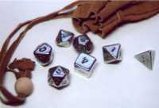
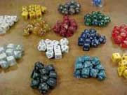
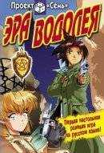
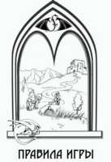
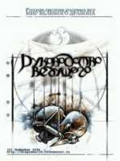

# Принципы, мифы и действительность
	
Настольные ролевые игры (RPG — roleplaying games) — одно из самых популярных интеллектуальных развлечений во всем мире. Миллионы людей разных возрастов на всех континентах посвящают ему несколько дней в месяц. Ролевые игры позволяют участникам попасть внутрь любимых фантастических миров или создать собственные вселенные, оказаться в роли знаменитых персонажей и повторить (или превзойти) их подвиги.

Полагаю, практически все любители фантастики и фэнтези слышали о существовании настольных ролевых игр. Таких как Dungeons & Dragons, Vampire The Masquerade или отечественная "Эра Водолея". Но далеко не все читатели представляют себе, как выглядит сам процесс игры.

Из нашей статьи вы узнаете, что такое настольная ролевая игра, в чем заключаются ее цель и особенности, что необходимо для того, чтобы принять в ней участие, и каковы роли игроков и ведущего. Наконец, вокруг ролевых игр и игроков сложилась масса мифов и заблуждений. С ними мы будем бороться по ходу повествования.

## Что это такое?

Если попытаться в двух словах рассказать о том, что же такое ролевая игра, то у нас получится следующая аналогия. Возьмем для примера любой фантастический роман или кинофильм. Представьте себе, что вы оказались на месте главного героя (о чем с детства мечтали) и должны сами решить, что говорить и какие благородные поступки совершать. Вы сами устанавливаете цели и стремитесь их достичь.

Любым поступком вы повлияете на общий сюжет кинофильма или книги. Если вы будете действовать неосмотрительно, то, скорее всего, вам не удастся выполнить поставленную задачу. Вполне возможно, что при этом вы поставите под угрозу свою и чужие жизни — ведь мы взяли в качестве примера фантастический сюжет, полный опасностей и загадок.

В подобную атмосферу погружается участник ролевой игры, оказываясь внутри приключения и своими решениями определяя судьбу героя и выдуманного мира.

### Миф первый
#### "Эльфы" с деревянными мечами

О ролевиках в массовом сознании сложилось не самое адекватное представление. А именно такое: юные люди воображают себя эльфами, бегают в драных плащах по Нескучному саду и колотят друг друга деревянными палками, которые называют мечами.

Дело в том, что вышеописанное относится не к ролевым играм вообще, а к живым (или полевым) ролевым играм, причем в их обезображенном, искаженном виде.

Многие полагают, что участники полевых, настольных и даже компьютерных ролевых игр — это одно и то же. Точно так же можно заявить, что футболисты, шахматисты и автогонщики — явления одного порядка (мол, все они спортсмены).

А потому не стоит мешать в общую кучу толкинистов, полевщиков, настольщиков и прочих геймеров и членов Клуба любителей фантастики. Большинство поклонников настольных ролевых игр никогда не участвовали в "полевках" или битвах в Нескучном саду. Я больше семи лет играю в настольные RPG и при этом ни разу не держал в руках деревянного меча (хотя не вижу в фехтовании на мечах ничего постыдного). Честно! И хватит об этом.

## Уникальный жанр

У настольных ролевых игр есть ряд особенностей, который отличает их от всех прочих видов интеллектуальных игр: карточных, логических, военно-тактических и др.

Во-первых, ролевая игра не может состояться без ведущего. Если в других играх ведущий часто исполняет роль пассивного наблюдателя и судьи, то здесь он является основным действующим лицом, организующим команду игроков. Ведущий ответственен за развитие игрового мира.

Во-вторых, в ролевых играх не бывает победителей. Ведь участники играют не друг против друга, а все вместе в одной команде (за исключением ведущего). Цель команды — выполнить определенную задачу, изложенную в сценарии, все подробности которого известны только ведущему. Можно сказать, что игроки сообща играют против ведущего, хотя это будет не совсем правильно. Скорее, они играют против сценария, стремясь преодолеть описанные трудности и вместе достичь цели.

В-третьих, ролевая игра — захватывающий творческий процесс. Можно смело утверждать, что из всевозможных игр именно данный вид заставляет участников в наибольшей мере проявить творческий потенциал. Каждый игрок — создатель, автор персонажа, который может влиять на игровой мир и действия прочих персонажей.

|В ролевых играх используются специальные игральные кости с разным числом граней, от 4 до 100! Подобные геометрические шедевры уже можно приобрести во многих крупных отечественных магазинах игрушек. Ну, а некоторые фанаты специально заказывают кости из полудрагоценных камней (справа).|
|---|
| | 

В-четвертых, у ролевых игр отсутствует один важный недостаток, имеющийся у всех прочих игр. Любая игра может наскучить, но только не ролевая игра. Ролевые игры обладают огромным простором для фантазии и воображения, практически неограниченными возможностями. Если вам наскучит ваш персонаж, просто создайте нового героя. Если надоест фантастический мир далекого будущего, смените его на сказочный мир средневековья. Игрок может стать ведущим, а ведущий — игроком. Наскучить может лишь сценарий, но не сама игра.

Отсюда следует и пятая своеобразная черта ролевой игры — в нее можно играть бесконечно долго, единственным пределом являются фантазия и воображение. Если команда игроков успешно завершила одно приключение, то она сразу может начать новое, если ведущий к этому готов и припас еще один интересный сценарий.

## Снаряжение ролевика

Необходимые для игры компоненты — шестая оригинальная черта ролевых игр. По существу, для того, чтобы состоялась игра, достаточно иметь несколько чистых листов бумаги, ручку или, предпочтительнее, карандаш (чернильные записи замучитесь стирать), ластик, игральные кости (они служат для расчета вероятностей и нужны в большинстве ролевых игр) и копию правил игры. Ведущий также должен иметь при себе сценарий приключения, неважно, в каком виде: купленный официальный сценарий, рукописную тетрадь с собственным творением, краткий план игры на нескольких отдельных листах.

Это все. Указанных компонентов достаточно, чтобы играть. Никаких карт, полей и фишек вам не понадобится, хотя в ходе игры вы сами можете ощутить необходимость в других компонентах: например, некоторые считают удобным записывать показатели персонажа на специальном бланке, другие предпочитают использовать фигурки при расчете исхода сражений и т.д. Но, повторимся, бумаги, карандаша с ластиком, игральных костей, книги правил и сценария вполне достаточно для настольной ролевой игры.

### Миф второй
#### Удел недорослей и неудачников

"Настольные ролевые игры — забава для детей, для студентов-недоучек, для людей, которые не наигрались в детстве", — такое мне тоже не раз доводилось слышать. Утверждение, что "серьезные люди не играют в RPG", так же нелепо, как заявление, что "серьезные люди не ходят на рыбалку".

Ролевые игры — это вполне распространенный вид хобби. Никого не удивляет, что люди собираются по воскресеньям поиграть в футбол, сходить в джаз-клуб или, опять же, отправляются удить рыбу.

Ролевики есть среди всех слоев населения. Мне доводилось играть в настольные ролевые игры как со студентами, сисадминами и милиционерами, так и с топ-менеджерами, и с владельцами собственных компаний.

## Игрок и роль

Каждый участник ролевой игры управляет одним персонажем. Игрок полностью отвечает за действия и поведение персонажа, а также за решения, которые его персонаж принимает в игре (фактически решения игрока становятся решениями персонажа). Если персонаж сталкивается с трудностями, опасностями или загадками, игрок должен сам придумать, как справиться с делами и разрешить возникшие у персонажа проблемы. Поскольку ролевая игра, как правило, связана с увлекательными приключениями, управлять персонажем и принимать за него сложные решения всегда интересно. Однако это лишь часть удовольствия, которое может доставить игроку ролевая игра.

Ролевая игра получила свое название из-за того, что каждому ее участнику приходится исполнять роль определенного персонажа. Поэтому участие в ролевой игре сродни актерскому ремеслу. Действительно, если вы оказываетесь в шкуре персонажа из любимой книги или киноленты, вы должны задуматься и о передаче образа этого человека: его мыслей, чувств, мотиваций, эмоций и т.д.

Каждый игрок должен понимать, что в приключении участвует не он сам, а его персонаж. Обычная ошибка начинающих ролевиков — отождествление себя и игрового персонажа.

|Для игры можно собраться как дома у приятеля, так и в специальном клубе. Подобные клубы уже есть в России. |
|---|
| |

Умение вживаться в роль, реагировать на происходящее так, как реагировал бы на них подлинный персонаж, в ролевой игре принято именовать отыгрышем. Качество отыгрыша напрямую зависит от того, насколько хорошо игрок понимает своего персонажа, чувствует его цели и знает его биографию. Красивый и продуманный отыгрыш создает объемный, впечатляющий образ героя приключения и доставляет удовольствие не только игроку, вжившемуся в роль, но и всем участникам игры, потому что он добавляет ей чувство реальности происходящего.

### Миф третий
#### Наркотическое средство от реальности

Миф третий является развитием идеи мифа второго. Критики ролевых игр часто используют термин эскапизм (от "escape" — спасаться, убегать), который расшифровывается как "бегство от реальной жизни".

Подразумевается, что ролевые игры предоставляют возможность "уйти в иное измерение", избежав проблем повседневности. Игры представляют как своеобразный психологический наркотик.

Я же отвечу, что ролевые игры — действительно форма эскапизма. Но не более опасная, чем чтение фэнтези. Чем просмотр кинофильма. Чем треп по телефону. Читая эту статью, вы, уважаемый читатель, также практикуете эскапизм.

Все это — формы отдыха, не более того. Отдыха не от реальности, а от суеты.

## Команда и сессии

Само собой разумеется, что ролевая игра — развлечение не для одного человека, а для команды. Обязательно наличие одного ведущего и, как минимум, одного игрока. Оптимальной командой обычно считают группу из четырех-пяти игроков. Команду иногда именуют "партией", по аналогии с английским словом party — "команда".

|Гари Гигакс, первый в мире ведущий ролевой игры. В 1973 г. он вместе с Дейвом Арнесоном придумал Dungeons & Dragons, первую RPG.   |
|---|
|  | 

Игра начинается с создания персонажей, которую (в немалой мере благодаря компьютерным играм) давно именуют "генерацией" (от "generation" — создание). Каждый игрок должен получить такого героя, какого он хочет. Разумеется, особенности и черты персонажа не должны противоречить особенностям мира или будущего приключения.

Собственно, сам процесс игры, то есть приключение, занимает как минимум несколько игровых часов. Часто длинные приключения невозможно "пройти" за один вечер, поэтому игру принято разделять на несколько встреч, и каждая такая встреча, которая может длиться от двух часов до целого дня, называется игровой сессией. Некоторые приключения могут быть завершены за двух- или трехчасовую сессию, а эпические саги могут потребовать десятков сессий, что будет означать несколько месяцев игры (при условии, что играется одна сессия в неделю).

## Ведущий — главный игрок

Ведущий в различных ролевых играх именуется по-разному. Наиболее распространенными вариантами являются термины "мастер", "рассказчик" или аббревиатуры GM или DM (game master и dungeon master, соответственно). Ведущий — главный участник игры, поэтому он обязан хорошо разбираться в правилах.

Ведущий — это глаза и уши игрока, именно благодаря ему игроки узнают, что их персонажи видят и слышат в игровом мире. По существу, ведущий тоже занимается "отыгрышем", только, в отличие от игрока, ему приходится отыгрывать весь окружающий мир, в котором происходит приключение. Он выносит все решения, связанные с реакцией мира на действия персонажей, основываясь на логике, интуиции, трактовке бросков игральных костей и, главное, на письменном сценарии приключения.

Сценарий — это не просто повествование, подобное любому художественному произведению. В сценарии не записаны фразы, которые говорят герои, а также не обозначены их действия, так как за героев целиком отвечают игроки. Сценарий не просто повествовательно описывает ход приключения, но и предусматривает возможные варианты его развития, зависящие от того, как именно поступят герои в определенной ситуации. Таким образом, сценарий содержит множество сюжетных развилок и дробится на массу эпизодов. Некоторые из эпизодов могут никогда не произойти, если поступки героев не приведут к их возникновению.

Например, возьмем следующий отрывок из сценария. Он предполагает, что герои подошли к утесу и должны забраться на него, дабы получить информацию от таинственного отшельника, живущего на его вершине. Герои могут попробовать взобраться на отвесную скалу (что сложно, но можно), обойти гору со всех сторон и обнаружить узкую тропу наверх, или просто отказаться от рискованной идеи влезть на скалу и возможности получить полезную, но необязательную информацию. Каждый вариант рассмотрен в сценарии отдельно (например, при подъеме по тропинке герои могут встретить гнездо ядовитых змей), причем, если герои полезут наверх по отвесной скале, ведущему не понадобится эпизод с тропинкой, а если они откажутся от идеи подняться на гору — то и эпизод с отшельником...

Конечно, ни один сценарий, будь он объемом даже с "Войну и мир", не способен предугадать все возможные действия героев. В упомянутом отрывке герой мог бы использовать заклинание полета (если действие происходит в фэнтези-мире) и обойти все предложенные сценарием варианты. Если герои совершают действия, не предусмотренные в тексте сценария, то ведущий выносит свои решения о том, что произошло в итоге, основываясь на логике развития событий.

Вести приключение — серьезная творческая задача. Ведущий не только должен хорошо представлять себе окружающий героев мир, но играть за всех персонажей, которых встретят персонажи игроков в данной истории. Это означает, что он должен проникнуться целями и мотивациями этих персонажей, и ясно представлять себе их образы.

|На настоящий момент две единственных изданных в России ролевых игры: "Эра Водолея" и "Искусство волшебства".   |
|---|
| | 

Сам сюжет сценария и его развитие находятся в полной власти ведущего. Сценарий, используемый ведущим, может быть написан им самим, другим ведущим или куплен, если это официальное приложение к игре. Главное, в чем должен быть уверен ведущий — это то, что он волен как угодно изменять сценарий и даже основательно переделывать его, если очередная сыгранная по нему сессия направила сюжет приключения в не предусмотренное текстом русло.

Ведущий — руководитель игры. Любое его решение является законом, и они не оспариваются игроками во время сессий.

### Миф четвертый
#### Огромная трата времени и денег

Некоторые люди, никогда не игравшие в ролевые игры, утверждают, что на это хобби тратится гигантское количество времени и денег. Что талмуды правил, которые необходимо изучить, весят десятки килограммов. Что на одну партию в ролевую игру нужно потратить несколько дней. Все сказанное — это преувеличение, полуправда.

Одна игровая партия (цель которой — пройти приключение до конца) действительно, может занимать десятки часов. Но ее никогда не играют за один день: можно делать столько перерывов (на день, на неделю, на месяц), сколько вы захотите — виртуальное приключение от вас не убежит.

Полные справочники по какой-либо ролевой игре, действительно, могут насчитывать сотни томов и сотни тысяч страниц. Но для игры достаточно прочесть лишь базовые правила. Например, стартовая версия популярной системы GURPS занимает всего 16 страниц. Все остальные книги — это различные дополнения и расширения, большинство из которых никогда вам не пригодятся. Зато пригодятся кому-то еще. Кстати, книги о стратегии шахмат куда многочисленнее пособий по ролевым играм, но это никого не удивляет.

Что касается "гигантской траты денег" — то это и вовсе ложь. Интернет наполнен бесплатными ролевыми системами. Не желаете тратить 200-600 руб. на книгу правил — используйте бесплатную систему. А, кроме правил, ничего дорогостоящего для игры не понадобится, о чем уже сказано в этой статье.

## Система правил

Все персонажи ролевых игр (и те, в роли которых выступают игроки, и те, за которых играет ведущий) обладают особым набором показателей, к каждому из которых приписано определенное числовое значение. Об этом вы прекрасно осведомлены, если когда-либо играли в компьютерные ролевые или стратегические игры.

К этим показателям игроки часто обращаются в ходе игры для того, чтобы определить, удалось ли очередное действие персонажа.

Зачем нужно такое количество цифр и таблиц, сразу бросающееся в глаза при пролистывании книги правил любой ролевой игры? Дело в том, что далеко не каждое действие персонажа может однозначно трактоваться ведущим. Если персонаж заявляет, что он бросает камень в голову гоблину, то ведущему не удастся решить, основываясь на чистой логике действий, попал ли этот камень в цель. Попадание зависит не только от размера головы, расстояния и видимости, но также и от силы персонажа, его меткости и даже от ловкости гоблина! Числовые показатели, описывающие силу и меткость, помогут разрешить ситуацию.

|"Мир Великого Дракона" — бесплатная русская фэнтезийная настольная RPG, распространяющаяся через интернет. Ищите на компакт-диске. |
|---|
  | 

Кроме того, в большинстве событий приключения большую роль играет случай. Один и тот же персонаж, бросая с одного расстояния один и тот же камень все в то же окно, будет то попадать, то промахиваться. Помимо перечисленных факторов, в расчет придется принять и волю случая. Для этого в ролевой игре потребуются игральные кости — их бросок и отразит случайный фактор в формуле, по которой подсчитывается результат действия.

Иногда ведущий может отказаться от применения каких-либо формул, просто постановив, что данное действие было удачным или, наоборот, неудачным. Действительно, и пятилетний хоббит сможет поднять с земли небольшой камень, а вот сдвинуть с места многотонный звездолет не под силу целой роте имперской пехоты.

Набор показателей и способ их использования различается в разных ролевых играх. Собственно, правила ролевой игры и представляют по большей части описание взаимодействия этих показателей. В них входят таблицы, точные формулы расчета и т.д., что в совокупности именуется игровой системой. Игровая система, особая математическая модель — главное, чем различаются ролевые игры.

## Миллионы миров на одной полке

Другое важное отличие ролевых игр — это игровые миры. Ролевая игра может погрузить своих участников в реалии совершенно непривычного мира, и в этом состоит значительная часть интереса к RPG. Существует множество игровых миров, в которых игрокам придется отыгрывать персонажей-аборигенов. Если мир происходит из фэнтези, то персонажи, скорее всего, будут эльфийскими магами и гномьими воинами. Если же наш мир — далекое будущее, то и герои станут пилотами межгалактических кораблей и пришельцами негуманоидных рас.

Миров ролевых игр, как вы догадываетесь, существует бесконечное множество. Любой ведущий может использовать известный "официальный" мир разработчиков ролевой игры. Или создать свой собственный мир, непохожий на другие.

|На Западе уже давно выходят специальные журналы, полностью посвященные настольным RPG. Главный из них — американский “Dragon”. |
|---|
|    | 

Если говорить об "официальных" мирах, то нужно отметить, что они покрывают практически весь спектр приключенческой литературы (фантастика, фэнтези, детектив, шпионский боевик, мистический хоррор и т.п.) и предлагают варианты на любой вкус: водяной мир планеты-океана, Земля после ядерной войны, альтернативная история средних веков, первобытное человечество ледникового периода и т.п. Известным мирам литературы и кино также посвящены ролевые игры: существуют игры во вселенных "Звездных войн", "Властелина Колец", "Зова Ктулху", "Колеса Времени", "Звездного Пути"...

### Миф пятый
#### Игра для единиц

У нас в стране почему-то принято считать, что ролевиков очень мало. Поклонников RPG считают членами какой-то немногочисленной касты.

Как бы вы ни относились к статистике ("Есть правда, есть ложь, а еще есть статистика"), но лишь она может служить аргументом в данном случае. Итак...

По данным компании Wizards of the Coast (крупнейший в мире производитель ролевых игр), в Dungeons & Dragons (самая популярная в мире RPG) регулярно играет около 30 миллионов человек. Это данные только по 50 с лишним странам, где официально продается эта игра. Кстати, D&D издана почти на 20 языках, и скоро к этому числу добавится русская редакция.

Заметьте, что это информация по одной-единственной настольной ролевой системе!

Что касается России, то здесь ситуация менее определенная. Объективную статистику собрать очень тяжело, возможно, будущие опросы "Мира фантастики" помогут нам в этом. Пока же можно констатировать, что интернет-портал "Ролемансер" (крупнейший русский ресурс, посвященный преимущественно ролевым играм) ежедневно посещает около 6000 человек.

----

Надеюсь, вы разобрались с тем, что есть в ролевых играх и чего там нет. Принципы игры теперь ясны, а мифы — развеяны.

После этого возникает логичный вопрос: "Я хочу играть в настольную RPG — так куда мне обратиться и с чего начать?". Начать стоит с поиска единомышленников и чтения книги правил (купленной в магазине или скачанной из интернета).

А как искать единомышленников и какая ролевая система вам более всего подойдет? Об этом мы расскажем на страницах "Мира фантастики" в ближайших номерах. Пока же позвольте переадресовать вас на крупнейший русский ролевой сайт www.rolemancer.ru. Несколько бесплатных настольных ролевых систем вы найдете на компакт-диске журнала.
