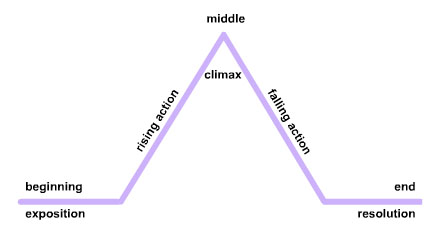

# Quick Story Framework

I am in the car on my way home from Thanksgiving at my parent’s house. It is
the second leg of the trip, and I am now a passenger. We are due home in about
two hours, just in time for me to run Scum & Villainy for my Sunday evening
group. That was when the text came in.

I am not feeling well. I need to waive off tonight.

Blown Session. Time to initiate Blown Session Protocol.

I texted the other players in my group, and everyone wanted to play something;
a backup game. That was fine. I had just finished reading Beach Patrol, and I
was down for some Baywatch action. The only thing is, I had no session prepped.
The book had an adventure idea generator, but it comes up with a premise, which
is good, but I also needed a bit more structure in terms of scenes, beats, etc.

So I opened my phone, clicked on OneNote and started writing some quick session
notes, using a pretty standard story framework that is my go to when I am
improvising games.

## What is a Story Framework?

A story framework is a narrative structure, a formula of sorts, that tells a
story. Which means that it has a start, a middle, and an ending, as well as
some number of scenes. It is not an actual story but rather a framework that
you can adapt to create a story, or in this case a gaming session.

Plotmountain There are numerous frameworks for stories but the one that most
people who were educated in the US know is Freytag’s Pyramid.

This is a simple structure but very effective. Basically, the story starts,
some things happen to build up to the climax, and then things start to resolve
in the wake of the climax, and the story ends.

If you want to really jump into the rabbit hole when it comes to plot
structures, check out Plotto by William Cook.

## Using a Story Framework

So what is the deal with story frameworks? It has to do with prepping sessions.
When we prep a session, we use some kind of framework to lay out our encounters
and how the plot of the session will unfold.

So if you are doing traditional prep, this often takes the form of an outline.
We sit down and outline how we think the session will go, and then write our
notes. Often when we are doing this, we are using some kind of framework either
intentionally or unintentionally.  These frameworks make prepping your game
faster because they are known structures that you can employ.

Where these frameworks really shine is when you are doing a low/no-prep game.
Because if you know one or more of these structures, you can quickly come up
with a session on the fly, using the structure to give some shape to your
session. Often what I do, when I run a no-prep game such as Action Movie World
or Beach Patrol, is that I use a framework to write myself a quick outline in
my notebook or on an index card, as the players are making characters. This
then gives me an idea of where my game can go, which helps when you are
improvising, because you have some idea of where the story can go — making your
contributions to the story more focused.

## My Go-to Framework

The framework that I have committed to memory, and the one that I use the most
when I am improvising sessions, is this:

1.  Opening to show how cool the characters are
1.  Introduce the Problem
1.  Goal 1
1.  Goal 2
1.  Goal 3 (optional – based on time)
1.  Showdown
1.  Aftermath

In this structure, there are multiple goals that the players must achieve in
order to be able to confront the cause of the problem in the showdown (climax).

Quick Example:

It’s a game of Rockerboys and Vending Machines and the characters are trying to
extract a Singer from a nightclub. So my outline would be:

1.  Opening scene at their home bar where they get the job
1.  Problem: Scouting the Nightclub
1.  Goal: Getting into the Nightclub
1.  Goal: Getting past security to get to the back of the nightclub
1.  Goal: Getting to the Singer to extract her
1.  Showdown: Extraction & Opposition
1.  Aftermath: Delivering the Singer and getting paid.

That right there is all I need for a few hours of play. Now when it comes to
running the game, we may deviate wildly from this initial outline, but at least
I had a starting point for the game.

## Elaborating on the Framework

So I am in the car with two hours until I get home, so I have some time to work
up a slightly more complex story for Beach Patrol. So, I take the basic
framework but I decide to have two plots going on during the session.

A-Plot: A calendar photo shoot is taking place on the beach and creating issues.

Possible encounters:

* A model that can’t swim
* Heavy crowds watching
* Stalker following one of the Models
* Dangerous shooting setup that endangers beachgoers

B-Plot: A new version of Ecstasy has hit the beach and is causing a lot of
teens to get into trouble.

Possible encounters:

* Drowning victim
* Sex on the beach
* User falling off the cliff in Lovers Cove
* Drug deal going down on the beach

Then I adapt my standard framework a bit to look like this:

1.  Opening: Briefing at HQ
1.  Goal: A-Plot encounter
1.  Goal: B-Plot encounter
1.  Goal: A-Plot encounter
1.  Goal: Resolve B-Plot
1.  Showdown: Emergency A and B-Plot
1.  Aftermath: End of Shift

In this case, I am weaving the A and B plot in alternating scenes, and then in
scene 5 I look to close up the B Plot, but I bring back some elements of it in
the Showdown.

For the Goals, I pulled from the list of possible encounters, based on what
felt right at the time. But I decided that the showdown would be a boat rescue
situation where the drug dealers crash their boat into the model’s photo shoot
out in the ocean, and there are all sorts of people who need to be rescued.

## Blown Session Protocol – Engaged

Thirty minutes after I received that text, I had brainstormed and created a
genre-fitting adventure for a game that I was running for the first time. We
played that night and had a blast. The models were rescued and the drug
dealers captured. The Beach is safe once again.

Having a go-to story framework, one that you are comfortable with, is a great
tool for any GM, but especially for improv GMs. It helps with coming up with a
game with little or no time to prep, and when you have more time, you can
elaborate and subvert the structure to make more varied plots.

Do you have a go-to story framework that you use in your games? Are you now
thinking of making one? What are some of your favorite frameworks?
