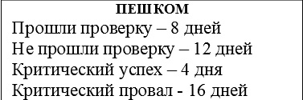
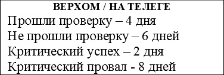
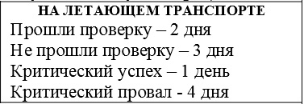
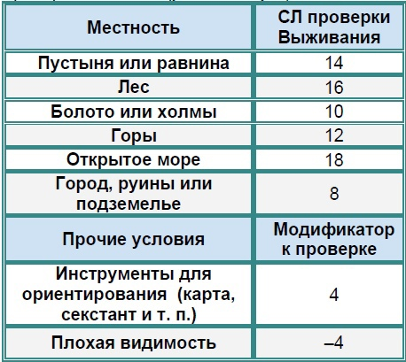
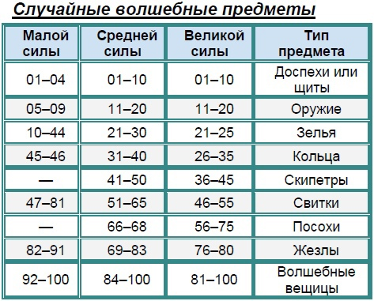
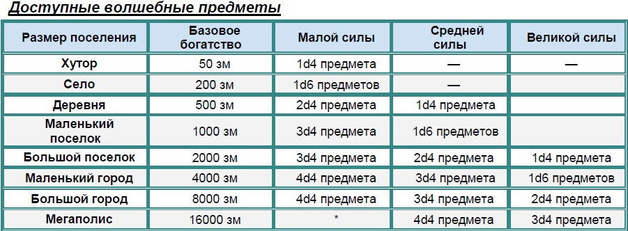
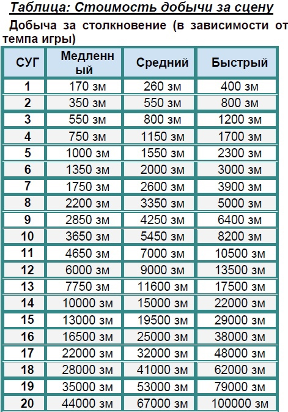
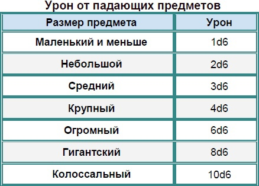
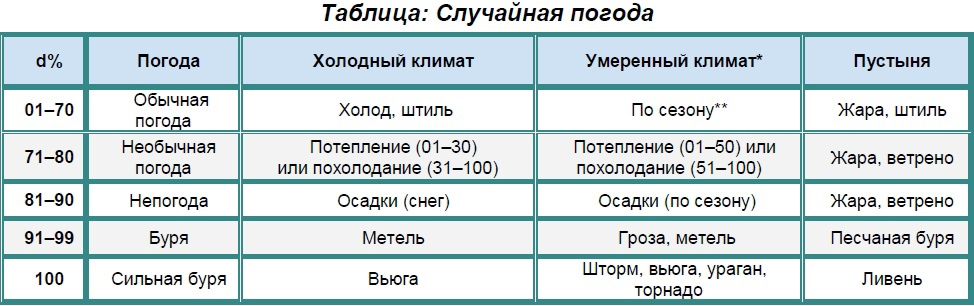

# Генератор Странствий

Никогда не любил тратить время на продумку того, что делают герои пока идут из города Солнором, в города Громогорн

А по сему создал данный генератор, итак действуем поэтапно, выбираем один из двух вариантов:

1.1 Кидать на каждую клеточку, гекс, несколько километров и тд. на карте

1.2 Либо просто определяем время путешествия по следующему принципу:

Проверка – Выживание СЛ зависит от местности на каждую клеточку, гекс, несколько километров и тд. на карте

## 2. За каждый день бросаем кубик d20

*   чётное - ничего интересного
*   нечётное - случилось событие:
*   1 - неудача
*   3 - удача
*   5 - социальные враги (можно договориться)
*   7 - агрессивные враги (сразу нападают)
*   9 - друзья
*   11 - сбились с пути +1d4 дней /либо/ засада (чёт - социальные враги, нечёт агрессивные враги)
*   13 - нашли короткую дорогу -1d4 дней /либо/ Трактир
*   15 - случайный дружественный лагерь
*   17 - случайное дружественное поселение
*   19 - вражеский лагерь / поселение (можно тихо обойти)

### неудача

*   1-2 Испортилась погода
*   3-4 Несчастный случай
*   5-6 Ловушки на дороге 2d4 штук
*   7-8 Сбились с пути +1d6 дней /либо/ нужно сделать уцспешную проверку подходящего навыка или потратить весь день, что бы найти дорогу по которой шли игроки
*   9-10 Шанс заболеть
    *   при отсутствии бонуса одежды/магии СЛ 15
    *   при наличии бонуса одежды/магии СЛ 10
    *   одеты совсем не по сезону СЛ 20
*   11-12 Испортилась еда 1d10 штук
*   13-14 Испортился фураж 1d12 или вдвое больше еды
*   15-16 Феи, гремлины или ещё какие сороки воруют деньги 1d10 х100 (внимание СД 15)
*   17-18 Проклятое место Воля СД 15, при провале проклятье -2 (стат выбрать через d6)
*   19-20 Ложное обвинение в преступлении или ещё в чём-то, вы попались по ошибке

### удача

*   1-2 Хорошая погода
*   3-4 Нашли магическую побрякушку
*   5-6 Обилие трав и прочих ингредиентов
*   7-8 короткая дорога минус 1d6 дней /либо/ Пустой дом
*   9-10 Пустой дом (сон в тепле) снятие мелких отрицательных эффектов и бонус +1 ко всем действиям (уют)
*   11-12 Нашли еду (кол-во игроков)d4
*   13-14 Нашли фураж или еду (кол-во игроков)d6
*   15-16 Нашли ценности на сумму 1d10х100
*   17-18 Святое место благословение (стат выбрать через d6) либо снятие проклятия
*   19-20 Встреча полезных попутчиков, могут помочь в следующем бою

### социальные враги (можно договориться)

*   1-4 легко КО -1 от уровня партии (2d6 врагов)
*   5-8 средне КО +0 от уровня партии (1d12 врагов)
*   9-12 серьёзные КО +1 от уровня партии (2d4 врагов)
*   13-16 высокий КО +2 от уровня партии (1d8 врагов)
*   17-20 эпик КО +3 от уровня партии (1d4 врагов)

### агрессивные враги (сразу нападают)

*   1-4 легко КО -1 от уровня партии (2d6 врагов)
*   5-8 средне КО +0 от уровня партии (1d12 врагов)
*   9-12 серьёзные КО +1 от уровня партии (2d4 врагов)
*   13-16 высокий КО +2 от уровня партии (1d8 врагов)
*   17-20 эпик КО +3 от уровня партии (1d4 врагов)

### друзья

*   1-2 Простой путник Подскажет дорогу -1d4 дней /либо/ расскажет где спрятан клад или где находится интересное место
*   3-4 Странствующий бард Поднимет настроение, немного поможет 1 раз, а потом уйдёт
*   5-6 Странствующий волшебник Поможет магией и купит безделушки
*   7-8 Странствующий друид/жрец Исцелит раны, болезни и проклятия
*   9-10 Странствующий следопыт Покажет дорогу -2d4 дней /либо/ поможет в бою 1 раз, а потом уйдёт
*   11-12 Странствующий торговый караван Простые товары, фураж и еда (цены определяет мастер)
*   13-14 Странствующий торговец Оружие и броня, и магические тоже (цены определяет мастер)
*   15-16 Странствующий торговый караван Магические предметы, безделушки и артефакты (цены определяет мастер)
*   17-18 Странствующий торговый караван Зелья, лекарства и различные ингредиенты (цены определяет мастер)
*   19-20 Табор цыган – Все торговцы, вместе взятые + как бард веселят + гадалка -1d3 дней /либо/ украдут немного денег и коня

### случайный дружественный лагерь / поселение

*   1-4 Дружественный лагерь/поселение - ничего особенного
*   5-8 Дружественный лагерь/поселение – могут поделиться едой и фуражом (кол-во игроков)d4 если лагерь, (кол-во игроков)d8 если поселение
*   9-12 Дружественный лагерь/поселение – могут пустить поспать (сон в тепле)
*   13-16 Дружественный лагерь/поселение – подскажут дорогу -2d6
*   17-20 Дружественный лагерь/поселение – Могут поторговать

### вражеский лагерь / поселение

*   Нечёт - лагерь / Чёт - поселение
*   1-4 Вражеский лагерь КО -1 (2d6 врагов) / поселение (4d6 врагов)
*   5-8 Вражеский лагерь КО 0 (1d12 врагов) / поселение (2d12 врагов)
*   9-12 Вражеский лагерь КО +1 (2d4 врагов) / поселение (4d4 врагов)
*   13-16 Вражеский лагерь КО +2 (1d8 врагов) / поселение (2d8 врагов)
*   17-20 Вражеский лагерь КО +3 (1d4 врагов) / поселение (2d4 врагов)

## Дополнительные таблицы

