# Креатив в архитектуре

Среди самых оригинальных зданий мира есть немало офисов и выставочных центров, построенных по заказу всемирно известных корпораций.

В каких условиях рождается лучший в мире креатив, AdMe.ru уже показывал в обзоре про самые интересные интерьеры рекламных агентств . Теперь предлагаем вам взглянуть на штаб-квартиры мега-брендов — место, где располагается мозг успешных мировых компаний. А также на несколько уникальных зданий со всего мира, потрясающих воображение своей архитектурой.

## Штаб квартира Longaberger

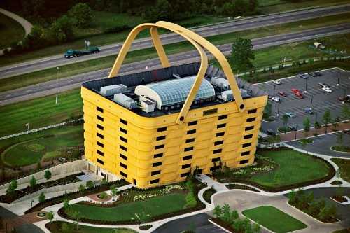 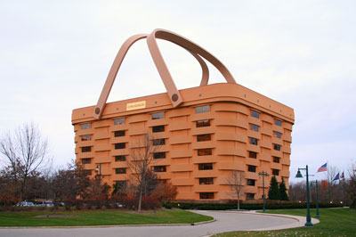 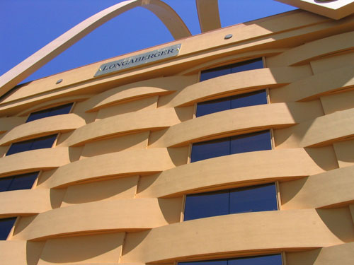

Это очень необычное строение является штаб-квартирой лидера по изготовлению корзин в Америке компании «Longaberger». Основатель фирмы Дейв Лонгейберджер хотел, чтобы каждое здание компании имело форму корзины, но его пожелания не исполнились, потому что после его смерти, дочери запретили строить еще здания такого вида.

## Штаб-квартира Unilever

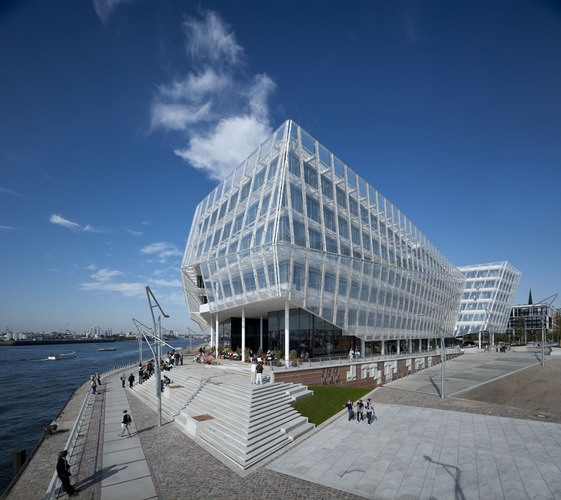 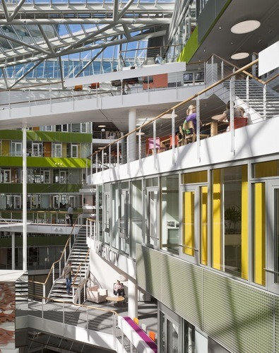 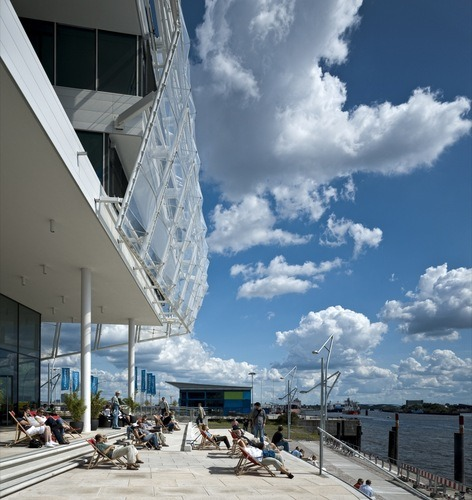

7-миэтажное здание общей площадью 122 700 квадратных метров расположен в порту города Гамбурга. Помимо офисных помещений на цокольном этаже размещаются кафетерий для сотрудников и кухня, а также услуги для посетителей — кафе, небольшой спа-центр и продовольственный магазин, заполненный продукцией Юнилевер. Снаружи, патио сливается с лестницей, ведущей вниз к набережной реки.

## Концертный зал имени Уолта Диснея

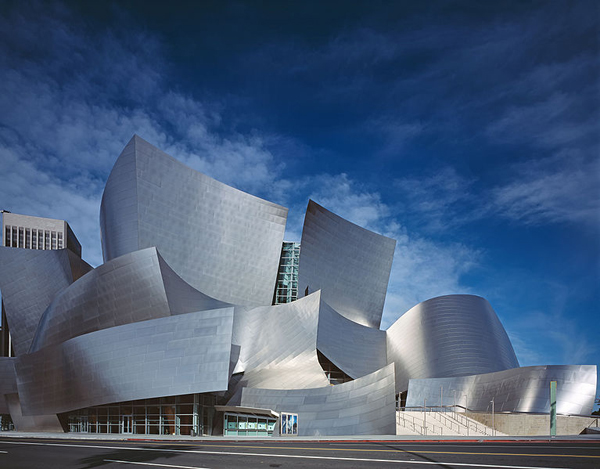 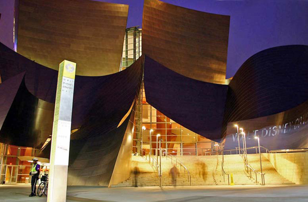

Строительство новейшей концертной площадки Лос-Анджелеса началось в декабре 1999 г. и было завершено в 2003 г. Стоимость проекта составила около 170 миллионов долларов, из которых семья Диснея внесла примерно половину, ещё 25 миллионов пожертвовала Компания Уолта Диснея. В 2005 году в дизайн здания пришлось внести некоторые коррективы из-за жалоб жителей соседних домов: стальные панели, которыми облицован фасад концертного зала, концентрировали солнечные лучи, так что в некоторых квартирах напротив стояла невыносимая жара, а температура поверхности тротуара достигала 60 °C.

## Штаб квартира Центрального телевидения КНР

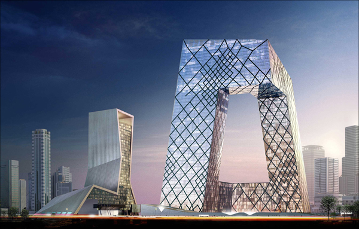

Эксплуатируется с 2009 года. Здание поднимается ввысь на высоту 234 метра и имеет 44 этажа. Общая площадь постройки 389 тысяч квадратных метров. В здании находятся административные службы Китайского центрального телевидения, студии теленовостей и операторские для производства программ.

## Штаб-квартира Департамента здравоохранения Басков

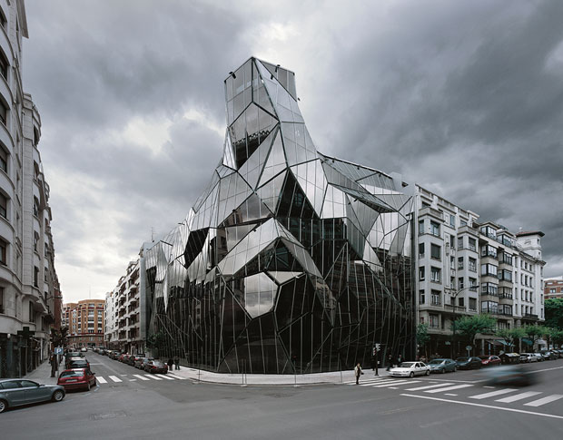 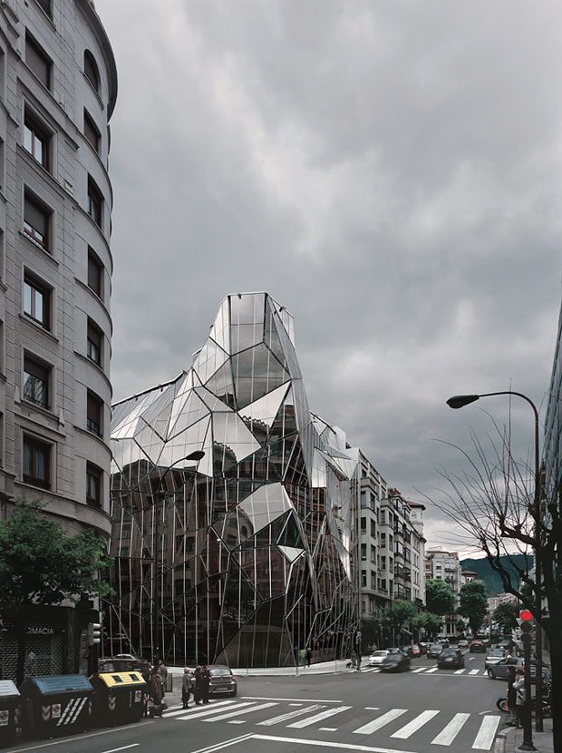 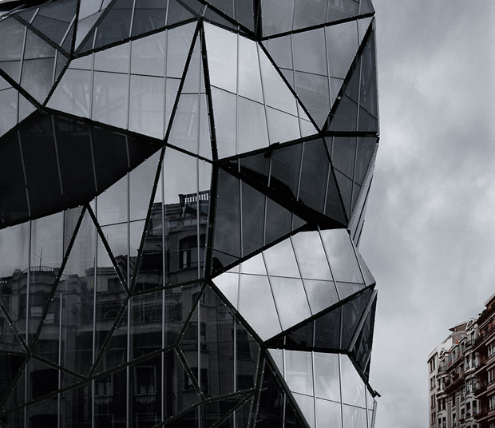

Испанским архитекторам предстояло вписать свое необычное творение в архитектурный ансамбль улиц, построенных еще в 1862 году. В здании семь этажей, а под зданием расположены два парковочных этажа, попасть на которые можно на лифте. Несмотря на кажущуюся сложность фасада, изломанность его линий никак не отражается на ощущениях тех, кто находится внутри здания. А двойной фасад, сделанный полностью из стекла, позволяют работника департамента созерцать пейзажи за стеной.

## Штаб-квартира Macquarie Bank в Сиднее

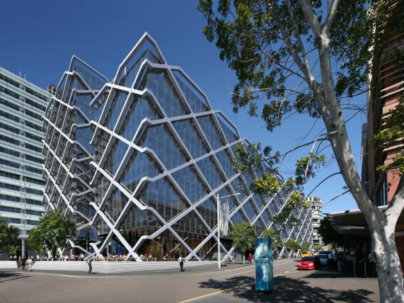 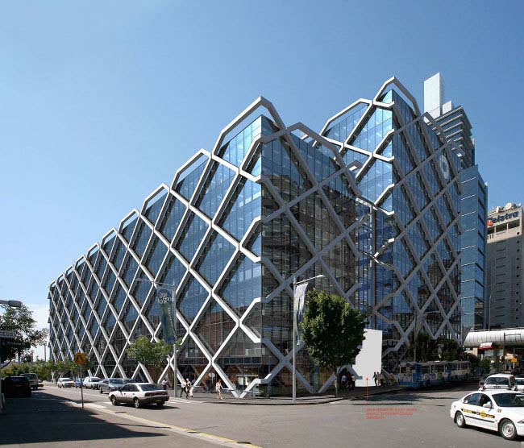

## Штаб-квартира компании Gas Natural в Барселоне

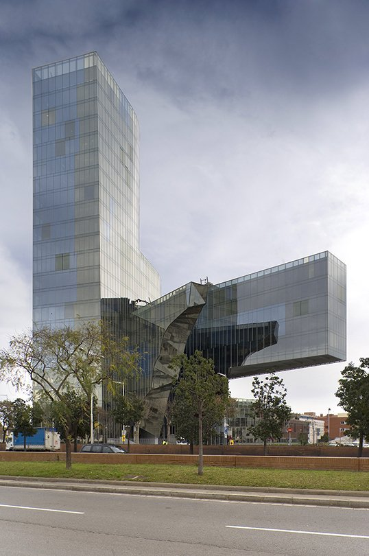 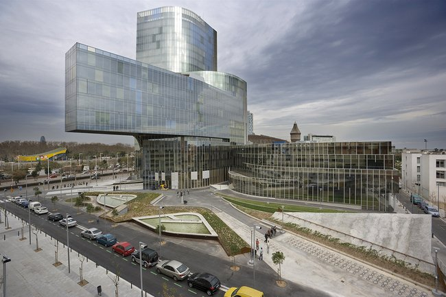 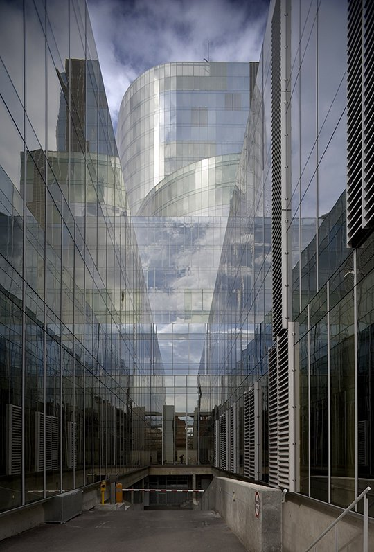

## Штаб-квартира Intel в Калифорнии

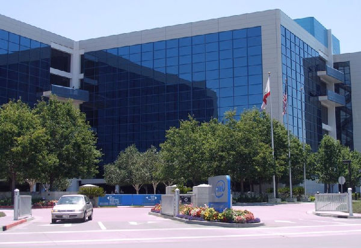

## Штаб-квартира Centraal Beheer

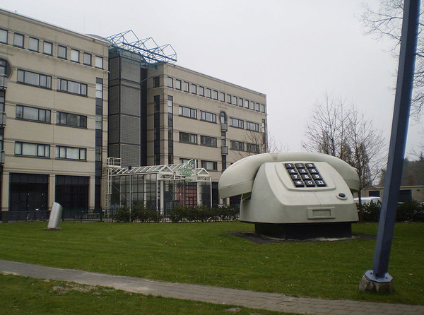

Само здание головного офиса крупнейшей в Нидерландах страховой компании архитектруной ценности не представляет. А вот установленный перед офисом монументальный телефон свидетельствует о более 15 годах успешной рекламной кампании "Even Apeldoorn bellen"/"Let’s call Apeldoorn"/"Нужно позвонить в Апелдорн".

## Автопроизводители

### Парк развлечений Ferrari World в ОАЭ

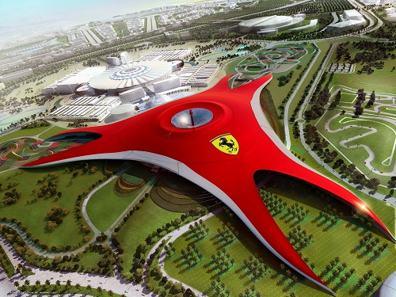 

Придуманный и разработанный всемирно известным архитектурным бюро Benoy дизайн тематического парка Ferrary World был вдохновлен двойным изгибом бокового профиля Ferrari GT. Красную обтекающую крышу развлекательного комплекса, выполненную в форме трех лепестков, украшает самый большой за всю историю бренда логотип Ferrari.

### Завод VW в Дрездене

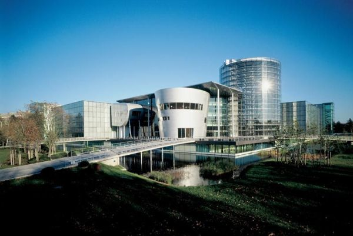 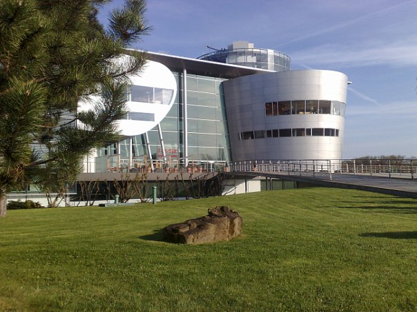

Открытие завода состоялось 23 марта 2002 года. Здесь вручную собирают автомобили премиум-класса VW Phaeton. Сам завод называется Gläserne Manufaktur, что в переводе означает прозрачная фабрика: практически все внешние и внутренние стены завода сделаны из стекла. Таким образом, Фольксваген позволяет потенциальном клиентам познакомится с производством, устраивая экскурсии всем желающим. А также можно лично присутствовать при сборке вашего автомобиля.

### Музей Porsche в Штутгарте

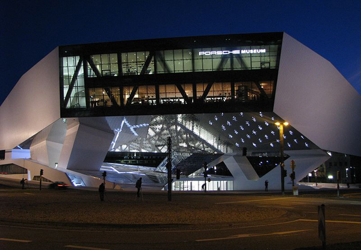 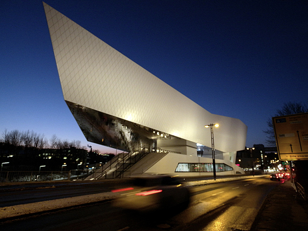 
 
Выставочный комплекс в районе Цуффенхаузен города Штутгарт, собравший под своей крышей экспонаты, рассказывающие об истории марки Porsche с момента её создания до сегодняшних дней. Сам музей существует с 1976 года. Открытие нового здания состоялось в январе 2009 года.

### Музей Mercedes Штутгарте

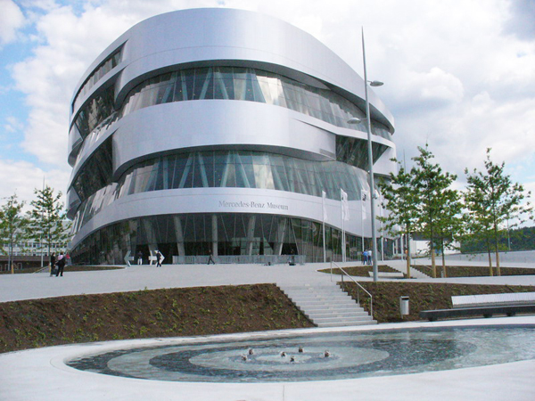 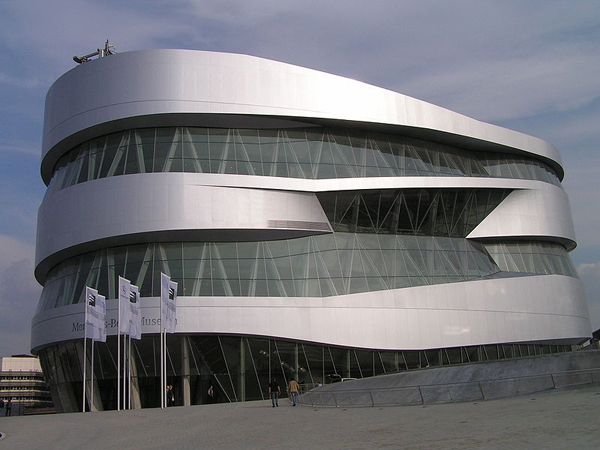

Здание музея в форме трилистника, состоящего из трёх кругов с удалённым центром, было построено и открылось 19 мая 2006 года. Здание было спроектировано таким образом, чтобы занимать минимум площади при максимальном использовании пространства: на 16 500 квадратных метров выставочного пространства площадь занимаемой земли составляет лишь 4 800 квадратных метров.

### Выставочный центр BMW Welt в Мюнхене

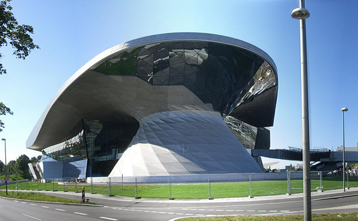 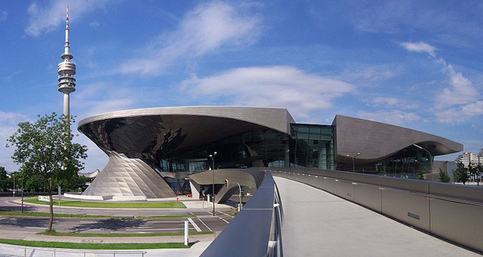 
 
Многофункциональный комплекс BMW Welt открылся в октябре 2007 года. Строительство центра продолжалось 4 года. Особенность здания помимо оригинальной архитектуры заключается в том, что на крыше BMW Welt расположен минизавод по производству солнечной энергии мощностью 800 кВт.

### Штаб-квартира BMW в Мюнхене

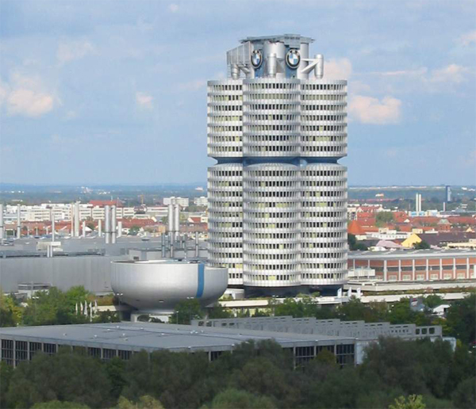

И в заключении, несколько уникальных зданий со всего мира, потрясающих воображение своей архитектурой.

## Атомиум в Брюсселе

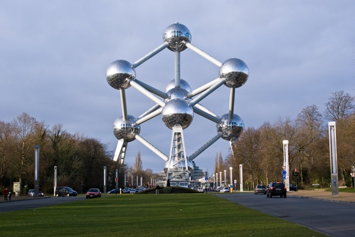

Построенное в 1958 году, как символ атомного века, сооружение состоит из 9 атомов, объединенных в кубический фрагмент кристаллической решетки железа, увеличенный в 165 миллиардов раз. Шесть сфер открыты для посетителей. В самом верхнем шаре находится ресторан и обзорная платформа. Сферы соединены между собой трубами с эскалаторами и соединительными коридорами. В средней трубе находится лифт.

## Кубические дома в Роттердаме

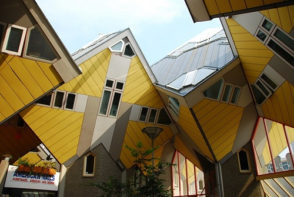

Построены по поекту архитектора Пита Блома в 1984 году. Стены и окна этих жилых домов наклонены под углом в 54,7 градусов по отношению к полу. Общая площадь квартиры составляет около 100 квадратных метров. Некоторые жильцы предлагают экскурсии по своим неординарным жилищам.

## Кафедральный собор Бразилии

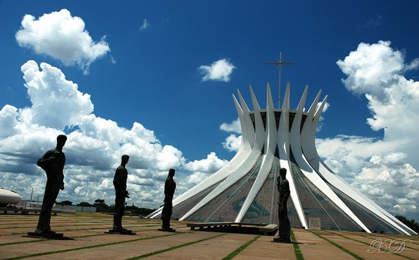 

Архитктор О. Нимейер. основные помещения собора расположены под землей, а с улицы виден лишь его купол из бетона и витражного стекла.

## The Gherkin в Лондоне

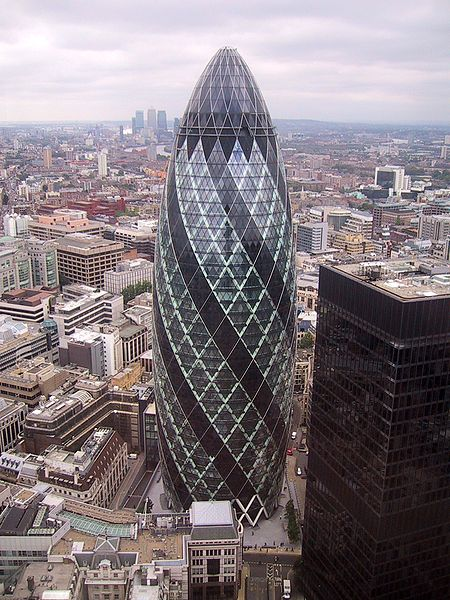 

Вообще-то официальное название 41-этажного небоскреба "30 St Mary Axe"/"Сент-Мэри Экс 30«. Но жители за зеленоватый оттенок стекла и характерную форму называют его «огурец», «корнишон» (англ. The Gherkin). Здание было построено в 2001–2004 годах. Находится в финансовом центре Лондона. Является штаб-квартирой компании Swiss Re.

## Кривой дом в Польше

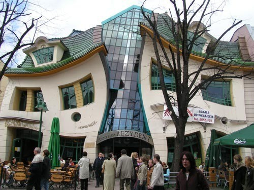 

В «сказочном» доме проживает польский иллюстратор детских книг Ян Марсин Сзенсер и шведский художник Пер Далберг, ниже находятся самые настоящие магазины, бары и кафе.

## Дом-гриб

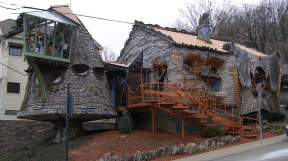 

Его спроектировал и построил профессор университета Цинциннати (Огайо, США), архитектор Терри Браун (Terry Brown).

## Жилой комплекс в Монреале

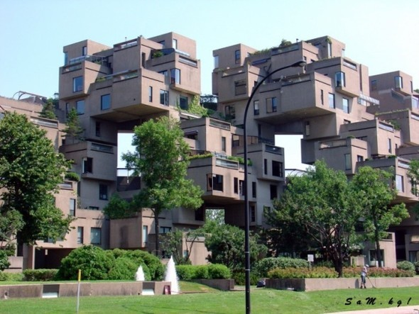  

Был построен в 1967 году. 354 кубов, нарощенных друг на друга, позволили создать это серое по цвету здание со 146 квартирами.

## Nakagin Capsule Tower

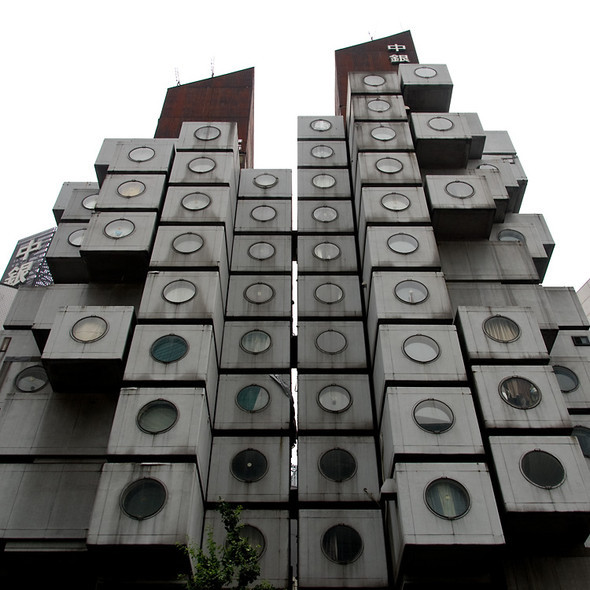 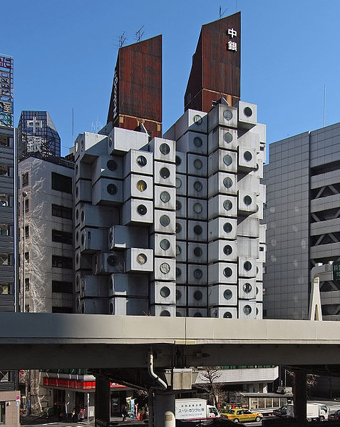 

Смешанного использования жилое и офисное здание в Токио — воплощением капсульной архитектуры. Было построено в 1972 году и находится в списке всемирного архитектурного наследия DOCOMOMO International.

## HSB Turning Torso

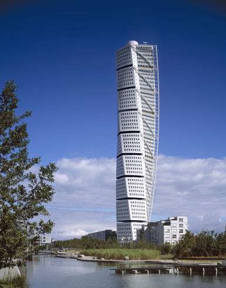 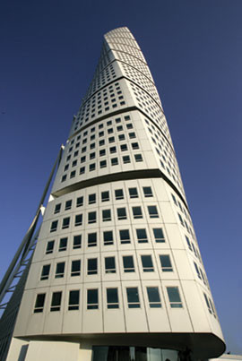 

Небоскреб расположен в Мальме, Швеция. Построен в 2005 году. Высота пятидесятичетырёхэтажного здания составляет 190 метров.

## Библиотека в Канзас-Сити

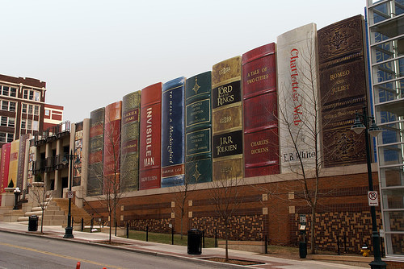 

Жителям Канзас-Сити, было предложено помочь подобрать список самых известных книг, которые представляют Канзас-Сити. Эти названия были включены как bookbindings’ в инновационный дизайн экстерьера, с целью вдохновить людей посещать библиотеку.

## Музей Гуггенхайма в Бильбао

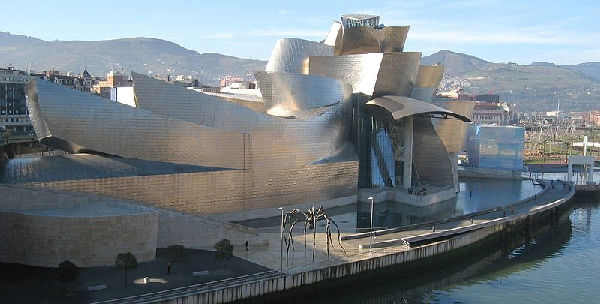 

Здание музея было открыто для публики в 1997 году и сразу же признано одним из наиболее зрелищных в мире строений.

## Дом-пианино в Китае

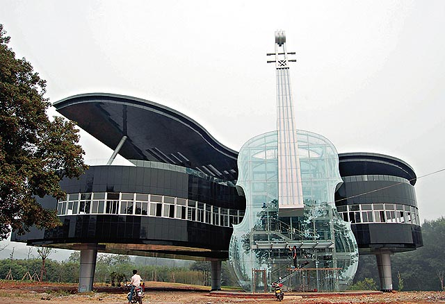 

## Камень-дом в Португалии

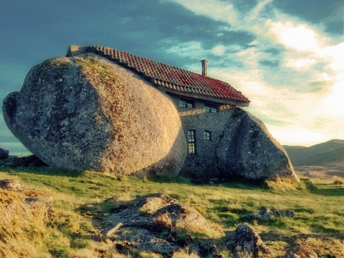 

## Танцующий дом в центре Праги

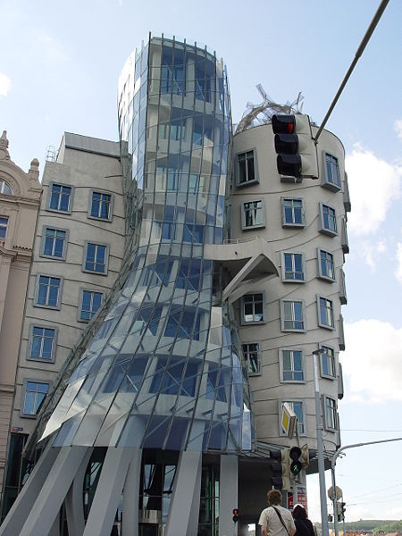 

## Дом-робот в Таиланде

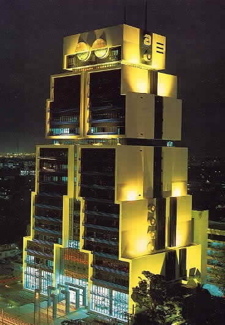 

## Центр здоровья мозга в Лас Вегасе

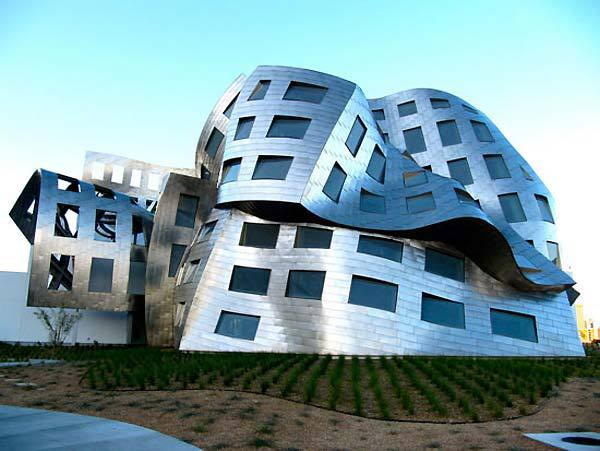 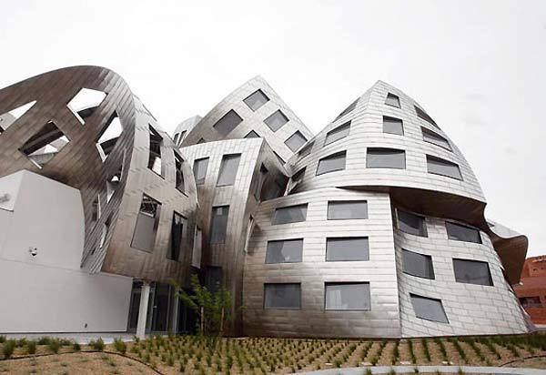 

## Музей Кунстхаус в Австрии

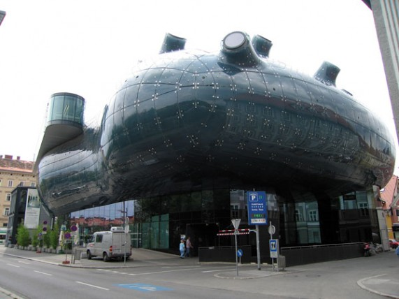 

## Министерство транспорта в Тбилиси, Грузия

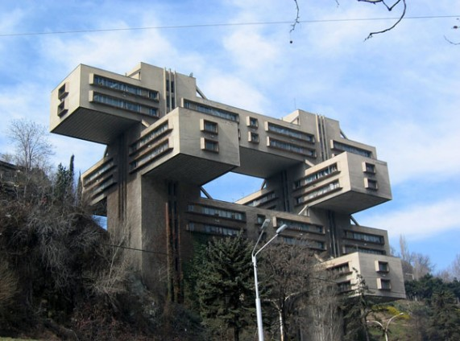 

## Regatta Hotel в Джакарте, Индонезия

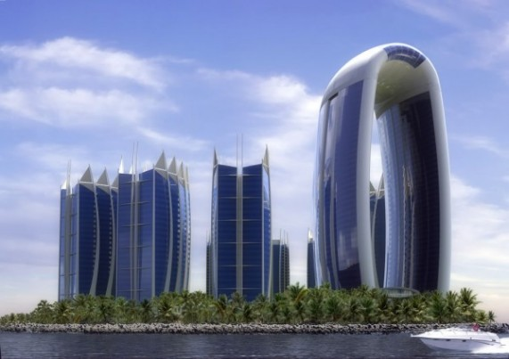 

## Stata Center в Кембридже, Массачусетс

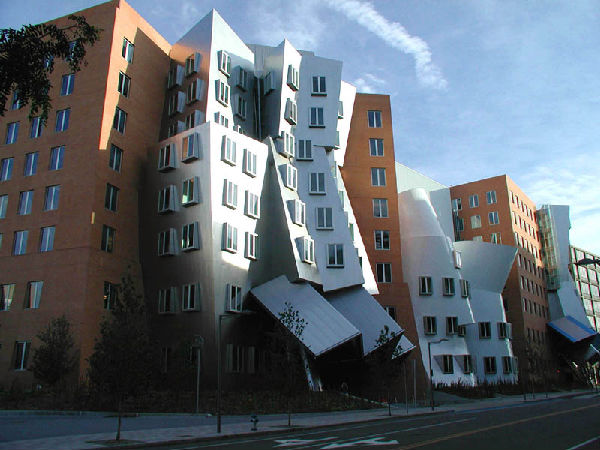 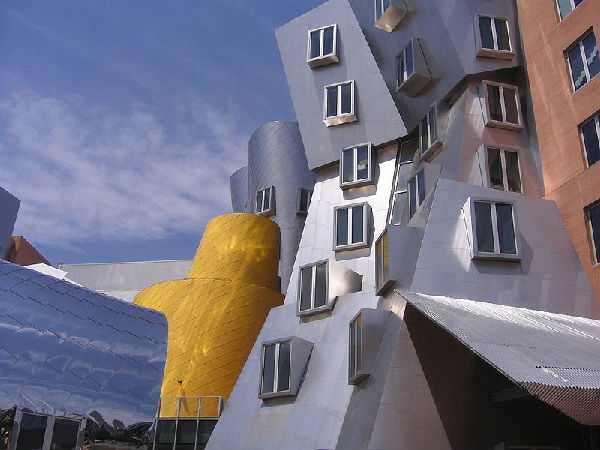 

## ТЦ Bull Ring в Бирмингеме

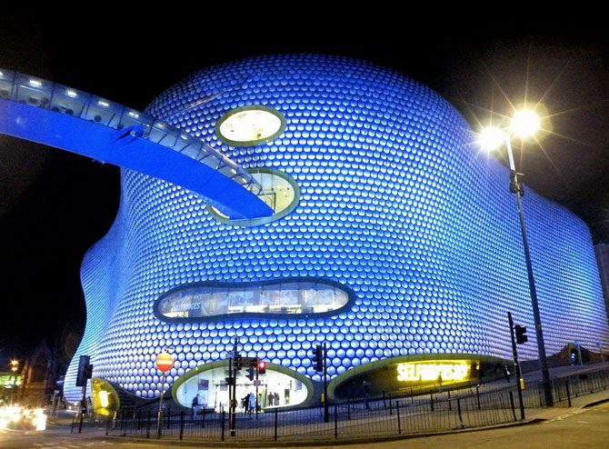 

## Universum Science Center в Бремене

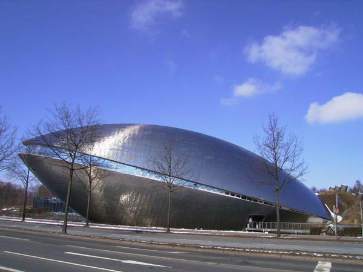 

## Музей «Хотите верьте, хотите нет» в США, штат Миссури

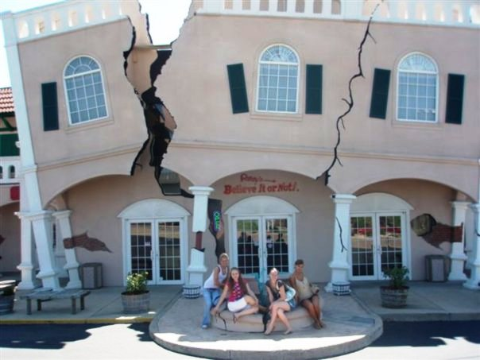 

## Венский Музей современного искусства, инсталляция «Дом атакует»

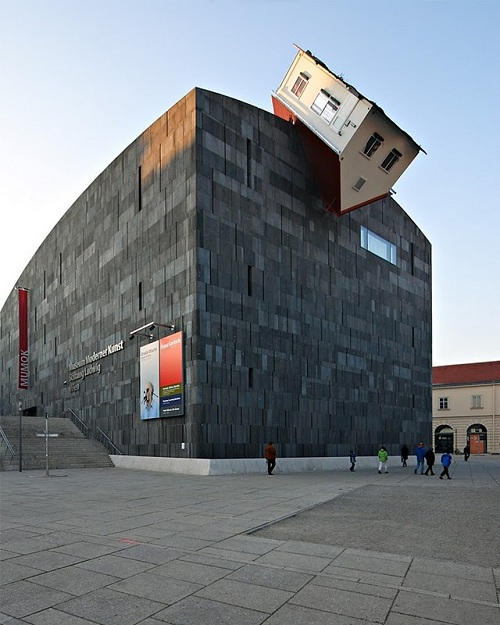

В октябре 2006 года жилой дом будто бы рухнул с неба и врезался в крышу музея. Автор проекта — скульптор Эрвин Вурм (Erwin Wurm).

## Церковь Халлгримур в Рейкьявике

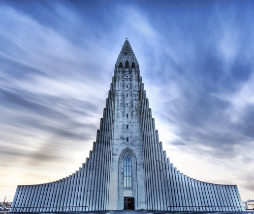 

## Библиотека Александрина, Египет

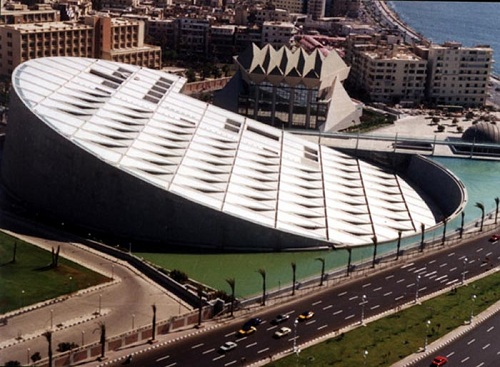  

## Кабачок на бочок в Киеве

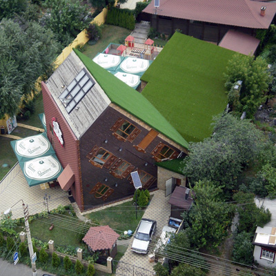 

## Дом Сутягина в Архангельске

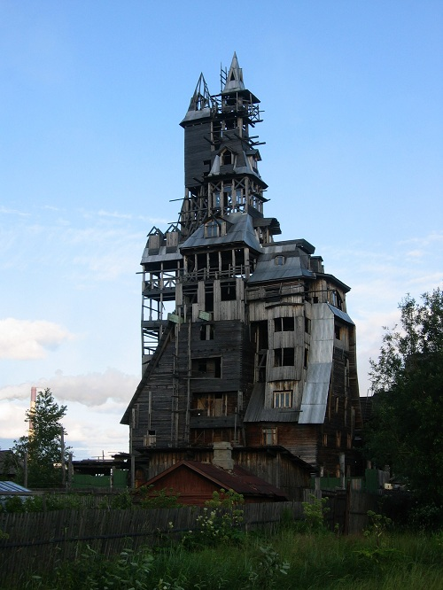 

Деревянный 13-этажный дом, строившийся с 1992 года бизнесменом Николаем Сутеевым, являлся одной из самых высоких частных деревянных построек в России. Его планировали даже занести в Книгу рекордов Гиннесса как самое высокое деревянное здание в мире. К 2009 году дом был снесен по решению суда, который постановил, что здание построено незаконно, поскольку в Архангельске запрещено строить частные деревянные здания свыше двух этажей без предварительного согласования с властями.
