# Необычные мосты

Мост должен решать как стандартную задачу — помочь человеку переправиться с одного берега на другой, так и эстетическую — быть культурным памятником города.

Для справки: город с самым большим количеством мостов вовсе не Венеция, а Гамбург. В Гамбурге больше 2 300 мостов. Это почти в 6 раз больше, чем в Санкт-Петербурге, где их всего 400. Сделать каждый мост уникальным и примечательным — задача дизайнеров и архитекторов.

Самые выдающиеся мосты заносят в Книгу рекордов Гиннеса, а самые необычные становятся достопримечательностями города и излюбленным объектом фотосессий туристов. AdMe.ru представляет подборку из 16 интереснейших мостов, которые стоит хоть раз увидеть собственными глазами.

## Висячий мост в Непале

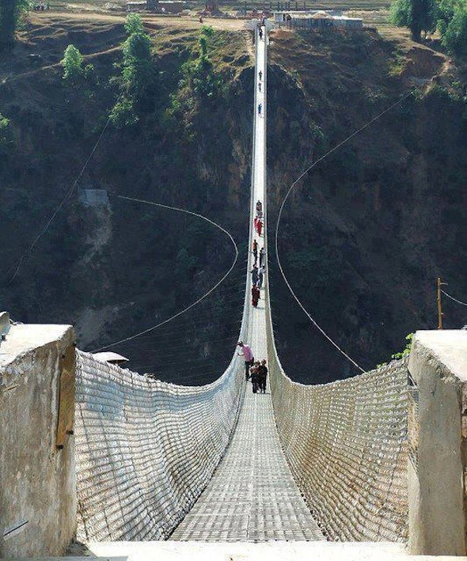 

## Мост под водой

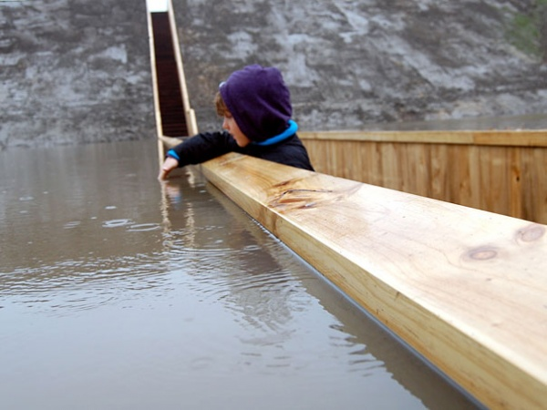 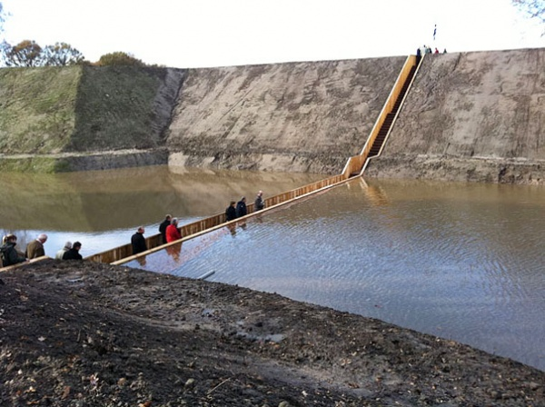

Moses Bridge — «Мост Моисея» построили в Нидерландах при реконструкции форта XVII века. Назван он по имени пророка Моисея, перед которым расступились воды Красного моря, пропуская евреев, бежавших из Египта. Как и в библейском повествовании, воды пропускают группы туристов, с той разницей, что проход не исчезает. Идея рукотворного чуда принадлежит молодым архитекторам Ро Костеру (Ro Koster) и Аду Килу (Ad Kil) из голландского бюро Ro&Ad Architecten.

## Мост для животных

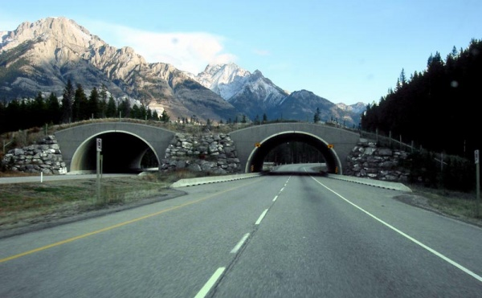 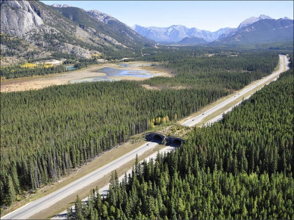

Наземный переход для животных в Национальном парке Банф в Канаде. Такие мосты позволяют диким животным, живущим в лесах вдоль трасс, безопасно перейти дорогу и не погибнуть под колесами автомобилей. Первые подобные переходы были созданы во Франции в 1950-ых годах. С каждым годом все больше и больше мостов для животных строится в Канаде, США, Нидерландах и других странах.

## Подвесной мост на воздушных шарах

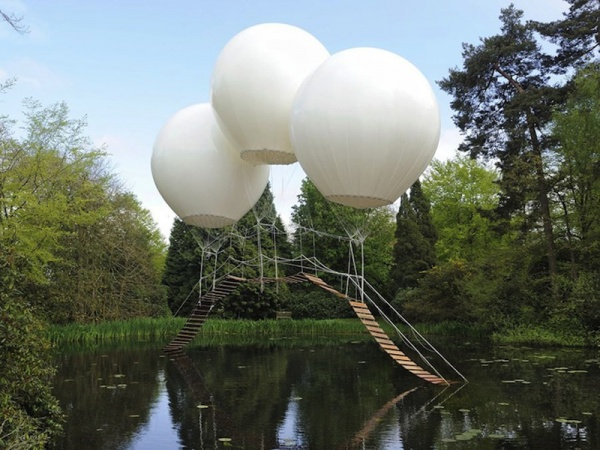 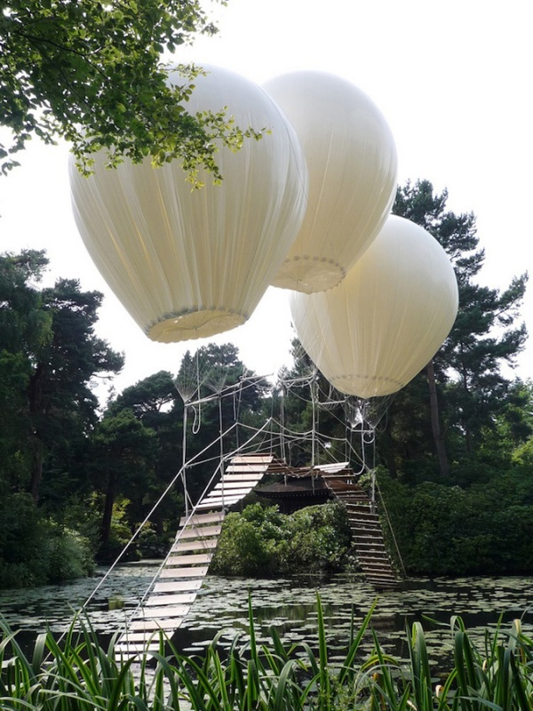  

Легкий, практически невесомый мост парит над прудом, подвешенный на трех огромных белых воздушных шарах в английском Таттон-парке. Композиция называется «Мост обезьян». Автор моста французский художник Оливье Гроссетете. К сожалению, людям пробежаться по такой переправе нельзя, это всего лишь сказочная арт-инсталляция.

## Мост из корней

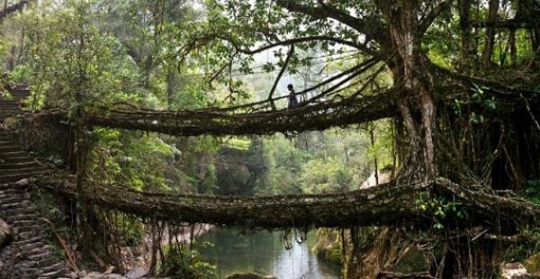 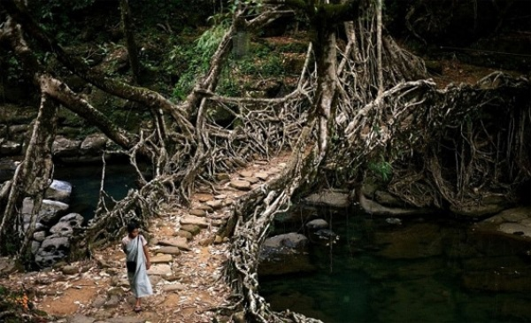

Жители одной деревни в Индии мосты не строят, а выращивают из корней каучуконосного фикуса. Несколько столетий назад местные племена начали возводить специальные приспособления, направляя корни деревьев в нужную им сторону. За более чем 500 лет удалось вырастить многочисленное количество мостов более 3 км в длину. Естественные конструкции выдерживают вес более 50 человек и устойчивы к наводнениям, типичным для данной территории.

## Мост над облаками

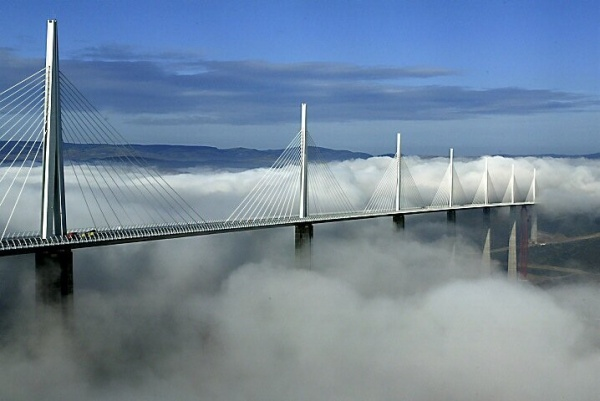 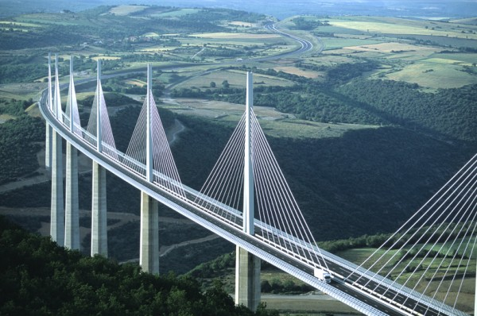 

Красивый и футуристичный Виадук Мийо (Millau Viaduct) расположен во Франции. На момент строительства Виадук Мийо был самым высоким транспортным мостом в мире, одна из его опор имеет высоту 341 метр — немного выше, чем Эйфелева башня, и всего на 40 метров ниже, чем Эмпайр-стейт-билдинг в Нью-Йорке. Общая длина моста составляет 2 460 м. Проезжая по этому архитектурному чуду, кажется, будто взлетаешь.

## Мост-фонтан

 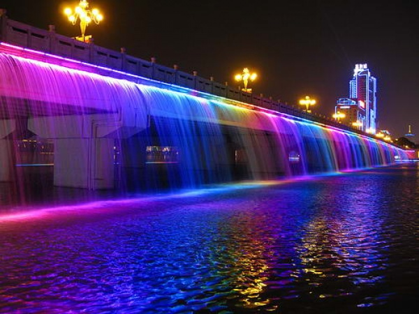 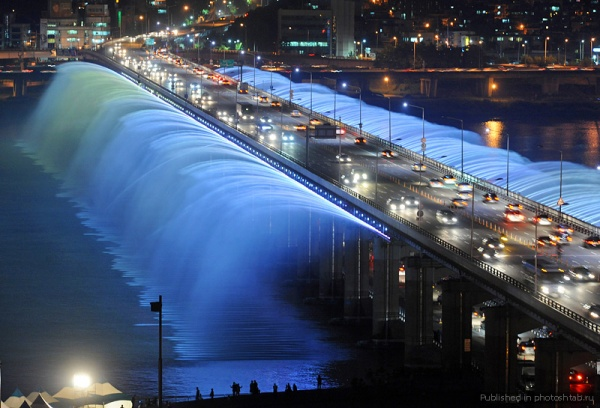

Мост «Фонтан радуги» (Banpo Bridge) занесен в книгу рекордов Гиннеса как мост, на котором расположен самый длинный в мире фонтан (длина — 1140 м ). Мост соединяет два берега реки Ханшуй в южнокорейском городе Сеул и фонтаном стал только в 2009 году. Под музыку, освещенные разноцветными светодиодами струи воды двигаются, исполняя красивый танец.

## Мост в никуда

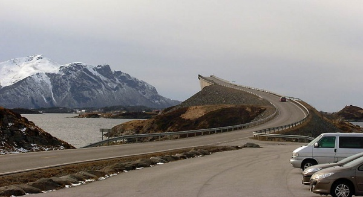 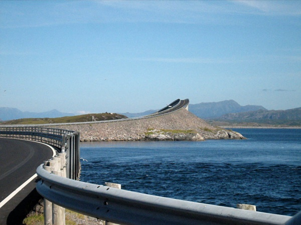

Сторсезандетский мост в Норвегии построен таким образом, чтобы создавать у приближающихся к нему иллюзию не моста, а трамплина, с которого можно вместе с автомобилем нырнуть в ледяную морскую воду. Местные жители дали ему прозвище «Пьяный мост», потому что его форма постоянно меняется в зависимости от угла зрения.

## Подъемный мост

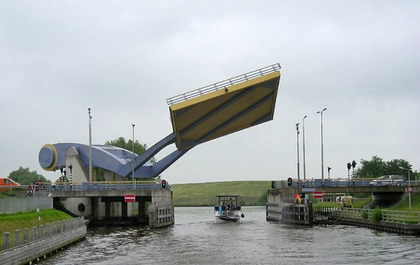 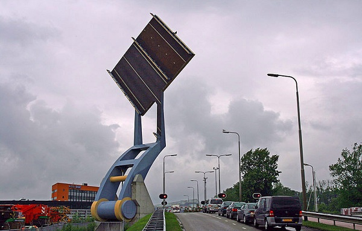 

Автоматически подъемный мост Slauerhoff расположен в городке Леуварден. Его размеры 15мх15м. Нижняя часть моста окрашена в цвета герба и флага Леувардена. Мост назван в честь писателя и поэта J. Slauerhoff’а.

## Небесный мост

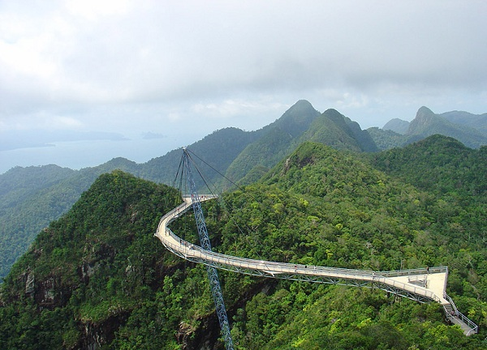 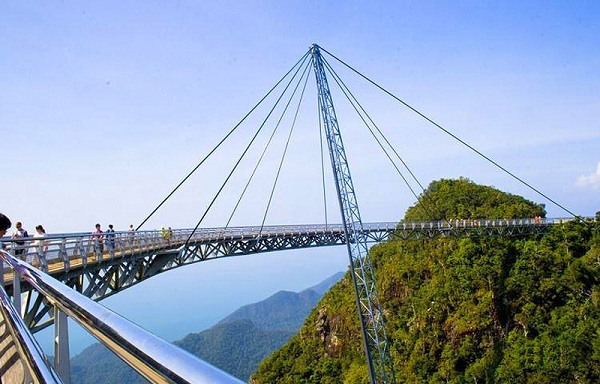 

Langkawi Sky Bridge расположен в Малайзии на высоте 700 метров над уровнем моря. Длина моста составляет 125 метров. Он закреплен всего на одной колонне и дополнительно держится на тросах, закрепленных на скалах. Мост изогнут, и создается полное ощущение, что он парит над пропастью.

## Висячий мост

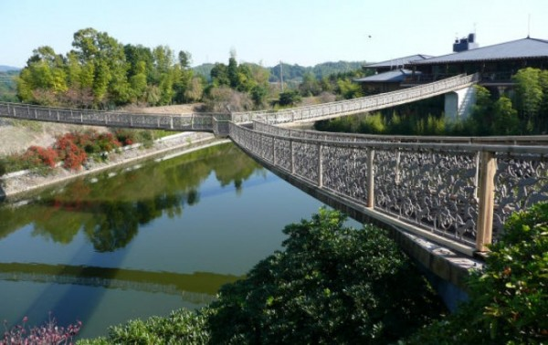 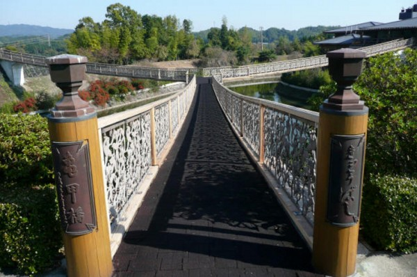

Уникальный мост Kikki в Японии выполнен в виде буквы Y и висит над водой без единой опоры.

## Сворачивающийся мост

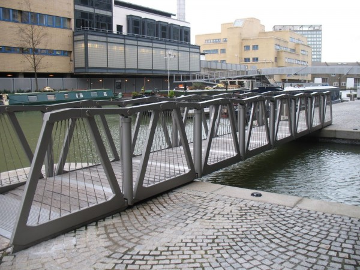 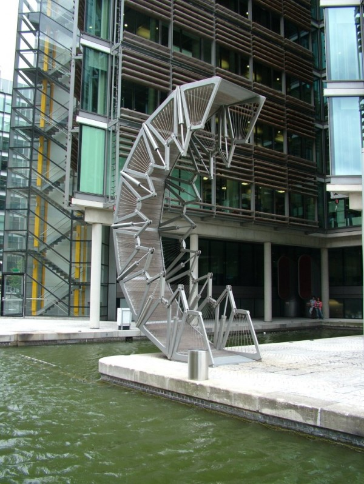 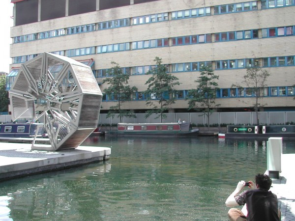 

Забавный пешеходный мост Rolling Bridge построен в Лондоне. Длина моста составляет 12 метров, а уникальность заключается в том, что он может сворачиваться и разворачиваться. Управляется мост гидравлическими насосами в перилах моста.

## Водный мост

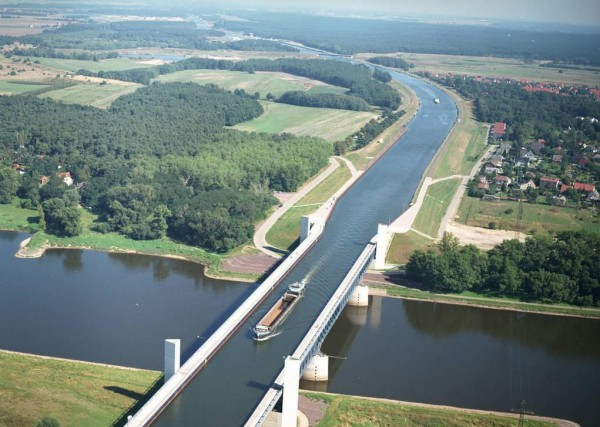 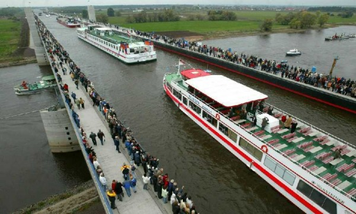 

Магдебургский мост-акведук в Германии соединяет два важных канала и является самым большим водным мостом в Европе. Длина моста составляет 918 метров, и по нему не только ходят люди, но и плывут суда.

## Змеевидный мост

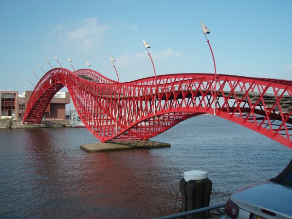 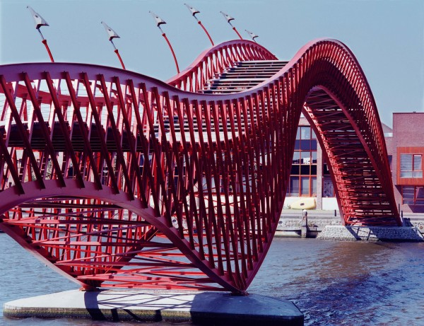 

Один из самых причудливых мостов в мире располагается в Амстердаме и называется "Питон"/"Pythonbrug" благодаря своей змеевидной форме. Его построили в 2001 году. Мост в стиле хай-тек соединяет полуостров Споренбург с островом Борнео.

## Качающийся мост

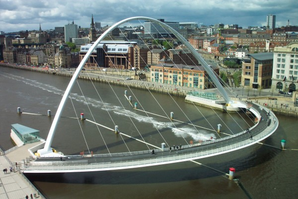 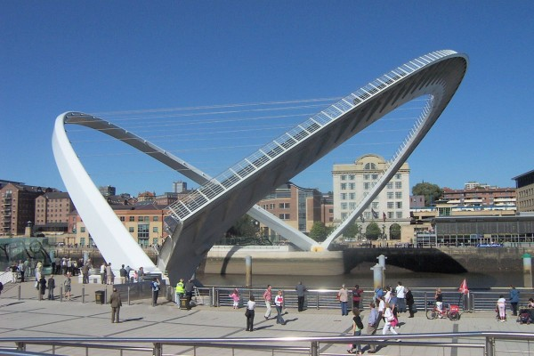 

Мост Тысячелетия (Gateshead Millennium Bridge) находится в Северной Англии и имеет форму двух дуг, одна из которых лежит между берегами, а вторая поднята. Для прохождения судов обе дуги поднимаются, образуя арку высотой 25 метров.

## Мост-ресторан Айола

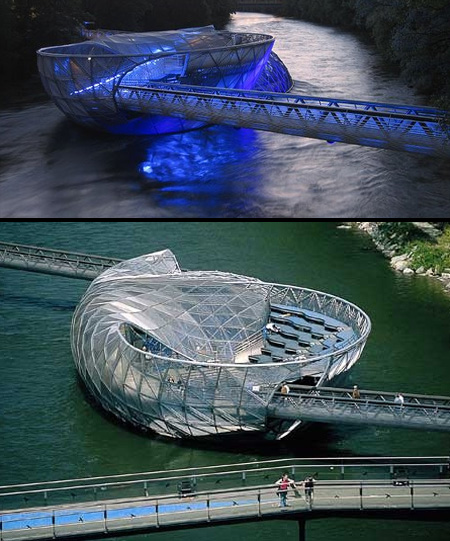 

Нью-йоркский архитектор Вито Аккончи создал мост Айола Айленд, который перекинулся через реку Мур в австрийском городе Граце. Островной частью моста посреди реки является небольшой ресторан с интересным интерьером, смотровой и пляжной площадкой.

## Жилой мост

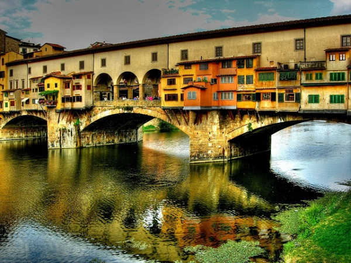  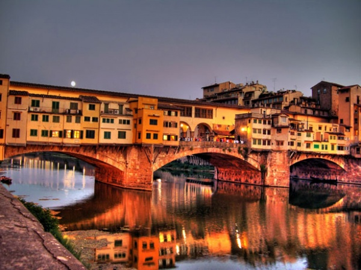 

Понте Веккьо — самый древний мост города Флоренции и единственный, сохранивший свой первоначальный облик. Мост был построен в 1345 году. Отличительная черта Понте Веккьо — дома, теснящиеся по обеим его сторонам. В центре пролетов моста ряд зданий прерывается и переходит в открытую площадку, с которой можно любоваться рекой и другими мостами города.
