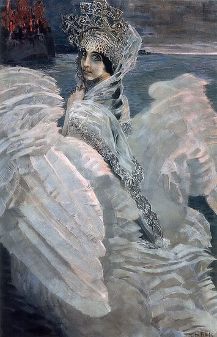

# 33 шедевра мировой живописи
#### Самые знаменитые и значимые для истории искусства картины мира для вашего вдохновения.

Бессмертными картинами великих художников восхищаются миллионы людей. Искусство, классическое и современное, это один из самых главных источников вдохновения, вкуса и культурного воспитания любого человека, а уж творческого и подавно.

Всемирно известных картин безусловно больше, чем 33. Их несколько сотен, и все они бы не поместились в один обзор. Поэтому для удобства просмотра мы отобрали несколько, наиболее значимых для мировой культуры и часто копируемых в рекламе картин . Каждая работа сопровождается интересным фактом, объяснением художественного смысла или историей ее создания.

## Рафаэль «Сикстинская мадонна» 1512
Хранится в Галерее старых мастеров в Дрездене.

У картины есть маленький секрет: задний фон, издали кажущийся облаками, при тщательном рассмотрении оказывается головами ангелов. А два ангелочка, изображенные на картине внизу, стали мотивом многочисленных открыток и плакатов.

## Рембрандт «Ночной дозор» 1642
Хранится в Государственном музее в Амстердаме.

Истинное название картины Рембрандта «Выступление стрелковой роты капитана Франса Баннинга Кока и лейтенанта Виллема ван Рейтенбюрга». Обнаружившим в XIX веке картину искусствоведам показалось, что фигуры выступают на темном фоне, и ее назвали «Ночной дозор». Позднее обнаружилось, что темной картину делает слой копоти, а действие на самом деле происходит днем. Однако в сокровищницу мирового искусства картина уже вошла под названием «Ночной дозор».

## Леонардо да Винчи «Тайная вечеря» 1495–1498
Находится в монастыре Санта-Мария делле Грацие в Милане.

За более 500-летнюю историю существования произведения фреска не раз подвергалась разрушениям: через роспись был проделан, а затем заложен дверной проем, трапезную монастыря, где находится изображение, использовали как оружейный склад, тюрьму, подвергали бомбежке. Знаменитую фреску реставрировали не менее пяти раз, причем последняя реставрация заняла 21 год. Сегодня, чтобы посмотреть произведение искусства, посетители должны заказывать билеты заранее и могут провести в трапезной только 15 минут.

## Сальвадор Дали «Постоянство памяти» 1931
Хранится в Музее современного искусства в Нью-Йорке.

По признанию самого автора, картина была написана в результате ассоциаций, возникших у Дали при виде плавленого сыра. Вернувшись из кино, куда она ходила в тот вечер, Гала совершенно правильно предсказала, что никто, раз увидевши «Постоянство памяти», уже его не забудет.

## Питер Брейгель Старший «Вавилонская башня» 1563
Хранится в Музее истории искусств в Вене.

По мнению Брейгеля в неудаче, постигшей строительство Вавилонской башни, повинны не внезапно возникшие согласно библейскому сюжету языковые барьеры, а ошибки, допущенные в процессе строительства. На первый взгляд огромное строение кажется достаточно прочным, однако при ближайшем рассмотрении видно, что все ярусы положены неровно, нижние этажи либо недостроены, либо уже рушатся, само здание кренится в сторону города, и перспективы всего проекта весьма печальны.

## Казимир Малевич «Чёрный квадрат» 1915
Хранится в Государственной Третьяковской галерее

По утверждению художника, он писал картину несколько месяцев. Впоследствии Малевич выполнил несколько копий «Черного квадрата» (по некоторым данным, семь). По одной из версий, художник не смог закончить работу над картиной в нужный срок, поэтому ему пришлось замазать работу черной краской. Впоследствии, после признания публики, Малевич писал новые «Черные квадраты» уже на чистых холстах. Малевичем были также написаны картины «Красный квадрат» (в двух экземплярах) и один «Белый квадрат».

## Кузьма Сергеевич Петров-Водкин «Купание красного коня» 1912
Находится в Государственной Третьяковской галерее в Москве.

Написанная в 1912 году, картина оказалась провидческой. Красный конь выступает в роли Судьбы России или самой России, которую не в силах удержать хрупкий и юный седок. таким образом, художник символически предсказал своей картиной «красную» судьбу России XX века.

## Питер Пауль Рубенс «Похищение дочерей Левкиппа» 1617-1618
Хранится в Старой пинакотеке в Мюнхене.

Картина «Похищение дочерей Левкиппа» считается олицетворением мужественной страсти и телесной красоты. Сильные, мускулистые руки юношей подхватывают молодых нагих женщин, чтобы посадить их на коней. Сыновья Зевса и Леды крадут невест своих двоюродных братьев.

## Поль Гоген «Откуда мы пришли? Кто мы? Куда мы идём?» 1898
Хранится в Музее изящных искусств в Бостоне.

По указанию самого Гогена картину следует читать справа налево — три основные группы фигур иллюстрируют вопросы, поставленные в названии. Три женщины с ребёнком представляют начало жизни; средняя группа символизирует ежедневное существование зрелости; в заключительной группе, по замыслу художника, «старая женщина, приближающаяся к смерти, кажется примирившейся и предавшейся своим размышлениям», у ее ног «странная белая птица... представляет бесполезность слов».

## Эжен Делакруа «Свобода, ведущая народ» 1830
Хранится в Лувре в Париже

Делакруа создал картину по мотивам июльской революции 1830 года во Франции. В письме брату 12 октября 1830 года Делакруа пишет: «Если я не сражался за Родину, то я хотя бы буду для нее писать». Обнаженная грудь женщины, ведущей народ, символизирует самоотверженность французских людей того времени, которые с «голой грудью» шли на врага.

## Клод Моне «Впечатление. Восходящее солнце» 1872
Хранится в Музее Мармоттан в Париже.

Название произведения «Impression, soleil levant» с легкой руки журналиста Л. Леруа стало именем художественного направления «импрессионизм». Картина написана с натуры в старом аванпорте Гавра во Франции.

## Ян Вермеер «Девушка с жемчужной серёжкой» 1665
Хранится в галерее Маурицхейс в Гааге.

Одну из наиболее известных картин нидерландского художника Яна Вермеера часто называют северной или голландской Моной Лизой. О картине очень мало известно: она не датирована, имя изображенной девушки не известно. В 2003 году по одноимённому роману Трейси Шевалье был снят художественный фильм «Девушка с жемчужной серёжкой», в котором гипотетически восстановлена история создания полотна в контексте биографии и семейной жизни Вермеера.

## Иван Айвазовский «Девятый вал» 1850
Хранится в Санкт-Петербурге в Государственном Русском музее.

Иван Айвазовский — всемирно известный российский художник-маринист, посвятивший свою жизнь изображению моря. Им создано около шести тысяч произведений, каждое из которых получило признание при жизни художника. Картина «Девятый вал» включена в книгу «100 великих картин».

## Андрей Рублев «Троица» 1425-1427
Хранится в Государственной Третьяковской галерее в Москве.

Икона Святой Троицы, написанная Андреем Рублевым в XV веке, является одной из самых прославленных русских икон. Икона представляет собой доску вертикального формата. Цари (Иван Грозный, Борис Годунов, Михаил Федорович) «обкладывали» икону золотом, серебром и драгоценными камнями. Сегодня оклад хранится в Сергиево-Посадском государственном музее-заповеднике.

## Михаил Врубель «Демон сидящий» 1890
Хранится в Третьяковской галерее в Москве.

Сюжет картины навеян поэмой Лермонтова «Демон». Демон — образ силы человеческого духа, внутренней борьбы, сомнений. Трагически сцепив руки, Демон сидит с печальными, направленными вдаль огромными глазами, в окружении невиданных цветов.

## Уильям Блейк «Великий архитектор» 1794
Хранится в Британском музее в Лондоне.

Название картины «The Ancient of Days» буквально переводится с английского как «Ветхий днями». Это словосочетание использовалось в качестве имени Бога. Главный персонаж картины — Бог в момент творения, который не устанавливает порядок, а ограничивает свободы и обозначает пределы воображения.

## Эдуар Мане «Бар в „Фоли-Бержер“» 1882
Хранится в Институте искусства Курто в Лондоне.

«Фоли-Бержер» — это варьете и кабаре в Париже. Мане часто посещал «Фоли-Бержер» и в итоге написал эту картину — последнюю перед своей смертью в 1883 году. За стойкой бара, посреди пьющей, едящей, разговаривающей и курящей толпы, стоит поглощенная собственными мыслями барменша, наблюдающая за акробатом на трапеции, которого можно заметить в верхнем левом углу картины.

## Тициан «Любовь земная и Любовь небесная» 1515–1516
Хранится в Галерея Боргезе в Риме.

Примечательно, что современное название картины не было дано самим художником, а начало употребляться лишь два века спустя. До этого времени у картины были различные названия: «Красота приукрашенная и неприукрашенная» (1613), «Три типа любви» (1650), «Божественная и светская женщины» (1700), и, в конце концов, «Любовь земная и Любовь небесная» (1792 и 1833).

## Михаил Нестеров «Видение отроку Варфоломею» 1889–1890
Хранится в Государственной Третьяковской галерее в Москве.

Первая и самая значительная работа из цикла, посвящённого Сергию Радонежскому. До конца своих дней художник был убеждён в том, что «Видение отроку Варфоломею» — самое лучшее его произведение. На старости лет художник любил повторять: «Жить буду не я. Жить будет „Отрок Варфоломей“. Вот если через тридцать, через пятьдесят лет после моей смерти он ещё будет что-то говорить людям — значит, он живой, значит, жив и я.»

## Питер Брейгель Старший «Притча о слепых» 1568
Хранится в Музее Каподимонте в Неаполе.

Другие названия картины — «Слепые», «Парабола слепых», «Слепой ведет незрячего». Считается, что сюжет картины основан на библейской притче о слепых: «Если слепой ведет слепого, то оба они упадут в яму».

## Виктор Васнецов «Аленушка» 1881
Хранится в Государственной Третьяковской галерее.

За основу взята сказка «О сестрице Алёнушке и братце Иванушке». Изначально картина Васнецова называлась «Дурочка Алёнушка». «Дурочками» в то время называли сирот. «Аленушка», — рассказывал впоследствии сам художник, — «как будто давно жила в моей голове, но реально я увидел ее в Ахтырке, когда встретил одну простоволосую девушку, поразившую мое воображение. Столько тоски, одиночества и чисто русской печали было в ее глазах... Каким-то особым русским духом веяло от нее».

## Винсент ван Гог «Звёздная ночь» 1889
Хранится в Музее современного искусства в Нью-Йорке.

В отличие от большинства картин художника, «Звездная ночь» была написана по памяти. Ван Гог находился в то время в лечебнице Сен-Реми, терзаемый приступами безумия.

## Карл Брюллов «Последний день Помпеи» 1830-1833
Хранится в Государственном Русском музее в Санкт-Петербурге.

На картине изображено известное извержение вулкана Везувий в 79 году н. э. и разрушения города Помпеи близ Неаполя. Изображение художника в левом углу картины является автопортретом автора.

## Пабло Пикассо «Девочка на шаре» 1905
Хранится в Пушкинском музее, Москва

Картина оказалась в России благодаря промышленнику Ивану Абрамовичу Морозову, который в 1913 г. приобрел ее за 16 000 франков. В 1918 г. личная коллекция И. А. Морозова была национализирована. В настоящий момент картина находится в собрании Государственного музея изобразительных искусств имени А.С. Пушкина.

## Леонардо да Винчи «Мадонна Литта» 1491
Хранится в Эрмитаже в Санкт-Петербурге.

Первоначальное название картины — «Мадонна с младенцем». Современное название картины происходит от имени её владельца — графа Литта, владельца фамильной картинной галереи в Милане. Существует предположение, что фигура младенца была написана не Леонардо да Винчи, а принадлежит кисти одного из его учеников. Об этом свидетельствует необычная для авторской манеры поза младенца.

## Жан Энгр «Турецкие бани» 1862
Хранится в Лувре в Париже.

Энгр закончил писать эту картину, когда ему было уже за 80 лет. Этой картиной художник подводит своеобразный итог изображения купальщиц, тематика которых давно присутствовала в его творчестве. Изначально полотно было в форме квадрата, однако через год после его завершения художник превратил его в круглую картину — тондо.

## Иван Шишкин, Константин Савицкий «Утро в сосновом лесу» 1889
Хранится в Третьяковской галерее в Москве

«Утро в сосновом лесу» — картина русских художников Ивана Шишкина и Константина Савицкого. Савицкий нарисовал медведей, но коллекционер Павел Третьяков, когда приобрел картину, стер его подпись, так что сейчас автором картины указывается один Шишкин.

## Михаил Врубель «Царевна-Лебедь» 1900
Хранится в Государственной Третьяковской галерее

Картина написана на основе сценического образа героини оперы Н. А. Римского-Корсакова «Сказка о царе Салтане» по сюжету одноименной сказки А. С. Пушкина. Врубель создал премьеры оперы 1900 года эскизы для декораций и костюмов, а партию Царевны-Лебеди пела его жена.

## Джузеппе Арчимбольдо «Портрет императора Рудольфа II в образе Вертумна» 1590
Находится в Замке Скоклостер в Стокгольме.

Attach:32.jpeg

Одна из немногочисленных сохранившихся работ художника, который составлял портреты из фруктов, овощей, цветов, ракообразных, рыб, жемчужин, музыкальных и иных инструментов, книг и так далее. «Вертумн» — это портрет императора, представленного в виде древнеримского бога времен года, растительности и преобразования. На картине Рудольф полностью состоит из плодов, цветов и овощей.

## Эдгар Дега «Голубые танцовщицы» 1897
Находится в Музее искусств им. А. С. Пушкина в Москве.

Дега был большим поклонником балета. Его называют художником балерин. Произведение «Голубые танцовщицы» относится к позднему периоду творчества Дега, когда его зрение ослабело, и он стал работать большими цветовыми пятнами, придавая первостепенное значение декоративной организации поверхности картины.

## Леонардо да Винчи «Мона Лиза» 1503–1505
Хранится в Лувре, Париж.

«Мона Лиза» возможно не получила бы всемирную известность, если бы ее не похитил в 1911 году работник Лувра. Картину нашли спустя два года в Италии: вор отозвался на объявление в газете и предложил продать «Джоконду» директору галереи Уффици. Все это время, пока шло следствие, «Мона Лиза» не сходила с обложек газет и журналов всего мира, став объектом копирования и поклонения.

## Сандро Боттичелли «Рождение Венеры» 1486
Хранится во Флоренции в галерее Уффици

Картина иллюстрирует миф рождения Афродиты. Обнаженная богиня плывет к берегу в раскрытой раковине, подгоняемая ветром. В левой части картины Зефир (западный ветер) в объятиях своей супруги Хлориды дует на раковину, создавая ветер, наполненный цветами. На берегу богиню встречает одна из граций. «Рождение Венеры» хорошо сохранилось благодаря тому, что Боттичелли нанес на картину защитный слой из яичного желтка.

## Микеланджело «Сотворение Адама» 1511
Находится в Сикстинской капелле в Ватикане.

Фреска «Сотворение Адама» является четвертой из девяти центральных композиций потолка Сикстинской капеллы, посвященных девяти сюжетам книги Бытия. Фреска иллюстрирует эпизод: «И сотворил Бог человека по образу Своему» (Быт.1:27).
