# Шедевры искусства

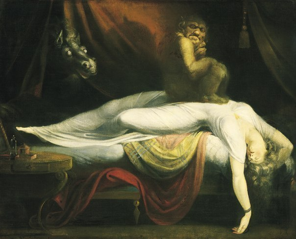 

## 10. Великий красный дракон и морское чудовище, Уильям Блейк. 

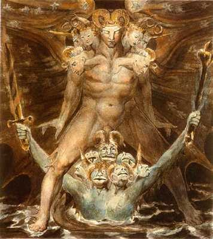 
Великий красный дракон и морское чудовище, Уильям Блейк.   

Сегодня Уильям Блейк хорошо известен своими гравюрами и романтической поэзией, но при жизни он был совсем не знаменит. Его гравюры и иллюстрации выполнены в классическом стиле. В своем творчестве он отталкивался от воображения, а не от реальных исследований природы. Блейк написал серию акварельных картин, изображающих великого красного дракона из Книги Откровений. На картине изображен красный дракон, воплощение дьявола, стоящий над семиглавым морским чудовищем.  

## 9. Исследование портрета Иннокентия Х Веласкеса, Фрэнсис Бэкон. 

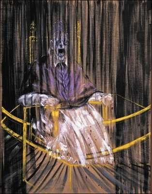 

Ф. Бэкон был одним из самых влиятельных художников 20 века. Его картины дерзкие и холодные в переносном смысле. Они продаются за миллионы фунтов, и даже куски холста (Бэкон уничтожал работы, которые ему не нравились) стоят немало. На протяжении всей жизни он возвращался к портрету Иннокентия X, делая свои интерпретации этой картины. Работа Веласкеса изображает Папу в задумчивости, а у Бэкона он нарисован кричащим.   

## 8. Данте и Вергилий в аду, Адольф Вильям Бугро

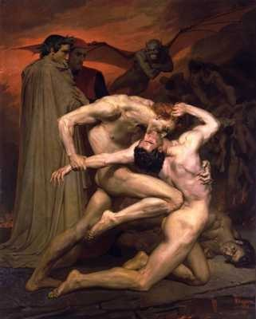 

Ад Данте, с его изображениями пыток, с самого дня публикации вдохновлял многих художников. Бугро – самый знаменитый из всех. Однако он переходит от классического спокойствия к кругам ада, где персонажи непрерывно борются, крадя через укус личности друг друга. Под торжество демона Данте и Вергилий наблюдают за осужденными на вечные муки.   

## 7 Смерть Марата, Эдвард Мунк  

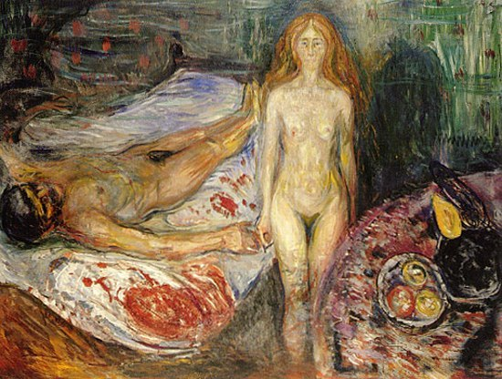
Смерть Марата, Эдвард Мунк   

Эдвард Мунк – самый известный норвежский художник. Его знаменитая картина «Крик» прочно въелась в сознание людей. Жан-Поль Марат был одним из лидеров Французской революции. Страдая от болезни кожи, он проводил большую часть времени в ванной, где он работал над своими записями. Там же он и был убит Шарлоттой Корде. Смерть Марата изображали несколько раз, но работа Мунка отличается своей жестокостью.   

## 6 Отрубленные головы, Теодор Жерико 
      
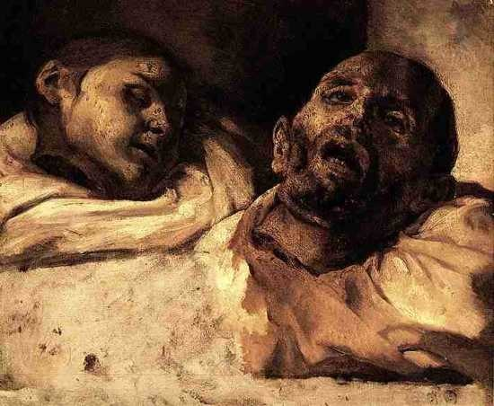 
Отрубленные головы, Теодор Жерико   

Его самая известная работа – это «Плот Медузы», огромная картина, написанная в романтическом стиле. Жерико пытался разбить рамки классицизма, перейдя к романтизму. Эти картины были начальным этапом его творчества. Для своих работ он использовал настоящие конечности и головы, которые находил в моргах и лабораториях. 

## 5   Искушение Святого Антония, Матиас Грюневальд 
   
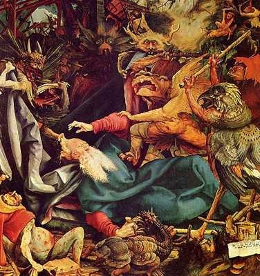
Искушение Святого Антония, Матиас Грюневальд   

Этот художник изображал религиозные сюжеты Средних веков, хотя сам жил во времена Возрождения. Говорили, что святой Антоний столкнулся с испытаниями своей веры во время молитвы в пустыне. Согласно легенде его убили демоны в пещере, затем он воскрес и уничтожил их. Эта картина изображает Святого Антония, подвергнувшегося атаке демонов.   

## 4  Натюрморт из масок, Эмиль Нольде  
 
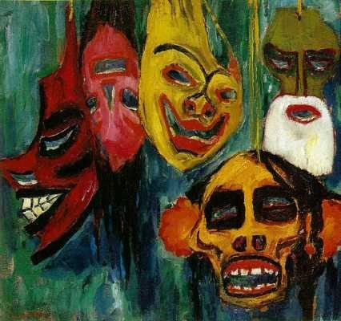
Натюрморт из масок, Эмиль Нольде   

Эмиль Нольде был одним из ранних художников-экспрессионистов, хотя его славу затмили другие, такие как, например, Мунк. Сутью экспрессионизма является изображение реальности с субъективной точки зрения. Нольде написал эту картину после изучения масок в Берлинском музее. На протяжении всей жизни он увлекался другими культурами, и эта работа не является исключением.  

## 3  Сатурн, пожирающий своего сына, Франсиско Гойя  
 
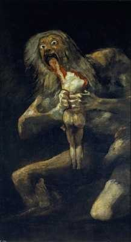 
Сатурн, пожирающий своего сына, Франсиско Гойя   

Согласно римской мифологии, основанной на греческой, отец всех богов пожирал своих собственных детей, чтобы никто из них не смог занять его место. Гойя изобразил на холсте убийство ребенка. Эта картина никогда не задумывалась для широкой публики, она была нарисована на стене его дома вместе с такими же мрачными «Черными картинами».  

## 2.  Юдифь и Олоферн, Караваджо  

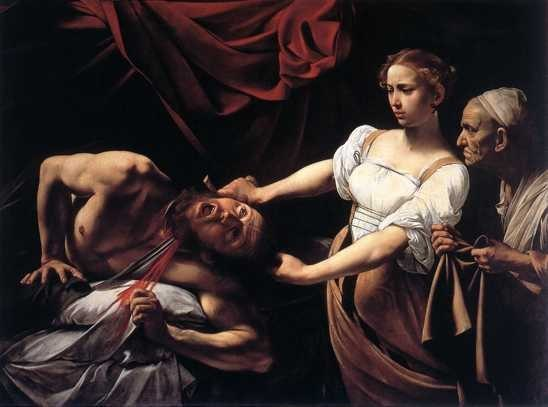 
Юдифь и Олоферн, Караваджо   

Эта картина написана по мотивам ветхозаветной «Книги Юдифи», рассказывающей историю о молодой вдове, Юдифи. Согласно легенде, Олоферн был полководцем армии Навуходоносора, вторгшейся в Иудею. Вавилоняне осадили город Ветилую, в котором жила целомудренная и богобоязненная молодая вдова Юдифь. Надежды для горожан не было никакой. Надев красивые одежды и взяв с собой служанку, она отправилась в стан врага и сделала так, что Олоферн проникся к ней доверием. Когда в один из вечеров он заснул пьяным, она отрезала ему голову и вернулась в родной город. Выражение мрачной решимости на лице служанки резко уравновешивается нечитаемым взглядом Юдифь и криком ужаса самого Олоферна.  

## 1. 

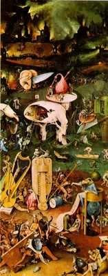 

Иероним Босх, известен своими тревожными и фантастическими картинами религиозной тематики. Сад земных наслаждений – это триптих, изображающий Райский сад, Сад земных наслаждений и Наказания за смертные грехи которые происходят в этом земном саду. Внимательное изучение картины показывает истинный талант Босха, к остроумным деталям. В целом, работы Босха является одними из самых ужасных.  
