# Несбывшийся мир. Как появился ретрофутуризм

>   В старые добрые времена, как известно, и трава была зеленее, и небо голубее, и люди добрее. Тосковать по прошлому доводилось, наверное, каждому — поэтому среди произведений любой эпохи обязательно найдётся целый ворох римейков, сиквелов, экранизаций и стилизаций. Как правило, каждое поколение с нежностью вспоминает о событиях двадцатилетней давности: пару лет назад набирала обороты ностальгия по «лихим девяностым», а в 2030-м кто-нибудь с улыбкой вытащит из пыльного чулана Kinect или Oculus Rift, напрочь позабыв о политических треволнениях далёкого 2015-го.
>
> Да, плохие воспоминания со временем стираются — поэтому такая ностальгия не совсем честна. Но хороший писатель или режиссёр старается остаться честным в любой ситуации — и если он при этом фантаст, то выход оказывается на удивление простым. Раз НФ-предсказатели придумывают то, чего нет, отчего бы НФ-историкам не повздыхать о том, что так и не сбылось?

Эта ностальгия по тому, чего не было — мираж в квадрате — и называется ретрофутуризмом. Наверное, любой поклонник фантастики когда-нибудь тосковал украдкой по золотым 60-м, когда на Марсе цвели яблони, у каждого в доме был робот-домохозяйка, а на другой конец земного шара можно было телепортироваться за долю секунды.

Но прежде чем описывать эту несбывшуюся эпоху и её современных последователей, стоит понять, о каких же именно временах идёт речь — и почему именно они удостоились ласковой приставки «ретро».

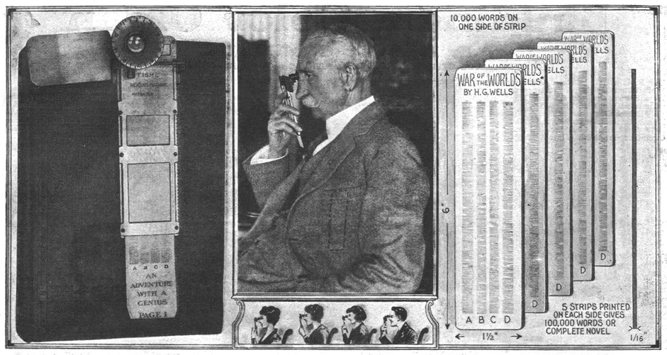
Безумные изобретения начала века: электронная читалка

Строго говоря, под широкое понятие «ретрофутуризм» попадает множество разных стилей: стимпанк и дизельпанк тоже рассказывают о «будущем, которого нас лишили». Эти жанры появились довольно поздно — только в наши дни человечество взглянуло почти на столетие назад и увидело в предсказаниях предков совершенно незнакомый мир с альтернативными технологиями. Именно в начале XX века велись первые жаркие дискуссии о том, как наука может изменить облик планеты.

Пожалуй, самую широкую известность обрели предсказания Жюля Верна: в своих романах он описывал подводные лодки, небоскрёбы, электромеханические калькуляторы, факс и даже оружие с дистанционным управлением. Художник и писатель Альбер Робида не отставал от соотечественника: он изображал летающие машины всех форм и размеров, предрекал электрическое освещение и электропневматические поезда. Надо сказать, в своих мечтаниях писатели были не одиноки: прогнозы на будущее обсуждались в газетах и рисовались на открытках, а едва ли не каждое крупное открытие порождало множество новых идей. Уже тогда в летающие автомобили верили все (выходит, что этого чуда техники мы ждём больше ста лет!); многие опасались, что лошади попросту вымрут за ненадобностью. Тогда же впервые появилась идея пищевых таблеток. Школьное обучение виделось полностью автоматическим, а в рутинных делах вроде одевания и бритья людям должны были помогать сложные установки со множеством клешней и манипуляторов.

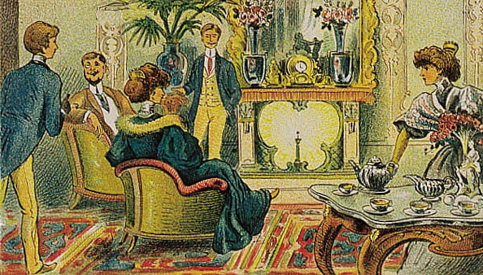
Самое фееричное предсказание 1910 года — камин на радиевом отоплении

Неудивительно, что такое буйство фантазии в конечном счёте породило стимпанк — с высоты прошедших лет несбывшееся викторианское будущее кажется куда более красочным, чем минималистичная современность. Вряд ли Стерлинг и Гибсон, в шутку написав «Машину различий», предполагали, что настолько точно угадают мечты нашего поколения.

Что же общего у рубежа веков и 1960-х годов, почему именно предсказания тех времён так полюбились современным фантастам? Скорее всего, секрет в том, что любой прогноз на будущее несёт в себе черты эпохи — и нам важно вовсе не то, насколько точно автор угадал реалии грядущих дней. Куда интереснее понять, о чём он мечтал и на что надеялся — и разделить с ним эту надежду. Мы видим две эпохи, когда человечество верило в себя: в начале XX века казалось, что учёные вот-вот подчинят себе все тайны природы, а в 1960-х земляне уже готовы были собирать чемоданы и отправляться в межпланетные экспедиции. Любопытно, что раньше к прогрессу относились как к стихии: ещё в 1939 году (на нью-йоркской Всемирной выставке) бытовал девиз «Наука открывает, промышленность применяет, человек подстраивается». Пожалуй, именно в таком сплаве фатализма с оптимизмом и заключён секрет популярности «золотого века».

>   ## Первопроходец в городе будущего
>
>   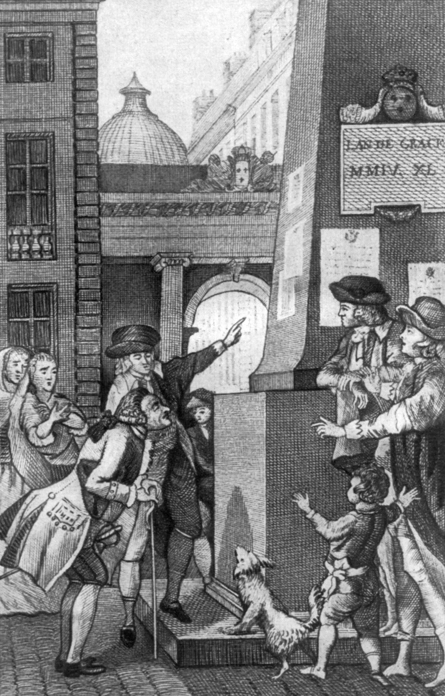
>
>   Пожалуй, викторианская эпоха — самая ранняя, к которой обращается ретрофутуризм. Конечно, предсказания о будущем делались и раньше — но, чтобы задеть читателя за живое, прогнозы должны хоть как-то соотноситься с актуальными мечтами и представлениями о мироустройстве.
>
>   Вот почему вряд ли найдётся фантаст, который станет черпать вдохновение в трудах Луи-Себастьена Мерсье. Однако его роман «Год две тысячи четыреста сороковой» (1770) интересен тем, что это, наверное, самая ранняя фантастическая повесть о будущем. Автор описывает утопическое общество, которое якобы видел во сне. По законам жанра его больше всего восхищают социальное устройство и нравственность жителей будущего, а в своих монологах он то и дело с гневом обличает современников.
>
>   Сейчас пастораль Мерсье кажется дикостью: «вредные» книги в своё время сожгли, в женщинах видят исключительно «примерных жён и матерей», а высшее достижение медицины — это ароматические ванны, с помощью которых победили все болезни. Промахнулся писатель и с социологией: например, в России в 2440 году живёт 45 миллионов человек — и это число кажется герою неправдоподобно большим. В защиту Мерсье можно сказать, что в его эпоху население России составляло 14 миллионов.
>
>   Зато некоторые предсказания для 1770 года кажутся просто невероятными: в музейном зале оптики показывают несуществующие пейзажи (сложно понять, экраны это или голограммы), а специалисты по акустике научились воспроизводить любые звуки — для этого есть специальная машина с пружинами и рычагами. Вокруг города строят гидроэлектростанции, а улицы освещены «негасимыми лампами». В труде людям помогают машины, поднимающие грузы, а в картинных галереях любой желающий может напечатать себе цветную гравюру. Любопытнее всего выглядит местный музыкальный инструмент — «усовершенствованная гармоника», по описанию напоминающая современный синтезатор. Пожалуй, столь точную картину портит только транспорт: в романе упоминаются не только конные повозки, но и носилки — отнюдь не медицинские.

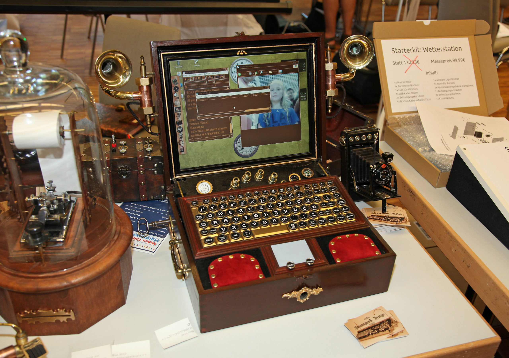
В наше время вместо машины различий вам могут предложить стимпанковый ноутбук. Такое Верну точно не снилось!

Стимпанку и дизельпанку повезло: их эпохи получили меткие прозвища, да и временные промежутки запомнить довольно легко — по мировым войнам. Куда хуже дела обстоят у того самого «золотого века», который предстаёт перед мысленным взором при слове «ретро». Прежде всего, вспоминать эти годы стали задолго до того, как появился удобный корень «панк» — Уильям Гибсон ещё не написал своего «Нейроманта». Кроме того, не было и технологии, по которой можно бы чётко определить эпоху. Порой робко пытаются пробиться термины «атом-панк» и «лучемётная готика» («raygun gothic») — но получается не то герой игры Fallout, не то костёл с охранной системой. Да и с эпохой не всё так гладко: основная волна «ретро» началась после Второй мировой, но основу для стилистики заложили ещё в 1930-х, когда в Нью-Йорке впервые прошла Всемирная выставка, а в кинотеатрах крутили «Флэша Гордона», «Бака Роджерса» и «Метрополис».

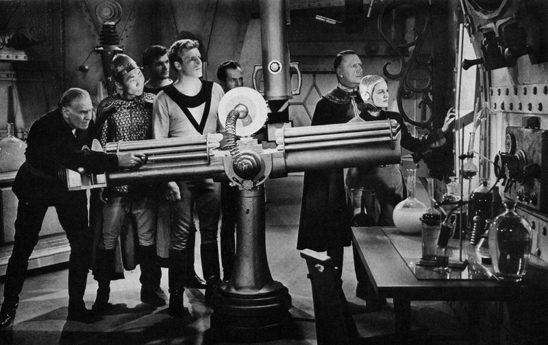
«Бак Роджерс» (1939): в XXV веке уже есть лучемёты, но ещё сохранился лёгкий флёр стимпанка

По обе стороны океана ретрофутуризм формировался независимо, но очень схожими путями: ведь технологии в мире развивались примерно одинаковыми темпами, и облик «городов завтрашнего дня» не сильно различался. В Советском Союзе оптимистичный взгляд в будущее был попросту государственной политикой: после победы, а особенно во времена хрущёвской оттепели жители СССР действительно поверили, что коммунизм не за горами, а советская наука способна справиться с любой задачей. После полёта Гагарина в космос всем казалось, что и межзвёздные путешествия уже не за горами, а в многочисленных НИИ понедельник какое-то время действительно начинался в субботу: неутомимое поколение «шестидесятников» было искренне влюблено в науку.

Именно таким настроением были проникнуты книги, которые теперь считаются классикой отечественной фантастики. И в романах Ивана Ефремова, и в мире Полудня братьев Стругацких схожая картина: Земля стала единым государством, с нехваткой ресурсов справились за счёт синтеза и автоматизации производства, а человечество вовсю осваивает другие планеты. Не отставали и детские книги: Николай Носов рассказывал о чудо-технологиях Солнечного города (например, крутящиеся дома — реальная идея тех времён), а у Кира Булычёва современники Алисы буднично пользовались флаерами, телепортами, космическими ракетами, а из особого состава выращивали здания, которые сделали бы честь самому Гауди.

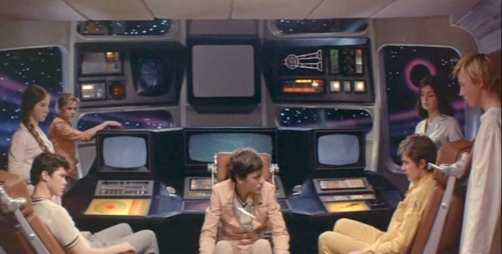
А теперь посчитаем на телевизоре гиперпрыжок… («Отроки во Вселенной»)

Перестройка и развал СССР подействовали на многих как холодный душ. Романтика шестидесятых потускнела и стала казаться по-детски наивной. Но со временем даже тем, кто радовался политическим переменам, стало обидно за старую мечту — недаром ехидный Пелевин называл Россию страной подготовленных космонавтов, оставшихся без задания. Изрядная часть современной фантастики обрела ностальгический оттенок: многие до сих пор не отказались бы попасть если не в утопию Ефремова, то хотя бы в сказку Булычёва.

Казалось бы, тоска по идеализированным былым временам — дело гиблое и неблагодарное. Однако Америка, в которой не случалось таких потрясений, как в СССР, прошла через те же самые этапы: оптимизм, цинизм и ностальгия. Немного другими оказались только даты.

В США зарождение ретрофутуризма прочно связано с понятием «бэби-бума». Сразу после Второй мировой войны будущее казалось радужным и безоблачным, — ведь всемирное зло повержено, а прогресс шествует семимильными шагами. Рождаемость резко подскочила и держалась на невиданной высоте до середины 1960-х — детей стало столько, что правительству пришлось срочно строить новые школы. Именно подросшие «бэби-бумеры» стали первыми в истории тинейджерами: до того существовали только дети и взрослые, а подростковый возраст никто отдельно не учитывал. И в один прекрасный момент именно это поколение, пережив Холодную войну и Вьетнам, с грустью вспомнило свои детские годы и несбывшиеся мечты о будущем.

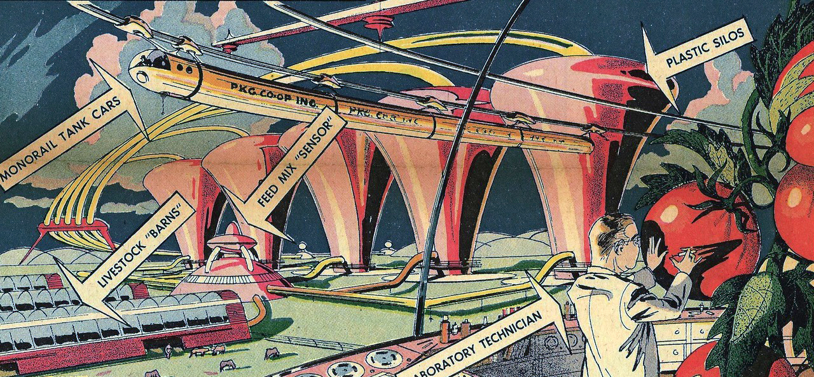
ГМО эти помидоры точно не содержат. Наверное, снова радий (1958)

О чём же мечтали футурологи в послевоенные годы?

Прежде всего, дома — и даже города — обязательно надо было строить под стеклянными куполами, чтобы каждый американец мог укрыться в собственном дворе от непогоды. После бэби-бума все начали бояться перенаселения и голода, поэтому очень много внимания уделялось пропитанию. Одни предлагали строить гигантские городские зернохранилища, другие — выращивать гигантские овощи, третьи — перейти на пищевые таблетки. Когда состоялась так называемая «зелёная революция» — резкий скачок в аграрных технологиях, — такие проекты стали казаться абсурдными, но в те времена вопрос пропитания действительно был важен.

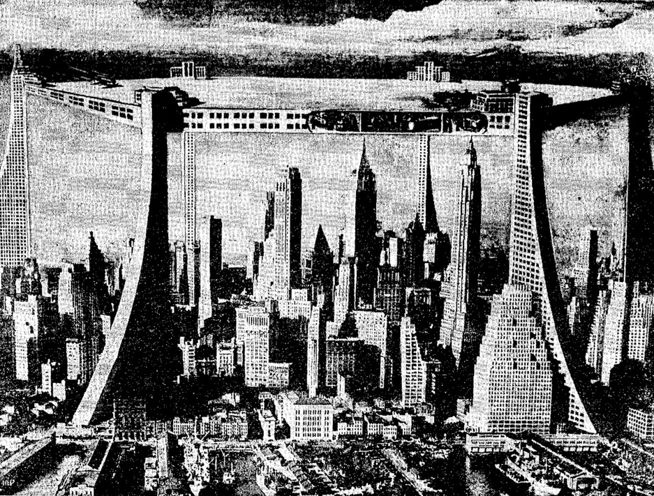
А над Нью-Йорком мы сделаем крышу, чтобы… а чтобы было! (1949)

Другой серьёзной проблемой, как и во все времена, были пробки на дорогах — и здесь фантазия футурологов разошлась на полную катушку. В качестве основного решения предлагали просторные автострады, нередко — на многоуровневых эстакадах. Покрытие таких дорог должно было само очищаться от снега и льда, а машины можно было сделать электрическими. Или летающими — зачем мелочиться?

Обычные улицы в городе будущего принадлежали бы пешеходам, но почему-то при этом обязательно нужны были движущиеся тротуары. Пожалуй, дальше американцев эту идею развил только сказочник Джанни Родари: он описывал вдобавок движущиеся скамейки, на которых пенсионеры могли сидеть и гулять одновременно.

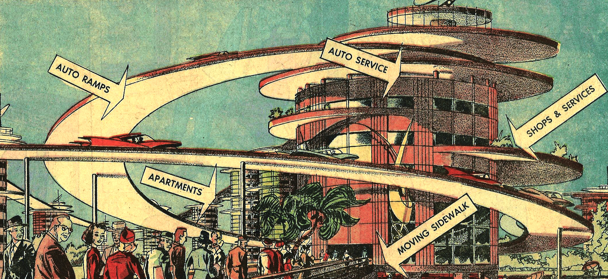
Изящное решение транспортной проблемы: теперь аварии будут случаться прямо у вас над головой! (1958)

Самое интересное, что все эти мечты тогда казались не только уделом фантастов. В 1950-х годах в таком же духе были обставлены павильоны Всемирной выставки в Нью-Йорке, где каждая страна хвасталась своим прогрессом в области технологий, а Уолт Дисней — ярый поборник прогресса — открыл аттракцион «Дом будущего» с аниматронными роботами и планировал возвести целый фантастический город. Именно его проекты и наработки вдохновили создателей фильма «Земля будущего»: изучив архивные материалы Диснея, сценаристы мысленно перенеслись в 1952 год — и предались мечтам.

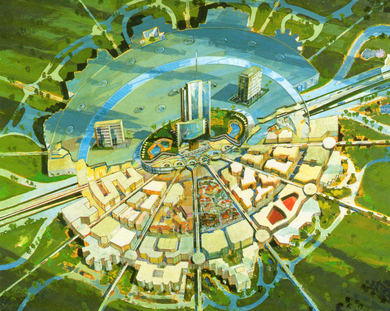
Вместо этого проекта пришлось ограничиться скромным парком Disneyland

В годы Всемирной выставки даже в повседневной архитектуре начал появляться футуристичный стиль «гуги» — и выглядел он под стать своему прозвищу. Словно бы торопясь оказаться в городе будущего, архитекторы старались строить самые заурядные здания — заправки, мотели и забегаловки — как можно необычнее. Улицы обрастали фантастическими декорациями: скошенные фасады, дуги и арки, круглые окна, контуры летающих тарелок… Неудивительно, что вскоре фантасты уже сами стали заимствовать антураж из жизни: начиная с культового мультсериала «Джетсоны» (1962) стиль «googie» стал прочно ассоциироваться с инопланетными мирами будущего.

Именно благодаря этой комедии, где рассказывалось о типичной семье 2060-х (папа, работающий кнопконажимателем, мама-домохозяйка, дети, робот и пёс), в Америке распространился классический набор штампов ретрофутуризма. Нельзя сказать, что в сериале было много оригинальных идей, но именно им засматривались в детстве «бэби-бумеры», прильнув к чёрно-белым экранам, — и крепко запомнили, каким именно должно быть будущее. До сих пор можно услышать возмущённые возгласы: «Если 2000 год уже прошёл, то где мой ракетный ранец?»

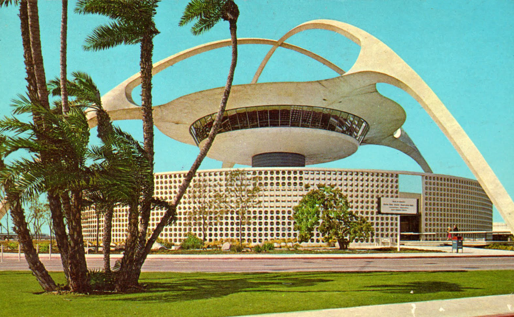
Не треножник марсиан, а всего лишь типичное «гуги»!

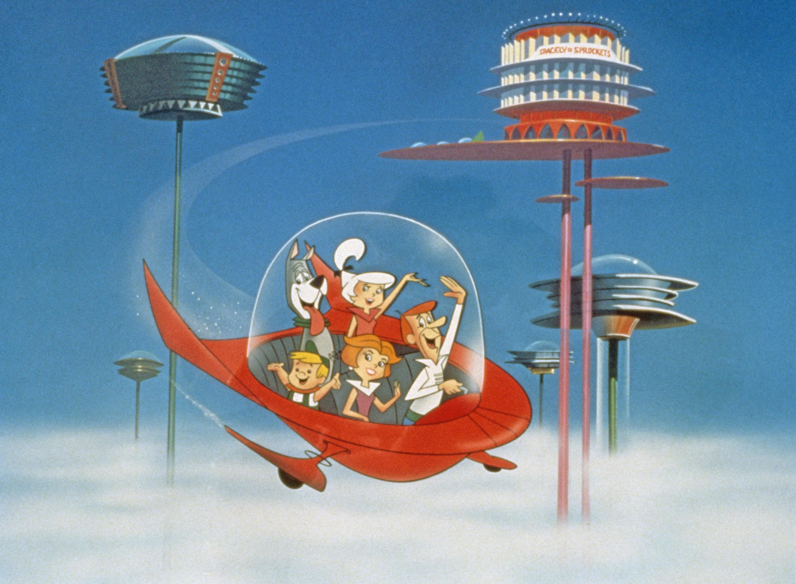
Джетсоны в Облачном городе — за 18 лет до Лэндо Калриссиана!

В начале 1970-х годов, когда послевоенные дети подросли, идиллия постепенно сошла на нет: росла преступность, некогда безобидные наркотики становились всё опаснее, бушевала Вьетнамская война, был в разгаре Уотергейтский скандал. В те годы фантастика переживала спад: размышления о нездешних мирах стали казаться слишком наивными по сравнению с суровой реальностью. Но чем больше «чернухи» появлялось на экранах и прилавках книжных магазинов, тем яснее «бэби-бумеры» понимали, что им очень не хватает светлых и жизнерадостных произведений.

«У детей 10-12 лет нет мира фантазий, который был у нас. У них нет ни вестернов, ни фильмов о пиратах, ни всех этих дурацких фантастических сериалов, в которые мы искренне верили, — сокрушался в те годы Джордж Лукас. — Я сам жуткий циник, но оптимизм надо возрождать». Что ж, у маэстро слова с делом не разошлись — именно его фильм заново разжёг в массовом зрителе интерес к полузабытому жанру.

Пожалуй, именно на конец 1970-х пришлось появление ретрофутуризма как такового — уже обращённого в прошлое, с ностальгической ноткой. Ещё в самих «Звёздных войнах» активно обыгрывались сериалы 1930-х годов, а следом дошло дело и до римейков (например, в 1979 году пересняли «Бака Роджерса»). Былая наивность обрела особый шарм: новое поколение фантастов уже успело понять, что далеко не все прогнозы сбываются так, как им бы хотелось, — но они, затаив улыбку, продолжали воспроизводить старые штампы. С тех пор закон ностальгической фантастики прост: чем безумнее и ошибочнее предсказание — тем лучше!

>   ## Иллюзион господина Белла
>
>   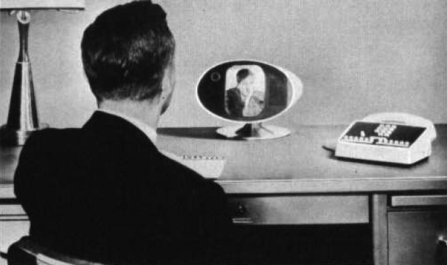
>
>   Одни предсказания фантастов сбылись, другие оказались неосуществимыми, но самая интересная судьба выпала видеофону. Впервые об этом приборе задумались ещё в начале XX века — сохранились рисунки, на которых джентльмены переговариваются с помощью архаичной телефонной трубки и кинопроектора. На протяжении всего XX века такое средство связи пытались соорудить на основе телевизионных технологий — и уже в 1950-х годах существовали вполне удачные прототипы. В те годы американцы мечтали, что благодаря моментальным видеозвонкам можно будет работать в любой точке земного шара, не выходя из дома. Из года в год изобретение пытались довести до ума, обещая выпустить его на рынок «всего через пару лет»… а потом снова забывали. Решение пришло с неожиданной стороны: видеоконференции оказались всего лишь одной из функций компьютера. Выходит, что технология, о которой так долго мечтали фантасты, так никогда и не будет создана — и при этом уже доступна каждому.
>
>   Забавно, что никто из писателей и режиссёров не учёл человеческий фактор: далеко не всем и не всегда комфортно красоваться перед камерой во время разговора. Сейчас функцию «видео» в «Скайпе» мало кто держит постоянно включённой — большинство по-прежнему предпочитает общаться голосом, а то и текстом.

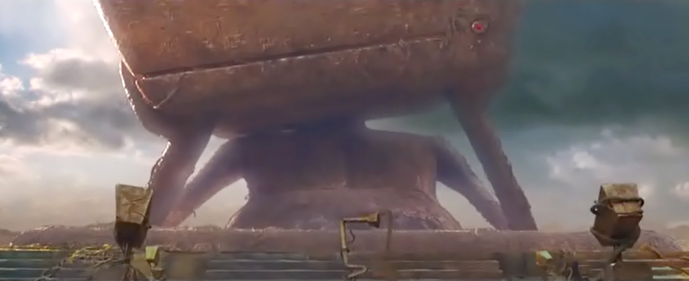
В «Автостопом по галактике» один суперкомпьютер был подобающе гигантским, а второй — вообще размером с планету

Самые заметные промахи футуристов середины века, конечно же, касаются компьютерной индустрии. В старой фантастике компьютеры были всего лишь мощными калькуляторами. Работали они, разумеется, на лампах или транзисторах, информацию выводили в лучшем случае на пузатые кинескопы — и при этом действовало правило «чем больше, тем лучше». Правильная супермашина должна занимать территорию хорошего завода! Само собой, сейчас эта «гонка размеров» стала бесценным подарком для сатириков. Стоит вспомнить, как в комедии «Железное небо» нацистский учёный с Луны (да, градус безумия в фильме именно такой) презрительно смотрит на айфон: разве ж это компьютер?

Не забудем и про носители информации: сколь бы развитое общество ни описывалось в книгах Хайнлайна, Азимова или Бестера, их герои обязательно будут пользоваться усовершенствованными версиями магнитных лент или микроплёнок. Устройства для распознавания голоса? Легко! Искусственный интеллект? Пожалуйста! Формат данных? Кхм… перфокарты. Над проблемой форматов в своё время изрядно посмеялись создатели аниме «Ковбой Бибоп»: послание из прошлого оказалось записанным на такой устаревшей видеокассете, что во всей Солнечной системе осталось всего два музейных магнитофона, способных её прочитать.

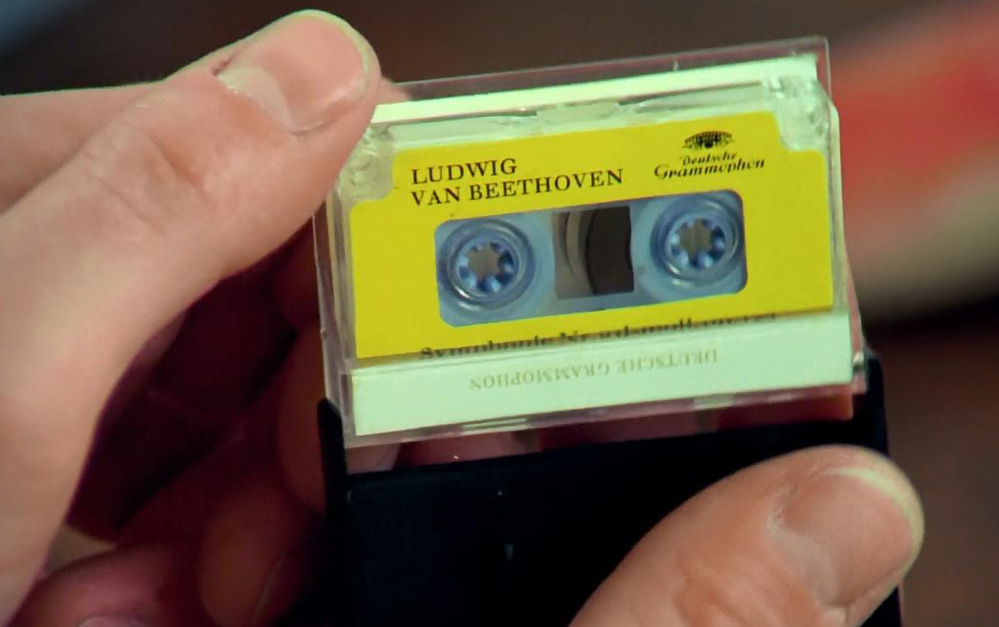
«Заводной апельсин». Что может быть современнее кассеты? Конечно, маленькая кассета!

Стоит заметить, что во всей старой фантастике бросается в глаза парадокс: компьютеры явно архаичны, но зато роботехника достигла таких высот, о которых в наше время даже не мечтают. На самом деле в те годы просто никому не приходило в голову, что искусственный интеллект и компьютер — это одна и та же технология. Кроме того, весь опыт человечества противоречил тому факту, что ходьба, речь и узнавание людей — это сложно, а высшая математика — тривиальная задача. Так и стали появляться узкоспециализированные роботы-уборщики, роботы-официанты и роботы-навигаторы, зачем-то обладавшие гуманоидным телом и совершенно не умевшие считать.

Конечно, идиллия середины века — как и любая утопия — стала лёгкой мишенью для пародий. Ким Ньюман в рассказе «Город будущего» описывает коммуну, построенную по всем заветам фантастики — с монорельсами, пищевыми пилюлями и идеальным обществом. Проблема кроется в том, что футуристичные изобретения местных жителей обычно работают гораздо хуже современных аналогов, а общество на поверку оказывается настолько неидеальным, что основой сюжета становится расследование убийства. В рассказе Уильяма Гибсона «Континуум Гернсбека» герой и вовсе решает, что даже киберпанковый мир гораздо приятнее «лучемётной готики»: когда вокруг него начинают материализовываться фантазии утопистов 1930-х, он в ужасе пытается вернуть привычные небоскрёбы обратно.

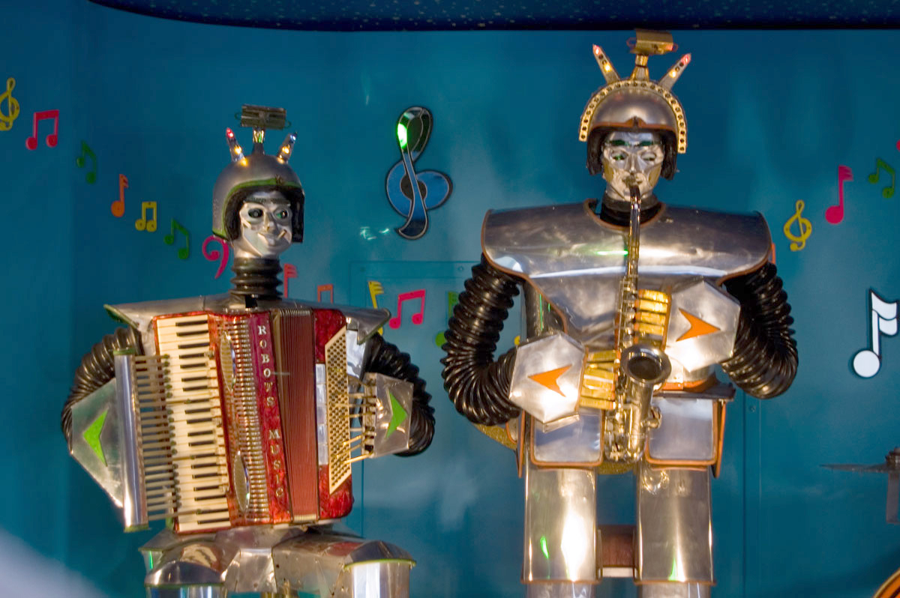
Этих бедняг построили в 1960-х — а могли бы просто взять синтезатор!

А вот над мечтами об освоении космоса ретрофутуристы смеются редко — напротив, мечтательно перечитывают смелые прогнозы и надеются, что хотя бы малую их часть когда-нибудь удастся воплотить. Пожалуй, «караваны ракет» устарели только внешне: корабли в ностальгических фильмах обязательно блестящие и серебристые, скафандры напоминают комбинезоны из фольги, а интерьеры космических станций радуют глаз белым пластиком и округлыми очертаниями в духе «гуги».

Зато в таких произведениях человечество обязательно колонизирует Солнечную систему, а то и более отдалённые уголки Вселенной. В последние годы стали снова появляться фильмы в духе «твёрдой» НФ, которые непременно хоть в чём-то ссылаются на «золотой век». Антураж «Луны-2112» перекликается с «Космической одиссеей-2001», в новом «Звёздном пути» бережно воссоздан дизайн классического сериала, и только прошлогодний фильм с говорящим названием «Космическая станция-76» уже откровенно пародирует предшественников.

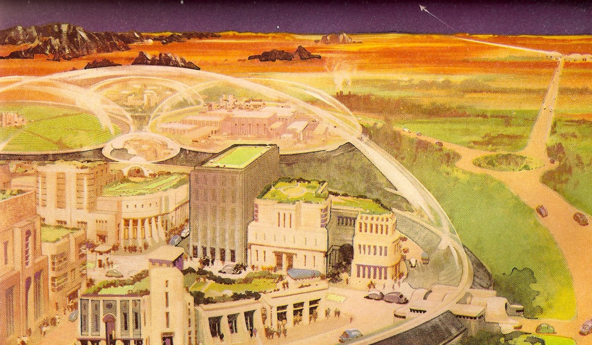
Яблонь нет, но газон на Марсе растёт отменный (1951)

Вот почему ретрофутуризм не только приятен, но и полезен: он заставляет порой вспомнить — и, быть может, воплотить — полузабытые идеи из прошлого. Существующие проекты поселений на Марсе выглядят пока не слишком обнадёживающе, но именно воспоминания о 1960-х заставляют людей предлагать всё новые и новые способы вырваться с планеты. Хочется верить, что рано или поздно — возможно, как раз во время очередного ренессанса ретро-фантастики, — у них это получится.
