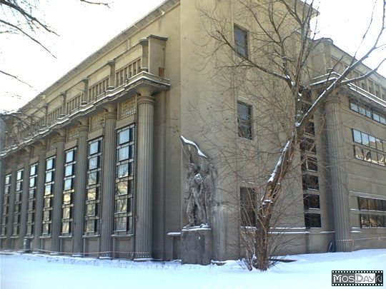
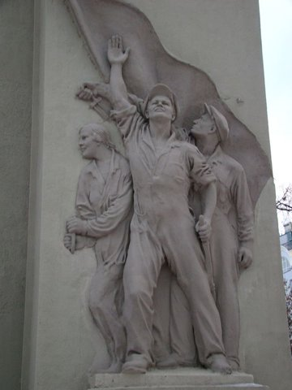

!! Непристойный барельеф на Большой Никитской

На этой неделе мне пришлось дважды побывать по делам на Большой Никитской улице. Не отказала себе в удовольствии посидеть на лавочке в маленьком скверике у дома № 7, любуясь на весеннюю Москву, а заодно и на барельеф, с которым связаны московские легенды...

Когда-то в Москве, на Большой Никитской улице стоял Никитский женский монастырь, в честь которого улица, собственно, и получила свое имя.
Никитский монастырь в Москве

 

Монастырь был старинным. Основал его в 1582 году боярин Никита Романович Захарьин-Юрьев, брат первой жены Ивана Грозного Анастасии Романовны и дед первого царя из Дома Романовых Михаила Федоровича (да и Романовыми род Захарьиных-Юрьевых стал прозываться в честь отца Анастасии и Никиты).

В 19 столетии в церкви монастыря нередко бывали литераторы, жившие неподалеку. Например, Гончаров вспоминал, как встретил здесь Пушкина. "Александра Сергеевича, - вспоминал Гончаров, - я увидел впервые в Москве, в церкви Никитского монастыря. Я тогда только что начал вчитываться в него и смотрел на него более с любопытством, чем с другим чувством".

Когда в 1920 году улице присвоили имя Герцена, композитор Метнер ехидно спросил: "А монастырь теперь тоже переименуют? И он будет называться монастырь имени Герцена?"

Но монастырь просто снесли. А на его месте в 1935 году была построена первая подстанция Московского метрополитена. Автором проекта станции стал Д.Ф. Фридман. В сущности, для своего времени это был вполне обычный и даже достойный проект административно-производственной постройки. Если бы не одно но...

 

Это "но" - скульптурный барельеф, украшающий правое крыло здания. Вроде бы, тоже ничего особенного - обычная троица пролетариев, готовых к трудовым свершениям. В Москве долго ходила легенда, что моделями для композиции послужили Владимир Маяковский, а также Лиля и Осип Брики. Но это осталось, что называется "за кадром"...

 
Вот такая пролетарская группа товарищей...

Это если сделать снимок анфас. А если снимать барельеф в другом ракурсе...

Ставлю дополнительный кат и предупреждаю - это очень неприлично! 18+

И вообще - не только несовершеннолетним, но и хорошо воспитанным дамам, ханжески настроенным и слабонервным людям, а также больным и беременным - не смотреть!

Вас же предупреждали!!!

Случайно ли так получилось, или авторы барельефа сознательно хулиганили - осталось тайной. И кому адресовано послание - изгнанным отсюда монахиням или советской власти, занятой пропагандой трудовых свершений - тоже вопрос.

Скульптурной группе придумано множество смешных названий, не все из которых цензурные. Но как украшала она здание на Большой Никитской (вернувшей в 1993 году свое название), так и украшает. А москвичи и гости столицы по-прежнему ищут нужный ракурс для пошлых фотографий...

Фото барельефа отсюда: http://forum.jigyarov.net/showthread.php?t=5082
