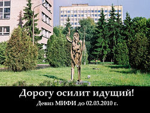

# Прозвища памятников

Придумывание смешных прозвищ памятникам — увлекательная дисциплина, распространённая в России примерно с XIX века. В ней участники соревнуются в остроумии и наблюдательности, стараясь придумать наиболее остроумное прозвище того или иного памятника. Победителем считается тот, чьё прозвище «ушло в народ».

## История появления

Наибольшую популярность дисциплина приобрела при коммунизме, когда новоявленные Микеланджелы и Родены понатыкали везде over 9000 памятников Ленину. Хотя позы памятников и контролировались цензурой™, но и у цензуры случался фейл, и на свет появлялись такие перлы, как «Маркс, вылезающий из холодильника» (см. тж. реакцию Раневской на памятник Марксу — «Это же холодильник с бородой!») или «У Достоевского геморрой», но об этом ниже.

Второй виток популярности пришелся на конец 90-х годов, когда появился Зураб Церетели со своим громадным памятником Петру Первому. После этого скульпторам был дан карт-бланш, и все заверте...

## Эпичные прозвища памятников

### В России

#### В Москве

|Местонахождение                    |Официальное название               |Народное   |Комментарий    |Фото   |
|-----------------------------------|-----------------------------------|-----------|---------------|-------|
|У Библиотеки им. Ленина            |Памятник Достоевскому              |Памятник русскому геморрою; На приёме у проктолога; Болезнь Бехтерева; Эк скрутило!; Дрочащий Достоевский.	|Федор Михайлович сидит в очень странной позе.	||
|Площадь Революции                  |Памятник Карлу Марксу              |Карл Маркс вылезает из холодильника; Холодильник с бородой (дала лично Фаина Раневская); Маркс-лавочник за прилавком	|Такого рода памятников довольно много| |
|Большая Лубянка за зданием МВД     |Памятник Воровскому                |Памятник радикулиту						|Эк его скрутило бедного!||
|Театральный проезд                 |Памятник первопечатнику Федорову   |Первопечатник Федоров изучает прайс-лист автосалонов Ferrari и Mazzeratti	|Все просто: около памятника построили салоны спорткаров, а под ним — салон Bentley.||
|Площадь Никитских Ворот            |Памятник Тимирязеву                |Онанист или писающий Тимирязев	|Тимирязев сложил руки поверх паха а-ля Гитлер; при взгляде снизу и с левого боку из кулака торчит... OH SHI- (так называемый эффект Тимирязева).|&nbsp;|
|Площадь Никитских Ворот            |Фонтан со скульптурой «Пушкин и Наталья Гончарова» |Тараканы в банке	|Опять же, безграмотность того, кто оформлял этот фонтан| |
|Аллея Космонавтов, около ВДНХ      |Монумент «Покорителям космоса»     |Мечта импотента (вообще популярное название для всяческих шпилей и прочих обелисков)		|No comment||
|ВДНХ                               |Ракета «Восток»                    |Сушёный Гагарин								|И это всё о нём, да.|&nbsp;|
|Улица Космонавта Волкова           |Памятник космонавту Волкову        |Голова профессора Доуэля aka просто Голова	|Состоит из: голова (одна), труба (одна), завитушка-символизирующая-орбиту (одна). Голова стоит на Трубе и обёрнута Завитушкой.| |
|Площадь Европы у Киевского вокзала |Фонтан «Похищение Европы»          |Памятник неизвестному админу				|Композиция имеет определенное сходство с пучком IDE-шлейфов, беспорядочно торчащих из системного блока.| |
|Площадь Европы у Киевского вокзала |Логотип ТЦ «Европейский»           |Каноничный памятник Internet Explorer	| &nbsp; ||
|Площадь Гагарина                   |Памятник Гагарину                  |Якорь; Бэтмен; Терминатор; Железный дровосек; Памятник Робокопу, также любим в народе под названием Чемоданы спиздили	|Космонавт весь металлический и растопырил руки. Алсо, стоит на самом высоком постаменте в Москве. Троллинг понаехавших внутримкадышами: «А знаешь, что ровно с двенадцатым ударом часов 12 апреля каждого года памятник вскидывает руки вверх, и на всю площадь раздается громогласное: {-"ПОНАЕХАЛИ!"-} "ПОЕХАЛИ!"»||
|Гоголевский бульвар                |Памятник Шолохову                  |Скотобойня											|Скульптор хотел изобразить лошадей, плывущих по воде, но получилось так, что головы оказались как будто отрубленными.|%%|
|Поклонная гора                     |«Трагедия народов», автор — Зураб Церетели						|Домино или Восставшие из ада	|&nbsp;||
|Калужская площадь                  |Памятник Ленину                    |Лысый камень, Илуватар							|Под этим памятником по четвергам собирается Поганище — одна из известных неформальных тусовок. И как-то раз на Ночь Творила памятнику поставили ирокез. Панкота, проявив альпинистскую сноровку, залезла к дедушке на лысину и умостила там зелёную мочалку. И всё это под окнами МВД!||
|Стрелка Москвы-реки                |Памятник Петру I работы Зураба Церетели	|Трусы сушатся, Мужик с газетой	|Паруса на судне чуть подобраны — не в походном и не в раскрытом положении. Очень похожи на повешенные сушиться трусы. А подзорная труба в руках у Петра похожа на свёрнутую в трубочку газету.||
|МИФИ                               |Одинокий Странник                  |Дорогу осилит идущий (девиз МИФИ, однако!), он же Таракан (за сходство)	|Мотивационная статуя, поставленная в МИФИ, дабы ректоры-пацифисты реже думали, что они трудятся на ядерную войну и солдатскую усушку рейтузов во всяких РТ-2ПМ «Тополь».||
|МИФИ                               |Поклонный крест                    |Ниасилил	|ПГМ-высер местного ректора с целью ануслизинга Путину и Поцреарху. Водрузили на место «Таракана».||
|Лермонтовская площадь              |Памятник Лермонтову                |Мужик в пиджаке	|Описание, данное Федей из «Джентльменов удачи", пошло в народ. А вот дерево так и не было обнаружено ввиду того, что снимали его совсем в другом месте.|&nbsp;|
|Гостиница Измайлово                |Гостиничный комплекс Измайлово	    |Абвгдейка				|Комплекс состоит из корпусов Альфа, Бета и Гамма — отсюда и название, как у советской детской телепередачи.|&nbsp;|
|Поклонная гора                     |Монумент победы                    |Баба на игле			|По замыслу Церетели, должен был изображать богиню победы Нику на трёхгранном штыке. Несоответствие масштабов довершило дело.|&nbsp;|

#### В Подмосковье

*  В Новой Москве на вьезде в {-наукоград-} ныне городской округ Троицк стоит «Троллицкий магнит»: поставленная вместо гранита пластмассовая стелла, де-юре символизирующая камертон, вместе с именем города напоминает про «науку троллей» из Rage Comics, да и запихнутый в магнит «атом по Резерфорду» заставляет вспомнить «ядерного тролля» оттуда же.
*  В подмосковном Ступино, на въезде в город стоит памятник, получивший в народе меткое прозвище «Могила Карлсона». Представляет собой несущий винт вертолета Ми-26 и символизирует, какбэ, авиационную промышленность, за счет которой поднялся город. Фразочки вроде: «Жду тебя у Могилы Карлсона» — обычно вызывают у непосвященных приезжих легкое недоумение.
* В Мытищах есть памятник 200-летию водопровода, именуемый в народе «Памятник погибшему/неизвестному сантехнику» или «Три мурашки» (по фамилии тогдашнего мэра Мурашова).

#### В Петербурге

* Самое знаменитое и ставшее официальным прозвище — памятник Петру I на Сенатской площади ещё Пушкин назвал Медным всадником.
* Мост шестнадцати яиц, очевидно же! — Аничков, если кто не понял. В те времена, когда на мосту дежурил постовой, в прозвище моста фигурировало число 18.
* Про памятники Петру I (Медный всадник) и Николаю I: «Дурак умного догоняет, да Исаакий мешает».
* Памятник Екатерине II перед Александринским театром называют «Катькин садик» (место встреч ахтунгов с царских времён).
* Стелу в память о блокаде Ленинграда на площади Победы называют «Стамеской» и «Мечтой импотента».
* Стелу на пл. Восстания — «Пипеткой» и «Штыком».
* Памятник «XXI веку» — памятник трансвеститу.
* Памятнику Александру III посвящена целая ода — «На плацу стоит комод, на комоде бегемот, на бегемоте обормот, на обормоте шапка, на шапке крест. Кто слово скажет — того под арест».
* Памятник Ломоносову у Университета — «Больной геморроем».
* Памятник Петру I в Петропавловской крепости — «Медный сидень», «Пётр Четвёртый», памятник графу Дракуле.
* Памятник Ленину на Московской площади (ст. м. «Московская») — «Писающий/дрочащий Ленин». Если идти справа от площади по направлению к Московскому проспекту, потом повернуть налево и идти, всё это время смотря на Ленина, то у него будет медленно, но неумолимо появляться залупа (рука с кепкой, на самом деле). После установки фонтанов на площади можно иногда подловить момент, когда из «залупы» течет струя. Также он носит название «Большое чучело» или «Балерина»
* Памятник Ленину на площади его же имени (у Финбана) — самый известный памятник Грибу в этой стране. В былые времена о нём сказывали словами из известной советской загадки об Ильиче «Это что за большевик? Он залез на броневик, руку выставил вперёд, баламутит весь народ». После теракта в 2009 был окрещён школотронами «Пукан бомбанул».
* Памятник Сахарову на площади Сахарова — «Зомби», «Человек-какашка», «Узник Бухенвальда».

#### В Самаре

|Местонахождение    |Официальное название   |Народное   |Комментарий    |Фото   |
|-------------------|-----------------------|-----------|---------------|-------|
|Здание ж/д вокзала	|Вокзал								|Конец Льва Толстого	|С одной стороны силуэт здания, напоминающий МПХ; с другой стороны оно находится в конце улицы Льва Толстого — получаем «конец Льва Толстого». Каламбур такой.| |
|Пересечение улиц Красноармейской и Чапаевской	|«Красное знамя», памятник борцам за революцию	|Трехголовый памятник, Змей-Горыныч	|&nbsp;|&nbsp;|
|Площадь Славы			|Монумент Славы (в честь авиапромышленности Самары)	|Федя с галочкой; Паниковский с гусем, Славик с зачеткой; Непьющий	|В виде человека, несущего крылья.|&nbsp;|

#### В Саратове

|Местонахождение    |Официальное название   |Народное   |Комментарий    |Фото   |
|-------------------|-----------------------|-----------|---------------|-------|
|На Московской между Горького и Радищева, на территории правительства	|«Сердце губернии»	|Буратино с загнутым носом; Инфаркт миокарда	|Памятник представляет собой НЕХ. Очевидно, состояние сердца отражает собой положение дел в губернии.| |
|У Крытого рынка											|Фонтан «Одуванчик»						|Памятник чупа-чупсу; потеющий ёжик	|Фонтан представляет собой столб, а на нём шар из трубочек, расходящихся во все стороны. В отличие от предыдущего памятника, в народе любим.||
|На Театральной площади							|Памятник Ленину							|Ленин с пальцем			|Должен был, как и тысячи его клонов, показывать пальцем в светлое будущее. Но скульпторы-ударники сдали памятник досрочно, пока цемент (бетон, или из чего он там) ещё не застыл, в итоге палец пессимистично накренился. Разумеется, с определённой точки зрения выглядит как МПХ.||
|Набережная Космонавтов, у Ротонды	|Памятник влюблённым					|Памятник однополой любви; Голубые коматозники	|Состоит из кольца и двух абсолютно одинаковых профилей, определить пол которых не представляется возможным.||
|Площадь Ленина, рядом с ДК «Россия»	|Памятник Ленину							|Ленин с мешком				|Ильич какбе самозарождается из неотёсанной глыбы камня. Остатки глыбы за его спиной и отведённой рукой выглядят как мешок, который он волочит за собой.| |
|Площадка напротив парадного подъезда СГСЭУ	|Памятник студенту		|Бедный студент				|Зелёная и полуголая диспропорциональная фигура сидит на книгах, держа себя за уши.	| |
|Проспект Кирова, рядом с гостиницей "Волга"	|Огней так много золотых	|Женатик							|Под логотипом Мегафона стоит чувак с букетом. А рядом процитирован отрывок из знаменитой песни. Так как песня поётся от лица девушки, влюбившейся в женатого, то по логике это тот самый женатик, наставляющий рога любимой супруге.	| |
|Набережная												|Памятник Гагарину						|Гагарка; Гагашка			|Если встать с определенной стороны, то палец правой руки сабжа похож на МПХ расположением и формой. А вообще сам памятник страшен сверх всякой меры.	| |
|Площадь Столыпина, рядом с государственной Думой	|Памятник Столыпину	|Пятый элемент	|Фигуру Столыпина с четырех сторон окружают священник, крестьянин, кузнец и воин, а сам сабж, соответственно, и получил имя пятого элемента.||

#### В Твери

Напротив Суворовского училища в Твери раскинулся скверик И. А. Крылова. Памятник известному баснописцу стоит в окружении каменных инсценировок его произведений. Лишь раз в году его тучная угрюмая фигура с вечным голубем на голове приобретает комичный вид: очередной выпуск суворовцев красным цветом рисует ему лампасы. Крылов шутку юмора одобряэ.

Напротив того же училища раскинулась небольшая полянка над прудиком. Первым делом пришедшие видят камень странной формы, который при рассмотрении в разных ракурсах предстает в разных видах. Виды определяют прозвища: «Жаба», «Утконос». На жабе (утконосе и т. п.) укреплена табличка с именем проектировщика и лично ваятеля, из чего можно сделать разумный вывод, что это не игра природы, а творение рук человеческих (памятник жертвам политических репрессий, если что).

Недалеко от этого монумента находится памятник Калинину (в честь которого город раньше назывался), который стоит аккурат напротив Тверской медакадемии. Так вот, каждый выпуск студенты наряжают его в медицинский халат.

На набережной Афанасия Никитина находится памятник одноименному деятелю. Прозвище: «Памятник бомжу» — из-за помятой свисающей одежды и помятого вида.

У Морозовских казарм есть многоэтажный дом из красного кирпича — «Париж». Его прозвище пошло с дореволюционных времён, когда даже рабочие Морозовских фабрик знали, что он похож на Нотрдам-де-Пари. У Михаила Круга есть строки: «Двор Пролетарки, казармы, Париж, где-то ямщик едет там за углом…», так это про него.

Там же в Пролетарском районе, рядом с казармами стоит устрашающая группа (скульптор — некто Антонов, в лихие девяностые продолжал быть носителем высочайшей духовности). На подиуме — несколько разнополых грубоотесанных фигур, изваянных с анатомическими подробностями; вообще, реализьм сквозит во всем. В руках еще одной бабы доска, которой она замахивается (видимо, убивая таракана), являющаяся листом бумаги. С подиума ведут две лесенки, красиво замыкаемые параллелепипедом с оборочками, в котором впечатлительные аборигены опознают гроб. Официальное название — «Договор тысяч".

Ну и нельзя обойти стороной памятник Михаилу Тверскому, расположенный на Советской площади, напротив здания Правительства области. Представляет собой вышеуказанного персонажа на коне. Нет, сам памятник очень даже ничего, но надо видеть, с какой подробностью и любовью у коня выполнены конский половой хуй и огромные яйца. Помимо этого доставляет и надпись на постаменте — «Михаил Ярославович Тверской», все как у людей: имя, отчество, фамилия.

На перроне железнодорожного вокзала, между двумя пригородными платформами установлен памятник «Всесоюзному старосте» М. И. Калинину, где тот изображён как бы привстающим с кресла. В иногородней студенческой среде 70-80 годов памятник получил название «Михал Иваныч опаздывает на электричку Калинин-Бологое».

#### В Екатеринбурге

|Местонахождение    |Официальное название   |Народное   |Комментарий    |Фото   |
|-------------------|-----------------------|-----------|---------------|-------|
|На Плотинке, у старой водонапорной башни	|Памятник основателям Екатеринбурга Татищеву и ДеГенину	|Бивис и Баттхед, Болваны, ТАТУ	|Появился в 1998 году, аккурат в момент запуска MTV в столице Урала.	| |
|Перед ж/д вокзалом								|Памятник воинам Уральского добровольческого танкового корпуса	|«Под варежкой»	|Про варежку знает даже педивикия!| |
|Площадь Обороны в Парковом микрорайоне	|Седой Урал	|Гэндальф	|Невероятное, прямо-таки портретное сходство!| |
|Перед зданием ул. Восточная, 25/2		|Сантехник	|Афоня	|Добродушный вид сантехника вызывает ассоциации с известным персонажем фильма	|&nbsp;|
|На перекрёстке Первомайская-Пролетарская (в Литературном Квартале)	|Памятник А.С.Пушкину	|Каратист; Пушкин на скейте	|Жест правой руки очень похож на блок/удар; постамент напоминает скейтборд или сёрф|&nbsp;|

#### В Челябинске

|Местонахождение    |Официальное название   |Народное   |Комментарий    |Фото   |
|-------------------|-----------------------|-----------|---------------|-------|
|В западном конце проспекта Ленина	|Памятник Курчатову		|Бен Ладен, Вратарь, Эксгибиционист, Гендальф	|Бородатый мужик в длинном пальто, стоящий на фоне двух башен| |
|Алое поле												|Орленок							|Повязанный, Орёл														|Связанный юноша в папахе, шинели и больших сапогах|&nbsp;|
|Угол улиц Свободы и Российской			|На новый путь				|Стрелочник																	|Железнодорожник держит знамя и переводит стрелку|&nbsp;|

#### В Магнитогорске

|Местонахождение    |Официальное название   |Народное   |Комментарий    |Фото   |
|-------------------|-----------------------|-----------|---------------|-------|
|Центральный парк, рядом с берегом Урала	|«Тыл — фронту»				|Подержи, я поссу	|Два суровых мужика, один другому передает огромный меч. Мужики выглядят так, словно вступили по колено в говнище, а всё от того, что местное быдло постоянно оставляет автографы в стиле «здесь был Вася», которые приходится постоянно закрашивать||

#### В Воронеже

|Местонахождение    |Официальное название   |Народное   |Комментарий    |Фото   |
|-------------------|-----------------------|-----------|---------------|-------|
|Университетская площадь	|Стелла «Пролетарии всех стран, объединяйтесь!»	|Памятник чупа-чупсу	|«Пролетарии всех стран, сосите!» Сейчас этот памятник собираются снести. Торопитесь!| |
|На въезде в город					|Конь																					|Конь с яйцами					|И эту скульптуру тоже хотят передвинуть или вовсе снести| |

#### В Волгограде

|Местонахождение    |Официальное название   |Народное   |Комментарий    |Фото   |
|-------------------|-----------------------|-----------|---------------|-------|
|Краснооктябрьский район города	|Памятник Михаилу Паникахе	|Без пяти семь (без пяти два)				|В годы войны Паникаха с двумя бутылками горючей жидкости бросился на немецкие танки. Позже, напротив памятника располагался винный магазин, закрывавшийся в 19:00, и фигуру героя назвали «Без пяти семь». Во время перестройки, в «антиалкогольный» период вино-водочный магазин, как и все, согласно Указу, открывался в 14:00. Памятник тут же прозвали «13:55» или «Без пяти два».| |
|Центральный район, набережная	|Фонтан «Дружба»						|Памятник жертвам орального секса	|Сделанные в древнегреческом стиле маски|&nbsp;|

#### В Вологде

|Местонахождение    |Официальное название   |Народное   |Комментарий    |Фото   |
|-------------------|-----------------------|-----------|---------------|-------|
|Соборная Горка			|Памятник поэту Батюшкову							|Конь							|Мужик с конем, уздечку спилили во время медного бума в начале нулевых	|&nbsp;|
|Около ТЮЗа					|Памятник космонавту Беляеву					|Чупа-чупс; Голова; Беляш; Памятник 8-ми презервативам|Голова человека в скафандре|&nbsp;|
|Площадь Революции	|Памятник погибшим в Гражданской войне|Зуб; Зуб Дрыгина	|Монумент белого цвета, формой похожий на зуб, установлен во времена градоначальства А. Дрыгина|&nbsp;|

#### В Туле

|Местонахождение    |Официальное название   |Народное   |Комментарий    |Фото   |
|-------------------|-----------------------|-----------|---------------|-------|
|Ул. Октябрьская		|Трехметровый чугунный монумент тираннозавра у тульского «Зооэкзотариума»	|Памятник тёще	|No comment||
|Перекресток ул. Советской и ул. Демидовская, плотина	|Памятник Никите Демидову								|Рэмбо, Атлет, Памятник кентавру, Братве и водолазам, Качок на стероидах, а иногда и «Пропаганда многоцелевого лечения геморроя — то жаром, то холодом» (ибо кентавр сидит на пушке).	|У кузнеца гипертрофирована мускулатура в стиле современных бодибилдеров. При осмотре под определенным углом напоминает сабжевое существо из «Хроник Нарнии».||
|Пр. Ленина				|Памятник Льву Толстому	|Толстой идёт за водкой	|Такое название получил, ибо писатель стоит ровно напротив ныне выпиленного завода «Левша» и высечен идущим вперед с задумчивым взглядом, при этом одна рука свободна, вторая держится за место, где печень, видимо, для того чтобы достать что-то. Было доказано, что Толстой становится ближе к цели каждый год на 10 мм. К тому же, Толстого за каким-то абырвалгом обули в ботинки, которых он отродясь не носил, а ходил босиком. Молва гласит, что в России всё образуется, когда Толстой дойдет до Туласпирта, что уже ему не суждено.| |
|Ул. Мосина, рядом с оружейным заводом	|Памятник Левше	|Памятник зарплате	|Сабж якобы рассматривает мелкую деталь, но со стороны первое впечатление, что рассматривает мелкую монету. Кстати, правой рукой.| |

#### В Калининграде

|Местонахождение    |Официальное название   |Народное   |Комментарий    |Фото   |
|-------------------|-----------------------|-----------|---------------|-------|
|Улица Театральная	|Монумент «Мать-Россия»	|Мама-папа, Родина-Отец, Папа-Родина	|Если смотреть на монумент под определенным углом, правая рука статуи превращается в...	||
|Проспект Мира			|Монумент «Покорителям ближней Вселенной»	|Девятка, привет из Девятки, Памятник землякам-космонавтам	|Внешне похож на отзеркалированную девятку. А Девяткой в Калининграде называют тюрьму ОМ 216/9, находящуюся в нескольких километрах. На постаменте изображены барельефы космонавтов, урожденных в Калининграде. Алсо, есть поверье, что в полночь мужик в памятнике меняет положение рук.||

#### В Новосибирске

|Местонахождение    |Официальное название   |Народное   |Комментарий    |Фото   |
|-------------------|-----------------------|-----------|---------------|-------|
|Площадь Ленина	|Композиция: Ленин; рабочий, крестьянин и солдат; Рабочий и колхозница	|Семеро на площади, Монстры, Бэтмен (Ленин), Молодожены (рабочий и колхозница) и собутыльники (рабочий, крестьянин и солдат)	|Скульптур всего шесть, но при совке рядом с ними перманентно дежурил мент (типа, почётный караул), за что стал считаться частью композиции. В сумме — семеро. Прозвище сохранилось даже после того, как караул сняли. Монстрами же их называли за крайнюю безблагодатность исполнения. Говорят, городское начальство после установки оных скульптур пришло в ахуй и собиралось оные снести, но не посмело — дело приняло бы политический оборот. А теперь всем похуй. Алсо, если приглядеться, то можно таки заметить, что волевой и решительный взгляд Ленина героически устремлен на табло с часами и атмосферным давлением. Еще существует локальный анекдот, объясняющий стоящего рядом мента: мол, чтоб двое не занялись развратом, чтоб трое не «сообразили» и чтоб Ленин революцию не сделал.|&nbsp;|
|Возле НГАВТа			|Памятник Ленину	|Нет	|Не столько прозвище, сколько поверье: если из стен НГАВТа с дипломом выйдет хоть одна девственница, то Ленин опустит руку.|&nbsp;|

#### В Ейске

|Местонахождение    |Официальное название   |Народное   |Комментарий    |Фото   |
|-------------------|-----------------------|-----------|---------------|-------|
|Площадь Революции aka Прищепка	|Мемориальный комплекс в честь погибших в боях за Родину в годы гражданской 1918-1922 и Великой Отечественной 1941-1945 гг. войн.	|Прищепка	|Сам памятник очень похож на советскую деревянную прищепку||
|Возле администрации							|Фонтан								|Четыре лесбиянки	|Четыре полуголые женщины|  |

#### В Ростове-на-Дону

|Местонахождение    |Официальное название   |Народное   |Комментарий    |Фото   |
|-------------------|-----------------------|-----------|---------------|-------|
|Площадь Советов (напротив администрации области)	|Памятник «Первой Конной армии в честь освобождения г. Ростова-на-Дону от белогвардейцев в 1920 г.»	|Яйца|Единственная чистая часть памятника (натёртая до блеска) — это яйца коня.|&nbsp;|
|Площадь стачки 1902 года	|Памятник стачки 1902 года «Преемственность поколений»	|Два алкаша ловят такси	|&nbsp;|&nbsp;|
|Площадь Плевен	|Города-побратимы Ростов-на-Дону и Плевен (Болгария)	|Лесбиянки	|Изображен в виде двух скульптур женского пола с «крыльями», тесно прижавшихся к друг-другу	||

#### В Мурманске

|Местонахождение    |Официальное название   |Народное   |Комментарий    |Фото   |
|-------------------|-----------------------|-----------|---------------|-------|
|Сквер перед ДК моряков		|Памятник «В память о совместной борьбе стран антигитлеровской коалиции против фашизма».	|В студенческой среде известен как «Памятник Шаре».	|По крайней мере так было лет пять назад. Массово посещался во время сессии студентами, для которых просто взять и подготовиться к экзаменам — более дурацкий вариант, нежели приметы и суеверия.| |
|Сквер на проспекте Ленина, напротив краеведческого музея.	|Памятный знак в честь городов-побратимов.	|Чебурашка	|Если кому интересно, побратимы — это финский Рованиеми, шведский Лулео, норвежский Тромсе, еще один северо-норвежский город Вадсе, пиндосский Джексонвилл, голландский Гронинген, польский Щецин и исландский Акурейри.|Attach:200px-4eburashka.jpeg|
|Ул. Ленинградская. Конкретнее — парк перед вокзалом.	|Памятник жертвам интервенции 1918-1920 гг.	|Лесенки	|В хорошую погоду облеплены детьми и не только. С целью «сфоткаться».||
|Проспект Ленина					|Памятник Герою Советского Союза Анатолию Бредову.	|Собственно, Бредов. Он же «Не отдам бутылку». Он же «Пьянству — бой!» (издалека выглядит как мужик, бьющий оземь пузырь).	|Доставляет тем, что своей гранатой целится в здание городской Администрации, что через улицу.||
|Ул. Софьи Перовской. Перед областной библиотекой.			|Памятник основателям славянской письменности Кириллу и Мефодию.	|Просто КиМ. Более старое — «Бивис и Баттхед»	|Старое заслуженное место тусовок. В последнее время зохвачено чуть менее, чем наполовину анимешниками. Поговаривают, что за вышеупомянутой библиотекой водятся весёлые грибы.||

#### В Иркутске

|Местонахождение    |Официальное название   |Народное   |Комментарий    |Фото   |
|-------------------|-----------------------|-----------|---------------|-------|
|Набережная р. Ангары	|Памятник Юрию Алексеевичу Гагарину	|Гагарин проглотил таблетку, таблетка	|По всей видимости, художник хотел изобразить основание для шлема на скафандре, но в итоге получилось, что у пациента в горле застряла конских размеров таблетка.||

#### В Ярославле

|Местонахождение    |Официальное название   |Народное   |Комментарий    |Фото   |
|-------------------|-----------------------|-----------|---------------|-------|
|Богоявленская площадь	|Памятник Ярославу Мудрому	|Мужик с тортом	|По замыслу скульптора Ярослав держит в руке макет города. Данную скульптуру можно понаблюдать на тысячерублевой купюре.| |
|Внутри стен Спасо-Преображенского монастыря	|Клятва князя Пожарского	|Инфаркт Пожарского	|По замыслу автора князь Пожарский положил руку на сердце и дает клятву об освобождении Москвы|&nbsp;|
|Красная площадь				|Памятник Ленину	|Палец, «встретиться под пальцем»	|Скульптура «Лукича», выразительно указующего куда-то вдаль как всей своей позой вообще, так и указательным пальцем вытянутой вперёд правой руки в частности. А в левой он смятую кепочку держит. При совке указывал направление к бесплатному туалету.|&nbsp;|

#### В Новороссийске

|Местонахождение    |Официальное название   |Народное   |Комментарий    |Фото   |
|-------------------|-----------------------|-----------|---------------|-------|
|Берег Цемесской бухты напротив Морской академии	|Памятник-ансамбль «Малая земля»	|Утюг			|По замыслу автора должно было походить на десантный корабль||

#### В Улан-Удэ

|Местонахождение    |Официальное название   |Народное   |Комментарий    |Фото   |
|-------------------|-----------------------|-----------|---------------|-------|
|Площадь Советов в центре города	|Памятник Ленину			|Голова, голова профессора Доуэля	|Самое большое в мире изображение головы Ленина — высота 8 метров|&nbsp;|

#### Во Владивостоке

|Местонахождение    |Официальное название   |Народное   |Комментарий    |Фото   |
|-------------------|-----------------------|-----------|---------------|-------|
|Пушкинский сквер напротив корпуса А ДВПИ		|Памятник Пушкину		|Писающий Пушкин								|Наше всё склонило голову в элегическом раздумье, характерном для пошедшего с бодуна в сортир, и сложило руки на самом приемлемом уровне. Разглядеть между ними томик стихов надо ещё постараться… хотя нет, не надо. Журчание близстоящего фонтана довершает эффект. Гипсовый копий того же статуя стоит в нижнем холле корпуса S ДВФУ на о. Русском, аккурат рядом со Спёрбанковским баксомётом.	||
|Привокзальная площадь											|Памятник Ленину			|«Веrной доrогой идёте, товаrищи!»	|Довольно каноніческий бронзовый Ильич (увеличенная копия статуи перед Смольным) весьма эмоционально указывает путь в светлое будущее мировому пролетариату. Главная хохма памятника заключается в направлении пальца вождя, указывающего в море строго на юго-восток, в сторону Японии.|&nbsp;|
|Угол Океанского проспекта и Адмирала Фокина	|Городская скульптура «Воспоминание о моряке загранплавания»	|Памятник фарцовщику, Эдик	|Длинноволосый субъект в джинсовой куртке и брюках-клёш, с торчащей из кармана пачкой "Мальборо", с грампластинками под мышкой, большим мешком в руке и саквояжем у ног «голосует», пытаясь поймать такси| |
|Корабельная набережная										|Памятник А.И. Солженицыну	|Памятник Льву Натановичу Щаранскому / Иуда	|Сам по себе памятник весьма обыкновенен. А вот личность, которой его поставили… Причём на святая святых местных поцреотов — аллее Боевой Славы Тихоокеанского флота.||

#### В Казани

|Местонахождение    |Официальное название   |Народное   |Комментарий    |Фото   |
|-------------------|-----------------------|-----------|---------------|-------|
|Площадь у главного в хода в парк имени Горького	|Памятник неизвестному солдату	|Человек, измученный нарзаном	|Ибо расположен аккурат между бывшим санаторием «Казанский» и Арским кладбищем — словно бы превозмогая, ползет от одного к другому.	||
|Площадь у входа в Казанский Кремль						|Памятник Мусе Джалилю					|Жопа рвется на куски, Героический Муса рвёт на жопе волоса	|Руки памятника неестественно выкручены назад и прижаты к пятой точке. Мученически непреклонное выражение лица довершает композицию. В довесок, ноги фигуры увиты колючей проволокой, а с тыла оная чем-то напоминает Кирка Джонсона.	||

### В Крыму

#### В Евпатории

|Местонахождение    |Официальное название   |Народное   |Комментарий    |Фото   |
|-------------------|-----------------------|-----------|---------------|-------|
|Въезд в Евпаторию	|Памятник морякам-десантникам	|Памятник пьяным матросам	|Монумент изображает троих буйных, шатающихся матросов, разбегающихся в разные стороны.||

### В Беларуси/Белоруссии

#### В Минске

|Местонахождение    |Официальное название   |Народное   |Комментарий    |Фото   |
|-------------------|-----------------------|-----------|---------------|-------|
|Александровский сквер (Паниковка)	|Копия скульптуры Лоренцо Бернини «Мальчик, играющий с лебедем»	|Паниковский; Мальчик, душащий гуся|Поразительное сходство; место сходок говнарей, которые и дали такое прозвище|  |
|У Оперного театра			|Памятник Максиму Богдановичу	|Эмигрант; памятник змагару	|Раньше памятник стоял с другой стороны театра| |

#### В Могилеве

|Местонахождение    |Официальное название   |Народное   |Комментарий    |Фото   |
|-------------------|-----------------------|-----------|---------------|-------|
|Советская площадь	|Мемориальный комплекс «Борцам за советскую власть», «Крылатая»	|Женщина/Оксана, бегущая с Лавсана	|Памятник стоит спиной к известному заводу по производству химволокна||

### В Луганске

|Местонахождение    |Официальное название   |Народное   |Комментарий    |Фото   |
|-------------------|-----------------------|-----------|---------------|-------|
|В сквере ВЛКСМ		|Женщина-свеча				|Женщина-чеснок	|Основание памятника| |

### В Донецке

|Местонахождение    |Официальное название   |Народное   |Комментарий    |Фото   |
|-------------------|-----------------------|-----------|---------------|-------|
|Ворошиловский район, на пересечении улицы Артёма с проспектом Мира					|Памятник революционеру и председателю Донецкого губисполкома Фёдору Андреевичу Сергееву (Артёму)	|Хуй Артёма	|Подходить с правой стороны. Довольно типичный зрительный обман, когда палец с определённой стороны выглядит как хуй (эффект Тимирязева, да-да).||
|Ворошиловский район, на пересечении бульвара Пушкина и проспекта Гринкевича	|Памятник российскому поєту А. С. Пушкину	|Хендрикс, Голова	|Сходство в прическе, бакенбардах и признаках смешения европеоидной и негроидной рас.|&nbsp;|
|Парк кованых фигур		|Знак принадлежности к кольцу европейских городов-кузнецов	|Звёздные врата|&nbsp;|   |

### В/На Украине

#### В Киеве

|Местонахождение    |Официальное название   |Народное   |Комментарий    |Фото   |
|-------------------|-----------------------|-----------|---------------|-------|
|Золотые ворота						|Ярослав Мудрый							|Мужик с киевским тортом, или «Кушать подано!»	|Церковь похожа на торт	| |
|Главпочтамт							|Глобус перед Главпочтамтом	|Памятник Internet Explorer	|Ибо синий глобус и вращается, олдфаги, помнящие осла до версии 6.0, прослезятся|  |
|Склон на правом берегу Днепра в районе филармонии			|Арка дружбы российского и украинского народов	|Ярмо дружбы с москалями, Ярмо нэзалэжности, Радуга, Памятник погибшему велосипедисту	|По ночам действует подсветка, действительно имитирующая радугу.|  |
|Майдан Незалежности			|Оранта											|Шашлычница, Галя, Оксана с шашлыком	|Держит в руках калиновую ветвь, но из-за слепоты и тупости большинства туристов и самих киевлян ветвь была обозвана шашлыком.| |
|Возле центрального ЗАГСа	|Женщина с ребенком				|Памятник матери-одиночке	|Почему женщина с ребенокм возле ЗАГСа одна без мужа? Ныне памятник находится за забором строительной площадки.||
|Около Национального Музея Отечественной войны 1941-45 гг.	|Родина-Мать	|Баба с кельмой, Баба с зубочисткой, Железная баба, Клёпаная мать, Лаврентьевна, Леонидовна (в честь Брежнева, при котором была построена), Москаль не пройдёт (потому что статуя повёрнута лицом не на запад, в сторону побеждённой Германии, а на восток, аккурат на Москву)	|Скульптура, изображающая умудренную опытом, уже сорокалетнюю СССР-тян, которая сурово смотрит перед собой. В правой руке — меч, от которого кто придет — тот погибнет, а в левой — он, щит с гырбом Родины-матери. Вся фишка — в щите. Дело в том, что он похож на мастерок или на пресловутую… ну вы понели. А разгадка одна — (спойлер: огромная высота памятника оптически уменьшает то, что наверху.)| |

#### В Запорожье

|Местонахождение    |Официальное название   |Народное   |Комментарий    |Фото   |
|-------------------|-----------------------|-----------|---------------|-------|
|Дамба ленинского комсомола	|Тревожная молодость	|Фантомас										|Из-за сложного выражения лица стату́и.|
|Проспект Металлургов				|Стела Металлургов		|Памятник погибшему туалету	|Построена на месте общественного туалета, работавшего с 30-х годов|

#### В Броварах

|Местонахождение    |Официальное название   |Народное   |Комментарий    |Фото   |
|-------------------|-----------------------|-----------|---------------|-------|
|Парк Победы			|&nbsp;								|Железный чупа-чупс		|Непонятное назначение и форма фигуры	||

#### В Харькове

|Местонахождение    |Официальное название   |Народное   |Комментарий    |Фото   |
|-------------------|-----------------------|-----------|---------------|-------|
|Площадь Конституции	|Памятник установлению советской власти	|Трое/четверо/пятеро выносят холодильник из ломбарда	|Разница в числе лиц потому, что они расположены на разных сторонах памятника и увидеть их всех вместе можно только сверху, так-то! За спинами фигур находится здание, бывшее ломбардом. В текущий момент выпилен.|  |
|Площадь Архитекторов	|Памятник влюблённым										|Памятник жертвам Бухенвальда (Освенцима); Сушеные дети	|Безблагодатность проектировщика| |
|Ул. Культуры (ст. метро «Научная»); ул. Краснооктябрьская	|Памятник куриному яйцу	|Яйца динозавра	|Несоблюдение размеров привело к печальному результату||
|На крыше здания напротив Детского мира								|Памятник скрипачу			|Скрипач-самоубийца	|Причина в том, что с некоторых ракурсов скрипка не видна, и кажется, что он двигает смычком по вене. Некоторым кажется, что скрипач собрался прыгать сверху, при этом что-то пиликая на скрипочке| |
|На Сумской						|Скульптура на здании										|Памятник онанисту	|Т.н. эффект Тимирязева, см. выше.||
|На ул. Каразина				|Памятник Артёму (Сергееву)							|Каменный гость			|Скульптура крупного мужчины, стоящего в угрожающей позе, без постамента, масштаб 1,5:1 к обычным человеческим размерам. В сумерках или темноте заставляет вздрагивать неподготовленных.|&nbsp;|

#### В Одессе

|Местонахождение    |Официальное название   |Народное   |Комментарий    |Фото   |
|-------------------|-----------------------|-----------|---------------|-------|
|Приморский бульвар		|Дюк де Ришелье				|Загадка: что у Дюка видно с люка? Ответ — МПХ	|Нужно встать на люк с правой стороны, и свиток в левой руке окажется на уровне МПХ Дюка| |
|Конец Дерибасовской улицы — у Польского спуска	|Памятник Иосифу де Рибасу	|Гробокопатель	|Чувак в треуголке стоит, опёршись одной ногой на лопату|&nbsp;|
|Перед морвокзалом		|«Золотое дитя», Эрнст Неизвестный	|Киндер-сюрприз, «Рождение Шварценеггера», Дитё Чернобыля, Гурвиц в детстве (тогдашний мэр Одессы)	|Nuff said, смотри пикрилейтед| |
|На площади 10-го апреля	|«Крылья победы», Конищев Н.П.	|Градусник, «Мечта импотента», «Конец Черняховского»	|Nuff said, смотри пикрилейтед	| |

#### В Черновцах

|Местонахождение    |Официальное название   |Народное   |Комментарий    |Фото   |
|-------------------|-----------------------|-----------|---------------|-------|
|В сквере возле универа		|Памятник Юрию Федьковичу	|Трансформер	|Сходство с недоделанным трансформером||
|Перед дворцом «Юность Буковины», Красноармейская, 5	|Скульптурная композиция «Колиска миру»	|Девочки с сопельками	|Скульптор, видимо, хотел показать игру девочек в «резинку».|  |

#### В Николаеве

|Местонахождение    |Официальное название   |Народное   |Комментарий    |Фото   |
|-------------------|-----------------------|-----------|---------------|-------|
|Каштановый сквер на ул. Советская	|Памятник Николаю Чудотворцу	|Мужик в сарафане, Рукомойник около мужика в платье	|Маскот города одет в поповскую рясу и стоит рядом возле фонтанчика|&nbsp;|

### В Казахстане

#### В Караганде

|Местонахождение    |Официальное название   |Народное   |Комментарий    |Фото   |
|-------------------|-----------------------|-----------|---------------|-------|
|Напротив входа в Центральный Парк Культуры и Отдыха.	|Шахтерская слава			|Как русский казаха наебал	|Русский и казах держат глыбу угля, причем казах держит двумя руками, а русский одной| |
