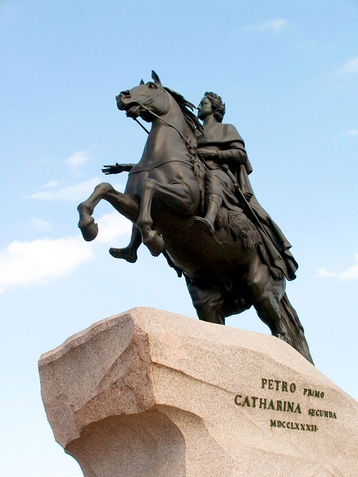
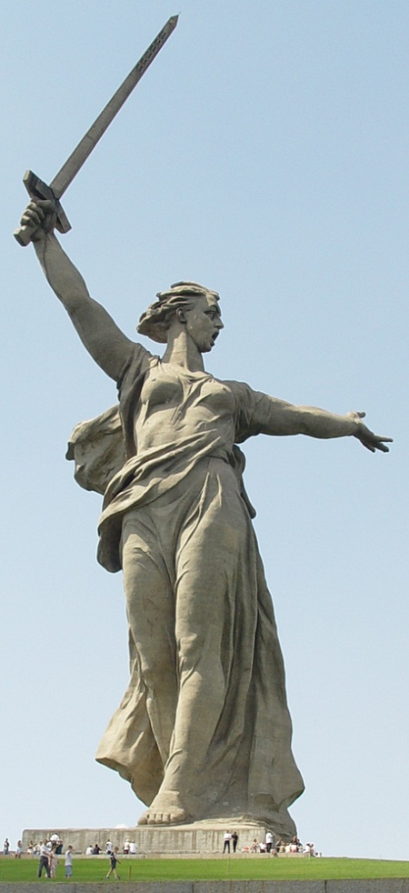
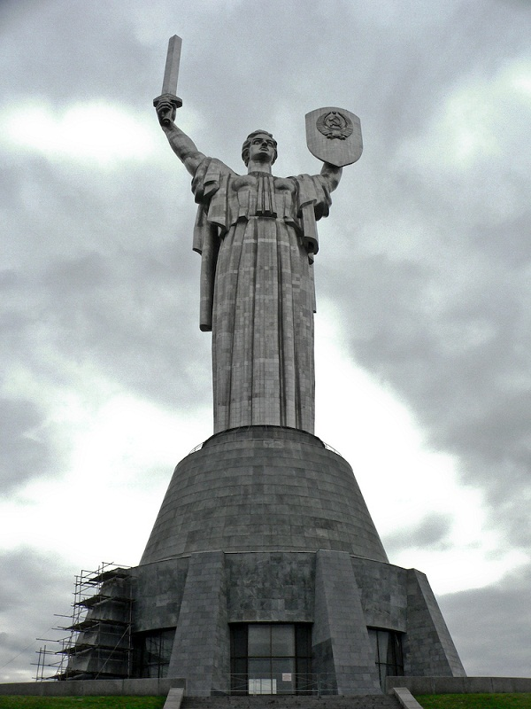
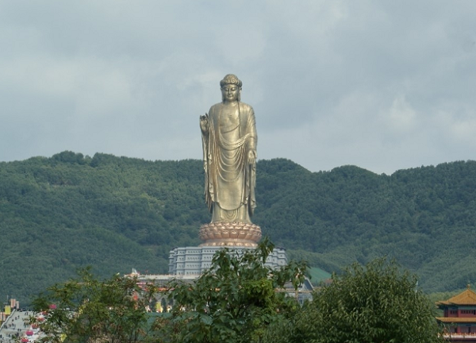
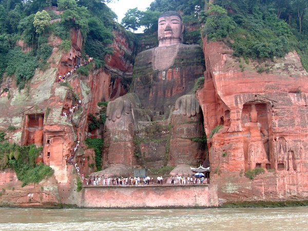
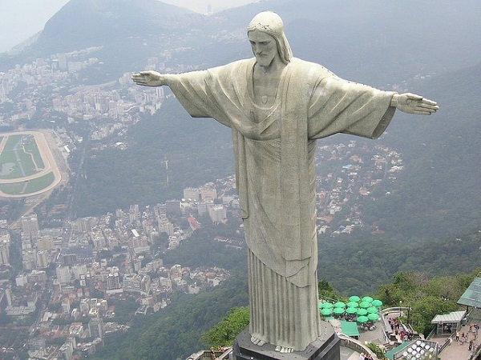
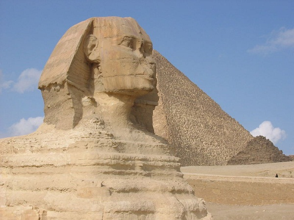
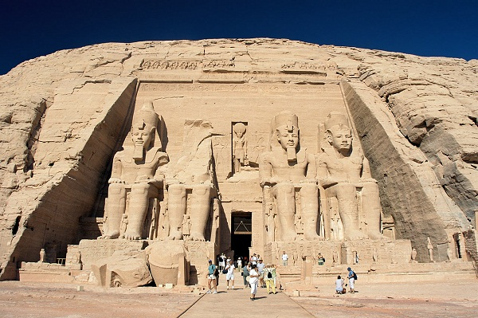
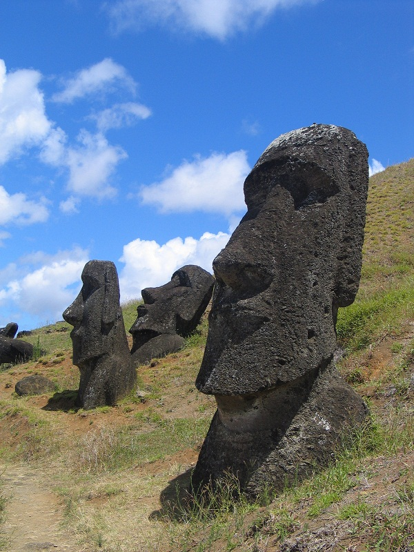
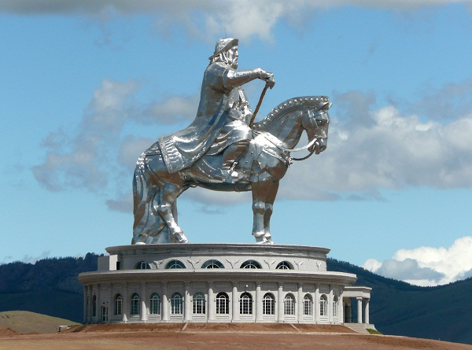

# Великие статуи мира
		
Человечество во все времена старалось возвести самые грандиозные статуи — выразить масштаб своей страны, своих достижений, поднять дух сограждан, удивить соседей.

Стремление к увековечиванию людей и событий посредством гигантских и амбициозных памятников в наших генах. Многое из грандиозного и гениального дошло до наших времен только в рисунках и преданиях, но многое все еще с нами. AdMe.ru собрал в этом материале самые великие — по масштабам, известности, культурной и исторической значимости — статуи. Конечно же, далеко не все — перегружать материал двумя-тремя десятками Будд нам показалось излишним, а именно Будды занимают во всех рейтингах большинство мест. Также не вошел сюда и Петр Первый на Москве-реке, который хоть и причисляется к самым высоким статуям в мире, но являет собой художественную катастрофу.

## Медный всадник
### Санкт-Петербург, 1770

Первый в России конный памятник царю. Установлен на уникальном цельном каменном постаменте, который назвали Гром-камень. Его транспортировка — это отдельная история изобретательности и упрямства. Памятник сделан про проекту Этьена Фальконе и изображает царя более простым человеком, чем это принято в увековечивании монархов. Петр одет в простую одежду, вместо седла под ним медвежья шкура, только лавровый венок и меч говорят нам о том, что Петр — великий полководец.

Надпись на латыни «PETRO primo CATHARINA secunda MDCCLXXXII», казалось бы, указывает на то, кто и кому воздвиг эту статую, но помимо этого это еще и изящный намек на преемственность. Интересно также, что Пётр Великий рукой указывает в сторону Швеции, а в центре Стокгольма установлен похожий памятник Карлу XII, главному противнику Петра в Северной войне, левая рука которого направлена в сторону России.

## Родина-мать зовет
### Волгоград, 1967

Одна из самых высоких статуй в мире расположена в Волгограде и является едва ли не главным символом борьбы советского народа с фашизмом. 52-метровая фигура женщины, шагнувшей вперед, зовет своих сыновей на бой с врагом. Ее образ связан с античной богиней Никой — богиней победы.

Толщина железобетонных стен скульптуры составляет всего 25-30 сантиметров. Внутри вся статуя состоит из отдельных ячеек камер, как комнаты в здании. Жёсткость каркаса поддерживается девяноста девятью металлическими тросами, постоянно находящимися в натяжении. В верхней части полностью стального меча проделаны отверстия для уменьшения парусности.

## Родина-мать
### Киев, 1981

Украинская Родина-мать моложе российской, но выше ее на 10 метров, и также имеет прямое отношение к Великой Отечественной войне, поскольку является частью Национального музея истории ВОВ. Монумент был открыт в 1981 году и начинал над ним работать Евгений Вучетич, который также является автором волгоградского символа Победы. Изначально предполагалось, что вся статуя будет покрыта сусальным золотом, но потом от этой идеи отказались, и Родина-мать обшита 1.5-миллиметровой сталью.

Меч, который держит в руках Родина, коротковат, и есть мнение, что так было сделано после длительных переговоров с киевским метрополитом, который настаивал, что «оружие не может быть выше креста», подразумевая крест колокольни Киево-Печерской Лавры, расположенной по соседству. И действительно, кончик меча оказался ниже креста на 12 метров.

## Рабочий и колхозница
### Москва, 1937

Всемирно известный эталон социалистического реализма и символ СССР был создан для советского павильона на Всемирной выставке в Париже в 1937 году, в разгар сталинских репрессий. Парень и девушка, по задумке, олицетворяли гордых хозяев советской земли — рабоче-крестьянский класс. На протяжении 6 лет, начиная с 2003 и заканчивая 2009 годом, статуя находилась на реставрации, а постамент перестраивался. Сейчас он на 10 метров выше, а в нем размещен музей.

## Будда Весеннего Храма
### Хэнань, Китай, 2002

Самая высокая статуя в мире — 128 метров, с постаментом все 208. Буддисты вообще любят изображать Будду в гигантских масштабах — статуи этого бога переполняют список самых высоких в мире. Но этот, один из новейших, затмевает всех. Его построили вскоре после варварского разрушения талибами статуи Будды в Афганистане, и считается, что это своего рода ответ террористам — «Будд будет больше, и они будут еще выше».

## Будда в Лэшане
### Сычуань, Китай, VIII век

Эта статуя считается самым высоким скульптурным произведением в мире. 71-метровый сидящий Будда высекался в скале на протяжении 90 лет, а затем вокруг его тела был выстроен 13-этажный храм, который был уничтожен пожаром, и сейчас Будда доступен для обозрения целиком. Длина пальца его руки — 8 метров, пальца ноги — 1.6 метра.

## Христос-искупитель
### Рио-де-Жанейро, 1931

Символ всей Бразилии, установленный на горе Корковаду, будто обнимает и благословляет весь Рио-де-Жанейро, раскинувшийся под горой, и одновременно напоминает крест, на котором был распят. Деньги на постройку одной из самых знаменитых статуй в мире собирали всем Рио-де-Жанейро — пожертвований набралось более чем на два миллиона реалов.

В 2007 году признана одним из новых семи чудес света.

## Статуя свободы
### Нью-Йорк, 1886

 

Подарок французской нации американцам в честь столетия установления независимости опоздал на 10 лет — как всегда не хватало денег. Американцам, например, которые по договоренности должны были построить пьедестал, приходилось проводить массу благотворительных мероприятий.

Многим известно, что в левой руке у статуи — табличка с датой 4 июля 1776 года, но то, что одной ногой женщина-аллегория попирает разбитые оковы — факт, куда менее известный. Семь лучей на короне Свободы — это семь континентов (западная географическая традиция придерживатся именно такого мнения). Любители конспирологии усматривают в этом имперские амбиции США, существующие аж с XIX века.

## Большой Сфинкс
### Гиза, Египет, дата создания неизвестна

 

Лежащий на песке лев с головой человека — древнейшая сохранившаяся на Земле монументальная скульптура. Длина статуи — 73 метра, высота — 20 метров, она высечена из монолитной известковой скалы, а поперечные полосы по всему телу часто объясняются повреждениями от дождей, в изобилии шедших в Египте, когда там был другой климат. Статуя повёрнута лицом к Нилу и восходящему солнцу. Как она называлась раньше, никому неизвестно, «сфинкс» — это древнегреческое слово и переводится как «душительница».

За годы своего существования Сфинкс оказался по самые плечи погребён в песке, и только в 1925 году он был полностью от него освобожден.

## Фараоны в Абу-Симбеле
### Нубия, XIII век до нашей эры

 

Все четыре исполинских статуи у входа в Большой храм Абу-Симбел — это изображение Рамзеса II, при котором, собственно, и был построен храм. В относительной целостности сохранилось только три 20-метровых царя, но и их могло бы не быть, если бы не грандиозная инженерно-археологическая операция, состоявшаяся в 60-е годы. Во время строительства Асуанской плотины обнаружилось, что когда плотина будет введена в эксплуатацию, оба храма в Абу-Симбеле будут затоплены и навсегда утрачены. Поэтому храмы разрезали на блоки весом до 30 тонн, разобрали, перенесли на безопасное место выше по течению и дальше от воды и собрали в точности, как было.

## Моаи
### Остров Пасхи

На острове Пасхи, который местными зовется Рапа-Нуи, насчитывается 997 каменных истуканов «моаи». Все они монолитны и вырезаны из спресованного вулканического пепла, и почти все смотрят вглубь острова, кроме тех семи, которые расположены вглуби острова и смотрят на море. По повериям местных жителей, в моаи заключена сверхъестественная сила предков первого короля острова Пасхи — Хоту-Мату’а. Создавали их представители практически вымершего племени «длинноухих», вытягивавших мочки своих ушей тяжелыми украшениями, именно поэтому у всех моаи длинные уши. От «короткоухих» все тайны по созданию и перемещению моаи тщательно скрывались, и в этом причина наших столь малых знаний об этих удивительных статуях.

## Чингисхан
### Цонжин-Болдог, Монголия, 2008

Крупнейшая конная статуя в мире была открыта совсем недавно — три года назад. Ее странное расположение — в чистом поле, в 54 километрах от Улан-Батора — объясняется тем, что по преданию, именно в этом месте будущий хан огромных земель нашел свою золотую плетку. Высота всего памятника — 50 метров, постамент, в котором расположены музей, галерея, рестораны и даже бильярдная, окружен 36 колоннами, по числу всех ханов Монгольской империи, начиная от Чингисхана. Чистое поле вокруг статуи планируется преобразить в огромную туристическую зону с юртами в качестве гостиничных номеров и тематическими парками.

## Ангел Севера
### Гейтсхед, Англия, 1998

 

Самая авангардная статуя из собранных в этом материале. Ее автор — Энтони Гормли, известный своими неожиданными скульптурными решениями. Этот «ангел» имеет в высоту 20 метров, а в ширину — 54. Вес — 208 тонн (тяжелей, чем Статуя Свободы), большая часть которого приходится на бетонный фундамент. Иначе ангел с такой парусностью не смог бы устоять. Автор хотел создать иллюзию объятий, но своеобразные крылья больше напоминают полы распахнутой одежды, и поэтому британцы с любовью называют свою странную, но грандиозную достопримечательность «гейтсхедский эксгибиционист».
