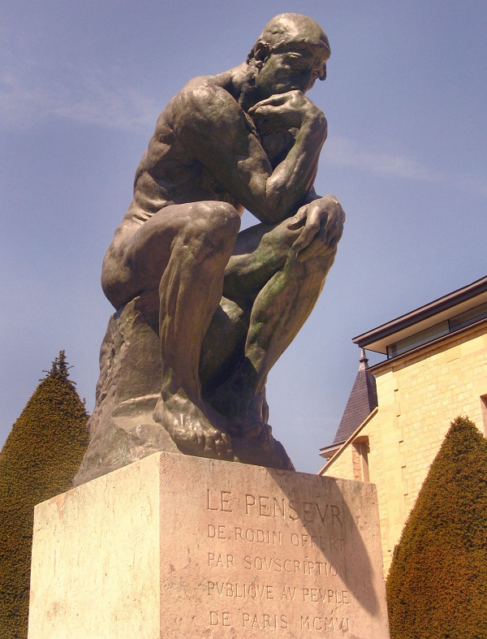
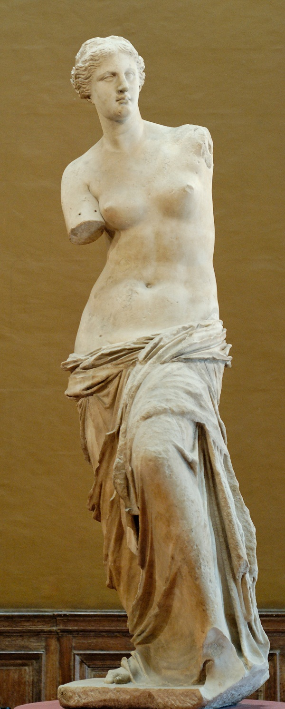
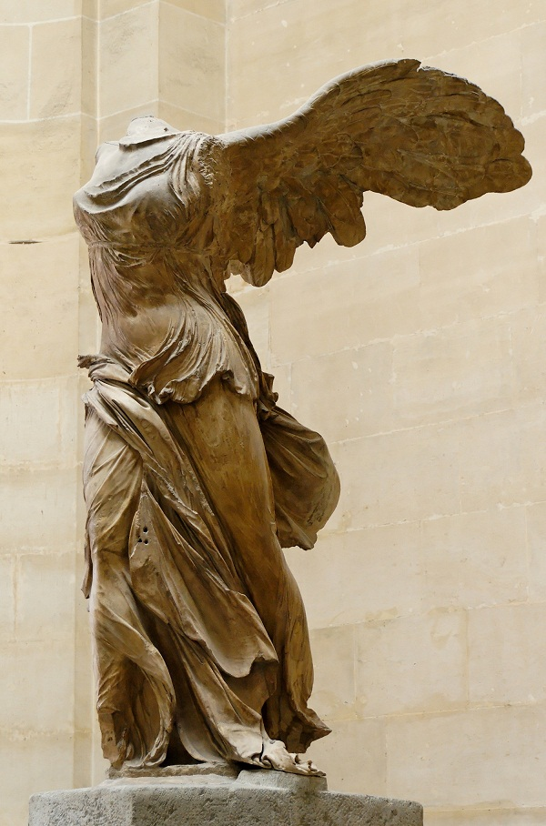
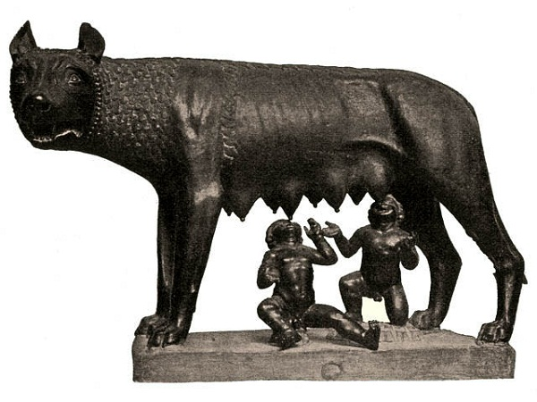
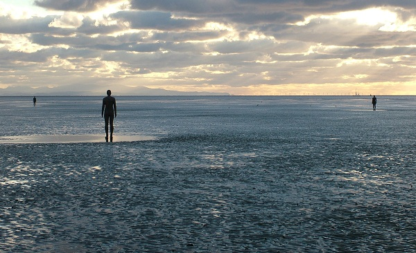
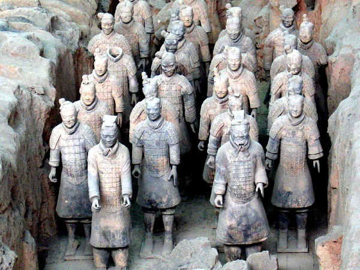
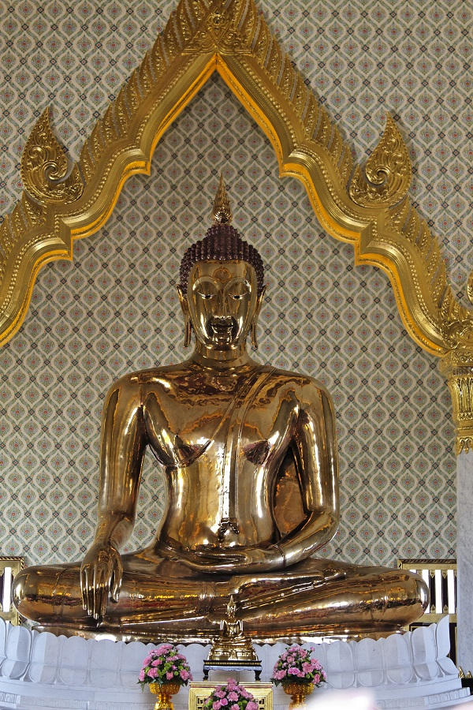

# Знаменитые и значимые скульптуры
		
Без скульптуры искусство не может быть полноценным.

Вырезание и вылепливание людей, животных и разнообразных предметов появились в истории человечества едва ли не одновременно с наскальной живописью. Скульптуры — это те же картины, только телесные, а значит и выражающие эмоции немного по-другому. То, что говорят нам статуи, мы воспринимаем во многом проще, потому что они осязаемы и более похожи на нас, чем произведения любого другого вида искусства.

В этом материале мы собрали 15 знаменитых и значимых скульптур, созданных в разные времена из разных материалов с разными целями. Пожалуйста, делитесь в комментариях своими любимыми произведениями скульптурного искусства.

## Давид
### Микеланджело
 

Пятиметровое изваяние библейского героя Давида, созданное Микеланджело, когда тому было всего 28 лет, воспринимается как символ Флорентийской республики и одна из вершин не только искусства Возрождения, но и человеческого гения в целом.

Самый тиражируемый скульптурный образ в мире.

## Мыслитель
### Огюст Роден

Еще один до крайности популярный образ создан Огюстом Роденом в 1882 году. Изначально скульптура должна была называться «Поэт» и быть частью композиции «Врата ада» по мотивам «Божественной комедии». Моделью для скульптуры послужил француз по имени Жан Бо, мускулистый боксёр, в основном выступавший в Париже, в квартале красных фонарей.

## Шагающий человек
### Альберто Джакометти

Самая дорогая скульптура в истории человечества. В 2010 году 183-сантиметровая скульптура «Шагающий человек», выполненная швейцарским скульптором в 1961 году, была продана с аукциона Sotheby’s за рекордную сумму в 104,3 миллиона долларов.

Скульптура считается одной из самых важных в творчестве этого мастера, ее изображение также размещено на банкноте в 100 швейцарских франков.

## Венера Милосская
### вероятно Агесандр Антиохийский

Знаменитая древнегреческая скульптура, созданная примерно в середине второго века до нашей эры, была найдена на острове Мелос в 1820 году французским моряком, решившим поискать на берегу древности на продажу. Руки тогда были в целости и сохранности, но были утрачены в момент конфликта между французами (нашедшими) и турками (владельцами острова).

## Ника Самофракийская

 
Древнегреческая мраморная скульптура богини Ники была найдена на острове Самотраки на территории святилища кабиров в апреле 1863 года. Статую воздвигли жители острова Родос в память о победе, одержанной ими над флотом сирийского царя. Она стояла на отвесной скале над морем, ее пьедестал изображал нос боевого корабля. Могучая и величавая Ника в развевающейся от ветра одежде представлена в неудержимом движении вперед. В настоящее время находится в Лувре.

## Пьета
### Микеланджело

Пьета — распространенное название для изображений сцены оплакивания Девой Марией ее сына. Лучшая из них была сделано Микеланджело в 24 года. Безупречная композиция, эмоциональность, человечность и глубокая символичность скульптуры сделали ее образцом культуры Высокого Возрождения.

## Нефертити
 

Один из самых известных скульптурных памятников культуры Древного Египта. Нефертити была супругой фараона-реформатора Эхнатона. Бюст целиком изготовлен из известняка и полностью окрашен. Особенная сохранность красивых цветов, дающих большой контраст между коричневым цветом лица Нефертити и драгоценностями короны, делают его уникальным произведением искусства. Египет и Германия, где хранится бюст царицы, уже много лет ругаются из-за нее, но никак не могут прийти к согласию.

## Капитолийская волчица
 

Этрусская бронзовая скульптура, по стилистическим признакам датируемая V веком до н.э., никогда не покидала Рима, города, который основали те, кого выкормила волчица. Во времена Бенито Муссолини Капитолийская волчица использовалась как пропагандистский символ, воплощавший стремление фашистского режима возродить Римскую империю.

## Родина-мать
### Вучетич и Никитин

Одна из самых высоких статуй в мире расположена в Волгограде и является едва ли не главным символом борьбы советского народа с фашизмом. 52-метровая фигура женщины, шагнувшей вперед, зовет своих сыновей на бой с врагом.

## Другое место
### Энтони Гормли

Ландшафтная инсталляция «Другое место» — образец современного искусства, вызывающий философские размышления и наводящий меланхолию. Ровно сто чугунных скульптур высотой в человеческий рост расставлены в 2006 году на трехкилометровой пляжной линии к северу от Ливерпуля. Они обращены лицом к морю, и во время приливов некоторые из скульптур частично или полностью погружаются под воду.

## Граждане Кале
### Огюст Роден

 

Скульптурная группа «Граждане Кале», заказанная муниципалитетом города Кале, была завершена Роденом в 1888 году. Во время Столетней войны английский король Эдуард III осадил город, и спустя некоторое время голод вынудил оборонявшихся к сдаче. Король обещал пощадить жителей, только если шесть знатнейших граждан выйдут к нему в рубище и с верёвками на шее, отдавая себя на казнь. Это требование было исполнено. Первым вызвался отдать свою жизнь ради спасения города один из главных богачей, Юсташ де Сен-Пьер. Английская королева Филиппа исполнилась жалостью к этим исхудавшим людям, и во имя своего нерождённого ребёнка вымолила перед супругом для них прощение.

Роден революционно настоял на отказе от постамента, хоть волю его выполнили только после смерти скульптора, и фигуры находятся на одном уровне со зрителями.

## Писающий мальчик
 
  

Главная достопримечательность Брюсселя. Точное время и обстоятельства возникновения статуи неизвестны. По некоторым сведениям, статуя существовала уже в XV веке. Одни брюссельцы рассказывают, что она установлена в напоминание о событиях гримбергенской войны, когда люлька с сыном Готфрида III Лёвенского была подвешена на дереве, чтобы видом будущего монарха воодушевлять горожан, а ребёнок оттуда мочился на сражающихся под деревом воинов. По другому преданию, статуя была изначально призвана напоминать горожанам о том мальчике, который струёй мочи потушил разложенные неприятелем под городскими стенами боеприпасы.

Начиная с 1695 года статую неоднократно похищали, в последний раз статую украли в 1960-е годы, после чего её в очередной раз заменили копией.

## Терракотовая армия

 
 
Как минимум 8099 скульптур китайских воинов и их лошадей составляют это достояние Китая. Терракотовые статуи, каждая из которых абсолютно индивидуальна, были захоронены в боевом построении вместе с первым императором династии Цинь — Цинь Шихуанди, объединившим Китай и соединившим все звенья Великой стены в III веке до нашей эры.

Воины должны были поддержать власть императора и в загробном мире.

## Золотой Будда
 

Самая большая в мире цельнолитая золотая статуя расположена в бангкокском храме Ват Траймит — в ней около трех метров, а весит она более пяти тонн.

В период войны с Бирмой статуя была намеренно покрыта гипсом, а затем никто уже не мог раскрыть секрета этого Будды. До 1957 года на статую особо не обращали внимания — до тех пор, пока она не была перевезена на новое место. Согласно слухам, во время перевозки начался дождь, перед которым статуя из-за своего веса ещё и упала с перевозившего её крана; она была укрыта от дождя, но вода всё равно смыла покрытие с одного из участков в достаточной степени, чтобы один их монахов заметил странный блеск. По другой версии, от падения гипс потрескался.
