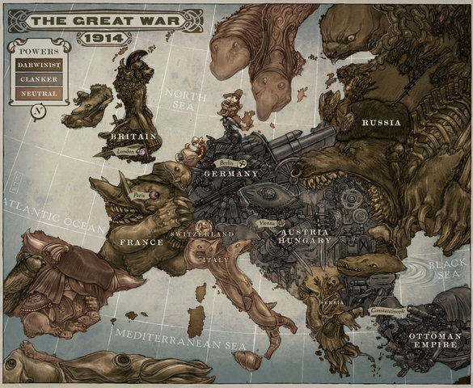
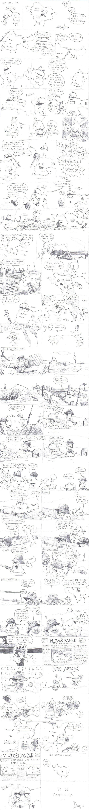

# Первая мировая война

>   Когда товары не могут пересечь границы, их пересекают армии.
>
>   **Фредерик Бастиа**

>   Черт побери, такой идиотской мировой войны я никогда еще не видывал!
>
>   **Ярослав Гашек устами сапёра Водички. Похождения бравого солдата Швейка во время мировой войны.**

|           |                               |
|-----------|-------------------------------|
|Дата       |28 июля 1914 — 11 ноября 1918  |
|Место      |Везде и повсеместно            |
|Причина    |экономические и политические кризисы в одряхлевших империях Запада, экспансионизм набирающих силу Америки (САСШ) и Японии, свидомость малых народов Европы и Азии, кризис колониализма как такового, до кучи балканские срачи, обоюдное желание Турции и Австрии ВОЗНАГНУТЬ балканских чурок. Главное же-это нежелание и невозможность политиков и сильных мира сего идти на диалог на тот момент. |
|Итог       |WIN Антанты, FAIL царской России, кайзеровской Германии, габсбурговской Австрии и османской Турции |

Стороны

|   |   |
|---|---|
|   |Англия, Франция, Россия, САСШ, Сербия, Италия (с 1915), Румыния, Греция, Япония, Черногория, Всякие Гондурасы, Гватемалы и другие. |
|   |Германия, Австро-Венгрия, Италия (до 1915), Турция, Болгария и другие.|

Командующие

|   |                                                                       |
|---|-----------------------------------------------------------------------|
|   |Николай II, Георг V, Пуанкаре, Вильсон, Виктор Эммануил, Дж. Першинг   |
|   |Вильгельм, Франц-Иосиф, Мехмед V, Фердинанд I                          |

Силы сторон

|   |                                                   |
|---|---------------------------------------------------|
|   |over 9000 юнитов                                   |
|   |over 9000 фрицев, over 9000 турок, вся Болгария    |

Потери

|   |                                               |
|---|-----------------------------------------------|
|   |Россия, 5 лямов людишек                        |
|   |три империи, половина Болгарии, 4 ляма людишек |

Первая мировая война (сокр. ПМВ; царск. Вторая отечественная; также Германская
война, Империалистическая война; изначально Великая война) — эпичная разборка
между пафосными империями начала XX века. В результате старые империи Евразии —
Россия, Германия, Австро-Венгрия и Турция — огребли от Антанты, друг от друга и
самовыпилились КЕМ. Зато приуспели СШП (которые всё это спонсировали
животворящими баксами) и Япония.

Именно в эту пору получили распространение такие кошерные вещи, как набеги на
пулеметы с кирпичными физиономиями, колючая проволока и траншеи, газовые атаки,
рейды за тушенкой; появились танчики и боевая авиация. Шмуклер одобряет.

В этой стране, из-за деструктивного влияния на психику поцреотов, и на
благодатном для мытья мозга фоне Великой Отечественной конфликт несколько
поблёк за давностью лет (на данный момент в живых не осталось ни одного
ветерана ПМВ, последний ветеран — австралийский морячок, бывший в то время еще
школотой и толком не успевший повоевать, умер в мæ 2011 г). Но в Англии помнят.

Существует и другие точки зрения — например, в учебниках истории Китая эти
события именовали гражданской войной в Европе.

## Главные действующие лица

### Антанта

*   **Франция**. После франко-немецкого срача 1870 года имперским амбициям
    маминых Наполеонов был нанесен мощный удар ниже пояса. Тогда фрицы нанесли
    лягушатникам этот самый удар, устроив в Версальском дворце коронацию своего
    кайзера. Впоследствии, несмотря на все успехи в распиле Африки и
    Юго-Восточной Азии, Лотарингия-Эльзас оставалась розовой мечтой всех
    французских ватников. Французские производители и продавцы высирали горы
    кирпичей из-за германской продукции, которая лидировала на рынках. Немецкие
    расовые производители ловили немалые лулзы и тонко отшучивались. Учитывая
    невероятное разложение французского общества в целом и французской армии в
    частности (см. Дело Дрейфуса), Франции срочно был нужен сильный союзник.
    После Фашодского кризиса с англичанкой отношения были натянуты, и тут, на
    почве очередного русско-германского срача, вовремя подвернулась Эта страна.
*   **Россия**. После маленькой победоносной войны в 1905 году Эта страна
    забила на свой эпичный фейл в войне с Микадо и снова почувствовала себя
    д’Артаньяном в этом вашем мире. Царю-батюшке приспичило погеройствовать, но
    для этого надо было хорошенько покидаться говном. Русские, по старой
    традиции, требовали прохода своим корабликам в Средиземное море, стремились
    анально огородить Балканы от австрийцев. Хотели, чтобы другие народы
    признали их ~~Черным~~ Властелином среди славянских народов, а царь
    Николашка истекал слюнями, представляя себя — в брыльянтовой короне —
    въезжающим на расписной колеснице, запряженной тремя медведами, в Вену или
    многострадальный Константинополь, исполняя давнюю мечту российских имперцев
    всех мастей — объединить в одном государстве аж семь столиц: Петербург,
    Москву, Киев, Варшаву, Краков, Прагу и Константинополь. ИЧСХ сербы, греки и
    прочие чехословаки были не особо против, НО: имелись вековые нерешенные
    польские и украинские вопросы.
*   **Британия**. После многих винов на родине Homo sapiens и будущих
    программистов Майкрософт, бриты поимели гигантский PROFIT и зажили долго и
    счастливо. Но не тут-то было. Злые гансы, а потом и японы с пиндосами
    начали набигать на Восточную и Юго-Западную Африку, завладевать
    экономически и всячески сраться с Великой Британской Империей. Начались
    массовая поклейка корабликов, а также толстый троллинг Германии в
    экономическо-торговом секторе. Но эта ваша Англия воевать в одиночку
    ~~в таких масштабах~~ вообще не привыкла и присоединилась к уже
    образованной Антанте — антигерманскому союзу Франции и России. В 1907 году
    заключила конвенцию о разделе сфер влияния в Евразии с Россией. Британия
    заключала с Францией **секретный** договор, так что получилась ситуация,
    когда Тройственный союз ощутимо сильнее недо-Антанты, а неофициально —
    Антанта сильнее Тройственного союза. В 1914 году, однако, отношения с
    немцами устаканились — германцы признали могущество британского флота и
    получили гарантии безопасности своих колоний и намёк на распил
    португальских, а австро-венгры в обмен на выгодный торпедный бизнес в Фиуме
    пообещали посодействовать в сдерживании российских амбиций в Галиции.
    Однако после начала мобилизации сторон военно-морской министр Черчилль (тот
    самый, да) убедил крайне непопулярное правительство в необходимости
    короткой победоносной войнушки для спасения политического капитала и
    предотвращения волнений на почве безработицы.
*   **США**. PROFIT же! Нараздавать воюющим кредитов из-за океана, а потом
    собирать ништяки. И пусть они мочат друг друга. Вдобавок, участие в войне
    позвояло моментально выгнать бриттов, немцев и прочих изо всех спорных
    тихоокеанских колоний, а заодно вволю полинчевать потомков немецких и
    японских колонистов в самих Штатах.
*   **Италия**. С умом кинула австро-германских товарищей (чем вызвала у
    австрияков лютый butthurt: на два фронта воевать же!), с которыми состояла
    в союзе, прозорливо осмыслив то обстоятельство, что борьба против
    Британской империи для итальянцев закончится весьма, весьма плачевно: со
    своей посудой англичане и Ливию изымут, и Сомали. Да и какая у нас
    протяжённость береговой линии самой Италии? Сыграло роль и то
    обстоятельство, что немцы на рубеже веков начали вооружать Эфиопию, которую
    итальнцы незадолго до того безуспешно пытались захватить, что было
    расценено как удар в псину. Правда, потом австрийцы хорошенько на Италии
    отыгрались, да и вообще союзникам от неё было больше беспокойства, чем
    пользы.
*   **Румыния**. Долго раскачивалась, прикидывая расклад. В 1916, в ходе
    отменного опиздюливания Австро-Венгрии брусиловскими войсками, наконец-то
    решила, что австрияков можно списывать, и неплохо было бы успеть урвать у
    них что-нибудь — например, исконно ~~цыганские~~ румынские земли — Черновцы
    и Буковину. В итоге была закономерно опиздюлена сама и повисла мёртвым
    грузом на балансе русской армии.
*   **Сербия**. Что характерно, до сабжа наибольшее внимание уделяла Албании и
    её морским портам. После того как австрияки настойчиво стали склонять её к
    сожительству, пару раз вкатила им неслабых, так что тем пришлось звать на
    помощь немецкого брата и болгар. Сразу после войны увлечённо делила
    совместно с Румынией Банат и Воеводину, а тут хорваты и словенцы
    попросились под крылышко, опасаясь итальяшек. Межнациональные отношения
    тогда ещё были не изгажены, и всё было бы хорошо, если б не врождённый ФГМ
    великосербов.
*   **Черногория**. Что? Братушки пошли воевать с австрияками? С подключением!
*   **Греция**. Несмотря на то, что была связана с Сербией военным союзом,
    вступила в войну уже под конец, хотя иностранные войска хозяйничали на её
    территории аж с 1915 г., так как главный грек Константин I Глюксбург был
    кошерным (по маме) немцем (по бате) и фапал на кайзеров. Ему противостоял
    премьер-министр Элефтериос Венизелос, который лелеял одну идейку: запилить
    с помощью англичан Великую Грецию с двумя главными центрами эллинизма и
    заодно снова озалупить болгар, а потом ещё и турок. Всё это вылилось в
    Национальный баттхёрт, закономерно завершившийся государственным
    переворотом и отречением короля. ИЧСХ, Венизелос был на грани успеха, но с
    турками вышло горе — гордые эллины опечалены.
*   **Япония**. Пользуясь союзом с США, под шумок ухватила английские и
    немецкие колонии в Китае и Океании.
*   **Бельгия**. Банально попала под горячую руку Германии. Как и Люксембург,
    которые вообще никого не трогали.
*   **Португалия**. Совершенно не имела никаких причин влезать в данную
    разборку, но оказалось, что когда-то хз когда в XIV веке был опрометчиво
    заключен военный союз с Англией, который так и не был расторгнут к ХХ веку,
    о чем Джон Буль не забыл напомнить. Равно как и о том, сколько раз и против
    кого англичане вписывались за евробразильцев. Отказаться было неудобно, тем
    более что и сами немцы, решив по мелочам не размениваться, объявили
    португалам войну. На войне исключительно получали пиздюли (включая эпичный
    friendly fire от англичан же в сражении на Мессинском хребте). По итогам
    войны получили кусочек территории Мозамбика (в то время португальской
    колонии) в 395 кв. км, который немцы отжали за пару десятилетий до предмета
    статьи.

### Тройственный союз

>   Передовые газеты были ужасно лживые, кровожадные, заносчивые. Весь мир за
>   пределами Германии изображался дегенеративным, глупым, коварным. Выходило,
>   что миру ничего другого не остается, как быть завоеванным Германией
>
>   **Ремарк**

*   **Германия**. СТРЕМИЛАСЬ К МИРОВОМУ ГОСПОДСТВУ!!!111один А точнее, хотела
    выпилить всех конкурентов на планете, оттяпать колонии и рынки сбыта
    продукции. К 1914 году Германия — молодой хищник, не успевший к разделу
    планеты. «Прогрессивные» немцы все чаще задаются вопросом, отчего почти
    всем миром владеют «некультурные» Англия с Францией, отчего «древняя
    немецкая» Прибалтика в составе России и вообще «Рюрик наш». Немного позже
    немецкий Гауптманн Очевидность рассмотрел Францию (на фоне болезненной
    ненависти к ней Бисмарка) и Россию (на фоне неиллюзорной угрозы воплощения
    политической программы панславистов и расшатывания Австро-Венгрии) как
    угрозу своим амбициям и заключил союз с Австрией. Россия не могла допустить
    выпиливания Франции, и в качестве противовеса Германии заключила союз с
    Францией, не без щедрых кредитов, разумеется, несмотря на то, что Германия
    была куда ближе и культурно, и политически ещё со времени Наполеона.
    Германия добилась союза с Италией, имевшей претензии к французскому
    правлению в Савойе, заключив Тройственный союз. Само создание Германской
    империи стало одним из двух главных факторов начала сабжа.
*   **Австро-Венгрия**. Францу-Иосифу, с которого в 1914 году уже потихоньку
    сыпался песок (кстати, он так и не дожил до конца войны), захотелось
    тряхнуть стариной: устроить экстерминатус сербам и зохавать все Балканы, а
    перед этим выпилить из Западенщины признаки панславянизма. Да и за
    убиенного престолонаследника (см. ниже) тоже надо было отомстить.
*   **Турция**. ~~Ч~~Турки негодуют: великая Империя, порастерявшая все свои
    владения на Балканах, разваливается на глазах. Испытав анальный оргазм и
    пососав толстый славянский хуище после ряда неудачных войн, турки решили,
    что со славянами надо не воевать, а дружить, предложили мир, дружбу,
    жвачку, отвод своих войск с кавказских границ России и переброску их на
    границы Австро-Венгрии. Но Николашка, возжелавший видеть русский флаг над
    Босфором и Дарданеллами, закономерно послал султана на хуй. А англичанка
    тут как тут: экспроприировала для нужд обороны парочку турецких линкоров
    (построенных на турецкие деньги на английских верфях). Озадачившись таким
    вероломством недавнего союзника, Оттоманская Порта примкнула к тевтонам и
    объявила Антанте газават.
*   **Болгария**. Держала зуб на соседей после второй балканской войны, когда
    пришлось нехило поступиться землями, удачно приобретенными по итогам
    первой. Плюс мечтала залепить наконец дуло Сербии, перетянув одеяло
    славянского лидерства на раене на себя.

## Маленькие победоносные войны

>   ... Для Пруссии — Германии невозможна уже теперь никакая иная война, кроме
>   всемирной войны. И это была бы всемирная война невиданного раньше размера,
>   невиданной силы. От восьми до десяти миллионов солдат будут душить друг
>   друга и объедать при этом всю Европу до такой степени дочиста, как никогда
>   еще не объедали тучи саранчи. Опустошение, причиненное Тридцатилетней
>   войной, — сжатое на протяжении трех-четырех лет и распространенное на весь
>   континент, голод, эпидемии, всеобщее одичание как войск, так и народных
>   масс, вызванное острой нуждой, безнадежная путаница нашего искусственного
>   механизма в торговле, промышленности и кредите; все это кончается всеобщим
>   банкротством; крах старых государств и их рутинной государственной
>   мудрости, — крах такой, что короны дюжинами валяются по мостовым и не
>   находится никого, чтобы поднимать эти короны; абсолютная невозможность
>   предусмотреть, как это все кончится и кто выйдет победителем из борьбы;
>   только один результат абсолютно несомненен: всеобщее истощение и создание
>   условий для окончательной победы рабочего класса. Такова перспектива, если
>   доведенная до крайности система взаимной конкуренции в военных вооружениях
>   принесет, наконец, свои неизбежные плоды.
>
>   **Фридрих Энгельс. Лондон. 15 декабря 1887 г.**

К началу ПМВ в экономике всех развитых и недоразвитых стран сложились блоки
монополистов, которые контролировали всю производственную цепочку и нагло
трахали конкурентов на своей территории. Невидимая рука рынка в каждой стране
превратилась в весьма осязамые кулак с кастетом. Становление монополий
неизбежно требовало вливаний с феерическим количеством нулей, отчего началась
непрерывная оргия банкиров и промышленников: банкиры вливали в промышленность,
промышленники покупали доли в банках. Хрестоматийный пример: Сесиль Родс,
который назвал своим именем аж две колонии (ныне Замбия и Зимбабве), поднялся
на капитале Ротшильдов. У монополистов были свои торговые флота, свои железные
дороги, свои частные армии, но все же они не были государствами, чтобы валить
друг друга самостоятельно. Поэтому к оргиям банкиров и промышленников все чаще
присоединялись первые бюрократы государства. А поскольку национальные рынки
были давно поделены, все чаще вставал вопрос об использовании государственной
политики в своих циничных и вполне коммерческих интересах. Поводы для них
выдумывали один охуительнее другого: уже в англо-бурской войне, на которой
впервые придумали лагеря утилизации человеков, отношение к бурам-европеоидам со
стороны великоимперских великобританцев было откровенно расистским. А буры это
потомки расовых немецких голубоглазых блондинов. Что уж говорить про остальных
унтерменшей с кожей цвета несвежего говна. Для примера, политическая программа
все того же Родса сводилась к следующему:

*   Превосходство англичан над всеми остальными народами мира.
*   Стремление поставить под контроль Англии вообще все ресурсы планеты.
*   Утихомиривание английских пролетариев за счет ограбления колоний.

>   Я был вчера в лондонском Ист-Энде (рабочий квартал) и посетил одно собрание
>   безработных. Когда я послушал там дикие речи, которые были сплошным криком:
>   хлеба, хлеба!, я, идя домой и размышляя о виденном, убедился более, чем
>   прежде, в важности империализма: Моя заветная идея есть решение социального
>   вопроса, именно: чтобы спасти сорок миллионов жителей Соединённого
>   Королевства от убийственной гражданской войны, **мы, колониальные политики,
>   должны завладеть новыми землями для помещения избытка населения, для
>   приобретения новых областей сбыта товаров**, производимых на фабриках и в
>   рудниках. Империя, я всегда говорил это, есть вопрос желудка. Если вы не
>   хотите гражданской войны, вы должны стать империалистами.
>
>   **Сесиль Родс задолго до нацистов**

Смысл: чтобы не было войны бедных с богатыми, нужно откачивать энтропию вовне и
ограбить чужих бедных, ибо воистену. Пусть они там друг друга хоть жрут живьем,
главное, чтобы у белых людей было спокойно. Сие есть очевиднейший нацизм без
всякой связи с нацистами. Позже Ленин вывернул именно эту формулу наизнанку:
они де хотят превратить гражданскую войну классов в империалистическую, а мы
превратим империалистическую войну в гражданскую — даешь поражение своим
угнетателям.

Однако не все были согласны с подобными раскладами. В первую очередь, соседние
империалисты, которые хотели поступить точно так же с англичанами, первые из
которых — немцы. Германия тогда просто расцветала, являя фантастическое
немецкое чудо, которое мало с чем можно сравнить. Немцы славились поставленным
на конвейер внедрением всего нового: как сейчас США, Китай и Япония-вместе
взятые, с чем у всех соседей были сложности. И немцы начали методично щемить
всех соседей по всем основным показателям, постепенно становясь главным и
единственным достойным конкурентом. Результат: 70% новейшей электротехнической
промышленности на тот момент было в Германии. Возникал логичный вопрос: чем
англичане лучше немцев, почему они контролируют планетку? Немцы тоже не были
вегетарианцами и начали открыто строить новейший флот, готовясь вытеснить
Британию с морей КЕМ. А аналогичные Родсу люди придумали зеркально похожую
песню, в которой слово «Британия» было заменено на «Германия», они же впервые
заговорили про немецкие Прибалтику, древнюю готскую Украину и вообще «Жизненное
пространство на Востоке». Немцы задолго до Гитлера поняли, что взять английские
колонии можно только построив более мощные флот и, соответственно,
промышленность, а чтобы построить такую промышленность нужно взять колонии
где-то в другом месте. Уже Бисмарк, который не желал ввязываться в различные
авантюры с колониями, испытывал непрерывный напор самородков от колониальной
промышленности.

К Первой Империалистической этот напор сломал все преграды, густым потоком
поступая прямо в мозг правящих немецких кругов. О войне как неизбежности
говорили уже со времен Германского Союза: Англия главный враг, Франция не такой
главный враг, но в общем-то тоже не совсем друг, у них всех нечестно большое
количество колоний с унтерменшами, а русские так и вообще нечестно владеют
древней немецкой землей Прибалтики, Польши и Украины. Это — национальная
немецкая идея, ставшая государственной политикой. Стоит ли говорить, что
британцы были в том же на два шага впереди немцев?

Что касается Россиюшки, пусть будет только один пример. Для обоснования войны
за Царьградъ и проливы устами кадета Милюкова было сказано, что это ворота для
экспорта сотен хлеба, которые давали сотни нефти. А хлебные монополисты тесно
сотрудничали с русско-французским банком, контрольный пакет которого был у
французского банка Société Générale, хотя управлял им небезызвестный Путилов.
Соответственно, хлебные монополисты и кулаки четко ориентировались на войну до
победного, а всех несогласных называли предателями Отечества, а не своих
интересов.

Народу же с обеих сторон было достаточно. Оружия — более чем достаточно.
Патриотизма — за глаза и за уши. Воевать хотели все стороны, но включать
вентилятор никто первым не захотел. Но хитрый план ZOG удался: все объявили
войну друг другу по очереди. ИЧСХ маленькие победоносные войны скатились в одну
большую фейловую яму для всех и вся.

Ключевое в раскладе перед войной:

*   Все как обычно из-за бабла.
*   Бабло добывают из колоний.
*   Для загребания бабла **вообще все** средства хороши.
*   Несогласные с предыдущим пунктом в согласии с ним спят у параши.
*   Чье-либо противодействие загребанию бабла из колоний рано или поздно
    вызывает желание качественно отгеноцидить противника.
*   Все свободные деньги вбухиваются в оружие, отчего всем армиям не хватает
    оружия, все лучшие армии хором трубят о недофинансировании и просят суммы,
    сопоставимые со всем годовым бюджетом.
*   Существует джентельменский клуб наиболее вооруженных джентльменов, лидеров
    по добыче бабла из колоний.
*   Некоторые джентельмены считают, что грабеж колоний осуществляется
    недостаточно справедливо.
*   В Британской империи живет треть населения земли. С ее точки зрения все
    очень справедливо.
*   Франция хапнула достаточно, чтобы это тоже было справедливо, хотя и не
    настолько, как считают британцы.
*   А вот Германия и Австрия горячо хотят передела. Германия построила флот
    больше французского, российского и своих союзников вместе взятых, но он все
    еще уступает британскому. Основная мысль: «Если вы, паскуды, сами ничего
    нам не подарите, то мы плывем к вам».
*   Англия и Россия не хотят допустить исчезновения Франции = убер-усиления
    Германии. А если они немного поубивают друг друга без явного превосходства,
    то это даже хорошо. Особенно для Англии. Лучше всего втянуть в союз Россию,
    но так, чтобы она в итоге не получила Константинополь с проливами.
*   Франция хочет просто не попасть под каток Германии. Ей хватает наживаться с
    кредитов России и Турции.
*   России не нравятся немецкие попытки реанимировать «бедного больного
    человека Европы» — Турцию. С Дальнего Востока англичане уже выпнули русских
    японскими пинками, потому с традиционно враждебной Англией можно даже
    дружить, чтобы наконец-то вырвать ЦарьградЪ у Турции и Балканы у Австрии.
*   Самое острое и проблемное место для всех стран — Балканы.
*   До войны: перенаселённость и промышленное могущество всех сторон. Все
    страны нашли свои духовные скрепы для оправдания войны, все встали на
    низкий старт.
*   После войны: 10 миллионов убитых, 20 миллионов беспомощных инвалидов,
    разрушенная промышленность, разрушенное сельское хозяйство, эпидемии
    гриппа, тифа и холеры в средневековых масштабах, инфляция, грипп
    (инфлюэнца), дефицит еды, профицит революций, антисемитизма\ксенофобии
    вообще и полный пиздец в головах.

## Ход войны

К началу войны каждая из сторон была уверена в своей победе и для грандиозного
взрыва не хватало только детонатора. Им стали Балканы — пороховая бочка Европы.

### Откуда ноги растут

>   Убили, значит, Фердинанда-то нашего, — сказала Швейку его служанка.
>
>   **Ярослав Гашек**

Это смертоубийство 28 июня 1914 и стало формальным поводом для начала Первой
мировой войны. Стоит отметить и саму личность вероятного престолонаследника
принца Франца Фердинанда, умного жёсткого и жестокого деятеля, стоявшего в тот
момент во главе чуть ли не единственной сильной антивоенной партии
Австро-Венгрии.

Вообще, на Балканах все всегда вели себя по отношению к соседям как шпана в
темном переулке.

Даже Николашка в этом вопросе не был конченым дебилом и пытался этот беспредел
как-то дипломатически разрулить, но клубок противоречий стал таким запутанным и
большим, что гнетущий похуй овладел даже самыми активными противниками войны.
Не без вони со стороны Сербии и России, Австрия открыто зохавала Боснию и
Герцеговину, то есть евроинтегрировала официально то, что де-факто уже было
евроинтегрировано ею же еще года так с 1878-го.

Жителям оных территорий, как ни странно, это не понравилось. Ещё меньше это
понравилось сербам, которые сумели пропиарить своё «фи» в Петербурге. Там дали
добро и бабло, после чего сербско-югославские националисты наобразовывали
тайных обществ, наподготовили туберкулёзников-убийц.

Австро-венгры этим очень толсто потроллили сербов: приурочили свои походеньки и
бряцания всяким железом в Боснии к 28 июня: сербскому национальному трауру ака
Видову дню, скорбному для сербов поминовению погибших в битве на Косовом поле в
1389 году (и относятся они к нему так же, как в этой стране к 9 мая, со всеми
вытекающими культами).

Иной реакции от братушек при таких условиях ожидать не следовало — и австрияки
это прекрасно понимали, что намекает, что Франц Иосиф своего племянника успешно
подставил. С первого раза завалить прынца не вышло: смертельно больной
туберкулёзник Неделько Чабринович кинул гранату, но, промазав, попытался эпично
свалить с представления. Съев пилюлю с ядом, он решил её запить и прыгнул в
реку, но та оказалась мелкой, и от яда он блеванул, после чего его вытащили на
берег и нехило отметелили недовольные представлением зрители. По чистой
случайности через несколько часов после покушения один из убийц (их было 6),
Гаврило Принцип, идя купить себе гамбургер, наткнулся на тачку Франца
Фердинанда и на радостях застрелил его жену в живот. А потом и самого
эрцгерцога тоже, в шею. Использовав при этом обрез курковки 16 калибру. Затем,
по отработанной схеме, также блеванул, чуть не был забит набижавшей толпой и
был препровождён в места лишения.

Потом переловили остальных, раскололи одного, и он признался, что оружие им
выдало сербское правительство. После этого в Сараево начался антисербский
погром. Только через несколько часов порядок был восстановлен военными. Так как
в убийстве была замешана Сербия, через некоторое время Австро-Венгрия конкретно
предъявила той, эта предъява фактически означила анальную оккупацию Сербии
австрияками. Сербы не приняли только один пункт ультиматума, и Австро-Венгрия
объявила им войну.

1 августа 1914 года кайзер объявил войну поддержавшей братушек-славян России, а
заодно без объявления войны напал на Люксембург. После этого он потребовал у
Бельгии пропустить фрицев к французской границе, предварительно объявив войну
Франции. Бельгийский король начал артачиться и не в меру раскукарекался, и
тогда кайзер предъявил Бельгии. Франция попросила помочь Англию, поняв, что
сейчас немцы начнут люто, бешено петушарить хранцузов, но Англия объявила о
нейтралитете, кинув союзников на произвол судьбы. Для бритишей разборки в
какой-то Сербии была по важности равны разборкам в Конго. Тогда просить начал
король Бельгии. Поняв, что война с Германией неизбежна, Англия решила, что
исчезновение Франции в пользу Германии это слишком, и всё-таки объявила ей
войну. Германию поддержали союзники-австрийцы и турки с болгарами, а албанцы
дали им добро на прохождение войск по своей территории.

В конце октября турецкий военный министр Энвер-Паша в одностороннем порядке
объявил Антанте джихад, за что пришлось отдуваться уже всей планетке.

### Блицкриг

>   Обед у нас будет в Париже, а ужин в Санкт-Петербурге.
>
>   **Кайзер Вильгельм**

#### План Шлиффена

Сумрачные тевтонцы решили быстро, решительно вставить Франции, пока русские
будут мобилизовываться. Однако вздрючить Францию в обход Бельгии возможным не
представлялось, а бельгийский король ответил четкой контрпредъявой, угрожая
вступлением Англии: короче он пропускать фрицев не хотел. Тут следует заметить,
что во времена разработки плана Шлиффена в Бельгии королем был Леопольд II,
который за малую мзду был готов пропустить хоть немцев, хоть кого угодно. Но к
1914 году сменились уже и король, и начальник германского генштаба, а план
остался тот же, что 10 лет назад.

Первая мировая во влажных фантазиях пиндосов

Кайзер набижал и на Бельгию. Однако его план Шлиффена не удался, и тому есть
множество причин: растянутость коммуникаций, ошибки в развёртывании и в
расчётах при планировании, ошибки генерального штаба в управлении ходом
кампании (не пресекали излишний авантюризм и стремление к локальным успехам в
ущерб общему замыслу), удачные контрмеры союзников (отход и вытягивание
флангов), влияние нового вооружения (в первую очередь, артиллерии). Кроме того,
русские вместо того, чтобы оправдать поговорку про «дураков и дороги», не
только очень быстро мобилизовались, но еще поперли в наступление на Пруссию,
что было совсем уже не в планах немцев. Немцам пришлось вместо стремительного
блицкрига на Париж снимать с западного фронта целые корпуса, чтобы остановить
«русский паровой каток». Одним словом эпик фейл при весьма удачном старте.

Вообще, следует сказать, что в течение всего августа немцы слегка надорвали
оборону французов и наваляли англичанам таких неиллюзорных, что французскому
главнокомандующему Жоффру пришлось срочно применять ментоловые свечи и
огнетушитель, а затем выписать у одного русского политзаключенного трубку и
усы: французская Родина была спасена массовыми расстрелами разбегавшихся солдат
и лобовыми атаками на пулеметы под звуки полковых оркестров.

#### Рейд адмирала Хиппера к берегам Британии

Германский флот к началу войны почти догнал британский по боевой мощи (15
дредноутов и 4 линейных крейсера Хохзеефлотте против 22 дредноутов и 10
линейных крейсеров Ройал Неви). И поэтому было решено показать англам немецкую
военно-морскую мощь немедленно. Осенью 1914 г. отряд линейных крейсеров
немецкого адмирала Хиппера обстрелял несколько прибрежных британских городов.
Результаты с военной точки зрения были невелики: повредили стоящий в гавани
лёгкий крейсер, разрушили несколько военных складов и угробили туеву хучу
мирных жителей. Одиозного адмирала газеты союзников после этого рейда прозвали
«убийцей детей». Разъярённые бритты послали в погоню за отрядом Хиппера добрую
половину британского флота, но из-за тумана так никого и не поймали. Впрочем,
по утверждениям некоторых историков, налёт Хиппера был всего лишь провокацией,
чтобы возбудить и навести на прогуливавшийся неподалёку германский флот
значительную часть британских главных морских сил. Если это так, то туман,
помешавший догнать Хиппера, был для англов не несчастьем, а, наоборот,
редкостной удачей, избавившей их от своей Цусимы в самом начале войны.

#### Бой при Коронеле

Но если у Хиппера не получилось устроить в Северном море англам Цусиму, то его
тихоокеанскому коллеге адмиралу Шпее это удалось, хотя и в меньшем масштабе.
Сей славный флотоводец командовал эскадрой из двух броненосных и трёх лёгких
крейсеров и поначалу, спасаясь от английского флота, перебазировался в октябре
1914 из Юго-Восточной Азии на остров Пасхи, чтобы спокойно терроризировать
английских купцов в этом районе. Обеспокоенные англы поручили командующему
своей NAWIS контр-адмиралу Крэдоку найти и обезвредить злодеев.

Проблема была в том, что Крэдок располагал не очень крутыми корабликами: двумя
броненосными крейсерами, одним лёгким крейсером, одним вспомогательным и старым
броненосцем. Немецкие броненосные крейсера «Шарнхорст» и «Гнейзенау»
превосходили своих английских противников «Гуд Хоуп» и «Монмут» в артиллерии,
вспомогательный крейсер «Отранто» был просто вооружённым пароходом, а
броненосец «Канопус» плавал не быстрее черепахи и в условиях плохой погоды
отстал от своей эскадры. Сказалось и плохое вооружение англов: если немецкие
броненосные крейсера несли по 8 210-мм пушек, то «Гуд Хоуп» имел лишь 4 234-мм
пушки, а на «Монмуте» вообще не было ничего тяжелее 152-мм пушечек. ИЧСХ,
английские броненосные крейсеры были старше своих немецких оппонентов всего на
пару лет, не уступали и по суммарному водоизмещению. То, что за короткий срок
немцам, до недавних пор вообще военных кораблей не строившим, удалось превзойти
англичан с их лучшей в мире судостроительной промышленностью, является epic
win-ом первых и epic же fail-ом последних. Вдобавок, если немецкие команды
состояли сплошь из кадровых вояк, к тому же отличников боевой учёбы, то
английские моряки были резервистами чуть менее, чем полностью. Сказалась добрая
английская традиция класть на оснащение удалённых станций большой и толстый,
помноженная на предвоенную гонку вооружений. Сначала Крэдоку пообещали дать
новый броненосный крейсер «Диффенс», но затем как-то подзабыли и погнали на бой
с тем, что было. Крэдок двинулся к чилийскому порту Коронель, надеясь,
переловить вражин поодиночке, начав с лёгкого крейсера «Лейпциг». Не сложилось.

Вечером 1 ноября Крэдок нарвался на эскадру Шпее в почти полном составе.
Отступать было поздно, и пришлось принимать бой в очень хреновых условиях.
Немецкие корабли стреляли, как в тире, находясь к тому же на неосвещённой
стороне горизонта, в то время как британские посудины прекрасно смотрелись на
фоне заката. Английские же матросики, вчерашние рыбаки и купцы, мазали по
полной программе, да ещё и волны захлёстывали пушки на нижних палубах.
Немудрено, что англов постиг былинный провал — слабый «Отранто» получил приказ
удирать, остальные кораблики получали от немцев люлей. Сперва избитый
«чемоданами» с «Гнейзенау» «Монмут» вышел из боя и скрылся в темноте, затем
удрал лёгкий крейсер «Глазго», а под конец загорелся, взорвался и пошёл ко дну
со всей командой и адмиралом «Гуд Хоп». «Глазго» в итоге удалось удрать, а вот
«Монмуту» не повезло — ковыляя, накренившись на один борт, он наткнулся на
отставший от эскадры немецкий лёгкий крейсер «Нюрнберг» и вскоре, не приняв
любезного предложения сдаться, повторил подвиг «Гуд Хоупа». Злобные фрицы даже
не стали спасать экипаж, оставив кормить рыб, и вновь бросились догонять свою
эскадру.

В итоге за всё сражение бритты потеряли два крейсера и 1654 моряка, включая
адмирала. Немецкие корабли в ходе боя не понесли потерь — пара ранений не в
счёт. Теперь германские лоханки могли безнаказанно тероризировать англицких
купцов около берегов Южной Америки, мешая поставкам чилийской селитры,
необходимой тогда для производства пороха. Однако длилось это недолго —
разъярённые англы стали готовить страшную мстю.

#### Битва на Марне

Но вскоре настало время вломить уже фрицам. Это случилось лишь тогда, когда
немцы уже вконец задолбались сотни километров отмахивать пёхом, останавливаясь
только для прицельной стрельбы по живым мишеням, массово поставлявшимся
французским командованием.

Англичане же завидев, что их союзники начинают сливать всё и вся, намеревались
как можно скорее съебаться и показывать немцам фигу через Ла-Манш. Жоффру
пришлось лично искать по французским ебеням английского главкома (с говорящей
фамилией French) и устраивать тому скандал, в результате которого
чувствительный англичанин расплакался, но все же ввязался в драчку.

Еще один лулз битвы на Марне — участие в ней парижских таксистов. Дело в том,
что, несмотря на пеший порядок перемещения армий, темпы боевых действий по тем
временам были сумасшедшие, не говоря уже о миллионах задействованного в них
пушечного мясца. Зато свою задачу они все же выполнили.

Сама битва в сверхкратком изложении выглядела так: 1 сентября 1914 года
французский летун на биплане с изумлением обнаружил, что самая мощная
наступательная группировка немцев, вместо того чтобы уже вечерком наслаждаться
парижским блэкджеком и парижскими же шлюхами, внезапно повернула к югу в
надежде устроить ошметкам французской армии анальные Канны.

Прикрывавшие ее фланг и тылы части были спешно отосланы остановить русских
варваров, коварно напавших ранее своих же собственных сроков мобилизации, что
для дисциплинированных и пунктуальных тевтонов никак не совмещалось с их
пониманием устройства этого мира.

Видя такой баг у колбасников, французы, подгоняя пинками плакс-томми, радостно
набижали на фланги и тылы. Но поскольку набижавшие были парижским гарнизоном,
слепленным из того, что удавалось изловить в тылу военным патрулям, в итоге
вышел крайне тупой вариант зерг-раша. Немцы, недовольно кряхтя, разъебали
дерзких лягушатников почти начисто, но лишь почти.

В это время в Париж наконец приехали приличные боевые части, в том числе
расовые марроканские нигры. Поскольку времени было настолько в обрез, что
войска надо было отправлять вчера, решено было подключить к переброске
таксистов с их тазиками: вереница из 600 колымаг с висящими на них гроздьями
солдатиков потянулась к ближайшему отделению биореактора, ИЧСХ, не опоздала.

Что за лапшу навешали на уши доверчивым афроафриканцам ушлые парижские
таксисты, неизвестно, но бошей они-таки доконали, а «марнское такси» стало
лютым французским мемом лет на 50.

#### Бой при Доггер-Банке — месть за «избиение младенцев»

Очухавшись от внезапного налёта крейсеров Хиппера и похоронив разорванных
немецкими снарядами младенцев и гёрл, англы начали готовить «асимметричный
ответ». Тут как раз подвернулась неслыханная удача: ночью 26 августа 1914 г. на
Балтике в районе острова Оденхольм наскочил на мель тевтонский новейший крейсер
«Магдебург». Гансы тщетно пытались его снять с мели, хотя выкинули за борт всё
что можно, и даже что нельзя — например, снятые с петель бронированные двери
между переборками. Но корабль застрял прочно, и лучи утреннего рассвета озарили
недалече наблюдательный пост русских варваров. Те тут же сообщили куда следует,
и русское командование выслало к месту аварии два крейсера: «Палладу II» и
«Богатыря». Кроме того, наблюдатели начали обстреливать крейсер из винтовок
(sic!). Фрицы ответили из пулемётов, а когда им вконец надоела эта глупая
возня, разнесли вышку поста из пушек. К этому времени подоспели вызванные на
подмогу немецкие суда — крейсер «Амазон» и миноносец V-26 — и начали снимать с
«Магдебурга» экипаж. Когда они почти закончили спасательную операцию и
собрались отваливать, появились русские крейсеры и открыли огонь. Немецкие
кораблики получили несколько попаданий и поспешно слиняли. Крейсер был взорван
командой, чтобы не достался врагу. Однако фрицы в спешке не успели сжечь
секретные коды своего флота и просто выкинули их за борт. Коды были найдены
русскими водолазами и переданы союзникам. Теперь англы могли свободно читать
все шифровки гансов и узнавать заранее о готовящихся ими пакостях.

Тут как раз Хиппер решил пойти в разведку и вновь направился к берегам
Туманного Альбиона. Но хитрые бритты теперь были в курсе и стали готовить
ловушку. В море на перехват вышел большой отряд английских крейсеров под
командованием адмирала Битти. В районе Доггер-Банки 24 января 1915 бритты
увидели корабли Хиппера и бросились в погоню. Поначалу всё шло хорошо, англам
удалось взять под обстрел флагман Хиппера «Зейдлиц». Он получил снаряд прямо в
трюм с боеприпасами и в результате их детонации лишился двух кормовых башен.

Однако флагман Битти «Лайон» тоже получил сильные повреждения и вынужден был
выйти из боя. После этого командование принял контр-адмирал Мур. Он, неверно
истолковав флажные сигналы Битти, перенёс весь огонь на шедший в конце немецкой
колонны недоношенный линейный крейсер «Блюхер».

Этот корабль ещё при постройке стал жертвой информационной войны: коварные
англы намеренно запустили гансам дезу, занижавшую ТТХ будущих линейных
крейсеров. В итоге «Блюхер» получился гораздо слабее первого английского
линейного крейсера «Инвинсибл». И вот теперь по этому дистрофику лупили самые
мощные английские крейсера. «Блюхер» героически отбивался, но силы были
неравны. Вскоре германский кораблик загорелся и отправился ко дну. Однако пока
англы мочили «Блюхер», остальным судам Хиппера удалось удрать к берегам
Германии.

#### Фолклендское сражение, или Британская империя наносит ответный удар

После разгрома эскадры Крэдока Шпее направился в Южную Атлантику, чтобы
устроить большие проблемы английской торговле в этом районе. Заодно он
планировал обстрелять Фолклендские острова, прихватизировать с них всё ценное и
пленить их губернатора. Само собой, англы такого допустить не могли, да и
самолюбию британских морячков поражение при Коронеле нанесло серьёзный удар.
Поэтому была срочно сформирована эскадра под командованием вице-адмирала Стэрди
из двух линейных, трёх броненосных, двух лёгких крейсеров и одного
вспомогательного, чтобы покарать грязных гуннов. Причём линейные крейсера
отправили в Южное полушарие, не считаясь даже с опасностью очередной проделки
Хиппера в Северном море. К 7 декабря 1914 г. английская эскадра добралась до
столицы Фолклендов Порт-Стэнли. Там моряки встретили перепуганного губернатора
и не менее перепуганного командира броненосца «Канопус», со дня на день
ожидавших нападения злобного Шпее. В связи с этим они мобилизовали всех
взрослых мужиков на островах, баб с детишками спрятали подальше от берегов,
укрепили острова как могли и посадили «Канопус» на мель с целью превратить его
в береговую батарею. Стэрди успокоил их, дал им несколько лишних пушечек и
взвод морской пехоты, а сам занялся погрузкой угля и ремонтом своих корабликов,
планируя к вечеру 8 декабря выйти в море на поиски немецкой эскадры. Пока
остальные суда грузились углём и перебирали машины, вспомогательный крейсер
«Македония» патрулировал возле гавани.

В 2.30 около островов появились крейсера фрицев. Их заметили с крейсера
«Македония», и англы стали спешно готовиться к бою. В 5.30 Шпее объявил на
своих кораблях боевую тревогу. Он был в прекрасном настроении, поскольку был
уверен, что на Фолклендах нет ничего страшнее «Канопуса» и «Отранто». Командир
крейсера «Гнейзенау» капитан-цур-зее Меркер сомневался, стоить ли идти на
Фолкленды, поскольку совершенно справедливо опасался встретить там засаду
коварных бритов. В наказание Шпее отправил его в разведку вместе с вполне
лояльным командиром крейсера «Нюрнберг» капитаном-цур-зее Шёнбергом. Подойдя
поближе к порту, бравые капитаны увидели треногие мачты линейных крейсеров,
характерные для кораблей дредноутского класса. Не поверив своим глазам, они
сообщил своему адмиралу, что в гавани находятся всего лишь броненосные
крейсера. Храброго тевтонца Шпее это не испугало, он приказал атаковать
супостатов. Однако броненосец «Канопус» был начеку и дал залп по врагам из
главного калибра. Один его снаряд (причём это была учебная болванка, которую
забыли заменить на боевой заряд) попал в «Гнейзенау» и сбил ему трубу. В итоге,
вместо того чтобы атаковать идущий им навстречу английский крейсер «Кент»,
«Гнейзенау» и «Нюрнберг» повернули ко входу в гавань. Но тут пришла радиограмма
Шпее, приказывающая удирать на всех парах. До великого флотоводца, видимо,
наконец дошло, что в гавани Порт-Стэнли находится что-то страшное. Стэрди
приказал разводить пары и догонять фрицев. Поскольку машины немецких
броненосных крейсеров поизносились в дальнем плавании, больше 18 узлов они
выдать не могли. Даже самый тихоходный английский крейсер «Карнарвон» давал 20
узлов, так что съебаться у фрицев не получалось. Предстояла не очень весёлая
перспектива стать героями.

Англы, зная что гансы от них никуда не денутся, даже решили пообедать, пока
идёт погоня. Через пару часов бриты настигли фрицев, и началась драчка. Шпее
приказал своим лёгким крейсерам и транспортам с углём удирать, а броненосным —
готовиться к бою. Линейные крейсера «Инвинсибл» и «Инфлексибл» и тихоходный
броненосный крейсер «Карнарвон» должны были мочить «Шарнхорст» и «Гнейзенау»,
оставшиеся корабли догнать и утопить остальную мелочёвку. Самые мощные корабли
Шпее практически не имели шансов со своими 8 210-миллиметровками против
вооружённых 8 305-миллиметровками линейных крейсеров Стэрди. Поначалу, правда,
английские крейсера мешали стрелять друг другу дымом своих труб, и фрицы
немного покоцали их своими снарядами. Но после небольшого перестроения
английские «чемоданы» стали попадать в цель и крушить хвалёную крупповскую
броню немецких корабликов. Случайно в зону боя заплыл норвежский парусник и еле
успел вовремя смыться. По счастливой случайности никто из норгов от шальных
снарядов не пострадал. В 16.04 Шарнхорст накренился на левый борт и через три
минуты затонул. Экипаж его в горячке боя спасать никто не стал. Незадолго до
гибели Шпее поднял на мачте сигнал для Меркера «Вы были совершенно правы»,
извиняясь перед осторожным подчинённым за свою опрометчивость. Меркеру легче от
этого не стало, ибо его корабль после гибели флагмана стали расстреливать все
три крейсера противника. В 18.00 его корабль повторил подвиг «Шарнхорста». Из
его команды удалось спасти около 300 человек.

Тем временем английские крейсера «Кент», «Корнуолл» и «Глазго» погнались за
лёгкими крейсерами фрицев. В итоге сперва «Корнуолл» догнал «Лейпциг» и завязал
с ним перестрелку. К нему вскоре присоединился «Глазго», не сумевший догнать
«Дрезден» из-за поломки котлов. «Лейпциг» стрелял в ответ только по
броненосному «Корнуоллу», наплевав на лёгкий «Глазго». Однако силы были
неравны, и вскоре немецкий крейсер принял ислам. Тем временем броненосный
крейсер «Кент» погнался за «Нюрнбергом», настиг его и после полуторачасовой
перестрелки утопил. Спасти из его команды удалось всего 12 человек, выжили из
которых после купания в ледяной воде только 7. Вспомогательные крейсера
«Бристоль» и «Македония» догнали и утопили угольщики, пленив их команды.

За «Дрезденом» англы гонялись ещё долго. Он искусно скрывался, но 5 марта его
чуть не поймал около Короннеля «Кент». Британский крейсер выжал из машин всё
воможное, разогнавшись до 21 узла, но немецкий кораблик оказался быстрее. 9
марта он бросил якорь у берегов Чили в бухте Камберленд. Командир крейсера
Людеке из-за недостатка топлива собрался интернировать свою посудину в Чили и
отправил часть своей команды на паруснике в Вальпараисо. 14 марта «Дрезден» был
обнаружен английскими крейсерами «Кент», «Глазго» и «Орама». Наплевав на то,
что немецкий корабль находится в нейтральной гавани, англы открыли огонь.
«Дрезден» пытался отвечать, но часть его команды была на берегу, а сам он, стоя
на якоре, был прекрасной мишенью. Получив порцию металла в корпус, немецкий
крейсер поднял белый флаг, но не спустил германского. Англы прекратили огонь, и
командир «Дрездена» капитан-цур-зее Людеке отправил на переговоры с командиром
английского отряда капитаном 1 ранга Люсом лейтенанта Канариса (того самого,
будущего адмирала и руководителя Абвера). Пока Люс препирался с Канарисом,
Людеке свёз на берег всю команду и взорвал крейсер. Итог сражения для фрицев:
гибель эскадры и 2118 человек; англы потеряли 6 человек.

#### А на Востоке

На Востоке состоялось две среднего размера драчки: под Гумбиненном русские
наваляли немцам, под Танненбергом — уже немцы русским. Самое интересное, что
командующие двух русских армий в том месте друг друга на дух не переносили —
еще во времена боев под Мукденом Самсонов влепил Ренненкампфу пощечину за то,
что тот не поддержал его с флангов. Здесь все повторилось — пока первый громил
немцев под Гумбинненом в Восточной Пруссии, тем самым оттягивая германские
войска от Парижа, второй пил водку, разворовывал полковую казну и упорно не
желал приходить на помощь. В итоге, армия Самсонова попала в немецкое окружение
под Танненбергом, а сам командующий застрелился. В приступах патриотизма о
численности войск стараются не упоминать, но де-факто колбасники разбили
двукратно превосходящие силы царской армии — epic fail. Что самое доставляющее
в этой истории — снятые с Западного фронта части на Восточном к Танненбергу не
успели, а на Западном их отсутствие позволило томми и лягушатникам, едва не
лопнув от натуги, заставить немцев прилечь отдохнуть от месячного кросса на
бережку Марны. Этот факт породил лютый мольткесрач и людендорфофап среди немцев
и выжал несколько скупых слезинок умиления в адрес русского говнокомандования у
англичан и французов, ласково называвших армию Той Страны steam roller, паровым
катком.

Поскольку ни пообедать в Париже, ни поужинать в Петербурге кайзеру Вилли не
удалось, Танненберг назначили эпичнейшей победой тевтонского оружия над
славянскими ордами. Короче, разделаться со всеми по очереди не удалось. На
Западе народ активно закапывался в землю, на Востоке мордобой шел с переменным
успехом (русская армия образца 14 года вполне на равных тягалась с немцами, но
продолжалось это, увы, недолго).

А Австро-Венгрии в ту осень пришлось пососать с причмокиваньем — русские
ввалили ей по полной программе, вошли в Галицию и взяли ~~Лемберг~~ Львов.
Попутно выяснилось, что разные народности империи имеют разные способности к
спорту — чехи и словаки бежали от русских куда быстрее немцев и мадьяр, а
некоторые бежали вообще в другую сторону, отчего в русском плену скопилось
вскоре две дивизии чехов и словаков, в будущем белочехи, готовых по первому
приказу вдуть своему бывшему государю императору. На сербском фронте австрияки
руками кОзакЫв устроили умножение на ноль мирного сербского населения, но
далеко в Сербию тогда продвинуться не смогли.

В конце октября в войну против России вступила Турция. Её армия и флот, ведомые
~~турецкими~~ немецкими генералами и адмиралами, начали войну без ведома
султана, отчего уже в январе 15-го пришлось причмокивать в такт свстро-Венгрией.
На море для турок всё вроде бы началось бодрячком. Добрые гансы, и раньше
продававшие туркам свои старые броненосцы, на этот раз так расщедрились, что
дали два новейших крейсера «Гебен» и «Бреслау» вместе со своими командами и
контр-адмиралом Сушоном! Этот славный флотоводец тут же пообещал раздавить
ненавистный туркам русский Черноморский флот и начал действовать. Сначала он
обстрелял крупные порты (Севастополь, Одессу, Новороссийск, Феодосию). Итоги
были приблизительно те же, что и у Хиппера: уничтожение минного транспорта,
канонерской лодки, трёх пароходов, парусной шхуны и угольной баржи, нанесение
повреждений дряхлому миноносцу и нескольким гражданским судам, захват грузового
парохода, разрушение радиостанции и угольных складов, гибель мирных жителей.
При этом флагман Сушона линейный крейсер «Гебен» сам словил несколько снарядов
с береговых батарей и старого броненосца «Георгий Победоносец», стоявшего в
Севастополе. Русские настолько были не готовы к войне, что даже не подорвали
дистанционно управляемое минное заграждение в Севастополе, на котором несколько
минут маневрировал «Гебен». Однако вскоре удача отвернулась от Сушона, когда
его крейсера встретились у мыса Сарыч с русским флотом. Пользуясь туманом,
мешавшим остальным судам русской эскадры вести прицельный огонь, «Гебен»
завязал перестрелку с флагманским броненосцем «Евстафий». Сушон, видимо, хотел
утопить его вместе с командующим флотом адмиралом Эбергардом. Фрицы начали
стрельбу по науке: перелёт, недолёт, накрытие, что позволяло поразить цель аж с
третьего залпа. Но проклятые русские варвары с «Евстафия» всем наукам вопреки
накрыли «Гебен» с первого залпа! В итоге через четырнадцать минут боя «Гебен»
позорно бежал, несмотря на превосходство в артиллерии! Говорят, на его борту
погибло тогда 112 морячков, среди которых было немало турок, приглашённых
поглядеть на образцово-показательный расстрел старых русских корыт. На
«Евстафии» погибло 33 человека. Лёгкий крейсер «Бреслау» был обстрелян
броненосцем «Ростислав», после чего спрятался за корпус «Гебена» и больше в бою
не участвовал. Вторая стычка «Гебена» с броненосцами «Евстафий» и «Пантелеймон»
тот самый!) также окончилась для него повреждениями и бегством. Кроме того, во
время очередного набега на русское побережье подорвался на мине и затонул
турецкий крейсер «Меджидие». Русские его подняли и даже пытались починить и
ввести в состав своего флота, но хреновые машины требовали капитального
перебора. На суше ситуация была ещё хуже: после нападения на черноморские порты
войска Кавказского фронта перешли в наступление и начали раскатывать в блин
турецкую армию. Русские войска захватили ряд населённых пунктов на территории
Турции и к декабрю 1914 г. вышли к городу Сарыкамыш. Здесь бравые османы
попытались организовать контрнаступление, но потерпели поражение, потеряв 90000
человек. Тем не менее, их столица по-прежнему очень кстати располагалась на
берегах Босфора, так что пройти из Средиземного моря в Черное было теперь
немногим проще, чем из Балтийского по Неве в Ладогу, что обещало России
ощутимые проблемы с поставками оружия из Франции.

### Позиционная война

#### На всех фронтах без перемен

После того как немецкое наступление закончилось, настал черед позиционной войны.

Казалось бы, с чего вдруг? Но так уж получилось, что Первая мировая пришлась на период развития вундервафель, когда дальнобойность артиллерии и стрелкового оружия сильно превосходила мобильность войск. Оборонявшиеся в таких условиях получали огромное преимущество перед нападавшими, особенно если с умом подходили к строительству оборонительных сооружений. У нападавших же способов прорыва обороны было всего ничего, так как годных танков и штурмовиков с бомбардировщиками тогда еще не было, а артиллерия не могла обеспечить достаточно быструю и мощную артподготовку. Вдобавок, старые генералы обучали и требовали от солдат сделать лицо Свиборгом и наступать ровными рядами, как при Наполеоне. Естественно, сидящие в окопах обороняющиеся никак не могли упуcтить такую возможность пострелять по живым цепочкам.

Вообще ПМВ стала настолько эпичной благодаря следующим задумкам: тормоз отката у пушек, что позволяло, например, винрарнейшей французской 75-миллиметровке делать до 30 выстрелов в минуту, пулемет и колючая проволока. Первые два великих прорыва человеческой мысли позволяли выпиливать набигающий на окопчики норот тысячами, а колючку сначала предполагалось использовать в загонах для скота, чтобы волки становились сытыми где-нибудь в другом месте. Оказалось, что она отлично подходит и в качестве загона для бравых солдатиков.

Другой причиной скатывания войны в позиционный тупик стало, как ни странно, развитие железных дорог, позволившее снабжать многомиллионные армии. До того времени ни одно войско не могло физически образовать единую линию фронта от моря до моря просто по причине недостаточной численности. При этом теряла смысл сама идея окопной войны, поскольку если в обороне невозможно образовать единую линию фронта, противник может спокойно зайти в тыл и покарать анально.

Вплоть до 1917 г. перед озадачеными генералами стояла неразрешимая проблема: как быстро прорвать заграждения из колючей проволоки и подавить непосредственно в ходе наступления не подавленные пулеметные точки. И хоть прорывать оборону научились быстро, но всё еще невозможно было развить наступление на глубину, достаточную для прорыва стратегической линии фронта.

Со временем выход был найден, когда выяснилось, что двести хороших, годных танков способны сделать и то, и другое, но пока оно выяснилось… Все сидели по окопам, лениво перестреливаясь, ходили на обед пить чай к противнику, в общем, идиллия.

Но тогда к жизни человека в цивилизованной Европе относились иначе, чем сегодня, так что генералы спокойно посылали их на смерть десятками тысяч ради того, чтобы сдвинуть фронт на два-три километра. Наступления такого типа были довольно оригинальными с сегодняшней точки зрения: на вражеские позиции бежит толпа солдат, по ним лупят пулеметы, минометы, говнометы и прочие разнометы, они дохнут. Итог: КРОВЬ МЯСО КИШКИ и прочее гуро. Если такая атака была успешной (а большинство таки захлёбывались в собственных кишках, ибо другого варианта атаки командиры просто не знали), оставшаяся после мясорубки горстка солдат наспех, из говна и палок, оборудовала защиту в сторону противника, дожидаясь пополнений свежего мясца от своих. В случае же неудачи армия с пафосным криком «RUNAWAY!!11» неслась к своим окопам и грустно подсчитывала убитых. ЧСХ, успешная оборона нередко вызывала острые приступы ЧСВ у командования, отчего уже оборонявшаяся сторона решалась на штурм, вызывая неизбежную рекурсию до тех пор, пока у одной из сторон всё же не закончится мясо.

К этому надо добавить, что антибиотиков тогда не было. Совсем. Поэтому те, кому повезло отделаться ранением, часто умирали от гангрены. Смерть от гангрены особенно легка и приятна, наркоманы на коаксиле гарантируют это. Однако же кто не получил ранения нередко от разрыва шаблона впадали в депресняк и не хотели больше воевать, что тоже создавало немало проблем.

#### Великое отступление

В 1915 г. до армии той страны докатился легкий снарядный голод (турки, прополоскав рот после отсоса в Закавказье, злобно хихикали и проливы не открывали), но внезапно оказалось, что заводиков по производству тринитробиойогуртов как-то не особо много, а от союзников подвезти не очень получается. Этот самый снарядный голод последовательно прошли все участвовавшие в заварухе стороны, но промышленная база загнивающего Запада, как всегда, оказалась лучше подготовлена к критическим ситуациям.

Той стране не повезло столкнуться с этой проблемой в то время, когда все остальные ее уже преодолели. Настало время получать эпическую порцию тевтонских затрещин под названием Великое отступление (что поделать — все у нас такое, великое).

Стоить отметить, что немцы славненько постарались, задействовав в наступлении более тысячи стволов ТЯЖЕЛОЙ артиллерии.

Пиздец был поистине феерическим: собственно, именно отсюда и происходят легенды о «одной винтовке на троих». Командование преимущественно занималось «выравниванием фронта» — через тридцать лет этот бесценный опыт очень пригодился уже вермахту. Довыравнивались до Житомира, Риги и Минска. Утешаться пришлось, как обычно, тем, что могло быть гораздо хуже.

В качестве эталонного примера долбоебизма русского командования можно привести пример двух крепостей — Новогеоргиевска и Ковно. В Новогеоргиевске солдаты развлекались в основном отловом несчастных ЕРЖ, подозреваемых в распятии Христа и шпионаже в пользу немцев, а также спорами о суммах, за которые их вот-вот продаст немцам любимое командование. Вдохновившись столь деловой атмосферой в гарнизоне, главный инженер решил развеяться — покататься на машинке и побухать поинспектировать передовые позиции. Чтобы в дороге не было скучно, взял с собой почитать генеральный план укреплений крепости. В дороге его корован (никем, конечно же, не охранявшийся) был закономерно ограблен немецкими разведчиками. Конец истории очевиден: солдатня окончательно уверилась в том, что ZOG таки не дремлет, а немцы, постреляв по ключевым точкам крепости несколько дней, без особого труда ее захавали. Атмосферу пиздеца усиливает то, что, при тяжелейшей ситуации со снабжением во всей армии, все сотни пушек, снарядов, патронов и жратвы, а также личный состав до командующего гарнизоном включительно были сданы немцам без боя. Парадокс в том, что крепость Осовец, в десять раз слабее, грамотно сопротивлялась тем же силам противника. Охуение от столь эпического проёба было столь велико, что главнокомандующий Алексеев просился в отставку.

В Ковно история была куда более фееричная. Комендант Ковно Григорьев в течение шести лет командования крепостью беззаботно пинал хуи, забивал на завершение строительства укреплений и пополнение арсенала, а на подчиненных, предлагавших сделать ну хоть что-нибудь, например, расчистить сектора обстрела или построить нормальные бункера для орудийной прислуги, смотрел как на говно. Разумеется, когда жареный петух клюнул и тевтоны ВНЕЗАПНО оказались возле крепости, столь же ВНЕЗАПНО выяснилось, что в крепости есть, например, части, вооруженные кавайными японскими винтовками, но к ним нет патронов и штыков. А есть даже части, вооруженные исключительно поцреотизмом. А артиллеристам приходится укрываться от обстрелов в канавах. Впрочем, наш герой и здесь показал себя настоящим д'Артаньяном: оборонный совет крепости, предписанный уставом, разогнал и руководил всем лично. Пару дней от немцев с грехом пополам отбивались, но затем они таки прорвались к фортам. Наш сказочный долбоеб смекнув, что полимеры просраны начисто, приказал пушкарям стрелять, солдатам штыками колоть, офицерам кричать «За веру, царя и отечество!» и вообще всем быть героями, а сам быстро, решительно растворился в литовских ебенях. Разумеется, оставшиеся защитники настолько охуели от этого военного маневра, что решили всем гарнизоном отправиться на поиски отца солдатам. Немчура невозбранно вошла в Ковно, где даже не догадались взорвать мосты. Epic fail. В любой другой армии такие штучки должны были бы окончиться торжественным расстрелом, но Григорьев отделался 15 годами заключения, да и те не отсидел — в 18-м году был амнистирован большевиками.

Одним словом, генералу Алексееву, которому сплошь и рядом приходилось иметь дело со столь доблестными и профессиональными военами, стоило невероятных усилий не просрать войну начисто к концу лета 1915 г. Он был, конечно, не Людендорфом, но на фоне общего пиздеца вполне даже труЪ.

#### Дарданелльская операция

Союзнички же в это время устремили свои взгляды на турок, которые, как казалось, доставят максимум еды при минимуме усилий. Местом проведения срача очень удачно выбрали европейскую часть пролива Дарданеллы. Для операции отстегнули внушительные силы: английский линкор, а также туеву хучу английских и французских броненосцев с русским крейсером впридачу. Но внезапно турки оказались не такими уж глупыми чурками, как привыкли считать носители бремени белого человека: пускай береговая артиллерия и соснула хуйцов от артобстрела линейных кораблей, дохленький турецкий минный заградитель «Nusret», размером с крупный буксир, умудрился поставить абсолютный мировой рекорд по числу фрагов на один корабль — на хитро наставленных им в минах выпилились 3 (!) английских и французских броненосца. Сухопутные войска, выученные расовыми гансами, тоже не отставали и выпиливали англичан с французами ничуть не хуже оных.

В результате вместо прогулки под солнечными зонтиками к Константинополю пришлось копать окопы и здесь. Вот только если в какой-нибудь Фландрии в среднестатистической воронке можно было утонуть, то здесь воды было чуть менее чем нихуя, что очень доставляло раненым и пулеметным расчетам. И вот в такой жарище, пылище, говнище, да еще на простреливаемых склонах гор союзники провели незабываемый десятимесячный отдых.

Вообще, стоит отметить совершенно идиотское упрямство союзного командования, проявлявшееся на протяжении всей войны: даже при очевидно зафейленной операции союзники упорно долбились в одно и то же место месяцами, рассчитывая, вероятно, что Б-г вознаградит их за упорство и труд.

Дарданелльская операция — классический пример такой стратегической ебанутости. Самым блестящим моментом во всей операции оказалось отступление: англо-французы сумели настолько по-тихому съебаться с несчастного полуострова, что турки наутро увидели только прощальный дымок пароходов. Так благородные европейцы оставили турок с их исконным азиятским русским противником, но по давней привычке турецкая армия на Кавказе терпела фейл за фейлом. При всем при этом, сей факт не помешал союзникам отметить героизм участвовавшего в операции АНЗАКа — Австралийского и Новозеландского Армейского Корпуса. Битва на полуострове Галлиполи, как еще называют эту операцию в англоязычных странах, настолько впечатлила до этого столь кровопролитно не воевавших антиподов и будущих хоббитов, что 25 апреля, день высадки их солдат на полуострове, они отмечают до сих пор, оплакивая расовых австралийских арийцев, до смерти забитых кровожадными турецкими чучмеками.

А турки, вдохновлённые успехом, приступили к массовому холокосту армян и разных прочих ассирийцев у себя в тылу. Методы причудливо напоминают нам немецкий план «Ост», правда уже на практике: гетто, вырезание всего мужского населения, турне в пустыни Малой Азии. Как говорят армяне и отрицают турки, под турецкий лобзик попало их тогда до двух миллионов.

#### Зеленый газ над Ипром

А в 1915 г. немцы впервые применили классическую газовую атаку на англо-французские позиции под Ипром: ночью 22 апреля завезли 150 баллонов с хлором, с утреца отвернули вентили, и стали с интересом наблюдать, что из этого выйдет. Вообще-то они хотели просто по-доброму потроллить врагов, но те шутку не оценили, дико охуели при виде ползущего на них жёлтого облака и дружно съебали с позиций. Кто не успел (а не успело около 15000) — больше уже никуда не опаздывал. А в 1917 году близ того же самого городка был применён новый боевой газ — горчичный, названный впоследствии Ипритом в честь этого примечательного места.

Хоть хлор и растворялся в воде, моча была эффективнее: аммиак в моче реагировал с хлором (NH3 + Cl2 → HCl + NH2Cl), хлороводород был не так опасен, как выжженные лёгкие. Также выпускались маски с пропиткой гипосульфитом, который хлор хоть и поглощал (Na2S2O3 • 5H2O + 4Cl2 → Na2SO4 + H2SO4 + 8HCl), но без добавления в смесь соды нёс вторичное отравление сернистым газом (Na2S2O3 + 2HCl → 2NaCl + 2H2O + SO2  ; Na2S2O3 + H2SO4 → Na2SO4 + H2O + SO2 + S) — в итоге их выбрасывали или украшали деревья в качестве насмешки.

В итоге перед немцами открылась гигантская дыра во фронте, но те сами не ожидали такого эффекта и свой шанс проебали. На оставленные позиции в срочном порядке сбежались канадцы, снабжённые биопротивогазами — обоссанными платками. Пожалуй, единственнный случай в истории, когда уринотерапия принесла реальную пользу. Пришлось сумрачному гиперборейскому гению по фамилии Зелинский срочно изобретать первый угольный противогаз.

### Начало конца

#### Верденская мясорубка

К 1916 году стало ясно, что продолжать войну бодрячком, как это планировалось европейскими генералами, не удастся, и на всех фронтах начался застой. Западный фронт в 1916 г. отметился двумя эпичнейшими баталиями. Сначала немцы решили нашпиговать свинцом лягушатников под Верденом (aka Верденская мясорубка), и даже поначалу немало в том преуспели (чего стоит захват целого французского форта съ каким-то заблудившимся фельдфебелем), но потом опомнившиеся и опохмелившиеся французы сами устроили бошам нехилое кровопускание. Хитрый план ушлого немца Фалькенгейна представлял собой пример самого эпичного троллинга всех времен и народов: выбрать наиболее значимый в психологическом плане для лягушатников участок фронта, вбросить побольше говна снарядов крупного калибра, разбередить люто уязвленное ЧСВ французов и заставить их забросить на место срача побольше исполненных НЕНАВИСТИ хомячков юнитов. Которые должны будут потонуть в нескончаемом потоке все того же говна.

Первая часть плана прошла как по маслу, в чем бошам очень помог лягушачий главком Жоффр, посылавший куда подальше всех, кто ему указывал на сосредоточение немецких войск в районе Вердена. Поэтому первые несколько недель французские юниты исправно исчезали, как будто их и не было никогда. Как ни странно, в очередной раз поднасрали с французской подачи русские: устроили в бульбостанских ебенях масштабное наступление, но попали под friendly fire то Генерала Мороза, то Полковника Распутицы поочередно. В результате чего собственное наступление люто зафейлили, но попутно испортили боевой задор и немцам. Это дало время лягушатникам организовать под Верденом эпичную автомобильную «Дорогу в рай», по которой перебрасывали тысячи юнитов. Теперь срач превратился в унылую специальную олимпиаду: боши и французы соревновались в количестве высеров на квадратный метр фронта и срачестойкости своих хомячков. После десяти месяцев постоянной артиллерийской долбежки, боях в подземельях и прочей гурятины все остались при своих. Кстати, свой бесценнейший боевой опыт будущий первый сдавшийся в плен германский фельдмаршал Паулюс приобрёл именно под Верденом. Также отметим, что в ходе борьбы за находившийся под Верденом форт Дуомон в плен к бошам попал лейтенант де Голль, будущий генерал, президент и пароход.

#### Брусиловский прорыв и Февральская революция

На Восточном фронте произошел этот ваш хвалёный Брусиловский прорыв, но не успели русичи обрадоваться, как их неиллюзорно подвели союзники-румыны, невпопад влезшие в войну, дабы порадовать хозяйку — Францию. В ходе одного наступления немцы откатили романэ к Молдове и зохавали их столицу — Бухарест.
Тем временем на западе союзникам удалось собрать мощную довольно шаткую англо-франко-португало-бельгийскую армию и ценой огромных потерь подвинуть немцев буквально на сто километров. Солдатики люто, бешено негодовали, видя, что люди воюют, а фронт стоит на месте, и это огорчало полководцев, жаждущих быстрых побед.

В феврале 1917 года Рашку сотрясла первая, буржуазная революция. Вместо того чтобы мириться с кайзером, Керенский попытался вдуть ему и, собрав какие-то силы, совершил последний высер этой страны в Первой мировой войне под названием Июньское наступление. Деморализованные солдаты массово братались с немецкими коллегами и клали МПХ на этих ваших керенских и николашек, мечтая поскорей вернуться домой. Так и случилось: после того, как немцы надавали нашим по шапке, им ничего не оставалось делать, кроме как отступать и расходиться по домам. Мужикам — счастье. Правительству — фейл.

#### Ютландское морское сражение

Причина сотен тонн срачей историков, стыд и позор пафосного английского флота, победа вопреки немецкого флота. Изначальный план немцев с адмиралом Шеером во главе был вполне логичен — выманить часть английского флота(превосходство у которого по количеству серьезных кораблей было 37 к 21 у дойчей) и набижав толпой уничтожить его. Но англичане, с адмиралом Джеллико на мостике, прочитав немецкие радиопереговоры, создали точно такой же план — толпой уничтожить часть немецкого флота, вышедшего в море (про то, что выходит ВЕСЬ Флот открытого моря, бриты были до последнего не в курсе). Понято, что Шеер, увидев, сколько англичан приплыло убивать его, тут же решил включить съебатор, и вернуть флот обратно в порт. ИЧХ — ему это удалось. Ни многовековая история флота владычицы морей, ни количество линкоров, ни более крупные калибры (381 и 343 мм против максимальных 305 и немцев) нихуя не сделали немцам, корабли которых были более живучи, а пушки которых были более точны и скорострельны. Да еще и качество снарядов было лучше.

Итог: победа по очкам немецкого флота — три британских линейных крейсера взорваны КЕМ и погибли со всеми моряками на борту, потеряный же немцами линейных крейсер «Лютцов» был затоплен из-за повреждений, а его экипаж спасен. Но поскольку в стратегическом соотношении на море нихуя не изменилось, то Джеллико все равно заявил о своем вине. Позже он был обвинен в нерешительности и трусости, и получил пинка под сраку, но надводный немецкий флот более в море не выходил. А вот подводные лодки начали генеральную репетицию битвы за Атлантику, до которой осталось каких-то 23 года…

#### Первые танки или битва на Сомме

Летом 1916 года англичане же решили показать немчуре кузькину мать на Сомме. И 1 июля, после недели адского артобстрела немецких окопчиков, вспомнили славные боевые традиции времен битвы при Ватерлоо и стройными рядами, построившись в колонны, лениво пиная футбольные мячи (это типа для поднятия боевого духа) неспешно побрели к лунной поверхности, оставшейся после артобстрела. ВНЕЗАПНО оставшиеся в живых 3,5 немца со своими пулеметами выпилили чуть менее, чем всех футболистов с их винтовками. Epic fail. С тех пор 1 июля англичане широко празднуют как «черный день британской армии».

Алсо, именно к битве на Сомме англичане наклеили некоторое количество первых боевых танчиков. Те, что с пулеметами, назывались «самками», те, в которые воткнули пушечки, соответственно, «самцами». Но с брутальной немецкой артиллерией не смогли сладить даже разбушевавшиеся «самцы». Одним словом, 1916 — год, когда были окончательно сломаны военные стереотипы, сложившиеся за предшествующие несколько столетий.

#### Бойня Нивеля

К апрелю 1917 года союзники в очередной раз накопили дохуя снарядов и в очередной раз решили, что если этих снарядов в ходе артподготовки выпустить не полтора миллиона, а два, количество непременно перейдет в качество и боши уж если не сдохнут, то хотя бы оглохнут. Но эти хитрые твари учли горький опыт Соммы и на первой линии обороны оставили только забетонированные по самое не могу пулеметные точки, а основной состав немецких войск мрачно дожидался англичан и французов на второй и третьей линиях.

Немалую роль в фейле своего хитрого плана сыграл и сам Нивель, пиздоболивший о нем едва ли не каждому встречному. В итоге менее чем за месяц боев Нивель, чье распухшее после Вердена ЧСВ не позволяло ему видеть очевидное, ухитрился угробить 180 килофранцузов и 160 килоангличан, что стало безусловным рекордом в этой войне.

Отличился и Русский экспедиционный корпус, потерявший 6000 человек. Фалломорфировавшие от такой благодати французские войска отказались повиноваться отцам-командирам и решили набижать на Париж, русский корпус тоже захотел устроить для себя локальную Февральскую революцию. В итоге Нивеля забанили и сослали от греха подальше к арабам в Северную Африку, а новый главком Петэн[4] утешил обиженное солдатское быдло живительными массовыми расстрелами в исполнении марокканских нигр. Русский корпус расформировали и объединили его состав с разнообразными чурками в Иностранном Легионе. Но все равно Франция почти на полтора года потеряла способность вести крупные наступательные операции.

#### Битва при Пашендейле

Эта битва, случившаяся через несколько месяцев после предыдущей, стала апофеозом всей позиционной войны. За три месяца боёв и четыре попытки прорыва немецкой обороны союзные войска под британским командованием потеряли во фландрийской грязи полмиллиона убитыми, ранеными и пленными, прежде чем смогли сдвинуть линию фронта на шесть миль и взять несчастную деревушку. Аналогичные потери немцев в этой битве составили 348 тысяч человек. Старина Стив Харрис из Iron Maiden не смог пройти мимо этой драмы, и так родился одноимённый боевичок. Пашендейль так запомнился участникам в основном благодаря непрерывным дождям, превратившим поле боя в непролазное болото, где раненые просто-напросто тонули, не дождавшись помощи. И не только раненые. Ходили рассказы о британском штабном полковнике, решившим на месте разобраться, отчего это его нерадивые подчиненные не выполняют гениальные планы главнокомандования. Увидев тянущиеся за горизонт говна, в которые он посылал своих солдат, полковник расплакался, бедняжка. А праздник жизни, ЧСХ, продолжился.

#### Битва при Капоретто

На протяжении 1915 и 1916 годов бои на Итальянском фронте сводились к следующему: итальянцы, хоть и с трудом, но выгрызали у австро-венгров километр за километром в долине реки Изонцо, явно намереваясь оттяпать таки у противника главный портовый город Триест, а австрияки безуспешно пытались ударом из района Трентино прорвать фронт и, спустившись с гор в долину, маршируя до самой Венеции, окружить и уничтожить главные силы макаронников. В общем и целом чаша весов склонялась в сторону последних, поэтому к середине 1917 года перед австрийским кайзером отчётливо замаячила нерадужная перспектива. Осознав своё положение, он попросил помощи у своего коллеги из Германии. В предыдущие годы немецкий император не был склонен отправлять на помощь своему младшему брату расовых арийский воинов, но в этот раз, после того как выяснилось, что русская армия в условиях начавшейся революции уже не боец, у него завалялось некоторое количество лишних дивизий, поэтому он в порыве братской тевтонской любви дал таки Карлуше зольдатиков.

Ударная немецкая группировка оказалась довольно внушительной: 7 закалённых в позиционных боях на других фронтах пехотных дивизий и 776 тяжёлых орудий. К ним придавались ещё 8 австро-венгерских дивизий, которые ввиду их малой боеспособности, предполагалось вводить в бой уже после прорыва позиций противника и выхода атакующих на оперативный простор. На выбранном для атаки участке фронта было сосредоточено такое количество артиллерии, какое не достигалось ни ранее, ни позднее за весь период войны (свыше 250 орудий на километр). Артподготовка велась всего 6 часов, что позволило уничтожить обе линии обороны итальянцев, но при этом не дало последним достаточного количества времени, чтобы подтянуть к месту прорыва резервы. Кроме того, немецкая артиллерия прицельно била химическими снарядами по итальянским артбатареям, штабам, узлам связи, внося дезорганизацию и панику в ближнем тылу врага.

Надо сказать, что французы, британцы, русские и прочие, кто сражался в той войне против германцев, изрядно поднаторев в позиционной войне, делали свою оборону эшелонированной, как минимум, с тремя линиями обороны. При этом третья линия находилась вне зоны досягаемости вражеских орудий, что вынуждало атакующую сторону после успешного взятия первых двух позиций, переходить к обороне и перетаскивать артиллерию на новые позиции. Поскольку в те времена механизация в войсках оставляла желать лучшего, орудия тащили вручную, что занимало такое количество времени, что противник успевал вырыть позади своей третьей позиции ещё новые две. Таким образом, прорвать фронт практически никогда не удавалось.

Итальянцы же, воевавшие до того исключительно со слабой австро-венгерской армией, не считали необходимым заморачиваться с третьей линией обороны на своём фронте. Поэтому когда германская артиллерия за 6 часов разнесла первые две итальянские позиции, заодно превратив находившихся там солдат в некое подобие соуса болоньезе, гансам не оставалось ничего другого как, быстро прошагав через изрытое воронками от снарядов пространство, выйти на оперативный простор и начать глубокую пенетрацию всего итальянского фронта.

Надо сказать, что итальянская разведка ещё с лета знала о прибытии германских частей на фронт и прекрасно понимала характер замысла противника. В штабах отмечали необходимость принятия мер по усилению обороны, но ставшее общим местом типично итальянское отношение к жизненным проблемам обусловило то, что Королевская итальянская армия оказалась перед противником с голой жопой.

То, что было после прорыва фронта, являет собой типичный лютый пиздец. Итальянцы драпали более сотни километров аж до реки Пьява, потеряв только пленными четверть миллиона человек и почти всю артиллерию. Лишь тотальный призыв совсем молодых возрастов и спешно переброшенные французские и британские дивизии помогли итальянцам в итоге стабилизировать ситуацию на фронте.

#### Весеннее наступление

Сферический хитрый план в вакууме, последняя попытка тевтонов сдвинуть чаши весов себе на пользу. Пока пиндосы развёртывались на континенте, а лягушатники бунтували после наступления Нивеля, гансы устроили последнее наступление с шансом на стратегический успех. Утром 23 апреля 1918 года тысячи орудий смешали ничего не подозревавших англичан с окопным говном, а 100500 хомячков набижали в образовавшийся прорыв, дойдя к окраинам Парижа. Также успеху способствовала новая тактика — вместо того, чтобы гнать толпу юнитов зерг-рашем на пулеметы, выделяется специально обученная группа юнитов элитных, с развитым скилом набигания — под прикрытием дымовой завесы они подкрадываются к вражеским окопам и врываются в них, размахивая своими МПХ18. К несчастью, празник жизни прервали срущие кирпичами французы и демократические джедайские мимокрокодилы: они тоже натренировали спецюнитов и покарали самые боеспособные тевтонские части успешной контратакой. Покарали настолько сильно, что до конца войны Рейхсвер потерял боеспособность и состоял преимущественно из школьников с одним "Маузером" на троих

### Конец войны

Когда в России случилась вторая революция и ее жители стали массово сраться между собой, Ленин срочно помирился c немцами, а они, в свою очередь, помирились с украми (Берестейський мир) и румынами, но случился фейл: когда Восточный фронт перестал быть фронтом, возникла проблема переброса находящихся там солдат на Западный, а это оказалось делом непростым. Плюс местное население не особенно радовалось появлению немецких расовых тевтонов, которые проводили конфискацию нямки и прочих ништяков.

На Западном фронте немцы предприняли наступление на союзников, ИЧСХ, у них не хватило сил. А тут ещё и итальянцы кинули. И самое для немцев неприятное — ушлые янки, которые до этого момента по большей части наблюдали за махачем, уютно расположившись на своей стороне Атлантики, решили, что результат забега Специальной Олимпиады уже определился и таки пора получать профит. Янки отложили вёдра с попкорном и начали прибывать на сцену в огромных количествах, с ещё большим количеством нямки и военного снаряжения. Отощавшие и обносившиеся крауты такого зрелища не вынесли. Как результат — Компьенское перемирие в 11 часов, 11 ноября. Союзники бодренько отхватили обратно всё зохаванное немцами и австро-венграми, и страны немецкой коалиции по очереди капитулировали. Epic fail.

Также история хранит имя последнего павшего солдата. Им оказался американский рядовой Генри Гюнтер, убитый ровно за минуту до окончания войны — в 10:59 (и то немцы вынуждены были его укокошить, потому что он решил им сделать «бах-бах»). И ты всё ещё считаешь себя неудачником?

## Итоги войны

*   Выпил 15-20 млн штук человеков.
*   Распад четырёх империй. Появление нескольких десятков новых государств в Европе и на Ближнем Востоке. В подавляющем большинстве они сами не прочь нагнуть соседей за тысячу-другую квадратных километров и просто ради лулзов.
*   Появление альтернативы империализму. Впервые империалисты из охотников сами превращаются в дичь.
*   Пиндосы приподнялись на военных поставках, нагнули и отымели недавних союзников и вообще стали идти к успеху.
*   Британия лишилась былого могущества и потихоньку стала скатываться в нынешнее положение сосущей у пиндосов шлюхи.
*   Японцы лишились кредиторов и потенциальных союзников (Англии) и начали вместе с амерами гадить голландцам и бриттам в конкуренции за стратегические ресурсы.
*   Франция получила сраные Эльзас и Лотарингию, и в качестве бонуса — руины в полстраны.
*   Ъеволюция, да впоследствии и в Германии
*   Немцы же вместо новых земель получили лютейший butthurt и +9000 к патриотизму и реваншистским настроениям; в плюс к тому, Германия распилена надвое Данцигским коридором и должна Франции столько,[5] что ни о какой сытой и спокойной жизни там речи идти не может. Итоги: был создан хороший задел на следующий мировой махач в виде: анально униженных тевтонов (и одного особенно обозлённого на ZOG ефрейтора); охуевшей от успехов Антанты (и особенно — не в меру жадных итальяшек, которые потом на этой почве разосрались с англичанами и французами); толпы славян, хлебнувших из горла свободы и независимости, а также большевиков, зохававших 1/6 часть суши; самураев, решивших повоевать за нужные им ништяки и собсно право нагибать весь Тихоокеанский регион.

## Мемы Первой мировой

### Военные займы

Сравнительно честный способ отъёма средств у собственного населения, принятый на вооружение, когда стало понятно, что уже просрали все полимеры, а война всё не кончается. Суть такова: государство занимает деньги у своих граждан, выдавая им долговые обязательства за полновесные золотые деньги. Полученные таким образом деньги тратились на распил и откат военные нужды. Чтобы лохи велись на всё это, государством организовывалась мощная пропагандистская кампания с упором на поцреотические чувства быдла. Тем, кто на патриотические чувства не вёлся, обещали нехилый PROFIT в случае после победы за счёт ограбления вражеских корованов.

Военные займы практиковались большинством стран-участниц, но особенно масштабно Германией, Австро-Венгрией и Россией, так как у них не было кредитора в виде США и приходилось изыскивать средства у себя дома. Стоит ли говорить, что в результате смены власти, частичного или полного распада, а также послевоенной разрухи в этих трёх странах подписавшиеся на займы лохи соснули хуйца?

### Рождественское перемирие

Основная статья: Братание

Достойное упоминания событие, произошедшее на западном фронте в ночь с 24 на 25 декабря 1914 года. По разные стороны баррикад сотни англо-французских и немецких зольдат скромно, по-фронтовому отмечали столь любимый европейсами праздник. Первый шаг сделали немцы, украшая гирляндами проволочные заграждения, водя квадратные хороводы вокруг проволочных же ёлкоимитаторов и распевая песни на немецком. Охуевшие от увиденного британцы тоже начали распевать свои расовые частушки. Вскоре с обеих сторон начали доноситься (изначально в порядке толстого троллинга) поздравления в адрес военов ещё совсем недавно вражеской пехоты, а некоторые особо смелые, положив ружья в окоп, а МПХ на приказ, выползали на нейтральную полосу для совместного продолжения банкета. Итогом стало растянувшееся на множество километров и двое суток перемирие с обменом подарками и футболом.

### Рога

Германская каска образца 1916 года имела, помимо прочих, одну интересную особенность, а именно — «рожки». Они прикрывали вентиляционные отверстия каски от попадания дождя, грязи и прочей окопной хуйни. Кроме того, на них могла крепиться специальная пластина, по мысли разработчиков защищающая голову от внезапного отравления свинцом. Но бравые гансы выбрасывали пластины нахуй, ибо при попадании пуля хоть и не пробивала пластину, но при такой силе удара выбивала шейные позвонки, что приводило к преждевременному выпиливанию бойца. В отсутствие пластины немецкие шеи прочнее не становились, но хотя бы могли дышать свободнее, ибо весили бронепластины уж больно дохуя. А если нет разницы, зачем таскать больше? Чуть позже «рога» на ганс-касках (сначала в больном воображении, а затем и в пропагандистских высерах эренбургов-кукрыниксов) неимоверно выросли — вспомним, например, Мальчиша-Кибальчиша в окружении пещерных гансов. Так, в конце 90-х в одном из провинциальных краеведческих музеев этой страны экскурсовод, тыча указкой в трофейную каску, на полном серьёзе вещала, что маленькие рожки служили для крепления больших рогов. Очевидно, для ближнего боя. Ныне же рогатые каски (в том числе и made in china) можно увидеть на байкерах и прочих неадекватах.

### Норфолкский полк

Норфолкский полк — это не только песня Арии, но и часть английской армии, бесследно исчезнувшая во время Дарданелльской операции в 1915 году. Если быть точным, пропал только боевой отряд одного из батальонов этого полка (всего 278 человек). Но уж очень загадочно — преследуя противника, бойцы отряда вошли в туман, накрывший лес. Больше их никто не видел и не слышал. Трупы некоторых солдат из отряда удалось потом отыскать

Столь благодатная тема для разных конспирологов породила следующие версии произошедшего:

*   солдаты были похищены инопланетянами (куда же без них?), либо частично похищена, частично убита на месте (некоторые тела всё же нашли)
*   солдаты телепортировались в параллельный мир/будущее/прошлое/прочие ебеня
*   во всём виноват Тесла!!1

Хотя не всем приходит в голову более здравая мысль, что англичан, воспользовавшись тактическим преимуществом тумана, таки перебили отступающие турки. Причём с такой особой жестокостью, что не сознаются и по сей день. Желающие приобщиться луркают Википедию.

### Атака Мертвецов

Эпическая по своему результату психическая атака русской армии. Произошла при осаде крепости Осовец, довольно слабенькой и уже устаревшей: всего лишь молниевидная линия — окружай как хочешь. Однако, в отличие от прекрасно подготовленных и вооружённых крепостей Новогеоргиевск и Ковно, оставленных бездарными командирами без единого выстрела, продержалась более года. Первый штурм Осовца немцы начали ещё в сентябре 1914 года, однако ни артобстрел 26 сентября, ни сильная атака 28 не помогли — более того, вконец охуевшие русские устроили контратаку.

Подтянув ещё больше бигбадабумов и пару-тройку «Больших Берт», немцы уже не пытались взять крепость наскоком, а несколько месяцев подряд методично поливали каменные укрепления — в сумме на Осовец легло 200—250 вот таких килоснарядов. Кровь, говно и кишки красочно разлетались вперемешку с бетоном, но русские как-то выжили там, где выжить нельзя, и даже сумели силами крепостной артиллерии вывести две «Берты» из строя. Немецкое командование, отряхнувшись, пообещало отомстить.

И таки не голословно. 6 августа 1915 года, дождавшись нужного направления ветра, немцы открыли вентили на 30 батареях с газами (смесь хлора с бромом) и няшный тёмно-зелёный дымок приветливо пополз окончательно решать русский вопрос. Словно в фильме ужасов, прямо на глазах желтела травка, листики покрывались багрянцем. А отсутствие противогазов мало способствовало выживаемости людей… Вскоре к стенам крепости подошло 7 тысяч фрицев. К тому моменту все живые внутри мало отличались от мертвецов. Куски лёгкого на гимнастерке, выжженный глаз, ожоги на всё лицо — это было, скажем так, рядовое ранение. С перемотанными лицами, в кровище, напоминая медсестричек из «Тихого холма», оставшиеся в живых, решив срезать дорогу в Вальхаллу через немецкие окопы, с воплями «Ур-рааа!» (кому ещё было чем орать), которые больше напоминали вой сквозь хрипы и кашель, бросились в атаку. Шестьдесят человек против семи тысяч… Учитывая, что из-за воздействия хлора выглядели они как массовка фильмов Ромеро, конец был немного предсказуем. Немцы, не выдержав зрелища обожжённых, блюющих кровью и при этом бегущих в атаку людей, дали задний ход (всей 7-тысячной группой), неистово крича, что дьяволу страшно забирать русских к себе.

>   Эта атака «мертвецов», как передает очевидец боя, настолько поразила немцев, что они не приняли боя и бросились назад, много немцев погибло на проволочных сетях перед второй линией окопов от огня крепостной артиллерии. Сосредоточенный огонь крепостной артиллерии по окопам первой линии (двор Леонова) был настолько силён, что немцы не приняли атаки и спешно отступили.
>
>   **С. А. Хмельков, «Борьба за Осовец»**

Успех был продолжен артиллерией, воскрешённой архангелом из свиты товарища Марса. Больше крепость уже никто не штурмовал. 18—22 августа потерявшая стратегическое значение крепость была взорвана, всё, что можно было открутить и спиздить, снято, и русские отступили. Карлуши заняли её 25 — пиная шашками солдат, в головах которых предание о ходячих мертвяках было ещё более чем свежо, офицеры таки загнали их в крепость, сами благоразумно топая в самом конце.

Эпизод этот попал тогда чуть ли не во все газеты, а в книги по тактике входил повсеместно. Оды русской гордости и мужеству тогда не пел только ленивый, а сами немцы внезапно вспомнили, что, по изречению одного монарха, русского мало убить — его надо пнуть, чтобы в этом удостовериться. Разумеется, с приходом совка все героические эпизоды были из истории вырезаны.

Кстати, в крепости остался и свой Хиро Онода. Отступающие войска, забыв снять с поста одного часового внутри подземных складов, подорвали выход наружу и съебали, в результате чего бедняга девять лет не видел дневного света, питаясь провиантом с этих самых складов и охраняя их. Свой пост «Бессменный Часовой» снял только в середине 1920-х благодаря позарившимся на дармовые крепостные припасы и откопавшим его пшекам, когда не только перестало существовать его командование, но и сама страна, которую он защищал, мутировала до неузнаваемости. Would you like to know more?

Поскольку других источников, кроме Хмелькова, нет, есть основания считать, что это миф, появившийся в 1939 году, нужный совкопропаганде, чтобы подвести «историческую» базу под захват части территории Польши. Белостокский район стал тогда пограничным, а Осовице оказалось рядом с новой границей. Поэтому и была придумана сказка про «ваивавших дидов». В книжке Буняковского 1924 года эти события описаны куда скромнее — как контратака подошедших резервов.

## Вундервафли

Основная статья: Первая мировая война/Вундервафли

Несмотря на то, что в теории предпосылки для оружия очень массового уничтожения уже имелись (достаточно вспомнить одного скромного сербского учёного), реальные разработки — кроме пулемёта — в основном либо были нацелены на моральную дезориентацию противника, либо на особо извращённый выпил супостатов (газы), либо просто-напросто напоминали поделку в стиле ваховских орков. И всё же они дали богатую базу для последующих исследований уже по-настоящему масштабных вундервафель.

## ПМВ в литературе

*   **На западном фронте без перемен («Im Westen nichts Neues»)**. Книга Эриха Марии Ремарка, полностью раскрывающая тему Первой мировой с позиций немецких молодчиков. По сути, раскрывает факт что МПХ во время войны может соснуть не только оборона, но и удачное наступление. (В конце книги все приняли ислам).
*   **Похождения бравого солдата Швейка**. Лютый винрар чешского писателя Ярослава Гашека. Чуть более, чем наполовину состоит из казарменного юмора, феерических историй (от Швейка и не только), клеймения и перемешивания с говном государственного аппарата, армии и церкви, а также полиции, журналистики, национализма, чехов, венгров (мадьяров), австрийцев, укров, немцев, евреев, алкоголизма и всего остального.
*   **Джонни взял Ружье**. Книга Далтона Трамбо и снятый по ней одноимённый фильм рассказывают про похождения обыкновенного американского паренька в армии во время ПМВ. Потеряв руки, ноги, зрение и слух, он нашел способ общаться с миром при помощи морзянки. Люто, бешено был ненавидим правительством США во время Второй мировой войны за наглядную демонстрацию того, что эти ваши демократии не стоят того, чтобы молодые люди убивали за них друг друга. Интеллигентам и особо плаксивым смотреть и читать не рекомендуется: психологически тяжелый. А группа Metallica была настолько впечатлена фильмом, что купила на него авторские права и скопипастила кадры из него в свой клип на песню «One». Вышел эпик.
*   **Смерть героя**. Достаточно грустная книга англичанина Ричарда Олдингтона. Написана в то же время, что и «На западном фронте без перемен», но, понятное дело, показывает всё с английской стороны. Плюс метание говна в английское правительство, «развязавшее войну», и ломка интеллигента на фронте, минус лулзы, которые попадались у Ремарка.
*   **Огонь**. Окопная правда от участника событий французского коммуниста Анри Барбюса. Первоначально должна была называться «Человек и война», но автор позже убрал пафос. Настолько полна гуро и кровищи, что от некоторых отрывков, например, главы «Перевязочный пункт», неподготовленный читатель с развитым воображением может проблеваться.
*   **В стальных грозах**. Наиправославнейшая книга Эрнста Юнгера. Солдатский быт, своеобразная дружба с такими же беднягами по ту сторону ничейной земли, кровища и гуро, психология солдата и офицера — раскрыто в должной мере. Классикой «окопной правды» считается Ремарк — но при этом следует заметить, что Эрих Мария собственно на фронте провел чуть больше года (июнь 1916 — июль 1917), а дальше после ранения отлёживался в госпитале. Юнгер же оттрубил в окопах с 15 по 18 год и получил четырнадцать ранений и дохуя боевых наград. Правизна его взглядов сослужила недобрую службу «Стальным грозам»: просвещённое небыдло с бо́льшим удовольствием читает левака Ремарка. Что же касается Юнгера, то он составил целую эпоху в немецкой литературе и философии ХХ века; например, в возрасте 80 с лишком лет этот матёрый глыба и человечище на пару с доктором-велосипедом упарывались кислотой. Одним словом, его книжки строго рекомендуются к прочтению.
*   **Прощай, оружие!** Роман Эрнеста Хемингуэя об офицере-добровольце расовом пендосце при санитарной части, влюбившемся там в медсестру-англичанку. В ходе войны ему приходится дезертировать и бежать вместе с возлюбленной тян в Швейцарию. Показывает небольшой отрывок из ПМВ, как ни странно, в Италии.
