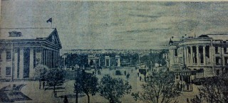

# Улицы старого города 

Луганск пережил драматические повороты истории страны, дыхание разнородных стилей, эпох и тенденций, превративших его в парадоксальную градостроительную структуру – в самом центре города на небольших пятачках земли пустыри, мергельные развалюхи, добротные особняки начала XX века, стеклянные айсберги века XXI...

Вы спускаетесь от СШ № 20 улицей имени Александра Шеремета. Пересекаете улицы Шевченко, Маркса, Ленина, Почтовую, Даля... Вы идете улицей, названной в честь архитектора с большой буквы! А. Шеремет – автор монумента Борцам Революции, ДК железнодорожников, жилых домов на Красной площади, парка имени М. Горького… Остался нереализованым фантастической мощи и выразительности проект набережной Лугани...

Пройдя улицу, вы упираетесь в линию железной дороги. За дорогой находится территория, некогда имевшая репутацию самого красивого места в городе. Это участок Цупова, бывший Булацелевский. Спроси любого луганчанина: кто такой Булацель? Редкий горожанин ответит, что это архитектор, почетный гражданин города дореволюционной поры...

Федор Булацель, 1874 - 1919 г.г. Дворянин. Член городской Думы. Окончил Санкт-Петербургский институ путей сообщения. Спроектировал лучшие здания Екатеринослава (г. Днепропетровск): Зимний сад, Народный дом (не сохранился), Дом коммерческого образования, Английский клуб (перестроен)…

Во время Первой мировой войны Ф. Булацель строил мосты в Могилевской, Минской, Волынской губерниях (строил мосты в том же регионе и А. Шеремет в годы другой войны – Великой Отечественной). Попал в немецкий плен. Тяжелобольным вернулся из плена в 1918-м…

В Луганске Федор Булацель свыше ста лет назад разработал генеральный план города. На своей земле, рядом с рекой и Ботаническим садом (вырублен «на дрова» в годы Отечественной войны) построил дом, в котором жил. Дом окружал парк с тополиной и липовыми аллеями. Их остатки сохранились по сей день. На фасадной части дома находились две круглые с зубчатым верхом башенки, делавшие его похожим на средневековые дворцы – замки...

Отец паровозостроительного завода – Гартман приобрел у Булацеля часть земли и построил несколько одно- и двухэтажных домов для специалистов. Дорожки выложили красным кирпичом. Еще в прошлом году их фрагменты просматривались на участке. Теперь они закатаны асфальтом. Работали фонтаны. Участок утопал в цветах...

В 1935 году луганчане вышли с предложением переименовать Булацелевский участок: «Просим президиум городского совета присвоить имя вождя Красной Армии К. Е. Ворошилова Булацелевскому участку». Горсовет счел нецелесообразным давать имя Маршала Советского Союза небольшой территории и переименовал участок а память героя гражданской войны Петра Цупова, казненного в 1919 году петлюровцами. На фронтах гражданской войны погибли и сыновья Петра Цупова – Павел, Егор, Николай...

Стоит ли восстанавливать «историческую справедливость» - возвращать участку имя архитектора Ф. Булацеля? Для начала нужно вернуть территории репутацию самого красивого места в городе. Восстановить архитектурный памятник – дом Булацеля – в 1990-х он был разорен полностью: сняты двери, оконные рамы, полы, часть перекрытий, разобрана и поломана веранда.

Попутешествовав по экс-Булацелевскому, выходим на улицу имени К. Либкнехта до 1922 года – улица Садовая. Интенсивная застройка улицы, которая должна была стать одной из основных магистралей, соединяющих центр Луганска с Каменным Бродом, начата при городском голове Николае Холодилине. Благодаря энергии этого человека Луганск обрел статус города в 1882 году, появились новые улицы, а горожане получили городской сад – ныне парк им. 1 Мая. Сад принадлежал семье Холодилина, но он счел нужным сделать его достоянием луганчан. Сад окружала высокая кирпичная стена, которую во второй половине ушедшего века снесли «как оскорбляющую достоинство граждан». От сада и начинается бывшая Садовая...

От зданий дореволюционной поры мало что осталось. Сыграли свою разрушительную роль и война, и наводнения 1917 и 1924 годов – они ведь не только жизни человеческие уносили... После паводка в начале 1960-х снесли большой квартал старой застройки. На его месте завод...

Именно с Садовой начата электрификация города. В 1912 году под залог городского имущества взяли кредит – 150 тысяч рублей в Донском земельном банке для строительства городской электростанции. Турбогенераторы приобрели в Стокгольме. Построили Станцию на углу Садовой и Патронной (ныне улица Рабочая). Уже в 1915-м электростанция дала прибыль...

В этот же период на другом конце улицы напротив городского сада приступили к сооружению мужского монастыря (дом № 62). Он должен был стать доминантой Садовой. Намеченное не сбылось – успели возвести лишь обширные подвалы и первый этаж – стройка застопорилась – началась Первая мировая война.

Садовая времен царствования последнего из Романовых – это чугунолитейный завод Гуткина, мыловаренный завод Демидова, казенный спиртзавод... На Садовой в 1899 году открыли городское училище, доступное для детей из бедных слоев населения. Решением городской управы училищу присвоили имя А. Пушкина. Помимо общеобразовательных дисциплин учащиеся могли овладеть столярным, токарным, кузнечным, слесарным делом. Причем делалось это не на уровне уроков трудового воспитания в советских школах. Обучающийся столярному делу должен был в течение года изготовить письменный и обеденный стол, буфет, книжный шкаф, оконные рамы, двери...

Среди учащихся был Владимир Смоленский. Вряд ли это имя о чем-то говорит луганчанам. После революции – офицер Добровольческой армии. Эмигрант. Окончил в Париже Высшую коммерческую школу. Стал «средней руки» предпринимателем. Отдушиной являлась поэзия. Печатался с 1929 года. Первый сборник вышел в 1931-м – «Закат». Книга «Наедине» (1938 год) выдвинула имя Смоленского на видное место в русской зарубежной литературе. Последняя книга «Стихи» – издана посмертно в 1963-м (умер Смоленский в 1961 году). Несколько строк из лирики земляка:

>   Закрой глаза, в виденье сонном
>
>   Восстанет твой погибший дом –
>   
>   Четыре белые колонны
>   
>   Над розами и над прудом.
>   
>   Давно был этот дом построен,
>   
>   Давно уже разрушен он,
>   
>   Но, как всегда, высок и строен,
>   
>   Отец выходит на балкон.
>   
>   И зоркие глаза прищуря,
>   
>   Без страха смотрит с высоты,
>   
>   Как проступают там, в лазури,
>   
>   Судьбы ужасные черты.
>   
>   А рядом мальчик черноглазый
>   
>   Прислушивается, к чему –
>   
>   Не знает сам, и роза в вазе
>   
>   Бессмертной кажется ему...

Неподалеку от здания, где учился будущий видный поэт русского зарубежья, находится Полтавский переулок. Там, в доме семьи Сапрыкиных, вместе с родителями часто бывал будущий советский поэт Михаил Матусовский...

Здесь же, в Полтавском переулке, незадолго до Первой мировой войны заведующий казенным винным заводом Николай Стефанович построил необычное для Луганска здание в стиле модерн. Коммерсант Стефанович коллекционировал живопись, скульптуру, предметы, найденные в ходе археологических раскопок. Чтобы коллекцию видели горожане и гости города, он решил сделать ее общедоступной – открыл в своем доме самый первый городской музей. Где был и директором, и экскурсоводом. На входе в музей стояли скифские каменные бабы.

Этот музей стал основой для открытого здесь в 1924 году Луганского краевого Социального музея. Директором его стал археолог Сергей Локтюшев. Этот человек – первопроходец в деле систематических археологических исследований на территории Луганска. Авторитетнейшая фигура а археологических кругах – в 1938 году Локтюшев выступал с докладом об археологических изысканиях в Луганске в Международном институте антропологии в Париже.

Музейную коллекцию накануне оккупации города эвакуировать не смогли. Локтюшев остался в захваченном Луганске. Лучшие экспонаты оккупанты увезли в Германию. Часть экспозиции погибла при пожаре, часть была разграблена населением. 14 февраля 1943 года – в день освобождения от оккупантов – Локтюшев был арестован. Умер 17 марта в тюрьме НКВД. Здание музея – дом Стефановича погибло после гибели своего директора. Бомбежка...

Улицы и переулки ныне асфальтом покрыты – первые асфальтовые мостовые в Луганске появились в конце 1920-х. А в давние времена? Самой распространенной постовой в дореволюционном Луганске была булыжная. Выложена из круглых или овальных камней. Прочная и не скользкая. Первая мощеная улица (Петербургская – Ленина) появилась в городе в начале XX века. К 1917 году замостили центр. Вокруг центра улицы были покрыты щебнем либо представляли собой обыкновенные проселочные дороги, ямы и ухабы на которых заделывали булыжником. Тротуары? Имелись перед магазинами, банками, особняками. Мостили их из кирпича «В елочку» или из керамической плитки. Булыжные мостовые сохранились фрагментарно. От тротуаров былой поры следа не осталось.

Не осталось следа и от деревянных домашних купален на берегу Лугани. Река в те времена была и чище, и глубже, и полноводней. а в отдельных местах – и более широкой. Рядом с пивоваренным заводом находилась прокатная лодочная станция, от городского сада курсировал прогулочный пароход.

У городского сада (парк имени Первого мая) расположен Созинский переулок. Его впору в книгу рекордов Гиннеса заносить, ибо состоит он... из одного частного домостроения! Когда-то в переулке было несколько домов. Здесь жила семья врачей Скворцовых. Константин Скворцов начал в Луганске практику врача-хирурга в 1906 году. Сюда же после окончания Петербургского женского медицинского института приехала работать гинекологом Евгения Скворцова. Более полувека семья врачей Скворцовых лечила горожан, оставив по себе добрую память. Дом Скворцовых не сохранился – разрушен бомбежкой. Не сохранился и расположенный в конце переулка городской питомник, снабжавший горожан саженцами фруктовых деревьев.

Рядом с Созинским переулком находится переулок Натальевский. До революции это был не переулок – улица! Потом ее разделили на два переулка – Крупской и Натальевский. По переулку, названному в честь супруги Владимира Ильича, в послереволюционные годы селились семьи областного руководства. Здесь жили первые секретари обкома партии Антон Гаевой и Владимир Шевченко. В доме, где ныне Епархиальное управление, бывали Никита Хрущев и Генеральный прокурор СССР Роман Руденко – он, между прочим, представлял наш регион в Верховном Совете СССР..,

Переулок Натальевский. Было и неофициальное название – Польский переулок. В 1902 году по ходатайству проживавших в городе поляков городская власть выделила участок земли, на котором были построены костел и католическая школа (дом № 5). Рядом – дом шахтовладельца Ноткина.

Украшением переулка является особняк Сергея Ильенко. Здесь более десяти лет размещается редакция «Жизни Луганска». Еще лет пятнадцать назад в доме – памятнике архитектуры были паркетные полы из дуба...

Сергей Михайлович Ильенко. Более сорока лет был предводителем дворянства Славяносербсхого уезда. Его отец дружил с поэтом Николаем Некрасовым. Преподавал в Казанском университете. Предводитель дворянства вложил средства в постройку железнодорожной ветки Луганск – Миллерово (1897 год). Содержал дом престарелых и детский приют. Почти за сто лет до горбачевской антиалкогольной кампании возглавил в Луганске в 1894 году городское общество трезвости. С целью отвлечь граждан от алкоголя организовал библиотеку, лекторий, драматический коллектив, которым руководил И.Боголюбов (впоследствии – актер МХАТа). В Первую мировую войну Сергей Ильенко занимается сбором пожертвований для нужд армии. После революции выехал в Ростов-на-Дону, где умер в 1918 году. О его сыновьях. Николай – в русско-японскую войну командовал эскадроном. Михаил – после революции эмигрировал в Югославию. Константин - про живал в Луганске, репрессирован в 1930-х.

Следует отметить, что предводитель дворянства был довольно крупным помещиком. В его имении, в Макаровой Яру, с десяти лет батрачил будущий герой гражданской войны Александр Пархоменко. Так переплетаются судьбы...

От переулка Натальевского идем в парк Первого мая. Выходим к улице Линия железной дороги. Когда немцы заняли Ворошиловград, то начальнику полиции Лейзенбергу сообщили о человеке с редкой фамилией, проживавшем в доме на улице Линия железной дороги. Звали человека Иосиф. А фамилия его была... Гитлер. После допроса Гитлера расстреляли, Зарыли на Острой Могиле...

Одна из старейших городских улиц – улица Даля. Она же (до 1976 года) – Юного Спартака. Она же (до 1922 года) – Английская. Правильно было б ей назвать не улицей, а бульваром. Бульвар – это улица, на которой по центру высажены деревья. Еще лет пятнадцать назад вдоль аллеи стояли скамейки. Не уцелели...

Здесь – дом-музей Владимира Даля. Здесь, в 1981-ом установлен памятник лексикографу. О Владимире Дале вряд ли кто не слышал. А вот об отце выдающегося земляка этого не скажешь. Иван Даль получил университетское образование в Германии. Придворный библиотекарь Екатерины Великой. 210 лет назад назначен старшим лекарем Луганского литейного завода. Затем – старший лекарь Луганского округа. С именем Ивана Даля связано зарождение медицины и ее профилактического направления в нашем регионе. На улице Даля уцелел ряд архитектурных памятников дореволюционного периода. Здание санитарной станции с великолепной изразцовой печью. Двухэтажное здание казначейства (напротив СШ № 2) за сто лет практически не изменилось внешне. Водолечебница – двухэтажный особняк с двумя боковыми хозяйственными флигелями, соединенными переходами. Главный фасад дополняют колонны, поддерживающие деревянный балкон. Декоративные металлические решетки.

90 лет назад здесь размещался Совет Народных Комиссаров Донецко-Криворожской республики во главе с товарищем Артемом, который самолично отделил республику от Украины и заявил о присоединении к России. Ленин самоуправство осудил и в присоединении к России отказал, так как без Донецко-Криворожского промышленного бассейна Украинская республика будет экономически не самодостаточна. Здесь же в 1919-ом размещался штаб частей Добровольческой армии, занявшей город. Улица Даля выходит на улицу Пушкина – одну из немногих улиц, не поменявших названия. Постановлением городской управы от 22 марта 1899 года «О способе чествования городом дня столетия рождения А. С. Пушкина» решено присвоить одной из улиц наименование Пушкинская; вручить учащимся книги поэта; назвать его именем городское училище; учредить десять стипендий имени поэта.

Улица входила в тройку красивейших в городе наряду с Петербургской (Ленина) и Казанской (Карла Маркса). Но в годы войны бомбардировки превратили ее в руины.

Гостиница «Октябрь». Построена в 1947-1951 годах по проекту архитектора Н.Каракиса. Сочетание красного и белого кирпича. Полированный гранит. Лепные детали. Еще недавно парадный подъезд украшали фонтаны «Шар». Еще недавно в перворазрядной гостинице на 400 мест бурлила жизнь, А теперь... Ветшает визитная карточка города. На месте гостиницы стояло здание, в котором после освобождения от захватчиков размещался ЦК КП(б) Украины. Напротив экс-гостиницы – экс-Дом учителя. Построен в 1920-х архитектором Георгием Нероном (автор зданий сельхозинститута, СШ № 7, больничного городка). Имя градостроителя (умер в 1935 году) не увековечено. Изначально здание называлось Дом беспризорника. Затем там квартировал обком партии.

Дворец культуры железнодорожников. Крышу дворца украшали скульптуры. Демонтированы на излете XX века. Здесь с 1912 года размещался Горно-коммерческий клуб. С 1922 года – Народный Дом, место культурного времяпрепровождения горожан. Затем – театр оперный, а после войны – театр драматический. В последние годы идут разговоры о воссоздании оперного театра по прежнему адресу...

На площади перед ДК и институтом «Гипрошахт» (с балкона этого здания выступал Никита Хрущев) еще несколько лет назад росли акации. На месте акаций – парковка автомобилей. В последнюю четверть ушедшего века на площади сделали подземный переход к парку им. Первого мая, Переход закрыт плитами. Зона подтопления...

Площадь. 1949 г.

На улице имени великого русского поэта в июле 1927 года в Народном Доме выступал великий советский поэт Владимир Маяковский. Он остановился в доме, где собирались местные поэты, Дом находился на углу улиц Маркса и Пушкина. Снесен года три назад. Пустырь. Кусты уцелевшей сирени. За пустырем – банк... До революции на Пушкинской размещались типография Гаммерштейна, мужская гимназия, гостиницы «Версаль» и «Центральная», в которой затем размещался горком партии. На углу с Петербургской (там теперь мебельный магазин) было фотоателье С.Чуюна. Если о послереволюционной судьбе фотомастера Льва Матусовского (в его фотоателье нынче банк) известно – уехал в Москву к сыну, то о том, как сложилась жизнь С.Чуюна, информации найти не удалось. Это был мастер! В 1905 году на Всемирной фотовыставки в Париже удостоен Гран-при и Золотой медали...

Проходя мимо экс-Дома учителя (там несколько лет назад был пожар), увидите бюст городского головы Николая Холодилина – на этом месте раньше был фонтан «Чаша». Свернув вправо на Ленинскую, вы увидите дом № 47 (в нем недавно также был пожар). Здесь до революции квартировал помещик из села Ново-Ивановка Сергей Савич. С началом Первой мировой войны (1914 год) глава семейства, невзирая на непризывной возраст, ушел на фронт. Командовал ротой. Четырежды ранен. Награжден орденом Святого Георгия. Ушли на фронт и его дети: Михаил – награжден орденами Святого Георгия и Владимира с мечами, Алексей – тяжело ранен, попал в немецкий плен, Екатерина – сестра милосердия.

Напротив, в доме № 54, жил человек, сказавший о себе:

>   Донбассовцы. Я не из сказки вышел,
>   
>   Не из поверий древних и легенд,
>   
>   Работал я в хозяйской шахте-нише.
>   
>   Сегодняшний поэт - интеллигент.

Это – Павел Беспощадный. За многочисленные произведения о шахтерах награжден орденом Ленина, двумя орденами Трудового Красного Знамени...

Выше дома, где жил горняцкий поэт, – пустырь. Штабель железобетонных плит, забор. Еще в 1993 году на заседании градостроительного совета при управлении архитектуры Луганского горсовета институтом «Луганскгражданпроект» был представлен проект реконструкции исторической части города, в том числе и проект строительства Казанского храма. Проект одобрили. Прошли годы...

Казанскую церковь снесли в 1935 году. До революции церковным старостой храма являлся городской голова Николай Холодилин. Умер в 1929 году. И вот какой исторический поворот: двухэтажный дом семьи Холодилиных (снесен в последнюю четверть XX века) стоял практически на том месте, где ныне находится временное помещение Казанского храма...

*Чепурнов Ю. Улицы старого города // Жизнь Луганска. – 2008 г. - №49,50,52.*
