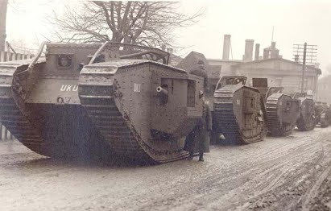
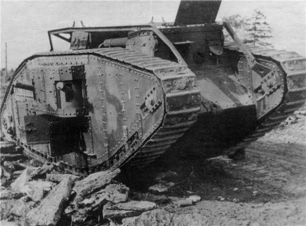
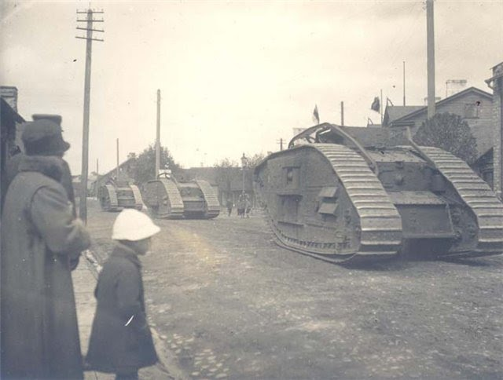

# Почему Луганск?

Ровно 70 лет назад - в 1938 году - с легкой руки наркома Клима Ворошилова в Луганск попали уникальные английские танки модели «Марк-5». Боевые машины были переданы городу как образцы самой передовой техники времен первой мировой войны. Именно этот танк входит в топ-десятку лучших машин прошлого века, несмотря на то, что уже в конце 30-х годов это уже были не действующие модели, а экспонаты истории. Они были пересланы в Луганск для обустройства мемориального комплекса «Борцам революции».

До недавнего времени мало кто из луганчан знал, что город владеет редчайшими экземплярами военной техники, коих осталось 5-6 в мире. Выяснилось, что МК-5 («Марк-5») разыскивают английские историки - члены общества «Друзья Линкольн-танка» - из города, где в начале XX века впервые в истории человечества был создан танк. Они занимаются поисками каждой машины, выпущенной на предприятии своего города. Этот интерес привел председателя общества Роберта Скотта в Луганск. Он хотел выяснить, каким образом попал МК-5 из Великобритании в восточную Украину. Когда он увидел танки и сообщил о своей находке в Англии, было принято решение о реставрации машин.      Руководству города предложили принять участие в финансировании, перечислив на восстановление уникальных машин лишь 1/4 необходимой суммы. И сделать это первыми. Остальную сумму соотечественники «броневиков» обязались внести сами. Это ни много ни мало, а порядка миллиона евро. Один из танков, который внутри представляет собой площадь в 22 квадратных метра, мог бы стать не просто экспонатом, а своеобразным музеем, в котором можно было проводить экскурсии.

Такие работы не выполнялись нигде в мире.
 

 
## Как английские танки оказались в Луганске?
 
Боевые машины принимали участие в гражданской войне 1918-1920 годов и были задействованы войсками Деникина против красноармейцев: правительство Объединенного Королевства в числе другого вооружения и обмундирования поставило и эти танки Белой гвардии. Луганские историки установили, что оба луганских «Марка» в составе Белой гвардии двигались из Новороссийска в Севастополь, затем приняли участие в боях на Перекопе. Каждая машина МК имела свое имя: «За святую Русь», «Первая помощь» и др. Установлено, что один из «луганских» танков носил имя «Дерзкий».

В ходе сражений машины были отбиты у белогвардейцев красными. И уже в 1920 году эти, а также французские танки входили в первый автотанковый отряд, который и положил начало новому роду войск РККА - танковому.

Всего в Россию было передано около 60 танков, из которых уцелело лишь около 30. В 30-е годы танки марки МК-5 были сняты с вооружения частей Красной Армии. А в 1938 г. нарком обороны Ворошилов утвердил документ, в котором имелась следующая информация: «…Все эти танки не на ходу, без вооружения, хранятся на окружных и центральных складах и войсками не используются. Танки считаю необходимым использовать следующим образом: «Риккардо» (так, по названию модификации двигателя, называли в СССР танки «Марк-5») в количестве 14 штук передать по два городам: Смоленску, Ростову-на-Дону, Харькову, Ленинграду, Киеву, Ворошиловграду (в настоящее время - Луганск) и Архангельску для использования их как исторические памятники гражданской войны…».
 

## Немного истории.

Танки серии МК-5 выпускались в Англии только год (с 1917 до 1918-й). За это время было произведено 400 машин. Существовало две модификации («male» и «female», что означает «самец» и «самка»). Их различие между собой заключалось в вооружении: самец - 2 пушки и 4 пулемета, самка - только 6 пулеметов. Однако самки оказались слабыми в бою, это показала битва с германскими танками под Виллер-Бретоне 24 апреля 1918 года. И тогда конструкторы пришли к выводу один пулеметный спонсон «female» сделать пушечным. Измененная модификация получила название «композит». Из 400 танков «Марк-5» 200 были «самцы» и 200 «самки». Сколько «female» было переделано в «composite», неизвестно, но, пожалуй, меньше 200.

Какого же «пола» луганские «МК-5»? Если внимательно присмотреться к их «стволам», то можно заметить, что с одной стороны (справа) видна башенка пушечного спонсона, а с другой - нет, поскольку он пулеметный. Если так, то оба танка у Луганского краеведческого музея являются модификацией «сomposite». 

Курьезный случай произошел на встрече луганчан с британцами. Переводчик, не зная спецтерминологии, технического сленга конструкторов и инженеров, понятия «самки» и «самцы» понял буквально. Перевод звучал примерно как «слева в танке сидели мужчины (надо «пушки»), а справа женщины (надо «пулеметы»). Надо было видеть лицо переводчика, который удивленно глядя на Скотта, озвучивавшего текст, не понимал, что могли делать в танке «самки» и «самцы», а стрелял кто?

Машин марки МК в мире осталось всего пять (кстати, в Харькове и Архангельске хранятся «самки», так что таких модификаций, как в Луганске, еще меньше). Ни один экземпляр не сохранился даже в Великобритании - родине бронированных гигантов.

А после перевооружения Красной Армии трофейные танки установили в городах бывшего союза как памятники. Большинство из них во время Великой Отечественной войны переплавили на столь необходимый в то время металл. Луганские танки могла постичь та же участь, ведь металл нужен был и нашей стране, и оккупантам. Но опасность над уникальными памятниками возникла не в военный период, а гораздо позже. В так называемое время «оттепели». Английские танки были демонтированы. Обе 35-тонных машины были закопаны в землю на территории завода имени Ленина. Позже их все-таки возвратили на место.

Машинам 90 лет, но их реставрацией никто и никогда не занимался, в некоторых местах сантиметровая английская броня проржавела насквозь. Реставрация может как спасти их, так и убить. Но как британские, так и Луганские специалисты утверждают, что танки вполне можно восстановить. 

В Европе интерес к военной технике огромный. А преклонение британцев перед уникальными боевыми машинами, созданными в их стране, заставляет таких энтузиастов, как Роберт Скотт, искать сохранившиеся боевые машины по всему миру, даже в пустынях Африки. Он выяснил, что на территории бывшего СССР сохранились 5 танков «МК-5», именно того образца, которым не располагает сама страна-производитель. Три танка он нашел в Украине: один в Харькове, и два - в Луганске.

Роберт Скотт утверждает, что сегодня в Англии имеется только танк МК-4. В ноябре 2007 года в Луганске была создана группа, которая ставит своей целью восстановление британских танков. 

