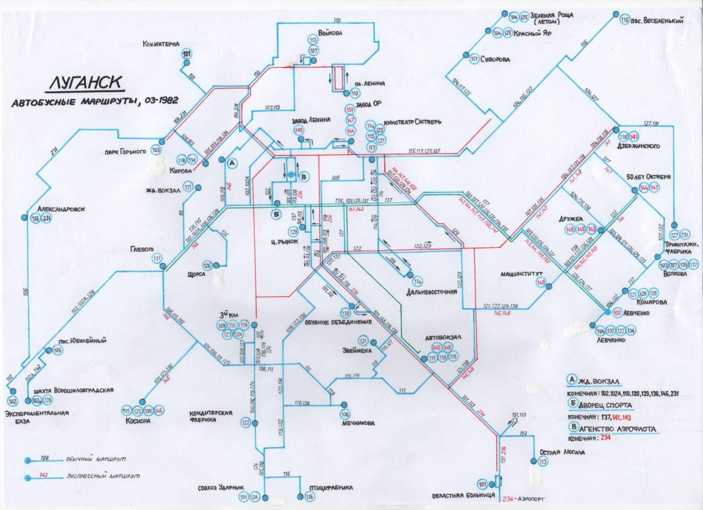

# Луганский автобус

Луганский автобус — автобусная сеть Луганска, включающий в себя как автобусы, работающие в режиме рейсового автобуса, так и те, что работают в режиме маршрутного такси.

## История

Автобусное движение в городе началось в 1931 году. Активное развитие автобусной сети города начался в 1970-е годы.

После Великой Отечественной войны, на середине XX века, курсировали маршрутные такси ГАЗ-М-20 «Победа», вскоре курсировали очень редко.

В 1960-х годах вышли первые автобусы ГЗА-651 на маршруты города, последний автобус курсировал в середине 2000-х годов.

В 1968 году на улицы города вышли первые автобусы венгерского производства Ikarus 180. Автобусы Ikarus 556 в город не поставлялись, поскольку на городских маршрутах эксплуатировались одиночные автобусы моделей ЛиАЗ-677 и ЛАЗ-695. Последние автобусы Ikarus 180 исчезли с улиц в 1977 году.

Первые маршрутные такси "РАФ-977" вышли в город на городские маршруты в начале 1970-х годов и продолжались до начала 1980-х годов, заменили РАФ-977 на РАФ-2203, продолжились до 2005 года.

В 1973 году город получил первые автобусы Ikarus 260, а в 1975 году — Ikarus 280. Автобусы ЛАЗ-695 до конца 1970-х исчезли с городских маршрутов, их поставки проводились только на пригородное АТП-12121 и на автобазу «Турист». Автобусы ЛиАЗ-677 продолжили работать вместе с венгерскими «Икарусами» в городском АТП-12125 к концу 1990-х. Последние поставки автобусов «Икарус» были весной 1991 года. Последние 4 автобуса ЛиАЗ-677 получены в январе 1994 года.

С 1973 по 1991 год городское АТП получило более 500 автобусов «Икарус» 2хх-го модельного ряда. Начиная с 1990 года, эти автобусы массово выводились из эксплуатации, а на городских маршрутах снова начали работать автобусы ЛАЗ-695. Последние автобусы Ikarus и ЛиАЗ-677 исчезли с улиц в начале 2000-х.

С начала 1990-х на улицах города начали курсировать автобусы в режиме маршрутного такси «Кубань-Г1», КАвЗ-685, ТС-3965, ПАЗ-672, ПАЗ-3205, но в 2007-08 они исчезли с улиц Луганска.

В 1995—1996 годах на улицах города начали курсировать автобусы ЛАЗ-52523, Volvo и Scania, но в начале 2000-х они также исчезли с улиц города.

В начале 2000-х на улицах города начали курсировать автобусы Рута СПВ-15, Псковавто-2214, ГАЗ-2705/3221, европейские фургоны: Mercedes-Benz, Volkswagen, Iveco, и другие в качестве маршрутного такси, в 2007-2014 годах стали постепенно исчезать.

Вероятно, последние автобусы Ikarus 280 курсировали синего цвета на 114 маршруте в 2006 году, Ikarus 263 на маршруте 197 в тоже году, ЛиАЗ-677 на 197 в тоже году. РАФ-2203, последние КАвЗ-685 курсировали в 2007-08 году.

С 2004 году на улицах города курсирует исключительно микроавтобусы «Рута» на базе ГАЗели в качестве маршрутного такси. Также курсировали ХАЗ-3230[укр.], но они исчезли с улиц Луганска в 2008 году. Также курсировали Богдан А091, но также исчезли в 2005 году.

С 2004 по 4 декабря 2009 года автобусные маршруты Луганска обслуживали автобусы предприятия Валерия Букаева ООО «Луганскинтерресурс» (укр. ТОВ «Луганськінтерресурс»), но после конфликта с городскими властями они тоже исчезли с улиц города.

Автобусы ЛАЗ-695 последний раз выходили на городские маршруты в 2008 году. После их выпуск на линию был запрещён городской администрацией.

Позже, в 2009 году городские власти приобрели три автобуса Богдан А092, которые начали курсировать по маршрутам № 101, 110, 113, но после закрытия «Интерресурса» один из автобусов начал курсировать по маршруту № 112.

В 2010 году возобновили маршрут № 114, но в режиме маршрутного такси, на нем начали курсировать 6 автобусов «Богдан-А092».

В 2011 году эти автобусы также начали курсировать по маршрутам № 155, 150. Также предприятие «Транспорт-Профи» (укр. «Транспорт-Профі») приобрело б/у автобусы, которые начали курсировать по маршруту № 150, а также один черкасского производства, который курсирует по маршруту № 134. С июня в городе появляются автобусы городского транспортного предприятия «Гортранс», обслуживающих маршруты № 116 (дубль 155), 155, 167, 197, 170, 101, 110, 112, 107, 115, 113. В октябре в Луганске появились автобусы большой вместимости, которые начали курсировать по маршруту № 197. Также один автобус предприятия «Гортранс» начал курсировать по маршруту № 118. Также по маршруту № 133 начал курсировать автобус «Богдан А067», первый представитель этой модели в Луганске. Также в конце октября автобусы предприятия «Гортранс» начали курсировать по маршрутам № 122 и 140. Приобретённые в 2009 году три автобуса «Богдан А092» с 2011 года начали курсировать по маршрутам № 112, 115, 135-к.

Один автобус Богдан А092 начал курсировать по маршруту № 117 в режиме маршрутного такси, один автобус «БАЗ А079 (Эталон)» начал курсировать по маршруту № 132, автобус I-VAN, курсирующий по маршруту № 101. Также появились автобусы «Гортранса» на маршруте № 133. Также один автобус DAF начал курсировать по маршруту № 169. Автобус «Богдан А067» с ноября курсирует по маршруту № 110. Также автобусы «Гортранса» начали курсировать по маршрутам № 111-А, 111-Б и 129.

В декабре 2011 года был закрыт маршрут № 114, который работал в режиме маршрутного такси. В ближайшее время в городе появятся два новых маршрута № 165 и 165-Б[когда?]. Также появились два автобуса DAF, которые начали курсировать по маршруту № 169. Также автобусы «Гортранса» начали курсировать по маршрутам № 136 и 187, а также в связи с открытием в городе второго гипермаркета «Эпицентр» начали курсировать три автобуса «Богдан А092» с бесплатным подвозом к гипермаркету. С 23 января начали курсировать два новых автобуса «Богдан А092» с пандусом для перевозки инвалидов. Автобусы «Богдан А092» появились и на маршрутах № 122 и 147. Автобусы «Гортранса» начали курсировать по маршрутам № 104 и 125. Был отменён маршрут № 169 из-за своей убыточности. На маршруте № 117 появился первый в городе автобус «Богдан А093» в режиме маршрутного такси. Появился автобус «Богдан А092» на маршруте № 153. С декабря 2012 года прекратили курсировать на маршруте № 197 автобусы DAF. А с апреля 2013 года после проведения конкурса на перевозки автобусы городского предприятия «Гортранс» начали курсировать по маршрутам № 101, 103, 104, 110, 112, 113, 115, 118, 125, 133, 139, 140, 153, 155, 157, 167, 170, 187 и 197. Появился маршрут № 103, который курсирует как маршрут № 107, но через больницу № 7 и ул. Даля, а маршрут № 135-к перенумеровали на № 139. Скоро[когда?] в городе введут в строй новую маршрутную сеть, по которой в Луганске будут курсировать автобусы средней и большой вместимости. Также с 16 июня на 117 маршрут вышли автобусы нового перевозчика ООО «Луганский городской автобусный парк» (укр. ТОВ «Луганський міський автобусний парк»). Все они зелёного цвета, так как он стал фирменным цветом городского транспорта. В ближайшее время[когда?] появятся автобусы «БАЗ-А081» (Василёк).

25 июля прошёл конкурс перевозчиков, победителем которого стало предприятие «ЛГАП», которое выставило на конкурс 23 «Эталона» и 15 «Богданов», которые начнут[когда?] курсировать по маршрутам № 110, 111, 117, 119, 122, 134, 137, 167, 170, 197. В ноябре 2013 года 133 маршрут поделили на два: № 133-а (который курсирует, как обычный № 133) и № 133-б (который от 39 школы курсирует до посёлка Большая Вергунка), на эти маршруты вышли два автобуса предприятия ЛГАП. В начале марта 2014 года был вновь возобновлён 114 маршрут в режиме маршрутного такси.

В июле 2014 году, из-за обстрела Оборонной улицы, вместо трамвая в том же месяце курсировали коммунальные автобусы по маршруту № 6, дублируя маршрут трамвая, но вскоре из-за массированных обстрелов города прекратили курсировать коммунальные автобусы. В августе коммунальные автобусы вышли на маршруты № 155, 167, 197 и 110, проезд был бесплатный до февраля 2015 года. В ноябре курсировали коммунальные автобусы на маршрутах № 6, 101, 107, 110, 115, 133, 155, 167 и 197.

С сентября 2022 года стали курсировать автобусы из Москвы: ЛиАЗ-4292 и ЛиАЗ-5292 на маршруте № 155, позже и на № 197. Также вышли ГолАЗ-5251 «Вояж» на № 433 С 29 декабря 2022 года на маршрут № 115 вышел Луидор-223206(МВ Sprinter Classic),маршрут перешёл под полный контроль предприятия МУП " Луганскгортранс". С 31 декабряЛуидор-223206(МВ Sprinter Classic) вышли на маршрут №135 (2 единицы).

С 8 марта 2023 ЛиАЗы стали курсировать на № 167. Также дополнительный маршрут № 167В вышел один Mercedes-Benz Sprinter от Южного до Вольного.

В июне 2023 года в городе замечен единственный в Луганске ПАЗ-3203 в режиме маршрутного такси, курсировал он на маршруте № 126, однако курсировал «ПАЗ-3203» всего один день.

С конца августа 2023 года заменили автобусы «Рута» на новые «ГАЗель NEXT» белого цвета на маршруте № 110. Эти автобусы принадлежат «Луганскгортрансу». Также вышли новые ПАЗы на маршрут № 433. По состоянию на 31 августа два новых ПАЗа работали на 135 маршруте, заменённых Луидор-223206.

В ноябре 2023 года Mercedes-Benz Sprinter заменил ПАЗ-32053 на 115 маршруте.

С 6 декабря 2023 года МУП "Луганскгортранс" возобновил движение по маршруту № 231 (в 2021 году отменён из-за нерентабельности), на маршрут вышли ГАЗ-А64R42 (1 единица). Также вышли белые и бирюзовые ЛиАЗы на маршрутах № 155, 167 и 197. В декабре 2023 года курсируют автобусы ЛиАЗ на маршрутах № 155, 167, 197; автобусы ГАЗель NEXT на маршрутах № 110 (кольцевой), 167в и 231; ПАЗы — на маршрутах № 115, 135, 433. Последний Богдан А201 курсировал по 104 маршруту весной 2023 года. С января 2024 появился бесплатный маршрут от квартала 50 лет Октября до гипермаркета «Манго» (бывший гипермаркет «Metro»). На маршруте работает белый ЛиАЗ предприятия "Луганскгортранс".

С 10 марта 2025 был запущен новый маршрут 104 А, перестали функционировать маршруты 171,124 А/Б.

В марте 2025 года частные перевозчики начали обновлять автопарк, на маршрутах города были замечены ПАЗ-320405-14 "Vector Next" (137А/Б), и ГАЗ-А68R52 City (147а/б)

## Подвижной состав

После 2014 года автобусов марки «Богдан» стало значительно меньше, они стали заменяться различными моделями автобусов «Газель».

Ранее в городе работали автобусы (некоторые могут и по сегодня работать):

* ЛиАЗ 4292 — 20 единиц.
* ЛиАЗ 5292 — 79 единиц.
* ГолАЗ — 5 единиц.
* ПАЗ 3205 — 11 единиц.
* ГАЗ А64 Next — 4 единицы.
* Луидор — 12 единиц.
* Богдан А069 — 0, ранее — 1 единица.
* Богдан А092 — 14 единиц, ранее — 50 единиц.
* Богдан А201 — 0, ранее — 38 единиц.
* Богдан А093 — 0, ранее — 12 единиц.
* БАЗ-А081 «Василёк» — 0, ранее — 22 единицы.
* БАЗ А079.45 «Эталон» — 0, ранее — 1 единица.
* БАЗ А079 «Эталон» — 0, ранее — 2 единицы.
* Богдан А091 — 0, ранее — 1 единица.
* I-VAN — 2 единицы.
* ЛиАЗ-677 — с 1971 по 2003 год, примерно 300 единиц.
* ЛАЗ-695 — с 1960-х по 1970-е годы, затем с 1991 по 2007 год.
* Ikarus 180 — с 1968 по 1977 год, примерно 40-50 единиц.
* Ikarus 260 — с 1973 по 2004 год.
* Ikarus 280 — с 1975 по 2004 год.
* ЛАЗ-52523 — с 1995 по 2001 год, 30 единиц.
* Автобусы Volvo Van Hool, Volvo Wiima, Aabreanna, Scania CR12 — с 1995 по 2003 год. Примерно 20-30 единиц.
* Karosa C 734 — с 2001 по 2007 годы. Примерно 50-60 единиц.

Также работали автобусы (маршрутные такси) моделей — РАФ, КАвЗ-685, ПАЗ-672, ПАЗ-3205 и другие.

В 2022 Луганск из Москвы поступили[когда?] автобусы марки ЛиАЗ-4292 и ЛиАЗ-5292 в количестве 100 штук. Они будут работать[когда?] на маршрутах города. С 1 сентября 2022 года новые автобусы ЛиАЗ работают на маршрутах № 155 и 197 с прежним расписанием. «ГАЗели», снятые с этих маршрутов, были перераспределены между другими маршрутами, в частности, был восстановлен маршрут № 128, подвижной состав которого из-за отсутствия пассажиропотока постепенно сокращали. Также были пополнены маршруты № 6, 107, 110, 117, 132, 151 и 152. Был восстановлен маршрут № 126,который отменили в 2018 году

## Маршруты

Маршруты городского общественного транспорта с 1965 года переведены в нумерацию европейского образца[источник не указан 458 дней]: трамвайные маршруты получили номерной разбег[уточнить] с 1 по 50, троллейбусные — с 51 по 100, автобусные — с 101 по 150, маршрутного такси — с 151 по 200, а пригородные — с 201. С середины 90-х годов нумерации маршрутов автобусов и маршрутных такси были смешаны в единую номерную категорию из 101 до 200.

Автобусные маршруты, которые существовали с 90-х годов XX века

|Маршрут    |Начальная остановка    |Конечная остановка |Период работы  |График работы (по времени отправления) |Выходной или воскресный график  |
|---|---|---|---|---|---|
|   |   |   |   |   |   |
|6      |Машколедж      |Областная больница |с осени 2017, вместо недействительного трамвая 6   |6:00-17:20 каждые 30-40 мин.   |   |
|52     |Кв. Мирный     |Кв. 50 лет Октября |в октябре-ноябре 2021, вместо троллейбуса курсировал один ЛиАЗ-5256    |7:30 - 16:40 каждые 120 мин|   |
|101    |ул. Коминтерна |Автовокзал         |до 2016    |   |   |
|102    |с. Юбилейное   |Машколедж          |до 2007    |   |   |
|103    |Парк Горького  |кв. 50-летия Октября   |до 1992    |   |   |
|104    |с. Паньковка   |Автовокзал         |сезонный, с 15 апреля по 15 ноября |6:35-19:06 маршрут обслуживает МУП "Луганскгортранс"|  |
|104 А  |Рымбытехника   |СНТ "Краснояровец" |с 10 марта 2025 года   |Рымбытехника: 5:25;8;56;12:48;17;16 СНТ "Краснояровец": 6:30;10:35;15:15;18:35|   |
|105    |ул. Моисеенко  |кв. Комарова       |до 2014    |   |   |
|106    |с. Юбилейное   |г. Александровск   |до 2007|   |   |
|107    |пл. Ленина     |кв. Якира          |   |5:30-18:00 каждые 8-10 мин.(в выходные нестабилен)|    |
|108    |кв. Южный      |ВУНУ               |до 2014    |   |   |
|109    |кв. Южный      |кв. Волкова        |до сер. 2000-х |   |   |
|110 А/Б (кольцевой)    |пл. Ленина |ул. Котельникова   |   |5:30-19:50 каждые 15 мин; маршрут частично обслуживает МУП "Луганскгортранс"|  |
|111 А/Б (кольцевой)    |Ж/Д вокзал |Автовокзал |маршрут не функционирует   |5:30-18:55 каждые 60 минут.    |   |
|112    |Автовокзал     |садовое товарищество "Рассвет"|    |отправление от ост. Автовокзал - 7:30,8:30,16:00,17:00|    |
|113    |пл. Ленина     |Автовокзал         |до 2014    |   |   |
|114    |кв. Мирный     |кв. 50-летия Октября   |до 2013    |   |   |
|115    |с. Веселенькое |Машколледж         |   |5:26 - 11:30 каждые 60 мин.|14:30-17:26 каждые 60 мин. Маршрут обслуживает МУП "Луганскгортранс"|
|116    |кольцо ОАО ХК «Лугансктепловоз»    |кв. Комарова   |??? (существовал состоянию на 2006)|   |   |
|117    |пл. Ленина     |кв. Дзержинского   |из-за ремонта мостов в городе маршрут разделён на А(до парка Горького) и Б (до площади Ленина)|5:30-19:30 каждые 5 мин.|   |
|118    |кв. Мирный     |кв.Дзержинского    |   |4:50-9:05; 13:03-16:35 каждые 25-60 мин.|  |
|119    |кв. Мирный     |пл. Ленина         |   |5:30-18:00 каждые 10-20 минут.|     |
|120    |Ж/Д Вокзал     |кв. Якира          |до 2007|   |   |
|121    |Областная больница |кв. Якира      |до 2007, с 18.03.23 по 05.2023,маршрут не функционирует    |06:00-17:00 каждые 60 мин. |   |
|122    |п.Тельмана (Фабричное) |кв. Комарова   |   |5:30-19:06 каждые 10 мин. с Фабричного: 5:40, 6:30, 7:35, 8:30, 9:35 11:35, 13:35, 15:35, 17:20.|      |
|123    |Областная больница |кв. 50 лет Октября |до 2007    |   |   |
|124 А/Б (кольцевой)    |кв. Мирный |с. Роскошное   |маршрут временно не функционирует  |5:30-17:00 каждые 30-40 мин.   |   |
|125    |Машколледж     |с. Паньковка       |до 2017    |   |   |
|126    |ул. Грабовского    |кв. Якира      |до 2014, с сентября 2022   |5:20-20:00 каждые 8-10 мин.    |   |
|127    |Ж/Д Вокзал     |с. Зелёная Роща    |??? (существовал на 01.04.2003)    |   |   |
|128    |кв. Мирный     |Обл. больница      |до 2002, с 24 августа 2020 года    |5:30-19:30 примерно каждые 5_10 мин.|  |
|129    |Ж/Д Вокзал     |Бар «Черный Кот»   |   |5:30-18:20 каждые 8-15 мин.|   |
|130    |Аграрный университет   |кв. Комарова   |в 2009, дубль 54 троллейбуса   |   |   |
|131    |Автовокзал     |ул. Комиссара Санюка   |до 2007    |   |   |
|132 А/Б (кольцевой)    |с. Юбилейное   |кв. Якира  |132 Б не функционирует |6:00-17:00 каждые 40 минут (нестабилен)|   |
|133    |кв. Мирный     |ул. 2-я Беломорская    |   |5:30-19:30 каждые 4-8 мин.|    |
|134    |кв. Мирный     |кв. 50-летия Октября   |   |5:30-19:20 каждые 4 мин.|      |
|135    |Зелёная Роща   |Автовокзал |из-за ремонта мостов в городе маршрут разделён на А(до большой Вергунки) и Б( до Зелёной Рощи) |5:00-20:00 каждые 15-20 мин. С декабря 2022 года маршрут частично обслуживает МУП "Луганскгортранс"|   |
|135к   |Околица        |Зелёная Роща   |до 2012|   |   |
|136    |Ул. Яниса Лациса   |Ж/Д Вокзал |   |6:40-17:10 каждые 80 минут.|   |
|136 А/Б (кольцевой)    |Ул. Яниса Лациса   |Ж/Д Вокзал |до 2011|   |   |
|137 А/Б (кольцевой)    |кв. Мирный |Ц. Рынок   |   |5:30-19:10 каждые 5 мин.|      |
|138    |Областная больница |кв. Дзержинского   |   |6:00-17:30 каждые 15-20 минут (очень нестабилен)|  |
|139 А/Б (кольцевой)    |Автовокзал |Кв. Якира  |до 2007|   |   |
|139    |Околица        |Красный Яр             |до 2014|   |   |
|140    |с. Тепличное   |кв. 50-летия Октября   |   |5:30-17:00 каждые 60 минут.|   |
|141    |пос.Юбилейный  |кв. Мирный             |   |6:00-18:12 каждые 12-20 минут|     |
|144    |кв. Мирный     |кв. Якира              |с 2023 года маршрут временно не функционирует.|    |   |
|147 А/Б (кольцевой)    |кв. Мирный |3-й километр   |   |5:30-18:30 каждые 5-12 мин.|   |
|148    |Машинститут    |Автовокзал             |??? (существовал в 1982 году)|     |   |
|149    |ул. 30 лет Октября |пл. Борцов Революции   |до 1990-х|     |   |
|150    |Ж/Д Вокзал     |кв. Комарова           |   |5:30-18:30 каждые 5-8 мин.|    |
|151    |пл. Ленина     |Областная больница     |   |5:30-17:45 каждые 10-15 мин.|  |
|152    |Парк Горького  |Областная больница     |   |5:00-19:00 каждые 7 мин.|  |
|153    |кв. Мирный     |Областная больница     |до 2014|   |   |
|154    |с. Юбилейное   |пл. Ленина             |до 2013|   |   |
|155    |кв. Мирный     |Рынок «Околица»        |   |4:54-21:10 каждые 10-20 минут. С 01.09.2022 года на маршрут вышли автобусы ЛиАЗ переданные из Москвы, маршрут обслуживает МУП"Луганскгортранс"|    |
|156    |Ж/Д Вокзал     |кв. 50-летия Октября   |до 2013|   |   |
|157    |Ж/Д Вокзал     |Большая Вергунка       |до 2017|   |   |
|158 А/Б (кольцевой)    |кв. Южный  |Автовокзал |до сер. 2000-х|    |   |
|159    |с. Тельмана    |с. Юбилейное           |??? (м.б. до 2007)|    |   |
|165    |Ж/Д Вокзал     |Областная больница     |до 2007|   |   |
|166 А/Б    |Ж/Д Вокзал |кв. Якира              |до 2015, с 26.04.2023 до 10.05.2023 (примерно)|    |   |
|167    |кв. Южный      |кв. Якира              |   |5:00-21:00 каждые 10-20 мин. Маршрут обслуживает МУП "Луганскгортранс"|    |
|167в   |пос. Вольный   |кв. Южный              |с 8 марта 2023 года|06:00-19:00 каждые 20-30 мин|      |
|168    |кв. Мирный     |кв. Якира              |до сер. 1990-х|    |   |
|169    |кв. Южный      |кв. 50-летия Октября   |до 2012|   |   |
|170 (кольцевой)    |Областная больница |кв. 50-летия октября   |   |5:30-19:00 каждые 5-10 минут.|     |
|171    |СНТ "Краснояровец" |ул. 7-я Линия      |с 2025 года маршрут не функционирует.  |примерно с 5:30 до 17:00 приблизительно каждые 120 минут.|     |
|171    |с. Красный Яр  |п. Видное              |до 2014|   |   |
|173    |Областная больница |кв. Дзержинского   |до сер. 1990-х|    |   |
|177    |кв. Мирный     |кв. 50 лет Октября     |до 1990-х, дубль 134 маршрута|     |   |
|177 (А/Б)  |Кв. Южный  |Кв. 50 лет Октября     |до 1992|   |   |
|177ж   |Кв. Южный      |Ж.д вокзал             |до 1992, работал как 177 (А/Б)|    |   |
|179    |ул. Грабовского    |Кв. Якира          |до 1990-х|     |   |
|181    |с. Юбилейное   |Ц. Рынок               |в 2004, дубль 57 троллейбуса|      |   |
|183    |пос.Юбилейный  |кв. Дзержинского       |   |4:45-17:00 каждые 20-30 мин.|      |
|185    |Автовокзал     |кв. Комарова           |до сер. 1990-х, дубль 55 троллейбуса|  |   |
|186    |Автовокзал     |кв. 50-летия Октября   |в 2004, дубль 53 троллейбуса|  |   |
|187    |кв. Южный      |Обл. больница          |до 2014|   |   |
|188 А/Б (кольцевой)    |с. Тельмана    |Центральный рынок  |до 2013|   |   |
|197    |Ш/У Луганское  |с. Видное-1            |   |5:00-21:00 каждые 10-20 мин. Маршрут обслуживает МУП "Луганскгортранс"|    |
|231    |г. Александровск   |кв. 50-летия Октября   |Приблизительно с начала 2022 года не функционирует. Возобновлен с 6 декабря 2023   |06:50 - 19:00. каждые 30-60 мин. Маршрут обслуживает МУП "Луганскгортранс"|    |
|232    |г. Александровск   |Бар «Черный Кот»   |до 2004|   |   |
|238    |с. Макарово    |Областная больница     |??? (существовал на 01.04.2003)|   |   |
|250 "Александровский экспресс" |г. Александровск   |с. Переможное  |   |5:30-18:45 каждые 15-20 мин.(очень нестабилен)|    |
|251    |с. Металлист   |Госпиталь ВОВ          |   |5:30-17:00 каждые 60-120 мин.|     |
|259    |с. Роскошное   |Машколледж             |Маршрут функционирует под номером 443 с 2022 года  |5:15-18:00 каждые 25-30 мин.|  |
|260    |Ц. Рынок       |п. Тельмана            |до 2013|   |   |
|265    |г. Александровск   |с. Переможное      |существовал в 2012 году|   |   |
|292    |г. Александровск   |Ц. Рынок           |до 2002|   |   |
|438 А/Б (кольцевой)    |г. Александровск   |ТЦ «Кристалл»  |с 25 ноября 2020 (сейчас, возможно, не функционирует)  |438-А: 6:00-17:43 (с ТЦ «Кристалл») 438-Б: 6:30-18:21 (с ТЦ «Кристалл») 60 мин.|   |
|440    |г.Александровск    |Ш/У Луганское      |с 2022|    |   |
|537 А/Б (кольцевой)    |кв. Мирный |кв. 50 лет октября |до 2003, нынче 137 А/Б (кольцевого) автобуса|  |   |
|540    |кв. Мирный     |кв. 50 лет октября     |до 2003, нынче 114 автобуса|   |   |
|???    |Ц. рынок       |Кв. Косиора            |??? (существовал в 1986 году)|     |   |
|???    |Дворец спорта  |кв. 50 лет октября     |??? (существовал в 1986 году)|     |   |
|???    |Дворец спорта  |кв. Дзержинского       |??? (существовал в 1986 году)|     |   |
|???    |Кв. 50 лет Октября |Дачи МВД           |   |06:10,18:30 06:10 (с кв. 50 лет Октября) 17:30 (с кв. 50 лет Октября)|  |

----

Луганський автобус

Луганський автобус — автобусна мережа Луганська, що включає в себе як автобуси, які працюють в режимі рейсового автобуса, так і ті, що працюють в режимі маршрутного таксі.

Історія
Автобусний рух у місті розпочався в 1931 році. Активний розвиток автобусної мережі міста розпочався у 1970-ті роки.

У 1968 році, на вулиці міста вийшли перші автобуси угорського виробництва Ikarus 180. Автобуси Ikarus 556 у місто не постачались, оскільки на міських маршрутах експлуатувались одиночні автобуси моделей ЛіАЗ-677 та ЛАЗ-695. Останні автобуси Ікарус 180 зникли з вулиць в 1977 році.

У 1973 році, місто отримало перші автобуси Ikarus 260, а у 1975 році — Ikarus 280. Автобуси ЛАЗ-695 до кінця 70-х зникли з міських маршрутів, їх поставки проводились лише на приміське АТП-12121 та на автобазу «Турист». Автобуси ЛіАЗ-677 продовжили працювати разом з угорськими «Ікарусами» в міському АТП-12125 до кінця 1990-х. Останні поставки автобусів «Ікарус» були весною 1991 року. Останні 4 автобуси ЛіАЗ-677 отримані в січні 1994 року.

З 1973 по 1991 рік міське АТП отримало понад 500 автобусів «Ікарус» 2хх-го модельного ряду. Починаючи з 1990 року ці автобуси масово виводились з експлуатації, а на міських маршрутах знову почали працювати автобуси ЛАЗ-695. Останні автобуси Ікарус і ЛіАЗ-677 зникли з вулиць на початку 2000-х.

У 1995—1996-х на вулицях міста почали курсувати автобуси ЛАЗ-52523, Volvo та Scania, але на початку 2000-х вони також зникли з вулиць Луганська.

З 2004 по 4 грудня 2009 року автобусні маршрути Луганська обслуговували автобуси підприємства Валерія Букаєва ТОВ «Луганськінтерресурс», але після конфлікту з міською владою вони теж зникли з вулиць Луганська.

Автобуси ЛАЗ-695 останній раз виходили на міські маршрути у 2007 році. Після їх випуск на лінію був заборонений міською адміністрацією.

Пізніше, у 2009 році міська влада придбала три автобуси Богдан А092, які почали курсувати за маршрутами №№ 101, 110, 113, але після закриття «Інтерресурсу» один із цих автобусів почав курсувати маршрутом № 112.

У 2010 році відновили маршрут № 114, але у режимі маршрутного таксі, на ньому почали курсувати 6 автобусів «Богдан-А092». У 2011 році ці автобусі також почали курсувати за маршрутами № 155, 150. Також підприємство «Транспорт-Профі» придбало б/в автобуси, які почали курсувати за маршрутом № 150, а також один черкаського виробництва, який курсує по маршруту № 134. З червня у місті з'являються автобуси міського транспортного підприємства «Гортранс», що обслуговують маршрути №№ 155, 167, 197, 170, 101, 110, 112, 107, 115, 113. У жовтні у Луганську з'явилися автобуси великої місткості, які почали курсувати за маршрутом № 197. Також один автобус підприємства «Гортранс» почав курсувати маршрутом № 118. Також за маршрутом № 133 почав курсувати автобус «Богдан А067», перший представник цієї моделі в Луганську. Також у кінці жовтня автобуси підприємства «Гортранс» почали курсувати за маршрутами № 122 та 140. Придбані у 2009 році три «Богдана А092» з 2011 року почали курсувати маршрутами №№ 112, 115, 135-к.

Один автобус Богдан А092 почав курсувати за маршрутом 117 у режимі маршрутного таксі, один автобус «БАЗ А079 (Еталон)» почав курсувати маршрутом 132, автобус I-VAN курсує маршрутом 101. Також з'явилися автобуси «Гортранса» на маршруті 133. Також один автобус DAF почав курсувати по маршруту 169. Автобус «Богдан А067» з листопада курсує по маршруту 110. Також автобуси «Гортранса» почали курсувати по маршрутах 111-А, 111-Б та 129.

У грудні 2011 року був закритий маршрут № 114, який працював у режимі маршрутного таксі. Найближчим часом у місті з'являться два нових маршрути 165-А та 165-Б. Також з'явилися два автобуси DAF, які почали курсувати по маршруту 169. Також автобуси «Гортрансу» почали курсувати по маршрутах 136 та 187, а також у зв'язку з відкриттям у місті другого гіпермаркету «Епіцентр», почали курсувати три автобуси «Богдан А092» з безкоштовним підвезенням до гіпермаркету. З 23 січня почали курсувати два нових автобуси «Богдан А092» з пандусом для перевезення інвалідів. Автобуси «Богдан А092» з'явилися й на маршрутах 122 та 147. Автобуси «Гортрансу» почали курсувати по маршрутах 104 та 125. Було скасовано маршрут 169 через свою збитковість. На маршруті 117 з'явився перший у місті автобус «Богдан А093» у режимі маршрутного таксі. З'явився автобус «Богдан А092» на маршруті 153. З грудня 2012 року припинили курсувати на маршруті 197 автобуси DAF. А з квітня 2013 року після проведення конкурсу на перевезення автобуси міського підприємства Гортранс почали курсувати по маршрутах 101, 103, 104, 110, 112, 113, 115, 118, 125, 133, 139, 140, 153, 155, 157, 167, 170, 187,197.

З'явився маршрут 103, який курсує як 107, але через лікарню № 7 та вул. Даля, а маршрут 135-к перенумерували на 139. Незабаром у місті введуть в дію нову маршрутну мережу по якій, у Луганську курсуватимуть автобуси середньої й великої місткості. Також з 16 червня на 117 маршрут вийшли автобуси нового перевізника ООО «Луганський міський автобусний парк». Усі вони зеленого кольору, оскільки він став фірмовим кольором міського транспорту. Найближчим часом з'являться автобуси «БАЗ А081» (Волошка).

25 липня пройшов конкурс перевізників переможцем якого стало підприємство «ЛГАП», яке виставило на конкурс 23 «Еталона» та 15 «Богданів», які почнуть курсувати маршрутами 110, 111, 117, 119, 122, 134, 137, 167, 170, 197. У листопаді 2013 року 133 маршрут поділили на два: 133-а (який курсує як звичайний 133) та 133-б (який від 39 школи курсує до селища Велика Вергунка), на ці маршрути вийшло два автобуси підприємства ЛГАП. На початку березня 2014 року було знову відновлено маршрут 114 у режимі маршрутного таксі

Рухомий склад
Після 2014 року автобуси марки "Богдан" стало значно меньше, вони стали замінятися різними моделями автобусів "Газєль".

Раніше в місті працювали автобуси (деякі можуть і по сьогодні працювати):

Богдан А069 — 1 одиниця
Богдан А092 — 50 одиниць
Богдан А201 — 38 одиниць
Богдан А093 — 12 одиниць
БАЗ-А081 «Волошка» — 22 одиниці
БАЗ-А079.45 «Еталон» — 1 одиниця
БАЗ-А079 «Еталон» — 2 одиниці
Богдан А091 — 1 одиниця
I-Van — 1 одиниця
ЛІАЗ-677 — з 1971 по 2003 роки, приблизно 300 одиниць.
ЛАЗ-695 — з 1960-х по 1970-ті роки, потім з 1991 по 2007 роки
Ikarus 180 — з 1968 по 1977 роки, приблизно 40-50 одиниць
Ikarus 260 — з 1973 по 2004 роки
Ikarus 280 — з 1975 по 2004 роки
ЛАЗ 52523 — з 1995 по 2001 роки, 30 одиниць
Автобуси Volvo Van Hool, Volvo Wiima, Aabreanna, Scania CR12 — з 1995 по 2003 роки. Приблизно 20—30 одиниць.
Karossa 734 — з початку 2000-х по 2007 роки. Приблизно 50—60 одиниць.
Також працювали автобуси моделей — РАФ, КАвЗ-685, ПАЗ-672, ПАЗ-3205 та інші, в стані маршрутних таксі.

Маршрути
Маршрути міського громадського транспорту з 1965 року переведені у нумерацію європейського зразка[джерело?]: трамвайні маршрути отримали номерний розбіг[уточнити] з 1 по 50, тролейбусні — з 51 по 100, автобусні — з 101 по 150, маршрутного таксі — з 151 по 200, а приміські — з 201. З середини 90-х років нумерації маршрутів автобусів і маршрутних таксі були змішані у єдину номерну категорію з 101 до 200.

Автобусні маршрути, які існували з 90-х років XX століття
Маршрут	Початкова зупинка	Кінечна зупинка	Період роботи	Графік роботи (за часом відправлення)
Вихідний або недільний графік

6	Машколедж	Обласна лікарня	з осені 2017, замість недійсного трамвая 6	6:00-17:20 кожні 6 хв.
101	вул. Комінтерна	Автовокзал	до 2014
102	с. Ювілейне	Машколедж	до 2007
103	Парк Горького	кв. 50 річчя Жовтня	до 1992
104	«Зелена Роща»	кв. Якіра	до 2013
105	вул. Моісеенко	кв. Комарова	до сер. 2000-х
106	с. Ювілейне	с. Александрівськ	до 2007
107	пл. Леніна	кв. Якіра		5:30-18:00 кожні 6 хв.
108	кв. Південний	ВУНУ	до 2007
109	кв. Південний	кв. Волкова	до сер. 2000-х
110 А/Б (кільцевий)	пл. Леніна	вул. Котєльнікова		5:30-19:20 кожні 6 хв.
111 А/Б (кільцевий)	З/Д вокзал	Автовокзал		5:30-18:55 кожні 60 хв.
112	3й кілометр	с. Тельмана	до 1990-х
113	пл. Леніна	Автовокзал	до 2014
114	кв. Мирний	кв. 50 річчя Жовтня	до 2013
115	с. Весёлєнькоє	Машколедж		приблизно з 5:30 до 17:00 приблизно кожні 90 хв.
116	кільце ВАТ ХК "Луганськтепловоз"	кв. Комарова	??? (існував станом на 2006)	
117	пл. Леніна	кв. Дзержинського		5:30-19:30 кожні 3,5 хв.
118	кв. Мирний	Мала Вергунка		5:30-17:00 кожні 30 хв.
119	кв. Мирний	пл. Леніна		5:30-18:00 кожні 15 хв.
120	З/Д Вокзал	кв. 50 річчя Жовтня	до 1992
121	Обласна лікарня	кв. Якіра	до 2007
122	с. Фабричне	кв. Комарова		5:30-19:06 кожні 6 хв.
124 А/Б (кільцевий)	кв. Мирний	с. Розкішне		5:30-17:00 кожні 30-40 хв.
125	Машколедж	с. Зелена Роща	??? (існував станом на 2006)	
126	вул. Грабовського	кв. Якіра	до 2014
127	З/Д Вокзал	с. Зелена Роща	??? (існував на 01.04.2003)
128	кв. Мирний	Обл. лікарня	до 2002, з 24 серпня 2020 р.	5:30-17:00 приблизно кожні 15 хв.
129	З/Д Вокзал	Бар "Чорний Кіт"		5:30-17:30 кожні 5 хв.
130	Аграрний університет	кв. Комарова	до 2009, дубль 54 тролейбусу
132 А/Б (кільцевий)	с. Ювілейне	кв. Якіра		5:30-16:30 кожні 60 хв.
133	кв. Мирний	вул. 2-а Біломорська		5:30-19:30 кожні 4 хв.
134	кв. Мирний	кв. 50 річчя Жовтня		5:30-19:20 кожні 4 хв.
135	Зелена Роща	Автовокзал		5:30-17:20 кожні 12 хв.
136	вул. Яніса Лациса	З/Д Вокзал		5:30-17:10 приблизно кожні 80 хв.
137 А/Б (кільцевий)	кв. Мирний	Ц. Ринок		5:30-19:10 кожні 5 хв.
138	Обласна лікарня	кв. Дзержинського		5:30-18:00 кожні 6 хв.
140	с. Тепличне	кв. 50 річчя Жовтня		5:30-17:00 кожні 60 хв.
141	с. Ювілейне	кв. Мирний		5:30-18:00 кожні 7 хв.
144	кв. Мирний	кв. Якіра		5:30-18:00 кожні 8 хв.
147 А/Б (кільцевий)	кв. Мирний	3-й километр		5:30-18:30 кожні 5 хв.
150	З/Д Вокзал	кв. Комарова		5:30-18:30 кожні 4 хв.
151	пл. Леніна	Обласна лікарня		5:30-17:45 кожні 7 хв.
152	Парк Горького	Обласна лікарня		5:30-17:00 (дуже нестабільний)
кожні 5 хв.

153	кв. Мирний	Обласна лікарня	до 2014
154	с. Ювілейне	пл. Леніна	до 2013
155	кв. Мирний	Ринок "Околиця"		5:30-22:00 кожні 2,5 хв.
156	З/Д Вокзал	кв. 50 річчя Жовтня	до 2012
157	З/Д Вокзал	Велика Вергунка	до 2014
158 А/Б (кільцевий)	кв. Південний	Автовокзал	до сер. 2000-х
159	с. Тельмана	с. Ювілейне	??? (м.б. до 2007)
165	З/Д Вокзал	Обласна лікарня	до 2007
166 А/Б	З/Д Вокзал	кв. Якіра	до 2017
167	кв. Південний	кв. Якіра		5:30-19:50 кожні 3 хв.
168	кв. Мирний	кв. Якіра	до сер. 1990-х
169	кв. Південний	кв. 50 річчя Жовтня	до 2012
170	Обласна лікарня	кв. 50 річчя жовтня		5:30-19:00 кожні 4-5 хв.
171	с. Червоний Яр	Машколедж		приблизно з 5:30 до 17:00
приблизно кожні 120 хв.

173	Обласна лікарня	кв. Дзержинського	до сер. 1990-х
181	с. Ювілейне	Ц. Ринок	до 2004, дубль 57 тролейбусу
183	с. Ювілейне	кв. Дзержинського		5:30-18:00 кожні 6 хв.
185	Автовокзал	кв. Комарова	до сер. 1990-х, дубль 55 тролейбусу
186	Автовокзал	кв. 50 річчя Жовтня	до 2004, дубль 53 тролейбусу
187	кв. Південний	Обл. лікарня	до 2014
188	с. Тельмана	Мала Вергунка	до 2013
197	с. Ювілейне	Обласна лікарня		5:30-20:30 кожні 3 хв.
231	м. Олександрівськ	кв. 50-річчя Жовтня		5:30-17:00 (з кв. 50-річчя Жовтня)
приблизно кожні 140 хв.

238	с. Макарово	Обласна лікарня	??? (існував на 01.04.2003)	
250	м. Олександрівськ	с. Видне		5:30-17:00 (дуже нестабільний)
Інтервал невідомий,

можливо, маршрут вже

не функціюнує

251	с. Металіст	Обласна лікарня		5:30-17:45 (з Обл. лікарні)
15 хв.

6:30-14:30 (з Обл. лікарні)

60 хв.

259	с. Розкішне	Машколедж		5:30-18:05
приблизно 20 хв.

265	м. Олександрівськ	с. Переможное	??? (існував на 01.04.2003)	
292	м. Олександрівськ	Ц. Ринок	до 2002
438 А/Б (кільцевий)	м. Олександривськ	ТЦ "Кристал"	з 25 листопада 2020	438-А: 6:00-17:43 (з ТЦ "Кристал")
438-Б: 6:30-18:21 (з ТЦ "Кристал") 60 хв.
