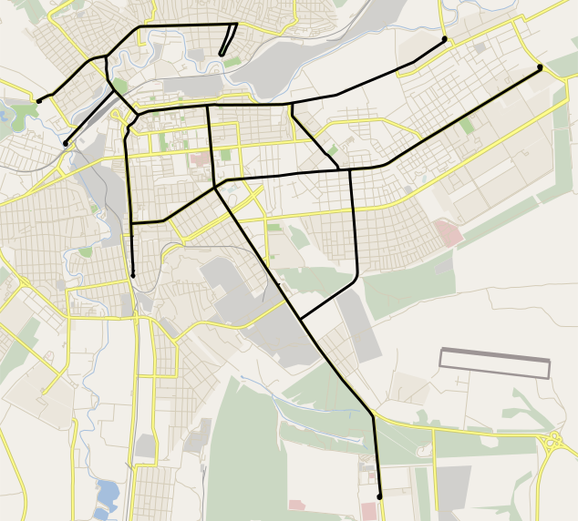
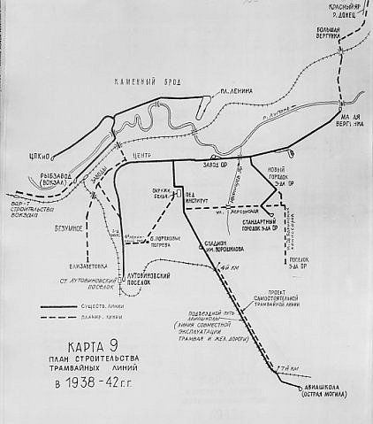

# Луганский трамвай

|                   |                           |
|-------------------|---------------------------|
|Страна             |ЛНР                        |
|Расположение       |Луганск                    |
|Дата открытия      |1 мая 1934 года            |
|Дата закрытия      |15 июля 2014 года          |
|Число маршрутов    |9                          |
|Число вагонов      |37                         |
|Основные типы ПС   |КТМ-5М3, КТМ-8, ЛТ-10, К-1 |
|Число депо         |1                          |
|Ширина колеи       |колея 1524 мм              |

Луганский трамвай — система общественного транспорта в Луганской области. Открыт 1 мая 1934 года. По состоянию на 7 октября 2011 года имелось 9 маршрутов, 92,2 км рельс, 1 депо и 37 вагонов.

Движение трамваев было приостановлено из-за боевых действий 15 июля 2014 года и не возобновлялось ввиду нерентабельности. В 2020 году часть путей была демонтирована. Фактически, система закрыта.

## Маршруты

|Маршрут    |Начальная остановка    |Конечная остановка |Период работы  |График работы (по времени отправления) |
|---|-----------------------|------------------|-------|----------|
|1  |3-й километр           |ХК "Лугансктепловоз"   |до 2014    |3-й километр - 05:40 - 17:08   ХК "Лугансктепловоз" - 05:18 - 16:46|
|2  |Кв. Дзержинского       |3-й километр	        |до 2014    |05:45 - 18:30, интервал - 25-50 мин.|
|3  |ХК "Лугансктепловоз"   |Малая Вергунка	        |до 2014    |05:30 - 17:40, интервал 30 мин.|
|3а |ХК "Лугансктепловоз"   |7-я проходная ХК "Лугансктепловоза"    |до 2000	|-  |
|4  |Пл. Ленина             |Техникум транспортного строительства           |до 2008    |-  |
|5  |Квартал Дзержинского   |ХК "Лугансктепловоз"   |в 2015 |06:00 - 17:00|
|6  |ХК "Лугансктепловоз"   |Областная больница     |до 2014    |05:20 - 19:45, интервал 9-18 мин.  |
|7  |ХК "Лугансктпеловоз"   |Парк Горького          |до 2014    |05:45 - 17:40, интервал 44 мин.    |
|8  |Квартал Дзержинского   |Автовокзал             |до 2014    |06:12 - 17:35, интервал 60 мин.    |
|10 |ХК "Лугансктепловоз"   |Автовокзал             |до 2014    |05:30 - 18:30, интервал 56 мин.    |
|11 |Кв. Дзержинского       |Техникум транспортного строительства       |до 2014    |05:50 - 18:30, интервал 90 мин.    |
|12 |Автовокзал             |Областная больница     |до 1995    |-  |
|13 |Автовокзал             |Техникум транспортного строительства       |до 2014    |05:50 - 19:20, интервал 32 мин.|
|14 |Пл. Ленина             |3-й километр           |до 90-х    |-  |
|15 |Автовокзал             |Пл. Ленина             |до 2011    |05:30 - 18:15, примерно интервал 77 мин.   |

## История

На заседании Городской думы в 1899 году был рассмотрен и отвергнут проект инженера Кульжинского о строительстве электрического трамвая.

Трамвайное движение в Луганске было открыто 1 мая 1934 года шестью моторными+прицепными вагонами Х Мытищинского производства по двуколейному маршруту № 1 протяжённостью 7,2 км «Паровозостроительный завод — Центр — пос. Алексеевское (сейчас — „3 км“)» по ул. Фрунзе, Шевченко, Ленина. Плата за проезд из конца в конец была установлена в 30 копеек, а до центра - 15 копеек. Позже был введен единый тариф 15 коп.[1]

7 ноября 1934 года введены 2 новые линии «Паровозостроительный завод — Городок Паровозостроительного завода» по ул. Гудованцева, ул. Лянгузова и ул. Дальневосточной, сюда пущен маршрут № 2 и «Паровозостроительный завод — Малая Вергунка» по ул. Фрунзе, пущен маршрут № 3. На последней линии строилось трамвайное депо.

### Маршруты на 1 января 1935 года

*   1 Паровозостроительный завод — пос. Алексеевское
*   2 Паровозостроительный завод — Городок Паровозостроительного завода
*   3 Паровозостроительный завод — Малая Вергунка

1 мая 1935 года введена новая изолированная линия на Каменном Броде протяжённостью 10,2 км «Вокзал — площ. Ленина (северные проходные Паровозостроительного завода)» по ул. Кирова, мост через реку Лугань, ул. Заречная, ул. Артёма, пущен маршрут № 4.

6 ноября 1935 года введена новая линия в центре города «ул. Шевченко — стадион имени Ворошилова (Жилкомбинат)» по ул. 14-я линия, ул. 4-я Донецкая, ул. Оборонная, сюда пущен маршрут № 5 «Стадион имени Ворошилова — пос. Алексеевское (пос. Лутовиновское)».

К концу 1935 года пущен новый маршрут № 6 «Паровозостроительный завод — Стадион имени Ворошилова».

18 марта 1936 года введена новая линия «ул. Заречная — Парк имени Ленина (Военный городок)» по ул. Артёма, пущен новый маршрут № 7 «Рыбзавод (Вокзал) — Парк имени Ленина (Военный городок)», а позже — маршрут № 8 «площ. Ленина — Парк имени Ленина (Военный городок)».

В 1936 году на изолированной каменнобродской линии построено депо № 2.

6 ноября 1937 года введена новая линия «Стадион имени Ворошилова — Острая Могила» по ул. Оборонной и Краснодонскому шоссе (линия частично использовала имеющуюся ж.-д. ветку к Авиашколе, полностью отдельной от ж.-д. линия стала в 1938 году), пущен маршрут № 9 «Стадион имени Ворошилова — Авиашкола».

В первой половине 1940-х годов закрыты маршруты № 2, № 3, № 6 и № 8, а пущены маршруты:

*   10 пос. Лутовиновское (пос. Алексеевское) — Городок Паровозостроительного завода (объединил маршруты № 1 и № 2)
*   11 Стадион имени Ворошилова — Малая Вергунка (объединил маршруты № 6 и № 3)
*   1 (продлён) пос. Лутовиновское (пос. Алексеевское) — Малая Вергунка (объединил маршруты № 1 и № 3)
*   5 (новый) Паровозостроительный завод — Стадион имени Ворошилова (бывший маршрут № 6)

### Маршруты на 1 января 1942 года

*   1 пос. Лутовиновское (пос. Алексеевское) — Малая Вергунка
*   4 Рыбзавод (Вокзал) — площ. Ленина
*   5 Паровозостроительный завод — Стадион имени Ворошилова
*   7 Рыбзавод (Вокзал) — Парк имени Ленина
*   9 Стадион имени Ворошилова — Авиагородок (Авиашкола)
*   10 пос. Лутовиновское (пос. Алексеевское) — Городок Паровозостроительного завода
*   11 Стадион имени Ворошилова — Малая Вергунка

С 17 июля 1942 года трамвайное движение было закрыто в связи с оккупацией города и разрушением электростанции.

К 1 января 1944 года восстановлена линия от пос. Лутовиновское («3-й км») до Паровозостроительного завода, но вагоны оставались неисправными. Движение по маршруту № 1 «пос. Лутовиновское („3-й км“) — Паровозостроительный завод» началось 25 марта 1944 года.

1 мая 1944 года восстановлена линия «Паровозостроительный завод — Малая Вергунка», пущен маршрут № 3.

В июне 1944 года восстановлена линия «Паровозостроительный завод — Городок Паровозостроительного завода», пущен маршрут № 2.

15 июля 1944 года восстановлена линия «ул. Шевченко — стадион имени Ворошилова (Жилкомбинат)», пущен маршрут № 6.

### Маршруты на 1 января 1945 года

*   1 Паровозостроительный завод — 3-й км (пос. Лутовиновское)
*   2 Паровозостроительный завод — Городок Паровозостроительного завода
*   3 Паровозостроительный завод — Малая Вергунка
*   6 Паровозостроительный завод — Стадион имени Ворошилова

19 октября 1945 года восстановлена каменнобродская линия «Вокзал (Рыбзавод) — площ. Ленина», пущен маршрут № 4.

20 ноября 1952 года восстановлена часть линии до Авиашколы «Стадион имени Ворошилова — Авторемзавод (комбината „Ворошиловградуголь“)», продлён маршрут № 6 «Паровозостроительный завод — Авторемзавод», позже открыт маршрут № 5 «3-й км — Авторемзавод».

4 ноября 1953 года продлена линия маршрутов № 5 и № 6 от Авторемзавода до Мебельной фабрики (сейчас — Автовокзал).

20 сентября 1954 года восстановлена линия ул. Заречная — Парк Горького (ранее — Парк имени Ленина), пущены маршруты:

*   7 Вокзал — Парк имени Горького
*   8 площ. Ленина — Парк имени Горького

### Маршруты на 1 января 1955 года

*   1 Паровозостроительный завод — 3-й км
*   2 Паровозостроительный завод — Городок Паровозостроительного завода
*   3 Паровозостроительный завод — Малая Вергунка
*   4 Вокзал — площ. Ленина
*   5 3-й км — Мебельная фабрика
*   6 Паровозостроительный завод — Мебельная фабрика
*   7 Вокзал — Парк имени Горького
*   8 площ. Ленина — Парк имени Горького

30 апреля 1957 года введена новая линия «ул. Лянгузова — ул. Сталинградская (сейчас — ул. Волгоградская)» по площ. Горького и ул. 26-ти Бакинских Комиссаров, пущен маршрут № 9 «3-й км — ул. Сталинградская».

В 1959 году маршруты № 6 и № 9 объединены в маршрут № 10 «Аккумуляторный завод (Мебельная фабрика) — ул. Сталинградская», маршруты № 6 и № 9 закрыты.

В декабре 1960 года маршруты № 1 и № 2 объединены в маршрут № 11 «3-й км — Городок Паровозостроительного завода», маршруты № 1 и № 2 закрыты.

В начале 1960-х годов закрыт маршрут № 8 «площ. Ленина — Парк имени Горького».

17 октября 1963 года введена новая линия (по довоенной трассе) «Аккумуляторный завод (сейчас — Автовокзал) — Острая Могила», пущен маршрут № 6 «Тепловозостроительный (ранее — Паровозостроительный) завод — Острая Могила», позже пущен новый маршрут № 12 «Аккумуляторный завод (Мебельная фабрика) — Острая Могила».

В середине 1960-х годов восстановлен маршрут № 9 «3-й км — ул. Волгоградская (ранее — ул. Сталинградская)».

### Маршруты на 1 января 1965 года

*   3 Тепловозостроительный завод — Малая Вергунка
*   4 Вокзал — площ. Ленина
*   5 3-й км — Аккумуляторный завод (Мебельная фабрика)
*   6 Тепловозостроительный завод — Острая Могила
*   7 Вокзал — Парк имени Горького
*   9 3-й км — ул. Волгоградская
*   10 Аккумуляторный завод (Мебельная фабрика) — ул. Волгоградская
*   11 3-й км — Городок Тепловозостроительного завода
*   12 Аккумуляторный завод (Мебельная фабрика) — Острая Могила

В 1965 году (?) закрыт маршрут № 12 «Аккумуляторный завод — Острая Могила».

В 1965 году линия от центра к стадиону имени Ворошилова и дальше до Аккумуляторного завода перенесена с 14-й линии на 15-ю линию в связи со строительством на площ. Героев ВОВ комплекса зданий Ворошиловградского областного совета.

4 ноября (по другим данным, 6 ноября) 1965 года введена новая линия «ул. Шевченко — ул. Кирова» по 7-й линии через новый железнодорожный путепровод: соединены две до этого времени изолированные трамвайные системы (городская и Каменнобродская). Пущены новые маршруты:

*   13 Вокзал — Автовокзал (ранее — Аккумуляторный завод)
*   14 3-й км — площ. Ленина
*   15 Парк имени Горького — Городок Тепловозостроительного завода

В начале 1968 года расширено депо № 1, а депо № 2 преобразовано в вагоноремонтные мастерские.

В 1966 году введена новая линия «Городок Тепловозостроительного завода — квартал „Дружба“ (сейчас — ул. Королёва)» по ул. Херсонской и ул. Ватутина, сюда продлены маршруты № 9 «3-й км — квартал „Дружба“» и № 15 «Парк имени Горького — квартал „Дружба“».

15 ноября 1967 года введена новая линия «Острая Могила — Медгородок (сейчас — Областная Больница)» по Краснодонскому шоссе (сейчас — ул. 50-летия Обороны Луганска), сюда продлён маршрут № 6 «Тепловозостроительный завод — Медгородок».

В 1968 году закрыта часть линии до Городка Тепловозостроительного завода по ул. Лунгузова и ул. Дальневосточной, маршрут № 11 закрыт.

6 ноября 1969 года введена новая линия «ул. Ленина — Цирк» по ул. Институтской (сейчас — ул. В. Сосюры), пущен маршрут № 2 «3-й км — Цирк».

### Маршруты на 1 января 1970 года

*   2 3-й км — Цирк
*   3 Тепловозостроительный завод — Малая Вергунка
*   4 Вокзал — площ. Ленина
*   5 3-й км — Автовокзал (Аккумуляторный завод)
*   6 Тепловозостроительный завод — Медгородок
*   7 Вокзал — Парк имени Горького
*   9 3-й км — квартал «Дружба» (площ. Обороны)
*   10 Автовокзал (Аккумуляторный завод) — ул. Волгоградская
*   13 Вокзал — Автовокзал (Аккумуляторный завод)
*   14 3-й км — площ. Ленина
*   15 Парк имени Горького — квартал «Дружба» (площ. Обороны)

В 1971 году перенесена линия из центра к автовокзалу с 15-й линии на 16-ю линию.

8 января 1973 года введена новая линия «ул. Оборонная — ул. Волгоградская» по ул. 26-ти Бакинских Комиссаров, пущен новый маршрут № 8 «Автовокзал — ул. Волгоградская — квартал „Дружба“ (площ. Обороны)» и перенаправлен маршрут № 10 «Автовокзал — ул. Волгоградская — Тепловозостроительный завод».

19 ноября 1977 года введена новая линия «Цирк — площ. Горького» по ул. Херсонской (соединилась с линиями на квартал «Дружба» и ул. Волгоградскую), маршрут № 2 продлён до квартала «Дружба»: «3-й км — ул. Сосюры — квартал „Дружба“».

1 октября 1979 года введена новая линия «квартал „Дружба“ (площ. Обороны) — квартал Дзержинского», продлены маршруты № 2, № 8, № 9 и № 15.

### Маршруты на 1 января 1980 года

*   2 3-й км — ул. Сосюры — квартал Дзержинского
*   3 Тепловозостроительный завод — Малая Вергунка
*   4 Вокзал (Техникум Транспортного строительства) — площ. Ленина
*   5 3-й км — Автовокзал
*   6 Тепловозостроительный завод — Медгородок
*   7 Вокзал (Техникум Транспортного строительства) — Парк имени Горького
*   8 Автовокзал — ул. Волгоградская — квартал Дзержинского
*   9 3-й км — квартал Дзержинского
*   10 Автовокзал — ул. Волгоградская — Тепловозостроительный завод
*   13 Вокзал (Техникум Транспортного строительства) — Автовокзал
*   14 3-й км — площ. Ленина
*   15 Парк имени Горького — квартал Дзержинского

В 1986 году начато строительство депо № 2 по ул. Волгоградской (не окончено, разобрано).

В 1990 году открыта новая линия «ул. Фрунзе — ул. Беломорская» по ул. Беломорской в районе Малой Вергунки, пущен новый маршрут № 3а «ПО „Тепловоз“ (ранее — Тепловозостроительный завод) — ул. Беломорская».

В 1990 году пущен маршрут № 12 «Автовокзал — Областная больница (Медгородок)».

В начале 1990-х годов закрыты маршруты № 5 и № 7.

В августе 1994 года маршрут № 15 разделён (закрыт) на маршрут № 7 «Парк имени Горького — ПО „Тепловоз“» и № 5 «ПО „Тепловоз“ — квартал Дзержинского», маршрут № 14 закрыт.

В первой половине 1990-х годов маршрут № 10 был продлён от ПО «Тепловоз» по ул. Оборонной до Автовокзала, став кольцевым.

### Маршруты на 1 января 1995 года

*   2 3-й км — ул. Сосюры — квартал Дзержинского
*   3 ПО «Тепловоз» — Малая Вергунка
*   3а ПО «Тепловоз» — ул. Беломорская
*   4 Вокзал (Техникум Транспортного строительства) — площ. Ленина
*   5 ПО «Тепловоз» — квартал Дзержинского
*   6 ПО «Тепловоз» — Областная больница
*   7 Парк имени Горького — ПО «Тепловоз»
*   8 Автовокзал — ул. Волгоградская — квартал Дзержинского
*   9 3-й км — квартал Дзержинского
*   10 Автовокзал — ул. Волгоградская — ПО «Тепловоз» — Автовокзал
*   12 Автовокзал — Областная больница
*   13 Вокзал (Техникум Транспортного строительства) — Автовокзал

В 1995 году закрыт маршрут № 12 «Автовокзал — Областная больница».

В апреле 1995 года закрыто движение по ул. Ленина от ул. Сосюры до 7-й линии в связи со строительством новой эстакады до нового ж.-д. вокзала, закрыт маршрут № 9 (до сентября 1998 года).

1 ноября 1995 года маршрут № 10 вновь вернулся к «восточному полукольцу»: «Автовокзал — ул. Волгоградская — ХК „Лугансктепловоз“ (ранее — ПО „Тепловоз“)».

Во второй половине 1990-х годов пущен маршрут № 15 «площ. Ленина — Автовокзал».

В 1997 году маршрут № 5 закрыт, открыт маршрут № 11 «Техникум Транспортного строительства — квартал Дзержинского».

С сентября 1998 года окончен ремонт трамвайного пути (с апреля 1995 года) у новой эстакады на ж.-д. вокзал, пущен маршрут № 1 «3-й км — ХК „Лугансктепловоз“».

В 2000 году закрыт маршрут № 3а «ХК „Лугансктепловоз“ — ул. Беломорская».

В первой половине 2000-х годов закрыт маршрут № 8 «Автовокзал — квартал Дзержинского».

### Маршруты на 1 января 2005 года

*   1 3-й км — ХК «Лугансктепловоз»
*   2 3-й км — ул. Сосюры — квартал Дзержинского
*   3 ХК «Лугансктепловоз» — Малая Вергунка
*   4 Техникум Транспортного строительства — площ. Ленина
*   6 ХК «Лугансктепловоз» — Областная больница
*   7 ХК «Лугансктепловоз» — Парк имени Горького
*   10 Автовокзал — ул. Волгоградская — ХК «Лугансктепловоз»
*   11 Техникум Транспортного строительства — квартал Дзержинского
*   13 Техникум Транспортного строительства — Автовокзал
*   15 площ. Ленина — Автовокзал

15 января 2008 года восстановлен маршрут № 8 «Автовокзал — квартал Дзержинского».

16 февраля 2008 года закрыто в связи с ремонтом движение трамвая в каменнобродскую сторону, маршруты № 11 и № 13 перенаправлены на 3-й км: «3-й км — квартал Дзержинского» и «3-й км — Автовокзал», закрыты маршруты:

*   1 3-й км — ХК «Лугансктепловоз»
*   4 Техникум Транспортного строительства — площ. Ленина
*   7 ХК «Лугансктепловоз» — Парк имени Горького
*   15 площ. Ленина — Автовокзал

16 июня 2009 года восстановлено движение в каменнобродскую сторону, 4 декабря 2009 года восстановлен маршрут № 1 «3-й км — ХК „Лугансктепловоз“», перенаправлены до Техникума Транспортного строительства маршруты:

*   11 Техникум Транспортного строительства — квартал Дзержинского
*   13 Техникум Транспортного строительства — Автовокзал

7 декабря 2009 года восстановлены маршруты:

*   7 ХК «Лугансктепловоз» — Парк имени Горького
*   15 площ. Ленина — Автовокзал

6 октября 2011 года закрыт маршрут № 15 из-за нехватки подвижного состава.

На начало 2012 года трамвайная система находилась в плохом состоянии. Интервал движения на линиях составлял час и больше. На большинстве маршрутов выпуск по одному вагону, на маршруте № 6 по два вагона. Пассажиров очень мало[2].

### Ситуация с 2014 года

15 июля 2014 года из-за военных действий трамвай закрыт на неопределённый срок. В июне 2015 года предпринимались попытки восстановить трамвайное движение, было выпущено 5 вагонов [3], но вскоре движение было приостановлено из-за нерентабельности и дефицита электроэнергии.

В октябре 2020 года власти города начали демонтаж трамвайных путей, в частности, на ул. Артема[1][4][5][6][7][8] и ул. Оборонной[9][10][11]. По состоянию на январь 2021 г. Луганское трамвайное депо на ул. Фрунзе безлюдно[12], персонал разбежался[13].

## Подвижной состав

По состоянию на 1 января 2010 года маршруты обслуживались вагонами типа:

*   КТМ-5М3 (32 вагона в рабочем состоянии из 199) с 1972 года
*   КТМ-8 (1 вагон) с 2004 года
*   ЛТ-10 (1 вагон из 8) с 1994 года
*   К-1 (4 вагона из 5) с 2004 года.

Ранее были также:

*   2-осные моторные Х (56 вагонов) в 1934—1968
*   2-осные прицепные М (58 вагонов) в 1934—1968
*   4-осные моторные (5 вагонов) в 1948—1962
*   КТМ-1/КТП-1 (34/34 вагонов) в 1952—1975
*   КТМ-2/КТП-2 (91/91 вагон) в 1962—1980
*   МТВ-82 (8 вагонов) в 1958—1979

----

1	Історія
2	Скасовані маршрути (з 1994 по 2008 роки)
3	Маршрути (до літа 2014 року)
4	Галерея
5	Див. також
6	Примітки
7	Посилання
8	Джерела

## Історія

Перший проект побудови електричної трамвайної системи у місті був запропонований інженером Кульжинським у 1899 році, проте був відхилений міською думою.

Луганський трамвай було відкрито 1 травня 1934 року. Довжина першої пускової ділянки склала близько семи кілометрів. До війни в місті курсувало 32 вагони типів М-34 та Х.

У 1949 році до Луганська з Москви надійшло 5 моторних вагонів Ф та причепних вагонів КП. Впродовж 1950-их років до міста надійшло 30 вагонів типу КТМ/КТП-1, які здійснювали рейси до 1977 року, та близько 90 типу КТМ/КМП-2, що були на ходу до початку 1980-их років. З 1994 року на міських маршрутах курсують трамваї типу ЛТ-10, з 2004 року — вагони типу К-1.

Станом на 1 січня 2010 року на балансі експлуатуючого підприємства перебувало 9 службових і 38 пасажирських вагонів, з яких: 71-605 — 32 одиниці, 71-608К — 1, К-1 — 4, ЛТ-10 — 1[2].

Через війну на сході України з літа 2014 року рух трамваїв припинено, а контактну мережу демонтовано. 5 червня 2015 року було запущено трамвай на маршруті № 5, однак, вже 7 червня рух було знову зупинений. За словами представників «ЛНР», які контролюють місто з 2014 року, поновлення трамвайного руху у місті не планується через низьку рентабельність[3].

## Скасовані маршрути (з 1994 по 2008 роки)

|№ маршруту |Початковий пункт   |Кінцевий пункт	    |Довжина (км)   |Примітки   |
|---|---------------|---|---|---|
|4	|Площа Леніна   |Технікум транспортного будівництва |   |Закритий 2 лютого 2008[4]|
|9	|Квартал Дзержинського  |3-й кілометр   |   |Закритий 1995 року[5]|
|12	|Автовокзал     |Обласна лікарня    |   |Працював протягом 1967-1970-х та в 1990—1994 роках[6]|
|14	|3-й кілометр   |Площа Леніна   |   |Існував протягом 1965—1994 років[7]|
|15	|Автовокзал     |Площа Леніна   |20,5[8]    |   |

## Маршрути (до літа 2014 року)

Станом на 2014 рік в Луганську діяло 9 регулярних трамвайних маршрутів.

|№ маршруту	|Початковий пункт	|Кінцевий пункт	|Довжина (км)	|Примітки|
|---|---|---|---|---|
|1	|Луганськтепловоз	    |3-й кілометр	|11,4[9]	|1 вагон на маршруті[10]|
|2	|Квартал Дзержинського	|3-й кілометр	|19,7[11]	|   |
|3	|Луганськтепловоз	    |Мала Вергунка	|8,5[12]	|Працює з перебоями[10]|
|6	|Луганськтепловоз	    |Обласна лікарня	|19,5[13]	|   |
|7	|Луганськтепловоз	    |Парк Горького	|10,7[14]	|1 вагон на маршруті[10]|
|8	|Квартал Дзержинського	|Автовокзал		|   |1 вагон на маршруті[10]|
|10	|Луганськтепловоз	    |Автовокзал	    |14,3[15]	|   |
|11	|Квартал Дзержинського	|Технікум транспортного будівництва	|23,2[16]	|1 вагон на маршруті[10]|
|13	|Технікум транспортного будівництва	|Автовокзал	|14,9[17]	|   |

## Галерея

Вагон Х №4 біля Будинку Васньова, 1930-ті

 

Вагон КТМ-1 на вул.Коцюбинського, 1960-ті

 

Вагон КТМ-5 №192

 

KTM-8-200

 

Трамвайна колія на вул.Леніна

 

Трамвай маршруту №1 на вулиці Шевченка

 

Квиток для проїзду в міських трамваях

 

Типовий інтер'єр луганських трамваїв

Див. також
Луганський трамвай
у сестринських Вікіпроєктах
П:	Портал «Луганщина»
П:	Проєкт «Луганщина»
CMNS:	Луганський трамвай у Вікісховищі?
Транспорт Луганська
Луганський тролейбус
Луганський автобус
Примітки
 Луганський трамвай Архівовано 7 травня 2012 у Wayback Machine.(рос.)
 Інвентарний парк пасажирських трамвайних вагонів станом на 01.01.2010. Офіційна статистика. Луганськ. Сайт «Міський транспорт». Архів оригіналу за 28 лютого 2008. Процитовано 3 квітня 2010.
 Электротранспорт в «ЛНР»: исчезающие плоды цивилизации. Informator. 17 березня 2017. Архів оригіналу за 6 вересня 2018. Процитовано 3 травня 2017.(рос.)
 Маршрут № 4[недоступне посилання з липня 2019](рос.)
 Маршрут № 9[недоступне посилання з липня 2019](рос.)
 Маршрут № 12[недоступне посилання з липня 2019](рос.)
 Маршрут № 14[недоступне посилання з липня 2019](рос.)
 http://lugansktrams.org.ua/route/tram/15/ Архівовано 4 березня 2016 у Wayback Machine. Маршрут № 15](рос.)
 Маршрут № 1[недоступне посилання з квітня 2019](рос.)
 Розклад руху трамваїв у Луганську Архівовано 4 серпня 2012 у Wayback Machine.(рос.)
 Маршрут № 2 Архівовано 13 червня 2012 у Wayback Machine.(рос.)
 Маршрут № 3[недоступне посилання з квітня 2019](рос.)
 Маршрут № 6[недоступне посилання з квітня 2019](рос.)
 Маршрут № 7[недоступне посилання з квітня 2019](рос.)
 Маршрут № 10[недоступне посилання з квітня 2019](рос.)
 Маршрут № 11[недоступне посилання з квітня 2019](рос.)
 Маршрут № 13[недоступне посилання з квітня 2019](рос.)

----
	сообщение 1.4.2009, 11:15
Сообщение #1

Группа: Администратор
Сообщений: 1046
Регистрация: 18.2.2009
Пользователь №: 2

Не считая всех допостроечных перспектив расширения линий, можно выделить две основные даты, когда наиболее масштабно закладывались планы развития трамвая. Это 1937й года, и начало 1970-х. Было разработано много перспективных направлений, большая часть которых, по разным причинам, осталась непостроенной.

В 1937 г. был разработан план расширения Луганского трамвая в III-ей пятилетке (1938-42 г.г.). Им, в частности, предусматривалось следующее расширение сети:

"Городской трамвай. Трамвай ходит в Малую Вергунку, городок завода "ОР", жилкомбинат. Трамвай работает неудовлетворительно. В плане третьей пятилетки необходимо предусмотреть строительство трамвайных путей: Вокзальная улица – улица Шевченко-3 км с постройкой капитального моста через железную дорогу; городок завода "ОР" через Иванищев яр – городок завода №60 – пединститут (7 км); малый базар – завод имени Косиора – завод имени Артёма с выходом на Ленинскую улицу – Лутовиновский поселок (7 км); ветка от завода имени Артёма на поселок Елизаветовка (4 км); от стандартных домов завода "ОР" до нового района индивидуального строительства (4 км); от межрайбольницы в направлении участка бывших пороховых погребов с соединением на улицу Ленина (6 км); от вокзала вдоль железной дороги по направлению к Родаково с постройкой моста через р. Ольховку (4 км). Итого 35 км. Необходимо также провести линию к местам летнего отдыха на Донце длиной 12 км с охватом жителей Большой Вергунки. Таким образом, до конца 1942 г. надо построить 47 км пути и довести его до 101 км. К концу 1942 г. надо иметь 140-150 трамваев; построить 4 ртутно-выпрямительных подстанции." (Ворошиловградская правда. – 1937. – 16 июня. – с.3)"

Таким образом, планировалось пустить трамвай в Большую Вергунку (не раз возникавшие планы ещё вплоть до 1970х), в район нынешнего завода Пархоменко, развить трамвай в Городке завода ОР, в части нынешнего центра. Однако эти планы так и остались нереализованными, хотя в 1939 г. планировалось приступить к строительству линии до заводов Пархоменко и Артема.

Схема планируемых линий:
 Уменьшено до 91%
Прикрепленное изображение
903 x 1024 (212.49 килобайт)

В начале 1960-х гг. намечалось построить еще несколько трасс, отвечающих потребностям динамично развивающегося города:

от Городка завода ОР – через Иванищев Яр по Херсонской и Институтской улицам до ул. Ленина (еще из плана 1950 г.);
от 3-го километра до пос. Тельмана к планировавшейся стройке завода кузнечно-прессового оборудования (тоже из плана 1950 г.);
от кольца в Малой Вергунке до Большой Вергунки (как часть линии на р. Донец, намечаемой еще планом 1929 г.)

В эти годы в Малой Вергунке неподалеку от кольца маршрута №3 на Лугани была построена плотина, в бетонное полотно которой были вмонтированы рельсы для будущей линии на Б. Вергунку (они сохранились до настоящего времени).
Эти планы оказались нереальными: строительство первой линии было отложено еще на несколько лет, а другие по разным причинам никогда построены не были.

Также примерно в это время существовали планы строительства трамвайной линии в Камброде, по ул. 395-й шахтерской дивизии, для чего при капитальном ремонте моста через Лугань в новый были вмонтированы рельсы, которые также сохранились и по сей день.

В середине 70-х годов рассматриваются новые планы перспективного развития городского транспорта в Луганске, которые предусматривали прокладку трамвайных линий по ул. Смоленской, Машиностроительной, Волгоградской, троллейбуса по ул. Феликса (ныне – Буденного), завершение строительства трамвайной линии от ул. Ленина до восточной окраины. Намечалось также преобразование некоторых существующих линий в линии скоростного трамвая с подземными и полуподземными участками, а, кроме того, создание надежной связи с Каменным Бродом: 2-х уровневой транспортной эстакады над заводом им. Ленина и железной дорогой от пл. Борцов Революции до ул. Рабочая. На нижний ярус эстакады должен был выйти трамвай из тоннеля под 14-й линией. Планировалась постройка еще одной грандиозной эстакады с трамвайной линией от ул. Фрунзе (в районе ДК им. Ленина) до площади Ленина.

Как и в прошлые годы, большая часть этих интересных планов осталась на бумаге. Троллейбусную линию по ул. Феликса (Буденного) открыли в 1982 г., а в "трамвайной" части плана удалось лишь завершить широтную линию от ул. Ленина до восточных жилмассивов.

В 1992 г. было принято решение о строительстве трамвайной линии в пригородный посёлок Видное (на юге города). На трассе даже провели вырубку леса по будущему маршруту и отсыпали часть насыпи, но к сожалению на этом работы заморозились. Правда в последнее время всё больше говорят о том, что возможно линия всё-таки будет достроена.

Как итог, можно сказать, что если бы были реализованы хотя бы некоторые интересные планы, намеченные для реализации намечающихся важных пассажиропотоков, сейчас бы город обладал эффективным и гибким транспортом.

--------------------
Сайт "Луганский трамвай" - информация о транспорте Луганска
Перейти в начало страницы
 
+Цитировать сообщение
tvs.vitalik
сообщение 2.4.2009, 20:30
Сообщение #2

Группа: Участники
Сообщений: 134
Регистрация: 8.3.2009
Пользователь №: 68

Цікава інформація)
Плани, як завжди, великі були...
п.с. Як будуть якісь фотки "мертвих" трамвайних ліній, хотів би побачити, а особливо цікаво про "неподалеку от кольца маршрута №3 на Лугани была построена плотина, в бетонное полотно которой были вмонтированы рельсы для будущей линии на Б. Вергунку (они сохранились до настоящего времени)."
п.п.с. А хіба до Видного великий пасажиропотік, що туди планувався трамвай?
Перейти в начало страницы
 
+Цитировать сообщение
FlasH
сообщение 2.4.2009, 21:44
Сообщение #3

Группа: Администратор
Сообщений: 1046
Регистрация: 18.2.2009
Пользователь №: 2

Цитата(tvs.vitalik @ 2.4.2009, 19:30) *
Цікава інформація)
Плани, як завжди, великі були...
п.с. Як будуть якісь фотки "мертвих" трамвайних ліній, хотів би побачити, а особливо цікаво про "неподалеку от кольца маршрута №3 на Лугани была построена плотина, в бетонное полотно которой были вмонтированы рельсы для будущей линии на Б. Вергунку (они сохранились до настоящего времени)."
п.п.с. А хіба до Видного великий пасажиропотік, що туди планувався трамвай?

Я вот тоже очень хочу найти хоть одно фото линий, закрытых, не относя к этому числу нынешние камбродские... Таковых в принципе две - отросточек на Городке Завода ОР по Дальневосточной и №3А. Особенно последний, наверное, интересен...

Есть фотографии рельс на мосту по ул. 395й шахтерской дивизии, фотографий рельс на вергуночном мосту нет, вроде бы. Но, думаю, как только смогу - обязательно сделаю. А может у кого-то кроме меня есть??

До Видного пассажиропоток может быть и не такой большой, но в той же стороне аэропорт, поэтому иметь надежное транспортное сообщение с ним было приоритетно. А трамвай туда должен был обойтись наверное выгоднее, учитывая тот факт, что он ближе к точке, чем троллейбус, на несколько километров!

--------------------
Сайт "Луганский трамвай" - информация о транспорте Луганска
Перейти в начало страницы
 
+Цитировать сообщение
tvs.vitalik
сообщение 3.4.2009, 12:53
Сообщение #4

Группа: Участники
Сообщений: 134
Регистрация: 8.3.2009
Пользователь №: 68

Цитата(FlasH @ 2.4.2009, 22:44) *
Я вот тоже очень хочу найти хоть одно фото линий, закрытых, не относя к этому числу нынешние камбродские... Таковых в принципе две - отросточек на Городке Завода ОР по Дальневосточной и №3А. Особенно последний, наверное, интересен...

Есть фотографии рельс на мосту по ул. 395й шахтерской дивизии, фотографий рельс на вергуночном мосту нет, вроде бы. Но, думаю, как только смогу - обязательно сделаю. А может у кого-то кроме меня есть??

До Видного пассажиропоток может быть и не такой большой, но в той же стороне аэропорт, поэтому иметь надежное транспортное сообщение с ним было приоритетно. А трамвай туда должен был обойтись наверное выгоднее, учитывая тот факт, что он ближе к точке, чем троллейбус, на несколько километров!

Десь точно бачив інформацію з фотографіями про маршрут №3а. Знайду - дам зсилку smile.gif
Перейти в начало страницы
 
+Цитировать сообщение
tvs.vitalik
сообщение 3.4.2009, 12:58
Сообщение #5

Группа: Участники
Сообщений: 134
Регистрация: 8.3.2009
Пользователь №: 68

О, знайшов!!!
http://www.lugansktrams.ucoz.ua/index/0-42 - щось трохи є smile.gif)
Мені дуже сподобалась інформація)
Перейти в начало страницы
 
+Цитировать сообщение
tvs.vitalik
сообщение 3.4.2009, 13:08
Сообщение #6

Группа: Участники
Сообщений: 134
Регистрация: 8.3.2009
Пользователь №: 68

п.с. До попередньої зсилки: а чиї ж ці фотки??? smile.gif
Перейти в начало страницы
 
+Цитировать сообщение
FlasH
сообщение 3.4.2009, 16:30
Сообщение #7

Группа: Администратор
Сообщений: 1046
Регистрация: 18.2.2009
Пользователь №: 2

А это мои :-)

Статья со старого сайта, сюда пока решил не переносить - придёт время - лучше перепишу.

Я имел ввиду то, что неплохо бы найти фотографии вагонов маршрута №3а, на этой ветке...

--------------------
Сайт "Луганский трамвай" - информация о транспорте Луганска
Перейти в начало страницы
 
+Цитировать сообщение
tvs.vitalik
сообщение 3.4.2009, 17:38
Сообщение #8

Группа: Участники
Сообщений: 134
Регистрация: 8.3.2009
Пользователь №: 68

Цитата(FlasH @ 3.4.2009, 17:30) *
А это мои :-)

Статья со старого сайта, сюда пока решил не переносить - придёт время - лучше перепишу.

Я имел ввиду то, что неплохо бы найти фотографии вагонов маршрута №3а, на этой ветке...

Знайти б тут фото вагонів - дійсно було б дуже цікаво)
Перейти в начало страницы
 
+Цитировать сообщение
burlik
сообщение 29.1.2010, 22:02
Сообщение #9

Группа: Участники
Сообщений: 1065
Регистрация: 8.12.2009
Из: Луганск
Пользователь №: 163

В середине 70-х годов был принят "План социально-экономического развития города Ворошиловграда на 1976-1980 гг и прогноз до 1990 года"
В этом документе есть раздел посвященный электротранспорту. И вот что там говорят о строительстве новых линий:
-ТРАМВАЙ-
-пл Горького-ул Херсонская ( сделано)
-пл Обороны-ул Ленинградская
-ул Ленина-жд вокзал
-ул Волгоградская-трикотажная фабрика
-ул Волгоградская-новое депо
-3 й километр-пос Тельмана
новое трамвайное депо на 150 машиномест по ул 26 Бак комиссаров
новое трамвайное депо на 100 машиномест в Каменнобродском районе

-ТРОЛЛЕЙБУС-
-кв Гагарина-трикотажная фабрика(1973-1975)
-по ул Буденного (1976-1980) сделано в конце 1982-го
-ул Советская-горбольница №3-новое депо (1976-1980)
-ул Машиностроительная-Королева-Ватутина (1976-1980)
-кв Гаевого-шахта Луганская (1981-1985) сделано в 1983-м
-ул Советская-новый жд вокзал (1981-1985)
-ул Советская-главная проходная завода ОР (1981-1985)
-новое депо-автовокзал (1986-1990)
-жд вокзал-новый путепровод-парк Горького-парк 1 Мая (1986-1990)
новое троллейбусное депо на 200 машиномест в Артемовском районе
-
-
Перейти в начало страницы
 
+Цитировать сообщение
Meteor
сообщение 30.1.2010, 17:36
Сообщение #10

Группа: Участники
Сообщений: 630
Регистрация: 15.4.2009
Пользователь №: 81

Цитата
-ул Волгоградская-новое депо

сделано.

Цитата
-ул Волгоградская-трикотажная фабрика

похоже на правду.
1) есть предусмотренный газон на ул. 30 лет Победы
2) Рельеф маршрута - плоскость, что облегчает строит-монтажные и подготовительные работы.
3) нет помехи троллейбусам, автобусам.
4) кратчайший путь от промышленного юга города (Водоканал, Аккумулятор, ДСК, Асфальтобетон, ПТИМАШ, 2 училища, 3 проектных института) до верхневосточных кварталов. (Время трамвая в пути по маршруту Трикотажка-Автовокзал оцениваю в 20 минут).

Для сравнения, сейчас маршрутка №132 от кв. Волкова до Автовокзала следует 18-20 минут.
Перейти в начало страницы
 
+Цитировать сообщение
burlik
сообщение 30.1.2010, 19:40
Сообщение #11

Группа: Участники
Сообщений: 1065
Регистрация: 8.12.2009
Из: Луганск
Пользователь №: 163

А если бы объединить линии трамвая от трикотажки до Дзержинского: интересно- какие бы маршруты ходили ?
Перейти в начало страницы
 
+Цитировать сообщение
FlasH
сообщение 30.1.2010, 21:56
Сообщение #12

Группа: Администратор
Сообщений: 1046
Регистрация: 18.2.2009
Пользователь №: 2

Так трамвай вниз по Смоленской тоже предусматривался. Плюс должно было быть две улицы с односторонним движением в посёлке завода ОР - по Волгоградской в сторону 26 Бакинских Комиссаров и по Нахимова назад, в сторону Якира.

Скорее всего маршрут, связывающий верх восточных кварталов с заводом и центром. Либо "Трикотажная фабрика - Автовокзал" (по центру, мимо завода ОР), либо "Трикотажная фабрика - завод ОР" и возможно всё-таки что-то до центра или хотя бы примерно - например до Автовокзала по южной части.

